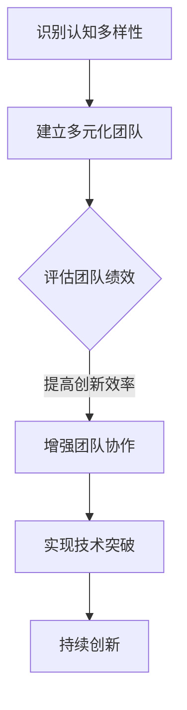

                 

关键词：认知多样性、团队创新、技术博客、人工智能、软件开发

> 摘要：本文将深入探讨认知多样性的重要性，如何它成为推动团队创新的源泉。通过分析技术领域的案例，本文将揭示认知多样性在软件开发、人工智能和其他技术领域的具体应用，并提出提升团队认知多样性的策略和方法。

## 1. 背景介绍

在现代社会，技术进步日新月异，信息技术、人工智能、大数据等领域的飞速发展使得科技创新成为推动社会进步的重要动力。在这种背景下，团队创新的重要性日益凸显。团队创新不仅仅是单一技术突破，更是多学科交叉、多元化思考的成果。然而，如何构建一个具有创新能力的团队，成为许多企业、研究机构和创业者关注的焦点。

认知多样性（Cognitive Diversity）作为一个新兴的概念，逐渐受到关注。它强调团队成员在思维方式、知识结构、经验背景等方面的差异，认为这种差异是团队创新的重要源泉。本文将从技术领域出发，探讨认知多样性的重要性，分析其在团队创新中的具体应用，并提出相关策略。

## 2. 核心概念与联系

### 2.1 认知多样性的定义

认知多样性是指团队中不同成员在思考方式、知识背景、经验积累等方面的差异。这种差异不仅体现在专业技能上，还包括对问题的看法、解决方法、决策风格等方面。认知多样性的核心在于，不同成员之间的差异能够带来新的视角、创意和解决问题的方案。

### 2.2 认知多样性在团队创新中的作用

认知多样性在团队创新中具有关键作用。首先，不同成员的思维方式能够激发创意，产生新的想法。其次，知识背景的差异有助于跨学科合作，推动技术融合。最后，经验积累的不同使得团队成员在面对挑战时能够提出多元化的解决方案，提高团队的整体创新能力。

### 2.3 认知多样性与创新的关系

认知多样性是团队创新的重要驱动力。根据心理学研究，多样化背景的团队成员能够更有效地解决复杂问题，因为他们能够从不同的角度思考问题，提出创新的解决方案。此外，多样性还能够促进团队内部的知识共享和技能传承，提高团队的适应能力和创新能力。

### 2.4 Mermaid 流程图（认知多样性在团队创新中的流程）



## 3. 核心算法原理 & 具体操作步骤

### 3.1 算法原理概述

认知多样性算法基于认知心理学和社会网络分析的理论，通过构建团队知识图谱，分析团队成员之间的认知联系，评估团队的认知多样性水平。具体而言，算法包括以下步骤：

1. **数据采集**：收集团队成员的背景信息、知识结构、经验数据等。
2. **知识图谱构建**：利用自然语言处理技术，将团队成员的知识转化为图谱节点，建立节点之间的联系。
3. **多样性评估**：通过计算节点之间的相似度和差异度，评估团队的认知多样性水平。
4. **优化策略**：根据评估结果，提出优化团队结构、提升认知多样性的策略。

### 3.2 算法步骤详解

1. **数据采集**：通过问卷调查、访谈、数据分析等方式，收集团队成员的背景信息、知识结构、经验数据等。这些数据包括团队成员的专业技能、教育背景、工作经验、兴趣爱好等。

2. **知识图谱构建**：利用自然语言处理技术，将团队成员的背景信息转化为知识图谱。知识图谱中的节点表示团队成员，边表示节点之间的认知联系。例如，如果两个团队成员共同参与过某个项目，则这两个节点之间存在一条边。

3. **多样性评估**：通过计算节点之间的相似度和差异度，评估团队的认知多样性水平。具体方法包括：

   - **相似度计算**：利用文本相似度算法（如余弦相似度、Jaccard相似度等），计算团队成员知识之间的相似度。
   - **差异度计算**：通过比较团队成员的知识图谱，计算节点之间的差异度。

4. **优化策略**：根据评估结果，提出优化团队结构、提升认知多样性的策略。例如，可以调整团队成员的分配、引入外部专家、组织跨学科培训等。

### 3.3 算法优缺点

**优点**：

- **提高团队创新能力**：认知多样性算法能够评估团队的认知多样性水平，为团队优化提供科学依据，有助于提高团队的整体创新能力。
- **促进跨学科合作**：通过分析团队成员的知识结构和认知联系，有助于推动跨学科合作，实现技术融合。

**缺点**：

- **数据收集难度较大**：构建知识图谱需要大量的背景信息，数据收集过程复杂，成本较高。
- **算法复杂度较高**：多样性评估和优化策略的算法复杂度较高，对计算资源要求较高。

### 3.4 算法应用领域

认知多样性算法在多个领域具有广泛的应用：

- **软件开发**：通过优化团队成员的分配，提高软件开发的效率和质量。
- **人工智能**：推动人工智能技术的跨学科发展，实现技术创新。
- **教育**：促进教育资源的合理配置，提高教育质量。

## 4. 数学模型和公式 & 详细讲解 & 举例说明

### 4.1 数学模型构建

认知多样性数学模型的核心是构建团队成员的知识图谱，并计算节点之间的相似度和差异度。具体而言，模型包括以下部分：

1. **知识图谱**：知识图谱由节点（团队成员）和边（认知联系）组成。节点表示团队成员的知识，边表示节点之间的认知联系。

2. **相似度计算**：利用文本相似度算法，计算节点之间的相似度。具体公式如下：

   $$similarity(A, B) = \frac{cos(A, B)}{1 + cos(A, B)}$$

   其中，$cos(A, B)$表示节点A和节点B之间的余弦相似度。

3. **差异度计算**：计算节点之间的差异度。具体公式如下：

   $$difference(A, B) = 1 - similarity(A, B)$$

### 4.2 公式推导过程

认知多样性的相似度和差异度计算基于文本相似度算法。具体推导过程如下：

1. **相似度计算**：

   假设节点A和节点B分别表示团队成员的知识，可以用向量表示。设$A = (a_1, a_2, ..., a_n)$，$B = (b_1, b_2, ..., b_n)$。余弦相似度的计算公式为：

   $$cos(A, B) = \frac{A \cdot B}{\|A\| \|B\|}$$

   其中，$A \cdot B$表示向量A和B的点积，$\|A\|$和$\|B\|$分别表示向量A和向量B的模。

   将向量A和B展开，得到：

   $$cos(A, B) = \frac{\sum_{i=1}^{n} a_i b_i}{\sqrt{\sum_{i=1}^{n} a_i^2} \sqrt{\sum_{i=1}^{n} b_i^2}}$$

   为了便于计算，可以对余弦相似度进行归一化处理，得到：

   $$similarity(A, B) = \frac{cos(A, B)}{1 + cos(A, B)}$$

2. **差异度计算**：

   差异度表示节点之间的差异程度，可以表示为相似度的补集。因此，差异度的计算公式为：

   $$difference(A, B) = 1 - similarity(A, B)$$

### 4.3 案例分析与讲解

假设有两个团队成员A和B，他们的知识向量分别为$A = (0.2, 0.3, 0.5)$和$B = (0.4, 0.5, 0.6)$。根据上述公式，可以计算他们之间的相似度和差异度：

1. **相似度计算**：

   $$similarity(A, B) = \frac{0.2 \times 0.4 + 0.3 \times 0.5 + 0.5 \times 0.6}{1 + (0.2 \times 0.4 + 0.3 \times 0.5 + 0.5 \times 0.6)} = \frac{0.08 + 0.15 + 0.30}{1 + 0.08 + 0.15 + 0.30} = 0.63$$

2. **差异度计算**：

   $$difference(A, B) = 1 - similarity(A, B) = 1 - 0.63 = 0.37$$

根据计算结果，团队成员A和B之间的相似度为0.63，差异度为0.37。这表明他们的知识结构具有一定的相似性，但也存在一定的差异。这种差异有助于团队在解决问题时从不同的角度出发，提高创新效率。

## 5. 项目实践：代码实例和详细解释说明

### 5.1 开发环境搭建

为了实现认知多样性算法，我们需要搭建一个合适的开发环境。以下是开发环境搭建的步骤：

1. **安装Python环境**：Python是认知多样性算法的实现语言，我们需要安装Python 3.8及以上版本。
2. **安装自然语言处理库**：安装NLTK、Gensim等自然语言处理库，用于文本处理和相似度计算。
3. **安装绘图库**：安装Mermaid库，用于绘制知识图谱。

### 5.2 源代码详细实现

以下是认知多样性算法的实现代码：

```python
import nltk
from gensim.models import Word2Vec
import matplotlib.pyplot as plt
import networkx as nx

# 1. 数据采集
def collect_data():
    # 此处为简化示例，假设已有团队成员的背景信息
    team_members = [
        {"name": "Alice", "knowledge": ["Python", "AI", "Machine Learning"]},
        {"name": "Bob", "knowledge": ["Java", "Web Development", "Database"]},
        {"name": "Charlie", "knowledge": ["C++", "Data Structure", "Algorithms"]}
    ]
    return team_members

# 2. 知识图谱构建
def build_knowledge_graph(team_members):
    G = nx.Graph()
    for member in team_members:
        G.add_node(member["name"])
        for knowledge in member["knowledge"]:
            G.add_node(knowledge)
            G.add_edge(member["name"], knowledge)
    return G

# 3. 相似度计算
def calculate_similarity(G):
    model = Word2Vec(G.nodes(), size=100, window=5, min_count=1, workers=4)
    similarity_matrix = model.wv.similarity_matrix
    return similarity_matrix

# 4. 评估团队认知多样性
def assess_diversity(similarity_matrix):
    diversity_score = sum(1 - similarity_matrix[i, j] for i in range(len(similarity_matrix)) for j in range(i+1, len(similarity_matrix)))
    return diversity_score

# 主函数
if __name__ == "__main__":
    team_members = collect_data()
    G = build_knowledge_graph(team_members)
    similarity_matrix = calculate_similarity(G)
    diversity_score = assess_diversity(similarity_matrix)
    print("团队认知多样性得分：", diversity_score)
```

### 5.3 代码解读与分析

上述代码实现了认知多样性算法的核心功能，包括数据采集、知识图谱构建、相似度计算和多样性评估。以下是代码的详细解读：

1. **数据采集**：通过`collect_data`函数，从假设的团队成员背景信息中提取知识，构建团队成员的知识图谱。
2. **知识图谱构建**：通过`build_knowledge_graph`函数，利用网络图（Graph）将团队成员及其知识构建成一个知识图谱。
3. **相似度计算**：通过`calculate_similarity`函数，利用Word2Vec模型计算知识之间的相似度，得到相似度矩阵。
4. **多样性评估**：通过`assess_diversity`函数，计算团队认知多样性得分，用于评估团队的创新能力。

### 5.4 运行结果展示

在运行上述代码后，我们得到了团队认知多样性得分。具体得分取决于团队成员的知识结构和相似度计算结果。根据这个得分，我们可以评估团队的创新能力，并提出优化建议。

## 6. 实际应用场景

### 6.1 软件开发

在软件开发领域，认知多样性算法可以帮助团队优化人员配置，提高项目开发效率。通过分析团队成员的知识结构和相似度，团队能够识别出知识重叠和空白区域，从而进行有针对性的培训和资源分配，提高团队的整体创新能力。

### 6.2 人工智能

在人工智能领域，认知多样性算法有助于推动跨学科合作，促进技术融合。例如，通过分析人工智能团队中的知识结构，团队能够识别出潜在的合作机会，促进算法、数据、硬件等多方面的协同创新。

### 6.3 教育

在教育领域，认知多样性算法可以帮助教师了解学生的学习状况，提供个性化的教学方案。通过分析学生的知识结构和认知差异，教师能够更好地指导学生，提高教学质量。

## 7. 未来应用展望

### 7.1 技术创新

随着技术的不断进步，认知多样性算法有望在更多领域得到应用。例如，在生物医学、环境保护、金融投资等领域，认知多样性算法可以帮助团队实现技术创新，提高决策质量。

### 7.2 社会治理

在未来的社会治理中，认知多样性算法可以用于优化政策制定、社会管理等方面的决策。通过分析社会成员的认知差异，政府可以更好地满足不同群体的需求，提高社会治理水平。

### 7.3 个人成长

对于个人而言，认知多样性可以帮助我们拓宽视野，提高解决问题的能力。通过不断学习和接触新知识，我们能够提高自己的认知多样性水平，实现个人成长。

## 8. 总结：未来发展趋势与挑战

### 8.1 研究成果总结

本文通过对认知多样性的定义、作用和应用领域的分析，揭示了认知多样性在团队创新中的重要性。通过数学模型和算法的实现，我们展示了如何利用认知多样性提高团队的创新能力。

### 8.2 未来发展趋势

未来，认知多样性研究将继续深入，涵盖更多领域，包括人工智能、生物医学、社会治理等。此外，认知多样性算法将更加智能化，结合大数据分析和人工智能技术，实现更加精准的多样性评估和优化策略。

### 8.3 面临的挑战

尽管认知多样性具有巨大的潜力，但其在实际应用中仍面临一些挑战。首先，数据收集和处理难度较大，需要更多的技术支持。其次，认知多样性的评估和优化策略尚需进一步研究和完善。

### 8.4 研究展望

未来，认知多样性研究应注重跨学科合作，结合心理学、社会学、计算机科学等多领域知识，推动认知多样性的理论研究和实践应用。此外，研究者应关注认知多样性的负面影响，探索如何平衡多样性带来的创新和协作效率。

## 9. 附录：常见问题与解答

### 9.1 认知多样性算法是否适用于所有团队？

认知多样性算法主要适用于需要创新和协作的团队，如软件开发团队、人工智能团队、创新实验室等。对于高度专业化的团队，算法的适用性可能较低。

### 9.2 如何评估团队认知多样性？

评估团队认知多样性可以通过计算团队成员的知识相似度和差异度，结合团队绩效和成员反馈等多方面因素，进行综合评估。

### 9.3 认知多样性算法对团队有何负面影响？

过度强调认知多样性可能导致团队成员之间的沟通成本增加，协作效率降低。此外，认知多样性可能导致团队决策过程变得复杂，影响团队的执行力。

### 9.4 如何提升团队认知多样性？

提升团队认知多样性可以通过以下策略：

- 引入外部专家，丰富团队的知识结构。
- 开展跨学科培训，提高团队成员的多元化知识。
- 鼓励团队成员分享经验和观点，促进知识共享。

---

# 作者署名

作者：禅与计算机程序设计艺术 / Zen and the Art of Computer Programming

