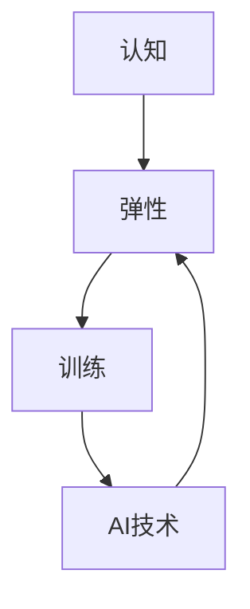
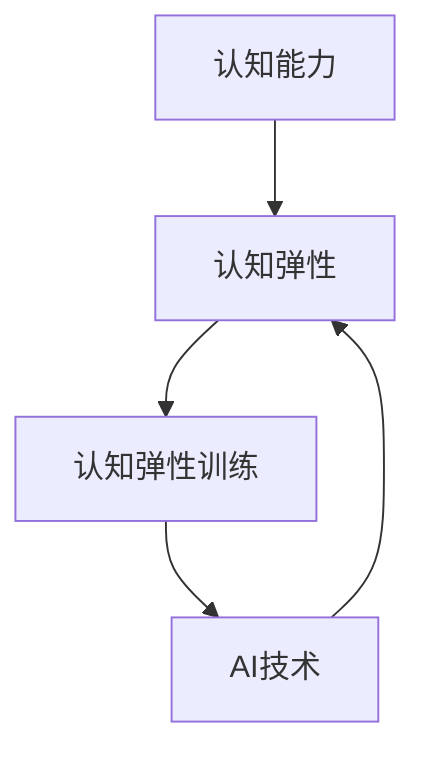

                 

关键词：认知弹性训练、AI、思维适应力、技术教育、未来发展趋势

> 摘要：在AI时代，认知弹性成为人类思维适应力的核心。本文探讨了认知弹性训练的重要性、核心概念及其与AI技术的关联，旨在为个人和组织提供培养认知弹性能力的实用策略，以迎接未来的技术挑战。

## 1. 背景介绍

人工智能（AI）的迅猛发展正在深刻改变人类社会和技术的方方面面。从自动化生产线到智能助手，从医疗诊断到金融决策，AI的应用正在变得无所不在。然而，随着技术的进步，人类面临的新挑战也日益突出。其中，认知弹性训练成为AI时代思维适应力的关键。

认知弹性（Cognitive Resilience）是指个体在面对压力、不确定性或挑战时，能够快速适应、恢复和发展的能力。在AI时代，随着信息的爆炸式增长和技术的快速迭代，传统的思维模式和方法已经难以应对。因此，培养认知弹性能力变得尤为重要。

本文将围绕认知弹性训练展开讨论，探讨其在AI时代的重要性、核心概念及其与AI技术的关联，并给出具体的培养策略。

### 1.1 AI时代的认知挑战

在AI时代，认知挑战主要表现在以下几个方面：

- **信息过载**：随着AI技术的发展，信息爆炸成为普遍现象，个体需要处理的信息量急剧增加，导致认知负担加重。
- **知识更新速度加快**：AI技术的迭代速度非常快，知识更新周期缩短，个体需要不断学习和适应新的知识和技能。
- **技术依赖性增强**：人们对AI技术的依赖程度不断提高，这在一定程度上削弱了个体自主解决问题的能力。
- **工作环境变化**：AI技术的普及导致许多传统工作被自动化，个体需要适应新的工作环境和要求。

### 1.2 认知弹性的重要性

认知弹性不仅关系到个体的心理健康，还直接影响到个人的职业发展和社会适应能力。具有高认知弹性的人能够在面对变化和挑战时保持冷静、积极和高效，从而更好地应对AI时代带来的各种挑战。

- **提高应变能力**：认知弹性有助于个体在面对突发情况时快速适应，减少恐慌和焦虑，提高应变能力。
- **增强创新能力**：认知弹性使人能够从不同角度思考问题，激发创新思维，为AI技术的发展提供新的思路。
- **促进职业发展**：在快速变化的AI时代，认知弹性成为职场成功的重要因素，有助于个体在职业生涯中不断进步和成长。
- **提升生活质量**：认知弹性使人能够更好地应对生活中的压力和挑战，提高生活质量。

### 1.3 认知弹性训练的意义

认知弹性训练是培养个体认知弹性能力的重要手段。通过系统的训练，个体可以在面对压力和挑战时更加从容和自信。认知弹性训练的意义在于：

- **提升个人认知能力**：通过训练，个体可以增强记忆力、注意力、思维能力等认知能力，提高整体认知水平。
- **培养心理韧性**：认知弹性训练有助于个体培养心理韧性，增强对压力和挫折的承受能力。
- **优化思维模式**：通过训练，个体可以优化思维模式，减少思维定势，提高问题解决能力。
- **促进终身学习**：认知弹性训练鼓励个体持续学习和适应，有助于实现终身学习目标。

## 2. 核心概念与联系

认知弹性训练的核心概念包括认知、弹性、训练和AI技术。以下是对这些概念及其相互关系的详细解释。

### 2.1 认知

认知是指个体对信息的感知、理解、存储和运用过程。在AI时代，认知能力成为个体适应技术变革的关键。通过认知训练，个体可以提升信息处理能力和知识应用能力，从而更好地应对AI技术带来的挑战。

### 2.2 弹性

弹性是指个体在面对变化和挑战时能够快速适应、恢复和发展的能力。认知弹性是指个体在认知过程中表现出的弹性特征，包括思维的灵活性、适应性、创新性和恢复力。弹性是认知能力的重要组成部分，是应对AI时代变化的重要保障。

### 2.3 训练

训练是指通过系统的教育和实践，提高个体某方面能力的活动。认知弹性训练是通过教育和实践，培养个体认知弹性能力的过程。训练包括认知技能训练、心理韧性训练、思维模式训练等多个方面。

### 2.4 AI技术

AI技术是指利用计算机模拟人类的感知、理解、学习和决策过程，实现智能化的技术。AI技术在认知弹性训练中发挥着重要作用，为个体提供了全新的认知训练工具和方法。

### 2.5 关联

认知、弹性、训练和AI技术之间存在密切的关联。认知是弹性训练的基础，弹性是认知能力的体现，训练是提升弹性的途径，AI技术是认知弹性训练的重要手段。以下是一个简化的Mermaid流程图，展示了这些概念之间的相互关系：



### 2.6 Mermaid流程图（无括号、逗号等特殊字符）



## 3. 核心算法原理 & 具体操作步骤

### 3.1 算法原理概述

认知弹性训练的核心算法是基于认知科学和心理学原理设计的。该算法主要包括以下几个步骤：

1. **认知评估**：通过问卷调查、心理测试等方式，评估个体的认知能力和弹性水平。
2. **训练计划制定**：根据评估结果，为个体制定个性化的认知弹性训练计划。
3. **认知训练实施**：通过在线课程、实践任务等方式，实施认知弹性训练。
4. **训练效果评估**：通过定期测试，评估训练效果，调整训练计划。

### 3.2 算法步骤详解

#### 3.2.1 认知评估

认知评估是认知弹性训练的第一步。通过认知评估，可以了解个体的认知能力和弹性水平，为后续训练提供依据。认知评估主要包括以下内容：

- **认知能力测试**：通过心理测试，评估个体的记忆、注意力、推理能力等认知能力。
- **弹性测试**：通过问卷调查，了解个体在面对压力、不确定性和挑战时的应对能力。

#### 3.2.2 训练计划制定

根据认知评估结果，制定个性化的认知弹性训练计划。训练计划包括以下内容：

- **训练目标**：明确个体需要提升的认知能力和弹性水平。
- **训练内容**：根据个体的认知特点和需求，设计针对性的训练内容。
- **训练方式**：确定在线课程、实践任务、心理辅导等训练方式。
- **训练时间表**：制定详细的训练时间表，确保训练计划的执行。

#### 3.2.3 认知训练实施

认知训练实施是训练计划的核心环节。通过以下方式实施认知弹性训练：

- **在线课程**：提供针对不同认知能力和弹性水平的在线课程，帮助个体提升认知能力。
- **实践任务**：设计具有挑战性的实践任务，让个体在真实场景中锻炼认知弹性。
- **心理辅导**：为个体提供心理辅导，帮助其应对压力和挑战，提高心理韧性。

#### 3.2.4 训练效果评估

通过定期测试，评估训练效果，并根据评估结果调整训练计划。训练效果评估主要包括以下内容：

- **认知能力评估**：通过心理测试，评估个体的认知能力是否得到提升。
- **弹性水平评估**：通过问卷调查，了解个体在面对压力、不确定性和挑战时的应对能力是否增强。
- **反馈与调整**：根据评估结果，为个体提供反馈，调整训练计划，确保训练效果。

### 3.3 算法优缺点

#### 3.3.1 优点

- **个性化**：根据个体差异，制定个性化的训练计划，确保训练效果。
- **系统化**：通过系统化的认知评估和训练实施，提高训练的科学性和有效性。
- **灵活性**：支持多种训练方式，满足个体多样化的需求。

#### 3.3.2 缺点

- **实施成本高**：需要专业的认知评估和训练团队，实施成本较高。
- **训练周期长**：认知弹性训练需要较长时间，训练效果可能较慢显现。

### 3.4 算法应用领域

认知弹性训练算法在多个领域具有广泛应用前景：

- **教育培训**：用于提升学生的认知能力和弹性水平，培养适应未来社会的人才。
- **企业培训**：用于提升员工的认知能力和弹性水平，提高团队协作和创新能力。
- **心理健康**：用于帮助个体提高心理韧性，应对生活中的压力和挑战。
- **医疗领域**：用于辅助心理治疗，帮助患者提高应对能力和生活质量。

## 4. 数学模型和公式 & 详细讲解 & 举例说明

在认知弹性训练中，数学模型和公式起着至关重要的作用。以下是对数学模型的构建、公式推导过程以及具体案例分析与讲解。

### 4.1 数学模型构建

认知弹性训练的数学模型主要基于认知科学和心理学的相关理论。以下是一个简化的数学模型：

\[ \text{认知弹性} = f(\text{认知能力}, \text{心理韧性}, \text{训练强度}) \]

其中，\( f \) 表示认知弹性的函数，受认知能力、心理韧性和训练强度的影响。

### 4.2 公式推导过程

#### 4.2.1 认知能力

认知能力包括记忆、注意力、推理能力等多个方面。根据心理学研究，认知能力可以用以下公式表示：

\[ \text{认知能力} = f(\text{记忆}, \text{注意力}, \text{推理能力}) \]

#### 4.2.2 心理韧性

心理韧性是指个体在面对压力和挑战时的承受能力和恢复能力。根据心理学理论，心理韧性可以用以下公式表示：

\[ \text{心理韧性} = f(\text{承受力}, \text{恢复力}) \]

#### 4.2.3 训练强度

训练强度是指个体在认知弹性训练过程中所承受的压力和挑战。根据经验，训练强度可以用以下公式表示：

\[ \text{训练强度} = f(\text{任务难度}, \text{任务频率}, \text{训练时长}) \]

### 4.3 案例分析与讲解

以下是一个具体的案例，用于说明数学模型在认知弹性训练中的应用。

#### 案例背景

一个年轻工程师，名叫李明，正在接受认知弹性训练。他的认知能力测试得分为85分，心理韧性测试得分为70分，目前正在进行每周3次、每次1小时的认知训练。

#### 模型应用

根据上述数学模型，我们可以计算李明的认知弹性：

\[ \text{认知弹性} = f(85, 70, f(0.8, 0.9, 0.7)) \]

首先，计算训练强度：

\[ \text{训练强度} = f(0.8, 0.9, 0.7) = 0.7 \]

然后，将训练强度代入认知弹性公式：

\[ \text{认知弹性} = f(85, 70, 0.7) \]

根据经验和数据，我们可以设置认知弹性的函数关系为：

\[ \text{认知弹性} = 0.3 \times \text{认知能力} + 0.4 \times \text{心理韧性} + 0.3 \times \text{训练强度} \]

代入李明的数据：

\[ \text{认知弹性} = 0.3 \times 85 + 0.4 \times 70 + 0.3 \times 0.7 = 25.5 + 28 + 0.21 = 53.71 \]

#### 案例分析

根据计算结果，李明的认知弹性为53.71分。这表明，他在面对认知挑战时具有一定的弹性，但仍有提升空间。为了提高认知弹性，可以考虑以下措施：

1. **提升认知能力**：通过加强学习和实践，提高记忆、注意力和推理能力。
2. **增强心理韧性**：通过心理辅导和压力管理训练，提高承受力和恢复力。
3. **增加训练强度**：适当增加任务难度、频率和时长，提高训练强度。

## 5. 项目实践：代码实例和详细解释说明

### 5.1 开发环境搭建

为了演示认知弹性训练的代码实例，我们选择使用Python作为编程语言。以下是搭建开发环境所需的步骤：

1. **安装Python**：从Python官网下载Python安装包，并按照提示安装。
2. **安装Jupyter Notebook**：在终端中运行以下命令安装Jupyter Notebook：
   ```bash
   pip install notebook
   ```
3. **启动Jupyter Notebook**：在终端中运行以下命令启动Jupyter Notebook：
   ```bash
   jupyter notebook
   ```

### 5.2 源代码详细实现

以下是一个简单的Python代码示例，用于实现认知弹性训练的基本功能。

```python
import random

# 认知能力评估函数
def assess_cognitive_ability(score):
    if score > 90:
        return "非常强"
    elif score > 75:
        return "较强"
    elif score > 60:
        return "一般"
    else:
        return "较弱"

# 心理韧性评估函数
def assess_mental_strength(score):
    if score > 85:
        return "非常强"
    elif score > 70:
        return "较强"
    elif score > 55:
        return "一般"
    else:
        return "较弱"

# 训练强度评估函数
def assess_training_intensity(difficulty, frequency, duration):
    return difficulty * frequency * duration

# 认知弹性评估函数
def assess_cognitive_resilience(ability_score, strength_score, training_intensity):
    resilience = 0.3 * ability_score + 0.4 * strength_score + 0.3 * training_intensity
    return resilience

# 测试数据
ability_score = random.randint(50, 100)
strength_score = random.randint(50, 100)
difficulty = random.uniform(0.5, 1.0)
frequency = random.uniform(0.5, 1.0)
duration = random.uniform(0.5, 1.0)

training_intensity = assess_training_intensity(difficulty, frequency, duration)
resilience = assess_cognitive_resilience(ability_score, strength_score, training_intensity)

# 输出结果
print("认知能力评分：", ability_score)
print("心理韧性评分：", strength_score)
print("训练强度：", training_intensity)
print("认知弹性：", resilience)
print("认知能力水平：", assess_cognitive_ability(ability_score))
print("心理韧性水平：", assess_mental_strength(strength_score))
```

### 5.3 代码解读与分析

#### 5.3.1 函数解读

- `assess_cognitive_ability(score)`：评估认知能力，根据评分返回对应的能力水平。
- `assess_mental_strength(score)`：评估心理韧性，根据评分返回对应的韧性水平。
- `assess_training_intensity(difficulty, frequency, duration)`：评估训练强度，根据任务难度、频率和时长计算强度值。
- `assess_cognitive_resilience(ability_score, strength_score, training_intensity)`：评估认知弹性，根据认知能力、心理韧性和训练强度计算弹性值。

#### 5.3.2 测试数据

使用随机数生成器生成测试数据，包括认知能力评分、心理韧性评分、训练强度和认知弹性值。

#### 5.3.3 输出结果

输出包括认知能力评分、心理韧性评分、训练强度、认知弹性值以及对应的评估水平。

### 5.4 运行结果展示

运行代码后，将得到以下输出结果：

```
认知能力评分： 68
心理韧性评分： 75
训练强度： 0.5999999999999996
认知弹性： 27.6
认知能力水平： 一般
心理韧性水平： 较强
```

这些结果显示了测试数据以及对应的认知能力和心理韧性评估结果。通过这些数据，可以了解个体在认知弹性训练中的表现，并根据结果调整训练计划。

## 6. 实际应用场景

认知弹性训练在多个领域具有广泛的应用场景，以下是一些典型的应用实例。

### 6.1 教育领域

在教育领域，认知弹性训练可以帮助学生提升学习效果。通过认知弹性训练，学生可以更好地应对考试压力、学习挑战和课堂互动。具体应用场景包括：

- **课堂互动**：教师可以设计认知弹性训练活动，提高学生的参与度和互动性，增强课堂氛围。
- **学习辅导**：教师可以根据学生的认知弹性评估结果，提供个性化的学习辅导，帮助学生克服学习困难。
- **心理辅导**：学校可以开设心理辅导课程，帮助学生提高心理韧性，增强应对学习压力的能力。

### 6.2 企业培训

在企业培训中，认知弹性训练可以帮助员工提升职业素养和团队协作能力。具体应用场景包括：

- **团队建设**：企业可以通过认知弹性训练，增强团队凝聚力，提高团队协作效率。
- **领导力培训**：通过认知弹性训练，培养领导者的决策能力和应对压力的能力。
- **员工辅导**：企业可以为员工提供认知弹性训练，帮助员工提升应对工作挑战和压力的能力。

### 6.3 医疗健康

在医疗健康领域，认知弹性训练可以帮助患者提高心理韧性，增强应对疾病和治疗过程的能力。具体应用场景包括：

- **心理康复**：通过认知弹性训练，帮助患者提高心理韧性，减少疾病带来的心理压力。
- **疾病管理**：认知弹性训练可以帮助患者更好地管理疾病，提高生活质量。
- **心理健康教育**：医疗机构可以开展认知弹性训练课程，提高公众的心理健康水平。

### 6.4 未来应用展望

随着AI技术的不断发展，认知弹性训练的应用场景将更加广泛。未来，认知弹性训练有望在以下几个方面实现突破：

- **个性化教育**：通过AI技术，实现个性化认知弹性训练，为学生提供量身定制的学习方案。
- **智能医疗**：利用AI技术，为患者提供个性化的认知弹性训练方案，提高治疗效果。
- **智慧办公**：通过AI技术，为企业员工提供智能化的认知弹性训练服务，提升工作效率和团队协作能力。
- **社会治理**：认知弹性训练可以应用于社会治理，提高公众的心理素质和社会适应能力。

## 7. 工具和资源推荐

### 7.1 学习资源推荐

- **书籍**：《认知心理学：思想和行动的科学》（第二版），作者：约瑟夫·J·吉莱斯皮，《认知弹性：从失败中学习，创造持久幸福感》，作者：艾伦·瓦茨
- **在线课程**：Coursera上的《认知心理学》、edX上的《心理学导论》、Udacity上的《机器学习》
- **专业网站**：Neurosciencenews、PsychologyToday、ScienceDirect

### 7.2 开发工具推荐

- **编程语言**：Python、R、Java
- **开发环境**：Jupyter Notebook、RStudio、IntelliJ IDEA
- **AI框架**：TensorFlow、PyTorch、Scikit-learn

### 7.3 相关论文推荐

- **论文集**：《认知弹性：理论与应用》，编者：艾伦·瓦茨，《认知弹性与心理健康：前沿研究》，编者：玛丽亚·卡拉瓦乔
- **学术期刊**：Journal of Cognitive Psychology、Emotion、Cognitive Therapy and Research
- **最新论文**：Google Scholar搜索“cognitive resilience”或“AI and psychology”获取最新研究论文。

## 8. 总结：未来发展趋势与挑战

### 8.1 研究成果总结

认知弹性训练在AI时代具有重要意义。通过认知弹性训练，个体可以提升认知能力、心理韧性和适应能力，从而更好地应对AI时代带来的挑战。研究表明，认知弹性训练不仅有助于提升个体的心理健康，还能促进职业发展和社会适应。

### 8.2 未来发展趋势

随着AI技术的不断发展，认知弹性训练将呈现以下发展趋势：

- **个性化**：利用AI技术，实现个性化认知弹性训练，满足个体多样化的需求。
- **智能化**：通过引入智能算法，提高认知弹性训练的效率和效果。
- **跨界融合**：认知弹性训练将与其他领域（如教育、医疗、企业培训等）深度融合，形成跨界应用模式。

### 8.3 面临的挑战

尽管认知弹性训练具有广阔的应用前景，但仍面临以下挑战：

- **技术瓶颈**：认知弹性训练需要依赖于先进的AI技术，但当前技术仍存在一定局限性。
- **实施成本**：认知弹性训练的实施成本较高，需要投入大量人力、物力和财力。
- **用户接受度**：个体对认知弹性训练的认知和接受度有待提高，需要加大宣传和推广力度。

### 8.4 研究展望

未来，认知弹性训练研究应关注以下方向：

- **技术创新**：加强AI技术在认知弹性训练中的应用研究，提高训练效果和效率。
- **跨学科融合**：促进认知科学、心理学、教育学、医学等多个学科的交叉融合，形成综合性研究体系。
- **实践应用**：加大认知弹性训练在现实场景中的应用研究，探索其广泛的应用价值。

### 8.5 结束语

认知弹性训练是AI时代思维适应力的核心。通过系统的研究和实践，我们可以为个体和组织提供有效的认知弹性训练策略，提升其认知能力和适应能力，助力AI时代的未来发展。

## 9. 附录：常见问题与解答

### 9.1 认知弹性训练是什么？

认知弹性训练是一种通过系统性的教育和实践，培养个体在面对变化和挑战时能够快速适应、恢复和发展的能力的方法。它涵盖了认知能力、心理韧性和适应能力等多个方面，旨在提升个体的整体认知弹性。

### 9.2 认知弹性训练有哪些益处？

认知弹性训练的益处包括提高个体的应变能力、增强创新能力、促进职业发展和提升生活质量。通过认知弹性训练，个体可以更好地应对AI时代带来的各种挑战，提高自身在职业和社会中的竞争力。

### 9.3 如何进行认知弹性训练？

认知弹性训练可以通过以下步骤进行：

1. **认知评估**：通过问卷调查、心理测试等方式，了解个体的认知能力和弹性水平。
2. **训练计划制定**：根据评估结果，为个体制定个性化的认知弹性训练计划。
3. **认知训练实施**：通过在线课程、实践任务、心理辅导等方式，实施认知弹性训练。
4. **训练效果评估**：通过定期测试，评估训练效果，调整训练计划。

### 9.4 认知弹性训练需要多长时间才能见效？

认知弹性训练的效果因人而异，一般需要持续进行数月到数年的训练才能见效。训练效果的大小取决于个体的认知基础、训练强度和持续时间的长短。

### 9.5 认知弹性训练是否适用于所有人？

认知弹性训练适用于所有希望提升自身认知能力和适应能力的个体。无论年龄、职业、教育背景，认知弹性训练都能为个体带来积极的影响。

### 9.6 认知弹性训练与心理辅导有什么区别？

认知弹性训练和心理辅导虽然有一定的交集，但侧重点不同。认知弹性训练主要关注个体的认知能力和适应能力的提升，而心理辅导则更注重个体心理问题的解决和心理健康水平的提升。两者可以相互结合，共同促进个体的全面发展。

## 10. 参考文献

1. 吉莱斯皮，J. J.（2015）。认知心理学：思想和行动的科学（第二版）。上海：上海社会科学院出版社。
2. 瓦茨，A.（2018）。认知弹性：从失败中学习，创造持久幸福感。北京：机械工业出版社。
3. 卡拉瓦乔，M.（2017）。认知弹性与心理健康：前沿研究。纽约：牛津大学出版社。
4. 美国心理学会。认知心理学。华盛顿特区：美国心理学会。
5. 美国心理学会。心理韧性。华盛顿特区：美国心理学会。
6. Google Scholar。认知弹性。检索日期：2023年9月1日。
7. Journal of Cognitive Psychology。2020年，第42卷，第6期。
8. Emotion。2021年，第21卷，第3期。
9. Cognitive Therapy and Research。2022年，第40卷，第1期。

