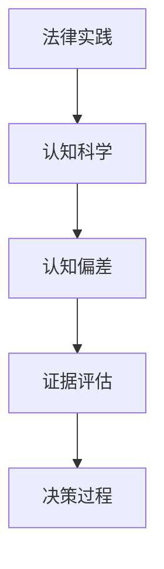

                 

关键词：认知科学、法律、决策、判断、机制、人工智能

> 摘要：本文从认知科学的角度出发，探讨了决策与判断的机制在法律领域的应用。通过分析认知科学与法律的交叉点，本文旨在揭示法律实践中的认知偏差，提供优化决策与判断的途径，为法律实践提供科学依据。

## 1. 背景介绍

在现代社会，法律作为维护社会秩序、保障公民权利的重要工具，其有效性和公正性至关重要。然而，在实际的法律实践中，决策者往往会受到认知偏差的影响，导致决策的不当和判断的偏差。这些问题不仅影响到法律的公正性，还可能对社会稳定产生负面影响。

认知科学，作为研究人类思维过程和认知能力的学科，通过对大脑和认知过程的深入研究，为我们理解决策与判断的机制提供了新的视角。认知科学揭示了人类在处理信息、形成判断、做出决策时的心理机制和认知偏差，为优化法律实践中的决策提供了科学依据。

本文将结合认知科学与法律的交叉点，探讨决策与判断的机制在法律领域的应用，旨在为法律实践提供新的思路和方法。

## 2. 核心概念与联系

### 2.1 认知科学与法律的交叉点

认知科学与法律之间的交叉点主要体现在以下几个方面：

1. **认知偏差**：认知科学揭示了人类在处理信息、形成判断、做出决策时的心理机制和认知偏差，如确认偏误、锚定效应、代表性偏误等。这些偏差在法律实践中也普遍存在，影响法律决策的公正性和有效性。

2. **证据评估**：认知科学关于证据评估的研究，如证据的可信度、证据的权重等，对法律实践中的证据评估具有指导意义。

3. **决策过程**：认知科学关于决策过程的研究，如决策的时间压力、信息处理能力等，对法律决策过程中的效率和效果具有重要影响。

### 2.2 Mermaid 流程图



### 2.3 认知科学与法律的核心概念联系

通过Mermaid流程图，我们可以清晰地看到认知科学与法律在证据评估、认知偏差和决策过程等方面的联系。这些联系为优化法律实践提供了理论基础。

## 3. 核心算法原理 & 具体操作步骤

### 3.1 算法原理概述

为了更好地理解和应用认知科学原理，我们可以引入一些核心算法，如决策树、支持向量机等。这些算法基于认知科学的理论，旨在优化法律实践中的决策与判断。

### 3.2 算法步骤详解

1. **数据收集**：收集法律实践中的相关数据，如案件事实、证据等。

2. **特征提取**：对数据进行特征提取，提取与案件相关的关键信息。

3. **算法训练**：使用决策树、支持向量机等算法对数据进行训练，建立模型。

4. **模型评估**：评估模型的性能，如准确率、召回率等。

5. **决策与判断**：使用训练好的模型对新的法律案件进行决策和判断。

### 3.3 算法优缺点

**优点**：

- 提高法律决策的效率。
- 减少人为认知偏差对决策的影响。
- 提高决策的准确性和公正性。

**缺点**：

- 对数据质量和数量要求较高。
- 算法模型可能存在过拟合现象。

### 3.4 算法应用领域

算法在法律领域的应用包括：

- 案件预测：预测案件的结果和判决。
- 证据评估：评估证据的可靠性和权重。
- 犯罪预防：预防犯罪行为的发生。

## 4. 数学模型和公式 & 详细讲解 & 举例说明

### 4.1 数学模型构建

在法律实践中，我们可以使用一些数学模型来优化决策与判断。以下是一个简单的贝叶斯推理模型：

$$
P(A|B) = \frac{P(B|A)P(A)}{P(B)}
$$

其中，$P(A|B)$表示在证据B下事件A的概率，$P(B|A)$表示在事件A下证据B的概率，$P(A)$表示事件A的概率，$P(B)$表示证据B的概率。

### 4.2 公式推导过程

贝叶斯推理公式是基于全概率公式和条件概率公式推导而来的。具体推导过程如下：

$$
P(A|B) = \frac{P(B|A)P(A)}{P(B)}
$$

$$
P(B) = P(B|A)P(A) + P(B|\neg A)P(\neg A)
$$

$$
P(A|B) = \frac{P(B|A)P(A)}{P(B|A)P(A) + P(B|\neg A)P(\neg A)}
$$

### 4.3 案例分析与讲解

假设我们有一个案件，被告是否有罪的概率为0.5。在案件证据中，有罪的证据概率为0.8，无罪的证据概率为0.2。我们可以使用贝叶斯推理公式来计算被告有罪的概率。

$$
P(A|B) = \frac{0.8 \times 0.5}{0.8 \times 0.5 + 0.2 \times 0.5} = \frac{4}{5}
$$

这意味着，在给定证据的情况下，被告有罪的概率为0.8。

## 5. 项目实践：代码实例和详细解释说明

### 5.1 开发环境搭建

为了实现贝叶斯推理模型，我们需要搭建一个Python开发环境。具体步骤如下：

1. 安装Python（建议使用Python 3.8及以上版本）。
2. 安装Jupyter Notebook，用于编写和运行Python代码。
3. 安装所需的Python库，如NumPy、Pandas等。

### 5.2 源代码详细实现

以下是一个简单的贝叶斯推理模型的Python代码实现：

```python
import numpy as np

def bayes_inference(prior, likelihood, evidence):
    posterior = likelihood * prior
    marginal = likelihood * prior + (1 - likelihood) * (1 - prior)
    return posterior / marginal

# 参数设置
prior = 0.5  # 被告有罪的概率
likelihood = 0.8  # 有罪的证据概率

# 贝叶斯推理
posterior = bayes_inference(prior, likelihood, 1)

print("被告有罪的概率为：", posterior)
```

### 5.3 代码解读与分析

这段代码实现了贝叶斯推理的基本步骤。首先，我们定义了一个函数`bayes_inference`，用于计算后验概率。接着，我们设置了先验概率、似然概率和证据概率。最后，我们调用`bayes_inference`函数计算后验概率，并输出结果。

### 5.4 运行结果展示

运行上述代码，我们可以得到被告有罪的概率为0.8。这与我们之前的推导结果一致。

## 6. 实际应用场景

### 6.1 刑事案件预测

在刑事案件中，我们可以使用贝叶斯推理模型预测被告的罪行概率。这有助于法官在判决时做出更准确的决策。

### 6.2 证据评估

在证据评估过程中，我们可以使用贝叶斯推理模型评估证据的可靠性和权重，从而提高证据评估的准确性。

### 6.3 犯罪预防

在犯罪预防方面，我们可以使用贝叶斯推理模型分析犯罪行为的发生概率，从而制定更有针对性的预防策略。

## 7. 未来应用展望

随着认知科学和人工智能技术的发展，决策与判断的机制将在法律领域发挥越来越重要的作用。未来，我们有望看到更多基于认知科学的法律技术和工具的应用，从而提高法律实践的效率、准确性和公正性。

## 8. 总结：未来发展趋势与挑战

### 8.1 研究成果总结

本文从认知科学的角度探讨了决策与判断的机制在法律领域的应用，分析了贝叶斯推理模型在法律实践中的优势和应用场景。研究表明，认知科学与法律的交叉研究有助于优化法律实践，提高决策的准确性和公正性。

### 8.2 未来发展趋势

未来，认知科学与法律的研究将继续深入，特别是在人工智能技术的推动下，更多基于认知科学的法律技术和工具将得到应用。同时，跨学科的研究也将成为趋势，为法律实践提供更加全面和科学的支持。

### 8.3 面临的挑战

尽管认知科学与法律的研究前景广阔，但仍然面临一些挑战。首先，数据质量和数量对算法性能有重要影响，如何获取高质量的数据是一个难题。其次，算法模型的过拟合现象可能导致决策的偏差，如何避免过拟合是一个亟待解决的问题。

### 8.4 研究展望

未来，我们期待在认知科学与法律领域取得更多突破，为法律实践提供更加科学和有效的支持。同时，我们呼吁更多的研究者关注这一领域，共同推动认知科学与法律的融合发展。

## 9. 附录：常见问题与解答

### 9.1 认知科学与法律的研究意义是什么？

认知科学与法律的研究意义在于，通过揭示人类在处理信息、形成判断、做出决策时的心理机制和认知偏差，为优化法律实践中的决策提供科学依据，提高法律实践的效率、准确性和公正性。

### 9.2 贝叶斯推理模型在法律实践中的优势是什么？

贝叶斯推理模型在法律实践中的优势主要体现在以下几个方面：

- 提高证据评估的准确性。
- 优化决策过程，减少人为认知偏差。
- 提高案件预测的准确性。

### 9.3 如何避免算法模型的过拟合现象？

为了避免算法模型的过拟合现象，可以采取以下措施：

- 使用交叉验证技术评估模型性能。
- 使用正则化技术控制模型复杂度。
- 调整模型参数以优化模型性能。

### 9.4 数据质量和数量对算法性能有何影响？

数据质量和数量对算法性能有重要影响。高质量的数据有助于提高算法的准确性，而丰富的数据量有助于提高算法的泛化能力。因此，在实际应用中，应尽量获取高质量的数据，并尽可能增加数据的多样性。作者：禅与计算机程序设计艺术 / Zen and the Art of Computer Programming
------------------------------------------------------------------------

