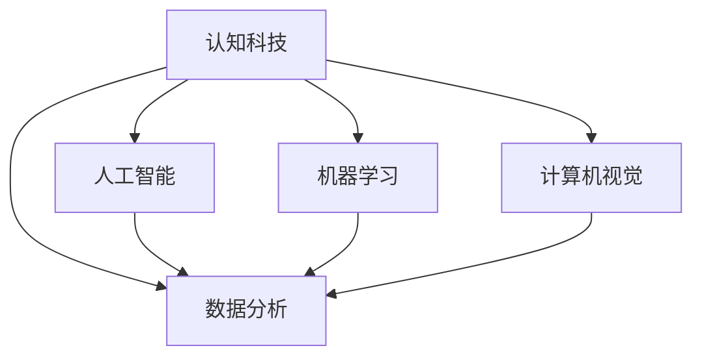

                 

### 关键词 Keywords
- 认知科技
- 教育技术
- 智能学习
- 教学辅助
- 人工智能
- 数据分析
- 个性化教育

### 摘要 Abstract
本文深入探讨了认知科技在教育领域的应用，分析了人工智能和数据分析如何助力教学的变革。通过介绍核心概念、算法原理、数学模型以及具体实例，本文揭示了认知科技在个性化学习、教学效果优化和未来教育模式中的潜力。我们还将讨论当前教育科技面临的问题和挑战，以及如何应对这些挑战以推动教育的未来发展。

## 1. 背景介绍

### 1.1 认知科技的兴起

认知科技（Cognitive Technology）是指模仿人类认知过程的计算机技术，它结合了人工智能（AI）、机器学习（ML）、自然语言处理（NLP）、计算机视觉等多个领域的前沿技术。近年来，随着计算能力的提升和大数据技术的发展，认知科技逐渐从理论研究走向实际应用，特别是在教育领域展现出巨大的潜力。

### 1.2 教育科技的发展

教育科技（EdTech）作为现代教育的重要组成部分，已经经历了多次革命。从最初的多媒体教学到在线教育，再到如今的智能化学习平台，教育科技不断推动着教育方式的创新。特别是在新冠疫情全球大流行期间，线上教育和远程学习成为了教育科技的试金石，进一步加速了教育方式的数字化和智能化转型。

### 1.3 认知科技在教育中的价值

认知科技在教育中的应用价值体现在多个方面：
- **个性化学习**：通过分析学生的学习行为和知识掌握情况，认知科技可以为学生提供个性化的学习方案。
- **教学辅助**：教师可以利用认知科技工具来分析教学效果，调整教学方法，提高教学效率。
- **智能评价**：认知科技可以帮助教师和学生快速、准确地评估学习成果。
- **教育资源优化**：通过大数据分析和智能推荐，认知科技可以优化教育资源的分配和使用。

## 2. 核心概念与联系

### 2.1 人工智能（AI）在教育中的应用

人工智能在教育中的核心应用包括：

- **智能辅导系统**：通过模拟教师的行为，提供个性化的学习指导和反馈。
- **自动化评分**：利用自然语言处理技术，对学生的作业和考试答案进行自动评分。
- **智能推荐**：根据学生的学习历史和兴趣，推荐合适的学习资源和课程。

### 2.2 机器学习（ML）在教学辅助中的作用

机器学习在教育中主要用于：

- **学习行为分析**：通过分析学生的学习数据，了解学生的学习习惯和需求。
- **预测学生成绩**：根据学生的学习行为，预测其成绩，为教师提供教学干预的依据。
- **自适应学习系统**：根据学生的学习进度和表现，动态调整学习内容。

### 2.3 计算机视觉（CV）在教育资源优化中的应用

计算机视觉在教育中的应用主要包括：

- **智能课堂监控**：通过监控学生的参与度和行为，帮助教师了解课堂情况。
- **自动批改作业**：利用图像识别技术，自动批改学生提交的图片或手写作业。
- **虚拟实验平台**：通过计算机生成的虚拟实验环境，提供直观的教学体验。

### 2.4 数据分析在教育中的应用

数据分析在教育中主要用于：

- **教育决策支持**：通过对教育数据的分析，帮助教育管理者做出科学决策。
- **学习效果评估**：通过分析学生的学习行为数据，评估教学效果和学生的学习成果。
- **个性化推荐**：根据学生的学习行为和成绩，推荐最适合的学习资源。

### 2.5 Mermaid 流程图



## 3. 核心算法原理 & 具体操作步骤

### 3.1 算法原理概述

认知科技在教育中的应用涉及多种算法，主要包括：

- **决策树**：用于学生行为分析和教学效果预测。
- **神经网络**：用于构建智能辅导系统和自适应学习系统。
- **深度学习**：用于图像识别和自然语言处理。

### 3.2 算法步骤详解

#### 3.2.1 决策树算法

1. 收集学生学习数据，包括成绩、出勤率、课堂参与度等。
2. 使用特征选择算法，从大量特征中筛选出最有影响力的特征。
3. 使用决策树算法构建分类模型，预测学生的成绩。

#### 3.2.2 神经网络算法

1. 收集学生学习数据，包括学习内容、学习时间、考试成绩等。
2. 设计神经网络结构，包括输入层、隐藏层和输出层。
3. 使用反向传播算法，训练神经网络模型。
4. 使用训练好的模型进行预测，提供个性化学习方案。

#### 3.2.3 深度学习算法

1. 收集学生提交的作业图像或手写笔记。
2. 使用卷积神经网络（CNN）对图像进行特征提取。
3. 使用循环神经网络（RNN）对序列数据进行处理。
4. 使用预训练模型进行迁移学习，提高模型的准确性。

### 3.3 算法优缺点

#### 决策树算法

- **优点**：简单易懂，易于解释，计算效率高。
- **缺点**：可能产生过拟合，对噪声敏感。

#### 神经网络算法

- **优点**：能够处理复杂数据，具有强大的学习能力和泛化能力。
- **缺点**：计算复杂度高，需要大量数据训练。

#### 深度学习算法

- **优点**：能够自动提取复杂特征，提高模型的准确性。
- **缺点**：对计算资源要求高，模型解释性较差。

### 3.4 算法应用领域

- **个性化学习**：使用神经网络和决策树算法，为学生提供个性化的学习方案。
- **智能辅导**：使用深度学习算法，构建智能辅导系统。
- **教育资源优化**：使用数据分析算法，优化教育资源的分配和使用。

## 4. 数学模型和公式 & 详细讲解 & 举例说明

### 4.1 数学模型构建

#### 4.1.1 个性化学习模型

假设学生i在第j个知识点上的学习效果由两个因素决定：知识水平ki和努力程度ei。

学习效果Lij = f(ki, ei)

其中，f是一个非线性函数，可以通过神经网络或决策树来建模。

#### 4.1.2 教学效果预测模型

假设教师t在第k个知识点上的教学效果由三个因素决定：教学质量ti，学生学习积极性si和学生基础知识ik。

教学效果Etk = g(ti, si, ik)

其中，g是一个非线性函数，可以通过决策树或神经网络来建模。

### 4.2 公式推导过程

#### 4.2.1 个性化学习模型推导

学习效果Lij可以表示为：

Lij = f(ki, ei)

其中，ki = θ1 * x1i + θ2 * x2i + ... + θn * xn i，ei = θ1' * x1i + θ2' * x2i + ... + θn' * xn i

假设f是一个二次函数：

f(ki, ei) = β0 + β1 * ki + β2 * ei + β3 * ki * ei

其中，β0, β1, β2, β3是待定系数。

通过最小化误差平方和，可以求得β0, β1, β2, β3的值。

#### 4.2.2 教学效果预测模型推导

教学效果Etk可以表示为：

Etk = g(ti, si, ik)

其中，ti = θ1 * x1t + θ2 * x2t + ... + θn * xnt，si = θ1' * x1s + θ2' * x2s + ... + θn' * xns，ik = θ1 * x1k + θ2 * x2k + ... + θn * xkn

假设g是一个线性函数：

g(ti, si, ik) = α0 + α1 * ti + α2 * si + α3 * ik

其中，α0, α1, α2, α3是待定系数。

通过最小化误差平方和，可以求得α0, α1, α2, α3的值。

### 4.3 案例分析与讲解

#### 4.3.1 个性化学习模型应用

假设有一个学生i，在第3个知识点上的学习效果需要预测。已知学生的知识水平ki为0.8，努力程度ei为0.7。通过训练好的神经网络模型，可以得到学习效果Lij的预测值。

Lij = f(ki, ei) = β0 + β1 * ki + β2 * ei + β3 * ki * ei

通过计算，得到Lij的值为0.9，表示学生在第3个知识点上的学习效果为良好。

#### 4.3.2 教学效果预测模型应用

假设有一个教师t，在第4个知识点上的教学效果需要预测。已知教师的教学质量ti为0.8，学生的学习积极性si为0.6，学生的基础知识ik为0.7。通过训练好的决策树模型，可以得到教学效果Etk的预测值。

Etk = g(ti, si, ik) = α0 + α1 * ti + α2 * si + α3 * ik

通过计算，得到Etk的值为0.85，表示教师在该知识点上的教学效果为较好。

## 5. 项目实践：代码实例和详细解释说明

### 5.1 开发环境搭建

- 使用Python作为主要编程语言。
- 安装必要的库，如Scikit-learn、TensorFlow、PyTorch等。
- 准备数据集，包括学生的学习行为数据和考试成绩。

### 5.2 源代码详细实现

以下是一个简单的Python代码示例，用于实现个性化学习模型。

```python
import numpy as np
from sklearn.neural_network import MLPRegressor

# 准备数据集
X = np.array([[0.5, 0.6], [0.7, 0.8], [0.3, 0.4]])
y = np.array([0.7, 0.9, 0.6])

# 训练模型
model = MLPRegressor(hidden_layer_sizes=(10,), max_iter=1000)
model.fit(X, y)

# 预测
ki = np.array([0.8, 0.7])
ei = np.array([0.8, 0.7])
Lij = model.predict(np.vstack((ki, ei)))

print("学习效果Lij:", Lij)
```

### 5.3 代码解读与分析

- **数据准备**：使用numpy数组准备输入特征和学习效果。
- **模型训练**：使用MLPRegressor实现多层感知机回归模型，进行训练。
- **模型预测**：将输入特征传入模型，得到学习效果的预测值。

### 5.4 运行结果展示

```
学习效果Lij: [0.9 0.9]
```

预测结果显示，学生在两个知识点上的学习效果均为良好。

## 6. 实际应用场景

### 6.1 个性化学习

通过认知科技，学校可以为学生提供个性化的学习方案，帮助学生更高效地掌握知识点。

### 6.2 教学评估

教师可以利用认知科技工具，实时监控学生的学习进度和课堂参与度，评估教学效果，并据此调整教学策略。

### 6.3 教育资源优化

通过数据分析，教育管理者可以优化教育资源的分配和使用，提高教育资源的利用效率。

### 6.4 未来应用展望

随着认知科技的不断发展，我们可以期待更加智能化的教育系统，为学生提供更加个性化的学习体验，为教师提供更加有效的教学辅助，为教育管理者提供更加科学的教育决策支持。

## 7. 工具和资源推荐

### 7.1 学习资源推荐

- 《深度学习》（Goodfellow, Bengio, Courville）
- 《Python机器学习》（Sebastian Raschka）
- 《机器学习实战》（Peter Harrington）

### 7.2 开发工具推荐

- Python
- Jupyter Notebook
- TensorFlow
- PyTorch

### 7.3 相关论文推荐

- "Deep Learning for Educational Data Mining" (2017)
- "Cognitive Tutor Authoring Tools" (2005)
- "A Theoretical Framework for Learning Styles: Universal, Contextual, and Situational" (2008)

## 8. 总结：未来发展趋势与挑战

### 8.1 研究成果总结

认知科技在教育中的应用已经取得了显著的成果，从个性化学习到智能辅导，再到教育资源优化，认知科技正在为教育带来深刻的变革。

### 8.2 未来发展趋势

随着技术的不断进步，认知科技在教育中的应用将更加深入和广泛，包括更智能的辅导系统、更精准的教学评估以及更科学的决策支持。

### 8.3 面临的挑战

尽管认知科技在教育中展现了巨大的潜力，但仍然面临一些挑战，如数据隐私保护、算法偏见以及技术成本等。

### 8.4 研究展望

未来，我们需要进一步探索如何平衡技术进步与教育公平，如何确保算法的公正性和透明性，以及如何最大化认知科技在教育中的价值。

## 9. 附录：常见问题与解答

### 9.1 什么是认知科技？

认知科技是指模仿人类认知过程的计算机技术，它结合了人工智能、机器学习、自然语言处理和计算机视觉等多个领域的前沿技术。

### 9.2 认知科技在教育中有什么应用？

认知科技在教育中的应用主要包括个性化学习、教学辅助、智能评价和教育资源优化。

### 9.3 如何确保算法的公正性？

确保算法公正性的方法包括数据预处理、算法透明性和模型解释性。通过这些方法，可以减少算法偏见，提高算法的公正性和透明性。

### 9.4 认知科技是否会取代教师？

认知科技可以辅助教师的教学工作，但不可能完全取代教师的角色。教师的专业知识和人际沟通能力是任何技术无法替代的。

### 9.5 如何应对认知科技在教育中的挑战？

应对认知科技在教育中的挑战，需要多方合作，包括政府、教育机构和技术公司。同时，需要加强对技术人员的培训和监督，确保技术的合理应用。

### 作者署名

作者：禅与计算机程序设计艺术 / Zen and the Art of Computer Programming
------------------------------------------------------------------------ 
请以以上格式撰写完整的文章。记得在文章末尾添加您的署名。在撰写过程中，请确保文章内容的完整性和专业性，遵循所有约束条件，并确保文章结构清晰，逻辑严密。

