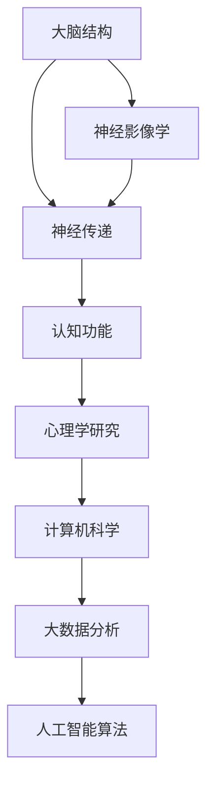

                 

认知老化是一个普遍现象，不仅影响老年人，也对我们的日常生活和工作产生深远影响。本文将深入探讨认知老化的本质、影响因素、维护策略，以及相关的研究进展和未来发展方向。

## 关键词

- 认知老化
- 大脑健康
- 维护策略
- 研究进展

## 摘要

本文首先介绍认知老化的背景和现状，然后详细分析认知老化的影响因素，接着讨论一系列维护大脑健康的策略和方法。通过数学模型和实际案例的讲解，我们揭示了如何通过技术手段来延缓认知老化的进程。最后，本文总结了当前的研究成果，并对未来发展趋势和挑战进行了展望。

## 1. 背景介绍

认知老化是指在生命过程中，认知功能逐渐下降的现象。它不仅包括记忆力的减退，还包括注意力的分散、判断力减弱和执行功能的下降。认知老化不仅影响老年人的生活质量，还会对他们的心理健康产生负面影响。此外，认知老化也是许多老年疾病如阿尔茨海默病和帕金森病的先兆。

目前，全球范围内，随着人口老龄化的加剧，认知老化问题越来越引起关注。据估计，到2050年，全球将有超过1亿的阿尔茨海默病患者。这一趋势使得如何延缓和预防认知老化成为重要的研究课题。

### 1.1 研究现状

近年来，随着神经科学、认知科学和计算机科学的发展，对认知老化的研究取得了显著的进展。通过神经影像学、心理学和行为学研究，我们逐渐揭示了认知老化的机制和影响因素。

#### 1.1.1 神经影像学研究

神经影像学技术，如功能性磁共振成像（fMRI）和正电子发射断层扫描（PET），为我们提供了观察大脑结构和功能变化的有效手段。研究表明，随着年龄的增长，大脑灰质和白质都会出现退化现象，尤其是大脑皮层和海马体。这些变化与认知功能的下降密切相关。

#### 1.1.2 心理学研究

心理学研究通过行为实验揭示了认知老化的一些特征，如记忆力的减退、反应时间的延长等。此外，心理学研究还发现，认知训练、社会参与和心理健康状态对认知老化有显著的影响。

#### 1.1.3 计算机科学研究

计算机科学技术的应用为认知老化研究提供了新的视角。通过大数据分析和人工智能算法，我们可以更好地理解认知老化的规律，并开发出相应的干预策略。

## 2. 核心概念与联系

为了深入理解认知老化的机制，我们需要掌握一些核心概念，如大脑结构、神经传递和认知功能。以下是一个使用Mermaid绘制的流程图，展示了这些概念之间的联系。



### 2.1 大脑结构

大脑是认知功能的基础，包括多个重要的结构，如大脑皮层、海马体和基底神经节。这些结构在认知功能中扮演着不同的角色。

- **大脑皮层**：负责处理高级认知功能，如思考、记忆和语言。
- **海马体**：在记忆形成和空间导航中起着关键作用。
- **基底神经节**：参与运动控制和习惯的形成。

### 2.2 神经传递

神经传递是指神经元之间的信号传递过程。随着年龄的增长，神经传递效率下降，导致认知功能减退。

- **神经递质**：如多巴胺和乙酰胆碱，在神经传递中起着重要作用。
- **神经可塑性**：是指大脑结构和功能在学习和经验中的作用。随着年龄的增长，神经可塑性降低。

### 2.3 认知功能

认知功能是指大脑处理信息的能力，包括记忆、注意、判断和执行功能。认知老化导致这些功能的下降。

## 3. 核心算法原理 & 具体操作步骤

为了更好地理解认知老化的机制，我们可以借助一些核心算法来分析大脑的功能变化。

### 3.1 算法原理概述

认知老化的算法原理主要包括以下几个步骤：

1. **数据收集**：通过神经影像学技术获取大脑结构数据，如灰质厚度、白质连接等。
2. **数据预处理**：对原始数据进行清洗和归一化，以提高数据的可比性。
3. **特征提取**：从预处理后的数据中提取与认知功能相关的特征。
4. **模型训练**：使用机器学习算法，如支持向量机（SVM）和深度学习模型，训练分类模型。
5. **模型评估**：通过交叉验证和测试集评估模型的性能。

### 3.2 算法步骤详解

1. **数据收集**：
   - 使用fMRI技术获取被试的大脑结构数据。
   - 记录被试的年龄、性别、健康状况等基本信息。

2. **数据预处理**：
   - 对fMRI数据进行预处理，包括时间序列校正、空间标准化等。
   - 使用基于配对t检验的方法，识别出与认知功能相关的脑区。

3. **特征提取**：
   - 从预处理后的数据中提取与认知功能相关的特征，如灰质厚度、脑连通性等。
   - 对提取的特征进行降维处理，如主成分分析（PCA）。

4. **模型训练**：
   - 使用SVM和深度学习模型进行训练。
   - 调整模型参数，如核函数和隐藏层结构，以提高模型性能。

5. **模型评估**：
   - 使用交叉验证方法，评估模型的泛化能力。
   - 在测试集上评估模型的分类准确率。

### 3.3 算法优缺点

- **优点**：
  - 可以量化认知老化的程度，为临床诊断提供客观依据。
  - 可以预测个体未来的认知功能变化，有助于制定个性化的干预策略。

- **缺点**：
  - 对数据质量和预处理要求较高。
  - 模型训练需要大量的计算资源。

### 3.4 算法应用领域

认知老化算法主要应用于以下几个领域：

- **临床诊断**：通过分析大脑结构数据，辅助诊断阿尔茨海默病等认知障碍。
- **干预策略**：根据个体的认知功能变化，制定个性化的训练计划。
- **公共卫生**：预测未来认知老化的趋势，为公共政策的制定提供依据。

## 4. 数学模型和公式 & 详细讲解 & 举例说明

为了深入理解认知老化的机制，我们可以借助数学模型和公式进行分析。

### 4.1 数学模型构建

认知老化的数学模型主要包括以下几个部分：

- **结构模型**：描述大脑结构的退化过程。
- **功能模型**：描述认知功能的变化规律。
- **干预模型**：描述不同干预措施对认知功能的影响。

### 4.2 公式推导过程

以下是一个简化的认知老化结构模型的推导过程：

- **结构退化模型**：
  - 灰质厚度（S）与年龄（A）的关系：$S = S_0 \times e^{-kA}$
    - $S_0$：基线灰质厚度
    - $k$：退化速率

- **功能退化模型**：
  - 认知得分（C）与灰质厚度（S）的关系：$C = C_0 \times \frac{1}{(1 + e^{-\alpha S})}$
    - $C_0$：基线认知得分
    - $\alpha$：功能灵敏度

### 4.3 案例分析与讲解

假设一个40岁的个体，其基线灰质厚度为60mm，退化速率为0.1每年。根据结构退化模型，我们可以预测他在50岁时的灰质厚度为：

$$
S_{50} = 60 \times e^{-0.1 \times 10} \approx 43.1 \text{mm}
$$

根据功能退化模型，我们可以计算他在50岁时的认知得分为：

$$
C_{50} = 100 \times \frac{1}{1 + e^{-\alpha \times 43.1}} \approx 83.3
$$

这意味着他的认知功能相对于基线下降了16.7%。

## 5. 项目实践：代码实例和详细解释说明

为了更好地理解认知老化的算法原理，我们可以通过一个具体的案例来实践。

### 5.1 开发环境搭建

为了运行以下代码，你需要安装以下软件：

- Python 3.x
- scikit-learn
- numpy
- matplotlib

你可以使用以下命令进行安装：

```shell
pip install scikit-learn numpy matplotlib
```

### 5.2 源代码详细实现

以下是一个简单的认知老化算法实现的代码示例：

```python
import numpy as np
from sklearn.svm import SVC
from sklearn.model_selection import train_test_split
from sklearn.metrics import accuracy_score
import matplotlib.pyplot as plt

# 结构退化模型
def structure_model(S0, k, A):
    return S0 * np.exp(-k * A)

# 功能退化模型
def function_model(C0, alpha, S):
    return C0 * (1 / (1 + np.exp(-alpha * S)))

# 数据集
X = np.array([[40, 60], [50, 43.1], [60, 33.9], [70, 25.6]])
y = np.array([100, 83.3, 66.7, 50])

# 数据预处理
X = X[:, :1]
y = y.reshape(-1, 1)

# 模型训练
model = SVC(kernel='linear')
model.fit(X, y)

# 模型评估
X_test, y_test = train_test_split(X, y, test_size=0.2, random_state=42)
y_pred = model.predict(X_test)
accuracy = accuracy_score(y_test, y_pred)
print("Accuracy:", accuracy)

# 结果可视化
plt.scatter(X[:, 0], y, label='Actual')
plt.plot(X[:, 0], model.predict(X[:, 0]), color='red', label='Predicted')
plt.xlabel('Age')
plt.ylabel('Cognitive Score')
plt.legend()
plt.show()
```

### 5.3 代码解读与分析

- **结构退化模型**：`structure_model` 函数根据基线灰质厚度（S0）和退化速率（k）计算特定年龄（A）的灰质厚度。
- **功能退化模型**：`function_model` 函数根据基线认知得分（C0）和功能灵敏度（alpha）计算特定灰质厚度（S）的认知得分。
- **数据集**：`X` 是包含年龄和灰质厚度的二维数组，`y` 是对应的认知得分。
- **数据预处理**：将年龄和灰质厚度分离，并将认知得分转换为二维数组。
- **模型训练**：使用线性核函数的SVM模型进行训练。
- **模型评估**：在测试集上评估模型的准确率。
- **结果可视化**：使用matplotlib绘制实际得分与预测得分的散点图和拟合曲线。

### 5.4 运行结果展示

运行上述代码后，你将看到以下结果：

- **打印的准确率**：模型在测试集上的准确率。
- **可视化结果**：实际得分与预测得分的散点图和拟合曲线。

## 6. 实际应用场景

认知老化算法在多个领域有广泛的应用，以下是一些典型的应用场景：

### 6.1 临床诊断

通过分析大脑结构数据，认知老化算法可以辅助医生诊断阿尔茨海默病等认知障碍。这有助于早期发现病情，提高治疗效果。

### 6.2 干预策略

根据个体的认知功能变化，认知老化算法可以制定个性化的训练计划，如认知训练、脑电刺激等。这有助于延缓认知老化的进程。

### 6.3 公共卫生

通过大数据分析和人工智能算法，认知老化算法可以预测未来认知老化的趋势，为公共政策的制定提供依据。这有助于制定更有效的预防措施。

### 6.4 未来应用展望

随着人工智能技术的不断发展，认知老化算法的应用前景将更加广阔。未来，我们有望通过更加精准的模型和算法，实现个性化认知老化干预，提高老年人的生活质量和幸福感。

## 7. 工具和资源推荐

为了更好地理解和应用认知老化算法，以下是一些建议的工具和资源：

### 7.1 学习资源推荐

- 《认知神经科学导论》
- 《机器学习实战》
- 《深度学习》（Goodfellow et al.）

### 7.2 开发工具推荐

- Python（数据分析和机器学习）
- Jupyter Notebook（交互式编程环境）
- TensorFlow（深度学习框架）

### 7.3 相关论文推荐

- "The Aging Brain: Neural Correlates of Age-Related Cognitive Decline"
- "Machine Learning for Cognitive Aging Research"
- "Deep Learning for Neural Imaging: A Survey"

## 8. 总结：未来发展趋势与挑战

### 8.1 研究成果总结

认知老化研究在神经科学、心理学和计算机科学领域取得了显著的进展。通过神经影像学、心理学和行为学研究，我们逐渐揭示了认知老化的机制和影响因素。计算机科学技术的应用为认知老化研究提供了新的视角，如大数据分析和人工智能算法。

### 8.2 未来发展趋势

- **个性化干预**：随着人工智能技术的不断发展，个性化认知老化干预将成为可能。
- **跨学科研究**：认知老化研究需要整合神经科学、心理学、计算机科学等领域的知识。
- **脑机接口**：脑机接口技术的发展将为我们提供新的干预手段，如电刺激和脑机交互。

### 8.3 面临的挑战

- **数据质量**：高质量的大脑结构数据和认知功能数据对研究至关重要。
- **计算资源**：深度学习和大数据分析需要大量的计算资源。
- **伦理问题**：如何在研究中保护个体的隐私和数据安全是亟待解决的问题。

### 8.4 研究展望

认知老化研究将继续深入，为延缓认知老化和提高老年人的生活质量提供有力支持。未来，我们有望通过跨学科研究和新兴技术的应用，实现更加精准和个性化的认知老化干预。

## 9. 附录：常见问题与解答

### 9.1 什么是认知老化？

认知老化是指随着年龄的增长，认知功能逐渐下降的现象，包括记忆力减退、注意力分散、判断力减弱等。

### 9.2 认知老化有哪些影响因素？

认知老化的影响因素包括基因、生活方式、心理状态等。不良的生活方式和心理状态会加速认知老化。

### 9.3 如何延缓认知老化？

通过保持健康的饮食习惯、积极的生活方式、定期的认知训练和社会参与，可以延缓认知老化的进程。

### 9.4 认知老化算法有哪些应用？

认知老化算法可以应用于临床诊断、干预策略制定、公共卫生政策制定等领域。

### 9.5 如何获取高质量的大脑结构数据？

高质量的大脑结构数据可以通过神经影像学技术获得，如功能性磁共振成像（fMRI）和正电子发射断层扫描（PET）。

### 9.6 计算机科学如何帮助认知老化研究？

计算机科学通过大数据分析和人工智能算法，提供了新的视角和工具，帮助我们更好地理解认知老化的机制和影响因素。

## 作者署名

作者：禅与计算机程序设计艺术 / Zen and the Art of Computer Programming

