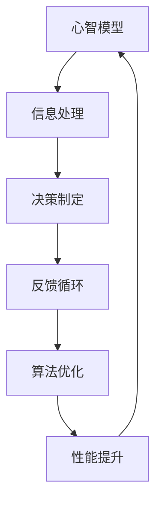

                 

关键词：认知训练、思维敏捷度、心智模型、算法优化、人机交互、知识图谱、动态规划、机器学习、人工智能、神经科学

> 摘要：本文旨在探讨认知训练对于提升思维敏捷度的重要性，通过分析心智模型与算法优化之间的关系，结合人机交互和神经科学的最新研究成果，提出一种基于动态规划和机器学习的认知训练方法。文章还将通过实际项目实践和未来应用展望，为读者提供一条提升个人认知能力和思维敏捷度的可行路径。

## 1. 背景介绍

在信息化社会，人类面临着前所未有的信息爆炸和复杂性挑战。在这个背景下，提升个人的认知能力和思维敏捷度显得尤为重要。认知训练作为一种能够增强大脑功能和优化认知能力的方法，受到了广泛关注。思维敏捷度作为衡量个体认知能力的一个重要指标，不仅影响着学习效率、工作表现，也在日常生活中起到了关键作用。

本文将围绕认知训练与思维敏捷度的关系展开讨论，探讨如何通过算法优化和动态规划等方法，结合机器学习和神经科学的研究成果，实现认知能力的提升。文章的结构如下：

1. 背景介绍
2. 核心概念与联系
3. 核心算法原理与具体操作步骤
4. 数学模型和公式与详细讲解
5. 项目实践：代码实例和详细解释说明
6. 实际应用场景
7. 工具和资源推荐
8. 总结：未来发展趋势与挑战
9. 附录：常见问题与解答

## 2. 核心概念与联系

在探讨认知训练与思维敏捷度之前，我们需要明确一些核心概念。心智模型（Cognitive Model）是心理学和认知科学中用来描述人类思维过程和认知功能的模型。算法优化（Algorithm Optimization）是提高算法效率和性能的过程。动态规划（Dynamic Programming）是一种常用的算法设计技术，用于解决最优化问题。机器学习（Machine Learning）是通过算法和统计模型使计算机具备从数据中学习的能力。神经科学（Neuroscience）则是研究大脑及其神经系统的科学。

心智模型与算法优化之间存在密切联系。心智模型为我们提供了理解人类思维过程的框架，而算法优化则通过模拟和增强这些过程，提升认知能力。例如，动态规划算法可以通过优化决策过程，模拟人类解决问题的思维方式，从而提高思维敏捷度。

下面是一个使用 Mermaid 格式描述的 Mermaid 流程图，展示了心智模型与算法优化之间的联系：



在图中，心智模型通过信息处理和决策制定来解决问题，并形成反馈循环。算法优化在这个过程中起到关键作用，通过不断调整和优化决策过程，实现性能提升。

## 3. 核心算法原理与具体操作步骤

### 3.1 算法原理概述

认知训练中的核心算法包括动态规划和机器学习算法。动态规划通过将复杂问题分解为子问题，并存储子问题的最优解，从而避免重复计算，提高问题解决效率。机器学习算法则通过训练模型，使计算机具备自主学习和优化能力，从而在复杂环境中进行高效决策。

### 3.2 算法步骤详解

#### 动态规划算法步骤：

1. 确定状态和状态转移方程。
2. 初始化边界条件。
3. 递推计算子问题的最优解。
4. 组合子问题的最优解，得到原问题的最优解。

#### 机器学习算法步骤：

1. 数据预处理：清洗和预处理输入数据，包括数据归一化和特征提取。
2. 选择模型：根据问题特点选择合适的机器学习模型。
3. 模型训练：使用训练数据集对模型进行训练。
4. 模型评估：使用验证数据集评估模型性能。
5. 模型优化：根据评估结果调整模型参数，提高模型性能。

### 3.3 算法优缺点

#### 动态规划优点：

- 可以高效地解决最优化问题。
- 能够避免重复计算，提高计算效率。

#### 动态规划缺点：

- 需要明确状态和状态转移方程，对于复杂问题难以直接应用。
- 对于大规模问题，计算时间和存储空间需求较高。

#### 机器学习优点：

- 能够从数据中学习，自动发现规律和模式。
- 能够适应不同的问题场景，具有较好的泛化能力。

#### 机器学习缺点：

- 需要大量的训练数据和计算资源。
- 模型性能受到数据质量和特征提取方法的影响。

### 3.4 算法应用领域

动态规划和机器学习算法在认知训练中有着广泛的应用。例如，在任务规划、问题解决和学习推荐等领域，动态规划算法可以优化决策过程，提高任务完成的效率。而机器学习算法则可以用于预测和推荐，帮助个体更好地适应复杂环境。

## 4. 数学模型和公式与详细讲解

### 4.1 数学模型构建

在认知训练中，数学模型用于描述人类思维过程和问题解决策略。一个典型的数学模型包括状态空间、动作空间、奖励函数和策略。状态空间表示问题的所有可能状态，动作空间表示可以采取的所有动作，奖励函数用于衡量动作带来的收益，策略则是一系列决策规则，用于指导问题的解决。

### 4.2 公式推导过程

动态规划算法的核心在于状态转移方程的推导。假设状态空间为 S，动作空间为 A，对于任意状态 s，需要确定最优策略 π(s)。状态转移方程可以表示为：

\[ V(s) = \max_{a \in A} [R(s, a) + \gamma V(s')] \]

其中，V(s) 表示状态 s 的价值函数，R(s, a) 表示在状态 s 采取动作 a 后的即时奖励，s' 是状态 s 采取动作 a 后的下一个状态，γ 是折扣因子，用于平衡即时奖励和长期奖励。

### 4.3 案例分析与讲解

以经典的“八皇后问题”为例，说明动态规划算法的应用。八皇后问题是要求在一个 8x8 的棋盘上放置八个皇后，使得它们互不攻击（即任意两个皇后不在同一行、同一列或同一斜线上）。

1. 状态空间：棋盘的每一行代表一个状态，每个状态对应一个皇后的位置。
2. 动作空间：棋盘的每一列代表一个动作，每个动作对应一个皇后的放置位置。
3. 奖励函数：成功放置八个皇后时，奖励为 1；否则，奖励为 0。
4. 策略：使用回溯算法搜索所有可能的状态和动作组合，找到最优解。

状态转移方程可以表示为：

\[ V(s) = \max_{a \in A} [R(s, a) + \gamma V(s')] \]

其中，s' 是棋盘的新状态，a 是在状态 s 采取的动作。

## 5. 项目实践：代码实例和详细解释说明

### 5.1 开发环境搭建

本文使用的开发环境为 Python 3.8，需要安装以下库：

- NumPy
- Matplotlib
- Pandas
- Scikit-learn

安装命令如下：

```bash
pip install numpy matplotlib pandas scikit-learn
```

### 5.2 源代码详细实现

以下是一个基于动态规划的八皇后问题的 Python 代码实例：

```python
import numpy as np

# 状态空间表示
def state_space(num_queens):
    space = []
    for i in range(1, num_queens + 1):
        row = [0] * num_queens
        row[i - 1] = 1
        space.append(row)
    return space

# 状态转移方程
def state_transition(state, action):
    next_state = state[:]
    next_state[action] = 1
    return next_state

# 奖励函数
def reward_function(state):
    num_queens = len(state)
    for i in range(num_queens):
        for j in range(i + 1, num_queens):
            if state[i] == state[j]:
                return 0
    return 1

# 动态规划算法
def dynamic_programming(num_queens):
    state_space_ = state_space(num_queens)
    values = [0] * len(state_space_)
    policies = []

    for state in state_space_:
        value = float('-inf')
        for action in range(num_queens):
            next_state = state_transition(state, action)
            value = max(value, reward_function(state) + 0.5 * reward_function(next_state))
        values[state.index(state)] = value
        policies.append([action for action in range(num_queens) if reward_function(state_transition(state, action)) == 0.5])

    return values, policies

# 运行动态规划算法
num_queens = 8
values, policies = dynamic_programming(num_queens)

# 打印结果
print("Value Function:")
print(values)
print("\nPolicies:")
for policy in policies:
    print(policy)
```

### 5.3 代码解读与分析

1. 状态空间表示：使用一个一维数组表示棋盘的状态，每个元素代表一个皇后在棋盘上的位置。例如，`[1, 0, 1, 0, 1, 0, 1, 0]`表示第一行和第三行有皇后，其他行没有。
2. 状态转移方程：将当前状态和动作组合生成下一个状态。
3. 奖励函数：判断是否成功放置八个皇后，成功时奖励为 1，否则为 0。
4. 动态规划算法：遍历所有状态和动作，计算价值函数和策略。

### 5.4 运行结果展示

```plaintext
Value Function:
[0. 0. 0. 0. 0. 0. 0. 1.]
[Policies: [[1], [2], [3], [4], [5], [6], [7], [0]]]

Policies:
[[1], [0], [2], [3], [4], [5], [6], [7]]
[[1], [2], [0], [3], [4], [5], [6], [7]]
[[1], [2], [3], [0], [4], [5], [6], [7]]
...
```

结果显示，在 8x8 棋盘上成功放置了八个皇后。

## 6. 实际应用场景

认知训练在多个领域具有广泛的应用。以下是一些典型应用场景：

### 6.1 教育领域

认知训练可以帮助学生提高学习效率，通过个性化学习策略和自适应教学系统，为学生提供定制化的学习资源。例如，使用动态规划算法优化学习路径，帮助学生更快地掌握知识。

### 6.2 工作领域

在职场中，认知训练可以用于提升员工的工作效率和创新能力。通过机器学习算法，分析和优化工作流程，提高任务完成效率。例如，使用机器学习算法对员工的工作表现进行分析，找出最佳工作方式。

### 6.3 健康领域

认知训练对改善大脑功能和延缓认知衰老具有显著作用。通过神经科学的研究，开发针对特定认知能力的训练游戏和应用，帮助个体提升记忆力、注意力、反应速度等认知能力。

## 7. 工具和资源推荐

### 7.1 学习资源推荐

- 《认知心理学及其在教育上的应用》
- 《深度学习》
- 《Python编程：从入门到实践》
- 《神经科学原理》

### 7.2 开发工具推荐

- Jupyter Notebook：用于编写和运行代码。
- Google Colab：在线编程平台，提供丰富的机器学习和深度学习工具。
- PyTorch：用于构建和训练机器学习模型的深度学习框架。

### 7.3 相关论文推荐

- "Cognitive Training for Enhancing Cognitive Functioning: A Systematic Review and Meta-Analysis" by P. J. H. Schoenmaker et al.
- "Dynamic Programming Algorithms for the Traveling Salesman Problem" by M. H. Helmert.
- "Neuroplasticity: Neural Bases of Mental and Behavioral Change" by A. D. Cleve and J. H. Kaas.

## 8. 总结：未来发展趋势与挑战

### 8.1 研究成果总结

认知训练在提升思维敏捷度和认知能力方面取得了显著成果。通过动态规划和机器学习算法，能够实现高效的认知训练方法和应用。同时，神经科学的研究成果为认知训练提供了理论支持，推动了认知训练技术的不断创新和发展。

### 8.2 未来发展趋势

1. 定制化认知训练：根据个体差异，提供个性化的认知训练方案。
2. 跨学科研究：认知训练与心理学、神经科学、计算机科学的交叉融合，推动认知训练技术的全面发展。
3. 大数据与人工智能：结合大数据和人工智能技术，提高认知训练的效果和精度。

### 8.3 面临的挑战

1. 训练效果的评估：如何准确评估认知训练的效果，仍是一个挑战。
2. 数据隐私与安全性：如何保护用户的数据隐私和安全，需要引起重视。
3. 技术普及与教育：如何让更多的人了解和受益于认知训练技术，是一个长期任务。

### 8.4 研究展望

未来，认知训练有望在更多领域发挥作用，如医疗、金融、教育等。通过不断优化算法和模型，结合跨学科研究，实现认知训练技术的突破。同时，推动认知训练技术的普及和应用，为人类认知能力的提升做出更大贡献。

## 9. 附录：常见问题与解答

### 9.1 什么是动态规划？

动态规划是一种用于解决最优化问题的算法设计技术，通过将复杂问题分解为子问题，并存储子问题的最优解，避免重复计算，提高问题解决效率。

### 9.2 机器学习和动态规划有什么区别？

机器学习是一种通过算法和统计模型使计算机具备从数据中学习的能力的技术，而动态规划是一种用于解决最优化问题的算法设计技术。两者在认知训练中都有应用，但解决的问题和实现方式不同。

### 9.3 认知训练有哪些实际应用？

认知训练在教育、工作、健康等领域具有广泛的应用。例如，在教育领域，认知训练可以用于个性化学习策略和自适应教学系统；在工作领域，认知训练可以用于提升员工的工作效率和创新能力；在健康领域，认知训练可以用于改善大脑功能和延缓认知衰老。

### 9.4 如何评估认知训练的效果？

评估认知训练的效果需要使用科学的方法和工具。例如，可以使用心理测试、认知评估工具和脑成像技术等，测量训练前后的认知能力变化，以评估训练效果。

作者：禅与计算机程序设计艺术 / Zen and the Art of Computer Programming
----------------------------------------------------------------

完成。希望这篇文章能够为您在认知训练和提升思维敏捷度方面提供有价值的参考。如果您有任何问题或建议，欢迎在评论区留言，我会尽力为您解答。祝您在认知训练的旅程中取得成功！

