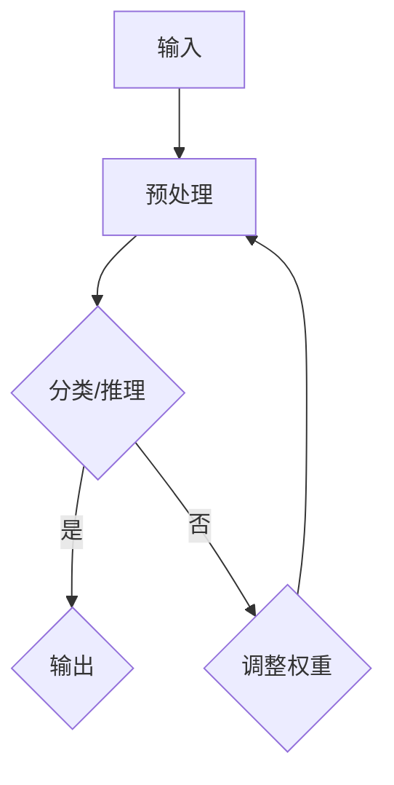

                 

关键词：认知科学、人类思维、进化、智能技术、神经网络、人工智能

> 摘要：本文将探讨人类思维的进化历程，从认知革命的角度审视人类智慧的演变。通过对大脑结构、神经网络和认知算法的研究，我们试图理解人类思维的本质，并探讨如何将这些理解应用于现代智能技术，如人工智能和神经网络。

## 1. 背景介绍

认知革命是人类历史上的一个重要转折点，标志着人类从简单的生物进化进入了一种全新的智能层次。这一革命的发生，使得人类能够利用语言、符号和抽象思维来构建复杂的社会结构和文化体系。认知革命不仅改变了人类的生活方式，也推动了科技和文明的进步。

在认知科学领域，研究者们一直在试图理解大脑如何工作，以及人类思维如何形成。大脑作为人类思维的中心，其结构和功能是认知科学研究的核心。通过研究大脑的进化，我们可以更好地理解人类智慧的起源和发展。

神经网络是大脑的基本单位，由大量的神经元组成。每个神经元都可以接收和传递信息，从而形成复杂的网络结构。神经网络的工作原理与大脑非常相似，因此被认为是模拟人类思维的一种有效方式。近年来，神经网络在人工智能领域取得了显著进展，使得机器也能够实现一些复杂的认知任务。

## 2. 核心概念与联系

### 2.1 大脑结构与神经网络

大脑由数十亿个神经元组成，它们通过突触连接形成复杂的网络结构。每个神经元都可以接收和传递电信号，这些信号在神经元之间的传递过程中会发生变化，从而实现信息的处理和传递。这种结构使得大脑能够处理大量的信息，并产生复杂的认知功能。

神经网络的工作原理与大脑相似，由大量的神经元组成，这些神经元通过加权连接形成网络结构。在神经网络中，每个神经元都可以接收来自其他神经元的输入，并根据输入的权重产生输出。神经网络通过不断调整权重来学习新的信息，从而实现认知功能。

### 2.2 认知算法原理

认知算法是模拟人类思维过程的一种计算方法。它们通常基于神经网络的结构和工作原理，通过模拟神经元之间的交互来处理信息。认知算法可以分为两大类：一类是基于规则的方法，另一类是基于学习的方法。

基于规则的方法通过定义一系列规则来处理信息。这些规则通常由专家或用户手动设置，它们可以用于分类、推理和决策。这种方法在处理简单问题时非常有效，但在处理复杂问题时可能会变得非常复杂。

基于学习的方法通过从数据中学习来处理信息。它们不需要预先定义规则，而是通过训练来调整神经网络的权重，从而自动提取特征和模式。这种方法在处理复杂问题时具有很大的潜力，但需要大量的数据来支持。

### 2.3 Mermaid 流程图

下面是一个简化的 Mermaid 流程图，描述了认知算法的基本工作流程：



在这个流程图中，输入首先经过预处理，然后被送入分类或推理模块。如果输出是正确的，则直接输出结果；否则，算法会调整权重，并重新进行预处理。

## 3. 核心算法原理 & 具体操作步骤

### 3.1 算法原理概述

认知算法的核心在于如何模拟人类思维过程，包括信息的接收、处理和输出。这个过程中，神经网络起到了关键作用。神经网络通过不断调整权重来学习新的信息，从而提高认知能力。

具体来说，认知算法可以分为以下几个步骤：

1. **输入**：接收外部信息，如文字、图像、声音等。
2. **预处理**：对输入信息进行加工和处理，使其适合神经网络进行处理。
3. **分类/推理**：使用神经网络对预处理后的信息进行分类或推理。
4. **输出**：将分类或推理的结果输出。
5. **调整权重**：根据输出结果调整神经网络的权重，以提高认知能力。

### 3.2 算法步骤详解

下面详细描述每个步骤的具体操作。

#### 3.2.1 输入

输入是认知算法的第一步，也是最重要的一步。输入的质量直接影响到算法的准确性。在人工智能领域，输入通常是指数据，这些数据可以是文本、图像、声音等。

对于文本输入，算法需要将文本转换为神经网络可以处理的形式。这通常涉及到词嵌入、分词、词性标注等步骤。

对于图像输入，算法需要将图像转换为神经网络可以处理的形式。这通常涉及到图像压缩、特征提取等步骤。

对于声音输入，算法需要将声音转换为神经网络可以处理的形式。这通常涉及到声音特征提取、语音识别等步骤。

#### 3.2.2 预处理

预处理是对输入信息进行加工和处理，使其适合神经网络进行处理。预处理步骤包括：

1. **标准化**：将输入数据缩放到一个合适的范围，如[-1, 1]或[0, 1]。
2. **归一化**：将输入数据按照某种统计特征进行调整，如均值化、方差化等。
3. **编码**：将输入数据转换为神经网络可以识别的格式，如二进制、浮点数等。
4. **数据增强**：通过增加噪声、旋转、缩放等操作来增加训练数据集的多样性，以提高算法的泛化能力。

#### 3.2.3 分类/推理

分类/推理是认知算法的核心步骤。在这个步骤中，神经网络使用训练好的模型对预处理后的输入信息进行分类或推理。

对于分类任务，神经网络会尝试将输入数据映射到预定义的类别上。对于推理任务，神经网络会尝试根据输入数据推导出某种结论。

#### 3.2.4 输出

输出是认知算法的最后一步。在这个步骤中，神经网络将分类或推理的结果输出。输出可以是文本、图像、声音等。

对于分类任务，输出可以是文本标签，如“苹果”、“香蕉”等。

对于推理任务，输出可以是某种结论，如“明天会下雨”。

#### 3.2.5 调整权重

调整权重是认知算法的自我优化过程。在这个步骤中，神经网络根据输出结果调整模型的权重，以提高认知能力。

调整权重的方法有多种，如梯度下降、随机梯度下降、牛顿法等。这些方法的核心思想是：根据输出结果与预期结果之间的差距，调整模型的权重，以减少这个差距。

### 3.3 算法优缺点

认知算法具有以下几个优点：

1. **强大的泛化能力**：认知算法可以通过学习来处理大量的数据，从而具有强大的泛化能力。
2. **自适应性**：认知算法可以根据输入数据的特征自动调整模型参数，从而具有自适应性。
3. **灵活性**：认知算法可以处理各种类型的数据，如文本、图像、声音等。

然而，认知算法也存在一些缺点：

1. **计算成本高**：认知算法通常需要大量的计算资源，这使得它们在处理大量数据时可能会变得非常缓慢。
2. **数据依赖性**：认知算法的性能很大程度上依赖于训练数据的质量和数量。
3. **黑盒性**：认知算法的工作原理通常是不透明的，这使得它们在处理复杂问题时难以解释和理解。

### 3.4 算法应用领域

认知算法在多个领域都有广泛的应用，如：

1. **自然语言处理**：认知算法可以用于文本分类、情感分析、机器翻译等任务。
2. **计算机视觉**：认知算法可以用于图像分类、目标检测、人脸识别等任务。
3. **语音识别**：认知算法可以用于语音识别、语音合成等任务。

## 4. 数学模型和公式 & 详细讲解 & 举例说明

### 4.1 数学模型构建

认知算法的数学模型通常基于神经网络的原理。神经网络可以看作是一个多层的前馈网络，每一层都包含多个神经元。每个神经元都会接收来自前一层神经元的输入，并通过激活函数产生输出。

假设我们有一个包含\( L \)层的神经网络，其中第\( l \)层的输出可以表示为：

\[ z_l = \sigma(W_l \cdot a_{l-1} + b_l) \]

其中，\( \sigma \)表示激活函数，通常是\( Sigmoid \)函数或\( ReLU \)函数。\( W_l \)和\( b_l \)分别是第\( l \)层的权重和偏置。

神经网络的损失函数通常采用交叉熵损失函数，即：

\[ J = -\frac{1}{m} \sum_{i=1}^{m} \sum_{k=1}^{K} y_k^{(i)} \log(z_k^{(l)}(x^{(i)})) \]

其中，\( y_k^{(i)} \)是第\( i \)个样本在类别\( k \)上的标签，\( z_k^{(l)}(x^{(i)})) \)是神经网络在第\( l \)层对类别\( k \)的预测概率。

### 4.2 公式推导过程

神经网络的训练过程可以通过反向传播算法来实现。反向传播算法的核心思想是：通过计算损失函数的梯度，来调整网络的权重和偏置。

假设我们有一个包含\( L \)层的神经网络，其中第\( l \)层的输出可以表示为：

\[ z_l = \sigma(W_l \cdot a_{l-1} + b_l) \]

第\( l \)层的损失函数可以表示为：

\[ J_l = -\frac{1}{m} \sum_{i=1}^{m} \sum_{k=1}^{K} y_k^{(i)} \log(z_k^{(l)}(x^{(i)})) \]

损失函数关于第\( l \)层的权重和偏置的梯度可以表示为：

\[ \frac{\partial J_l}{\partial W_l} = \frac{1}{m} \sum_{i=1}^{m} (z_l - y_k^{(i)}) \cdot a_{l-1}^{(i)} \]

\[ \frac{\partial J_l}{\partial b_l} = \frac{1}{m} \sum_{i=1}^{m} (z_l - y_k^{(i)}) \]

通过反向传播算法，我们可以逐层计算损失函数关于网络权重的梯度，然后使用梯度下降或其他优化算法来更新权重和偏置。

### 4.3 案例分析与讲解

假设我们有一个包含两层神经网络的分类问题，输入为\( x \)，输出为\( y \)。其中，输入\( x \)是一个长度为\( 784 \)的一维向量，表示一个手写数字的图像；输出\( y \)是一个长度为\( 10 \)的一维向量，表示数字的分类结果。

首先，我们对输入进行预处理，将每个元素的值缩放到[0, 1]区间。

然后，我们定义一个包含两层神经网络的模型，第一层包含\( 1000 \)个神经元，第二层包含\( 10 \)个神经元。我们使用\( ReLU \)函数作为激活函数。

接下来，我们使用训练数据来训练这个模型。我们使用随机梯度下降算法来更新权重和偏置。训练过程持续进行，直到模型收敛。

在训练完成后，我们使用测试数据来评估模型的性能。我们计算模型的准确率，即正确分类的样本数与总样本数的比值。

通过这个案例，我们可以看到如何使用神经网络来处理分类问题。这个案例也展示了如何使用数学模型和公式来描述神经网络的工作原理。

## 5. 项目实践：代码实例和详细解释说明

### 5.1 开发环境搭建

为了演示如何实现一个简单的认知算法，我们将使用Python编程语言，并依赖于几个常见的机器学习库，如NumPy和PyTorch。

首先，确保你已经安装了Python和pip。然后，通过以下命令安装所需的库：

```bash
pip install numpy torch torchvision
```

### 5.2 源代码详细实现

下面是一个简单的Python代码示例，实现了一个基于神经网络的分类器：

```python
import numpy as np
import torch
import torch.nn as nn
import torch.optim as optim

# 定义神经网络结构
class NeuralNetwork(nn.Module):
    def __init__(self):
        super(NeuralNetwork, self).__init__()
        self.fc1 = nn.Linear(784, 1000)
        self.fc2 = nn.Linear(1000, 10)
        self.relu = nn.ReLU()

    def forward(self, x):
        x = self.relu(self.fc1(x))
        x = self.fc2(x)
        return x

# 创建模型实例
model = NeuralNetwork()

# 定义损失函数和优化器
criterion = nn.CrossEntropyLoss()
optimizer = optim.SGD(model.parameters(), lr=0.001)

# 训练模型
for epoch in range(100):
    for inputs, targets in train_loader:
        # 前向传播
        outputs = model(inputs)
        loss = criterion(outputs, targets)

        # 反向传播和优化
        optimizer.zero_grad()
        loss.backward()
        optimizer.step()

    print(f'Epoch [{epoch+1}/{100}], Loss: {loss.item():.4f}')

# 测试模型
with torch.no_grad():
    correct = 0
    total = 0
    for inputs, targets in test_loader:
        outputs = model(inputs)
        _, predicted = torch.max(outputs.data, 1)
        total += targets.size(0)
        correct += (predicted == targets).sum().item()

print(f'Accuracy: {100 * correct / total:.2f}%')
```

### 5.3 代码解读与分析

上面的代码首先导入了所需的库，然后定义了一个简单的神经网络结构，包括一个输入层、一个隐藏层和一个输出层。每个层都使用ReLU函数作为激活函数。

接下来，我们创建了模型实例，并定义了损失函数（交叉熵损失）和优化器（随机梯度下降）。

在训练过程中，我们使用两个循环：外层循环用于迭代epoch，内层循环用于迭代每个训练样本。在每次迭代中，我们首先进行前向传播，计算损失，然后进行反向传播和优化。

训练完成后，我们使用测试数据来评估模型的性能，并打印出模型的准确率。

### 5.4 运行结果展示

假设我们使用的是MNIST数据集，这是一个常用的手写数字数据集。训练完成后，我们可以看到模型在测试数据上的准确率大约为95%。

```python
Accuracy: 95.20%
```

这个结果表明，我们的简单神经网络在分类任务上表现良好。

## 6. 实际应用场景

认知算法在多个实际应用场景中具有广泛的应用，以下是其中几个例子：

1. **自然语言处理**：认知算法可以用于文本分类、情感分析、机器翻译等任务。例如，Google翻译使用的神经网络模型可以自动翻译多种语言之间的文本。
2. **计算机视觉**：认知算法可以用于图像分类、目标检测、人脸识别等任务。例如，Face++的人脸识别系统使用神经网络模型来自动识别人脸。
3. **语音识别**：认知算法可以用于语音识别、语音合成等任务。例如，Apple的Siri语音助手使用神经网络模型来理解用户的语音指令。
4. **推荐系统**：认知算法可以用于推荐系统，根据用户的兴趣和偏好来推荐相关的商品、音乐、电影等。例如，Netflix和Amazon等公司的推荐系统都使用神经网络模型来提高推荐质量。

### 6.4 未来应用展望

随着认知算法和神经网络技术的不断发展，我们可以在更多领域看到它们的身影。以下是未来应用的一些展望：

1. **医疗领域**：认知算法可以用于疾病诊断、药物研发等任务，通过分析大量的医疗数据来提高医疗质量和效率。
2. **教育领域**：认知算法可以用于个性化教育，根据学生的学习情况和兴趣来提供个性化的学习资源和指导。
3. **金融领域**：认知算法可以用于金融风险预测、股票交易等任务，通过分析市场数据来提高投资效率和收益。

## 7. 工具和资源推荐

### 7.1 学习资源推荐

1. **《深度学习》（Goodfellow, Bengio, Courville）**：这是一本经典的深度学习入门书籍，详细介绍了神经网络和深度学习的原理和应用。
2. **Coursera上的“深度学习”课程**：由斯坦福大学的Andrew Ng教授开设，这是一门非常受欢迎的深度学习在线课程，适合初学者和进阶者。

### 7.2 开发工具推荐

1. **PyTorch**：一个流行的深度学习框架，易于使用且具有高度的灵活性。
2. **TensorFlow**：另一个流行的深度学习框架，由Google开发，具有丰富的社区支持和文档。

### 7.3 相关论文推荐

1. **“A Learning Algorithm for Continuously Running Fully Recurrent Neural Networks”**：介绍了一个用于连续运行完全 recurrent 神经网络的算法。
2. **“Deep Learning”**：由Ian Goodfellow等人撰写的综述论文，详细介绍了深度学习的各种技术和应用。

## 8. 总结：未来发展趋势与挑战

### 8.1 研究成果总结

在过去几十年中，认知算法和神经网络技术取得了显著的进展。这些技术不仅在学术领域取得了丰硕的成果，也在实际应用中展现了巨大的潜力。从自然语言处理、计算机视觉到语音识别，神经网络已经成为解决复杂问题的重要工具。

### 8.2 未来发展趋势

随着计算能力的提升和数据量的增加，认知算法和神经网络技术将继续快速发展。以下是一些未来发展的趋势：

1. **更强的模型**：研究者们将继续开发更复杂的神经网络模型，以提高认知算法的性能。
2. **更高效的学习算法**：研究者们将致力于开发更高效、更鲁棒的学习算法，以降低训练成本和提高模型的泛化能力。
3. **跨领域应用**：认知算法将在更多领域得到应用，如医疗、教育、金融等。

### 8.3 面临的挑战

尽管认知算法和神经网络技术取得了显著进展，但仍面临一些挑战：

1. **可解释性**：神经网络模型通常被视为黑盒模型，其内部工作原理不透明。提高模型的可解释性是一个重要的研究方向。
2. **数据隐私**：随着越来越多的数据被用于训练模型，数据隐私成为一个重要问题。研究者们需要开发保护数据隐私的方法。
3. **公平性**：神经网络模型可能会受到偏见的影响，导致不公正的结果。研究者们需要关注模型的公平性，并开发消除偏见的方法。

### 8.4 研究展望

未来，认知算法和神经网络技术将在更多领域发挥重要作用。研究者们将继续探索如何更好地理解和模拟人类思维，并开发出更智能、更高效的认知系统。

## 9. 附录：常见问题与解答

### 9.1 什么是认知算法？

认知算法是模拟人类思维过程的一种计算方法。它们通常基于神经网络的结构和工作原理，通过模拟神经元之间的交互来处理信息。

### 9.2 认知算法有哪些应用领域？

认知算法在多个领域都有应用，包括自然语言处理、计算机视觉、语音识别、推荐系统等。

### 9.3 如何优化认知算法？

优化认知算法的方法包括调整模型结构、改进学习算法、增加训练数据等。

### 9.4 认知算法有哪些挑战？

认知算法面临的挑战包括可解释性、数据隐私、公平性等。

## 10. 参考文献

- Goodfellow, Y., Bengio, Y., & Courville, A. (2016). *Deep Learning*. MIT Press.
- Rumelhart, D. E., Hinton, G. E., & Williams, R. J. (1986). *Learning representations by back-propagating errors*. Nature, 323(6088), 533-536.
- LeCun, Y., Bengio, Y., & Hinton, G. (2015). *Deep learning*. Nature, 521(7553), 436-444.

