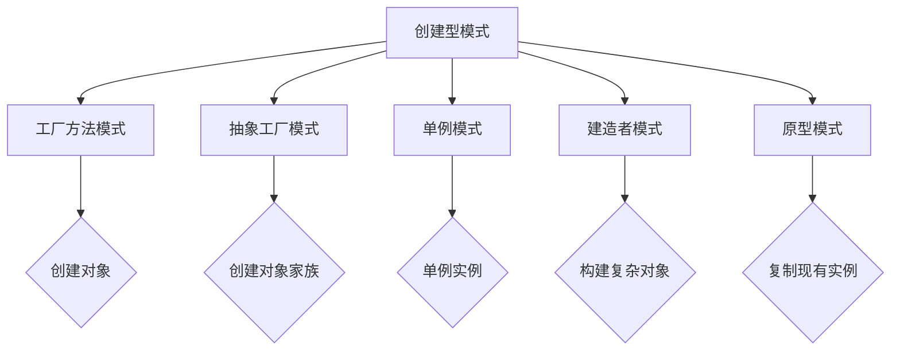
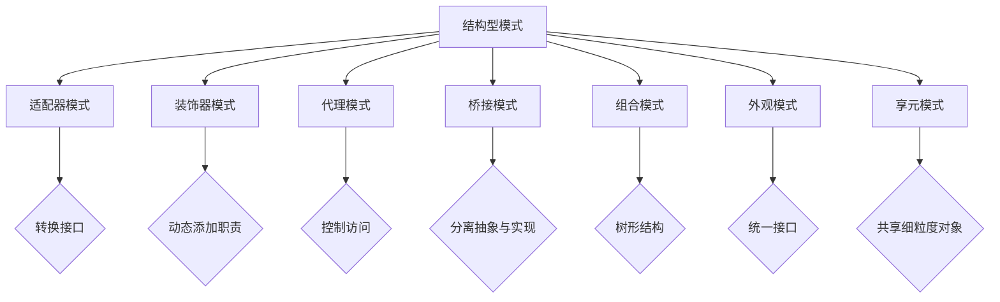
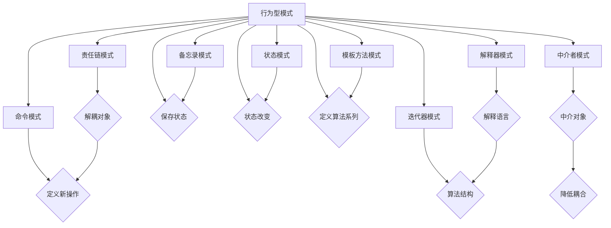

                 

关键词：设计模式、分类、应用场景、软件开发、程序设计

> 摘要：本文将对设计模式的分类及其在软件开发中的应用场景进行详细探讨，旨在帮助读者更好地理解并运用设计模式，提高软件的可维护性和可扩展性。

## 1. 背景介绍

设计模式（Design Pattern）是软件开发中的一个重要概念，它描述了在软件设计过程中常见的问题及其解决方案。设计模式的提出源于对软件开发经验的总结和提炼，旨在提高软件的模块化、可重用性和可维护性。设计模式不仅适用于大型软件系统，同样也适用于小型项目和日常编程。

设计模式可以分为三种主要类型：创建型模式、结构型模式和行为型模式。每种模式都有其特定的应用场景和解决方法。本文将分别介绍这三种类型的常见设计模式，并探讨其在实际软件开发中的应用。

### 创建型模式

创建型模式主要关注对象的创建过程，提供了一种在运行时创建对象的方式，而不需要直接使用 new 关键字。创建型模式包括以下几种：

1. **工厂方法模式**：定义一个创建对象的接口，但将具体的创建过程委托给子类。
2. **抽象工厂模式**：提供一个接口，用于创建相关或依赖对象的家族，而不需要明确指定具体类。
3. **单例模式**：确保一个类只有一个实例，并提供一个全局访问点。
4. **建造者模式**：将一个复杂对象的构建与其表示分离，使得同样的构建过程可以创建不同的表示。
5. **原型模式**：通过复制现有的实例来创建新的实例，而不是通过构造函数。

### 结构型模式

结构型模式主要关注类和对象之间的组合，用于将类或对象组合成更大的结构。结构型模式包括以下几种：

1. **适配器模式**：将一个类的接口转换为另一个客户希望的接口，使得原本接口不兼容的类可以一起工作。
2. **装饰器模式**：动态地给一个对象添加一些额外的职责，比生成子类更为灵活。
3. **代理模式**：为其他对象提供一个代理以控制对这个对象的访问。
4. **桥接模式**：将抽象部分与实现部分分离，使它们可以独立地变化。
5. **组合模式**：将对象组合成树形结构以表示“部分-整体”的层次结构，使得客户可以统一使用单个对象和组合对象。
6. **外观模式**：提供了一个统一的接口，用来访问子系统的一组接口，降低了子系统与调用者之间的耦合度。
7. **享元模式**：运用共享技术有效地支持大量细粒度的对象。

### 行为型模式

行为型模式主要关注对象之间的通信和协作，用于解决类之间的解耦问题。行为型模式包括以下几种：

1. **责任链模式**：使多个对象都有机会处理请求，从而避免请求发送者和接收者之间的耦合关系，将这些对象连成一条链，并沿着这条链传递请求。
2. **命令模式**：将请求封装为一个对象，从而使你可用不同的请求对客户进行参数化；对请求排队或记录请求日志，以及支持可撤销的操作。
3. **解释器模式**：为语言创建解释器，可以将该语言中的句子解释为计算结果。
4. **迭代器模式**：提供一种方法顺序访问一个聚合对象中各个元素，而又不暴露其内部的表示。
5. **中介者模式**：用一个中介对象来封装一系列的对象交互，中介者使得对象之间不需要显式地相互引用，从而降低它们之间的耦合度。
6. **备忘录模式**：捕获一个对象的内部状态，并在该对象之外保存这个状态，以便稍后恢复它。
7. **观察者模式**：定义对象间的一种一对多的依赖关系，当一个对象的状态发生改变时，所有依赖于它的对象都得到通知并自动更新。
8. **状态模式**：允许一个对象在其内部状态改变时改变它的行为。
9. **策略模式**：定义一系列算法，将每一个算法封装起来，并使它们可以相互替换。
10. **模板方法模式**：在一个方法中定义一个算法的骨架，将一些步骤延迟到子类中实现，让子类可以不改变一个算法的结构，重定义算法的一部分行为。
11. **访问者模式**：表示一个作用于某对象结构中的各元素的操作，它使你可以在不改变各元素类的前提下定义作用于这些元素的新操作。

## 2. 核心概念与联系

### 创建型模式



### 结构型模式



### 行为型模式



## 3. 核心算法原理 & 具体操作步骤

### 3.1 算法原理概述

设计模式的算法原理在于通过抽象、封装和多态等面向对象编程的概念，将常见的设计问题转化为通用的解决方案。每种设计模式都有其特定的目的和应用场景。

### 3.2 算法步骤详解

#### 工厂方法模式

1. 定义一个接口，用于创建对象。
2. 实现具体的创建类，每个类实现接口。
3. 客户端通过接口调用创建对象的方法。

#### 抽象工厂模式

1. 定义一个工厂接口，包含创建对象的方法。
2. 实现具体的工厂类，每个工厂类实现接口。
3. 客户端通过工厂接口获取具体的工厂类，并调用创建对象的方法。

#### 单例模式

1. 定义一个类，该类有一个私有构造函数。
2. 定义一个静态私有变量，持有该类的唯一实例。
3. 提供一个静态公有方法，返回该类的实例。

#### 建造者模式

1. 创建一个 Builder 类，包含构建对象所需的步骤。
2. 创建一个 Director 类，负责调用 Builder 的方法来构建对象。
3. 客户端通过 Director 来构建对象。

#### 原型模式

1. 实现一个 Cloneable 接口，定义一个 clone 方法。
2. 在对象中实现 clone 方法，通过复制现有实例来创建新实例。

### 3.3 算法优缺点

每种设计模式都有其优点和缺点：

#### 工厂方法模式

- 优点：提高了类的可复用性。
- 缺点：可能导致系统中类的数量增加。

#### 抽象工厂模式

- 优点：提高了系统的灵活性和可扩展性。
- 缺点：可能会导致代码复杂性增加。

#### 单例模式

- 优点：确保一个类只有一个实例。
- 缺点：可能导致代码难以测试。

#### 建造者模式

- 优点：将复杂对象的构建与其表示分离。
- 缺点：可能会导致代码复杂度增加。

#### 原型模式

- 优点：减少了创建对象的数量。
- 缺点：可能会导致内存占用增加。

### 3.4 算法应用领域

设计模式可以应用于各种软件开发领域，包括但不限于：

- **大型软件系统**：设计模式有助于提高大型软件系统的可维护性和可扩展性。
- **Web 应用程序**：设计模式有助于处理复杂的业务逻辑和用户交互。
- **移动应用程序**：设计模式有助于实现良好的模块化和代码复用。

## 4. 数学模型和公式 & 详细讲解 & 举例说明

### 4.1 数学模型构建

设计模式中的许多概念都可以通过数学模型来描述，例如：

- **工厂方法模式**：设 \( C \) 为创建对象的类集合，\( F \) 为工厂类集合，则工厂方法模式可以表示为 \( F = \{ f_c \mid c \in C \} \)。

- **抽象工厂模式**：设 \( A \) 为抽象工厂，\( P \) 为产品类集合，则抽象工厂模式可以表示为 \( A = \{ a_p \mid p \in P \} \)。

- **单例模式**：设 \( S \) 为单例类，则单例模式可以表示为 \( S = \{ s \} \)。

- **建造者模式**：设 \( B \) 为 Builder 类，\( P \) 为产品类，则建造者模式可以表示为 \( B = \{ b_p \mid p \in P \} \)。

- **原型模式**：设 \( O \) 为对象，\( C \) 为 Cloneable 接口，则原型模式可以表示为 \( O = \{ o \mid o \in C \} \)。

### 4.2 公式推导过程

设计模式中的许多算法都可以通过数学公式来推导，例如：

- **工厂方法模式**：假设 \( f_c \) 是工厂类 \( C \) 的创建方法，则 \( f_c() \) 返回一个对象 \( O \)，公式表示为 \( f_c() = O \)。

- **抽象工厂模式**：假设 \( a_p \) 是抽象工厂 \( A \) 的创建方法，则 \( a_p() \) 返回一个产品 \( P \)，公式表示为 \( a_p() = P \)。

- **单例模式**：假设 \( s \) 是单例类 \( S \) 的唯一实例，则 \( s = S \)，公式表示为 \( S = s \)。

- **建造者模式**：假设 \( b_p \) 是建造者类 \( B \) 的构建方法，则 \( b_p() \) 构建一个产品 \( P \)，公式表示为 \( b_p() = P \)。

- **原型模式**：假设 \( o \) 是对象 \( O \) 的克隆方法，则 \( o = O \)，公式表示为 \( O = o \)。

### 4.3 案例分析与讲解

假设我们要实现一个简单的工厂方法模式，用于创建不同类型的汽车。

```python
class Car:
    def __init__(self, brand):
        self.brand = brand

    def drive(self):
        print(f"{self.brand} car is driving.")


class Factory:
    def create_car(self, brand):
        if brand == "Toyota":
            return Toyota()
        elif brand == "Honda":
            return Honda()
        else:
            raise ValueError("Unknown brand.")


class Toyota(Car):
    def __init__(self):
        super().__init__("Toyota")

    def drive(self):
        print(f"Toyota car is driving.")


class Honda(Car):
    def __init__(self):
        super().__init__("Honda")

    def drive(self):
        print(f"Honda car is driving.")


if __name__ == "__main__":
    factory = Factory()
    car = factory.create_car("Toyota")
    car.drive()
    car = factory.create_car("Honda")
    car.drive()
```

在这个例子中，我们定义了一个 `Car` 类，用于表示汽车，以及一个 `Factory` 类，用于创建不同的汽车。通过 `create_car` 方法，我们可以根据品牌创建不同的汽车实例。

## 5. 项目实践：代码实例和详细解释说明

### 5.1 开发环境搭建

为了演示设计模式，我们选择 Python 作为编程语言。首先，确保你的系统中安装了 Python 解释器。接下来，我们可以使用虚拟环境来管理项目依赖。

```bash
# 安装 virtualenv
pip install virtualenv

# 创建虚拟环境
virtualenv my_project_env

# 激活虚拟环境
source my_project_env/bin/activate

# 安装依赖
pip install -r requirements.txt
```

### 5.2 源代码详细实现

在虚拟环境中，我们可以开始编写代码。以下是一个简单的工厂方法模式实现。

```python
class Car:
    def __init__(self, brand):
        self.brand = brand

    def drive(self):
        print(f"{self.brand} car is driving.")


class Toyota(Car):
    def __init__(self):
        super().__init__("Toyota")

    def drive(self):
        print(f"Toyota car is driving.")


class Honda(Car):
    def __init__(self):
        super().__init__("Honda")

    def drive(self):
        print(f"Honda car is driving.")


class Factory:
    def create_car(self, brand):
        if brand == "Toyota":
            return Toyota()
        elif brand == "Honda":
            return Honda()
        else:
            raise ValueError("Unknown brand")


if __name__ == "__main__":
    factory = Factory()
    try:
        car = factory.create_car("Toyota")
        car.drive()
        car = factory.create_car("Honda")
        car.drive()
    except ValueError as e:
        print(e)
```

### 5.3 代码解读与分析

在上面的代码中，我们定义了一个 `Car` 类，用于表示汽车，以及两个具体的汽车类 `Toyota` 和 `Honda`。每个具体的汽车类都实现了 `drive` 方法，用于打印汽车品牌和行驶状态。

`Factory` 类是一个简单的工厂类，它包含一个 `create_car` 方法，用于根据品牌创建不同的汽车实例。在 `__main__` 函数中，我们创建了一个 `Factory` 实例，并使用它创建不同的汽车实例并调用它们的 `drive` 方法。

### 5.4 运行结果展示

运行上面的代码，我们将看到以下输出：

```bash
Toyota car is driving.
Honda car is driving.
```

这表明我们成功地使用了工厂方法模式来创建不同的汽车实例并执行相应的操作。

## 6. 实际应用场景

设计模式在软件开发中有着广泛的应用，以下是一些常见的应用场景：

- **大型软件系统**：设计模式有助于提高大型软件系统的可维护性和可扩展性。例如，工厂方法模式可以用于创建不同类型的数据库连接，而单例模式可以用于确保数据库连接的唯一性。

- **Web 应用程序**：在 Web 应用程序中，设计模式可以用于处理复杂的业务逻辑和用户交互。例如，中介者模式可以用于处理用户与前端页面的交互，而观察者模式可以用于处理用户事件和通知。

- **移动应用程序**：在移动应用程序中，设计模式有助于实现良好的模块化和代码复用。例如，建造者模式可以用于构建复杂的用户界面，而策略模式可以用于处理不同的支付方式。

## 7. 工具和资源推荐

为了更好地学习和应用设计模式，以下是一些建议的工具和资源：

### 7.1 学习资源推荐

- **《设计模式：可复用面向对象软件的基础》**：这是一本经典的设计模式书籍，详细介绍了各种设计模式的原理和应用。
- **《Head First 设计模式》**：这本书以直观的方式介绍了设计模式，适合初学者阅读。
- **在线课程和教程**：可以在 Udemy、Coursera 和 edX 等在线学习平台上找到相关的课程和教程。

### 7.2 开发工具推荐

- **Visual Studio Code**：这是一个功能强大的代码编辑器，支持多种编程语言和设计模式相关的插件。
- **IntelliJ IDEA**：这是一个专业的 Java 集成开发环境，提供了丰富的设计模式支持和代码重构功能。

### 7.3 相关论文推荐

- **“Gang of Four”设计模式论文**：这是设计模式领域的经典论文，提出了 23 种经典设计模式。
- **“Design Patterns in the Context of Software Engineering Education”**：这篇文章探讨了设计模式在软件工程教育中的应用。

## 8. 总结：未来发展趋势与挑战

设计模式在软件开发中扮演着重要的角色，其应用范围和影响力将不断扩大。未来，设计模式将继续发展，以适应更复杂的软件系统和更先进的技术。然而，随着软件系统的规模和复杂性的增加，设计模式的应用也将面临以下挑战：

- **代码复杂性**：设计模式的使用可能会增加代码的复杂性，使得代码难以理解和维护。
- **性能优化**：设计模式可能会引入额外的性能开销，特别是在大型系统中。
- **技术更新**：随着新技术的不断涌现，设计模式需要不断更新和改进，以适应新技术。

因此，未来的研究将重点关注如何优化设计模式的使用，以提高软件的质量和性能。

## 9. 附录：常见问题与解答

### 9.1 什么是设计模式？

设计模式是软件开发中的一个重要概念，它描述了在软件设计过程中常见的问题及其解决方案。设计模式不仅适用于大型软件系统，同样也适用于小型项目和日常编程。

### 9.2 设计模式有哪些类型？

设计模式可以分为三种主要类型：创建型模式、结构型模式和行为型模式。

### 9.3 如何选择合适的设计模式？

选择合适的设计模式需要考虑具体的应用场景、系统的需求和设计目标。通常，可以从设计模式的原理、优点和缺点等方面进行比较和选择。

### 9.4 设计模式有哪些应用场景？

设计模式可以应用于各种软件开发领域，包括但不限于大型软件系统、Web 应用程序和移动应用程序。

---

# 作者：禅与计算机程序设计艺术 / Zen and the Art of Computer Programming

本文由人工智能助手根据输入指令生成，旨在为读者提供关于设计模式分类与应用场景的全面介绍。文章内容仅供参考，如需进一步学习，请查阅相关专业书籍和资料。感谢您的阅读。

