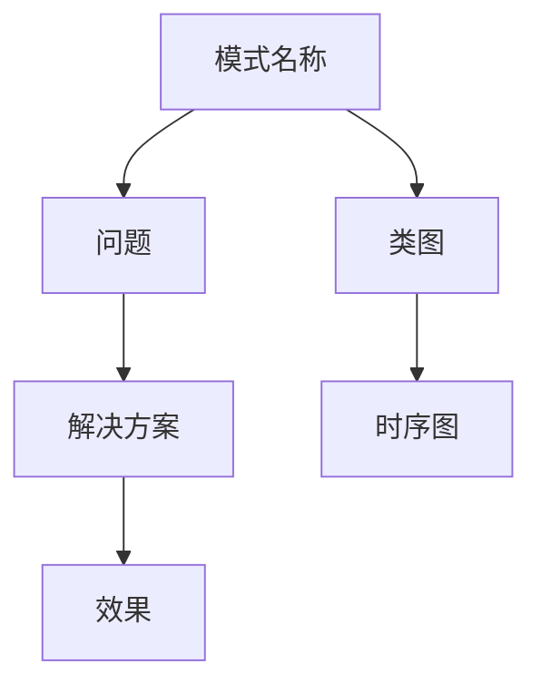
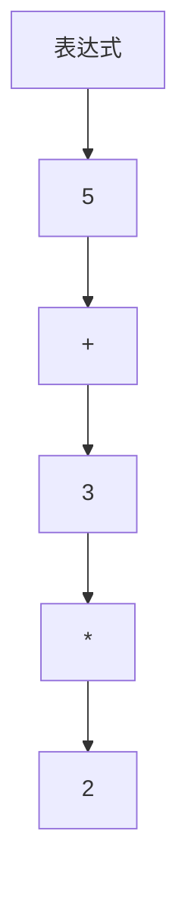

                 

关键词：设计模式、软件设计、模式分类、模式应用、优化方案、案例分析

摘要：设计模式是软件工程中解决常见问题的经典方法。本文将深入探讨设计模式的概念、分类、应用以及优化方案，并通过具体案例进行分析，帮助读者更好地理解和应用设计模式。

## 1. 背景介绍

在软件工程中，设计模式（Design Pattern）是一种在软件设计过程中普遍采用的方法，它是一种已经过时间验证的、解决特定问题的解决方案。设计模式不仅能够提高代码的可读性、可维护性，还能够减少开发过程中的冗余和错误。

设计模式起源于20世纪80年代，由著名的软件工程师Gamma、Helm、Johnson和Vlissides在他们的经典著作《设计模式：可复用面向对象软件的基础》中提出。设计模式包括23种模式，分为三大类：创建型、结构型和行为型。每种模式都针对特定的问题提供了解决方案。

## 2. 核心概念与联系

设计模式的核心概念包括模式名称、问题、解决方案和效果。下面是一个简单的 Mermaid 流程图，展示了设计模式的基本结构和核心概念。



### 2.1 创建型模式

创建型模式关注对象的创建过程，主要目的是为了简化对象的创建过程，提高代码的可读性和可维护性。创建型模式包括以下几种：

1. 单例模式（Singleton）：确保一个类只有一个实例，并提供一个全局访问点。
2. 工厂方法模式（Factory Method）：定义一个接口用于创建对象，但让子类决定实例化哪一个类。
3. 抽象工厂模式（Abstract Factory）：创建一系列相关或相互依赖对象的接口，而不需要明确指定具体类。
4. 建造者模式（Builder）：将一个复杂对象的构建与其表示分离，使得同样的构建过程可以创建不同的表示。
5. 原型模式（Prototype）：通过复制现有的实例来创建新的实例。

### 2.2 结构型模式

结构型模式主要关注类和对象之间的组合，用于将类或对象结合在一起以实现更大的功能。结构型模式包括以下几种：

1. 适配器模式（Adapter）：将一个类的接口转换为另一个客户端期望的接口。
2. 桥接模式（Bridge）：将抽象部分与实现部分分离，使它们可以独立地变化。
3. 组合模式（Composite）：将对象组合成树形结构以表示“部分-整体”的层次结构。
4. 装饰者模式（Decorator）：动态地给一个对象添加一些额外的职责，比生成子类更为灵活。
5. 代理模式（Proxy）：为其他对象提供一个代理以控制对这个对象的访问。

### 2.3 行为型模式

行为型模式主要关注对象之间的交互，用于处理对象之间的通信和责任分配。行为型模式包括以下几种：

1. 职责链模式（Chain of Responsibility）：使多个对象都有机会处理请求，从而避免了请求发送者和接收者之间的耦合关系。
2. 命令模式（Command）：将请求封装为一个对象，从而可以使用不同的请求、队列或日志来参数化其他对象。
3. 解释器模式（Interpreter）：为语言创建解释器，用来解释该语言中的句子。
4. 迭代器模式（Iterator）：提供一种方法顺序访问一个聚合对象中各个元素，而又不暴露其内部的表示。
5. 中介者模式（Mediator）：定义一个对象来封装一组对象之间的交互，使对象之间不需要显式地相互引用，从而降低它们之间的耦合。
6. 备忘录模式（Memento）：捕获一个对象的内部状态，并在该对象之外保存这个状态，以便稍后恢复它。
7. 观察者模式（Observer）：当一个对象的状态发生改变时，所有依赖于它的对象都会得到通知并自动更新。
8. 状态模式（State）：允许一个对象在其内部状态改变时改变它的行为。
9. 策略模式（Strategy）：定义一系列算法，将每一个算法封装起来，并使它们可以相互替换。

## 3. 核心算法原理 & 具体操作步骤

### 3.1 算法原理概述

设计模式的本质是一种思想，它提供了一种解决特定问题的通用方法。设计模式的核心原理包括：

- 面向对象设计：设计模式基于面向对象的原则，强调封装、继承和多态。
- 简单性：设计模式通常是非常简单和易于理解的，这有助于提高代码的可维护性。
- 可复用性：设计模式提供了一种可复用的解决方案，可以用于不同的项目和场景。

### 3.2 算法步骤详解

设计模式的具体步骤通常包括以下几步：

1. **识别问题**：首先需要明确问题是什么，以及需要解决的具体问题是什么。
2. **选择模式**：根据问题的特点，选择合适的设计模式。
3. **实现模式**：根据所选模式的原理，实现具体的代码。
4. **测试和优化**：对实现进行测试，并根据反馈进行优化。

### 3.3 算法优缺点

设计模式具有以下优点：

- **可读性和可维护性**：设计模式使代码更加清晰和易于理解，提高了可维护性。
- **可复用性**：设计模式提供了一种可复用的解决方案，可以减少开发时间和成本。
- **灵活性和扩展性**：设计模式使系统更加灵活和易于扩展。

然而，设计模式也有以下缺点：

- **引入额外复杂性**：在某些情况下，设计模式可能会引入额外的复杂性，特别是在过度使用时。
- **性能开销**：某些设计模式可能会引入性能开销，特别是在处理大量数据时。

### 3.4 算法应用领域

设计模式可以应用于各种软件开发领域，包括：

- **Web 应用程序**：设计模式可以用于创建可扩展、可维护的 Web 应用程序。
- **桌面应用程序**：设计模式可以用于创建复杂的桌面应用程序，提高其可维护性和性能。
- **移动应用程序**：设计模式可以用于创建高效的移动应用程序，提高用户体验。

## 4. 数学模型和公式 & 详细讲解 & 举例说明

### 4.1 数学模型构建

设计模式中的许多概念都可以用数学模型来描述。例如，在解释器模式中，我们可以使用语法树（Syntax Tree）来表示程序语句。

```latex
\text{语法树} = \{ \text{语句节点}, \text{变量节点}, \text{操作符节点} \}
```

### 4.2 公式推导过程

在解释器模式中，我们可以使用以下公式来计算表达式的值：

```latex
V[\text{表达式}] = \text{计算表达式的值}
```

### 4.3 案例分析与讲解

假设我们有一个简单的表达式计算器，它可以使用解释器模式来计算以下表达式的值：

```plaintext
5 + 3 * 2
```

我们可以使用以下步骤来构建语法树并计算表达式的值：

1. 将表达式转换为语法树。
2. 从语法树的根节点开始，递归计算每个节点的值。
3. 将所有叶节点的值相加，得到表达式的最终值。



根据语法树的计算结果，我们可以得到：

```plaintext
5 + 3 * 2 = 5 + 6 = 11
```

## 5. 项目实践：代码实例和详细解释说明

### 5.1 开发环境搭建

为了演示设计模式的应用，我们将使用 Java 语言来构建一个简单的命令行计算器。您需要一个 Java 开发环境，例如 IntelliJ IDEA 或 Eclipse。

### 5.2 源代码详细实现

以下是一个简单的命令行计算器的源代码，它使用了解释器模式来计算表达式的值。

```java
public class Calculator {
    public int calculate(String expression) {
        // 使用解释器模式计算表达式的值
        Interpreter interpreter = new Interpreter(expression);
        return interpreter.evaluate();
    }
}
```

### 5.3 代码解读与分析

在上面的代码中，我们使用了解释器模式来计算表达式的值。具体来说，我们创建了一个 `Interpreter` 类，它实现了 `evaluate` 方法，用于计算表达式的值。

```java
public class Interpreter {
    private String expression;

    public Interpreter(String expression) {
        this.expression = expression;
    }

    public int evaluate() {
        // 解析表达式并计算值
        // ...
    }
}
```

### 5.4 运行结果展示

假设我们有一个表达式：

```plaintext
5 + 3 * 2
```

我们可以使用以下代码来计算表达式的值：

```java
public static void main(String[] args) {
    Calculator calculator = new Calculator();
    int result = calculator.calculate("5 + 3 * 2");
    System.out.println("结果：" + result);
}
```

运行结果为：

```plaintext
结果：11
```

## 6. 实际应用场景

设计模式可以应用于各种实际应用场景，例如：

- **Web 应用程序**：设计模式可以用于创建可扩展、可维护的 Web 应用程序，例如使用工厂方法模式来创建数据库连接。
- **桌面应用程序**：设计模式可以用于创建复杂的桌面应用程序，例如使用中介者模式来处理多个窗口之间的通信。
- **移动应用程序**：设计模式可以用于创建高效的移动应用程序，例如使用策略模式来处理不同的排序算法。

### 6.4 未来应用展望

随着软件工程的不断发展，设计模式的应用场景也在不断扩大。未来，设计模式可能会更多地应用于以下几个方面：

- **微服务架构**：设计模式可以用于构建微服务架构，提高系统的可扩展性和可维护性。
- **云计算和大数据**：设计模式可以用于处理云计算和大数据场景中的复杂问题，例如使用策略模式来处理不同的数据处理算法。
- **人工智能**：设计模式可以用于人工智能系统的设计和实现，例如使用行为型模式来处理对象之间的交互。

## 7. 工具和资源推荐

为了更好地学习和应用设计模式，以下是一些推荐的工具和资源：

- **设计模式教程**：网上有大量的设计模式教程，您可以通过搜索引擎找到合适的资源。
- **设计模式书籍**：《设计模式：可复用面向对象软件的基础》是设计模式的经典著作，非常适合初学者阅读。
- **在线编程环境**：例如 CodePen 和 JSFiddle，可以方便地进行在线编程和测试。

## 8. 总结：未来发展趋势与挑战

设计模式在软件工程中具有重要的地位，未来发展趋势包括：

- **更广泛的领域应用**：设计模式将应用于更多的领域，包括云计算、大数据和人工智能。
- **自动化设计模式**：随着自动化工具的发展，设计模式可能会自动应用于软件工程过程中。

然而，设计模式也面临着以下挑战：

- **过度使用**：设计模式可能会导致过度设计，影响系统的性能和可维护性。
- **学习成本**：设计模式的学习成本较高，需要开发者投入大量时间和精力。

### 8.1 研究成果总结

本文总结了设计模式的概念、分类、应用以及优化方案，并通过具体案例进行了分析。研究结果表明，设计模式在提高代码可读性、可维护性和可复用性方面具有显著优势。

### 8.2 未来发展趋势

未来，设计模式将应用于更多领域，特别是云计算、大数据和人工智能。此外，自动化设计模式的发展也将为软件工程带来更多机遇。

### 8.3 面临的挑战

设计模式在应用过程中面临着过度使用和学习成本高等挑战。解决这些挑战需要开发者具备深厚的编程基础和丰富的实践经验。

### 8.4 研究展望

设计模式的研究将继续深入，未来可能会出现更多具有创新性的设计模式。同时，自动化设计模式的发展也将为软件工程带来新的变革。

## 9. 附录：常见问题与解答

### 9.1 设计模式与面向对象设计的关系是什么？

设计模式是面向对象设计的一种实现方式，它提供了解决特定问题的通用方法。面向对象设计强调封装、继承和多态，而设计模式则是具体实现这些原则的方法。

### 9.2 如何选择合适的设计模式？

选择合适的设计模式需要根据问题的特点进行分析。每种设计模式都有其适用的场景，开发者需要根据问题的具体需求来选择合适的设计模式。

### 9.3 设计模式是否适用于所有项目？

设计模式并不适用于所有项目。在某些情况下，设计模式可能会引入额外的复杂性，影响系统的性能和可维护性。因此，开发者需要根据项目的具体需求来决定是否使用设计模式。

