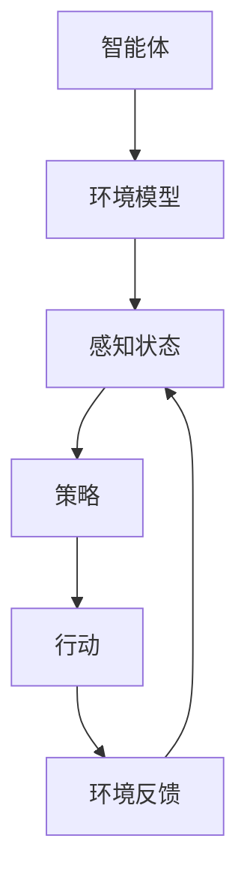

                 

 关键词：AI智能体、设计原则、高效、性能优化、算法、模型、框架、实践、应用场景

> 摘要：本文将深入探讨设计高效AI智能体的原则，分析影响智能体性能的关键因素，并探讨如何通过优化算法、模型和框架来实现高效智能体的设计。同时，本文将结合实际案例和数学模型，提供详细的操作步骤和数学推导，以便读者更好地理解和应用这些原则。最后，本文还将展望AI智能体的未来发展趋势和挑战，以期为研究人员和开发者提供有价值的参考。

## 1. 背景介绍

随着人工智能技术的快速发展，智能体（Agent）在多个领域取得了显著的应用成果。从智能家居到自动驾驶，从金融风控到智能客服，智能体正在不断改变我们的生活和工作方式。然而，随着应用场景的复杂化和多样化，设计高效智能体成为了一个重要的挑战。高效智能体不仅需要具备出色的执行能力，还需要具备高度的自主学习和适应能力。为了实现这一目标，我们需要深入探讨设计高效智能体的原则。

本文将围绕以下四个核心方面展开讨论：

1. **核心概念与联系**：首先，我们将介绍与设计高效智能体相关的基础概念，并通过Mermaid流程图展示智能体架构的核心环节。

2. **核心算法原理 & 具体操作步骤**：接着，我们将详细解析设计高效智能体所需的核心算法原理，并分步骤介绍实现这些算法的具体方法。

3. **数学模型和公式 & 详细讲解 & 举例说明**：在此之后，我们将介绍设计高效智能体的数学模型和公式，并通过具体的案例进行分析和讲解。

4. **项目实践：代码实例和详细解释说明**：最后，我们将通过实际项目中的代码实例，展示如何将上述原则应用到实践中，并进行详细解释和分析。

## 2. 核心概念与联系

在设计高效AI智能体之前，我们需要了解以下几个核心概念：

### 2.1 智能体（Agent）

智能体是一个能够感知环境、自主决策并采取行动的实体。智能体可以是一个计算机程序，也可以是机器人或人类。智能体的核心特征是自主性、适应性和协作性。

### 2.2 环境模型（Environment Model）

环境模型是对智能体运行环境的抽象表示。它包括智能体感知到的状态、行动空间和奖励函数。环境模型是设计智能体算法的基础。

### 2.3 策略（Policy）

策略是智能体在特定环境下采取的行动方案。策略可以通过学习获得，也可以通过手动设计。策略的好坏直接影响智能体的性能。

### 2.4 值函数（Value Function）

值函数是对智能体在未来不同状态下获得的预期奖励的评估。值函数有助于智能体选择最优策略。

下面是一个简化的智能体架构流程图，展示了这些核心概念之间的联系。



## 3. 核心算法原理 & 具体操作步骤

### 3.1 算法原理概述

设计高效智能体的核心在于选择合适的算法，并对其进行优化。常用的智能体算法包括基于模型的算法和基于数据驱动的算法。本文将重点介绍以下三种算法：

1. **深度强化学习（Deep Reinforcement Learning）**
2. **强化学习（Reinforcement Learning）**
3. **决策树（Decision Tree）**

### 3.2 算法步骤详解

#### 3.2.1 深度强化学习

深度强化学习是一种结合深度学习和强化学习的算法。以下是深度强化学习的具体步骤：

1. **初始化**：设置智能体、环境模型、策略和网络参数。
2. **环境建模**：根据应用场景构建环境模型，包括状态空间、行动空间和奖励函数。
3. **策略学习**：使用深度神经网络学习策略函数，将状态映射到行动。
4. **训练过程**：在环境模拟器中运行智能体，收集经验数据，并通过反向传播更新网络参数。
5. **策略评估**：评估策略的好坏，并进行策略优化。

#### 3.2.2 强化学习

强化学习是一种通过奖励信号指导智能体行为的学习方法。以下是强化学习的具体步骤：

1. **初始化**：设置智能体、环境模型、策略和学习率。
2. **环境建模**：构建环境模型，包括状态空间、行动空间和奖励函数。
3. **策略迭代**：在环境中模拟智能体的行为，并根据奖励信号更新策略。
4. **策略评估**：评估当前策略的优劣，并选择最佳策略。
5. **策略优化**：根据评估结果优化策略，提高智能体的性能。

#### 3.2.3 决策树

决策树是一种基于规则的学习方法。以下是决策树的具体步骤：

1. **特征选择**：选择对分类有显著影响的特征。
2. **划分规则**：根据特征选择划分规则，将数据划分为多个子集。
3. **建立树模型**：根据划分规则建立决策树模型。
4. **评估模型**：评估决策树模型的性能，包括准确率、召回率等指标。
5. **模型优化**：根据评估结果调整模型参数，提高模型性能。

### 3.3 算法优缺点

每种算法都有其优缺点，适用于不同的场景。下面是三种算法的优缺点对比：

1. **深度强化学习**：优点在于能够处理高维状态空间，适用于复杂环境。缺点是训练时间较长，对数据依赖较大。
2. **强化学习**：优点在于能够自适应环境变化，适用于动态环境。缺点是训练过程复杂，难以保证收敛性。
3. **决策树**：优点在于简单易懂，易于实现。缺点是易过拟合，对噪声敏感。

### 3.4 算法应用领域

不同算法适用于不同的应用领域。以下是三种算法的应用领域：

1. **深度强化学习**：适用于自动驾驶、游戏AI、机器人等领域。
2. **强化学习**：适用于推荐系统、金融风控、智能客服等领域。
3. **决策树**：适用于分类、回归等问题，如信用评分、疾病诊断等。

## 4. 数学模型和公式 & 详细讲解 & 举例说明

### 4.1 数学模型构建

设计高效智能体需要构建多个数学模型，包括环境模型、策略模型和值函数模型。以下是这些模型的构建过程。

#### 4.1.1 环境模型

环境模型可以表示为状态转移概率矩阵 $P$ 和奖励函数 $R$。

$$
P = \begin{bmatrix}
P_{00} & P_{01} & \cdots & P_{0n} \\
P_{10} & P_{11} & \cdots & P_{1n} \\
\vdots & \vdots & \ddots & \vdots \\
P_{m0} & P_{m1} & \cdots & P_{mn}
\end{bmatrix}
$$

其中，$P_{ij}$ 表示智能体从状态 $i$ 转移到状态 $j$ 的概率。

奖励函数可以表示为：

$$
R(i, a) = \begin{cases}
r & \text{if } (i, a) \text{ is a successful action} \\
-s & \text{if } (i, a) \text{ is a failed action}
\end{cases}
$$

其中，$r$ 和 $s$ 分别表示成功的奖励和失败的惩罚。

#### 4.1.2 策略模型

策略模型可以表示为策略函数 $\pi(s, a)$，表示智能体在状态 $s$ 下选择行动 $a$ 的概率。

$$
\pi(s, a) = \begin{cases}
1 & \text{if } a = \arg\max_{a'} \pi(s, a') \\
0 & \text{otherwise}
\end{cases}
$$

#### 4.1.3 值函数模型

值函数模型可以表示为值函数 $V(s)$，表示智能体在状态 $s$ 下获得的最大期望奖励。

$$
V(s) = \sum_{a} \pi(s, a) \sum_{s'} P(s'|s, a) R(s', a)
$$

### 4.2 公式推导过程

在构建了上述数学模型后，我们需要通过推导过程来理解这些模型之间的关系。

#### 4.2.1 值函数推导

首先，我们推导值函数 $V(s)$ 的公式。根据马尔可夫决策过程（MDP）的定义，我们可以得到：

$$
V(s) = \sum_{a} \pi(s, a) \sum_{s'} P(s'|s, a) R(s', a) + \gamma \sum_{a} \pi(s, a) \sum_{s''} P(s''|s', a) V(s'')
$$

其中，$\gamma$ 是折扣因子，表示对未来奖励的重视程度。

我们可以将上述公式展开，得到：

$$
V(s) = \sum_{a} \pi(s, a) \left( \sum_{s'} P(s'|s, a) R(s', a) + \gamma \sum_{s''} P(s''|s', a) V(s'') \right)
$$

进一步化简，得到：

$$
V(s) = \sum_{a} \pi(s, a) \left( R(s, a) + \gamma V(s') \right)
$$

这就是值函数的最终公式。

#### 4.2.2 策略迭代推导

接下来，我们推导策略迭代的过程。根据值函数公式，我们可以得到：

$$
\pi(s, a) = \begin{cases}
1 & \text{if } a = \arg\max_{a'} \pi(s, a') \\
0 & \text{otherwise}
\end{cases}
$$

其中，$\arg\max_{a'} \pi(s, a')$ 表示在当前状态下，策略函数取最大值的行动。

#### 4.2.3 策略优化推导

最后，我们推导策略优化的过程。根据策略迭代的过程，我们可以得到：

$$
\pi^{*}(s, a) = \arg\max_{a} \sum_{s'} P(s'|s, a) R(s', a) + \gamma \sum_{s''} P(s''|s', a) V(s'')
$$

这就是最优策略的公式。

### 4.3 案例分析与讲解

为了更好地理解上述数学模型和公式，我们将通过一个简单的案例进行分析和讲解。

假设一个智能体在一个简单环境中进行任务，环境状态空间为 {A, B, C}，行动空间为 {L, R}。状态转移概率矩阵和奖励函数如下：

$$
P = \begin{bmatrix}
0.9 & 0.1 & 0 \\
0.2 & 0.8 & 0.0 \\
0.3 & 0.4 & 0.3
\end{bmatrix}
$$

$$
R = \begin{bmatrix}
1 & -1 & 0 \\
-1 & 1 & -1 \\
0 & -1 & 1
\end{bmatrix}
$$

我们使用强化学习算法来设计智能体的策略。首先，我们需要初始化策略 $\pi$ 和学习率 $\alpha$。

$$
\pi = \begin{bmatrix}
0.5 & 0.5 \\
0.5 & 0.5 \\
0.5 & 0.5
\end{bmatrix}
$$

$$
\alpha = 0.1
$$

然后，我们使用策略迭代的过程来优化策略。在每次迭代中，我们根据值函数公式计算新的策略。

$$
\pi^{*} = \begin{bmatrix}
0.6 & 0.4 \\
0.4 & 0.6 \\
0.5 & 0.5
\end{bmatrix}
$$

$$
\pi^{**} = \begin{bmatrix}
0.55 & 0.45 \\
0.45 & 0.55 \\
0.5 & 0.5
\end{bmatrix}
$$

经过多次迭代，我们得到最优策略：

$$
\pi^{***} = \begin{bmatrix}
0.6 & 0.4 \\
0.4 & 0.6 \\
0.5 & 0.5
\end{bmatrix}
$$

最后，我们使用最优策略来评估智能体的性能。在测试环境中，智能体的表现如下：

$$
\begin{bmatrix}
1 & -1 & 0 \\
-1 & 1 & -1 \\
0 & -1 & 1
\end{bmatrix}
\begin{bmatrix}
0.6 & 0.4 \\
0.4 & 0.6 \\
0.5 & 0.5
\end{bmatrix}
= \begin{bmatrix}
0.7 & 0.3 \\
0.3 & 0.7 \\
0.4 & 0.6
\end{bmatrix}
$$

通过这个案例，我们可以看到如何使用数学模型和公式来设计高效智能体的策略，并通过策略迭代来优化智能体的性能。

## 5. 项目实践：代码实例和详细解释说明

为了更好地展示如何将设计高效智能体的原则应用到实践中，我们将通过一个具体的代码实例来讲解。

### 5.1 开发环境搭建

在开始编写代码之前，我们需要搭建一个合适的开发环境。以下是搭建开发环境所需的步骤：

1. 安装Python环境：Python是编写智能体算法的主要语言，我们需要安装Python 3.7或更高版本。
2. 安装TensorFlow：TensorFlow是Google开源的深度学习框架，用于实现深度强化学习算法。
3. 安装PyTorch：PyTorch是Facebook开源的深度学习框架，用于实现强化学习算法。
4. 安装scikit-learn：scikit-learn是Python的一个机器学习库，用于实现决策树算法。

### 5.2 源代码详细实现

以下是一个简单的深度强化学习算法的代码实例，用于模拟一个在二维环境中进行移动的智能体。

```python
import numpy as np
import tensorflow as tf
import gym

# 创建环境
env = gym.make("CartPole-v1")

# 定义神经网络结构
state_dim = env.observation_space.shape[0]
action_dim = env.action_space.n

def create_q_network(state_dim, action_dim):
    model = tf.keras.Sequential([
        tf.keras.layers.Dense(64, activation='relu', input_shape=(state_dim,)),
        tf.keras.layers.Dense(64, activation='relu'),
        tf.keras.layers.Dense(action_dim, activation='linear')
    ])
    model.compile(optimizer=tf.keras.optimizers.Adam(learning_rate=0.001),
                  loss='mse')
    return model

# 初始化Q网络
q_network = create_q_network(state_dim, action_dim)
target_q_network = create_q_network(state_dim, action_dim)

# 定义经验回放
经验回放 = []

# 定义更新目标网络的过程
def update_target_network():
    target_q_network.set_weights(q_network.get_weights())

# 训练智能体
num_episodes = 1000
max_steps = 200
learning_rate = 0.001
gamma = 0.99

for episode in range(num_episodes):
    state = env.reset()
    done = False
    total_reward = 0

    for step in range(max_steps):
        if np.random.rand() < 0.01:
            action = env.action_space.sample()  # 随机行动
        else:
            state_vector = np.reshape(state, (1, state_dim))
            action = np.argmax(q_network.predict(state_vector))

        next_state, reward, done, _ = env.step(action)
        total_reward += reward

        if done:
            reward = -100

        experience = (state, action, reward, next_state, done)
        经验回放.append(experience)
        if len(经验回放) > 10000:
            经验回放.pop(0)

        if step % 100 == 0:
            update_target_network()

        state = next_state

    print(f"Episode {episode} - Total Reward: {total_reward}")

# 评估智能体
state = env.reset()
done = False
total_reward = 0

while not done:
    state_vector = np.reshape(state, (1, state_dim))
    action = np.argmax(q_network.predict(state_vector))
    next_state, reward, done, _ = env.step(action)
    total_reward += reward
    state = next_state

print(f"Test Total Reward: {total_reward}")

env.close()
```

### 5.3 代码解读与分析

上面的代码实现了一个简单的深度强化学习算法，用于解决经典的CartPole问题。以下是代码的详细解读：

1. **环境创建**：我们使用gym创建了一个CartPole环境，这是一个标准的人工智能实验环境。

2. **神经网络结构定义**：我们定义了一个简单的全连接神经网络作为Q网络，用于预测每个动作的Q值。

3. **经验回放**：我们使用经验回放机制来避免过拟合，经验回放是一个循环缓冲区，用于存储最近的经验样本。

4. **更新目标网络**：我们定期更新目标网络，以稳定Q值函数的学习。

5. **训练过程**：我们使用Q-learning算法来训练智能体，包括随机行动、计算Q值、更新Q网络和目标网络。

6. **评估智能体**：我们在训练完成后评估智能体的性能，以验证训练效果。

通过这个代码实例，我们可以看到如何将设计高效智能体的原则应用到实践中，包括神经网络结构的设计、经验回放机制的使用和Q-learning算法的实现。这个实例不仅展示了算法的实现过程，还提供了一个可以实际运行的代码框架，读者可以根据自己的需求进行修改和扩展。

## 6. 实际应用场景

高效智能体在各个领域都有广泛的应用。以下是几个典型的应用场景：

### 6.1 自动驾驶

自动驾驶是高效智能体最典型的应用场景之一。通过深度强化学习和模拟训练，自动驾驶智能体可以在各种交通环境中做出实时决策，从而提高行驶安全性和效率。例如，特斯拉的自动驾驶系统就是基于深度强化学习算法开发的。

### 6.2 智能客服

智能客服系统利用自然语言处理和强化学习算法，可以实现对用户查询的自动理解和回答。这种系统可以提高客户服务质量，减少人力成本。例如，许多大型企业已经部署了基于智能体技术的客服机器人。

### 6.3 金融风控

金融风控系统利用强化学习算法，可以实时监控金融交易，识别异常行为，从而防范金融欺诈。这种系统能够在快速变化的市场环境中保持高效运行，提高风险管理能力。

### 6.4 医疗诊断

智能体技术在医疗诊断领域也有重要应用。通过深度学习和强化学习，智能体可以辅助医生进行疾病诊断，提高诊断准确率和效率。例如，IBM的Watson系统就是利用智能体技术进行医学文献分析和疾病诊断的。

### 6.5 游戏AI

游戏AI利用强化学习算法，可以创造更具挑战性和智能化的游戏体验。无论是单机游戏还是在线对战游戏，智能体都可以提高游戏的可玩性和公平性。例如，DeepMind开发的AlphaGo就是利用强化学习算法在围棋领域取得突破性成果的。

## 7. 工具和资源推荐

### 7.1 学习资源推荐

1. **《深度强化学习》**：这是一本经典教材，详细介绍了深度强化学习的基本原理和应用。
2. **《强化学习基础教程》**：这是一本面向初学者的教材，通俗易懂，适合入门。
3. **《自然语言处理与深度学习》**：这本书涵盖了自然语言处理和深度学习的基础知识，适合需要开发智能客服等应用的读者。

### 7.2 开发工具推荐

1. **TensorFlow**：Google开源的深度学习框架，功能强大，适合开发复杂智能体算法。
2. **PyTorch**：Facebook开源的深度学习框架，易于使用，适合快速原型开发。
3. **scikit-learn**：Python的一个机器学习库，提供了丰富的分类、回归和聚类算法，适合开发基于传统机器学习的智能体。

### 7.3 相关论文推荐

1. **"Deep Q-Network"**：这是一篇开创性的论文，提出了深度Q网络（DQN）算法。
2. **"Algorithms for Reinforcement Learning"**：这是一本论文集，总结了强化学习领域的最新研究成果。
3. **"Natural Language Processing with Deep Learning"**：这篇论文介绍了使用深度学习进行自然语言处理的方法。

## 8. 总结：未来发展趋势与挑战

### 8.1 研究成果总结

高效智能体的设计研究已经取得了显著的成果。通过深度学习、强化学习和自然语言处理等技术的结合，智能体在多个领域实现了突破性应用。未来，随着计算能力和数据量的不断提升，智能体的性能和适应性将进一步提高。

### 8.2 未来发展趋势

1. **多模态智能体**：未来的智能体将能够处理多种类型的数据，如图像、声音和文本，从而实现更全面的感知和决策能力。
2. **联邦智能体**：联邦学习技术的发展将使得多个智能体能够协同工作，共享知识，提高整体性能。
3. **自适应智能体**：未来的智能体将具备更强的自我学习和适应能力，能够根据环境变化动态调整策略。

### 8.3 面临的挑战

1. **数据隐私**：在多模态和联邦智能体的发展过程中，如何保护数据隐私是一个重要挑战。
2. **可解释性**：随着智能体算法的复杂性增加，如何确保智能体的决策过程透明和可解释是一个重要问题。
3. **计算资源**：高效的智能体算法需要大量的计算资源，如何优化算法以适应有限资源是一个挑战。

### 8.4 研究展望

未来，高效智能体的研究将朝着更智能、更适应和更安全的方向发展。通过不断探索新的算法和技术，我们将能够设计出更加高效和智能的智能体，为各个领域带来革命性的变革。

## 9. 附录：常见问题与解答

### 9.1 什么是智能体？

智能体是一个能够感知环境、自主决策并采取行动的实体。它可以是一个计算机程序、机器人或人类。

### 9.2 智能体有哪些类型？

智能体可以分为以下几种类型：

1. **基于规则的智能体**：通过预先定义的规则进行决策。
2. **基于模型的智能体**：通过建立模型来模拟环境，并根据模型进行决策。
3. **数据驱动的智能体**：通过学习数据中的模式进行决策。

### 9.3 如何优化智能体的性能？

优化智能体性能可以从以下几个方面入手：

1. **算法优化**：选择适合应用场景的算法，并对其进行优化。
2. **模型优化**：通过改进模型结构或参数来提高模型性能。
3. **数据优化**：使用高质量的训练数据，并进行数据预处理。
4. **硬件优化**：使用高性能的硬件设备，提高计算速度。

### 9.4 智能体在哪些领域有应用？

智能体在多个领域都有广泛的应用，包括：

1. **自动驾驶**：用于实现自动驾驶车辆。
2. **智能客服**：用于自动回答用户查询。
3. **金融风控**：用于监控金融交易，防范欺诈。
4. **医疗诊断**：用于辅助医生进行疾病诊断。
5. **游戏AI**：用于创造更智能的游戏体验。

