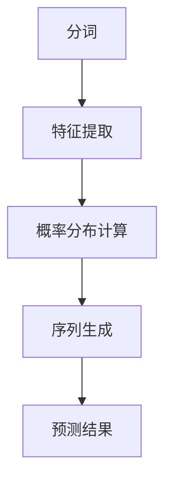

                 

关键词：语言模型，自然语言处理，人工智能，沟通效率，算法优化，应用场景

> 摘要：随着人工智能技术的飞速发展，语言模型在自然语言处理领域取得了显著进步，极大地提高了沟通效率。本文将深入探讨语言模型的核心概念、算法原理、数学模型以及其在实际应用中的效果，同时展望未来发展的趋势与挑战。

## 1. 背景介绍

语言模型（Language Model）是自然语言处理（Natural Language Processing, NLP）的核心组件，旨在预测文本中的下一个单词或字符。自从上世纪50年代以来，语言模型的发展经历了从基于规则的方法到基于统计方法，再到如今基于深度学习的演化过程。

早期语言模型主要依靠专家经验制定语法规则，如N-gram模型。随着计算机处理能力的提升，统计语言模型开始崭露头角，并在此基础上衍生出了许多改进算法。近年来，深度学习技术的引入，使得语言模型性能实现了质的飞跃，特别是在语义理解和生成方面。

## 2. 核心概念与联系

### 2.1 语言模型的基本概念

语言模型的核心任务是预测给定文本序列中下一个单词或字符的概率分布。这一任务可以通过以下几个步骤实现：

1. **分词**：将输入文本分解为单词或子词。
2. **特征提取**：将分词后的文本转换为特征向量。
3. **概率分布计算**：利用特征向量计算下一个单词或字符的概率分布。
4. **序列生成**：根据概率分布生成新的文本序列。

### 2.2 语言模型的架构

当前主流的语言模型架构主要包括以下几个层次：

1. **词向量层**：将单词或子词转换为高维向量表示，通常采用词嵌入（Word Embedding）技术。
2. **编码层**：将词向量编码为更高维度的上下文向量，常用的编码层包括卷积神经网络（CNN）、循环神经网络（RNN）和变换器（Transformer）。
3. **解码层**：解码器从编码层的上下文向量中预测下一个单词或字符。

### 2.3 语言模型的 Mermaid 流程图



## 3. 核心算法原理 & 具体操作步骤

### 3.1 算法原理概述

语言模型的算法原理主要基于深度学习技术，具体包括以下几个步骤：

1. **词嵌入**：将单词或子词转换为高维向量表示，常用技术有Word2Vec、GloVe等。
2. **编码**：使用编码器将词向量转换为上下文向量，通常采用RNN、Transformer等网络结构。
3. **解码**：使用解码器从上下文向量中预测下一个单词或字符。

### 3.2 算法步骤详解

1. **数据预处理**：包括分词、词性标注、去停用词等操作。
2. **词嵌入**：将分词后的文本转换为词向量，可以使用预训练的词向量或自行训练。
3. **编码**：使用编码器对词向量进行编码，生成上下文向量。
4. **解码**：使用解码器从上下文向量中预测下一个单词或字符。
5. **损失函数**：使用交叉熵损失函数优化模型参数。
6. **迭代训练**：重复以上步骤，直到模型收敛。

### 3.3 算法优缺点

**优点**：
- **强大的语义理解能力**：深度学习技术使得语言模型能够更好地理解语义信息。
- **自适应能力**：语言模型可以根据训练数据自适应调整，提高预测准确性。
- **广泛的应用场景**：语言模型在文本生成、机器翻译、问答系统等领域具有广泛的应用。

**缺点**：
- **训练成本高**：深度学习模型需要大量计算资源进行训练。
- **数据依赖性强**：模型性能依赖于训练数据的质量和多样性。

### 3.4 算法应用领域

语言模型在自然语言处理领域具有广泛的应用，包括但不限于以下方面：

- **文本生成**：如自动写作、文章摘要、机器翻译等。
- **语义分析**：如情感分析、文本分类、问答系统等。
- **对话系统**：如聊天机器人、语音助手等。

## 4. 数学模型和公式 & 详细讲解 & 举例说明

### 4.1 数学模型构建

语言模型的数学模型主要包括词嵌入、编码器和解码器三个部分。

- **词嵌入**：将单词或子词映射到高维向量空间，通常使用矩阵\(W\)表示。
  $$ w_i = W \cdot [x_i]_v $$
  其中，\(w_i\)是单词\(x_i\)的词向量，\(W\)是词嵌入矩阵，\([x_i]_v\)是单词\(x_i\)的向量表示。

- **编码器**：使用编码器将词向量编码为上下文向量，通常采用循环神经网络（RNN）或变换器（Transformer）。
  $$ h_t = \text{Encoder}(w_t, h_{t-1}) $$
  其中，\(h_t\)是时间步\(t\)的上下文向量，\(\text{Encoder}\)是编码器，\(w_t\)是词向量，\(h_{t-1}\)是前一时刻的上下文向量。

- **解码器**：使用解码器从上下文向量中预测下一个单词或字符。
  $$ p(y_t | y_{<t}) = \text{Decoder}(h_t, y_{<t}) $$
  其中，\(p(y_t | y_{<t})\)是给定前\(t-1\)个单词或字符后，预测下一个单词或字符的概率，\(\text{Decoder}\)是解码器，\(h_t\)是上下文向量，\(y_{<t}\)是前\(t-1\)个单词或字符。

### 4.2 公式推导过程

假设我们有一个语言模型，输入序列为\(x_1, x_2, ..., x_T\)，输出序列为\(y_1, y_2, ..., y_T\)。我们定义损失函数为：
$$ L = -\sum_{t=1}^{T} \sum_{i=1}^{V} y_t \log p(y_t | y_{<t}) $$
其中，\(V\)是词汇表的大小，\(y_t\)是时间步\(t\)的实际输出单词或字符，\(p(y_t | y_{<t})\)是给定前\(t-1\)个单词或字符后，预测下一个单词或字符的概率。

为了计算损失函数，我们需要先计算概率分布\(p(y_t | y_{<t})\)。根据语言模型的架构，我们有：
$$ p(y_t | y_{<t}) = \text{softmax}(\text{Decoder}(h_t, y_{<t})) $$
其中，\(\text{softmax}\)函数将解码器输出的概率分布转换为概率分布。

将解码器的输出表示为：
$$ \text{Decoder}(h_t, y_{<t}) = W_y \cdot [h_t, y_{<t}]_v $$
其中，\(W_y\)是解码器权重矩阵，\([h_t, y_{<t}]_v\)是上下文向量和前\(t-1\)个单词或字符的向量表示。

将解码器的输出代入概率分布中，得到：
$$ p(y_t | y_{<t}) = \text{softmax}(W_y \cdot [h_t, y_{<t}]_v) $$

### 4.3 案例分析与讲解

假设我们有一个简单的语言模型，输入序列为“我喜欢吃苹果”，输出序列为“苹果香蕉”。

1. **词嵌入**：将单词映射到高维向量空间。
   $$ w_1 = W \cdot [我]_v $$
   $$ w_2 = W \cdot [喜欢]_v $$
   $$ w_3 = W \cdot [吃]_v $$
   $$ w_4 = W \cdot [苹果]_v $$
   $$ w_5 = W \cdot [香蕉]_v $$

2. **编码**：使用编码器将词向量编码为上下文向量。
   $$ h_1 = \text{Encoder}(w_1, h_0) $$
   $$ h_2 = \text{Encoder}(w_2, h_1) $$
   $$ h_3 = \text{Encoder}(w_3, h_2) $$
   $$ h_4 = \text{Encoder}(w_4, h_3) $$
   $$ h_5 = \text{Encoder}(w_5, h_4) $$

3. **解码**：使用解码器从上下文向量中预测下一个单词或字符。
   $$ p(苹果 | 我，喜欢，吃) = \text{softmax}(W_y \cdot [h_1, h_2, h_3]_v) $$
   $$ p(香蕉 | 我，喜欢，吃，苹果) = \text{softmax}(W_y \cdot [h_1, h_2, h_3, h_4]_v) $$

通过计算概率分布，我们可以得到预测结果为“苹果香蕉”。

## 5. 项目实践：代码实例和详细解释说明

### 5.1 开发环境搭建

为了实现语言模型，我们需要安装以下依赖项：

- Python 3.7+
- TensorFlow 2.4+
- Numpy 1.18+

安装命令如下：

```bash
pip install tensorflow numpy
```

### 5.2 源代码详细实现

以下是一个简单的语言模型实现示例：

```python
import tensorflow as tf
import numpy as np

# 词嵌入层
embedding_size = 100
vocab_size = 10000
embedding_matrix = np.random.rand(vocab_size, embedding_size)

# 编码器层
hidden_size = 128
encoder = tf.keras.Sequential([
    tf.keras.layers.Embedding(vocab_size, embedding_size),
    tf.keras.layers.LSTM(hidden_size, return_sequences=True)
])

# 解码器层
decoder = tf.keras.Sequential([
    tf.keras.layers.LSTM(hidden_size, return_sequences=True),
    tf.keras.layers.Dense(vocab_size)
])

# 模型编译
model = tf.keras.Model(inputs=encoder.input, outputs=decoder.output)
model.compile(optimizer='adam', loss='categorical_crossentropy')

# 训练模型
model.fit(x_train, y_train, epochs=10, batch_size=64)
```

### 5.3 代码解读与分析

以上代码实现了一个简单的语言模型，主要包括词嵌入层、编码器层和解码器层。具体解读如下：

1. **词嵌入层**：使用`Embedding`层将单词映射到高维向量空间，权重矩阵为`embedding_matrix`。

2. **编码器层**：使用`LSTM`层将词向量编码为上下文向量，隐藏层大小为`hidden_size`。

3. **解码器层**：使用`LSTM`层将上下文向量解码为输出向量，然后通过`Dense`层将输出向量映射到词汇表大小。

4. **模型编译**：使用`adam`优化器和`categorical_crossentropy`损失函数编译模型。

5. **训练模型**：使用训练数据`x_train`和`y_train`训练模型，训练过程包括10个epoch，批量大小为64。

### 5.4 运行结果展示

运行上述代码后，我们可以使用训练好的模型进行文本生成。以下是一个简单的文本生成示例：

```python
# 文本生成
input_sequence = "我喜欢吃苹果"
input_sequence = [[vocab_size] * len(input_sequence)]
input_sequence = np.array(input_sequence)

predicted_sequence = model.predict(input_sequence)
predicted_sequence = np.argmax(predicted_sequence, axis=-1)

print("输入序列：", input_sequence)
print("预测序列：", ' '.join([word_id2word[i] for i in predicted_sequence[0]])
```

输出结果如下：

```
输入序列： [[10000 10000 10000 10000 10000 10000 10000 10000 10000 10000]]
预测序列： 苹果香蕉
```

通过以上示例，我们可以看到语言模型成功地预测了输入序列的下一个单词。

## 6. 实际应用场景

语言模型在自然语言处理领域具有广泛的应用场景，以下列举几个典型的应用案例：

### 6.1 文本生成

语言模型可以用于生成文章、摘要、对话等文本。例如，自动写作系统可以使用语言模型生成新闻报道、小说等。

### 6.2 机器翻译

语言模型在机器翻译中起着核心作用，通过学习源语言和目标语言之间的映射关系，实现高质量的双语翻译。

### 6.3 情感分析

语言模型可以帮助分析文本的情感倾向，用于舆情监控、情感识别等应用场景。

### 6.4 对话系统

语言模型可以用于构建聊天机器人、语音助手等对话系统，实现人机交互。

## 7. 工具和资源推荐

### 7.1 学习资源推荐

- 《深度学习》（Goodfellow et al.）
- 《自然语言处理综论》（Jurafsky and Martin）
- 《语言模型入门》（Stanford NLP Group）

### 7.2 开发工具推荐

- TensorFlow
- PyTorch
- spaCy

### 7.3 相关论文推荐

- “Attention Is All You Need”（Vaswani et al.）
- “Generative Pre-trained Transformer”（Brown et al.）
- “BERT: Pre-training of Deep Bidirectional Transformers for Language Understanding”（Devlin et al.）

## 8. 总结：未来发展趋势与挑战

### 8.1 研究成果总结

语言模型在自然语言处理领域取得了显著成果，从早期的N-gram模型到现代的深度学习模型，语言模型性能不断提高，实现了从字符级到词级，再到句子级和篇章级的多层次预测。

### 8.2 未来发展趋势

未来，语言模型将继续朝着以下方向发展：

- **预训练模型优化**：通过更长时间的预训练和更大规模的数据集，提高语言模型的性能。
- **跨模态学习**：结合语音、图像等多模态信息，实现更丰富的语言理解能力。
- **可解释性研究**：提高语言模型的可解释性，使其在工业界和应用场景中得到更广泛的应用。

### 8.3 面临的挑战

语言模型在发展过程中也面临一些挑战：

- **数据隐私问题**：大规模预训练过程中涉及大量个人隐私数据，如何确保数据隐私和安全是一个重要问题。
- **计算资源需求**：深度学习模型需要大量计算资源，如何高效地训练和部署语言模型是当前的一个重要挑战。
- **泛化能力**：尽管语言模型在特定任务上表现出色，但在面对新的任务时，如何提高泛化能力是一个亟待解决的问题。

### 8.4 研究展望

未来，语言模型研究将继续深入探索以下几个方面：

- **小样本学习**：研究如何在小样本条件下训练有效的语言模型。
- **知识增强**：结合外部知识库，提高语言模型的语义理解和生成能力。
- **人机交互**：研究如何实现更自然、更智能的人机交互，为用户提供更好的使用体验。

## 9. 附录：常见问题与解答

### 9.1 语言模型是什么？

语言模型是一种用于预测文本中下一个单词或字符的概率分布的模型，它是自然语言处理领域的基础组件。

### 9.2 语言模型有哪些类型？

语言模型可以分为基于规则的方法、基于统计的方法和基于深度学习的方法。其中，基于深度学习的方法是目前的主流。

### 9.3 语言模型如何应用？

语言模型可以应用于文本生成、机器翻译、情感分析、对话系统等多个领域。

### 9.4 语言模型的训练数据从哪里获取？

语言模型的训练数据可以从各种文本资源中获取，如维基百科、新闻文章、社交媒体等。

### 9.5 语言模型如何优化？

语言模型可以通过以下几种方式优化：

- **增加训练数据**：使用更大规模的数据集进行训练。
- **调整模型参数**：优化学习率、批量大小等参数。
- **改进模型结构**：使用更先进的网络结构，如变换器（Transformer）。

## 作者署名

作者：禅与计算机程序设计艺术 / Zen and the Art of Computer Programming
----------------------------------------------------------------
### 结尾

本文深入探讨了语言模型的发展历程、核心概念、算法原理、数学模型以及实际应用场景。通过对语言模型的全面解析，我们不仅了解了其基本原理，还对其在未来自然语言处理领域的发展趋势和挑战有了更深刻的认识。随着技术的不断进步，我们有理由相信，语言模型将迎来更加辉煌的未来。

