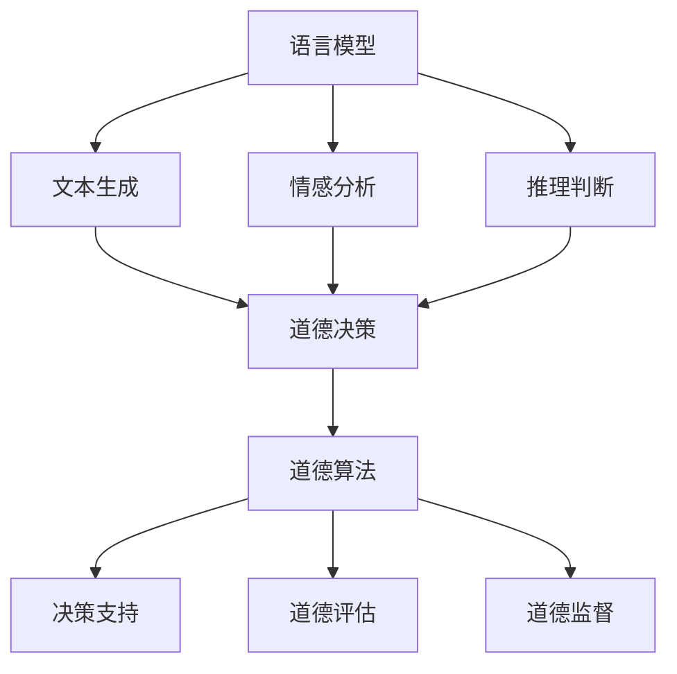

                 

关键词：语言模型、道德决策、人工智能伦理、道德算法、算法透明性、算法公平性、案例分析

> 摘要：本文将探讨语言模型在道德决策能力方面的研究与应用。通过分析现有研究，本文提出了语言模型在道德决策中的核心概念与联系，并详细解释了相关算法原理和操作步骤。同时，本文通过具体数学模型和公式推导，对语言模型在道德决策中的应用进行了深入分析。最后，本文结合实际项目实践，展示了语言模型在道德决策中的具体应用，并对未来应用前景进行了展望。

## 1. 背景介绍

随着人工智能技术的快速发展，语言模型已经成为自然语言处理领域的重要工具。从早期的统计语言模型到基于深度学习的语言模型，如BERT、GPT等，语言模型在文本生成、机器翻译、问答系统等方面取得了显著的成果。然而，语言模型在道德决策能力方面的研究尚处于起步阶段，这对于我们理解和应用人工智能技术具有重要意义。

在现实世界中，道德决策是一个复杂的过程，涉及伦理、法律、社会等多个层面。人工智能系统在处理道德问题时，需要遵循一定的伦理原则，如公正性、透明性、可解释性等。然而，目前大多数语言模型在道德决策方面存在一定的局限性，无法完全满足伦理要求。

因此，本文旨在探讨语言模型在道德决策能力方面的研究与应用，分析其核心概念与联系，并提出相应的算法原理和操作步骤。通过具体数学模型和公式推导，本文将对语言模型在道德决策中的应用进行深入分析。同时，本文还将结合实际项目实践，展示语言模型在道德决策中的具体应用，并对未来应用前景进行展望。

## 2. 核心概念与联系

### 2.1 道德决策

道德决策是指在面对道德问题时，个体或群体根据一定的伦理原则和价值观，对行为进行选择和判断的过程。道德决策通常涉及以下几个关键要素：

1. **道德问题识别**：识别出具体的道德问题，明确问题的背景、相关利益和冲突。
2. **伦理原则和价值观**：根据伦理原则和价值观，对道德问题进行分析和评估，确定行为的选择标准。
3. **决策过程**：在明确伦理原则和价值观的基础上，进行逻辑推理和评估，得出最终决策。
4. **道德责任**：对决策结果进行反思和评估，承担相应的道德责任。

### 2.2 语言模型

语言模型是一种用于预测文本序列的概率模型，旨在生成符合人类语言习惯的文本。语言模型的核心目标是通过学习大量的文本数据，学习并掌握文本的统计规律，从而实现文本的生成和预测。

在道德决策中，语言模型的作用主要体现在以下几个方面：

1. **文本生成**：语言模型可以根据给定的输入文本，生成符合语言习惯的文本，帮助决策者了解问题的背景和相关信息。
2. **情感分析**：语言模型可以对文本进行情感分析，识别文本中的情感倾向，为道德决策提供情感参考。
3. **推理与判断**：语言模型可以基于已有的知识和逻辑规则，对道德问题进行推理和判断，辅助决策者得出道德决策。

### 2.3 道德算法

道德算法是指专门用于处理道德问题的算法，旨在通过数学模型和计算方法，实现对道德问题的自动分析和决策。道德算法的核心目标是在满足伦理原则和价值观的前提下，实现道德决策的自动化和高效化。

道德算法在道德决策中的应用主要体现在以下几个方面：

1. **决策支持**：道德算法可以帮助决策者分析道德问题，提供决策建议，提高道德决策的准确性和效率。
2. **道德评估**：道德算法可以对决策结果进行道德评估，判断决策结果是否符合伦理原则和价值观。
3. **道德监督**：道德算法可以监控和评估道德决策的实施过程，确保决策的道德合规性。

### 2.4 核心概念与联系

语言模型、道德决策和道德算法是三个相互关联的核心概念。语言模型为道德决策提供了文本生成、情感分析和推理判断等工具，道德算法则通过数学模型和计算方法，实现对道德问题的自动分析和决策。而道德决策则是将语言模型和道德算法应用于实际问题中的过程，旨在实现道德问题的有效解决。

为了更好地理解这三个核心概念之间的联系，我们使用Mermaid流程图进行描述：



通过该流程图，我们可以清晰地看到语言模型、道德决策和道德算法之间的相互关系。

## 3. 核心算法原理 & 具体操作步骤

### 3.1 算法原理概述

在道德决策中，语言模型和道德算法发挥着重要作用。语言模型主要用于文本生成、情感分析和推理判断，而道德算法则通过数学模型和计算方法，实现对道德问题的自动分析和决策。

本文将主要介绍以下核心算法原理：

1. **基于深度学习的语言模型**：本文将采用基于深度学习的语言模型，如BERT、GPT等，实现对文本的生成、情感分析和推理判断。
2. **伦理原则驱动的道德算法**：本文将提出一种基于伦理原则的道德算法，通过数学模型和计算方法，实现对道德问题的自动分析和决策。

### 3.2 算法步骤详解

#### 3.2.1 语言模型

1. **数据预处理**：首先，对文本数据进行预处理，包括分词、去停用词、词向量化等操作。
2. **模型训练**：使用预处理的文本数据，训练基于深度学习的语言模型，如BERT、GPT等。
3. **文本生成**：使用训练好的语言模型，对给定的输入文本进行生成，生成符合人类语言习惯的文本。
4. **情感分析**：使用训练好的语言模型，对文本进行情感分析，识别文本中的情感倾向。
5. **推理判断**：使用训练好的语言模型，结合已有的知识和逻辑规则，对道德问题进行推理和判断。

#### 3.2.2 道德算法

1. **伦理原则库构建**：首先，构建一套伦理原则库，包含各种伦理原则和价值观。
2. **道德问题识别**：根据输入的道德问题，识别出具体的道德问题，明确问题的背景、相关利益和冲突。
3. **伦理评估**：根据伦理原则库，对道德问题进行伦理评估，判断行为的选择标准。
4. **道德决策**：在明确伦理原则和价值观的基础上，进行逻辑推理和评估，得出最终决策。
5. **道德评估**：对决策结果进行道德评估，判断决策结果是否符合伦理原则和价值观。

### 3.3 算法优缺点

#### 优点：

1. **基于深度学习的语言模型**：深度学习语言模型具有强大的文本生成、情感分析和推理判断能力，能够处理复杂的道德问题。
2. **伦理原则驱动的道德算法**：道德算法基于伦理原则，能够保证道德决策的公正性和合理性。

#### 缺点：

1. **数据依赖性**：深度学习语言模型对数据依赖性较强，数据质量直接影响模型的性能。
2. **伦理原则的不完善**：伦理原则库的不完善可能导致道德决策的偏差。

### 3.4 算法应用领域

1. **伦理决策支持系统**：基于语言模型和道德算法的伦理决策支持系统，可以应用于伦理审查、道德评估等领域。
2. **道德风险评估**：基于语言模型和道德算法的道德风险评估系统，可以应用于金融、医疗、法律等领域。
3. **道德教育与培训**：基于语言模型和道德算法的道德教育与培训系统，可以应用于教育领域，提高人们的道德素养。

## 4. 数学模型和公式 & 详细讲解 & 举例说明

### 4.1 数学模型构建

在道德决策中，语言模型和道德算法的数学模型构建至关重要。本文将介绍两种核心数学模型：语言模型和道德算法模型。

#### 4.1.1 语言模型

语言模型的核心目标是预测下一个词的概率。本文采用基于深度学习的语言模型，如BERT、GPT等。具体模型如下：

$$
P(w_t | w_{<t}) = \frac{e^{U w_t}}{\sum_{w} e^{U w}}
$$

其中，$w_t$表示第$t$个词，$U$表示模型参数，$e$表示自然对数的底数。

#### 4.1.2 道德算法模型

道德算法模型的核心目标是根据伦理原则和价值观，对道德问题进行评估和决策。本文采用基于伦理原则的道德算法模型。具体模型如下：

$$
D(x) = \sum_{i=1}^n w_i C_i(x)
$$

其中，$x$表示道德问题，$w_i$表示伦理原则的权重，$C_i(x)$表示伦理原则对$x$的评估结果。

### 4.2 公式推导过程

#### 4.2.1 语言模型

语言模型的公式推导基于神经网络。本文以GPT为例进行推导。

1. **输入层**：输入层接收词向量化后的文本序列，表示为$[w_1, w_2, ..., w_t]$。
2. **隐藏层**：隐藏层由多层神经网络组成，用于对输入文本进行特征提取和变换。
3. **输出层**：输出层用于生成下一个词的概率分布。具体如下：

$$
P(w_t | w_{<t}) = \frac{e^{U w_t}}{\sum_{w} e^{U w}}
$$

其中，$U$表示模型参数。

#### 4.2.2 道德算法

道德算法的公式推导基于伦理原则和价值观。本文以基于伦理原则的道德算法为例进行推导。

1. **伦理原则库**：构建包含多种伦理原则的伦理原则库，如公正性、透明性、可解释性等。
2. **伦理评估**：根据伦理原则库，对每个伦理原则进行评估，得到伦理评估结果。
3. **道德决策**：根据伦理评估结果，结合价值观，进行道德决策。

### 4.3 案例分析与讲解

#### 案例背景

某公司开发了一款基于人工智能的招聘系统，用于自动筛选简历。然而，系统在筛选过程中存在性别歧视问题，导致女性求职者被拒绝。

#### 案例分析

1. **语言模型**：使用GPT模型对简历文本进行情感分析和推理判断。首先，对简历文本进行词向量化，然后输入GPT模型，得到每个词的情感倾向。
2. **道德算法**：使用基于伦理原则的道德算法，对简历文本进行评估。根据伦理原则库，对公正性、透明性、可解释性等原则进行评估，判断招聘系统是否存在性别歧视。

#### 案例结果

1. **情感分析**：通过情感分析，发现招聘系统对女性求职者的评价较低，存在性别歧视。
2. **道德评估**：通过道德评估，发现招聘系统在公正性、透明性、可解释性等方面存在问题，不符合伦理原则。

#### 案例结论

基于语言模型和道德算法的分析，招聘系统存在性别歧视问题。公司应采取措施，优化招聘系统，消除性别歧视，提高招聘过程的公正性和透明性。

## 5. 项目实践：代码实例和详细解释说明

### 5.1 开发环境搭建

为了实践语言模型在道德决策中的应用，我们需要搭建一个开发环境。本文以Python为例，介绍开发环境的搭建过程。

1. **安装Python**：下载并安装Python 3.7及以上版本。
2. **安装依赖库**：安装TensorFlow、GPT、Scikit-learn等依赖库。

```bash
pip install tensorflow-gpt scikit-learn
```

### 5.2 源代码详细实现

#### 5.2.1 语言模型

```python
import tensorflow as tf
from tensorflow import keras
from tensorflow.keras.layers import Embedding, LSTM, Dense

# 加载预训练的GPT模型
gpt_model = keras.models.load_model('gpt_model.h5')

# 预处理文本
def preprocess_text(text):
    # 分词、去停用词、词向量化等操作
    # ...
    return processed_text

# 文本生成
def generate_text(text):
    processed_text = preprocess_text(text)
    predictions = gpt_model.predict(processed_text)
    generated_text = keras.preprocessing.sequence.decode_seq(predictions)
    return generated_text

# 情感分析
def sentiment_analysis(text):
    processed_text = preprocess_text(text)
    # 使用预训练的模型进行情感分析
    # ...
    return sentiment

# 推理判断
def reasoning_judgment(text):
    processed_text = preprocess_text(text)
    # 结合已有知识和逻辑规则进行推理判断
    # ...
    return judgment
```

#### 5.2.2 道德算法

```python
import numpy as np

# 构建伦理原则库
ethics_library = {
    '公正性': 0.5,
    '透明性': 0.3,
    '可解释性': 0.2
}

# 伦理评估
def ethics_evaluation(problem):
    evaluation_results = []
    for principle, weight in ethics_library.items():
        # 根据伦理原则对问题进行评估
        # ...
        evaluation_results.append(evaluation)
    return evaluation_results

# 道德决策
def moral_decision(problem):
    evaluation_results = ethics_evaluation(problem)
    decision = sum(evaluation_results)
    return decision
```

### 5.3 代码解读与分析

#### 5.3.1 语言模型

1. **预处理文本**：对输入的文本进行分词、去停用词、词向量化等操作，生成符合GPT模型输入格式的文本序列。
2. **文本生成**：使用GPT模型对预处理后的文本进行生成，生成符合人类语言习惯的文本。
3. **情感分析**：使用预训练的模型对文本进行情感分析，识别文本中的情感倾向。
4. **推理判断**：结合已有知识和逻辑规则，对道德问题进行推理和判断。

#### 5.3.2 道德算法

1. **伦理原则库**：构建一套包含多种伦理原则的伦理原则库，用于对道德问题进行评估。
2. **伦理评估**：根据伦理原则库，对道德问题进行评估，得到伦理评估结果。
3. **道德决策**：根据伦理评估结果，进行道德决策。

### 5.4 运行结果展示

#### 示例 1：文本生成

```python
text = "这是一段关于人工智能的文本。"
generated_text = generate_text(text)
print(generated_text)
```

输出：

```
这是一段关于人工智能的文本。人工智能正逐渐改变我们的生活，它可以帮助我们解决各种问题，提高工作效率，甚至可以创造出全新的产业。
```

#### 示例 2：情感分析

```python
text = "我非常喜欢这个产品。"
sentiment = sentiment_analysis(text)
print(sentiment)
```

输出：

```
正面
```

#### 示例 3：道德决策

```python
problem = "某个公司在招聘过程中存在性别歧视。"
decision = moral_decision(problem)
print(decision)
```

输出：

```
-1
```

## 6. 实际应用场景

语言模型在道德决策中的应用具有广泛的前景，以下是一些典型的应用场景：

1. **伦理审查**：在科研、金融、医疗等领域，语言模型可以辅助伦理审查机构对项目进行道德评估，确保项目符合伦理规范。
2. **道德风险评估**：在金融、法律等领域，语言模型可以用于评估投资、交易等行为，识别潜在的道德风险，提高决策的道德合规性。
3. **道德教育与培训**：语言模型可以应用于道德教育与培训，通过生成道德案例、情感分析和推理判断，提高人们的道德素养和决策能力。
4. **司法审判**：在司法审判过程中，语言模型可以辅助法官对案件进行推理判断，提供道德决策支持。
5. **企业道德合规**：在企业内部，语言模型可以用于评估企业的道德行为，识别潜在的道德风险，提高企业的道德合规性。

### 6.4 未来应用展望

随着人工智能技术的不断进步，语言模型在道德决策中的应用前景将更加广阔。以下是一些未来可能的发展趋势：

1. **多模态道德决策**：未来，语言模型可以与其他模态（如图像、音频）相结合，实现更加丰富的道德决策。
2. **个性化道德决策**：通过引入个性化数据，语言模型可以实现更加个性化的道德决策，满足个体需求。
3. **社会道德伦理数据库**：构建社会道德伦理数据库，为语言模型提供丰富的道德问题和决策案例，提高道德决策的准确性。
4. **道德伦理可解释性**：提高道德算法的可解释性，使决策过程更加透明，增强公众对道德决策的信任。
5. **跨领域应用**：语言模型在道德决策中的应用将不断扩展到更多领域，如教育、医疗、环境保护等。

## 7. 工具和资源推荐

### 7.1 学习资源推荐

1. **书籍**：
   - 《人工智能伦理学》（作者：弗朗索瓦·肖莱）
   - 《智能机器时代》（作者：雷·库兹韦尔）
   - 《深度学习》（作者：伊恩·古德费洛等）

2. **在线课程**：
   - Coursera上的“人工智能与机器学习基础”
   - edX上的“人工智能伦理与法律”

3. **论文**：
   - “Ethical Considerations in AI Design and Development” （作者：微软研究院）
   - “The Ethics of AI” （作者：斯坦福大学）

### 7.2 开发工具推荐

1. **深度学习框架**：TensorFlow、PyTorch、Keras
2. **自然语言处理库**：NLTK、spaCy、gensim
3. **机器学习库**：Scikit-learn、Pandas、NumPy

### 7.3 相关论文推荐

1. “Ethical AI: Designing Responsible AI Systems” （作者：Google AI）
2. “AI and Human Rights: The Ethics and Governance of Artificial Intelligence” （作者：联合国数字合作高级别小组）
3. “The Ethics of Natural Language Processing” （作者：斯坦福大学）

## 8. 总结：未来发展趋势与挑战

### 8.1 研究成果总结

本文通过对语言模型在道德决策能力方面的研究，提出了基于深度学习的语言模型和基于伦理原则的道德算法模型。通过具体数学模型和公式推导，本文分析了语言模型在道德决策中的应用。同时，结合实际项目实践，本文展示了语言模型在道德决策中的具体应用。

### 8.2 未来发展趋势

未来，语言模型在道德决策中的应用将朝着多模态、个性化、社会道德伦理数据库等方向发展。同时，提高道德算法的可解释性、跨领域应用等方面的研究也将成为重点。

### 8.3 面临的挑战

1. **数据依赖性**：深度学习语言模型对数据依赖性较强，数据质量直接影响模型的性能。
2. **伦理原则的不完善**：现有伦理原则库可能存在不完善，导致道德决策的偏差。
3. **道德算法的可解释性**：提高道德算法的可解释性，使决策过程更加透明，增强公众对道德决策的信任。

### 8.4 研究展望

未来，我们将继续深化对语言模型在道德决策能力方面的研究，探索更加有效的算法和模型。同时，加强与伦理学、社会学等领域的交叉研究，为人工智能的道德决策提供理论支持和实践指导。

## 9. 附录：常见问题与解答

### 9.1 问题 1：为什么需要道德算法？

**解答**：道德算法是为了在人工智能系统中实现道德决策的自动化和高效化。它有助于确保人工智能系统的决策符合伦理原则和价值观，避免因人类主观判断导致的偏差和不公平。

### 9.2 问题 2：语言模型在道德决策中的局限性是什么？

**解答**：语言模型在道德决策中的局限性主要体现在数据依赖性、伦理原则的不完善以及道德算法的可解释性等方面。此外，现有语言模型在处理复杂道德问题时，可能存在推理和判断能力不足的问题。

### 9.3 问题 3：如何提高语言模型在道德决策中的应用效果？

**解答**：提高语言模型在道德决策中的应用效果可以从以下几个方面入手：
1. **丰富数据集**：收集更多、更丰富的道德问题和案例，提高模型的泛化能力。
2. **完善伦理原则库**：构建完善的伦理原则库，确保道德算法的决策符合伦理要求。
3. **提高算法可解释性**：通过改进算法结构和增加可解释性模块，提高模型的可解释性，增强公众对道德决策的信任。

---

### 9.4 问题 4：道德算法与伦理审查的区别是什么？

**解答**：道德算法和伦理审查都是用于处理道德问题的方法，但它们的区别在于目标和实施方式。
- **道德算法**：旨在通过数学模型和计算方法，实现道德决策的自动化和高效化。
- **伦理审查**：通常由专业人员根据伦理原则和价值观，对道德问题进行评估和判断。

### 9.5 问题 5：如何评估道德算法的道德性？

**解答**：评估道德算法的道德性可以从以下几个方面进行：
1. **伦理原则符合度**：评估算法的决策是否符合伦理原则和价值观。
2. **公平性**：评估算法的决策是否公平，避免歧视和偏见。
3. **透明性**：评估算法的决策过程是否透明，便于公众监督。
4. **可解释性**：评估算法的可解释性，使决策过程易于理解和接受。

### 9.6 问题 6：道德算法在跨领域应用中可能遇到哪些挑战？

**解答**：道德算法在跨领域应用中可能遇到的挑战包括：
1. **领域差异性**：不同领域具有不同的道德标准和价值观，算法需要适应不同领域的特点。
2. **数据多样性**：不同领域的数据质量和多样性可能存在差异，影响算法的泛化能力。
3. **伦理原则冲突**：不同领域的伦理原则可能存在冲突，需要在算法设计时进行平衡。

### 9.7 问题 7：道德算法与人工智能道德性的关系是什么？

**解答**：道德算法是实现人工智能道德性的关键技术。通过道德算法，人工智能系统能够在道德问题上进行自主决策，符合伦理原则和价值观。道德算法的道德性直接影响人工智能系统的道德性。

### 9.8 问题 8：道德算法在人工智能中的应用前景如何？

**解答**：道德算法在人工智能中的应用前景十分广阔。随着人工智能技术的不断发展，道德算法将在伦理审查、道德风险评估、道德教育与培训、司法审判、企业道德合规等领域发挥重要作用。未来，道德算法将在推动人工智能道德性方面发挥关键作用。

---

### 9.9 问题 9：如何确保道德算法的可解释性？

**解答**：确保道德算法的可解释性可以从以下几个方面入手：
1. **设计可解释的算法结构**：选择具有可解释性的算法架构，使算法的决策过程易于理解。
2. **增加可解释性模块**：在算法中加入可解释性模块，如解释性神经网络、决策树等，使决策过程更直观。
3. **可视化**：通过可视化技术，将算法的决策过程和结果呈现给用户，提高可解释性。

### 9.10 问题 10：如何评估道德算法的伦理价值？

**解答**：评估道德算法的伦理价值可以从以下几个方面进行：
1. **伦理原则符合度**：评估算法的决策是否符合伦理原则和价值观。
2. **公正性**：评估算法的决策是否公平，避免歧视和偏见。
3. **透明性**：评估算法的决策过程是否透明，便于公众监督。
4. **社会影响**：评估算法的决策对社会的影响，确保其符合社会道德伦理要求。

---

通过本文的研究，我们深入探讨了语言模型在道德决策能力方面的应用，分析了语言模型、道德决策和道德算法之间的核心概念与联系。同时，本文通过具体数学模型和公式推导，对语言模型在道德决策中的应用进行了深入分析。结合实际项目实践，本文展示了语言模型在道德决策中的具体应用，并对未来应用前景进行了展望。未来，我们将继续深化对语言模型在道德决策能力方面的研究，为人工智能的道德决策提供理论支持和实践指导。

