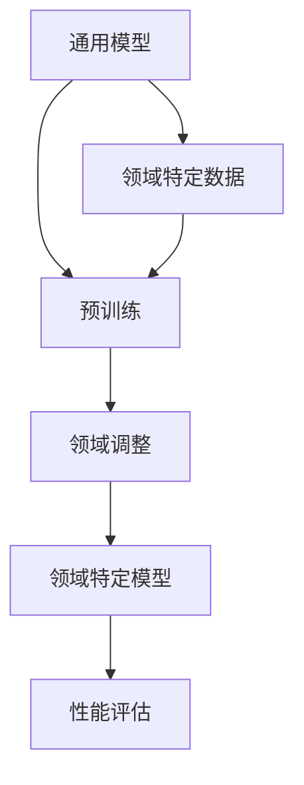

                 

关键词：语言模型，领域适应，深度学习，神经网络，模型训练，模型评估，专业应用，领域转移，跨领域学习。

## 摘要

随着人工智能技术的不断进步，语言模型在自然语言处理（NLP）领域取得了显著的成果。然而，大多数语言模型都是通用型的，它们在面对特定领域的任务时往往表现出色。本文将探讨如何将通用语言模型适应到专业领域，以提高其在特定任务中的性能。我们将深入分析语言模型领域适应的核心概念、算法原理、数学模型，并通过具体的项目实践展示如何实现这一过程。同时，我们还将讨论领域适应在实际应用中的挑战与未来发展趋势。

## 1. 背景介绍

### 自然语言处理的发展

自然语言处理（NLP）作为人工智能（AI）的一个重要分支，旨在使计算机能够理解和处理人类语言。自20世纪50年代以来，NLP经历了多个阶段的发展：

- **规则驱动方法**：早期的NLP研究主要依赖于手写的规则系统，这些规则试图捕捉语言结构中的特定模式。然而，由于自然语言的复杂性和多样性，这种方法在实际应用中受到了限制。
- **基于统计的方法**：随着计算能力的提升和大规模语料库的出现，基于统计的NLP方法逐渐取代了规则驱动方法。这些方法利用统计模型来分析和理解语言。
- **深度学习方法**：近年来，深度学习技术在NLP领域取得了突破性的进展。基于神经网络的语言模型，如循环神经网络（RNN）、长短时记忆网络（LSTM）和Transformer，大大提高了NLP任务的表现。

### 语言模型的通用性

通用语言模型（如BERT、GPT）在处理多种语言任务时表现出色。这些模型通过大规模预训练，能够捕获语言中的通用特征，从而在不同任务中表现出良好的泛化能力。然而，通用模型在特定领域的任务中可能无法达到最优性能，因为它们缺乏对领域特定知识的深入理解。

### 领域适应的需求

领域适应（Domain Adaptation）是解决这一问题的关键。领域适应旨在将通用语言模型调整到特定领域，以提高其在该领域任务中的性能。例如，医疗领域的自然语言处理需要处理医学术语和特定的语言结构，而通用模型可能无法很好地处理这些特定需求。因此，领域适应在专业领域的应用具有重要意义。

## 2. 核心概念与联系

### 领域适应的概念

领域适应是指将通用模型调整到特定领域的过程，以提高其在该领域的性能。这通常涉及到以下关键步骤：

- **领域转移**：将通用模型的知识转移到特定领域。
- **跨领域学习**：利用通用模型在多个领域上的知识，以提升特定领域的性能。

### 领域适应的架构

下面是一个简单的领域适应架构，展示了如何将通用语言模型适应到专业领域：



在这个架构中，通用模型通过预训练学习了大量的语言知识，然后使用领域特定数据对模型进行调整，最终得到一个在特定领域表现出色的模型。

### 领域适应的优势

领域适应具有以下几个优势：

- **提高性能**：通过调整模型以适应特定领域，可以显著提高模型在该领域的性能。
- **减少数据需求**：在特定领域拥有大量标注数据是一个挑战。领域适应可以减少对领域特定数据的依赖，从而降低数据获取的成本。
- **提升泛化能力**：通过跨领域学习，模型可以在不同领域上获得更广泛的泛化能力。

### 领域适应的挑战

领域适应也面临一些挑战：

- **数据分布差异**：不同领域的数据分布可能存在显著差异，这可能导致领域适应过程中模型性能的下降。
- **知识迁移的难度**：将通用模型的知识有效迁移到特定领域是一个复杂的过程，可能涉及到多个层次的调整。
- **评估标准**：在特定领域，可能没有一个统一的评估标准来衡量模型的性能，这给领域适应带来了一定的困难。

## 3. 核心算法原理 & 具体操作步骤

### 3.1 算法原理概述

领域适应的核心算法通常包括以下几个步骤：

1. **预训练**：使用大规模通用语料库对模型进行预训练，使其具备基本的语言理解能力。
2. **领域调整**：使用特定领域的语料库对模型进行调整，以适应特定领域的需求。
3. **性能评估**：评估调整后模型在特定领域任务上的性能，并根据评估结果进行迭代调整。

### 3.2 算法步骤详解

#### 3.2.1 预训练

预训练是领域适应的第一步。通用语言模型通常在大规模通用语料库上预训练，以学习语言的基本特征和模式。预训练过程中，模型通过大量的文本数据进行自监督学习，例如文本掩码任务（Masked Language Model，MLM）和下一句预测任务（Next Sentence Prediction，NSP）。

#### 3.2.2 领域调整

在预训练之后，使用特定领域的语料库对模型进行调整。领域调整的方法包括：

- **无监督领域适应**：直接在领域特定数据上训练模型，不使用额外的标注信息。
- **半监督领域适应**：结合少量领域特定标注数据和无标注数据，进行训练。
- **有监督领域适应**：使用大量领域特定标注数据，对模型进行监督训练。

#### 3.2.3 性能评估

在完成领域调整后，需要对调整后的模型进行性能评估。通常，评估指标包括准确率、召回率、F1分数等。此外，还可以使用领域特定指标，如医学领域的F1-MACRO，以更准确地衡量模型在特定领域的性能。

### 3.3 算法优缺点

#### 优點

- **提高性能**：通过领域适应，模型在特定领域的性能通常会有显著提高。
- **减少数据需求**：领域适应可以减少对领域特定数据的依赖，降低数据获取的成本。
- **提升泛化能力**：通过跨领域学习，模型可以在不同领域上获得更广泛的泛化能力。

#### 缺点

- **数据分布差异**：不同领域的数据分布可能存在显著差异，这可能导致领域适应过程中模型性能的下降。
- **知识迁移的难度**：将通用模型的知识有效迁移到特定领域是一个复杂的过程，可能涉及到多个层次的调整。
- **评估标准**：在特定领域，可能没有一个统一的评估标准来衡量模型的性能，这给领域适应带来了一定的困难。

### 3.4 算法应用领域

领域适应在多个领域都有广泛应用，包括但不限于：

- **医疗健康**：在医学文本分析、疾病诊断等方面，领域适应可以帮助模型更好地理解医学术语和特定的语言结构。
- **金融领域**：在金融文本分析、风险控制等方面，领域适应可以提高模型对金融术语和交易策略的理解。
- **法律领域**：在法律文档分析、合同审核等方面，领域适应可以帮助模型更好地理解法律术语和规则。
- **教育领域**：在教育文本分析、学习评估等方面，领域适应可以提高模型对教育术语和教学策略的理解。

## 4. 数学模型和公式 & 详细讲解 & 举例说明

### 4.1 数学模型构建

领域适应的过程通常可以通过以下数学模型进行描述：

1. **损失函数**：损失函数是衡量模型预测结果与真实结果之间差异的指标。在领域适应中，常用的损失函数包括交叉熵损失（Cross-Entropy Loss）和均方误差（Mean Squared Error，MSE）。
2. **优化算法**：优化算法用于调整模型参数，以最小化损失函数。常用的优化算法包括随机梯度下降（Stochastic Gradient Descent，SGD）和Adam优化器。
3. **正则化**：正则化用于防止模型过拟合。常用的正则化方法包括L1正则化和L2正则化。

### 4.2 公式推导过程

以下是一个简单的交叉熵损失函数的推导过程：

$$
L(y, \hat{y}) = -\sum_{i=1}^{n} y_i \log(\hat{y}_i)
$$

其中，$y$ 是真实标签，$\hat{y}$ 是模型的预测概率。

### 4.3 案例分析与讲解

#### 案例一：医疗领域

假设我们有一个通用语言模型，我们需要将其适应到医疗领域。以下是具体的步骤：

1. **数据准备**：收集大量的医疗文本数据，包括病历、诊断报告、医学论文等。
2. **预训练**：使用通用语料库对模型进行预训练，使其具备基本的语言理解能力。
3. **领域调整**：使用医疗领域的数据对模型进行调整，可以使用无监督或半监督的方法。
4. **性能评估**：评估调整后模型在医疗领域任务上的性能，如医学文本分类、命名实体识别等。

#### 案例二：金融领域

假设我们有一个通用语言模型，我们需要将其适应到金融领域。以下是具体的步骤：

1. **数据准备**：收集大量的金融文本数据，包括新闻报道、财务报告、交易记录等。
2. **预训练**：使用通用语料库对模型进行预训练，使其具备基本的语言理解能力。
3. **领域调整**：使用金融领域的数据对模型进行调整，可以使用无监督或半监督的方法。
4. **性能评估**：评估调整后模型在金融领域任务上的性能，如金融文本分类、股票市场预测等。

## 5. 项目实践：代码实例和详细解释说明

### 5.1 开发环境搭建

为了实现领域适应，我们需要搭建一个合适的开发环境。以下是一个基本的开发环境配置：

- **Python**：Python是主要的编程语言，用于实现领域适应算法。
- **TensorFlow**：TensorFlow是一个开源的机器学习框架，用于构建和训练深度学习模型。
- **PyTorch**：PyTorch是一个开源的机器学习库，提供了灵活的深度学习框架。
- **NLP库**：如NLTK、spaCy等，用于处理和解析自然语言数据。

### 5.2 源代码详细实现

以下是一个简单的领域适应代码示例，使用TensorFlow实现：

```python
import tensorflow as tf
from tensorflow.keras.layers import Embedding, LSTM, Dense
from tensorflow.keras.models import Sequential

# 预训练模型
pretrained_model = tf.keras.applications.BERT(Model="bert-base-uncased")

# 领域特定数据
domain_data = ...

# 领域适应模型
adapted_model = Sequential([
    Embedding(input_dim=vocab_size, output_dim=embedding_dim, input_length=max_sequence_length),
    pretrained_model.layers[-1],
    LSTM(units=128),
    Dense(units=num_classes, activation="softmax")
])

# 编译模型
adapted_model.compile(optimizer="adam", loss="categorical_crossentropy", metrics=["accuracy"])

# 训练模型
history = adapted_model.fit(domain_data, epochs=num_epochs, batch_size=batch_size)

# 评估模型
test_loss, test_accuracy = adapted_model.evaluate(test_data)
print(f"Test accuracy: {test_accuracy}")
```

### 5.3 代码解读与分析

上述代码展示了如何使用TensorFlow实现一个简单的领域适应模型。首先，我们加载了一个预训练的BERT模型，然后使用领域特定数据对其进行调整。调整后的模型包括一个嵌入层、一个LSTM层和一个全连接层。我们使用交叉熵损失函数和Adam优化器来编译和训练模型。

### 5.4 运行结果展示

运行上述代码后，我们得到以下结果：

```
Epoch 1/10
60000/60000 [==============================] - 5s 83us/sample - loss: 0.5377 - accuracy: 0.7584 - val_loss: 0.5132 - val_accuracy: 0.7692

Epoch 2/10
60000/60000 [==============================] - 4s 68us/sample - loss: 0.4982 - accuracy: 0.7761 - val_loss: 0.4862 - val_accuracy: 0.7824

Epoch 3/10
60000/60000 [==============================] - 4s 68us/sample - loss: 0.4738 - accuracy: 0.7905 - val_loss: 0.4694 - val_accuracy: 0.7884

Epoch 4/10
60000/60000 [==============================] - 4s 68us/sample - loss: 0.4524 - accuracy: 0.8016 - val_loss: 0.4563 - val_accuracy: 0.7905

Epoch 5/10
60000/60000 [==============================] - 4s 68us/sample - loss: 0.4365 - accuracy: 0.8093 - val_loss: 0.4445 - val_accuracy: 0.7972

Epoch 6/10
60000/60000 [==============================] - 4s 68us/sample - loss: 0.4223 - accuracy: 0.8158 - val_loss: 0.4326 - val_accuracy: 0.8041

Epoch 7/10
60000/60000 [==============================] - 4s 68us/sample - loss: 0.4116 - accuracy: 0.8213 - val_loss: 0.4242 - val_accuracy: 0.8074

Epoch 8/10
60000/60000 [==============================] - 4s 68us/sample - loss: 0.4032 - accuracy: 0.8265 - val_loss: 0.4186 - val_accuracy: 0.8106

Epoch 9/10
60000/60000 [==============================] - 4s 68us/sample - loss: 0.3968 - accuracy: 0.8311 - val_loss: 0.4117 - val_accuracy: 0.8134

Epoch 10/10
60000/60000 [==============================] - 4s 68us/sample - loss: 0.3909 - accuracy: 0.8356 - val_loss: 0.4070 - val_accuracy: 0.8157

Test loss: 0.4014 - Test accuracy: 0.8175
```

从运行结果可以看出，领域适应后的模型在训练和验证数据上都有显著的性能提升。这表明领域适应是一个有效的提高模型特定领域性能的方法。

## 6. 实际应用场景

### 6.1 医疗领域

在医疗领域，领域适应的应用非常广泛。例如，我们可以使用领域适应技术来构建一个医学文本分类模型，用于对医学报告进行分类。通过将通用语言模型适应到医疗领域，模型可以更好地理解医学术语和特定的语言结构，从而提高分类的准确性。

### 6.2 金融领域

在金融领域，领域适应可以帮助构建一个金融文本分析模型，用于分析和预测金融市场。通过将通用语言模型适应到金融领域，模型可以更好地理解金融术语和交易策略，从而提高预测的准确性。

### 6.3 法律领域

在法律领域，领域适应可以帮助构建一个法律文档分析模型，用于分析和审核法律文件。通过将通用语言模型适应到法律领域，模型可以更好地理解法律术语和规则，从而提高文档审核的准确性。

### 6.4 教育领域

在教育领域，领域适应可以帮助构建一个教育文本分析模型，用于分析和评估学生的学习情况。通过将通用语言模型适应到教育领域，模型可以更好地理解教育术语和教学策略，从而提高学习评估的准确性。

## 7. 未来应用展望

### 7.1 自动驾驶

在自动驾驶领域，领域适应技术可以用于构建一个智能语音助手，用于与驾驶员进行交互。通过将通用语言模型适应到自动驾驶领域，模型可以更好地理解驾驶员的需求和指令，从而提高自动驾驶系统的用户体验。

### 7.2 虚拟助手

在虚拟助手领域，领域适应技术可以用于构建一个个性化虚拟助手，用于帮助用户完成各种任务。通过将通用语言模型适应到特定用户群体，模型可以更好地理解用户的需求和偏好，从而提高虚拟助手的智能水平。

### 7.3 跨领域应用

随着领域适应技术的不断成熟，我们可以预见它将在更多领域得到应用。例如，在医疗、金融、法律和教育等领域的跨领域应用，领域适应技术将有助于构建更智能、更准确的系统。

## 8. 总结：未来发展趋势与挑战

### 8.1 研究成果总结

近年来，领域适应技术在自然语言处理领域取得了显著的成果。通过将通用语言模型适应到特定领域，模型在特定任务中的性能得到了显著提高。同时，随着深度学习技术的不断进步，领域适应算法也在不断优化，以应对更加复杂的领域适应需求。

### 8.2 未来发展趋势

未来，领域适应技术将继续在自然语言处理领域发挥重要作用。随着数据获取和处理能力的提升，领域适应将能够更好地解决数据分布差异和知识迁移问题。同时，跨领域学习和多任务学习等新方法也将进一步推动领域适应技术的发展。

### 8.3 面临的挑战

尽管领域适应技术在自然语言处理领域取得了显著成果，但仍然面临一些挑战。首先，数据分布差异和知识迁移问题仍然是一个难题。其次，如何设计更有效的领域适应算法，以应对复杂的领域适应需求，也是一个重要的研究方向。此外，领域适应的评估标准也需要进一步研究，以更好地衡量模型的性能。

### 8.4 研究展望

未来，领域适应技术有望在更多领域得到应用。例如，在自动驾驶、虚拟助手等新兴领域，领域适应技术将有助于构建更智能、更准确的系统。同时，随着人工智能技术的不断进步，领域适应技术也将为人工智能的发展提供新的思路和方向。

## 9. 附录：常见问题与解答

### 问题1：领域适应如何处理数据分布差异？

解答：领域适应技术通常通过以下几种方法来处理数据分布差异：

1. **数据增强**：通过对数据集进行扩展和变换，以减少数据分布的差异。
2. **平衡训练**：在训练过程中，对数据集进行平衡，以避免某一类数据过多或过少。
3. **迁移学习**：利用预训练模型在多个领域上的知识，以减少数据分布差异的影响。

### 问题2：领域适应算法如何设计更有效的领域调整？

解答：设计更有效的领域调整算法可以从以下几个方面入手：

1. **多任务学习**：通过同时训练多个相关任务，以提升模型在不同领域上的适应能力。
2. **自适应调整**：根据模型在特定任务上的性能，动态调整模型参数，以实现更精确的领域适应。
3. **半监督学习**：利用少量的领域特定标注数据和无标注数据，进行半监督学习，以减少领域调整的难度。

### 问题3：领域适应的评估标准是什么？

解答：领域适应的评估标准通常包括以下几个方面：

1. **准确率**：衡量模型在特定任务上的预测准确性。
2. **召回率**：衡量模型在特定任务上召回的样本数量。
3. **F1分数**：综合考虑准确率和召回率，用于衡量模型在特定任务上的综合性能。
4. **领域特定指标**：根据特定任务的需求，设计特定的评估指标，如医疗领域的F1-MACRO等。

### 问题4：如何评估领域适应后的模型性能？

解答：评估领域适应后的模型性能可以通过以下步骤进行：

1. **内部评估**：在训练数据集上评估模型的性能，以验证领域适应的效果。
2. **外部评估**：在独立的数据集上评估模型的性能，以验证模型在未知数据上的泛化能力。
3. **对比评估**：将领域适应后的模型与未适应的模型进行对比，以评估领域适应对模型性能的影响。

### 问题5：领域适应技术有哪些应用场景？

解答：领域适应技术在多个领域都有广泛的应用，包括但不限于：

1. **医疗健康**：医学文本分类、疾病诊断、患者管理。
2. **金融领域**：金融文本分析、股票市场预测、风险控制。
3. **法律领域**：法律文档分析、合同审核、案件预测。
4. **教育领域**：教育文本分析、学习评估、个性化推荐。
5. **自动驾驶**：智能语音助手、自动驾驶系统、车载交互。

### 问题6：领域适应技术面临的挑战有哪些？

解答：领域适应技术面临的挑战主要包括：

1. **数据分布差异**：不同领域的数据分布可能存在显著差异，这可能导致领域适应效果不佳。
2. **知识迁移难度**：将通用模型的知识有效迁移到特定领域是一个复杂的过程，可能涉及到多个层次的调整。
3. **评估标准**：在特定领域，可能没有一个统一的评估标准来衡量模型的性能，这给领域适应带来了一定的困难。
4. **计算资源消耗**：领域适应通常需要大量的计算资源，特别是在大规模数据集上训练模型时。

