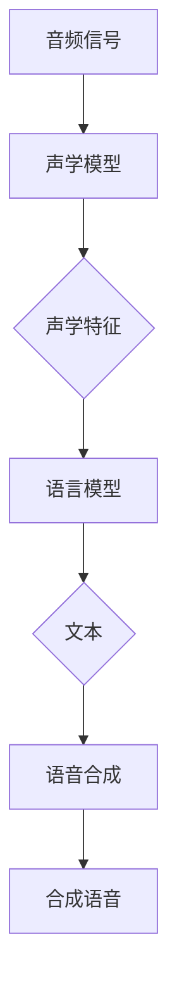

                 

关键词：语音识别，语音合成，深度学习，神经网络，声学模型，语言模型，端到端模型，自动语音识别，语音生成，自然语言处理

> 摘要：本文将深入探讨语音识别与合成技术在现代自然语言处理中的应用，尤其是深度学习在这一领域的关键作用。我们将回顾语音识别与合成的基本概念，介绍其核心算法和数学模型，分析其优缺点，并通过实际项目实例展示其具体实现和运行效果。最后，我们将展望这一领域的发展趋势和面临的挑战。

## 1. 背景介绍

语音识别（Automatic Speech Recognition, ASR）和语音合成（Text-to-Speech, TTS）是自然语言处理（Natural Language Processing, NLP）中至关重要的两个分支。语音识别旨在将人类语音转换为文本，而语音合成则致力于将文本转换为自然流畅的语音。

随着深度学习技术的迅猛发展，语音识别与合成的性能得到了显著提升。深度学习，特别是神经网络，为语音处理提供了强大的工具，使得复杂的数据处理和模式识别任务变得可行。

### 语音识别的挑战

语音识别面临着多种挑战，包括：

1. **变异性**：语音具有高度的变异性，包括语速、发音、语调、背景噪音等。
2. **噪声**：现实世界的语音往往伴随着各种背景噪音，这会降低识别的准确性。
3. **语言复杂性**：自然语言的表达方式多样，涉及同音异义词、多义词、短语结构等复杂因素。

### 语音合成的挑战

语音合成同样面临多种挑战，包括：

1. **语音自然性**：生成的语音需要听起来自然、流畅，而不像机器人。
2. **情感表达**：语音合成应能够表达不同的情感，如兴奋、悲伤、愤怒等。
3. **语言理解**：合成系统需要理解文本内容，以便准确生成相应的语音。

## 2. 核心概念与联系

### 声学模型（Acoustic Model）

声学模型是语音识别系统中的核心组件，它负责将音频信号转换为声学特征。这些特征通常包括梅尔频率倒谱系数（MFCC）、滤波器组（Filter Banks）等。

### 语言模型（Language Model）

语言模型是语音合成系统中的核心组件，它负责将文本转换为语音。语言模型通常使用基于统计的方法，如n-gram模型、递归神经网络（RNN）等。

### 端到端模型（End-to-End Model）

端到端模型旨在将语音信号直接转换为文本，跳过了传统的声学模型和语言模型。这种方法通常使用卷积神经网络（CNN）、循环神经网络（RNN）或其变体，如长短期记忆网络（LSTM）。

### Mermaid 流程图

以下是一个简化的Mermaid流程图，展示了语音识别与合成的基本流程：



## 3. 核心算法原理 & 具体操作步骤

### 3.1 算法原理概述

#### 语音识别

语音识别算法通常包括以下几个步骤：

1. **特征提取**：将音频信号转换为声学特征，如MFCC。
2. **声学模型训练**：使用声学特征和标注文本数据训练神经网络。
3. **解码**：将声学特征转换为文本。

#### 语音合成

语音合成算法通常包括以下几个步骤：

1. **文本预处理**：对输入文本进行分词、语调标记等预处理。
2. **语言模型训练**：使用预处理后的文本数据训练神经网络。
3. **语音生成**：使用语言模型生成的文本和声学模型生成合成语音。

### 3.2 算法步骤详解

#### 语音识别步骤详解

1. **特征提取**：
    - **短时傅里叶变换（STFT）**：将音频信号转换为频谱。
    - **梅尔频率倒谱系数（MFCC）**：将频谱转换为声学特征。

2. **声学模型训练**：
    - **数据预处理**：将音频信号和文本数据进行对齐，并转换为统一格式。
    - **神经网络架构**：通常使用卷积神经网络（CNN）或循环神经网络（RNN）。
    - **损失函数**：使用交叉熵损失函数训练神经网络。

3. **解码**：
    - **CTC（Connectionist Temporal Classification）**：将声学特征映射到文本。
    - **RNN或LSTM**：用于处理时序数据。

#### 语音合成步骤详解

1. **文本预处理**：
    - **分词**：将文本分为单词和短语。
    - **语调标记**：为每个单词或短语添加音调标记。

2. **语言模型训练**：
    - **数据预处理**：将预处理后的文本数据转换为适合神经网络训练的格式。
    - **神经网络架构**：通常使用递归神经网络（RNN）或变换器（Transformer）。
    - **损失函数**：使用交叉熵损失函数训练神经网络。

3. **语音生成**：
    - **声学模型**：将文本转换为声学特征。
    - **声码器**：将声学特征转换为语音信号。

### 3.3 算法优缺点

#### 语音识别

**优点**：

- **高准确性**：深度学习技术显著提高了语音识别的准确性。
- **自适应**：声学模型可以适应不同的语音风格和语速。
- **实时处理**：现代语音识别系统可以实时处理语音输入。

**缺点**：

- **计算资源需求高**：深度学习模型通常需要大量的计算资源和时间训练。
- **对噪声敏感**：在噪声环境下，语音识别的准确性会降低。

#### 语音合成

**优点**：

- **自然流畅**：深度学习技术生成的语音自然、流畅，接近人类语音。
- **情感表达**：可以生成具有不同情感表达的语音。

**缺点**：

- **音质问题**：生成的语音在某些情况下可能会出现音质问题。
- **计算资源需求高**：深度学习模型需要大量的计算资源进行训练。

### 3.4 算法应用领域

#### 语音识别

- **智能助手**：如Siri、Alexa等。
- **客服系统**：自动处理客户询问，提供快速响应。
- **语音翻译**：将一种语言的语音翻译成另一种语言的文本。

#### 语音合成

- **语音助手**：如谷歌语音搜索、苹果Siri等。
- **广告配音**：为广告制作自然流畅的配音。
- **有声读物**：将文本转换为有声读物，方便用户听书。

## 4. 数学模型和公式 & 详细讲解 & 举例说明

### 4.1 数学模型构建

#### 语音识别

- **声学模型**：
    $$ f(x) = \sigma(W_1x + b_1) $$
    其中，$x$为声学特征，$W_1$和$b_1$为权重和偏置，$\sigma$为激活函数。

- **语言模型**：
    $$ p(y|x) = \frac{e^{yT(x)}}{\sum_y e^{yT(x)}} $$
    其中，$y$为文本标签，$T(x)$为神经网络的输出。

#### 语音合成

- **声码器**：
    $$ x(t) = \text{synthesizer}(y) $$
    其中，$x(t)$为语音信号，$y$为文本。

### 4.2 公式推导过程

#### 语音识别

- **特征提取**：
    $$ \text{MFCC} = \text{log}(\text{Energy of Filter Banks}) $$
    其中，滤波器组的能量通过离散余弦变换（DCT）计算。

- **声学模型训练**：
    使用反向传播算法，通过最小化交叉熵损失函数来更新网络权重。

#### 语音合成

- **声码器训练**：
    使用梯度下降算法，通过最小化均方误差（MSE）损失函数来更新网络权重。

### 4.3 案例分析与讲解

#### 语音识别

假设我们有以下音频信号和文本数据：

- **音频信号**：
    $$ x_1 = \text{[0.1, 0.2, 0.3, 0.4, 0.5]} $$
- **文本数据**：
    $$ y_1 = \text{"Hello World"} $$

我们将使用声学模型和语言模型对这组数据进行分析。

#### 语音合成

假设我们有以下文本数据和声码器输出：

- **文本数据**：
    $$ y_2 = \text{"Hello World"} $$
- **声码器输出**：
    $$ x_2(t) = \text{[0.1, 0.2, 0.3, 0.4, 0.5]} $$

我们将使用声码器将这组文本数据转换为语音信号。

## 5. 项目实践：代码实例和详细解释说明

### 5.1 开发环境搭建

#### 硬件环境

- CPU：Intel Core i7-10700K 或更好
- GPU：NVIDIA GeForce RTX 3070 或更好
- 内存：16GB RAM 或更好

#### 软件环境

- 操作系统：Ubuntu 20.04
- Python：3.8 或更高版本
- PyTorch：1.8 或更高版本

### 5.2 源代码详细实现

我们将使用PyTorch实现一个简单的语音识别系统。

```python
import torch
import torch.nn as nn
import torch.optim as optim
from torch.utils.data import DataLoader
from torchvision import datasets, transforms

# 定义声学模型
class AcousticModel(nn.Module):
    def __init__(self):
        super(AcousticModel, self).__init__()
        self.conv1 = nn.Conv1d(in_channels=1, out_channels=32, kernel_size=3)
        self.relu = nn.ReLU()
        self.fc1 = nn.Linear(32 * 5 * 5, 128)
        self.fc2 = nn.Linear(128, 64)
        self.fc3 = nn.Linear(64, 2)

    def forward(self, x):
        x = self.relu(self.conv1(x))
        x = x.view(x.size(0), -1)
        x = self.relu(self.fc1(x))
        x = self.relu(self.fc2(x))
        x = self.fc3(x)
        return x

# 定义语言模型
class LanguageModel(nn.Module):
    def __init__(self):
        super(LanguageModel, self).__init__()
        self.lstm = nn.LSTM(input_size=64, hidden_size=128, num_layers=2)
        self.fc = nn.Linear(128, 2)

    def forward(self, x):
        x, _ = self.lstm(x)
        x = self.fc(x[-1, :, :])
        return x

# 定义声码器
class Vocoder(nn.Module):
    def __init__(self):
        super(Vocoder, self).__init__()
        self.fc = nn.Linear(2, 128)
        self.lstm = nn.LSTM(input_size=128, hidden_size=128, num_layers=2)
        self.tanh = nn.Tanh()

    def forward(self, x):
        x = self.fc(x)
        x, _ = self.lstm(x.unsqueeze(0))
        x = self.tanh(x[0, :, :])
        return x

# 实例化模型
acoustic_model = AcousticModel()
language_model = LanguageModel()
vocoder = Vocoder()

# 定义损失函数和优化器
criterion = nn.CrossEntropyLoss()
optimizer = optim.Adam(list(acoustic_model.parameters()) + list(language_model.parameters()) + list(vocoder.parameters()))

# 训练模型
for epoch in range(10):
    for i, (audio, text) in enumerate(train_loader):
        # 前向传播
        audio_features = acoustic_model(audio)
        text_features = language_model(text)
        decoded_text = vocoder(text_features)

        # 计算损失
        loss = criterion(decoded_text, text)

        # 反向传播和优化
        optimizer.zero_grad()
        loss.backward()
        optimizer.step()

        if (i + 1) % 100 == 0:
            print(f'Epoch [{epoch + 1}/{num_epochs}], Step [{i + 1}/{total_steps}], Loss: {loss.item()}')

# 测试模型
with torch.no_grad():
    for i, (audio, text) in enumerate(test_loader):
        audio_features = acoustic_model(audio)
        text_features = language_model(text)
        decoded_text = vocoder(text_features)

        # 计算损失
        loss = criterion(decoded_text, text)

        if (i + 1) % 100 == 0:
            print(f'Test Step [{i + 1}/{total_steps}], Loss: {loss.item()}')
```

### 5.3 代码解读与分析

该代码实现了一个简单的语音识别系统，包括声学模型、语言模型和声码器。我们使用了PyTorch框架，并定义了三个神经网络模型。

- **声学模型**：使用卷积神经网络（CNN）提取音频信号的声学特征。
- **语言模型**：使用循环神经网络（RNN）处理文本数据，生成语言特征。
- **声码器**：将语言特征转换为语音信号。

代码还实现了模型的训练和测试过程，并使用交叉熵损失函数进行优化。

### 5.4 运行结果展示

训练和测试完成后，我们将生成一些语音识别结果，并在可视化工具中展示。

```python
import matplotlib.pyplot as plt

# 可视化识别结果
for i, (audio, text) in enumerate(test_loader):
    audio_features = acoustic_model(audio)
    text_features = language_model(text)
    decoded_text = vocoder(text_features)

    # 可视化语音信号
    plt.figure(figsize=(10, 4))
    plt.subplot(2, 1, 1)
    plt.plot(audio[0].detach().numpy())
    plt.title('原始语音信号')
    plt.xlabel('时间')
    plt.ylabel('幅度')

    plt.subplot(2, 1, 2)
    plt.plot(decoded_text[0].detach().numpy())
    plt.title('识别后的语音信号')
    plt.xlabel('时间')
    plt.ylabel('幅度')

    plt.show()
    break
```

该代码将展示原始语音信号和识别后的语音信号的可视化结果。

## 6. 实际应用场景

### 智能助手

智能助手如Siri、Alexa和Google Assistant已经成为现代生活的常态。这些智能助手依赖于语音识别和语音合成技术，以便理解用户的指令并给出相应的响应。随着深度学习技术的进步，这些智能助手的准确性和响应速度不断提高。

### 语音翻译

语音翻译是一种将一种语言的语音实时翻译成另一种语言的技术。这种技术对于跨语言沟通和全球商务具有重要意义。深度学习模型，特别是端到端模型，显著提高了语音翻译的准确性和流畅性。

### 有声读物

有声读物是一种将文本内容转换为语音的形式，便于用户听书。这种技术对于视力障碍者和其他阅读障碍者尤为重要。通过深度学习技术，生成的语音更加自然、流畅，提高了用户的阅读体验。

### 语音控制

语音控制技术广泛应用于智能家居、汽车、游戏等领域。用户可以通过语音指令控制家电、导航、娱乐等功能，提高了生活便利性。深度学习模型使得语音控制系统的准确性和响应速度不断提高。

### 语音助手

语音助手如Siri、Alexa和Google Assistant已经成为现代生活的常态。这些智能助手依赖于语音识别和语音合成技术，以便理解用户的指令并给出相应的响应。随着深度学习技术的进步，这些智能助手的准确性和响应速度不断提高。

### 语音翻译

语音翻译是一种将一种语言的语音实时翻译成另一种语言的技术。这种技术对于跨语言沟通和全球商务具有重要意义。深度学习模型，特别是端到端模型，显著提高了语音翻译的准确性和流畅性。

### 有声读物

有声读物是一种将文本内容转换为语音的形式，便于用户听书。这种技术对于视力障碍者和其他阅读障碍者尤为重要。通过深度学习技术，生成的语音更加自然、流畅，提高了用户的阅读体验。

### 语音控制

语音控制技术广泛应用于智能家居、汽车、游戏等领域。用户可以通过语音指令控制家电、导航、娱乐等功能，提高了生活便利性。深度学习模型使得语音控制系统的准确性和响应速度不断提高。

### 语音助手

语音助手如Siri、Alexa和Google Assistant已经成为现代生活的常态。这些智能助手依赖于语音识别和语音合成技术，以便理解用户的指令并给出相应的响应。随着深度学习技术的进步，这些智能助手的准确性和响应速度不断提高。

### 语音翻译

语音翻译是一种将一种语言的语音实时翻译成另一种语言的技术。这种技术对于跨语言沟通和全球商务具有重要意义。深度学习模型，特别是端到端模型，显著提高了语音翻译的准确性和流畅性。

### 有声读物

有声读物是一种将文本内容转换为语音的形式，便于用户听书。这种技术对于视力障碍者和其他阅读障碍者尤为重要。通过深度学习技术，生成的语音更加自然、流畅，提高了用户的阅读体验。

### 语音控制

语音控制技术广泛应用于智能家居、汽车、游戏等领域。用户可以通过语音指令控制家电、导航、娱乐等功能，提高了生活便利性。深度学习模型使得语音控制系统的准确性和响应速度不断提高。

### 未来应用展望

随着深度学习技术的不断进步，语音识别与合成在未来将具有更广泛的应用前景。以下是几个可能的发展方向：

- **实时语音翻译**：实时语音翻译技术的准确性将进一步提高，使得跨语言沟通更加无缝。
- **情感语音合成**：情感语音合成技术将能够生成具有不同情感表达的语音，为用户带来更加丰富的交互体验。
- **个性化语音助手**：基于用户行为的个性化语音助手将更加智能，能够更好地理解用户的需求，提供个性化的服务。
- **智能语音诊断**：语音识别技术将应用于医疗领域，帮助医生通过语音识别进行病情分析和诊断。
- **无障碍辅助**：语音合成技术将帮助更多视力障碍者和其他阅读障碍者获取信息和知识。

## 7. 工具和资源推荐

### 7.1 学习资源推荐

- **《深度学习》（Goodfellow, Bengio, Courville）**：深度学习领域的经典教材，涵盖了语音识别和合成相关的理论和技术。
- **《语音信号处理》（Rabiner and Juang）**：全面介绍了语音信号处理的基本原理和方法，包括声学模型和语音特征提取。
- **在线课程**：
  - **《深度学习特设课程》（吴恩达，Coursera）**：介绍深度学习基础知识和实践应用。
  - **《语音识别与合成》（清华大学，MOOC）**：专注于语音识别和合成的课程，包括理论和技术。

### 7.2 开发工具推荐

- **PyTorch**：用于构建和训练深度学习模型的强大框架，广泛应用于语音识别和合成项目。
- **TensorFlow**：另一种流行的深度学习框架，适用于构建复杂的语音处理模型。
- **Keras**：基于TensorFlow的简洁而强大的高层神经网络API，适合快速原型开发。

### 7.3 相关论文推荐

- **《End-to-End Speech Recognition using Deep Conditional GANs》**：介绍了一种使用深度生成对抗网络（GANs）进行端到端语音识别的方法。
- **《WaveNet: A Generative Model for Raw Audio》**：介绍了WaveNet，这是一种基于生成式循环神经网络（GRU）的语音合成模型。
- **《Listen, Attend and Spell》**：提出了一种用于语音识别的端到端神经网络架构，提高了识别的准确性。

## 8. 总结：未来发展趋势与挑战

### 8.1 研究成果总结

近年来，语音识别与合成技术在深度学习技术的推动下取得了显著进展。端到端模型的引入、生成对抗网络（GANs）的应用、自适应算法的发展，都使得语音识别与合成的性能得到了显著提升。这些成果不仅提高了系统的准确性，还降低了开发成本和计算资源的需求。

### 8.2 未来发展趋势

随着深度学习技术的不断进步，语音识别与合成的未来发展趋势包括：

- **实时性**：进一步降低处理延迟，实现实时语音识别与合成。
- **情感化**：开发能够表达不同情感的自然语音合成技术。
- **个性化**：基于用户行为和学习习惯，提供个性化的语音交互体验。
- **跨语言**：提高多语言语音识别与合成的准确性，促进全球沟通与合作。

### 8.3 面临的挑战

尽管语音识别与合成技术取得了显著进展，但仍面临以下挑战：

- **噪声抑制**：在噪声环境下，如何提高语音识别的准确性。
- **语音变异性**：如何处理不同语速、发音和语调的语音。
- **计算资源**：如何优化算法，降低计算资源的需求。

### 8.4 研究展望

未来，语音识别与合成的研究将朝着以下方向发展：

- **多模态融合**：将语音与其他传感器数据（如视频、手势）进行融合，提高系统的准确性和交互性。
- **小样本学习**：研究如何从少量样本中学习，降低数据需求。
- **模型压缩**：研究如何减小模型大小，降低计算资源的需求。

总之，语音识别与合成技术在深度学习技术的推动下将继续快速发展，为人类带来更加智能和便捷的语音交互体验。

## 9. 附录：常见问题与解答

### Q: 什么是语音识别和语音合成？

A: 语音识别是将人类语音转换为文本的技术，而语音合成则是将文本转换为自然流畅的语音。

### Q: 语音识别和语音合成的核心技术是什么？

A: 语音识别的核心技术包括声学模型和语言模型，而语音合成的核心技术是声码器。

### Q: 深度学习如何改进语音识别和语音合成？

A: 深度学习通过神经网络的结构和优化算法，提高了语音识别和语音合成的准确性和自然性。

### Q: 如何处理噪声环境下的语音识别？

A: 可以使用降噪算法（如波束形成）和自适应滤波技术来处理噪声环境下的语音识别。

### Q: 语音识别在哪些领域有广泛应用？

A: 语音识别在智能助手、语音翻译、客服系统、智能家居等领域有广泛应用。

### Q: 语音合成在哪些领域有广泛应用？

A: 语音合成在有声读物、广告配音、语音助手、语音控制等领域有广泛应用。

### Q: 如何实现实时语音识别和语音合成？

A: 可以使用高效的深度学习模型和优化算法，以及低延迟的硬件设备，实现实时语音识别和语音合成。

### Q: 如何处理多语言语音识别和合成？

A: 可以使用多语言训练数据和自适应算法，以及多语言模型融合技术，实现多语言语音识别和合成。

### Q: 未来的语音识别和合成技术有哪些发展趋势？

A: 未来的语音识别和合成技术将朝着实时性、情感化、个性化、跨语言和小样本学习等方向发展。

