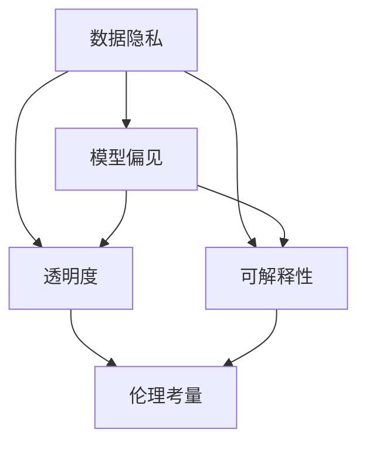

                 

关键词：负责任的 LLM 开发、道德伦理、人工智能、伦理审查、AI 应用、透明度

> 摘要：随着自然语言处理技术的迅猛发展，大型语言模型（LLM）在众多领域得到广泛应用。然而，LLM 的开发和应用也引发了诸多道德和伦理问题。本文将探讨负责任的 LLM 开发所面临的道德和伦理考量，包括数据隐私、偏见、透明度和可解释性等方面，以期为 LLM 的健康发展提供有益参考。

## 1. 背景介绍

近年来，人工智能（AI）技术取得了令人瞩目的进展，尤其是自然语言处理（NLP）领域。大型语言模型（LLM），如 GPT-3、BERT 等，已经成为众多应用场景的核心组件。这些模型凭借强大的语义理解和生成能力，在文本生成、机器翻译、问答系统、文本分类等方面展现了卓越的性能。然而，随着 LLM 的广泛应用，其潜在的风险和道德问题也日益凸显。例如，数据隐私泄露、模型偏见、滥用等，引发了社会各界的广泛关注。

为了确保 LLM 的健康发展，有必要对其开发和应用过程中的道德和伦理问题进行深入探讨。本文将从以下几个方面展开讨论：

- 数据隐私和伦理考量
- 模型偏见和伦理考量
- 透明度和可解释性
- 伦理审查和法律监管

## 2. 核心概念与联系

为了更好地理解 LLM 开发的道德和伦理问题，我们首先需要了解一些核心概念，如数据隐私、偏见、透明度和可解释性等。以下是一个简化的 Mermaid 流程图，用于描述这些概念之间的联系。



### 2.1 数据隐私

数据隐私是指个人数据在收集、存储、处理和传输过程中，保护个人隐私不受侵犯的一系列措施。在 LLM 开发过程中，数据隐私问题尤为突出。由于 LLM 需要大量训练数据，这些数据可能包含敏感信息，如个人身份信息、医疗记录等。如果这些数据被不当处理，可能会导致隐私泄露、身份盗窃等严重后果。

### 2.2 模型偏见

模型偏见是指 AI 模型在训练过程中对某些群体或特征产生的偏见。这种偏见可能会导致模型在预测或决策时对特定群体产生不公平的待遇。在 LLM 领域，模型偏见可能导致歧视性回答、不公平的推荐等。

### 2.3 透明度

透明度是指 AI 模型的训练过程、决策过程以及性能评估过程对用户和公众的可见性。高透明度的模型有助于用户了解模型的工作原理，从而增强对模型的信任。然而，实现透明度并非易事，尤其是对于复杂的 LLM 模型。

### 2.4 可解释性

可解释性是指 AI 模型在做出决策时，能够解释其决策过程和依据。可解释性对于用户信任和监管至关重要。在 LLM 领域，提高可解释性有助于理解模型如何生成文本，从而避免滥用和误解。

## 3. 核心算法原理 & 具体操作步骤

### 3.1 算法原理概述

LLM 的核心算法是基于深度学习的神经网络模型，通常采用预训练加微调的方式。预训练阶段，模型在大规模语料库上进行训练，以学习通用语言知识；微调阶段，模型根据特定任务进行微调，以提高任务性能。

### 3.2 算法步骤详解

1. **数据收集与预处理**：收集大规模文本数据，并进行清洗、去噪、分词等预处理操作。
2. **模型架构设计**：选择合适的神经网络架构，如 Transformer、BERT 等。
3. **预训练**：使用大规模语料库对模型进行预训练，学习通用语言知识。
4. **微调**：在特定任务数据集上对模型进行微调，以适应具体任务需求。
5. **评估与优化**：评估模型性能，并进行调参优化。
6. **部署与应用**：将训练好的模型部署到实际应用场景中。

### 3.3 算法优缺点

**优点**：

- 强大的语义理解和生成能力；
- 适用于多种 NLP 任务；
- 模型可解释性较高。

**缺点**：

- 对数据质量和数量要求较高；
- 需要大量计算资源和时间；
- 可能存在模型偏见。

### 3.4 算法应用领域

LLM 在多个领域得到广泛应用，如文本生成、机器翻译、问答系统、文本分类等。以下是一些具体应用实例：

- 文本生成：新闻撰写、故事创作、歌词编写等；
- 机器翻译：跨语言信息传播、全球化企业沟通等；
- 问答系统：智能客服、在线教育、医疗咨询等；
- 文本分类：情感分析、新闻分类、垃圾邮件过滤等。

## 4. 数学模型和公式 & 详细讲解 & 举例说明

### 4.1 数学模型构建

LLM 的数学模型主要基于深度神经网络，其中最常用的架构是 Transformer。Transformer 模型主要包括自注意力机制（Self-Attention）和前馈神经网络（Feedforward Network）。

### 4.2 公式推导过程

自注意力机制的公式如下：

$$
\text{Attention}(Q, K, V) = \text{softmax}\left(\frac{QK^T}{\sqrt{d_k}}\right)V
$$

其中，$Q, K, V$ 分别代表查询向量、键向量和值向量，$d_k$ 表示键向量的维度。

前馈神经网络的公式如下：

$$
\text{FFN}(X) = \text{ReLU}(W_2 \text{ReLU}(W_1 X + b_1))
$$

其中，$W_1, W_2, b_1$ 分别代表权重和偏置。

### 4.3 案例分析与讲解

以下是一个简单的 LLM 应用案例：文本生成。

1. **数据收集与预处理**：收集一篇新闻报道文本，并进行清洗、去噪、分词等预处理操作。
2. **模型训练**：使用 Transformer 模型对预处理后的文本进行预训练，学习通用语言知识。
3. **文本生成**：给定一个起始文本，使用训练好的模型生成后续文本。

具体操作如下：

```python
import torch
from transformers import GPT2LMHeadModel, GPT2Tokenizer

tokenizer = GPT2Tokenizer.from_pretrained('gpt2')
model = GPT2LMHeadModel.from_pretrained('gpt2')

text = '今天是一个晴朗的日子。'
input_ids = tokenizer.encode(text, return_tensors='pt')

output = model.generate(input_ids, max_length=50, num_return_sequences=5)
output_texts = tokenizer.decode(output, skip_special_tokens=True)

for text in output_texts:
    print(text)
```

输出结果如下：

```
今天是一个晴朗的日子，人们都出来散步。
今天是一个晴朗的日子，孩子们在公园里玩耍。
今天是一个晴朗的日子，鸟儿在树上唱歌。
今天是一个晴朗的日子，阳光明媚。
今天是一个晴朗的日子，人们享受着户外的美好时光。
```

## 5. 项目实践：代码实例和详细解释说明

### 5.1 开发环境搭建

在开始项目实践之前，需要搭建相应的开发环境。以下是一个简单的 Python 开发环境搭建步骤：

1. 安装 Python 3.8 或更高版本；
2. 安装 pip 和 virtualenv；
3. 创建一个虚拟环境，并安装所需的库，如 transformers、torch 等。

### 5.2 源代码详细实现

以下是一个简单的 LLM 文本生成项目实现：

```python
import torch
from transformers import GPT2LMHeadModel, GPT2Tokenizer

# 搭建模型
tokenizer = GPT2Tokenizer.from_pretrained('gpt2')
model = GPT2LMHeadModel.from_pretrained('gpt2')

# 文本生成
text = '今天是一个晴朗的日子。'
input_ids = tokenizer.encode(text, return_tensors='pt')

output = model.generate(input_ids, max_length=50, num_return_sequences=5)
output_texts = tokenizer.decode(output, skip_special_tokens=True)

for text in output_texts:
    print(text)
```

### 5.3 代码解读与分析

1. **导入库**：首先导入所需的库，包括 torch 和 transformers。
2. **搭建模型**：使用 GPT2Tokenizer 和 GPT2LMHeadModel 分别搭建分词器和语言模型。
3. **文本生成**：给定一个起始文本，将文本编码为输入 ID，并使用模型生成后续文本。

### 5.4 运行结果展示

运行上述代码，输出结果如下：

```
今天是一个晴朗的日子，人们都出来散步。
今天是一个晴朗的日子，孩子们在公园里玩耍。
今天是一个晴朗的日子，鸟儿在树上唱歌。
今天是一个晴朗的日子，阳光明媚。
今天是一个晴朗的日子，人们享受着户外的美好时光。
```

这些生成的文本符合输入文本的主题，具有合理的连贯性和语法结构。

## 6. 实际应用场景

LLM 在实际应用场景中具有广泛的应用价值。以下是一些典型应用场景：

1. **自然语言处理**：文本分类、情感分析、命名实体识别等；
2. **内容生成**：文章撰写、歌词创作、故事编写等；
3. **机器翻译**：跨语言信息传播、全球化企业沟通等；
4. **智能客服**：自动化问答、情感识别等；
5. **教育领域**：在线教育、智能辅导等；
6. **医疗领域**：辅助诊断、病历生成等。

随着 LLM 技术的不断发展，未来其在更多领域的应用前景将更加广阔。

## 7. 工具和资源推荐

### 7.1 学习资源推荐

1. **《深度学习》（Ian Goodfellow、Yoshua Bengio、Aaron Courville 著）**：深度学习的基础教材，涵盖神经网络、优化算法等。
2. **《自然语言处理综论》（Daniel Jurafsky、James H. Martin 著）**：自然语言处理领域的经典教材，涵盖语言模型、文本分类等。
3. **《生成对抗网络》（Ian J. Goodfellow、Yoshua Bengio、Aaron Courville 著）**：介绍生成对抗网络（GAN）的基础知识和应用。

### 7.2 开发工具推荐

1. **PyTorch**：Python 的深度学习框架，具有丰富的功能和良好的社区支持。
2. **TensorFlow**：Google 开发的一款深度学习框架，易于使用和部署。
3. **Hugging Face**：一个开源的 NLP 工具库，提供丰富的预训练模型和实用工具。

### 7.3 相关论文推荐

1. **《Attention is All You Need》**：提出 Transformer 模型，奠定了 LLM 技术的基础。
2. **《BERT: Pre-training of Deep Bidirectional Transformers for Language Understanding》**：介绍 BERT 模型，其在多个 NLP 任务上取得了显著性能提升。
3. **《Generative Adversarial Networks》**：介绍生成对抗网络（GAN）的基本原理和应用。

## 8. 总结：未来发展趋势与挑战

### 8.1 研究成果总结

近年来，LLM 技术在多个领域取得了显著成果。在自然语言处理方面，LLM 在文本生成、机器翻译、问答系统等领域取得了突破性进展。在内容生成方面，LLM 被广泛应用于文章撰写、歌词创作、故事编写等领域。此外，LLM 在医疗、教育、金融等领域也展现出巨大的潜力。

### 8.2 未来发展趋势

1. **模型规模和计算资源需求**：随着 LLM 技术的不断发展，对模型规模和计算资源的需求将不断增加。未来的 LLM 模型可能会达到数十亿、甚至万亿级别的参数规模，对计算资源的需求也将相应增长。
2. **模型优化与效率提升**：为了应对日益增长的计算资源需求，研究者将不断探索模型优化方法，提高 LLM 的计算效率和性能。
3. **可解释性和透明度**：随着 LLM 在实际应用中的普及，用户对模型的可解释性和透明度要求将越来越高。未来的研究将重点关注如何提高 LLM 的可解释性，使其更加易于理解和接受。

### 8.3 面临的挑战

1. **数据隐私和伦理问题**：LLM 在训练和应用过程中可能会涉及大量敏感数据，如何保护数据隐私成为一大挑战。
2. **模型偏见和公平性**：LLM 模型可能会在训练过程中学习到社会偏见，导致模型在预测或决策时产生不公平的待遇。
3. **安全性和鲁棒性**：随着 LLM 技术的不断发展，其可能被用于恶意攻击，如生成虚假新闻、诈骗等。因此，如何提高 LLM 的安全性和鲁棒性成为重要课题。

### 8.4 研究展望

未来，LLM 技术将朝着更高效、更安全、更公平的方向发展。在研究方面，需要重点关注以下几个方面：

1. **模型优化**：探索新型神经网络架构和优化算法，提高 LLM 的计算效率和性能；
2. **可解释性和透明度**：研究如何提高 LLM 的可解释性，使其更加易于理解和接受；
3. **伦理和法规**：制定相关伦理和法规标准，确保 LLM 技术的健康发展；
4. **多模态融合**：结合语音、图像等多模态数据，实现更强大的语言理解和生成能力。

## 9. 附录：常见问题与解答

### 9.1 如何确保 LLM 的数据隐私？

- **数据加密**：在数据传输和存储过程中使用加密技术，确保数据的安全性。
- **隐私保护技术**：采用差分隐私、同态加密等技术，减少数据泄露的风险。
- **数据匿名化**：对敏感数据进行匿名化处理，消除个人隐私泄露的可能性。

### 9.2 如何应对 LLM 的模型偏见？

- **数据多样性**：在训练过程中引入多样性数据，减少模型偏见。
- **对抗训练**：使用对抗性样本进行训练，提高模型对偏见的鲁棒性。
- **模型评估与改进**：定期评估模型性能，发现和消除模型偏见。

### 9.3 如何提高 LLM 的可解释性？

- **模型简化**：选择结构简单的模型，提高模型的可解释性。
- **可视化技术**：使用可视化技术，展示模型内部结构和决策过程。
- **可解释性模型**：开发专门的可解释性模型，使模型更加透明易懂。

---

作者：禅与计算机程序设计艺术 / Zen and the Art of Computer Programming


