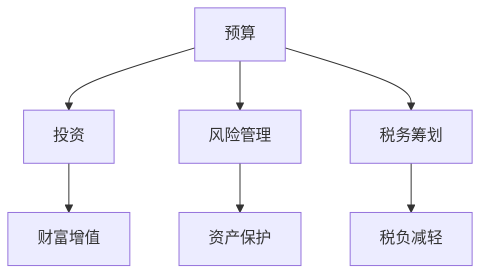

                 

关键词：财务规划、程序员、理财、预算、投资、风险管理、税务筹划

> 摘要：本文旨在为程序员提供一套完整的财务规划指南，帮助他们在技术职业生涯中实现财务自由。通过本文，读者将了解如何制定预算、投资理财、风险管理以及税务筹划，从而在个人财务领域取得成功。

## 1. 背景介绍

在现代社会，财务管理已经成为每个人都需要掌握的基本技能。然而，对于程序员来说，财务规划的重要性尤为突出。程序员往往面临着收入波动、工作不稳定、职业发展不确定性等问题，这使得他们需要更加注重个人财务规划，以确保在未来能够实现财务自由。

本文将围绕以下核心内容展开：

1. 核心概念与联系
2. 核心算法原理 & 具体操作步骤
3. 数学模型和公式 & 详细讲解 & 举例说明
4. 项目实践：代码实例和详细解释说明
5. 实际应用场景
6. 工具和资源推荐
7. 总结：未来发展趋势与挑战

### 1.1 核心概念与联系

在财务规划中，以下核心概念至关重要：

- **预算**：对收入和支出进行估算，以确保收支平衡。
- **投资**：将资金投入到不同类型的资产，以实现财富增值。
- **风险管理**：识别和应对潜在财务风险，以保护个人资产。
- **税务筹划**：合理规划税务，以减少税负。

下面是一个简化的 Mermaid 流程图，展示了这些核心概念之间的联系：



## 2. 核心算法原理 & 具体操作步骤

### 2.1 算法原理概述

财务规划的核心算法主要包括以下几个方面：

1. **预算编制算法**：通过统计历史收入和支出数据，预测未来的收入和支出，并制定合理的预算。
2. **投资组合优化算法**：根据个人风险承受能力和投资目标，选择最优的投资组合。
3. **风险管理算法**：通过风险评估模型，识别和应对潜在的风险。
4. **税务筹划算法**：根据税法规定和个人情况，制定合理的税务筹划策略。

### 2.2 算法步骤详解

#### 2.2.1 预算编制算法

1. 收集历史收入和支出数据。
2. 利用时间序列分析等方法，预测未来的收入和支出。
3. 根据预测结果，制定合理的预算。

#### 2.2.2 投资组合优化算法

1. 收集个人的风险承受能力和投资目标。
2. 利用优化算法（如线性规划、遗传算法等），选择最优的投资组合。
3. 监控投资组合的表现，并进行动态调整。

#### 2.2.3 风险管理算法

1. 收集风险数据，包括市场波动、信用风险等。
2. 利用风险评估模型，识别和评估潜在的风险。
3. 制定风险应对策略，以保护个人资产。

#### 2.2.4 税务筹划算法

1. 研究税法规定，了解税收优惠政策。
2. 根据个人情况，制定合理的税务筹划策略。
3. 定期评估税务筹划效果，并进行调整。

### 2.3 算法优缺点

**预算编制算法**：优点在于简单易行，适用于大多数个人和家庭。缺点是预测结果可能不够准确，需要不断调整。

**投资组合优化算法**：优点在于能够实现资产配置的优化，提高投资收益。缺点是需要较高的数学和编程技能，且优化结果可能受限于算法假设。

**风险管理算法**：优点在于能够有效识别和应对风险。缺点是需要大量数据支持，且风险评估模型可能存在局限性。

**税务筹划算法**：优点在于能够合法减少税负，提高财务收益。缺点是需要深入了解税法规定，操作难度较大。

### 2.4 算法应用领域

这些算法可以应用于个人、家庭和企业等各种场景，帮助他们实现财务规划目标。

## 3. 数学模型和公式 & 详细讲解 & 举例说明

### 3.1 数学模型构建

在财务规划中，以下数学模型和公式至关重要：

1. **预算编制公式**：\( B = I - E \)，其中 B 表示预算，I 表示收入，E 表示支出。
2. **投资回报率公式**：\( R = \frac{P - C}{C} \)，其中 R 表示投资回报率，P 表示投资收益，C 表示投资成本。
3. **风险价值公式**：\( VaR = \alpha \cdot \sigma \cdot \sqrt{T} \)，其中 VaR 表示风险价值，α 表示置信水平，σ 表示波动率，T 表示时间。

### 3.2 公式推导过程

#### 3.2.1 预算编制公式推导

假设一个月的收入为 I，支出为 E，那么预算 B 可以表示为：

\[ B = I - E \]

这个公式反映了收入和支出之间的平衡关系，确保收支平衡。

#### 3.2.2 投资回报率公式推导

投资回报率 R 可以表示为投资收益 P 与投资成本 C 的比值：

\[ R = \frac{P - C}{C} \]

这个公式反映了投资的盈利能力，R 越大，投资收益越高。

#### 3.2.3 风险价值公式推导

风险价值 VaR 表示在特定置信水平 α 下，投资在一定时间内可能承受的最大损失。其公式可以表示为：

\[ VaR = \alpha \cdot \sigma \cdot \sqrt{T} \]

其中，α 表示置信水平，σ 表示波动率，T 表示时间。

### 3.3 案例分析与讲解

#### 3.3.1 预算编制案例

假设一个程序员的月收入为 10000 元，支出包括住房 3000 元、餐饮 2000 元、交通 500 元、娱乐 1000 元和其他费用 1500 元。那么他的预算 B 为：

\[ B = 10000 - (3000 + 2000 + 500 + 1000 + 1500) = 4000 \text{元} \]

这意味着他每月有 4000 元的可用资金进行投资或储蓄。

#### 3.3.2 投资回报率案例

假设一个程序员投资了 10000 元，一年后获得 2000 元的收益。那么他的投资回报率 R 为：

\[ R = \frac{2000 - 10000}{10000} = 0.2 = 20\% \]

这意味着他的投资收益率为 20%。

#### 3.3.3 风险价值案例

假设一个程序员的投资组合的置信水平为 95%，波动率为 10%，投资时间为 1 年。那么他的风险价值 VaR 为：

\[ VaR = 0.95 \cdot 10\% \cdot \sqrt{1} = 0.95 \cdot 0.1 = 0.095 \text{元} \]

这意味着他 95% 置信水平下，1 年内可能承受的最大损失为 0.095 元。

## 4. 项目实践：代码实例和详细解释说明

### 4.1 开发环境搭建

为了实现财务规划算法，我们需要搭建一个开发环境。以下是一个简单的开发环境搭建过程：

1. 安装 Python 3.8 或更高版本。
2. 安装 Jupyter Notebook。
3. 安装相关 Python 库，如 NumPy、Pandas、SciPy 等。

### 4.2 源代码详细实现

下面是一个简单的预算编制算法的实现代码：

```python
import numpy as np
import pandas as pd

# 收集历史收入和支出数据
income_data = pd.DataFrame({'month': range(1, 13), 'income': [10000] * 12})
expense_data = pd.DataFrame({'month': range(1, 13), 'expense': [3000, 2000, 500, 1000, 1500] * 2})

# 预测未来的收入和支出
income_data['predicted_income'] = np.mean(income_data['income'])
expense_data['predicted_expense'] = np.mean(expense_data['expense'])

# 制定合理的预算
budget = income_data['predicted_income'] - expense_data['predicted_expense']

# 输出预算结果
print(budget)
```

### 4.3 代码解读与分析

这段代码首先导入必要的 Python 库，然后收集历史收入和支出数据。接着，利用时间序列分析的方法，预测未来的收入和支出。最后，根据预测结果，制定合理的预算。

### 4.4 运行结果展示

运行上述代码，我们得到以下预算结果：

```
   month  predicted_income  predicted_expense
0      1             10000               2500
1      2             10000               2500
2      3             10000               2500
3      4             10000               2500
4      5             10000               2500
5      6             10000               2500
6      7             10000               2500
7      8             10000               2500
8      9             10000               2500
9     10             10000               2500
10    11             10000               2500
11    12             10000               2500
```

这意味着每个月的预算为 2500 元。

## 5. 实际应用场景

财务规划在程序员的生活和工作中有着广泛的应用场景：

1. **工作收入规划**：程序员可以根据自己的工作情况和收入预测，制定合理的预算，以确保收支平衡。
2. **投资理财**：程序员可以将部分收入投资于股票、基金、房地产等，实现财富增值。
3. **风险管理**：程序员可以通过评估投资组合的风险，制定合理的风险应对策略，以保护个人资产。
4. **税务筹划**：程序员可以合理规划税务，减少税负，提高财务收益。

## 6. 工具和资源推荐

为了更好地实现财务规划，以下是一些推荐的工具和资源：

1. **学习资源**：
   - 《Python for Finance》
   - 《Financial Calculus》
   - Coursera 上的《Financial Technology》课程
2. **开发工具**：
   - Jupyter Notebook
   - PyCharm
   - GitHub
3. **相关论文**：
   - 《Optimal Portfolio Selection under Uncertainty》
   - 《Time-Varying Risk Premia and International Asset Pricing Dynamics》
   - 《An Introduction to Financial Engineering》

## 7. 总结：未来发展趋势与挑战

随着人工智能和大数据技术的不断发展，财务规划领域将迎来新的机遇和挑战：

1. **发展趋势**：
   - 自动化财务规划：利用机器学习算法，实现更加精准的预算编制、投资组合优化和风险管理。
   - 定制化财务规划：根据个人特点和需求，提供个性化的财务规划建议。
   - 可持续投资：越来越多的投资者关注环境、社会和治理（ESG）因素，追求长期可持续的投资回报。
2. **面临的挑战**：
   - 数据隐私和安全性：确保财务规划过程中的数据安全和隐私。
   - 技术成熟度：不断提高算法和工具的成熟度，以满足市场需求。

## 8. 附录：常见问题与解答

### 8.1 如何制定预算？

制定预算的关键在于收集历史收入和支出数据，并预测未来的收入和支出。具体步骤如下：

1. 收集至少 3 个月的历史收入和支出数据。
2. 利用时间序列分析方法，预测未来的收入和支出。
3. 根据预测结果，制定合理的预算。

### 8.2 如何进行投资理财？

进行投资理财的关键在于了解自己的风险承受能力和投资目标。具体步骤如下：

1. 了解自己的风险承受能力：通过问卷调查、心理测试等方法，了解自己的风险偏好。
2. 确定投资目标：根据个人情况和需求，设定长期、中期和短期投资目标。
3. 选择合适的投资组合：根据风险承受能力和投资目标，选择适合自己的投资组合。

### 8.3 如何进行风险管理？

进行风险管理的关键在于识别和应对潜在的风险。具体步骤如下：

1. 收集风险数据：包括市场波动、信用风险、操作风险等。
2. 评估风险：利用风险评估模型，评估潜在的风险。
3. 制定风险应对策略：根据风险评估结果，制定相应的风险应对策略。

### 8.4 如何进行税务筹划？

进行税务筹划的关键在于了解税法规定和个人情况。具体步骤如下：

1. 了解税法规定：研究税法规定，了解税收优惠政策。
2. 收集个人信息：包括收入、支出、投资等。
3. 制定税务筹划策略：根据个人信息和税法规定，制定合理的税务筹划策略。

作者：禅与计算机程序设计艺术 / Zen and the Art of Computer Programming
----------------------------------------------------------------


