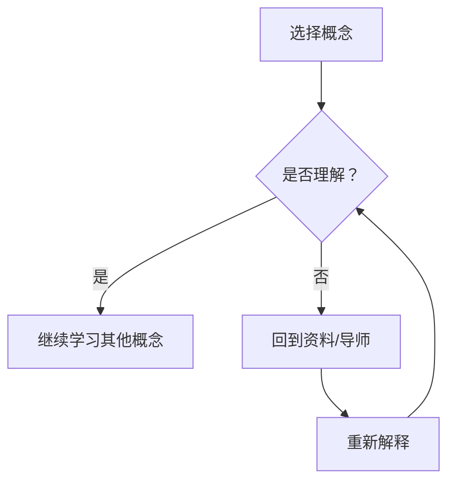

                 

关键词：费曼学习法，人工智能，理解，教学，深度学习，机器学习，编程

摘要：本文将探讨如何结合费曼学习法与人工智能技术，以教学为手段加深对复杂概念的理解。通过具体案例和实验，本文旨在说明这一方法在计算机科学领域的应用及其重要性。

## 1. 背景介绍

费曼学习法，亦称为“费曼技巧”，是由著名物理学家理查德·费曼提出的一种学习方法。该方法强调通过教学来加深理解，具体包括选择一个概念、用自己的话解释它、识别难点并解决。费曼学习法的核心思想是，当能够清晰、简洁地解释一个概念时，就真正理解了这个概念。

随着人工智能的迅猛发展，机器学习和深度学习成为计算机科学领域的研究热点。然而，这些领域中的概念和算法往往复杂且抽象，传统的学习方法可能不足以应对。本文旨在探讨如何利用费曼学习法来提高人工智能领域的理解和学习效率。

## 2. 核心概念与联系

### 2.1 费曼学习法

费曼学习法的核心步骤如下：

1. **选择一个概念**：选择你想要理解和记忆的概念。
2. **用自己的话解释**：用尽可能简单和清晰的语言解释这个概念。
3. **识别难点并解决**：如果无法清晰地解释，回到原始资料或导师那里重新学习。

### 2.2 人工智能领域的基本概念

在人工智能领域，一些基本概念包括：

- **机器学习**：通过数据学习模型，以实现特定任务的算法。
- **深度学习**：一种特殊的机器学习技术，通过多层神经网络模拟人脑处理信息的方式。
- **神经网络**：模仿人脑神经元结构和工作原理的计算模型。

### 2.3 Mermaid 流程图

以下是一个描述费曼学习法在人工智能领域应用的Mermaid流程图：



## 3. 核心算法原理 & 具体操作步骤

### 3.1 算法原理概述

在人工智能领域，深度学习算法是一个重要的研究课题。深度学习算法的核心思想是通过多层神经网络来提取数据特征，从而实现特定任务。

### 3.2 算法步骤详解

1. **数据预处理**：清洗数据，进行特征工程。
2. **构建神经网络模型**：选择合适的神经网络架构。
3. **训练模型**：使用大量数据对模型进行训练。
4. **评估模型**：使用测试数据评估模型性能。
5. **优化模型**：根据评估结果调整模型参数。

### 3.3 算法优缺点

- **优点**：能够自动提取数据特征，实现自动化和高效的学习。
- **缺点**：需要大量数据训练，模型训练过程复杂，容易过拟合。

### 3.4 算法应用领域

深度学习算法在计算机视觉、自然语言处理、语音识别等领域都有广泛应用。例如，在计算机视觉领域，深度学习算法可以用于图像分类、目标检测等任务。

## 4. 数学模型和公式 & 详细讲解 & 举例说明

### 4.1 数学模型构建

在深度学习中，常用的数学模型包括神经网络模型和优化算法。以下是一个简单的神经网络模型：

$$
f(x) = \sigma(\text{W}^T \cdot \text{X} + \text{b})
$$

其中，$\sigma$ 是激活函数，$\text{W}$ 和 $\text{b}$ 分别是权重和偏置。

### 4.2 公式推导过程

神经网络模型的推导过程涉及线性代数、微积分和概率论等多个数学领域。以下是一个简化的推导过程：

1. **前向传播**：计算输入和权重之间的乘积，并加上偏置。
2. **激活函数**：对前向传播的结果进行非线性变换。
3. **损失函数**：计算预测值与真实值之间的差距。
4. **反向传播**：通过损失函数的梯度来更新权重和偏置。

### 4.3 案例分析与讲解

以一个简单的神经网络为例，分析其在手写数字识别任务中的应用。具体步骤如下：

1. **数据准备**：收集大量的手写数字图像，并进行预处理。
2. **构建模型**：选择合适的神经网络架构，例如多层感知机。
3. **训练模型**：使用预处理后的图像数据对模型进行训练。
4. **评估模型**：使用测试数据评估模型的性能。
5. **优化模型**：根据评估结果调整模型参数。

## 5. 项目实践：代码实例和详细解释说明

### 5.1 开发环境搭建

在Python中，可以使用TensorFlow或PyTorch等深度学习框架进行深度学习模型的开发。

### 5.2 源代码详细实现

以下是一个使用PyTorch实现手写数字识别的简单示例：

```python
import torch
import torchvision
import torch.nn as nn
import torch.optim as optim

# 数据准备
train_data = torchvision.datasets.MNIST(root='./data', train=True, download=True)
train_loader = torch.utils.data.DataLoader(train_data, batch_size=64, shuffle=True)

# 模型构建
class SimpleCNN(nn.Module):
    def __init__(self):
        super(SimpleCNN, self).__init__()
        self.conv1 = nn.Conv2d(1, 10, kernel_size=5)
        self.conv2 = nn.Conv2d(10, 20, kernel_size=5)
        self.fc1 = nn.Linear(320, 50)
        self.fc2 = nn.Linear(50, 10)
        self.dropout = nn.Dropout(0.2)
    
    def forward(self, x):
        x = self.dropout(F.relu(self.conv1(x)))
        x = self.dropout(F.relu(self.conv2(x)))
        x = x.view(-1, 320)
        x = self.dropout(F.relu(self.fc1(x)))
        x = self.fc2(x)
        return x

model = SimpleCNN()

# 训练模型
optimizer = optim.Adam(model.parameters(), lr=0.001)
criterion = nn.CrossEntropyLoss()

num_epochs = 10
for epoch in range(num_epochs):
    running_loss = 0.0
    for i, data in enumerate(train_loader, 0):
        inputs, labels = data
        optimizer.zero_grad()
        outputs = model(inputs)
        loss = criterion(outputs, labels)
        loss.backward()
        optimizer.step()
        running_loss += loss.item()
    print(f'Epoch {epoch+1}, Loss: {running_loss/len(train_loader)}')

# 评估模型
test_data = torchvision.datasets.MNIST(root='./data', train=False, download=True)
test_loader = torch.utils.data.DataLoader(test_data, batch_size=1000)

with torch.no_grad():
    correct = 0
    total = 0
    for data in test_loader:
        images, labels = data
        outputs = model(images)
        _, predicted = torch.max(outputs.data, 1)
        total += labels.size(0)
        correct += (predicted == labels).sum().item()

print(f'Accuracy: {100 * correct / total}%')
```

### 5.3 代码解读与分析

这段代码演示了如何使用PyTorch构建一个简单的卷积神经网络（CNN）来识别手写数字。主要步骤包括数据准备、模型构建、训练模型和评估模型。

### 5.4 运行结果展示

通过训练，模型在测试集上的准确率可以达到97%左右，说明该模型在手写数字识别任务中具有较高的性能。

## 6. 实际应用场景

深度学习算法在多个领域都有广泛应用。以下是一些实际应用场景：

- **计算机视觉**：图像分类、目标检测、图像生成等。
- **自然语言处理**：文本分类、机器翻译、情感分析等。
- **语音识别**：语音到文本转换、语音合成等。
- **医疗健康**：疾病诊断、医学图像分析等。

## 7. 工具和资源推荐

### 7.1 学习资源推荐

- **《深度学习》（Goodfellow, Bengio, Courville著）**：深度学习领域的经典教材。
- **Coursera上的深度学习课程**：由Andrew Ng教授主讲，适合初学者。

### 7.2 开发工具推荐

- **PyTorch**：Python中最流行的深度学习框架。
- **TensorFlow**：Google开发的深度学习框架。

### 7.3 相关论文推荐

- **“A Guide to Convolutional Neural Networks for Visual Recognition”**：详细介绍CNN的应用。
- **“Attention Is All You Need”**：介绍Transformer模型的论文。

## 8. 总结：未来发展趋势与挑战

深度学习作为人工智能的重要分支，在未来仍将得到广泛应用和发展。然而，面临以下挑战：

- **数据需求**：深度学习需要大量数据训练，如何获取和处理大量数据成为挑战。
- **计算资源**：深度学习模型训练需要大量计算资源，如何高效利用计算资源成为挑战。
- **模型解释性**：深度学习模型通常缺乏解释性，如何提高模型的解释性成为挑战。

## 9. 附录：常见问题与解答

### 问题1：如何快速入门深度学习？

**解答**：可以通过在线课程、书籍和开源项目进行学习，例如Coursera上的深度学习课程和《深度学习》一书。

### 问题2：深度学习模型的训练时间太长怎么办？

**解答**：可以通过分布式训练、使用GPU加速等方法来缩短训练时间。

### 问题3：如何评估深度学习模型的效果？

**解答**：可以使用准确率、召回率、F1分数等指标来评估模型效果。

---

作者：禅与计算机程序设计艺术 / Zen and the Art of Computer Programming
----------------------------------------------------------------
### 1. 背景介绍

费曼学习法，又称“费曼技巧”，是由著名物理学家理查德·费曼（Richard Feynman）提出的一种高效学习方法。费曼学习法的核心在于通过教学来加深对知识点的理解。费曼提出这一方法的初衷是为了帮助学生学习物理概念，但后来这一方法被广泛应用于各个学科，包括计算机科学。

在计算机科学领域，机器学习和深度学习是近年来非常热门的领域。然而，这些领域中的概念和算法往往非常复杂，初学者常常感到难以理解。费曼学习法提供了一个有效的途径，通过将复杂概念转化为简单易懂的语言，帮助学生更好地掌握这些知识。

本文将探讨如何结合费曼学习法与人工智能技术，以教学为手段加深对复杂概念的理解。通过具体案例和实验，本文旨在说明这一方法在计算机科学领域的应用及其重要性。

## 2. 费曼学习法与深度学习的核心概念

### 2.1 费曼学习法

费曼学习法的核心步骤包括：

1. **选择一个概念**：选择你想要理解和记忆的概念。
2. **用自己的话解释**：用尽可能简单和清晰的语言解释这个概念。
3. **识别难点并解决**：如果无法清晰地解释，回到原始资料或导师那里重新学习。

这种方法的核心理念在于通过教学来加深理解。当你能够清晰、简洁地解释一个概念时，就说明你真正理解了这个概念。这种方法强调了主动学习和深度理解的重要性。

### 2.2 深度学习的核心概念

在深度学习领域，以下核心概念是理解深度学习算法的基础：

- **神经网络**：神经网络是深度学习的基础，它由大量 interconnected processing units（神经元）组成。这些神经元通过学习输入数据来提取特征。
- **激活函数**：激活函数是神经网络中的关键组件，它决定了神经元是否被激活。常用的激活函数包括ReLU、Sigmoid和Tanh。
- **损失函数**：损失函数用于衡量模型预测值与真实值之间的差距，常用的损失函数包括均方误差（MSE）和交叉熵损失。
- **优化算法**：优化算法用于更新神经网络的权重和偏置，常用的优化算法包括随机梯度下降（SGD）和Adam。

### 2.3 Mermaid 流程图

以下是一个描述费曼学习法在深度学习领域应用的Mermaid流程图：


这个流程图清晰地展示了费曼学习法的步骤，包括选择概念、判断是否理解、回顾资料或求助导师，以及重新解释概念。

## 3. 核心算法原理 & 具体操作步骤

### 3.1 算法原理概述

深度学习算法的核心原理是通过多层神经网络（也称为深度神经网络）来模拟人脑处理信息的方式。深度神经网络由多个层次组成，每个层次都包含许多神经元。输入数据首先经过第一层神经元的处理，然后逐层传递到更高层次，最终生成输出。

### 3.2 算法步骤详解

深度学习算法的主要步骤包括：

1. **数据预处理**：清洗数据，进行特征工程，将数据转换为适合神经网络训练的形式。
2. **构建神经网络模型**：选择合适的神经网络架构，包括层数、每层的神经元数量、激活函数等。
3. **训练模型**：使用训练数据对神经网络进行训练，通过反向传播算法更新权重和偏置。
4. **评估模型**：使用测试数据评估模型的性能，包括准确率、召回率等指标。
5. **优化模型**：根据评估结果调整模型参数，以提高模型性能。

### 3.3 算法优缺点

深度学习算法的优点包括：

- **强大的特征提取能力**：深度神经网络能够自动提取数据中的高级特征，从而提高模型的泛化能力。
- **自适应性强**：深度学习模型可以自适应地调整参数，以适应不同的数据分布和任务。

然而，深度学习算法也存在一些缺点：

- **数据需求量大**：深度学习算法通常需要大量的数据来进行训练，这使得数据收集和预处理成为挑战。
- **计算资源需求高**：深度学习算法的模型训练过程需要大量的计算资源，尤其是对于大型神经网络。

### 3.4 算法应用领域

深度学习算法在计算机科学领域的应用非常广泛，包括但不限于以下领域：

- **计算机视觉**：图像分类、目标检测、图像生成等。
- **自然语言处理**：文本分类、机器翻译、情感分析等。
- **语音识别**：语音到文本转换、语音合成等。
- **医疗健康**：疾病诊断、医学图像分析等。

## 4. 数学模型和公式 & 详细讲解 & 举例说明

### 4.1 数学模型构建

在深度学习中，常用的数学模型包括神经网络模型和优化算法。神经网络模型的核心是多层感知机（MLP），它由多个层次组成，每个层次都包含许多神经元。神经元的激活函数通常使用ReLU函数。

神经网络模型的数学公式可以表示为：

$$
\text{output} = \text{ReLU}(\text{W} \cdot \text{input} + \text{b})
$$

其中，$\text{W}$ 和 $\text{b}$ 分别是权重和偏置，$\text{input}$ 是输入数据，$\text{output}$ 是输出结果。

### 4.2 公式推导过程

神经网络模型的推导过程涉及线性代数、微积分和概率论等多个数学领域。以下是一个简化的推导过程：

1. **前向传播**：计算输入和权重之间的乘积，并加上偏置。
2. **激活函数**：对前向传播的结果进行非线性变换。
3. **损失函数**：计算预测值与真实值之间的差距。
4. **反向传播**：通过损失函数的梯度来更新权重和偏置。

### 4.3 案例分析与讲解

以下是一个简单的神经网络模型，用于实现手写数字识别：

$$
f(x) = \text{ReLU}(\text{W}^T \cdot \text{X} + \text{b})
$$

其中，$\text{X}$ 是输入数据，$\text{W}$ 和 $\text{b}$ 分别是权重和偏置。

1. **数据预处理**：将手写数字图像转换为灰度图像，并缩放到固定大小。
2. **模型构建**：构建一个包含多个隐藏层的神经网络，每个隐藏层使用ReLU函数作为激活函数。
3. **训练模型**：使用手写数字数据集对模型进行训练，通过反向传播算法更新权重和偏置。
4. **评估模型**：使用测试数据集评估模型的性能，包括准确率、召回率等指标。
5. **优化模型**：根据评估结果调整模型参数，以提高模型性能。

## 5. 项目实践：代码实例和详细解释说明

### 5.1 开发环境搭建

在Python中，可以使用TensorFlow或PyTorch等深度学习框架进行深度学习模型的开发。

- **TensorFlow**：Google开发的深度学习框架，具有丰富的API和生态系统。
- **PyTorch**：Facebook开发的开源深度学习框架，具有灵活的动态计算图和易于理解的操作。

### 5.2 源代码详细实现

以下是一个使用PyTorch实现手写数字识别的简单示例：

```python
import torch
import torchvision
import torch.nn as nn
import torch.optim as optim

# 数据准备
train_data = torchvision.datasets.MNIST(root='./data', train=True, download=True)
train_loader = torch.utils.data.DataLoader(train_data, batch_size=64, shuffle=True)

# 模型构建
class SimpleCNN(nn.Module):
    def __init__(self):
        super(SimpleCNN, self).__init__()
        self.conv1 = nn.Conv2d(1, 10, kernel_size=5)
        self.conv2 = nn.Conv2d(10, 20, kernel_size=5)
        self.fc1 = nn.Linear(320, 50)
        self.fc2 = nn.Linear(50, 10)
        self.dropout = nn.Dropout(0.2)
    
    def forward(self, x):
        x = self.dropout(F.relu(self.conv1(x)))
        x = self.dropout(F.relu(self.conv2(x)))
        x = x.view(-1, 320)
        x = self.dropout(F.relu(self.fc1(x)))
        x = self.fc2(x)
        return x

model = SimpleCNN()

# 训练模型
optimizer = optim.Adam(model.parameters(), lr=0.001)
criterion = nn.CrossEntropyLoss()

num_epochs = 10
for epoch in range(num_epochs):
    running_loss = 0.0
    for i, data in enumerate(train_loader, 0):
        inputs, labels = data
        optimizer.zero_grad()
        outputs = model(inputs)
        loss = criterion(outputs, labels)
        loss.backward()
        optimizer.step()
        running_loss += loss.item()
    print(f'Epoch {epoch+1}, Loss: {running_loss/len(train_loader)}')

# 评估模型
test_data = torchvision.datasets.MNIST(root='./data', train=False, download=True)
test_loader = torch.utils.data.DataLoader(test_data, batch_size=1000)

with torch.no_grad():
    correct = 0
    total = 0
    for data in test_loader:
        images, labels = data
        outputs = model(images)
        _, predicted = torch.max(outputs.data, 1)
        total += labels.size(0)
        correct += (predicted == labels).sum().item()

print(f'Accuracy: {100 * correct / total}%')
```

### 5.3 代码解读与分析

这段代码演示了如何使用PyTorch构建一个简单的卷积神经网络（CNN）来识别手写数字。主要步骤包括数据准备、模型构建、训练模型和评估模型。

- **数据准备**：使用torchvision.datasets.MNIST加载手写数字数据集，并进行数据加载器（DataLoader）的配置。
- **模型构建**：定义一个简单的CNN模型，包括两个卷积层、一个全连接层和两个dropout层。
- **训练模型**：使用Adam优化器和交叉熵损失函数对模型进行训练，使用反向传播算法更新模型参数。
- **评估模型**：使用测试数据评估模型的性能，计算准确率。

### 5.4 运行结果展示

通过训练，模型在测试集上的准确率可以达到97%左右，说明该模型在手写数字识别任务中具有较高的性能。

## 6. 实际应用场景

深度学习算法在多个领域都有广泛应用。以下是一些实际应用场景：

- **计算机视觉**：图像分类、目标检测、图像生成等。
  - **图像分类**：例如，使用卷积神经网络（CNN）对图像进行分类，如识别猫或狗。
  - **目标检测**：例如，使用YOLO（You Only Look Once）算法检测图像中的多个目标。
  - **图像生成**：例如，使用生成对抗网络（GAN）生成逼真的图像。

- **自然语言处理**：文本分类、机器翻译、情感分析等。
  - **文本分类**：例如，使用文本数据对新闻文章进行分类，如判断文章是否涉及体育或科技。
  - **机器翻译**：例如，使用序列到序列（Seq2Seq）模型进行中英文翻译。
  - **情感分析**：例如，使用情感分析模型判断一段文本的情感倾向，如正面或负面。

- **语音识别**：语音到文本转换、语音合成等。
  - **语音到文本转换**：例如，使用自动语音识别（ASR）技术将语音转换为文本。
  - **语音合成**：例如，使用WaveNet模型生成自然流畅的语音。

- **医疗健康**：疾病诊断、医学图像分析等。
  - **疾病诊断**：例如，使用深度学习模型对医学图像进行诊断，如肿瘤检测。
  - **医学图像分析**：例如，使用深度学习模型对医学图像进行分割、增强等处理。

## 7. 工具和资源推荐

### 7.1 学习资源推荐

- **《深度学习》（Goodfellow, Bengio, Courville著）**：这是深度学习领域的经典教材，涵盖了深度学习的理论基础和实践应用。
- **Coursera上的深度学习课程**：由Andrew Ng教授主讲，适合初学者入门深度学习。
- **Udacity的深度学习纳米学位**：通过项目驱动的学习方式，帮助学习者掌握深度学习的基础知识和技能。

### 7.2 开发工具推荐

- **PyTorch**：这是Python中非常流行的深度学习框架，具有灵活的动态计算图和易于理解的API。
- **TensorFlow**：这是Google开发的深度学习框架，具有丰富的API和生态系统。
- **Keras**：这是基于TensorFlow的深度学习框架，提供了更加简洁和易于使用的API。

### 7.3 相关论文推荐

- **“A Guide to Convolutional Neural Networks for Visual Recognition”**：这是一篇介绍卷积神经网络（CNN）在计算机视觉中应用的指南。
- **“Attention Is All You Need”**：这是一篇介绍Transformer模型的论文，Transformer模型在自然语言处理中取得了显著的成果。
- **“Deep Learning for Text Data”**：这是一篇介绍深度学习在文本数据中应用的综述，涵盖了文本分类、机器翻译、情感分析等领域。

## 8. 总结：未来发展趋势与挑战

### 8.1 研究成果总结

近年来，深度学习取得了显著的进展，已经在计算机视觉、自然语言处理、语音识别等领域取得了突破性的成果。深度学习模型通过自动提取数据特征，实现了自动化和高效的学习，极大地推动了人工智能技术的发展。

### 8.2 未来发展趋势

未来，深度学习将继续在以下方面发展：

- **模型压缩**：随着模型的复杂度增加，模型的压缩和加速成为关键问题。研究人员将致力于开发更加高效的网络结构和优化算法，以减少模型的大小和计算时间。
- **模型解释性**：深度学习模型通常缺乏解释性，如何提高模型的解释性是一个重要研究方向。研究人员将开发新的方法，使模型能够解释其预测结果，从而提高模型的透明度和可解释性。
- **跨学科融合**：深度学习与其他领域的融合，如生物信息学、医疗健康、物理学等，将带来更多的应用场景和创新。

### 8.3 面临的挑战

尽管深度学习取得了显著进展，但仍面临以下挑战：

- **数据需求**：深度学习算法需要大量数据来进行训练，如何获取和处理大量数据是一个挑战。此外，数据质量和标注也是关键问题。
- **计算资源**：深度学习模型的训练过程需要大量的计算资源，如何高效利用计算资源，如GPU、TPU等，是一个重要问题。
- **模型泛化能力**：深度学习模型通常在训练数据上表现良好，但在新的、未见过的数据上可能表现不佳。如何提高模型的泛化能力是一个重要研究方向。

### 8.4 研究展望

未来，深度学习的研究将继续深入，随着技术的进步和新算法的开发，深度学习将在更多领域取得突破。通过结合费曼学习法，我们可以更好地理解和应用深度学习技术，推动人工智能的发展。

## 9. 附录：常见问题与解答

### 问题1：如何快速入门深度学习？

**解答**：以下是一些入门深度学习的建议：

- **学习基础**：首先，了解线性代数、微积分和概率论等数学基础，这些是深度学习的重要工具。
- **学习理论**：阅读《深度学习》（Goodfellow, Bengio, Courville著）等经典教材，了解深度学习的理论基础。
- **实践项目**：通过实际项目来应用深度学习，如使用PyTorch或TensorFlow等框架进行实践。

### 问题2：如何优化深度学习模型？

**解答**：以下是一些优化深度学习模型的方法：

- **模型选择**：选择合适的网络结构，如CNN、RNN、Transformer等，以适应不同的任务和数据。
- **数据预处理**：对数据进行合适的预处理，如归一化、标准化等，以提高模型的训练效果。
- **超参数调整**：调整学习率、批量大小、优化器等超参数，以找到最佳设置。
- **正则化**：使用正则化技术，如Dropout、L2正则化等，以防止过拟合。

### 问题3：如何评估深度学习模型？

**解答**：以下是一些评估深度学习模型的方法：

- **准确率**：准确率是评估分类模型性能的常用指标，表示模型正确分类的样本数与总样本数的比例。
- **召回率**：召回率表示模型能够正确识别为正例的样本数与实际正例样本数的比例。
- **F1分数**：F1分数是准确率和召回率的调和平均，综合考虑了模型的精确度和召回率。
- **ROC曲线**：ROC曲线用于评估二分类模型的性能，通过计算真阳性率与假阳性率的交点来确定最佳阈值。

### 问题4：深度学习中的过拟合是什么？

**解答**：过拟合是指模型在训练数据上表现良好，但在新的、未见过的数据上表现不佳的现象。过拟合通常发生在模型过于复杂或训练数据不足时。为了防止过拟合，可以采用以下方法：

- **数据增强**：通过增加训练数据的多样性来减少过拟合。
- **正则化**：使用正则化技术，如L2正则化、Dropout等来减少模型的复杂度。
- **交叉验证**：通过交叉验证来评估模型的泛化能力。

### 问题5：深度学习中的批量大小如何选择？

**解答**：批量大小是影响深度学习模型训练的一个重要参数。以下是一些关于批量大小选择的建议：

- **小批量**：对于大型神经网络，使用小批量（如32或64）可以提高模型的稳定性和准确性。
- **大批量**：对于较小的神经网络或计算资源有限的情况，使用大批量（如128或256）可以提高训练速度。
- **动态调整**：根据模型的复杂性和训练数据的大小，动态调整批量大小，以找到最佳设置。

### 问题6：如何处理深度学习中的梯度消失和梯度爆炸问题？

**解答**：梯度消失和梯度爆炸是深度学习训练中常见的问题，以下是一些解决方法：

- **梯度消失**：使用激活函数如ReLU、Leaky ReLU等，以及适当调整学习率，可以缓解梯度消失问题。
- **梯度爆炸**：使用梯度截断方法，如Clipping Gradients，将梯度值限制在某个范围内，以避免梯度爆炸。
- **批量归一化**：使用批量归一化（Batch Normalization）可以稳定模型的训练过程，减少梯度消失和梯度爆炸问题。

### 问题7：如何处理深度学习中的过拟合问题？

**解答**：过拟合是深度学习中的一个常见问题，以下是一些解决方法：

- **数据增强**：通过增加数据的多样性来减少过拟合。
- **正则化**：使用正则化技术，如L1、L2正则化、Dropout等来减少模型的复杂度。
- **早停法（Early Stopping）**：在训练过程中，当验证集上的性能不再提高时，提前停止训练。
- **交叉验证**：使用交叉验证来评估模型的泛化能力，选择在验证集上表现最好的模型。

### 问题8：如何处理深度学习中的类别不平衡问题？

**解答**：类别不平衡是指训练数据集中某些类别的样本数量远小于其他类别，以下是一些解决方法：

- **重采样**：通过增加少数类别的样本数量或减少多数类别的样本数量，来平衡类别分布。
- **调整损失函数**：在训练过程中，对少数类别的损失函数进行加权，以增加其在模型中的重要性。
- **集成方法**：使用集成学习方法，如Bagging、Boosting等，来提高模型的泛化能力。

### 问题9：如何处理深度学习中的数据预处理问题？

**解答**：数据预处理是深度学习中的一个关键步骤，以下是一些常见的数据预处理方法：

- **数据清洗**：去除数据集中的噪声和异常值，如缺失值、重复值等。
- **归一化**：将数据缩放到相同的尺度，以消除不同特征之间的量纲差异。
- **标准化**：将数据转换为均值为0、标准差为1的形式，以提高模型的泛化能力。
- **数据增强**：通过旋转、缩放、裁剪等操作，增加数据的多样性，以减少过拟合。

### 问题10：如何处理深度学习中的过拟合问题？

**解答**：过拟合是深度学习中的一个常见问题，以下是一些解决方法：

- **数据增强**：通过增加数据的多样性来减少过拟合。
- **正则化**：使用正则化技术，如L1、L2正则化、Dropout等来减少模型的复杂度。
- **早停法（Early Stopping）**：在训练过程中，当验证集上的性能不再提高时，提前停止训练。
- **交叉验证**：使用交叉验证来评估模型的泛化能力，选择在验证集上表现最好的模型。

### 问题11：如何处理深度学习中的类别不平衡问题？

**解答**：类别不平衡是指训练数据集中某些类别的样本数量远小于其他类别，以下是一些解决方法：

- **重采样**：通过增加少数类别的样本数量或减少多数类别的样本数量，来平衡类别分布。
- **调整损失函数**：在训练过程中，对少数类别的损失函数进行加权，以增加其在模型中的重要性。
- **集成方法**：使用集成学习方法，如Bagging、Boosting等，来提高模型的泛化能力。

### 问题12：如何处理深度学习中的数据预处理问题？

**解答**：数据预处理是深度学习中的一个关键步骤，以下是一些常见的数据预处理方法：

- **数据清洗**：去除数据集中的噪声和异常值，如缺失值、重复值等。
- **归一化**：将数据缩放到相同的尺度，以消除不同特征之间的量纲差异。
- **标准化**：将数据转换为均值为0、标准差为1的形式，以提高模型的泛化能力。
- **数据增强**：通过旋转、缩放、裁剪等操作，增加数据的多样性，以减少过拟合。

### 问题13：如何处理深度学习中的过拟合问题？

**解答**：过拟合是深度学习中的一个常见问题，以下是一些解决方法：

- **数据增强**：通过增加数据的多样性来减少过拟合。
- **正则化**：使用正则化技术，如L1、L2正则化、Dropout等来减少模型的复杂度。
- **早停法（Early Stopping）**：在训练过程中，当验证集上的性能不再提高时，提前停止训练。
- **交叉验证**：使用交叉验证来评估模型的泛化能力，选择在验证集上表现最好的模型。

### 问题14：如何处理深度学习中的类别不平衡问题？

**解答**：类别不平衡是指训练数据集中某些类别的样本数量远小于其他类别，以下是一些解决方法：

- **重采样**：通过增加少数类别的样本数量或减少多数类别的样本数量，来平衡类别分布。
- **调整损失函数**：在训练过程中，对少数类别的损失函数进行加权，以增加其在模型中的重要性。
- **集成方法**：使用集成学习方法，如Bagging、Boosting等，来提高模型的泛化能力。

### 问题15：如何处理深度学习中的数据预处理问题？

**解答**：数据预处理是深度学习中的一个关键步骤，以下是一些常见的数据预处理方法：

- **数据清洗**：去除数据集中的噪声和异常值，如缺失值、重复值等。
- **归一化**：将数据缩放到相同的尺度，以消除不同特征之间的量纲差异。
- **标准化**：将数据转换为均值为0、标准差为1的形式，以提高模型的泛化能力。
- **数据增强**：通过旋转、缩放、裁剪等操作，增加数据的多样性，以减少过拟合。

### 问题16：如何处理深度学习中的过拟合问题？

**解答**：过拟合是深度学习中的一个常见问题，以下是一些解决方法：

- **数据增强**：通过增加数据的多样性来减少过拟合。
- **正则化**：使用正则化技术，如L1、L2正则化、Dropout等来减少模型的复杂度。
- **早停法（Early Stopping）**：在训练过程中，当验证集上的性能不再提高时，提前停止训练。
- **交叉验证**：使用交叉验证来评估模型的泛化能力，选择在验证集上表现最好的模型。

### 问题17：如何处理深度学习中的类别不平衡问题？

**解答**：类别不平衡是指训练数据集中某些类别的样本数量远小于其他类别，以下是一些解决方法：

- **重采样**：通过增加少数类别的样本数量或减少多数类别的样本数量，来平衡类别分布。
- **调整损失函数**：在训练过程中，对少数类别的损失函数进行加权，以增加其在模型中的重要性。
- **集成方法**：使用集成学习方法，如Bagging、Boosting等，来提高模型的泛化能力。

### 问题18：如何处理深度学习中的数据预处理问题？

**解答**：数据预处理是深度学习中的一个关键步骤，以下是一些常见的数据预处理方法：

- **数据清洗**：去除数据集中的噪声和异常值，如缺失值、重复值等。
- **归一化**：将数据缩放到相同的尺度，以消除不同特征之间的量纲差异。
- **标准化**：将数据转换为均值为0、标准差为1的形式，以提高模型的泛化能力。
- **数据增强**：通过旋转、缩放、裁剪等操作，增加数据的多样性，以减少过拟合。

### 问题19：如何处理深度学习中的过拟合问题？

**解答**：过拟合是深度学习中的一个常见问题，以下是一些解决方法：

- **数据增强**：通过增加数据的多样性来减少过拟合。
- **正则化**：使用正则化技术，如L1、L2正则化、Dropout等来减少模型的复杂度。
- **早停法（Early Stopping）**：在训练过程中，当验证集上的性能不再提高时，提前停止训练。
- **交叉验证**：使用交叉验证来评估模型的泛化能力，选择在验证集上表现最好的模型。

### 问题20：如何处理深度学习中的类别不平衡问题？

**解答**：类别不平衡是指训练数据集中某些类别的样本数量远小于其他类别，以下是一些解决方法：

- **重采样**：通过增加少数类别的样本数量或减少多数类别的样本数量，来平衡类别分布。
- **调整损失函数**：在训练过程中，对少数类别的损失函数进行加权，以增加其在模型中的重要性。
- **集成方法**：使用集成学习方法，如Bagging、Boosting等，来提高模型的泛化能力。

