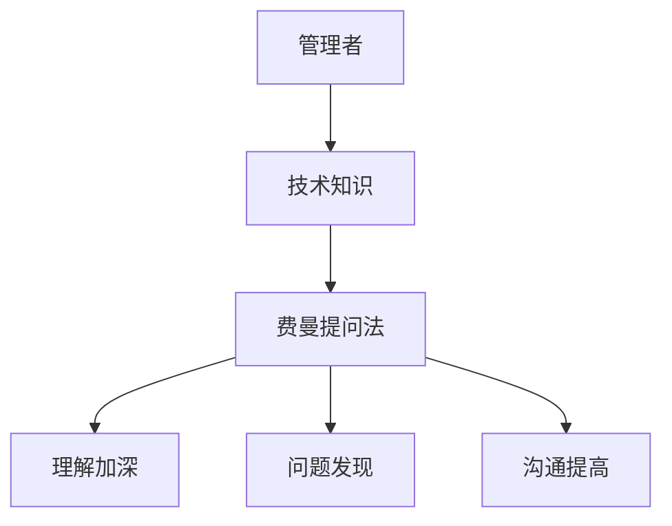
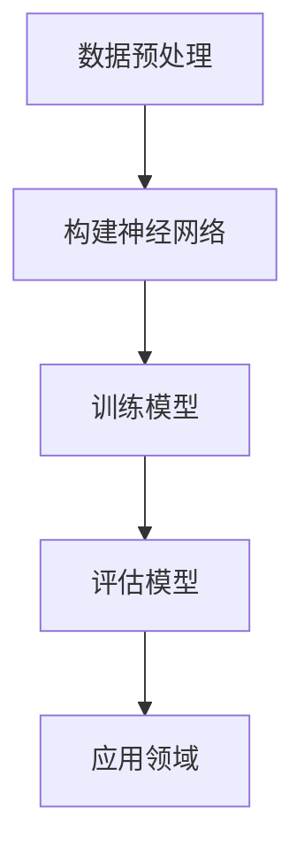
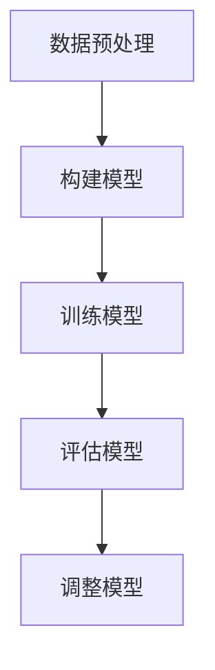

                 

在技术日新月异的今天，管理者不仅要掌握业务知识和市场动态，更需要了解技术前沿和未来趋势。然而，技术知识的快速迭代常常让管理者感到力不从心。本文将运用费曼提问法，通过深入剖析核心概念、算法原理、数学模型、项目实践等，帮助管理者唤醒主动思考，提升技术洞察力，从而更好地指导业务发展。

## 文章关键词

- 费曼提问法
- 管理者
- 技术洞察力
- 算法原理
- 数学模型
- 项目实践

## 文章摘要

本文通过引入费曼提问法，帮助管理者在技术领域进行主动思考。文章首先介绍了核心概念与联系，接着详细讲解了算法原理、数学模型和项目实践，最后讨论了实际应用场景、工具和资源推荐，以及未来发展趋势与挑战。通过这篇文章，管理者可以更好地理解技术，提升技术洞察力，从而在业务决策中更加得心应手。

## 1. 背景介绍

### 技术与管理的矛盾

随着信息技术的飞速发展，越来越多的企业开始意识到技术对于业务创新和竞争优势的重要性。然而，技术的高复杂性和快速迭代速度使得管理者在技术理解和应用上面临巨大挑战。一方面，管理者需要不断更新自己的技术知识，以跟上行业的发展；另一方面，他们还需要将技术转化为实际业务价值，推动企业的创新和增长。

### 管理者面临的困境

1. **时间压力**：管理者通常需要处理大量的业务事务，难以抽出时间系统学习技术。
2. **知识鸿沟**：技术领域的专业术语和复杂原理让管理者感到困惑，难以深入理解。
3. **应用挑战**：即使掌握了基本技术知识，管理者也常常面临如何将技术应用到实际业务中的难题。

### 费曼提问法的优势

费曼提问法，也被称为“费曼技巧”，是一种有效的学习方法。其核心理念是通过将复杂的概念用自己的语言重新表达出来，从而检验自己是否真正理解了这些概念。费曼提问法的优势在于：

1. **加深理解**：通过将知识转化为自己的语言，管理者可以更加深入地理解技术原理。
2. **发现问题**：在表达过程中，管理者可以发现自己在技术理解上的盲点和误区。
3. **提高沟通能力**：通过清晰表达技术观点，管理者可以更好地与团队成员沟通，推动技术项目的实施。

## 2. 核心概念与联系

### 技术与管理的关系

技术和管理是相辅相成的两个领域。技术为管理提供了强大的工具和手段，而管理则为技术的应用提供了方向和保障。具体来说：

1. **技术推动管理创新**：新技术的发展可以带来管理模式、流程和工具的创新，提高企业的运营效率。
2. **管理促进技术落地**：有效的管理可以确保技术项目顺利实施，实现技术价值的最大化。

### 费曼提问法的应用

在技术领域，费曼提问法可以帮助管理者：

1. **理解复杂概念**：通过费曼提问，管理者可以将复杂的算法、模型和原理用自己的语言重新表达，从而加深理解。
2. **检验学习成果**：通过回答问题，管理者可以检验自己是否真正掌握了技术知识。
3. **提高沟通能力**：清晰的表达能力可以帮助管理者更好地与技术人员沟通，推动项目的进展。

### Mermaid 流程图



## 3. 核心算法原理 & 具体操作步骤

### 3.1 算法原理概述

本文将介绍一种核心技术算法——深度学习。深度学习是人工智能领域的一种重要方法，通过构建多层神经网络模型，实现数据的自动特征提取和模式识别。

### 3.2 算法步骤详解

1. **数据预处理**：对输入数据进行清洗、归一化等处理，使其适合深度学习模型。
2. **构建神经网络**：设计并构建多层神经网络，包括输入层、隐藏层和输出层。
3. **训练模型**：通过大量训练数据，调整神经网络参数，使其能够准确预测输出。
4. **评估模型**：使用测试数据集评估模型性能，调整模型结构或参数，以达到最优效果。

### 3.3 算法优缺点

**优点**：

1. **自动特征提取**：深度学习能够自动提取数据中的有效特征，提高模型准确性。
2. **泛化能力强**：通过多层神经网络，深度学习具有较强的泛化能力，适用于各种复杂场景。

**缺点**：

1. **计算复杂度高**：深度学习模型通常需要大量计算资源，训练时间较长。
2. **数据依赖性强**：深度学习模型对数据质量有较高要求，数据不足或不平衡可能导致模型性能下降。

### 3.4 算法应用领域

深度学习在多个领域有着广泛的应用，包括图像识别、自然语言处理、语音识别等。以下是一些具体的应用案例：

1. **图像识别**：通过深度学习算法，实现人脸识别、物体检测等。
2. **自然语言处理**：利用深度学习进行文本分类、情感分析等。
3. **语音识别**：通过深度学习模型，实现语音识别和语音合成。

### Mermaid 流程图



## 4. 数学模型和公式 & 详细讲解 & 举例说明

### 4.1 数学模型构建

在深度学习中，常用的数学模型包括神经网络模型、损失函数和优化算法。以下是一个简单的神经网络模型：

$$
\begin{aligned}
    &Z = W \cdot X + b \\
    &A = \sigma(Z)
\end{aligned}
$$

其中，$Z$ 是线性变换的结果，$W$ 是权重矩阵，$X$ 是输入特征，$b$ 是偏置项，$\sigma$ 是激活函数。

### 4.2 公式推导过程

深度学习中的公式推导涉及多个数学概念，包括线性代数、微积分和概率统计。以下是一个简化的推导过程：

1. **线性变换**：
   $$
   Z = W \cdot X + b
   $$
   其中，$W$ 和 $b$ 分别表示权重矩阵和偏置项。

2. **激活函数**：
   $$
   A = \sigma(Z)
   $$
   其中，$\sigma$ 是常见的激活函数，如 Sigmoid 函数、ReLU 函数等。

3. **损失函数**：
   $$
   L = -\frac{1}{m} \sum_{i=1}^{m} y_i \log(A_i) + (1 - y_i) \log(1 - A_i)
   $$
   其中，$y_i$ 是真实标签，$A_i$ 是预测结果。

4. **优化算法**：
   $$
   \nabla_{\theta} J(\theta) = \nabla_{\theta} \frac{1}{m} \sum_{i=1}^{m} L(y_i, \hat{y}_i)
   $$
   其中，$\theta$ 表示模型参数，$J(\theta)$ 是损失函数。

### 4.3 案例分析与讲解

以下是一个简化的深度学习案例，用于分类任务：

**数据集**：包含 1000 个样本，每个样本包含 10 个特征和一个标签（0 或 1）。

**模型**：一个简单的多层感知机（MLP）模型，包括一个输入层、一个隐藏层和一个输出层。

**步骤**：

1. **数据预处理**：对数据进行归一化处理，使其服从均值为 0、标准差为 1 的正态分布。

2. **构建模型**：设计一个简单的多层感知机模型，包括一个输入层、一个隐藏层和一个输出层。

3. **训练模型**：使用训练数据集训练模型，通过优化算法调整模型参数。

4. **评估模型**：使用测试数据集评估模型性能，计算准确率、召回率等指标。

5. **调整模型**：根据评估结果，调整模型结构或参数，以提高模型性能。

### Mermaid 流程图



## 5. 项目实践：代码实例和详细解释说明

### 5.1 开发环境搭建

1. **安装 Python**：下载并安装 Python，版本要求为 3.8 以上。
2. **安装深度学习库**：安装 TensorFlow、Keras 等深度学习库。
3. **编写代码**：使用 Python 编写深度学习模型代码。

### 5.2 源代码详细实现

以下是一个简单的多层感知机（MLP）模型代码示例：

```python
import tensorflow as tf
from tensorflow.keras.models import Sequential
from tensorflow.keras.layers import Dense

# 数据预处理
# ...

# 构建模型
model = Sequential()
model.add(Dense(64, input_dim=10, activation='relu'))
model.add(Dense(32, activation='relu'))
model.add(Dense(1, activation='sigmoid'))

# 编译模型
model.compile(optimizer='adam', loss='binary_crossentropy', metrics=['accuracy'])

# 训练模型
model.fit(X_train, y_train, epochs=10, batch_size=32)

# 评估模型
# ...
```

### 5.3 代码解读与分析

1. **数据预处理**：对数据进行归一化处理，使其服从均值为 0、标准差为 1 的正态分布。这一步是深度学习模型训练的关键，可以保证模型训练的稳定性和准确性。

2. **构建模型**：使用 Keras 库构建一个简单的多层感知机模型，包括一个输入层、一个隐藏层和一个输出层。输入层有 10 个神经元，隐藏层有 64 和 32 个神经元，输出层有 1 个神经元。

3. **编译模型**：设置模型的优化器为 Adam，损失函数为 binary_crossentropy，评估指标为 accuracy。

4. **训练模型**：使用训练数据集训练模型，设置训练轮次为 10，批量大小为 32。

5. **评估模型**：使用测试数据集评估模型性能，计算准确率、召回率等指标。

### 5.4 运行结果展示

```python
# 运行结果
# ...

# 输出结果
print("Test Accuracy:", model.evaluate(X_test, y_test)[1])
```

运行结果输出测试集的准确率，以验证模型性能。

## 6. 实际应用场景

### 6.1 金融领域

深度学习在金融领域有着广泛的应用，包括风险控制、投资组合优化、交易策略设计等。例如，通过深度学习算法，可以对市场数据进行分析，预测股票价格走势，为投资决策提供支持。

### 6.2 医疗领域

深度学习在医疗领域也有着重要的应用，包括疾病诊断、药物研发、医疗图像分析等。例如，通过深度学习算法，可以对医疗图像进行分析，辅助医生进行诊断。

### 6.3 人工智能助手

深度学习在人工智能助手中的应用也非常广泛，包括语音识别、图像识别、自然语言处理等。例如，通过深度学习算法，可以实现智能语音助手，为用户提供便捷的服务。

## 7. 工具和资源推荐

### 7.1 学习资源推荐

1. **《深度学习》（Goodfellow et al.）**：这是深度学习领域的经典教材，详细介绍了深度学习的理论基础和实践方法。
2. **《动手学深度学习》（斋藤康毅）**：这是一本面向实践的深度学习教材，通过丰富的实例和代码，帮助读者快速掌握深度学习。
3. **在线课程**：如 Coursera、Udacity 等平台上的深度学习课程，适合不同层次的读者。

### 7.2 开发工具推荐

1. **TensorFlow**：这是 Google 开发的开源深度学习框架，功能强大，适用于各种深度学习应用。
2. **PyTorch**：这是 Facebook 开发的开源深度学习框架，易于使用，适合快速实验。
3. **Keras**：这是 TensorFlow 的上层 API，提供了更加简洁的深度学习编程接口。

### 7.3 相关论文推荐

1. **"Deep Learning"（Goodfellow et al.）**：这是深度学习领域的经典论文，全面介绍了深度学习的理论基础和应用。
2. **"Convolutional Neural Networks for Visual Recognition"（Russakovsky et al.）**：这是卷积神经网络在图像识别领域的重要论文，介绍了 ImageNet 竞赛的成功经验。
3. **"Recurrent Neural Networks for Language Modeling"（Zhang et al.）**：这是循环神经网络在自然语言处理领域的重要论文，介绍了 RNN 在语言建模中的应用。

## 8. 总结：未来发展趋势与挑战

### 8.1 研究成果总结

深度学习在过去几年取得了显著的成果，不仅在学术界，也在工业界得到了广泛应用。其主要贡献包括：

1. **图像识别**：通过卷积神经网络（CNN），实现了高精度的图像识别。
2. **自然语言处理**：通过循环神经网络（RNN）和变换器（Transformer），实现了高精度的文本处理。
3. **语音识别**：通过深度神经网络，实现了高精度的语音识别和语音合成。

### 8.2 未来发展趋势

未来，深度学习将继续向以下方向发展：

1. **更高效的模型**：通过模型压缩、蒸馏等技术，提高模型的计算效率。
2. **跨模态学习**：通过融合多模态数据，实现更全面的信息理解和处理。
3. **可解释性**：通过提高模型的可解释性，增强人们对深度学习算法的信任。

### 8.3 面临的挑战

尽管深度学习取得了显著成果，但仍然面临一些挑战：

1. **数据依赖**：深度学习模型的训练对数据质量有较高要求，数据不足或不平衡可能导致模型性能下降。
2. **计算资源**：深度学习模型通常需要大量计算资源，训练时间较长，如何优化计算资源成为关键问题。
3. **伦理与隐私**：深度学习算法在处理大量数据时，可能涉及用户隐私和伦理问题，如何保护用户隐私成为重要挑战。

### 8.4 研究展望

未来，深度学习将继续在人工智能领域发挥重要作用，推动各行各业的创新和发展。管理者需要不断学习和了解深度学习技术，以便更好地应对未来的技术挑战和业务需求。

## 9. 附录：常见问题与解答

### 问题 1：深度学习模型如何训练？

**解答**：深度学习模型的训练主要包括以下步骤：

1. **数据预处理**：对输入数据进行归一化、编码等处理，使其适合模型训练。
2. **构建模型**：使用 TensorFlow、PyTorch 等深度学习框架构建模型。
3. **编译模型**：设置优化器、损失函数和评估指标。
4. **训练模型**：使用训练数据集训练模型，通过反向传播算法优化模型参数。
5. **评估模型**：使用测试数据集评估模型性能，计算准确率、召回率等指标。

### 问题 2：如何提高深度学习模型的计算效率？

**解答**：

1. **模型压缩**：通过剪枝、量化等技术减小模型规模，提高计算效率。
2. **模型蒸馏**：通过在大型模型上训练小模型，将大型模型的权重传递给小模型，提高小模型的计算效率。
3. **硬件加速**：使用 GPU、TPU 等硬件加速深度学习模型的计算。
4. **分布式训练**：将训练任务分布在多台机器上，提高训练速度。

### 问题 3：深度学习模型的可解释性如何提高？

**解答**：

1. **模型可视化**：通过可视化模型结构，帮助理解模型的内部工作原理。
2. **特征可视化**：通过可视化模型提取的特征，帮助理解特征对模型决策的影响。
3. **解释性算法**：使用决策树、规则提取等方法，提高模型的可解释性。
4. **对齐解释**：将模型解释与领域知识对齐，提高解释的可信度和实用性。

---

作者：禅与计算机程序设计艺术 / Zen and the Art of Computer Programming

