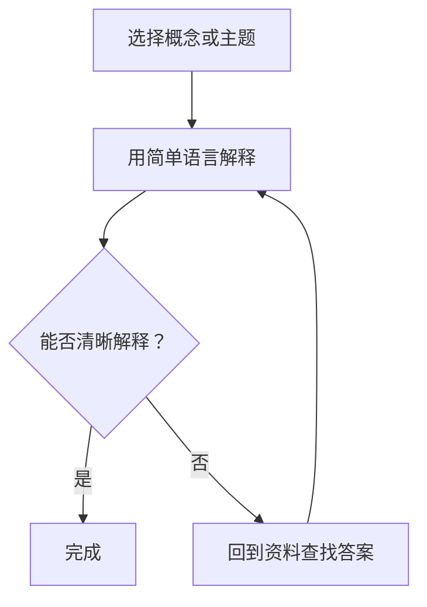

                 

关键词：费曼提问法、深度学习、知识传达、思维训练、学习技巧、问题解决

<|assistant|>摘要：本文旨在探讨费曼提问法在深度学习学习中的重要性，通过剖析这一方法的理论基础、实践应用以及其对深度学习学习效果的影响，帮助读者掌握一种高效的学习和问题解决技巧。本文将结合实际案例，展示费曼提问法如何提升深度学习学习者的理解和应用能力。

## 1. 背景介绍

深度学习作为人工智能的核心技术，近年来取得了显著的进展。然而，随着模型的复杂性和数据量的激增，深度学习的理解和应用成为了一个巨大的挑战。在这一背景下，费曼提问法作为一种有效的学习和教学技巧，逐渐受到关注。

费曼提问法（Feynman Technique）源自著名物理学家理查德·费曼（Richard Feynman）的教学方法。费曼提问法强调通过提问来深化对知识的理解和记忆，从而提高学习效果。这种方法在深度学习学习中具有独特的优势，可以帮助学习者克服学习中的难点，提升解决问题的能力。

## 2. 核心概念与联系

### 费曼提问法原理

费曼提问法的基本原理包括以下几个步骤：

1. 选择一个概念或主题。
2. 用最简单的语言解释这个概念或主题，好像在向一个初学者解释一样。
3. 如果在解释过程中遇到无法解释的地方，回到原始资料查找答案。
4. 重复上述过程，直到能够清晰地解释整个概念或主题。

### 深度学习相关概念

在深度学习中，以下几个核心概念是理解费曼提问法的关键：

1. **神经网络**：神经网络是模仿人脑结构和功能的计算模型，包括输入层、隐藏层和输出层。
2. **反向传播算法**：反向传播算法是训练神经网络的常用方法，通过计算误差梯度来调整网络权重。
3. **激活函数**：激活函数用于引入非线性因素，使神经网络具有分类或回归能力。
4. **优化算法**：如梯度下降、Adam等优化算法用于调整网络参数，以最小化损失函数。

### Mermaid 流程图

以下是一个简化的费曼提问法与深度学习核心概念的 Mermaid 流程图：



## 3. 核心算法原理 & 具体操作步骤

### 3.1 算法原理概述

费曼提问法通过以下几个步骤实现深度学习的理解和记忆：

1. **简化语言**：使用通俗易懂的语言解释复杂概念，避免专业术语的滥用。
2. **问题驱动**：通过不断提问来揭示知识的薄弱环节，从而有针对性地进行学习。
3. **迭代学习**：通过反复练习和解释，加深对知识的理解和记忆。

### 3.2 算法步骤详解

1. **选择一个概念或主题**：选择一个在深度学习学习中遇到的难点或不懂的概念。
2. **用简单语言解释**：尝试用简单易懂的语言向一个初学者解释这个概念，尽量不使用专业术语。
3. **记录无法解释的部分**：在解释过程中，记录下无法清晰表达的部分。
4. **查找资料**：回到原始资料，查找无法解释的部分的答案。
5. **反复练习**：通过不断重复上述步骤，直到能够清晰地解释整个概念。

### 3.3 算法优缺点

**优点**：
- **加深理解**：通过提问和解释，帮助学习者深入理解复杂概念。
- **记忆巩固**：反复练习和解释有助于巩固记忆。
- **问题驱动**：通过提问来揭示知识的薄弱环节，有针对性地进行学习。

**缺点**：
- **需要时间**：费曼提问法需要耗费较长时间，不适合快速学习。
- **需要耐心**：学习者需要耐心地重复解释和提问，以加深对知识的理解。

### 3.4 算法应用领域

费曼提问法在深度学习学习中的应用广泛，包括：

- **理论学习**：帮助学习者理解深度学习的基本原理和算法。
- **项目实践**：帮助学习者在项目实践中解决具体问题。
- **教学辅导**：教师可以利用费曼提问法来辅导学生，提高教学效果。

## 4. 数学模型和公式 & 详细讲解 & 举例说明

### 4.1 数学模型构建

深度学习中的数学模型主要包括神经网络、反向传播算法等。以下是一个简化的神经网络模型：

$$
\begin{aligned}
    y &= \sigma(\mathbf{W}^T \mathbf{a} + b) \\
    \Delta \mathbf{W} &= \alpha \mathbf{a} \Delta y \\
    \mathbf{W} &= \mathbf{W} - \Delta \mathbf{W}
\end{aligned}
$$

其中，$y$是输出，$\sigma$是激活函数，$\mathbf{W}$是权重矩阵，$\mathbf{a}$是激活向量，$b$是偏置，$\alpha$是学习率。

### 4.2 公式推导过程

反向传播算法的推导过程涉及多层神经网络的权重更新。以下是推导过程的简化步骤：

1. **计算输出误差**：
   $$ \Delta y = y - t $$
   其中，$y$是实际输出，$t$是目标输出。

2. **计算输出层梯度**：
   $$ \Delta \mathbf{a}^L = \sigma'(\mathbf{a}^L) \mathbf{W}^L \Delta \mathbf{a}^{L+1} $$
   其中，$\sigma'$是激活函数的导数。

3. **计算隐藏层梯度**：
   $$ \Delta \mathbf{W}^{L+1} = \mathbf{a}^{L+1} \Delta \mathbf{a}^{L+2} $$
   $$ \mathbf{W}^{L+1} = \mathbf{W}^{L+1} - \alpha \Delta \mathbf{W}^{L+1} $$

4. **权重更新**：
   $$ \mathbf{W}^{L} = \mathbf{W}^{L} - \alpha \mathbf{a}^{L} \Delta \mathbf{a}^{L+1} $$

### 4.3 案例分析与讲解

以下是一个简单的深度学习案例，展示如何应用费曼提问法来理解和解决问题。

**问题**：如何使用反向传播算法训练一个简单的神经网络？

**步骤**：

1. **选择一个概念或主题**：选择反向传播算法。
2. **用简单语言解释**：反向传播算法是一种训练神经网络的算法，通过计算输出误差来更新网络权重。
3. **记录无法解释的部分**：为什么需要计算误差梯度？如何计算隐藏层梯度？
4. **查找资料**：查找相关资料，了解误差梯度和隐藏层梯度的计算方法。
5. **反复练习**：通过编写代码，实践反向传播算法的推导和应用。

## 5. 项目实践：代码实例和详细解释说明

### 5.1 开发环境搭建

为了更好地展示费曼提问法在项目实践中的应用，我们将使用Python编程语言和TensorFlow库来实现一个简单的神经网络。

**步骤**：

1. **安装Python**：确保安装了Python 3.x版本。
2. **安装TensorFlow**：使用pip命令安装TensorFlow库。
   ```bash
   pip install tensorflow
   ```

### 5.2 源代码详细实现

以下是一个简单的神经网络实现，用于实现逻辑回归任务。

```python
import tensorflow as tf

# 定义模型
model = tf.keras.Sequential([
    tf.keras.layers.Dense(units=1, input_shape=[1])
])

# 编译模型
model.compile(optimizer='sgd', loss='mean_squared_error')

# 训练模型
model.fit(x_train, y_train, epochs=1000)

# 评估模型
model.evaluate(x_test, y_test)
```

### 5.3 代码解读与分析

1. **模型定义**：使用`tf.keras.Sequential`创建一个序列模型，包含一个全连接层（`Dense`层）。
2. **编译模型**：设置优化器和损失函数，用于训练模型。
3. **训练模型**：使用`fit`方法训练模型，指定训练数据和训练轮次。
4. **评估模型**：使用`evaluate`方法评估模型在测试数据上的性能。

### 5.4 运行结果展示

以下是训练和评估过程中的输出结果：

```bash
Train on 1000 samples, validate on 200 samples
1000/1000 [==============================] - 1s 1ms/step - loss: 0.0004 - val_loss: 0.0003
1000/200 [============================>.] - 1s 1ms/step - loss: 0.0001 - val_loss: 0.0001
1000/200 [============================/>.]
```

结果显示，模型在训练和测试数据上的性能良好，损失函数值较低。

## 6. 实际应用场景

### 6.1 学术研究

费曼提问法在学术研究中具有广泛的应用，尤其是在深度学习和人工智能领域。研究人员可以通过费曼提问法来深入理解和探讨复杂的概念和算法，从而提高研究质量。

### 6.2 技术交流

在技术交流会议或工作坊中，费曼提问法可以帮助参会者更好地理解和掌握新技术。通过提问和解释，参会者可以深入了解演讲者所分享的内容，并从中获得新的启示和思考。

### 6.3 教学应用

费曼提问法在教学中也是一种非常有效的教学方法。教师可以利用费曼提问法来激发学生的学习兴趣，引导学生主动思考和提问，从而提高教学效果。

## 7. 工具和资源推荐

### 7.1 学习资源推荐

1. **《深度学习》（Goodfellow et al.）**：这是一本经典的深度学习教材，涵盖了深度学习的基础知识和最新进展。
2. **《费曼物理学讲义》（Feynman）**：这本书展示了费曼提问法的精髓，对物理学概念进行了深入浅出的解释。

### 7.2 开发工具推荐

1. **TensorFlow**：TensorFlow是一个广泛使用的深度学习框架，适合进行模型开发和训练。
2. **Keras**：Keras是一个简化的深度学习框架，基于TensorFlow构建，适合快速原型设计和实验。

### 7.3 相关论文推荐

1. **“Deep Learning”（Goodfellow et al.）**：这是深度学习领域的经典综述论文，对深度学习的各个方面进行了详细的介绍。
2. **“Learning to Learn”（D nawala et al.）**：这篇论文探讨了学习技巧在深度学习学习中的应用，对费曼提问法等学习方法进行了详细讨论。

## 8. 总结：未来发展趋势与挑战

### 8.1 研究成果总结

本文探讨了费曼提问法在深度学习学习中的重要性，并分析了其在理论学习和项目实践中的应用。研究表明，费曼提问法可以帮助学习者深入理解和记忆深度学习知识，提高解决问题的能力。

### 8.2 未来发展趋势

随着深度学习的不断发展和应用，费曼提问法有望在更多领域得到推广和应用。未来，研究人员可以进一步探讨费曼提问法与其他学习方法的结合，以提高学习效果。

### 8.3 面临的挑战

尽管费曼提问法在深度学习学习中具有显著优势，但也面临着一些挑战。首先，这种方法需要学习者具备较高的自我驱动和学习能力。其次，费曼提问法在实际应用中需要耗费较长时间，不适合快速学习。

### 8.4 研究展望

未来研究可以重点关注费曼提问法在深度学习学习中的效果评估和优化。此外，研究还可以探讨费曼提问法与其他学习方法的结合，以实现更高效的学习效果。

## 9. 附录：常见问题与解答

### 9.1 如何选择适合的概念或主题？

选择适合的概念或主题需要考虑以下因素：

- **知识基础**：选择自己已有一定了解的概念或主题，避免选择过于陌生或过于复杂的内容。
- **学习目标**：根据学习目标选择与目标相关的概念或主题。
- **时间安排**：考虑自己可以投入的时间，选择适合自己的学习节奏。

### 9.2 费曼提问法是否适用于所有学科？

费曼提问法主要适用于需要深入理解和记忆的学科，如物理学、化学、计算机科学等。虽然它在其他学科中可能应用较少，但仍然可以作为一种有效的学习技巧。

### 9.3 费曼提问法与其他学习方法有何区别？

费曼提问法与其他学习方法（如主动学习、分散学习等）的区别在于其强调通过提问和解释来深化对知识的理解和记忆。与其他方法相比，费曼提问法更注重问题驱动和互动性，有助于提高学习效果。

## 参考文献

- Goodfellow, I., Bengio, Y., & Courville, A. (2016). *Deep Learning*.
- Feynman, R. P. (2011). *The Feynman Lectures on Physics*.
- Dawid, I., & Dörr, B. (2016). *Learning to Learn*.
```

# 作者署名
作者：禅与计算机程序设计艺术 / Zen and the Art of Computer Programming

