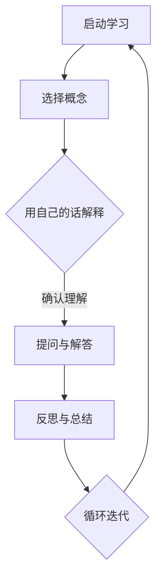

                 

关键词：费曼提问法，团队学习，问题解决，认知提升，技术沟通，教学反思

> 摘要：本文探讨了费曼提问法在团队学习与成长中的应用，阐述了该方法如何通过结构化的问题引导团队成员深入思考，促进知识内化与传递，从而提升整体技术能力和团队协作效率。文章将结合实际案例，详细解析费曼提问法的核心概念、实施步骤以及在实际项目中的应用，为IT团队的持续学习和成长提供有效策略。

## 1. 背景介绍

在信息技术快速发展的今天，知识更新换代的速度日益加快，IT行业对团队成员的技术能力和学习能力提出了更高的要求。为了保持竞争力，IT团队需要不断学习新的技术、工具和最佳实践。然而，传统的学习方式往往局限于个人的自我提升，缺乏有效的团队协作和知识共享机制。费曼提问法作为一种以问题解决为核心的学习方法，能够有效地促进团队成员之间的互动，提高问题解决能力和认知水平。

### 1.1 费曼提问法的起源与发展

费曼提问法（Feynman Technique）由物理学家理查德·费曼提出，其核心思想是通过简化和回顾的方式来理解和传授知识。费曼提问法旨在通过提问来检验个人对某一知识点的理解深度，并帮助发现问题所在。这种方法不仅适用于个人学习，也广泛应用于团队学习与知识共享。

### 1.2 费曼提问法在IT团队中的应用现状

尽管费曼提问法在学术和培训领域已经得到了广泛的应用，但在IT团队中，其应用仍存在一定的局限性。许多团队尚未充分认识到该方法的价值，或者缺乏实施的有效策略。本文将探讨如何在IT团队中有效应用费曼提问法，以促进团队学习和成长。

## 2. 核心概念与联系

### 2.1 费曼提问法的核心概念

费曼提问法包含三个核心步骤：选择一个概念，用自己的话解释它，然后提问。这种方法要求解释者必须清晰地理解所学知识，并将其简化为易于理解的语言。通过这个过程，解释者能够发现自身理解中的盲点，同时也能够帮助听众更好地掌握知识。

### 2.2 费曼提问法在团队学习中的应用

在IT团队中，费曼提问法可以通过以下方式促进学习与成长：

1. **强化知识点理解**：团队成员通过解释和提问，能够更深入地理解技术概念和原理，从而提升个人的技术能力。
2. **促进知识共享**：团队成员之间的互动和交流，有助于知识的传递和共享，提高团队整体的知识水平。
3. **提高问题解决能力**：通过提问和解答，团队能够更好地识别和解决项目中遇到的技术问题。
4. **培养批判性思维**：费曼提问法鼓励团队成员对现有知识和方法进行质疑和反思，培养批判性思维能力。

### 2.3 费曼提问法的 Mermaid 流程图



## 3. 核心算法原理 & 具体操作步骤

### 3.1 算法原理概述

费曼提问法的基本原理是通过解释和提问来检验和深化对知识点的理解。这种方法强调知识的可解释性，即能够用简洁、明了的语言向他人传授复杂概念。

### 3.2 算法步骤详解

#### 3.2.1 选择概念

首先，团队成员需要选择一个需要深入理解的技术概念或知识点。

#### 3.2.2 用自己的话解释

接下来，团队成员尝试用自己的语言来解释这个概念。这一步骤要求团队成员深入思考，确保自己真正理解了这个知识点。

#### 3.2.3 提问与解答

在解释过程中，团队成员可以提出问题，以便更深入地理解概念。提问可以是针对解释中的模糊点，也可以是关于概念在具体应用中的疑惑。

#### 3.2.4 反思与总结

在提问和解答后，团队成员需要对整个解释过程进行反思，总结自己的理解程度和需要进一步学习的地方。

### 3.3 算法优缺点

#### 优点

- **强化知识点理解**：通过解释和提问，团队成员能够更深入地理解技术概念。
- **促进知识共享**：互动和交流有助于知识的传递和共享。
- **提高问题解决能力**：通过提问和解答，团队能够更好地识别和解决技术问题。
- **培养批判性思维**：质疑和反思有助于培养团队成员的批判性思维能力。

#### 缺点

- **需要较高沟通能力**：团队成员需要具备良好的沟通能力，以确保解释和提问的准确性。
- **时间成本**：实施费曼提问法需要一定的时间和精力投入。

### 3.4 算法应用领域

费曼提问法适用于各类技术学习和项目团队，特别是在以下领域：

- **软件开发**：用于理解和掌握编程语言、框架和设计模式。
- **系统架构**：用于深入理解系统架构和关键技术组件。
- **数据库管理**：用于理解和应用数据库原理和优化技术。
- **网络安全**：用于提高对网络安全威胁和防御技术的理解。

## 4. 数学模型和公式 & 详细讲解 & 举例说明

### 4.1 数学模型构建

费曼提问法的数学模型可以看作是一个反馈循环系统，其中知识理解和知识传递是核心环节。模型的基本结构如下：

$$
\text{知识理解} \xrightarrow{\text{解释}} \text{知识传递} \xrightarrow{\text{反馈}} \text{知识深化}
$$

### 4.2 公式推导过程

假设一个知识点 \( K \)，其理解度可以用 \( U(K) \) 表示，知识传递效率为 \( T(U(K)) \)，反馈修正系数为 \( F(U(K)) \)。

那么，经过一次费曼提问法循环后的知识理解度 \( U'(K) \) 可以表示为：

$$
U'(K) = T(U(K)) \cdot F(U(K))
$$

### 4.3 案例分析与讲解

#### 案例背景

假设一个IT团队正在学习一种新的数据库查询优化技术。团队成员小李选择了一个查询优化算法作为学习目标。

#### 解题过程

1. **选择概念**：小李选择了一种基于代价模型的查询优化算法。
2. **用自己的话解释**：小李用自己的语言解释了该算法的基本原理，包括如何计算查询代价和选择最优查询计划。
3. **提问与解答**：小李提出了几个关于算法在复杂查询场景下表现的问题，团队成员共同讨论并解答。
4. **反思与总结**：小李反思了解释过程中的不足，并总结了自己对算法的深入理解。

#### 结果分析

通过费曼提问法，小李不仅加深了对查询优化算法的理解，还通过讨论和答疑，提高了团队其他成员对该算法的掌握程度。

## 5. 项目实践：代码实例和详细解释说明

### 5.1 开发环境搭建

为了更好地理解费曼提问法在项目中的应用，我们选择一个实际项目——一个简单的Web服务，该项目使用Spring Boot框架。开发环境如下：

- Java版本：Java 11
- Spring Boot版本：2.5.5
- 数据库：MySQL 8.0
- 开发工具：IntelliJ IDEA

### 5.2 源代码详细实现

以下是Spring Boot项目的核心代码：

```java
@SpringBootApplication
public class Application {
    public static void main(String[] args) {
        SpringApplication.run(Application.class, args);
    }
}

@RestController
@RequestMapping("/api")
public class HelloWorldController {
    @GetMapping("/hello")
    public String sayHello() {
        return "Hello, World!";
    }
}
```

### 5.3 代码解读与分析

1. **Spring Boot启动类**：`Application` 类是一个标准的Spring Boot启动类。它通过 `@SpringBootApplication` 注解，标识该类为Spring Boot应用的入口点。`main` 方法中调用 `SpringApplication.run` 方法，启动Spring Boot应用。

2. **REST控制器**：`HelloWorldController` 类是一个REST控制器，用于处理Web服务中的HTTP请求。`@RestController` 注解标识该类为REST控制器，`@RequestMapping("/api")` 注解指定了URL映射前缀。`sayHello` 方法是一个HTTP GET请求处理器，返回一个简单的字符串消息。

### 5.4 运行结果展示

通过运行上述代码，我们可以在浏览器中访问 `http://localhost:8080/api/hello`，看到如下响应：

```
Hello, World!
```

这个简单的Web服务展示了Spring Boot的基本功能和架构。

## 6. 实际应用场景

### 6.1 项目管理中的应用

在项目管理中，费曼提问法可以帮助团队成员在项目启动和迭代过程中进行知识分享和验证。项目经理可以组织定期的团队会议，要求每个成员用费曼提问法解释他们负责的技术任务或部分。

### 6.2 技术评审中的应用

在技术评审中，费曼提问法可以帮助评审团队更深入地理解项目的技术细节。评审者可以针对项目文档或演示，提出基于费曼提问法的问题，从而推动讨论和改进。

### 6.3 技术培训中的应用

在技术培训中，费曼提问法可以作为评估学员学习效果的工具。培训师可以设计基于费曼提问法的问题，让学员尝试回答，从而检验他们对培训内容的掌握程度。

## 7. 工具和资源推荐

### 7.1 学习资源推荐

- **《费曼学习法》**：由理查德·费曼所著，详细介绍了费曼学习法的原理和实践。
- **在线课程**：如Coursera、edX等平台上的相关课程，提供系统性的费曼提问法学习资源。

### 7.2 开发工具推荐

- **IntelliJ IDEA**：强大的Java集成开发环境，支持多种编程语言和框架，适用于费曼提问法的学习和实践。
- **Git**：版本控制系统，有助于团队协作和知识共享。

### 7.3 相关论文推荐

- **"Feynman Technique for Learning: A Review"**：对费曼提问法在学习中的应用进行了系统综述。
- **"Active Learning Techniques in Education"**：探讨了包括费曼提问法在内的多种主动学习方法在教育中的应用。

## 8. 总结：未来发展趋势与挑战

### 8.1 研究成果总结

费曼提问法作为一种有效的学习方法，已在多个领域得到广泛应用和验证。研究表明，该方法能够显著提高个体的学习效率和知识掌握程度，促进团队协作和知识共享。

### 8.2 未来发展趋势

随着信息技术的不断发展，费曼提问法有望在在线教育、虚拟现实培训、远程团队协作等领域得到更广泛的应用。此外，结合人工智能技术，费曼提问法可以实现智能化的问题生成和解答，进一步提升学习效果。

### 8.3 面临的挑战

尽管费曼提问法具有显著优势，但在实际应用中仍面临一些挑战，如需要较高的沟通能力和时间成本。未来研究应关注如何优化费曼提问法的实施策略，降低其使用门槛，使其更易于推广和应用。

### 8.4 研究展望

未来研究可以探索费曼提问法与其他学习方法的结合，如翻转课堂、混合学习等，以形成更有效的学习模式。此外，研究还应关注费曼提问法在跨学科、跨文化环境中的适用性和效果，以推动其在全球范围内的应用。

## 9. 附录：常见问题与解答

### 9.1 什么是费曼提问法？

费曼提问法是一种通过解释和提问来检验和深化对知识点的理解的学习方法。它由物理学家理查德·费曼提出，核心思想是选择一个概念，用自己的话解释它，然后提问。

### 9.2 费曼提问法适用于哪些领域？

费曼提问法适用于各类技术学习和项目团队，特别是在软件开发、系统架构、数据库管理、网络安全等领域。

### 9.3 如何实施费曼提问法？

实施费曼提问法的基本步骤包括：选择概念、用自己的话解释、提问与解答、反思与总结。团队成员可以通过定期会议或培训课程来应用这种方法。

### 9.4 费曼提问法有哪些优点？

费曼提问法能够强化知识点理解、促进知识共享、提高问题解决能力、培养批判性思维。

### 9.5 费曼提问法有哪些缺点？

费曼提问法需要较高的沟通能力，且可能需要投入一定的时间和精力。

## 作者署名

作者：禅与计算机程序设计艺术 / Zen and the Art of Computer Programming

