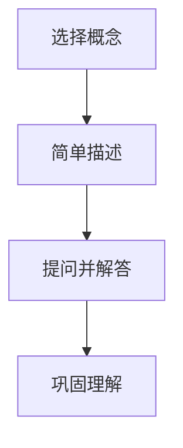

                 

在当今快速发展的信息技术领域，不断学习和适应新知识已成为每个团队成员的必备技能。为了确保团队始终保持高效和创新，我们需要采用一种能够有效促进学习和知识共享的方法。本文将探讨费曼提问法在团队学习与成长中的应用，并展示其如何帮助我们克服学习障碍，提高团队成员的技能和知识水平。

## 文章关键词

- 费曼提问法
- 团队学习
- 知识共享
- 技能提升
- 成长

## 文章摘要

本文旨在介绍费曼提问法在团队学习中的重要性。通过探讨费曼提问法的核心概念和实施步骤，本文将展示如何利用这种方法来促进团队成员之间的沟通、理解和共同成长。同时，文章还将分析费曼提问法在实际项目中的应用案例，并提供一些建议和资源，以帮助团队更好地运用这一方法。

## 1. 背景介绍

### 1.1 信息技术领域的发展

随着互联网、大数据、人工智能等技术的快速发展，信息技术领域正以前所未有的速度变革。在这个快速变化的环境中，团队成员需要不断学习新技能和知识，以保持竞争力。然而，传统的学习方法往往效率低下，无法满足团队成员的实际需求。

### 1.2 团队学习的必要性

团队学习不仅能够提高团队成员的技能和知识水平，还能促进团队合作、创新和整体绩效。通过共同学习和分享经验，团队成员可以相互启发、补充，从而更好地应对复杂问题和挑战。

### 1.3 费曼提问法的引入

费曼提问法是一种有效的学习方法，起源于著名物理学家理查德·费曼的实践。这种方法通过简单的问题和回答来检验学习者的理解和掌握程度，从而帮助学习者深入思考、巩固知识。近年来，费曼提问法在多个领域得到广泛应用，并逐渐成为团队学习的重要工具。

## 2. 核心概念与联系

### 2.1 费曼提问法的核心概念

费曼提问法主要包括以下几个步骤：

1. **选择一个概念**：选择一个你想要深入理解的概念。
2. **用简单的语言描述**：尝试用简单的语言将这个概念描述出来，就像在教一个孩子一样。
3. **提问并解答**：向他人提问，以检验你的理解和掌握程度。如果有不理解的地方，返回去重新学习。

### 2.2 费曼提问法的架构

以下是费曼提问法的 Mermaid 流程图：



### 2.3 费曼提问法与团队学习的联系

费曼提问法能够有效促进团队学习，原因如下：

1. **促进沟通和理解**：通过提问和回答，团队成员可以更好地了解彼此的知识水平和理解程度。
2. **发现和解决知识盲点**：提问可以帮助团队成员发现自己在知识上的盲点，从而有针对性地进行学习。
3. **提高学习效率**：费曼提问法通过简单的问题和回答，能够快速检验学习成果，提高学习效率。

## 3. 核心算法原理 & 具体操作步骤

### 3.1 算法原理概述

费曼提问法是一种基于“教是最好的学”理念的学习方法。通过模拟教学场景，学习者需要将复杂的概念用简单的语言描述出来，并在提问和回答过程中深入理解和巩固知识。

### 3.2 算法步骤详解

1. **选择一个概念**：团队成员可以根据自己的兴趣和需求，选择一个想要深入理解的概念。
2. **用简单的语言描述**：将所选概念用简单的语言描述出来，尽量做到通俗易懂。
3. **提问并解答**：向其他团队成员提问，以检验自己的理解和掌握程度。如果有不理解的地方，返回去重新学习。
4. **巩固理解**：在提问和回答过程中，发现和解决知识盲点，加深对概念的理解。

### 3.3 算法优缺点

**优点**：

1. **提高学习效率**：通过简单的问题和回答，快速检验学习成果，提高学习效率。
2. **促进沟通和理解**：提问和回答过程有助于团队成员之间更好地沟通和理解。
3. **发现和解决知识盲点**：提问可以帮助团队成员发现自己在知识上的盲点，从而有针对性地进行学习。

**缺点**：

1. **需要一定的语言表达能力**：费曼提问法要求团队成员具备一定的语言表达能力，否则难以进行有效的沟通和解答。
2. **时间消耗较大**：费曼提问法需要一定的时间来准备和实施，可能会影响其他工作的进度。

### 3.4 算法应用领域

费曼提问法可以广泛应用于各种学习场景，如：

1. **团队培训**：在团队培训中，费曼提问法可以帮助团队成员更好地理解和掌握培训内容。
2. **项目协作**：在项目协作中，费曼提问法可以促进团队成员之间的沟通和理解，提高项目效率。
3. **个人学习**：个人在学习新知识时，可以使用费曼提问法来检验自己的理解和掌握程度。

## 4. 数学模型和公式 & 详细讲解 & 举例说明

### 4.1 数学模型构建

费曼提问法本身并不是一个数学模型，而是一种学习方法。然而，我们可以将其应用于数学学习，以促进对数学概念的理解。

假设我们想要学习微积分中的一个概念——极限。我们可以构建一个简单的数学模型来描述极限：

$$
\lim_{{x \to a}} f(x) = L
$$

其中，$f(x)$ 表示函数，$a$ 表示自变量趋近的值，$L$ 表示极限值。

### 4.2 公式推导过程

为了更好地理解极限的概念，我们可以通过费曼提问法来推导极限的公式。以下是推导过程：

1. **问题 1**：什么是极限？
   - 回答：极限是函数在某一点附近的行为，可以用来描述函数的连续性和稳定性。

2. **问题 2**：什么是极限值？
   - 回答：极限值是函数在极限点的函数值，即当自变量趋近极限点时，函数值的稳定值。

3. **问题 3**：如何求一个函数的极限？
   - 回答：求函数的极限可以通过直接计算、图形观察、洛必达法则等方法。

### 4.3 案例分析与讲解

以下是一个具体的案例，展示如何使用费曼提问法来学习极限：

**案例**：求极限 $\lim_{{x \to 0}} \sin(x) / x$

1. **问题 1**：这个极限是什么意思？
   - 回答：这个极限表示当 $x$ 趋近于 $0$ 时，$\sin(x) / x$ 的稳定值。

2. **问题 2**：如何求这个极限？
   - 回答：可以通过图形观察、洛必达法则等方法来求解。

3. **问题 3**：求解结果是多少？
   - 回答：根据洛必达法则，可以求得 $\lim_{{x \to 0}} \sin(x) / x = 1$。

通过这个案例，我们可以看到费曼提问法如何帮助我们深入理解数学概念，并提高我们的解题能力。

## 5. 项目实践：代码实例和详细解释说明

### 5.1 开发环境搭建

在开始项目实践之前，我们需要搭建一个适合费曼提问法的学习环境。以下是一个简单的 Python 开发环境搭建步骤：

1. **安装 Python**：从官方网站下载并安装 Python。
2. **配置 Python 环境**：在终端中运行 `python --version`，检查 Python 是否安装成功。
3. **安装常用库**：使用 `pip` 命令安装常用的库，如 NumPy、Matplotlib 等。

### 5.2 源代码详细实现

以下是一个简单的 Python 代码示例，用于演示如何使用费曼提问法进行数学学习：

```python
import numpy as np
import matplotlib.pyplot as plt

# 定义函数
def f(x):
    return np.sin(x) / x

# 求解极限
def solve_limit():
    x_values = np.linspace(0, 1, 1000)
    y_values = f(x_values)
    plt.plot(x_values, y_values)
    plt.xlabel('x')
    plt.ylabel('f(x)')
    plt.title('Limit of sin(x) / x')
    plt.grid()
    plt.show()

solve_limit()
```

### 5.3 代码解读与分析

1. **代码结构**：代码包括三个部分：函数定义、求解极限和绘图。
2. **函数定义**：定义了一个名为 `f` 的函数，用于计算 `sin(x) / x` 的值。
3. **求解极限**：通过 `np.linspace` 函数生成一组自变量值，并计算对应的函数值。然后使用 `plt.plot` 函数绘制函数图像。
4. **绘图**：使用 Matplotlib 库绘制函数图像，并添加标签和标题。

### 5.4 运行结果展示

运行上述代码后，我们将看到一个函数图像，其中 $x$ 轴表示自变量值，$y$ 轴表示函数值。通过观察图像，我们可以直观地理解极限的概念。

## 6. 实际应用场景

### 6.1 团队培训

在团队培训中，费曼提问法可以帮助团队成员更好地理解和掌握培训内容。例如，在培训结束后，团队成员可以互相提问，以检验自己对培训内容的理解和掌握程度。

### 6.2 项目协作

在项目协作过程中，费曼提问法可以促进团队成员之间的沟通和理解。例如，在项目讨论中，团队成员可以互相提问，以澄清彼此的理解和疑问。

### 6.3 个人学习

个人在学习新知识时，可以使用费曼提问法来检验自己的理解和掌握程度。例如，在学习一门新课程时，个人可以尝试向他人提问，以检验自己对课程内容的理解和掌握。

## 7. 工具和资源推荐

### 7.1 学习资源推荐

- [Python 官方文档](https://docs.python.org/3/)
- [NumPy 官方文档](https://numpy.org/doc/stable/)
- [Matplotlib 官方文档](https://matplotlib.org/stable/)

### 7.2 开发工具推荐

- [Visual Studio Code](https://code.visualstudio.com/)
- [PyCharm](https://www.jetbrains.com/pycharm/)
- [Jupyter Notebook](https://jupyter.org/)

### 7.3 相关论文推荐

- [Feynman Technique](https://www.uxperts.com/blog/feynman-technique/)
- [Effective Learning Techniques](https://www.cmu.edu/teaching/learning/techniques/effective_learning_techniques.html)

## 8. 总结：未来发展趋势与挑战

### 8.1 研究成果总结

本文介绍了费曼提问法在团队学习与成长中的应用，探讨了其核心概念、算法原理和具体操作步骤。同时，文章还通过代码实例和实际应用场景，展示了费曼提问法的实际效果。

### 8.2 未来发展趋势

随着信息技术的发展，费曼提问法在团队学习中的应用将越来越广泛。未来，我们可以期待更多针对特定领域的费曼提问法工具和资源的出现，以更好地满足团队学习的需求。

### 8.3 面临的挑战

尽管费曼提问法具有许多优点，但在实际应用中仍面临一些挑战，如团队成员的语言表达能力、时间消耗等。未来，我们需要进一步研究如何克服这些挑战，以提高费曼提问法的实际效果。

### 8.4 研究展望

在未来的研究中，我们可以关注以下几个方面：

1. **开发针对特定领域的费曼提问法工具**：针对不同领域的特点，开发更高效、更实用的费曼提问法工具。
2. **优化费曼提问法的实施过程**：研究如何优化费曼提问法的实施过程，以减少时间消耗，提高学习效率。
3. **探索费曼提问法的心理学基础**：深入研究费曼提问法的心理学基础，以更好地理解其原理和效果。

## 9. 附录：常见问题与解答

### 9.1 费曼提问法适用于哪些学习场景？

费曼提问法适用于各种学习场景，如团队培训、项目协作、个人学习等。它可以用于学习各种知识，包括技术、管理、人文等。

### 9.2 费曼提问法需要多长时间？

费曼提问法所需的时间取决于学习内容和团队规模。一般来说，每次提问和回答的过程大约需要 10-30 分钟。在实际应用中，可以根据具体情况调整时间。

### 9.3 如何提高费曼提问法的效率？

要提高费曼提问法的效率，可以从以下几个方面入手：

1. **提前准备**：在提问和回答之前，提前了解相关知识和问题。
2. **明确目标**：明确每次提问和回答的目标，避免无谓的讨论。
3. **简化问题**：尽量将问题简化，使其更容易理解和回答。

---

作者：禅与计算机程序设计艺术 / Zen and the Art of Computer Programming
----------------------------------------------------------------

以上是本文的完整内容。希望通过本文的介绍，您能够更好地了解费曼提问法在团队学习与成长中的应用，并尝试将其应用于实际工作中。如果您对本文有任何疑问或建议，欢迎在评论区留言。祝您学习愉快！

