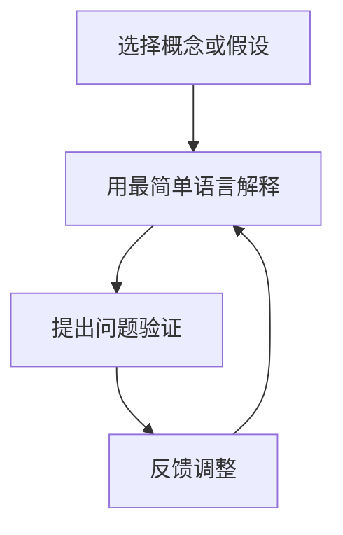

                 

### 1. 背景介绍

在快速变化和高不确定性的现代商业环境中，管理决策的重要性不言而喻。决策的质量往往直接决定了企业能否在竞争中脱颖而出。为了提高决策的科学性和有效性，各种方法和工具应运而生。其中，费曼提问法作为一种简单而强大的问题解决策略，逐渐被应用于管理决策中。

费曼提问法得名于著名的物理学家理查德·费曼，他是诺贝尔物理学奖得主，以其卓越的物理学研究和对科学思维的贡献而闻名。费曼提问法是一种基于简单性的思考方法，它通过不断提问和回答，帮助人们更清晰地理解复杂的问题。

在管理决策中，费曼提问法可以作为一种有力的工具，帮助决策者深入挖掘问题的本质，理清思路，避免决策过程中的认知偏差和盲目跟风。本文将探讨费曼提问法在管理决策中的应用，分析其原理和优势，并通过具体案例说明其实际操作过程。

### 2. 核心概念与联系

#### 费曼提问法原理

费曼提问法的核心在于将复杂的问题分解为简单的基本概念，并通过提问和回答来确保对问题的理解准确无误。具体来说，费曼提问法包括以下几个步骤：

1. **选择一个概念或假设**：确定一个你想要深入理解的概念或假设。
2. **用最简单的语言解释它**：尝试用最简单、最直接的语言来解释这个概念或假设，就像对一个孩子或外行人解释一样。
3. **提问和验证**：提出问题来验证你的解释是否正确，并检查是否涵盖了所有相关的方面。

#### 管理决策中的关联

将费曼提问法应用于管理决策，可以帮助决策者实现以下目标：

- **提高理解深度**：通过费曼提问法，决策者可以更深入地理解问题的本质，避免浅尝辄止。
- **避免认知偏差**：通过提问和回答，决策者可以检验自己的思维是否受到认知偏差的影响。
- **促进团队协作**：费曼提问法可以作为一种团队讨论的工具，促进团队成员之间的交流和共识。

#### Mermaid 流程图

下面是一个用 Mermaid 语言绘制的流程图，展示了费曼提问法的应用步骤：



### 3. 核心算法原理 & 具体操作步骤

#### 3.1 算法原理概述

费曼提问法的原理可以归结为以下几点：

- **简化问题**：通过将复杂问题分解为基本概念，降低问题的复杂性。
- **验证理解**：通过提问和回答，确保对问题的理解是准确和全面的。
- **促进思考**：通过不断地提问和回答，激发决策者的思考和创造力。

#### 3.2 算法步骤详解

1. **确定要解决的问题**：首先，明确你想要解决的管理问题或决策目标。
2. **分解问题**：将问题分解为一系列基本概念或假设。
3. **简单解释**：用最简单、最直接的语言解释每个基本概念或假设。
4. **提问验证**：针对每个概念或假设，提出问题并验证你的解释是否准确。
5. **反馈调整**：根据反馈调整你的解释，确保对问题的理解是准确和全面的。

#### 3.3 算法优缺点

**优点**：

- **简化问题**：通过分解复杂问题，使决策过程更加清晰和简洁。
- **提高理解深度**：通过提问和回答，确保对问题的理解是准确和全面的。
- **促进团队协作**：作为一种团队讨论的工具，费曼提问法可以促进团队成员之间的交流和共识。

**缺点**：

- **时间成本**：费曼提问法需要时间和精力，可能不适合紧急决策。
- **对解释能力要求高**：需要能够用简单、准确的语言解释复杂概念，这可能对决策者提出了较高的要求。

#### 3.4 算法应用领域

费曼提问法可以在多个管理决策领域中得到应用，例如：

- **战略规划**：通过分解和解释战略目标，确保对战略的理解是准确和全面的。
- **项目决策**：在项目决策过程中，通过提问和回答，确保对项目目标、风险和资源需求的理解是准确和全面的。
- **产品开发**：在产品开发过程中，通过提问和回答，确保对市场需求、技术可行性和用户价值的理解是准确和全面的。

### 4. 数学模型和公式 & 详细讲解 & 举例说明

#### 4.1 数学模型构建

在费曼提问法中，一个重要的数学模型是 **因果图模型**。因果图模型可以帮助我们理解不同因素之间的因果关系，从而更准确地分析和管理决策问题。

#### 4.2 公式推导过程

假设我们有一个决策问题，涉及到两个主要因素：**市场需求**和**生产成本**。我们可以使用以下公式来构建因果图模型：

\[ P(\text{市场需求}) = f(\text{市场趋势}, \text{竞争情况}) \]
\[ P(\text{生产成本}) = f(\text{原材料价格}, \text{生产效率}) \]

其中，\( f \) 表示函数关系。

#### 4.3 案例分析与讲解

假设一个公司想要开发一款新产品，需要进行市场调研和成本预算。我们可以使用费曼提问法来构建和验证这个因果图模型。

1. **选择概念或假设**：市场需求和生产成本。
2. **用最简单语言解释**：

   - 市场需求取决于市场趋势和竞争情况。
   - 生产成本取决于原材料价格和生产效率。

3. **提问验证**：

   - 市场趋势对市场需求的影响有多大？
   - 竞争情况对市场需求的影响有多大？
   - 原材料价格对生产成本的影响有多大？
   - 生产效率对生产成本的影响有多大？

4. **反馈调整**：根据反馈，我们可以调整模型，例如添加新的因素或修改现有因素之间的关系。

### 5. 项目实践：代码实例和详细解释说明

#### 5.1 开发环境搭建

为了演示费曼提问法在项目实践中的应用，我们将使用 Python 编写一个简单的决策支持系统。首先，我们需要安装 Python 和相关的库。

```shell
pip install numpy matplotlib
```

#### 5.2 源代码详细实现

下面是一个简单的 Python 代码示例，展示了如何使用费曼提问法分析一个项目的市场需求和生产成本。

```python
import numpy as np
import matplotlib.pyplot as plt

# 假设市场趋势和竞争情况的权重分别为 0.6 和 0.4
market_trend_weight = 0.6
competition_weight = 0.4

# 假设原材料价格和生产效率的权重分别为 0.5 和 0.5
raw_material_price_weight = 0.5
production_efficiency_weight = 0.5

def calculate_market_demand(market_trend, competition):
    return market_trend * market_trend_weight + competition * competition_weight

def calculate_production_cost(raw_material_price, production_efficiency):
    return raw_material_price * raw_material_price_weight + production_efficiency * production_efficiency_weight

# 模拟市场趋势和竞争情况的数据
market_trend_data = np.random.rand(100)
competition_data = np.random.rand(100)

# 模拟原材料价格和生产效率的数据
raw_material_price_data = np.random.rand(100)
production_efficiency_data = np.random.rand(100)

# 计算市场需求和生产成本
market_demand = calculate_market_demand(market_trend_data, competition_data)
production_cost = calculate_production_cost(raw_material_price_data, production_efficiency_data)

# 绘制结果
plt.scatter(market_trend_data, market_demand)
plt.scatter(raw_material_price_data, production_cost)
plt.xlabel('Market Trend')
plt.ylabel('Market Demand')
plt.title('Market Demand vs. Market Trend')
plt.show()

plt.scatter(competition_data, market_demand)
plt.xlabel('Competition')
plt.ylabel('Market Demand')
plt.title('Market Demand vs. Competition')
plt.show()

plt.scatter(raw_material_price_data, production_cost)
plt.xlabel('Raw Material Price')
plt.ylabel('Production Cost')
plt.title('Production Cost vs. Raw Material Price')
plt.show()

plt.scatter(production_efficiency_data, production_cost)
plt.xlabel('Production Efficiency')
plt.ylabel('Production Cost')
plt.title('Production Cost vs. Production Efficiency')
plt.show()
```

#### 5.3 代码解读与分析

1. **函数定义**：我们定义了两个函数 `calculate_market_demand` 和 `calculate_production_cost`，分别用于计算市场需求和生产成本。
2. **数据模拟**：我们使用 NumPy 库生成模拟数据，用于后续的计算和绘图。
3. **计算和绘图**：我们计算市场需求和生产成本，并使用 Matplotlib 库绘制散点图，以便可视化市场趋势、竞争情况、原材料价格和生产效率与市场需求和生产成本之间的关系。

### 6. 实际应用场景

#### 6.1 项目管理中的应用

在项目管理中，费曼提问法可以帮助项目经理深入理解项目的关键因素，如市场需求、资源分配和风险评估。通过提问和回答，项目经理可以确保对项目的理解是准确和全面的，从而做出更明智的决策。

#### 6.2 产品开发中的应用

在产品开发中，费曼提问法可以帮助产品经理理解市场需求、技术可行性和用户价值。通过提问和回答，产品经理可以确保对产品的设计、开发和推广策略的理解是准确和全面的。

#### 6.3 战略规划中的应用

在战略规划中，费曼提问法可以帮助企业高层管理者理解行业趋势、竞争环境和潜在风险。通过提问和回答，企业高层管理者可以确保对战略目标的设定和执行策略的理解是准确和全面的。

### 7. 工具和资源推荐

#### 7.1 学习资源推荐

- 《费曼学习法》作者：维尔·泽曼尼
- 《科学革命的结构》作者：托马斯·库恩

#### 7.2 开发工具推荐

- Python：用于数据分析和可视化
- Matplotlib：用于数据可视化
- Jupyter Notebook：用于交互式计算和文档编写

#### 7.3 相关论文推荐

- "The Structure of Scientific Revolutions" by Thomas S. Kuhn
- "The Feynman Technique for Problem Solving" by Richard P. Feynman

### 8. 总结：未来发展趋势与挑战

#### 8.1 研究成果总结

费曼提问法作为一种简单而强大的问题解决策略，已在多个领域得到了广泛应用。研究表明，费曼提问法可以提高理解深度、避免认知偏差、促进团队协作，从而提高管理决策的质量。

#### 8.2 未来发展趋势

随着人工智能和大数据技术的不断发展，费曼提问法有望在更广泛的应用场景中得到推广和优化。例如，通过结合机器学习算法，可以自动化费曼提问法的部分步骤，提高决策效率。

#### 8.3 面临的挑战

尽管费曼提问法具有显著的优势，但在实际应用中仍面临一些挑战。例如，对解释能力的高要求和对时间的投入可能限制了其在某些场景中的应用。此外，如何与现有决策工具和方法相结合，也是一个需要解决的问题。

#### 8.4 研究展望

未来，研究可以重点关注以下几个方面：

- **自动化和优化**：探索如何通过自动化和优化提高费曼提问法的效率和准确性。
- **跨领域应用**：研究费曼提问法在更多领域的应用，如医疗、金融和人力资源管理等。
- **实践与理论的结合**：加强实践和理论的结合，为费曼提问法提供更坚实的理论基础。

### 9. 附录：常见问题与解答

**Q：费曼提问法是否适用于所有类型的管理决策？**

A：是的，费曼提问法适用于各种类型的管理决策。无论是战略规划、项目决策还是日常运营决策，费曼提问法都可以帮助决策者深入理解问题，提高决策质量。

**Q：费曼提问法需要多长时间才能见效？**

A：费曼提问法的效果取决于具体问题和决策环境。在一些简单的问题上，可能只需要几分钟就能见效；而在复杂的问题上，可能需要更长时间来深入分析。

**Q：如何将费曼提问法与其他决策工具结合使用？**

A：可以将费曼提问法与其他决策工具，如 SWOT 分析、决策树分析等结合使用。例如，在完成费曼提问法后，可以使用决策树分析来进一步评估不同决策方案的风险和收益。

作者：禅与计算机程序设计艺术 / Zen and the Art of Computer Programming
----------------------------------------------------------------

