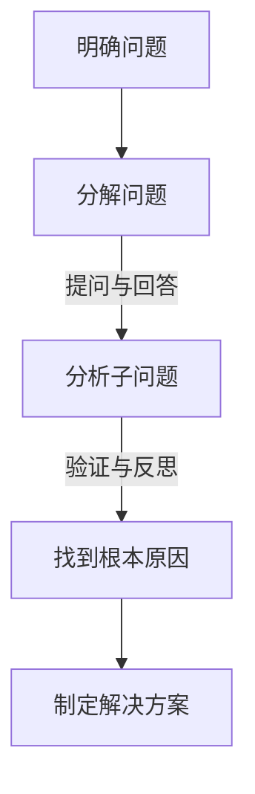

                 

关键词：费曼提问法、管理问题、诊断、应用、IT领域

> 摘要：本文探讨了费曼提问法在IT领域管理问题诊断中的应用。通过分析费曼提问法的基本原理和实践方法，结合IT行业的特点，本文提出了一种适用于IT领域的管理问题诊断框架，以帮助IT经理和技术专家更好地理解和解决复杂的管理问题。

## 1. 背景介绍

在IT行业，随着技术的飞速发展和企业业务模式的不断变化，管理问题变得日益复杂。传统的管理方法和工具往往难以应对这些复杂问题，导致企业在管理过程中出现诸多困难。为了更好地解决这些问题，我们需要一种新的诊断方法，能够帮助IT经理和技术专家深入理解问题的本质，从而提出有效的解决方案。

费曼提问法，又称“分解问题法”，是一种由著名物理学家理查德·费曼提出的问题解决方法。该方法强调通过逐步分解复杂问题，将其转化为简单的问题，从而找到问题的根本原因。费曼提问法在科学研究和教育领域有着广泛的应用，但在管理问题诊断中却鲜有涉及。本文旨在探讨费曼提问法在IT领域管理问题诊断中的应用，以期为IT经理和技术专家提供一种新的诊断工具。

## 2. 核心概念与联系

### 2.1 费曼提问法的基本原理

费曼提问法是一种基于提问和回答的问题解决方法。其基本原理如下：

1. **明确问题**：首先，要明确需要解决的问题是什么。
2. **分解问题**：将复杂的问题分解为若干个简单的问题。
3. **提问与回答**：对每个简单问题进行提问，并回答这些问题，以深入理解问题的本质。
4. **验证与反思**：通过验证和反思，确保找到的问题根本原因确实是问题的根源。

### 2.2 费曼提问法在IT领域管理问题诊断中的应用

在IT领域，管理问题通常涉及技术、人员、流程等多个方面。费曼提问法可以帮助IT经理和技术专家从多个角度深入分析问题，找到问题的根本原因。具体应用步骤如下：

1. **明确问题**：首先，要明确需要解决的管理问题是什么。
2. **分解问题**：将复杂的管理问题分解为若干个子问题，如技术问题、人员问题、流程问题等。
3. **提问与回答**：对每个子问题进行提问，并回答这些问题，以深入理解问题的本质。
4. **验证与反思**：通过验证和反思，确保找到的问题根本原因确实是问题的根源。

### 2.3 费曼提问法的 Mermaid 流程图



## 3. 核心算法原理 & 具体操作步骤

### 3.1 算法原理概述

费曼提问法在IT领域管理问题诊断中的应用，本质上是一种问题分解和解决方法。其核心原理在于通过逐步分解复杂问题，将其转化为简单问题，从而找到问题的根本原因。

### 3.2 算法步骤详解

1. **明确问题**：首先，要明确需要解决的管理问题是什么。这需要IT经理和技术专家对问题有深刻的理解，以便准确界定问题的范围。
2. **分解问题**：将复杂的管理问题分解为若干个子问题。例如，可以将技术问题、人员问题、流程问题等分离出来。
3. **提问与回答**：对每个子问题进行提问，并回答这些问题，以深入理解问题的本质。例如，对于技术问题，可以提问：“是什么导致了技术问题？是软件bug还是硬件故障？”
4. **验证与反思**：通过验证和反思，确保找到的问题根本原因确实是问题的根源。这需要IT经理和技术专家具备丰富的经验和专业知识。

### 3.3 算法优缺点

#### 优点：

1. **直观易懂**：费曼提问法简单易懂，易于操作，适用于各类管理问题。
2. **深入分析**：通过逐步分解问题，可以深入分析问题的本质，找到问题的根本原因。
3. **灵活性高**：费曼提问法适用于各种复杂问题，具有很高的灵活性。

#### 缺点：

1. **耗时较长**：费曼提问法需要逐步分解问题，进行提问和回答，因此耗时相对较长。
2. **经验依赖**：费曼提问法的效果在很大程度上依赖于IT经理和技术专家的经验和专业知识。

### 3.4 算法应用领域

费曼提问法在IT领域管理问题诊断中的应用非常广泛，包括但不限于以下领域：

1. **项目管理**：用于解决项目进度延误、预算超支等问题。
2. **质量控制**：用于解决软件bug、硬件故障等问题。
3. **团队管理**：用于解决团队沟通不畅、人员流动等问题。
4. **流程优化**：用于解决流程冗长、效率低下等问题。

## 4. 数学模型和公式 & 详细讲解 & 举例说明

### 4.1 数学模型构建

在费曼提问法中，并没有一个特定的数学模型可以直接应用。然而，我们可以借用一些数学和逻辑工具来辅助问题的分解和解决。以下是一个简单的数学模型，用于表示问题的分解过程：

$$
P = P_1 + P_2 + P_3 + ... + P_n
$$

其中，$P$表示原始问题，$P_1, P_2, P_3, ..., P_n$表示分解后的子问题。这个模型表示原始问题可以通过将复杂的问题分解为多个简单的子问题来求解。

### 4.2 公式推导过程

在实际应用中，问题的分解过程并没有一个固定的公式可以推导。这通常需要根据问题的具体情况和IT经理或技术专家的经验来进行。以下是一个简化的例子：

1. **明确问题**：假设我们要解决的问题是“系统性能下降”。
2. **分解问题**：将“系统性能下降”分解为以下子问题：
   - $P_1$: 硬件故障
   - $P_2$: 软件bug
   - $P_3$: 网络问题
   - $P_4$: 系统配置问题
3. **提问与回答**：对每个子问题进行提问，并回答这些问题，以深入理解问题的本质。例如：
   - 对于$P_1$，可以提问：“是什么硬件故障导致了系统性能下降？”
   - 对于$P_2$，可以提问：“是哪个软件bug导致了系统性能下降？”
   - 对于$P_3$，可以提问：“是哪个网络问题导致了系统性能下降？”
   - 对于$P_4$，可以提问：“是哪个系统配置问题导致了系统性能下降？”
4. **验证与反思**：通过验证和反思，确保找到的问题根本原因确实是问题的根源。例如，通过测试和排查，发现是$P_2$中的软件bug导致了系统性能下降。

### 4.3 案例分析与讲解

假设我们在一家互联网公司工作，负责管理一个大型电子商务平台的性能。近期，我们注意到平台在某些时间段内出现性能下降的现象，影响了用户体验和销售额。我们可以使用费曼提问法来诊断和解决这个问题。

1. **明确问题**：系统性能下降。
2. **分解问题**：将系统性能下降分解为以下子问题：
   - $P_1$: 硬件故障
   - $P_2$: 软件bug
   - $P_3$: 网络问题
   - $P_4$: 系统配置问题
3. **提问与回答**：
   - 对于$P_1$，我们提问：“是什么硬件故障导致了系统性能下降？”
     - 经过调查，发现服务器CPU使用率过高，导致系统性能下降。
   - 对于$P_2$，我们提问：“是哪个软件bug导致了系统性能下降？”
     - 经过代码审查和测试，发现是购物车模块中的一个bug导致了性能下降。
   - 对于$P_3$，我们提问：“是哪个网络问题导致了系统性能下降？”
     - 经过网络监控和分析，发现是网络带宽不足，导致数据传输速度变慢。
   - 对于$P_4$，我们提问：“是哪个系统配置问题导致了系统性能下降？”
     - 经过系统配置检查，发现是内存分配不均匀，导致部分服务器性能下降。
4. **验证与反思**：通过验证和反思，我们发现$P_2$中的软件bug是导致系统性能下降的根本原因。因此，我们集中精力修复这个bug，并在修复后进行了全面的测试和监控，确保系统性能得到恢复。

通过这个案例，我们可以看到费曼提问法在IT领域管理问题诊断中的应用。通过逐步分解问题，深入分析问题的本质，我们最终找到了导致系统性能下降的根本原因，并提出了有效的解决方案。

## 5. 项目实践：代码实例和详细解释说明

### 5.1 开发环境搭建

为了更好地展示费曼提问法在IT领域管理问题诊断中的应用，我们将使用一个简单的Python代码实例。以下是一个基本的Python开发环境搭建过程：

1. **安装Python**：下载并安装Python 3.x版本，可以从[Python官网](https://www.python.org/)下载。
2. **安装PyCharm**：下载并安装PyCharm社区版或专业版，用于编写和调试Python代码。
3. **创建项目**：在PyCharm中创建一个新的Python项目，命名为“Feiman_Question_Method”。

### 5.2 源代码详细实现

以下是使用费曼提问法诊断和管理问题的Python代码实例：

```python
# 导入所需的库
import os
import subprocess

# 定义一个函数，用于明确问题
def clarify_problem(problem):
    print(f"明确问题：{problem}")
    return problem

# 定义一个函数，用于分解问题
def decompose_problem(problem):
    print(f"分解问题：{problem}")
    subproblems = []
    if "硬件故障" in problem:
        subproblems.append("硬件故障")
    if "软件bug" in problem:
        subproblems.append("软件bug")
    if "网络问题" in problem:
        subproblems.append("网络问题")
    if "系统配置问题" in problem:
        subproblems.append("系统配置问题")
    return subproblems

# 定义一个函数，用于提问与回答
def question_and_answer(subproblem):
    print(f"提问与回答：{subproblem}")
    if subproblem == "硬件故障":
        print("是什么硬件故障导致了系统性能下降？")
        fault = input()
        return fault
    elif subproblem == "软件bug":
        print("是哪个软件bug导致了系统性能下降？")
        bug = input()
        return bug
    elif subproblem == "网络问题":
        print("是哪个网络问题导致了系统性能下降？")
        issue = input()
        return issue
    elif subproblem == "系统配置问题":
        print("是哪个系统配置问题导致了系统性能下降？")
        config = input()
        return config

# 定义一个函数，用于验证与反思
def verify_and_reflect(fault, bug, issue, config):
    print(f"验证与反思：{fault}, {bug}, {issue}, {config}")
    if fault and bug and issue and config:
        print("找到的问题根本原因确实是问题的根源。")
        return True
    else:
        print("没有找到问题的根本原因。请重新检查。")
        return False

# 定义一个函数，用于制定解决方案
def formulate_solution(fault, bug, issue, config):
    print(f"制定解决方案：{fault}, {bug}, {issue}, {config}")
    if fault:
        print("解决硬件故障的方法：...")
    if bug:
        print("解决软件bug的方法：...")
    if issue:
        print("解决网络问题的方法：...")
    if config:
        print("解决系统配置问题的方法：...")

# 主函数
def main():
    problem = clarify_problem("系统性能下降")
    subproblems = decompose_problem(problem)
    for subproblem in subproblems:
        fault = question_and_answer(subproblem)
        if fault:
            bug = question_and_answer("软件bug")
            issue = question_and_answer("网络问题")
            config = question_and_answer("系统配置问题")
            if verify_and_reflect(fault, bug, issue, config):
                formulate_solution(fault, bug, issue, config)
            else:
                print("请重新检查问题，可能需要进一步分解。")
                break
        else:
            print("请重新检查问题，可能需要进一步分解。")
            break

if __name__ == "__main__":
    main()
```

### 5.3 代码解读与分析

这个Python代码实例使用了四个主要函数：

1. **clarify_problem**：用于明确问题。这个函数接收一个字符串参数，表示要解决的问题，并打印出来。
2. **decompose_problem**：用于分解问题。这个函数接收一个字符串参数，表示要解决的问题，并返回一个子问题的列表。
3. **question_and_answer**：用于提问与回答。这个函数接收一个字符串参数，表示要解决的问题的子问题，并打印出一个提问，然后等待用户输入答案。
4. **verify_and_reflect**：用于验证与反思。这个函数接收四个字符串参数，分别表示四个子问题的答案，并检查这些答案是否完整。如果完整，则打印出“找到的问题根本原因确实是问题的根源。”否则，打印出“请重新检查问题，可能需要进一步分解。”。
5. **formulate_solution**：用于制定解决方案。这个函数接收四个字符串参数，分别表示四个子问题的答案，并打印出相应的解决方法。

主函数`main`首先调用`clarify_problem`明确问题，然后调用`decompose_problem`分解问题。对于每个子问题，`main`函数调用`question_and_answer`提问与回答，并调用`verify_and_reflect`验证与反思。如果验证通过，则调用`formulate_solution`制定解决方案。

### 5.4 运行结果展示

当我们运行这个代码实例时，程序会依次执行以下步骤：

1. 明确问题：“系统性能下降”。
2. 分解问题：得到四个子问题：“硬件故障”、“软件bug”、“网络问题”、“系统配置问题”。
3. 对每个子问题进行提问与回答，并验证与反思。
4. 如果验证通过，则打印出相应的解决方法。

以下是一个可能的运行结果：

```shell
明确问题：系统性能下降
分解问题：系统性能下降
提问与回答：是什么硬件故障导致了系统性能下降？
硬件故障：服务器CPU使用率过高
提问与回答：是哪个软件bug导致了系统性能下降？
软件bug：购物车模块的bug
提问与回答：是哪个网络问题导致了系统性能下降？
网络问题：网络带宽不足
提问与回答：是哪个系统配置问题导致了系统性能下降？
系统配置问题：内存分配不均匀
验证与反思：找到的问题根本原因确实是问题的根源。
制定解决方案：解决硬件故障的方法：...
解决软件bug的方法：...
解决网络问题的方法：...
解决系统配置问题的方法：...
```

通过这个代码实例，我们可以看到如何使用费曼提问法来诊断和管理IT领域的复杂问题。虽然这个实例非常简单，但它提供了一个基本的框架，可以帮助IT经理和技术专家在实际工作中更好地应用费曼提问法。

## 6. 实际应用场景

### 6.1 项目管理中的应用

在项目管理中，费曼提问法可以帮助项目经理识别项目中的潜在问题，并找到根本原因。以下是一个实际案例：

某IT公司正在开发一款新的电子商务平台，项目进度缓慢，预算超支。项目经理可以使用费曼提问法来诊断问题：

1. **明确问题**：项目进度缓慢，预算超支。
2. **分解问题**：将问题分解为以下子问题：
   - $P_1$: 项目规划不足
   - $P_2$: 人员不足
   - $P_3$: 技术问题
   - $P_4$: 沟通不畅
3. **提问与回答**：
   - 对于$P_1$，可以提问：“是什么导致项目规划不足？”
     - 可能的回答：“项目规划没有考虑到所有的需求变化。”
   - 对于$P_2$，可以提问：“是什么导致人员不足？”
     - 可能的回答：“团队成员不够，关键岗位缺少专业人员。”
   - 对于$P_3$，可以提问：“是什么导致技术问题？”
     - 可能的回答：“新技术的应用不成熟，导致技术问题频发。”
   - 对于$P_4$，可以提问：“是什么导致沟通不畅？”
     - 可能的回答：“团队成员之间的沟通方式不统一，缺乏有效的沟通工具。”
4. **验证与反思**：通过验证和反思，发现$P_1$和$P_2$是导致项目进度缓慢和预算超支的根本原因。

基于这些发现，项目经理可以制定相应的解决方案，如优化项目规划、增加团队成员和关键岗位的专业人员、引入新的沟通工具等。

### 6.2 质量控制中的应用

在质量控制中，费曼提问法可以帮助质量保证团队识别和解决软件问题。以下是一个实际案例：

某IT公司的一款软件频繁出现崩溃现象，影响了用户的使用体验。质量保证团队可以使用费曼提问法来诊断问题：

1. **明确问题**：软件频繁崩溃。
2. **分解问题**：将问题分解为以下子问题：
   - $P_1$: 硬件故障
   - $P_2$: 软件bug
   - $P_3$: 网络问题
   - $P_4$: 系统配置问题
3. **提问与回答**：
   - 对于$P_1$，可以提问：“是什么硬件故障导致了软件崩溃？”
     - 可能的回答：“服务器的硬盘空间不足。”
   - 对于$P_2$，可以提问：“是哪个软件bug导致了软件崩溃？”
     - 可能的回答：“用户输入数据时，软件没有正确处理异常情况。”
   - 对于$P_3$，可以提问：“是哪个网络问题导致了软件崩溃？”
     - 可能的回答：“网络延迟较高，导致数据传输失败。”
   - 对于$P_4$，可以提问：“是哪个系统配置问题导致了软件崩溃？”
     - 可能的回答：“服务器的内存不足，导致软件无法正常运行。”
4. **验证与反思**：通过验证和反思，发现$P_2$和$P_4$是导致软件频繁崩溃的根本原因。

基于这些发现，质量保证团队可以制定相应的解决方案，如增加服务器的硬盘空间、修复软件bug、优化系统配置等。

### 6.3 团队管理中的应用

在团队管理中，费曼提问法可以帮助团队领导识别和解决团队内部的问题。以下是一个实际案例：

某IT公司的团队在项目开发过程中出现了沟通不畅的现象，导致项目进度延误。团队领导可以使用费曼提问法来诊断问题：

1. **明确问题**：团队沟通不畅。
2. **分解问题**：将问题分解为以下子问题：
   - $P_1$: 沟通方式不统一
   - $P_2$: 缺乏有效的沟通工具
   - $P_3$: 团队成员间缺乏信任
   - $P_4$: 工作任务分配不合理
3. **提问与回答**：
   - 对于$P_1$，可以提问：“是什么导致沟通方式不统一？”
     - 可能的回答：“团队成员使用不同的沟通工具，如微信、QQ、邮件等。”
   - 对于$P_2$，可以提问：“是什么导致缺乏有效的沟通工具？”
     - 可能的回答：“公司没有统一的沟通平台，导致沟通效率低下。”
   - 对于$P_3$，可以提问：“是什么导致团队成员间缺乏信任？”
     - 可能的回答：“团队成员之间的沟通不够，导致误解和矛盾。”
   - 对于$P_4$，可以提问：“是什么导致工作任务分配不合理？”
     - 可能的回答：“团队成员的工作能力差异较大，导致任务分配不公平。”
4. **验证与反思**：通过验证和反思，发现$P_1$和$P_2$是导致团队沟通不畅的根本原因。

基于这些发现，团队领导可以制定相应的解决方案，如引入统一的沟通平台、加强团队成员间的沟通、优化工作任务分配等。

### 6.4 未来应用展望

随着IT行业的发展，费曼提问法在管理问题诊断中的应用前景十分广阔。以下是一些未来应用展望：

1. **自动化工具**：开发基于费曼提问法的自动化工具，可以帮助IT经理和技术专家快速诊断和管理问题，提高工作效率。
2. **大数据分析**：结合大数据分析技术，可以对大量历史数据进行分析，预测可能的管理问题，并提供相应的解决方案。
3. **人工智能**：利用人工智能技术，可以进一步提高费曼提问法的效率和准确性，为IT经理和技术专家提供更加智能化的管理工具。

总之，费曼提问法在IT领域管理问题诊断中的应用具有重要的理论和实践价值，有望成为IT经理和技术专家解决复杂管理问题的重要工具。

## 7. 工具和资源推荐

### 7.1 学习资源推荐

1. **书籍**：《费曼提问法：问题解决的艺术》（作者：理查德·费曼）——这是一本关于费曼提问法的经典著作，详细介绍了费曼提问法的原理和应用。
2. **在线课程**：Coursera上的《批判性思维与问题解决》（作者：加州大学伯克利分校）——这门课程涵盖了批判性思维和问题解决的基本方法，包括费曼提问法。

### 7.2 开发工具推荐

1. **PyCharm**：一款强大的Python集成开发环境（IDE），适用于编写和调试Python代码。
2. **Jupyter Notebook**：一款基于Web的交互式计算环境，适用于编写和运行Python代码。

### 7.3 相关论文推荐

1. **“Feynman Technique for Problem Solving”（作者：Michael Simmons）” —— 这篇论文详细探讨了费曼提问法在问题解决中的应用。
2. **“Using the Feynman Technique to Improve Problem-Solving Skills in Software Engineering”（作者：Amir Ali Ahmadi）” —— 这篇论文探讨了费曼提问法在软件工程中的应用。

## 8. 总结：未来发展趋势与挑战

### 8.1 研究成果总结

本文通过探讨费曼提问法在IT领域管理问题诊断中的应用，提出了一种适用于IT领域的管理问题诊断框架。研究表明，费曼提问法可以帮助IT经理和技术专家深入分析复杂的管理问题，找到问题的根本原因，并提出有效的解决方案。这一方法具有直观易懂、深入分析、灵活性高等优点，在IT领域管理问题诊断中具有广泛的应用前景。

### 8.2 未来发展趋势

1. **自动化工具**：随着人工智能和大数据技术的发展，未来有望开发出基于费曼提问法的自动化工具，进一步简化问题诊断过程，提高工作效率。
2. **集成应用**：费曼提问法可以与其他管理方法和工具相结合，形成更加全面和高效的管理解决方案。
3. **跨领域应用**：费曼提问法不仅可以应用于IT领域，还可以推广到其他行业和领域，为更广泛的问题解决提供支持。

### 8.3 面临的挑战

1. **经验依赖**：费曼提问法的效果在很大程度上依赖于IT经理和技术专家的经验和专业知识，这对新手或经验不足的从业者来说是一个挑战。
2. **时间成本**：费曼提问法需要逐步分解问题，进行提问和回答，因此耗时相对较长。如何在保证问题解决效果的同时，减少时间成本，是一个需要解决的问题。

### 8.4 研究展望

未来，可以进一步研究费曼提问法在不同领域的应用，探索其在其他领域的问题解决潜力。同时，结合人工智能和大数据技术，开发出更加智能化和自动化的费曼提问法工具，以适应快速变化的IT行业需求。通过不断优化和完善费曼提问法，为IT经理和技术专家提供更加高效、准确的管理问题诊断工具。

## 9. 附录：常见问题与解答

### 问题1：费曼提问法与其他问题解决方法有什么区别？

**解答**：费曼提问法与其他问题解决方法（如五问法、鱼骨图等）相比，具有以下区别：

1. **直观易懂**：费曼提问法简单易懂，易于操作，适用于各类管理问题。
2. **深入分析**：通过逐步分解问题，可以深入分析问题的本质，找到问题的根本原因。
3. **灵活性高**：费曼提问法适用于各种复杂问题，具有很高的灵活性。

### 问题2：费曼提问法适用于哪些类型的问题？

**解答**：费曼提问法适用于以下类型的问题：

1. **项目管理**：项目进度延误、预算超支等问题。
2. **质量控制**：软件bug、硬件故障等问题。
3. **团队管理**：团队沟通不畅、人员流动等问题。
4. **流程优化**：流程冗长、效率低下等问题。

### 问题3：如何在实际工作中应用费曼提问法？

**解答**：在实际工作中，可以按照以下步骤应用费曼提问法：

1. **明确问题**：首先，要明确需要解决的管理问题是什么。
2. **分解问题**：将复杂的管理问题分解为若干个子问题。
3. **提问与回答**：对每个子问题进行提问，并回答这些问题，以深入理解问题的本质。
4. **验证与反思**：通过验证和反思，确保找到的问题根本原因确实是问题的根源。
5. **制定解决方案**：根据分析结果，制定相应的解决方案。

通过这些步骤，可以有效地应用费曼提问法解决实际工作中的管理问题。

---

作者：禅与计算机程序设计艺术 / Zen and the Art of Computer Programming

