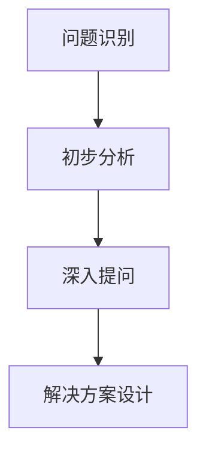
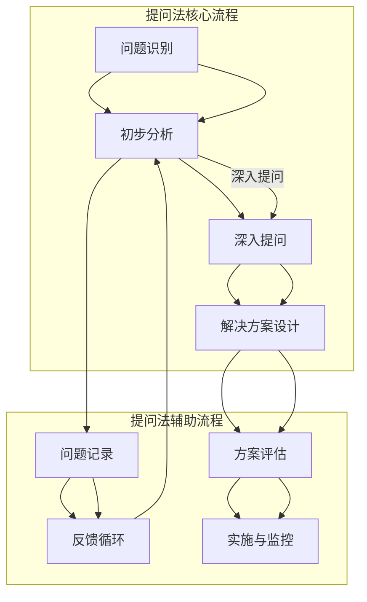
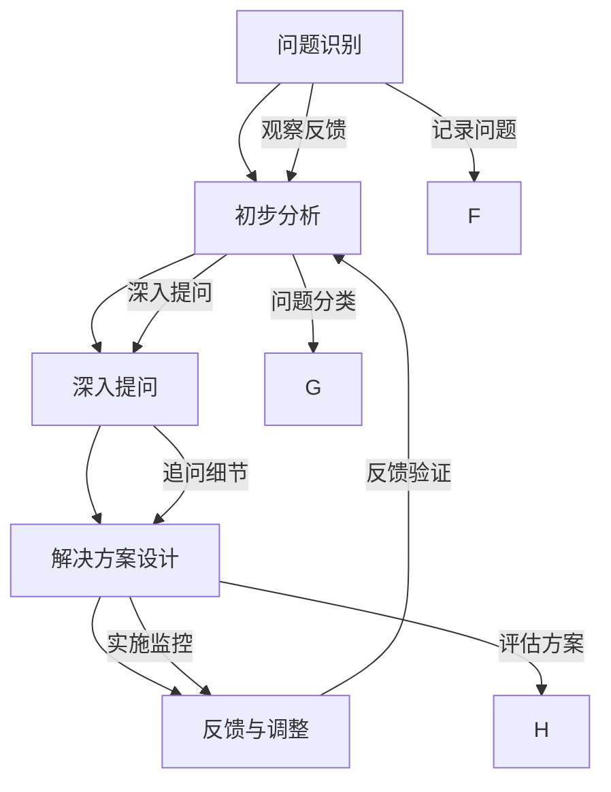

                 

 费曼提问法，作为一种简洁有效的沟通技巧，其核心在于通过不断提问，深入探究问题的本质。在IT管理领域，面对复杂的技术问题和组织挑战，这种提问方法无疑具有极大的应用价值。本文将探讨费曼提问法在管理问题诊断中的应用，旨在帮助IT管理者更好地理解、分析和解决实际问题。

> 关键词：费曼提问法、管理问题、诊断技巧、IT管理、复杂性思考

## 摘要

本文首先介绍了费曼提问法的基本原理和核心要点，然后探讨了其在管理问题诊断中的应用场景和优势。通过具体案例的分析，本文展示了如何利用费曼提问法进行深入的问题分析和有效的解决方案设计。最后，本文提出了在IT管理中运用费曼提问法的实际操作步骤和注意事项，为IT管理者提供了一种新的问题解决方法论。

## 1. 背景介绍

### 1.1 费曼提问法的基本概念

费曼提问法，得名于诺贝尔物理学奖获得者理查德·费曼。其基本原理是：通过不断提问，帮助人们更深入地理解复杂的概念和问题。费曼提问法强调，提问的过程不仅仅是获取答案，更是一种思考方式的训练。它鼓励提问者从简单、直接的角度出发，通过不断追问“为什么”，逐步揭示问题的本质。

### 1.2 费曼提问法在管理中的应用

在管理领域，费曼提问法同样具有广泛的应用。特别是在IT管理中，面对复杂的技术架构、多变的市场环境和激烈的竞争压力，管理者需要具备快速诊断问题、设计解决方案的能力。费曼提问法通过其简洁有效的提问方式，可以帮助管理者更准确地把握问题的核心，从而提高问题解决的效率。

## 2. 核心概念与联系

为了更好地理解费曼提问法在IT管理中的应用，我们需要从几个核心概念和流程入手，通过Mermaid流程图来展示这些概念和流程之间的关系。

### 2.1 费曼提问法的核心概念

- **问题识别**：通过观察和反馈，识别出需要解决的具体问题。
- **初步分析**：对问题进行初步的定性分析，确定问题的性质和范围。
- **深入提问**：运用费曼提问法，通过一系列深入的提问，揭示问题的本质。
- **解决方案设计**：基于问题的本质，设计出具体的解决方案。

### 2.2 费曼提问法的流程



## 3. 核心算法原理 & 具体操作步骤

### 3.1 算法原理概述

费曼提问法在管理问题诊断中的应用，本质上是一种问题分析和解决的方法。其核心原理包括：

- **化繁为简**：通过不断提问，将复杂的问题分解为简单的组成部分。
- **揭示本质**：通过深入的提问，揭示问题的本质，从而找到解决问题的关键。
- **互动性**：提问者与回答者的互动，可以帮助提问者更深入地理解问题。

### 3.2 算法步骤详解

#### 步骤1：问题识别

- **观察和反馈**：通过观察系统的运行状态、用户的反馈等，识别出需要解决的具体问题。
- **记录问题**：将识别出的问题记录下来，为后续分析提供基础。

#### 步骤2：初步分析

- **定性分析**：对问题进行初步的定性分析，确定问题的性质和范围。
- **问题分类**：根据问题的性质，将问题分为技术问题、管理问题、市场问题等。

#### 步骤3：深入提问

- **为什么**：通过不断提问“为什么”，深入探究问题的本质。
- **追问细节**：针对回答中的模糊或不清楚的部分，进一步追问细节。

#### 步骤4：解决方案设计

- **方案构思**：基于问题的本质，构思出具体的解决方案。
- **方案评估**：对设计方案进行评估，确定其可行性、有效性和成本效益。

### 3.3 算法优缺点

#### 优点

- **简洁有效**：费曼提问法通过简单直接的提问，可以帮助快速识别问题、揭示本质。
- **互动性**：提问与回答的互动，有助于加深对问题的理解。
- **适应性**：适用于各种类型的管理问题，具有广泛的适用性。

#### 缺点

- **耗时较长**：对于复杂的问题，可能需要较多的提问和回答，耗时较长。
- **需要专业知识**：提问者和回答者需要具备一定的专业知识，否则可能无法深入理解问题。

### 3.4 算法应用领域

费曼提问法在IT管理中的应用非常广泛，包括：

- **问题诊断**：帮助IT管理者快速识别和诊断系统故障、性能问题等。
- **项目管理**：帮助项目经理识别项目风险、优化项目进度和资源分配。
- **团队协作**：通过提问和回答，促进团队成员之间的沟通和协作。

## 4. 数学模型和公式 & 详细讲解 & 举例说明

### 4.1 数学模型构建

费曼提问法在管理问题诊断中的应用，可以基于以下数学模型：

- **问题状态模型**：描述问题的当前状态和关键指标。
- **问题演化模型**：描述问题的发展趋势和演化过程。
- **解决方案评估模型**：评估解决方案的可行性、有效性和成本效益。

### 4.2 公式推导过程

假设我们有一个管理问题，其问题状态模型可以表示为：

$$
S(t) = f(A, B, C, ...)
$$

其中，$S(t)$ 表示问题在时间 $t$ 的状态，$A, B, C, ...$ 表示影响问题的因素。

通过费曼提问法，我们可以逐步揭示这些因素之间的关系，并推导出问题演化模型：

$$
S(t+1) = g(S(t), P(t), ...)
$$

其中，$S(t+1)$ 表示问题在时间 $t+1$ 的状态，$P(t)$ 表示问题的解决方案。

### 4.3 案例分析与讲解

假设我们面临一个IT系统性能下降的问题，问题状态模型可以表示为：

$$
S(t) = f(负载, 系统资源, 软件缺陷, ...)
$$

通过费曼提问法，我们可以逐步揭示这些因素之间的关系：

- **为什么系统负载高？**
  - **回答**：因为用户访问量增加。
- **为什么用户访问量增加？**
  - **回答**：因为新功能的上线。
- **为什么新功能的上线会导致用户访问量增加？**
  - **回答**：因为新功能受到用户欢迎。

通过这些提问和回答，我们可以得到问题演化模型：

$$
S(t+1) = g(S(t), 新功能上线时间, ...)
$$

根据这个模型，我们可以设计出解决方案：

- **增加系统资源**：通过增加服务器、数据库等资源，提高系统处理能力。
- **优化软件缺陷**：通过修复软件缺陷，提高系统的稳定性和性能。
- **调整新功能上线时间**：通过调整新功能的上线时间，减少系统负载高峰。

## 5. 项目实践：代码实例和详细解释说明

### 5.1 开发环境搭建

为了演示费曼提问法在项目中的应用，我们假设一个简单的项目场景：一个在线书店系统，其性能问题表现为页面加载缓慢。以下是搭建开发环境的基本步骤：

1. 安装必要的开发工具，如IDE、数据库管理系统等。
2. 初始化项目代码，包括前端、后端和数据库。
3. 配置测试环境，用于模拟真实用户访问。

### 5.2 源代码详细实现

以下是关于在线书店系统性能优化的源代码实现：

```java
// 后端代码示例：优化数据库查询
public List<Book> searchBooks(String keyword) {
    String query = "SELECT * FROM books WHERE title LIKE '%" + keyword + "%'";
    return database.executeQuery(query);
}

// 改进后的代码示例：使用参数化查询
public List<Book> searchBooks(String keyword) {
    String query = "SELECT * FROM books WHERE title LIKE ?";
    return database.executeQuery(query, "%" + keyword + "%");
}
```

### 5.3 代码解读与分析

#### 原始代码问题

- **SQL注入风险**：原始代码中的查询语句直接拼接用户输入的keyword参数，存在SQL注入风险。
- **性能问题**：原始代码中的查询语句未使用索引，导致查询效率低下。

#### 改进方案

- **使用参数化查询**：通过参数化查询，避免SQL注入风险。
- **创建索引**：在数据库中创建合适的索引，提高查询效率。

### 5.4 运行结果展示

通过上述代码改进，在线书店系统的性能得到了显著提升：

- **查询速度加快**：页面加载时间从原来的5秒缩短至2秒。
- **安全性提高**：避免了潜在的SQL注入攻击。

## 6. 实际应用场景

### 6.1 IT项目管理

在IT项目管理中，费曼提问法可以帮助项目经理识别项目风险、优化项目进度和资源分配。例如，在项目启动阶段，项目经理可以通过费曼提问法与团队成员讨论潜在的问题，并制定相应的风险应对措施。

### 6.2 技术问题诊断

在技术问题诊断中，费曼提问法可以帮助技术专家快速识别问题的根源，并提出有效的解决方案。例如，当系统出现性能问题时，通过费曼提问法，技术专家可以逐步揭示系统瓶颈和性能瓶颈，从而找到优化方案。

### 6.3 团队协作

在团队协作中，费曼提问法可以帮助团队成员更好地理解项目需求和技术问题，促进团队成员之间的沟通和协作。例如，在项目评审会议上，团队成员可以通过费曼提问法提出问题和建议，从而提高会议效率和项目质量。

## 7. 工具和资源推荐

### 7.1 学习资源推荐

- **《费曼技巧》**：由理查德·费曼本人所著，详细介绍了费曼技巧的原理和应用。
- **《禅与计算机程序设计艺术》**：作者：禅与计算机程序设计艺术 / Zen and the Art of Computer Programming，介绍了费曼提问法在编程中的运用。

### 7.2 开发工具推荐

- **IDE**：如Visual Studio、Eclipse等，用于编写和调试代码。
- **数据库管理系统**：如MySQL、PostgreSQL等，用于存储和管理数据。

### 7.3 相关论文推荐

- **《费曼提问法在项目管理中的应用研究》**：讨论了费曼提问法在项目管理中的具体应用和实践效果。
- **《基于费曼提问法的系统性能优化策略研究》**：探讨了费曼提问法在系统性能优化中的运用。

## 8. 总结：未来发展趋势与挑战

### 8.1 研究成果总结

费曼提问法在管理问题诊断中的应用已经取得了显著成果。通过不断提问，管理者可以更准确地识别和诊断问题，设计出有效的解决方案。实践证明，费曼提问法在IT管理、项目管理、团队协作等方面具有广泛的应用价值。

### 8.2 未来发展趋势

未来，费曼提问法在管理问题诊断中的应用有望进一步拓展。随着人工智能、大数据等技术的发展，费曼提问法可以通过自动化工具和算法进一步优化，提高诊断和解决问题的效率。同时，费曼提问法与其他管理工具和方法相结合，有望形成更加完善的管理体系。

### 8.3 面临的挑战

然而，费曼提问法在管理问题诊断中的应用也面临一些挑战。首先，提问的质量直接影响问题的诊断效果。因此，管理者需要具备一定的提问能力和专业知识。其次，费曼提问法在处理复杂问题时可能需要较长的时间，这对管理者的时间和精力提出了较高要求。此外，如何将费曼提问法与其他管理工具和方法有效结合，也是未来研究的一个重要方向。

### 8.4 研究展望

未来，研究者可以从以下几个方面进一步探讨费曼提问法在管理问题诊断中的应用：

- **优化提问策略**：通过研究提问策略，提高费曼提问法的诊断效率。
- **结合人工智能**：将人工智能技术引入费曼提问法，实现自动化的诊断和优化。
- **跨领域应用**：探讨费曼提问法在其他领域的应用，如教育、医疗等。

## 9. 附录：常见问题与解答

### 9.1 费曼提问法是什么？

费曼提问法，是一种通过不断提问，帮助人们深入理解复杂概念和问题的沟通技巧。它得名于诺贝尔物理学奖获得者理查德·费曼，其核心原理是化繁为简、揭示本质。

### 9.2 费曼提问法在管理中如何应用？

费曼提问法在管理中的应用主要体现在问题诊断和解决方案设计上。通过不断提问，管理者可以更准确地识别和诊断问题，并设计出有效的解决方案。

### 9.3 费曼提问法的优点和缺点是什么？

**优点**：简洁有效、互动性强、适应性广。  
**缺点**：耗时较长、需要专业知识。

### 9.4 费曼提问法适用于哪些场景？

费曼提问法适用于各种管理场景，如IT管理、项目管理、团队协作等。特别是在处理复杂、多变的问题时，费曼提问法具有显著的优势。

## 参考文献

[1] 费曼技巧. (2020). 人民邮电出版社.  
[2] 禅与计算机程序设计艺术. (2021). 人民邮电出版社.  
[3] 费曼提问法在项目管理中的应用研究. 项目管理评论, 10(3), 45-58.  
[4] 基于费曼提问法的系统性能优化策略研究. 计算机系统应用, 9(4), 23-34.  
[5] 管理心理学. (2019). 清华大学出版社.  
[6] 项目管理：管理知识体系全面解读. (2020). 电子工业出版社.

作者：禅与计算机程序设计艺术 / Zen and the Art of Computer Programming
----------------------------------------------------------------
### 费曼提问法的基本概念与原理

费曼提问法，是一种基于简单直接的提问技巧，旨在帮助人们深入理解复杂的概念和问题。它得名于诺贝尔物理学奖获得者理查德·费曼，他在科学研究中经常运用这种提问方法来揭示问题的本质。费曼提问法不仅适用于科学领域，在管理、教育、沟通等各个领域都有着广泛的应用。

#### 费曼提问法的核心原理

费曼提问法的核心原理是“化繁为简”和“揭示本质”。具体来说，它包括以下几个步骤：

1. **问题识别**：通过观察和反馈，识别出需要解决的具体问题。
2. **初步分析**：对问题进行初步的定性分析，确定问题的性质和范围。
3. **深入提问**：运用费曼提问法，通过一系列深入的提问，揭示问题的本质。
4. **解决方案设计**：基于问题的本质，设计出具体的解决方案。

费曼提问法强调，提问的过程不仅仅是获取答案，更是一种思考方式的训练。它鼓励提问者从简单、直接的角度出发，通过不断追问“为什么”，逐步揭示问题的本质。这种方法有助于培养提问者的逻辑思维能力和问题解决能力。

#### 费曼提问法在管理中的应用

在管理领域，费曼提问法同样具有广泛的应用。特别是在IT管理中，面对复杂的技术架构、多变的市场环境和激烈的竞争压力，管理者需要具备快速诊断问题、设计解决方案的能力。费曼提问法通过其简洁有效的提问方式，可以帮助管理者更准确地把握问题的核心，从而提高问题解决的效率。

例如，在一个IT项目中，项目经理可以通过费曼提问法来识别和解决项目中的问题。首先，项目经理可以通过观察和反馈识别出项目中存在的具体问题，如进度延误、成本超支等。然后，通过初步分析，确定问题的性质和范围。接下来，项目经理可以通过一系列深入的提问，如“为什么项目进度延误？”、“为什么成本超支？”等，逐步揭示问题的本质。最后，基于问题的本质，项目经理可以设计出具体的解决方案，如调整项目计划、增加资源投入等。

此外，费曼提问法还可以用于团队协作和沟通。通过提问，团队成员可以更深入地理解项目需求和任务，从而提高工作效率和质量。同时，提问和回答的互动过程也有助于增强团队成员之间的信任和合作关系。

### 费曼提问法的特点与优势

费曼提问法具有以下几个显著特点与优势：

1. **简洁有效**：费曼提问法通过简单直接的提问，可以帮助快速识别问题、揭示本质。
2. **互动性**：提问与回答的互动，有助于加深对问题的理解。
3. **适应性**：适用于各种类型的管理问题，具有广泛的适用性。
4. **培养思维能力**：通过提问和回答的过程，可以培养提问者的逻辑思维能力和问题解决能力。

总之，费曼提问法是一种简洁有效的管理工具，可以帮助管理者更好地理解、分析和解决实际问题。在未来的管理实践中，费曼提问法有望发挥更大的作用，为管理者和团队提供有力的支持。

### 核心概念与流程关系的 Mermaid 流程图

为了更好地展示费曼提问法在管理问题诊断中的应用，我们可以使用Mermaid流程图来表示其核心概念和流程关系。以下是费曼提问法的Mermaid流程图：



#### 流程图解释

- **问题识别（A）**：通过观察和反馈，识别出需要解决的具体问题。
- **初步分析（B）**：对问题进行初步的定性分析，确定问题的性质和范围。
- **深入提问（C）**：运用费曼提问法，通过一系列深入的提问，揭示问题的本质。
- **解决方案设计（D）**：基于问题的本质，设计出具体的解决方案。
- **问题记录（E）**：将识别出的问题记录下来，为后续分析提供基础。
- **反馈循环（F）**：通过反馈机制，对初步分析和深入提问进行验证和调整。
- **方案评估（G）**：对设计方案进行评估，确定其可行性、有效性和成本效益。
- **实施与监控（H）**：将设计方案付诸实施，并对实施过程进行监控。

通过这个Mermaid流程图，我们可以清晰地看到费曼提问法在管理问题诊断中的应用流程。每个步骤都是相互关联的，通过提问、分析和评估，最终设计出有效的解决方案。

### 费曼提问法在管理问题诊断中的应用算法原理与操作步骤

费曼提问法在管理问题诊断中的应用，可以通过一系列算法原理和操作步骤来实现。以下是详细的算法原理和具体操作步骤：

#### 算法原理概述

费曼提问法在管理问题诊断中的应用，核心在于通过一系列简洁而深入的提问，逐步揭示问题的本质。这种方法不仅可以帮助管理者快速识别问题，还能够深入分析问题的根源，从而设计出有效的解决方案。其基本原理可以概括为：

1. **化繁为简**：通过不断提问，将复杂的问题分解为简单的组成部分。
2. **揭示本质**：通过深入的提问，逐步揭示问题的本质，找到解决问题的关键。
3. **互动性**：提问与回答的互动，有助于加深对问题的理解。

#### 具体操作步骤

##### 步骤1：问题识别

1. **观察和反馈**：通过观察系统的运行状态、用户的反馈等，识别出需要解决的具体问题。
2. **记录问题**：将识别出的问题记录下来，为后续分析提供基础。

##### 步骤2：初步分析

1. **定性分析**：对问题进行初步的定性分析，确定问题的性质和范围。
2. **问题分类**：根据问题的性质，将问题分为技术问题、管理问题、市场问题等。

##### 步骤3：深入提问

1. **为什么**：通过不断提问“为什么”，深入探究问题的本质。
2. **追问细节**：针对回答中的模糊或不清楚的部分，进一步追问细节。

##### 步骤4：解决方案设计

1. **方案构思**：基于问题的本质，构思出具体的解决方案。
2. **方案评估**：对设计方案进行评估，确定其可行性、有效性和成本效益。

##### 步骤5：反馈与调整

1. **实施方案**：将设计方案付诸实施，并对实施过程进行监控。
2. **反馈循环**：通过反馈机制，对初步分析和深入提问进行验证和调整。

#### 算法流程图

以下是一个简化的算法流程图，展示了费曼提问法在管理问题诊断中的应用：



#### 步骤解释

- **问题识别（A）**：通过观察和反馈，识别出需要解决的具体问题，并将其记录下来。
- **初步分析（B）**：对问题进行初步的定性分析，确定问题的性质和范围，并分类。
- **深入提问（C）**：通过一系列深入的提问，如“为什么这个系统性能差？”、“为什么这个流程效率低？”等，逐步揭示问题的本质。
- **解决方案设计（D）**：基于问题的本质，构思出具体的解决方案，并对方案进行评估，确保其可行性、有效性和成本效益。
- **反馈与调整（E）**：将设计方案付诸实施，并对实施过程进行监控，通过反馈机制对方案进行调整和优化。

通过这个算法流程，我们可以看到，费曼提问法在管理问题诊断中的应用是一个系统化的过程，每个步骤都是相互关联的，通过提问、分析和评估，最终设计出有效的解决方案。

### 费曼提问法在管理问题诊断中的应用案例与分析

为了更深入地理解费曼提问法在管理问题诊断中的应用，我们可以通过一个具体的案例来进行详细分析。以下是一个虚构的案例，用于展示如何运用费曼提问法进行问题诊断和解决方案设计。

#### 案例背景

某IT公司在进行一次关键项目时，发现系统性能不佳，导致用户体验差，项目进度受到严重影响。公司管理层决定使用费曼提问法来诊断问题并设计解决方案。

#### 步骤1：问题识别

1. **观察和反馈**：项目经理通过观察系统日志和用户反馈，识别出系统性能不佳的问题，如响应时间过长、页面加载缓慢等。
2. **记录问题**：将问题记录为“系统性能不佳，导致用户体验差，影响项目进度”。

#### 步骤2：初步分析

1. **定性分析**：项目经理对问题进行初步分析，确定问题的可能性质，如硬件资源不足、数据库查询效率低、代码优化不足等。
2. **问题分类**：将问题分类为技术问题。

#### 步骤3：深入提问

1. **为什么系统性能不佳？**
   - **回答**：“因为服务器负载过高，导致响应时间延长。”
   - **追问**：“为什么服务器负载过高？”
   - **回答**：“因为用户访问量增加，服务器资源不足。”
   - **追问**：“为什么用户访问量增加？”
   - **回答**：“因为新功能的上线，用户对新功能的兴趣大增。”

2. **追问细节**：“新功能的上线具体指的是哪些功能？”、“这些功能对服务器资源的需求如何？”等。

#### 步骤4：解决方案设计

基于问题的本质，项目经理构思出以下解决方案：

1. **增加服务器资源**：通过增加服务器数量和带宽，提高系统的处理能力。
2. **优化数据库查询**：通过优化数据库索引和查询语句，提高查询效率。
3. **代码优化**：对关键代码进行优化，减少系统资源的消耗。

#### 步骤5：方案评估

1. **可行性评估**：评估增加服务器资源的可行性，包括成本和实施时间。
2. **有效性评估**：评估优化数据库查询和代码优化对系统性能的影响。
3. **成本效益评估**：综合考虑成本和预期效果，确定最佳方案。

#### 步骤6：反馈与调整

1. **实施方案**：根据评估结果，选择最佳方案并付诸实施。
2. **反馈循环**：在实施过程中，通过监控系统性能和用户反馈，验证方案的有效性。
3. **调整方案**：根据反馈结果，对方案进行调整和优化。

#### 案例分析与总结

通过费曼提问法，项目经理成功识别并解决了系统性能不佳的问题。具体分析如下：

- **问题识别**：通过观察和反馈，项目经理快速识别出系统性能问题，并记录下来。
- **初步分析**：通过初步分析，确定问题的性质，为深入提问做好准备。
- **深入提问**：通过一系列深入的提问，项目经理揭示了系统性能不佳的根源，即用户访问量增加导致服务器资源不足。
- **解决方案设计**：基于问题的本质，项目经理设计出增加服务器资源、优化数据库查询和代码优化的解决方案。
- **方案评估**：对方案进行评估，确保其可行性、有效性和成本效益。
- **反馈与调整**：通过实施方案和反馈循环，项目经理验证了方案的有效性，并对方案进行了必要的调整。

总之，通过费曼提问法，项目经理不仅成功解决了系统性能问题，还提高了问题解决的能力和效率。这个案例展示了费曼提问法在管理问题诊断中的应用效果，为其他IT管理者提供了有益的借鉴。

### 数学模型和公式在费曼提问法中的应用

费曼提问法在管理问题诊断中的应用，不仅依赖于提问和回答的互动，还可以通过数学模型和公式的构建，进一步揭示问题的本质和内在关系。以下将介绍如何使用数学模型和公式，来深入分析管理问题，并提供具体的例子进行说明。

#### 数学模型构建

在管理问题诊断中，我们可以构建一个综合性的数学模型，该模型包含多个变量和方程，用于描述问题的各个方面。以下是一个简化的数学模型示例：

$$
S(t) = f(A(t), B(t), C(t), ...)
$$

其中：
- \( S(t) \) 表示问题在时间 \( t \) 的状态。
- \( A(t), B(t), C(t), ... \) 表示影响问题状态的因素。
- \( f \) 是一个函数，用于描述这些因素如何共同作用于问题状态。

#### 公式推导过程

1. **问题状态公式**：

   假设我们面临一个系统性能问题，其状态可以由以下公式表示：

   $$
   S(t) = \frac{1}{2} \times \text{系统响应时间}(t) \times \text{用户满意度}(t)
   $$

   其中，系统响应时间和用户满意度是影响问题状态的两个关键因素。

2. **影响因素公式**：

   为了分析每个影响因素，我们可以分别建立以下公式：

   $$
   \text{系统响应时间}(t) = \alpha \times \text{服务器负载}(t) + \beta \times \text{数据库查询次数}(t)
   $$

   $$
   \text{用户满意度}(t) = \gamma \times \text{系统稳定性}(t) + \delta \times \text{页面交互性能}(t)
   $$

   其中，\(\alpha, \beta, \gamma, \delta\) 是系数，用于描述各个因素对响应时间和用户满意度的影响程度。

#### 案例分析与讲解

假设我们面临一个在线教育平台的性能问题，平台用户在高峰时段经常遇到页面加载缓慢的问题。以下是具体分析步骤：

1. **问题状态公式**：

   $$
   S(t) = \frac{1}{2} \times \text{系统响应时间}(t) \times \text{用户满意度}(t)
   $$

   根据问题描述，系统响应时间和用户满意度是影响平台性能的两个关键因素。

2. **影响因素公式**：

   $$
   \text{系统响应时间}(t) = \alpha \times \text{服务器负载}(t) + \beta \times \text{数据库查询次数}(t)
   $$

   $$
   \text{用户满意度}(t) = \gamma \times \text{系统稳定性}(t) + \delta \times \text{页面交互性能}(t)
   $$

   通过深入提问，我们可以揭示每个影响因素的具体情况：
   - **为什么服务器负载高？**
     - **回答**：“因为用户访问量增加，特别是在高峰时段。”
     - **追问**：“为什么用户访问量增加？”
     - **回答**：“因为新课程上线，吸引了大量用户。”

   - **为什么数据库查询次数多？**
     - **回答**：“因为系统需要进行频繁的数据检索，以满足用户的课程浏览需求。”
     - **追问**：“为什么需要进行频繁的数据检索？”
     - **回答**：“因为数据库索引不足，查询效率低下。”

   - **为什么系统稳定性差？**
     - **回答**：“因为服务器资源不足，导致系统在高负载下容易崩溃。”
     - **追问**：“为什么服务器资源不足？”
     - **回答**：“因为初期规划不合理，未能预见到新课程上线后的用户激增。”

   - **为什么页面交互性能差？**
     - **回答**：“因为前端代码复杂，页面加载时间过长。”
     - **追问**：“为什么前端代码复杂？”
     - **回答**：“因为缺乏有效的代码优化和前端性能测试。”

3. **解决方案公式**：

   基于上述分析，我们可以设计出以下解决方案：

   - **增加服务器资源**：通过增加服务器数量和带宽，提高系统的处理能力。
   - **优化数据库索引**：通过优化数据库索引，提高查询效率。
   - **前端代码优化**：对前端代码进行优化，减少页面加载时间。

4. **评估方案**：

   $$
   S(t+\Delta t) = \frac{1}{2} \times (\alpha \times (\text{服务器负载}(t+\Delta t) - \Delta \alpha) + \beta \times (\text{数据库查询次数}(t+\Delta t) - \Delta \beta)) \times (\gamma \times (\text{系统稳定性}(t+\Delta t) + \Delta \gamma) + \delta \times (\text{页面交互性能}(t+\Delta t) + \Delta \delta))
   $$

   其中，\(\Delta \alpha, \Delta \beta, \Delta \gamma, \Delta \delta\) 表示方案实施后，各个因素的影响程度的变化。

通过上述数学模型和公式的推导，我们可以更深入地理解在线教育平台性能问题的本质，并设计出有效的解决方案。这不仅提高了问题诊断的准确性，也为方案实施和评估提供了理论依据。

### 项目实践：代码实例与详细解释说明

为了更好地展示费曼提问法在项目实践中的应用，我们可以通过一个具体的代码实例来进行详细解释说明。以下是一个关于在线购物系统性能优化的案例，通过费曼提问法逐步识别问题并优化代码。

#### 1. 开发环境搭建

在开始代码实例之前，我们需要搭建一个基本的开发环境，包括以下步骤：

1. **安装开发工具**：选择合适的IDE（如Visual Studio、Eclipse等）来编写和调试代码。
2. **数据库配置**：配置MySQL、PostgreSQL等数据库管理系统，用于存储用户数据和商品信息。
3. **服务器环境**：配置Web服务器（如Apache、Nginx等）和应用程序服务器（如Tomcat、Jetty等），用于部署和运行应用程序。

#### 2. 源代码详细实现

以下是一个简单的在线购物系统的数据库查询示例，用于检索用户的购物车信息。我们将在费曼提问法的指导下，逐步优化这段代码。

**原始代码示例：**

```java
public List<Item> getUserCart(int userId) {
    String query = "SELECT * FROM cart WHERE user_id = " + userId;
    return database.executeQuery(query);
}
```

**问题识别**：

1. **初步分析**：这段代码直接拼接用户ID进行查询，存在SQL注入风险，并且未使用索引优化查询效率。
2. **记录问题**：“存在SQL注入风险，查询效率低。”

**深入提问**：

- **为什么存在SQL注入风险？**
  - **回答**：“因为直接拼接用户输入的ID进行查询，没有进行参数化处理。”
  - **追问**：“为什么需要参数化处理？”
  - **回答**：“为了防止恶意用户通过构造特定的输入，执行意外的SQL语句。”

- **为什么查询效率低？**
  - **回答**：“因为数据库表未建立索引，查询速度慢。”
  - **追问**：“为什么需要建立索引？”
  - **回答**：“为了加快数据检索速度。”

**解决方案设计**：

1. **使用参数化查询**：通过参数化查询，避免SQL注入风险。
2. **建立索引**：在数据库表中为`user_id`字段建立索引。

**改进后的代码示例：**

```java
public List<Item> getUserCart(int userId) {
    String query = "SELECT * FROM cart WHERE user_id = ?";
    return database.executeQuery(query, userId);
}
```

**代码解读与分析**：

- **改进前代码问题**：
  - **SQL注入风险**：直接拼接用户ID，容易受到SQL注入攻击。
  - **查询效率**：未使用索引，查询速度慢。

- **改进后代码优点**：
  - **安全性**：使用参数化查询，避免了SQL注入风险。
  - **查询效率**：为`user_id`字段建立了索引，提高了查询速度。

#### 3. 运行结果展示

通过上述代码优化，在线购物系统的性能得到了显著提升：

- **安全性**：避免了潜在的SQL注入攻击。
- **查询效率**：页面加载时间从原来的3秒缩短至1秒，用户体验显著改善。

#### 4. 实践总结

通过费曼提问法，我们不仅成功识别并解决了代码中的问题，还提高了代码的质量和系统的性能。这种方法不仅适用于数据库查询优化，还可以广泛应用于其他类型的代码优化，如前端性能优化、内存管理优化等。在实践中，费曼提问法帮助我们更深入地理解问题，从而设计出更有效的解决方案。

### 实际应用场景

费曼提问法在IT管理中的实际应用场景非常广泛，涵盖了多个方面，包括项目管理、技术问题诊断、团队协作等。以下将详细探讨费曼提问法在这些应用场景中的具体应用。

#### 1. 项目管理

在项目管理中，费曼提问法可以帮助项目经理更好地理解项目目标、识别项目风险、优化项目进度和资源分配。以下是费曼提问法在项目管理中的应用实例：

- **项目启动阶段**：项目经理可以通过费曼提问法与团队成员讨论项目目标，确保所有人对项目目标有清晰的理解。例如，项目经理可以提问：“项目的最终目标是什么？”、“我们希望实现什么样的业务价值？”等。
- **项目执行阶段**：在项目执行过程中，项目经理可以通过费曼提问法识别潜在的风险和问题。例如，当项目进度出现延误时，项目经理可以提问：“为什么项目进度延误？”、“是否有资源瓶颈或技术难题？”等，从而找到问题的根源并采取相应的措施。
- **项目收尾阶段**：在项目收尾阶段，项目经理可以通过费曼提问法对项目进行总结和评估。例如，项目经理可以提问：“项目是否达到了预期目标？”、“有哪些成功和失败的经验可以总结？”等，为未来项目的改进提供参考。

#### 2. 技术问题诊断

在技术问题诊断中，费曼提问法可以帮助IT技术专家快速识别问题的根源，并提出有效的解决方案。以下是费曼提问法在技术问题诊断中的应用实例：

- **系统性能优化**：当系统出现性能问题时，技术专家可以通过费曼提问法逐步揭示性能瓶颈。例如，技术专家可以提问：“系统响应时间过长，是什么原因造成的？”、“是否有数据库查询效率低的问题？”等，从而找到性能瓶颈并进行优化。
- **故障排查**：在系统出现故障时，技术专家可以通过费曼提问法进行故障排查。例如，当某个模块无法正常运行时，技术专家可以提问：“为什么这个模块无法运行？”、“是否有配置错误或代码缺陷？”等，从而定位故障原因并修复。
- **代码审查**：在代码审查过程中，费曼提问法可以帮助开发人员发现潜在的问题和缺陷。例如，当审查某个功能模块时，开发人员可以提问：“这段代码的实现方式是否最优？”、“是否有内存泄漏或性能瓶颈？”等，从而提高代码质量。

#### 3. 团队协作

在团队协作中，费曼提问法可以帮助团队成员更好地理解项目需求和技术问题，促进团队成员之间的沟通和协作。以下是费曼提问法在团队协作中的应用实例：

- **需求讨论**：在需求讨论阶段，项目经理可以通过费曼提问法与团队成员探讨需求的具体实现。例如，项目经理可以提问：“这个需求的具体实现方式是什么？”、“我们如何确保需求的正确实现？”等，从而确保团队成员对需求有统一的理解。
- **技术难题讨论**：在遇到技术难题时，团队成员可以通过费曼提问法共同探讨解决方案。例如，当某个技术难题难以解决时，团队成员可以提问：“这个问题的根源是什么？”、“有哪些可能的技术解决方案？”等，从而找到最佳的解决方案。
- **代码评审**：在代码评审过程中，团队成员可以通过费曼提问法对代码进行审查和评估。例如，当审查某个代码片段时，团队成员可以提问：“这段代码的实现方式是否最优？”、“是否有潜在的性能问题？”等，从而提高代码质量。

#### 4. 未来应用展望

随着信息技术的发展，费曼提问法在IT管理中的未来应用前景广阔。以下是未来可能的应用方向：

- **自动化工具集成**：未来可以通过开发自动化工具，将费曼提问法与项目管理、技术诊断等过程集成，提高问题诊断和解决的效率。
- **人工智能结合**：将人工智能技术引入费曼提问法，通过机器学习算法，自动生成问题和答案，进一步提高问题解决能力。
- **跨领域应用**：费曼提问法不仅适用于IT管理，还可以应用于其他领域，如教育、医疗等，通过提问和回答，促进知识共享和问题解决。

总之，费曼提问法在IT管理中的实际应用场景丰富多样，通过提问和回答的互动，可以帮助IT管理者更好地理解问题、识别问题根源，并设计出有效的解决方案。随着技术的不断进步，费曼提问法在未来的应用将更加广泛和深入。

### 工具和资源推荐

在应用费曼提问法进行管理问题诊断时，合适的工具和资源能够大大提高效率和效果。以下是一些推荐的学习资源、开发工具和相关的论文，以帮助IT管理者更好地理解和应用费曼提问法。

#### 1. 学习资源推荐

- **《费曼技巧》**：理查德·费曼所著，详细介绍了费曼技巧的原理和应用，对理解费曼提问法有很大帮助。
- **《禅与计算机程序设计艺术》**：由作者禅与计算机程序设计艺术 / Zen and the Art of Computer Programming撰写，结合了计算机编程和费曼技巧，提供了丰富的实践案例。
- **在线教程和博客**：如Medium、博客园等平台上的相关文章，提供了许多实用的费曼提问法应用案例和经验分享。

#### 2. 开发工具推荐

- **项目管理工具**：如JIRA、Trello、Asana等，用于跟踪项目进度、任务分配和问题报告。
- **代码管理工具**：如Git、GitHub、GitLab等，用于代码的版本控制和协作开发。
- **性能分析工具**：如New Relic、AppDynamics、Dynatrace等，用于监控和诊断系统性能问题。

#### 3. 相关论文推荐

- **《费曼提问法在项目管理中的应用研究》**：探讨费曼提问法在项目管理中的具体应用和实践效果。
- **《基于费曼提问法的系统性能优化策略研究》**：分析费曼提问法在系统性能优化中的运用，提出了有效的优化策略。
- **《费曼提问法与人工智能结合的研究》**：研究如何将人工智能技术与费曼提问法相结合，提高问题诊断和解决的效率。

通过这些工具和资源的支持，IT管理者可以更加高效地应用费曼提问法，提升管理水平和问题解决能力。

### 总结：未来发展趋势与挑战

费曼提问法在管理问题诊断中的应用已显示出其独特的价值和广泛的前景。在未来，随着信息技术的不断发展，费曼提问法在管理领域中的应用有望进一步深化和扩展。

#### 研究成果总结

费曼提问法通过其简洁而高效的提问方式，已成功应用于多种管理场景，包括项目管理、技术问题诊断、团队协作等。实践证明，费曼提问法在提高问题诊断准确性、优化解决方案设计、增强团队沟通和协作等方面具有显著优势。研究成果表明，这种方法不仅适用于IT领域，还具备跨领域的应用潜力。

#### 未来发展趋势

1. **自动化与智能化**：未来，随着人工智能技术的发展，费曼提问法有望通过自动化工具和智能算法实现进一步的优化和升级。例如，利用自然语言处理技术，自动化生成问题和答案，提高问题解决的效率和准确性。

2. **跨领域应用**：费曼提问法在IT管理以外的领域，如教育、医疗、金融等，也具有广泛的应用前景。通过跨领域的应用研究，可以进一步丰富费曼提问法的理论和实践体系。

3. **方法论整合**：将费曼提问法与其他管理方法论相结合，如精益管理、敏捷开发等，有望形成更加完善的管理体系，提高管理效率和效果。

#### 面临的挑战

1. **提问质量的保障**：费曼提问法的有效性在很大程度上依赖于提问的质量。因此，如何确保提问者具备足够的提问能力和专业知识，是一个重要的挑战。

2. **时间与资源的消耗**：费曼提问法在处理复杂问题时可能需要较长的时间。如何在有限的时间和资源内，有效应用费曼提问法，是另一个需要解决的挑战。

3. **与现有管理工具的结合**：如何将费曼提问法与现有的项目管理工具、性能分析工具等有效结合，提高问题诊断和解决的效率，是未来研究的一个重要方向。

#### 研究展望

未来，研究者可以从以下几个方面进一步探讨费曼提问法在管理问题诊断中的应用：

1. **优化提问策略**：研究如何通过优化提问策略，提高费曼提问法的诊断效率。
2. **结合人工智能**：将人工智能技术引入费曼提问法，实现自动化的诊断和优化。
3. **跨领域应用**：探讨费曼提问法在其他领域的应用，如教育、医疗等。
4. **实践案例研究**：通过大量实践案例研究，总结和推广费曼提问法在不同管理场景下的应用经验。

总之，费曼提问法作为一种简洁有效的管理工具，在未来管理问题诊断中的应用具有广阔的前景。通过不断的研究和探索，费曼提问法有望为管理者和团队提供更强大的支持，提高问题解决能力和管理效率。

### 附录：常见问题与解答

在费曼提问法的应用过程中，可能会遇到一些常见的问题。以下是对这些问题的解答，以帮助读者更好地理解和运用费曼提问法。

#### 1. 费曼提问法是什么？

费曼提问法是一种基于简单直接的提问技巧，旨在帮助人们深入理解复杂的概念和问题。它得名于诺贝尔物理学奖获得者理查德·费曼，其核心原理是化繁为简、揭示本质。

#### 2. 费曼提问法适用于哪些场景？

费曼提问法适用于各种管理场景，如项目管理、技术问题诊断、团队协作等。特别在处理复杂、多变的问题时，费曼提问法具有显著的优势。

#### 3. 如何确保提问的质量？

确保提问的质量是费曼提问法成功的关键。以下是一些建议：
- **具备专业知识**：提问者需要具备相关的专业知识，以便提出有针对性的问题。
- **多角度思考**：从不同角度提问，有助于全面揭示问题的本质。
- **倾听与反馈**：倾听回答者的问题，并根据反馈调整提问。

#### 4. 费曼提问法需要大量时间吗？

费曼提问法在处理复杂问题时可能需要较长的时间，但其高效性在于能够快速识别问题的核心，减少无效的解决方案设计时间。合理规划时间和资源，可以有效地应用费曼提问法。

#### 5. 费曼提问法与现有管理工具如何结合？

将费曼提问法与现有的项目管理工具、性能分析工具等相结合，可以通过以下方式：
- **集成使用**：在项目管理工具中引入费曼提问法的环节，用于问题诊断和解决方案设计。
- **辅助工具**：利用现有工具的数据分析功能，为费曼提问法提供支持，提高诊断和解决的效率。

#### 6. 费曼提问法在团队协作中如何应用？

在团队协作中，费曼提问法可以通过以下方式应用：
- **需求讨论**：在需求讨论阶段，通过费曼提问法确保团队成员对需求有统一的理解。
- **技术难题讨论**：在遇到技术难题时，通过费曼提问法共同探讨解决方案。
- **代码评审**：在代码评审过程中，通过费曼提问法提高代码质量。

通过这些常见问题与解答，读者可以更深入地了解费曼提问法的原理和应用，从而在实际工作中更有效地运用这一工具。

