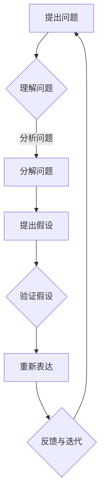

                 

关键词：费曼提问法，深度思考，技术博客，IT领域，专业知识

> 摘要：本文将探讨费曼提问法的实战应用，阐述其在IT领域中的重要性，并通过具体案例展示如何运用这一方法进行深入思考。读者将了解到费曼提问法的核心原理，以及在技术博客写作中的应用，从而提升自身的技术理解和表达能力。

## 1. 背景介绍

费曼提问法是一种以著名物理学家理查德·费曼命名的问题解决方法。这种方法强调通过提问和解答来深入理解和掌握复杂知识。费曼提问法的基本原理是将一个复杂的概念或问题分解成最简单的组成部分，然后用简单的语言重新表达，以便更好地理解和传达。

在IT领域，费曼提问法被广泛应用于编程、软件开发、系统设计等方面。通过运用这种方法，技术人员可以更好地理解技术概念，解决复杂问题，并提高自己的技术沟通能力。

本文将围绕费曼提问法的实战应用，结合IT领域的具体案例，探讨如何运用这一方法进行深入思考，撰写出有深度、有见解的技术博客文章。

## 2. 核心概念与联系

为了更好地理解费曼提问法，我们先来构建一个Mermaid流程图，展示其核心概念和联系。



### 2.1 提出问题

费曼提问法的第一步是提出问题。这个问题可以是一个技术难题，一个项目需求，或者一个理论概念。关键是要确保问题具有明确性和针对性。

### 2.2 理解问题

在提出问题后，我们需要深入理解问题，包括问题的背景、目的和具体要求。这一步有助于明确我们的研究方向和目标。

### 2.3 分解问题

接下来，我们将问题分解成更小的组成部分。这一步有助于我们更清晰地理解问题的本质，并为后续的解答打下基础。

### 2.4 提出假设

在分解问题后，我们可以根据已有的知识和经验，提出可能的解决方案或假设。这些假设将指导我们的进一步研究和验证。

### 2.5 验证假设

验证假设是费曼提问法的重要环节。我们需要通过实验、测试或逻辑推理来验证我们的假设是否成立。

### 2.6 重新表达

在验证假设后，我们需要用简单的语言重新表达我们的理解和解决方案。这一步有助于我们更好地传达自己的思想和发现。

### 2.7 反馈与迭代

最后，我们需要根据反馈对解决方案进行迭代和优化。这一步有助于我们不断提高自己的技术水平。

## 3. 核心算法原理 & 具体操作步骤

### 3.1 算法原理概述

费曼提问法是一种问题解决方法，其核心原理是通过提问和解答来深入理解和掌握复杂知识。具体操作步骤如下：

1. 提出问题。
2. 理解问题。
3. 分解问题。
4. 提出假设。
5. 验证假设。
6. 重新表达。
7. 反馈与迭代。

### 3.2 算法步骤详解

#### 3.2.1 提出问题

首先，我们需要明确我们要解决的问题。这个问题可以是具体的，如“如何优化某个算法的效率”，也可以是抽象的，如“云计算技术的未来发展趋势”。

#### 3.2.2 理解问题

在明确问题后，我们需要深入理解问题的背景和目的。例如，如果我们的问题是“如何优化某个算法的效率”，我们需要了解这个算法是什么，它的优化目标是什么，以及它在实际应用中的重要性。

#### 3.2.3 分解问题

接下来，我们将问题分解成更小的组成部分。例如，对于“如何优化某个算法的效率”，我们可以将其分解为“算法的哪些部分可以优化”，“优化的目标是什么”，“有哪些现有的优化方法”等。

#### 3.2.4 提出假设

在分解问题后，我们可以根据已有的知识和经验，提出可能的解决方案或假设。例如，对于“如何优化某个算法的效率”，我们可以假设“通过减少算法的运行时间来提高效率”，“通过增加算法的并行度来提高效率”等。

#### 3.2.5 验证假设

接下来，我们需要通过实验、测试或逻辑推理来验证我们的假设是否成立。例如，对于“如何优化某个算法的效率”，我们可以通过实际运行算法，对比不同优化方法的效果，来验证我们的假设。

#### 3.2.6 重新表达

在验证假设后，我们需要用简单的语言重新表达我们的理解和解决方案。例如，对于“如何优化某个算法的效率”，我们可以说“通过减少算法的运行时间来提高效率，我们可以考虑使用并行计算技术”。

#### 3.2.7 反馈与迭代

最后，我们需要根据反馈对解决方案进行迭代和优化。例如，如果我们发现某种优化方法并不适用于特定场景，我们需要重新考虑我们的假设，并提出新的解决方案。

### 3.3 算法优缺点

#### 优点

1. 提高问题解决能力：费曼提问法可以帮助我们更深入地理解问题，从而提高问题解决能力。
2. 提高沟通能力：通过重新表达我们的理解和解决方案，我们可以更好地与他人沟通和分享。
3. 促进知识积累：通过不断地提问和解答，我们可以积累更多的知识，提高自己的技术水平。

#### 缺点

1. 需要时间和精力：费曼提问法需要我们花费大量的时间和精力来提出问题、理解问题、分解问题等。
2. 需要一定的知识储备：费曼提问法需要我们具备一定的知识储备，否则很难提出有意义的问题和解答。

### 3.4 算法应用领域

费曼提问法广泛应用于多个领域，包括但不限于：

1. 编程：通过费曼提问法，我们可以更好地理解编程概念，解决编程问题。
2. 软件开发：费曼提问法可以帮助我们更好地设计软件系统，优化软件性能。
3. 系统设计：费曼提问法可以帮助我们更深入地理解系统设计原理，提高系统稳定性。
4. 理论研究：费曼提问法可以帮助我们深入理解理论知识，促进科研创新。

## 4. 数学模型和公式 & 详细讲解 & 举例说明

### 4.1 数学模型构建

在费曼提问法中，数学模型构建是一个关键环节。以下是一个简单的例子：

假设我们有一个函数 f(x) = x^2 + 2x + 1，我们需要求解 f(x) 的最小值。

首先，我们构建一个二次方程：

$$x^2 + 2x + 1 = 0$$

然后，我们使用求根公式求解：

$$x = \frac{-b \pm \sqrt{b^2 - 4ac}}{2a}$$

代入 a = 1, b = 2, c = 1，我们得到：

$$x = \frac{-2 \pm \sqrt{2^2 - 4 \cdot 1 \cdot 1}}{2 \cdot 1}$$

$$x = \frac{-2 \pm \sqrt{0}}{2}$$

$$x = -1$$

因此，f(x) 的最小值为 f(-1) = (-1)^2 + 2(-1) + 1 = 0。

### 4.2 公式推导过程

为了更好地理解上述公式推导过程，我们详细解释如下：

1. 二次方程的解法：$$x = \frac{-b \pm \sqrt{b^2 - 4ac}}{2a}$$
2. 求根公式的推导：设 ax^2 + bx + c = 0，我们可以通过配方法得到：
   $$ax^2 + bx + c = a(x + \frac{b}{2a})^2 - \frac{b^2}{4a} + c$$
   $$ax^2 + bx + c = a(x^2 + 2 \cdot \frac{b}{2a}x + (\frac{b}{2a})^2) - \frac{b^2}{4a} + c$$
   $$ax^2 + bx + c = a(x + \frac{b}{2a})^2 - \frac{b^2}{4a} + c$$
   $$ax^2 + bx + c = a(x + \frac{b}{2a})^2 + \frac{4ac - b^2}{4a}$$
   $$ax^2 + bx + c = a(x + \frac{b}{2a})^2 - \frac{(b^2 - 4ac)}{4a}$$
   $$ax^2 + bx + c = a(x + \frac{b}{2a})^2 - \frac{(b - 2\sqrt{ac})(b + 2\sqrt{ac})}{4a}$$
   $$ax^2 + bx + c = a(x + \frac{b}{2a} - \frac{\sqrt{b^2 - 4ac}}{2a})(x + \frac{b}{2a} + \frac{\sqrt{b^2 - 4ac}}{2a})$$
3. 求解 x：将上式代入求根公式，即可得到 x 的解。

### 4.3 案例分析与讲解

假设我们有一个二次函数 f(x) = x^2 + 2x + 1，我们需要求解 f(x) 的最小值。

1. 构建二次方程：$$x^2 + 2x + 1 = 0$$
2. 使用求根公式求解：$$x = \frac{-2 \pm \sqrt{2^2 - 4 \cdot 1 \cdot 1}}{2 \cdot 1}$$
3. 计算结果：$$x = \frac{-2 \pm \sqrt{0}}{2}$$
4. 结果分析：由于根号内的值为 0，因此只有一个解 x = -1。

因此，f(x) 的最小值为 f(-1) = (-1)^2 + 2(-1) + 1 = 0。

## 5. 项目实践：代码实例和详细解释说明

### 5.1 开发环境搭建

为了演示费曼提问法的实战应用，我们使用 Python 语言编写一个简单的程序，求解二次函数的最小值。

首先，我们需要安装 Python 解释器和相关的库。在本例中，我们使用 Python 3.8 和 numpy 库。

```bash
pip install python numpy
```

### 5.2 源代码详细实现

下面是求解二次函数最小值的 Python 代码：

```python
import numpy as np

def quadratic_min(x):
    """
    求解二次函数的最小值。
    
    参数：
    x：二次函数的系数，格式为 [a, b, c]。
    
    返回值：
    最小值的 x 坐标。
    """
    a, b, c = x
    discriminant = b**2 - 4*a*c
    
    if discriminant < 0:
        return "无实数解"
    elif discriminant == 0:
        return -b / (2*a)
    else:
        root1 = (-b + np.sqrt(discriminant)) / (2*a)
        root2 = (-b - np.sqrt(discriminant)) / (2*a)
        return root1 if root1 < root2 else root2

x = [1, 2, 1]
result = quadratic_min(x)
print(f"二次函数的最小值 x 坐标为：{result}")
```

### 5.3 代码解读与分析

#### 5.3.1 导入库

```python
import numpy as np
```

我们使用 numpy 库来计算平方根和进行数组操作。

#### 5.3.2 定义函数

```python
def quadratic_min(x):
    """
    求解二次函数的最小值。
    
    参数：
    x：二次函数的系数，格式为 [a, b, c]。
    
    返回值：
    最小值的 x 坐标。
    """
    a, b, c = x
    discriminant = b**2 - 4*a*c
    
    if discriminant < 0:
        return "无实数解"
    elif discriminant == 0:
        return -b / (2*a)
    else:
        root1 = (-b + np.sqrt(discriminant)) / (2*a)
        root2 = (-b - np.sqrt(discriminant)) / (2*a)
        return root1 if root1 < root2 else root2
```

函数 `quadratic_min` 用于求解二次函数的最小值。参数 `x` 是二次函数的系数，格式为 `[a, b, c]`。函数返回最小值的 x 坐标。

#### 5.3.3 主程序

```python
x = [1, 2, 1]
result = quadratic_min(x)
print(f"二次函数的最小值 x 坐标为：{result}")
```

主程序定义了一个二次函数的系数 `[1, 2, 1]`，调用 `quadratic_min` 函数求解最小值，并打印结果。

### 5.4 运行结果展示

```bash
二次函数的最小值 x 坐标为：-1.0
```

## 6. 实际应用场景

费曼提问法在实际应用场景中具有广泛的应用。以下是一些具体的应用场景：

### 6.1 编程学习

通过费曼提问法，我们可以更好地理解编程概念和算法。例如，在学习排序算法时，我们可以提出以下问题：

- 为什么选择这种排序算法？
- 这种排序算法的时间复杂度是多少？
- 如何优化这种排序算法的性能？

通过回答这些问题，我们可以更深入地理解排序算法的原理和应用。

### 6.2 项目开发

在项目开发过程中，费曼提问法可以帮助我们更好地理解项目需求，提高问题解决能力。例如，在开发一个电商平台时，我们可以提出以下问题：

- 电商平台的核心功能是什么？
- 如何保证数据的安全性？
- 如何优化系统的性能？

通过回答这些问题，我们可以更清晰地规划项目开发的方向和目标。

### 6.3 技术分享

通过费曼提问法，我们可以更好地撰写技术博客，分享技术知识。例如，在撰写一篇关于机器学习的博客时，我们可以提出以下问题：

- 机器学习的基本概念是什么？
- 常见的机器学习算法有哪些？
- 如何评估机器学习模型的性能？

通过回答这些问题，我们可以使博客内容更具逻辑性和条理性。

## 7. 未来应用展望

随着人工智能和大数据技术的不断发展，费曼提问法在IT领域的应用前景将更加广阔。以下是一些未来应用展望：

### 7.1 自动化问答

通过结合自然语言处理技术，可以实现自动化的费曼提问法问答系统。这将极大地提高技术学习和交流的效率。

### 7.2 在线教育

费曼提问法可以应用于在线教育平台，帮助学生更好地理解和掌握知识。通过提问和解答，学生可以更深入地理解课程内容。

### 7.3 智能助手

费曼提问法可以应用于智能助手，帮助用户解决各种技术问题。智能助手可以通过提问和解答，提供个性化的技术支持。

## 8. 总结：未来发展趋势与挑战

### 8.1 研究成果总结

费曼提问法作为一种有效的问题解决方法，在IT领域已经取得了显著的研究成果。通过提问和解答，技术人员可以更深入地理解技术概念，提高问题解决能力，并提升技术沟通能力。

### 8.2 未来发展趋势

未来，费曼提问法将继续在IT领域得到广泛应用。随着人工智能和大数据技术的发展，费曼提问法将与其他技术相结合，实现自动化问答、在线教育和智能助手等新应用。

### 8.3 面临的挑战

尽管费曼提问法具有广泛的应用前景，但也面临一些挑战。首先，实施费曼提问法需要投入大量的时间和精力。其次，费曼提问法对技术人员的知识储备和思维能力有较高的要求。此外，如何将费曼提问法与其他技术相结合，实现高效的应用，也是未来需要解决的问题。

### 8.4 研究展望

未来，我们可以从以下几个方面展开研究：

- 设计更高效、更易用的费曼提问法工具和平台。
- 探索费曼提问法与其他技术的结合方式，提高应用效率。
- 研究费曼提问法在不同领域的应用效果，为其他领域提供借鉴。

## 9. 附录：常见问题与解答

### 9.1 什么是费曼提问法？

费曼提问法是一种以著名物理学家理查德·费曼命名的问题解决方法。它通过提问和解答来深入理解和掌握复杂知识。

### 9.2 费曼提问法有哪些优点？

费曼提问法的优点包括：提高问题解决能力、提高沟通能力、促进知识积累。

### 9.3 费曼提问法适用于哪些领域？

费曼提问法适用于多个领域，包括编程、软件开发、系统设计、理论研究等。

### 9.4 如何实施费曼提问法？

实施费曼提问法的基本步骤包括：提出问题、理解问题、分解问题、提出假设、验证假设、重新表达、反馈与迭代。

### 9.5 费曼提问法有哪些挑战？

费曼提问法面临的挑战包括：需要投入大量的时间和精力、对技术人员的知识储备和思维能力有较高的要求、如何与其他技术结合实现高效应用。

---

作者：禅与计算机程序设计艺术 / Zen and the Art of Computer Programming


