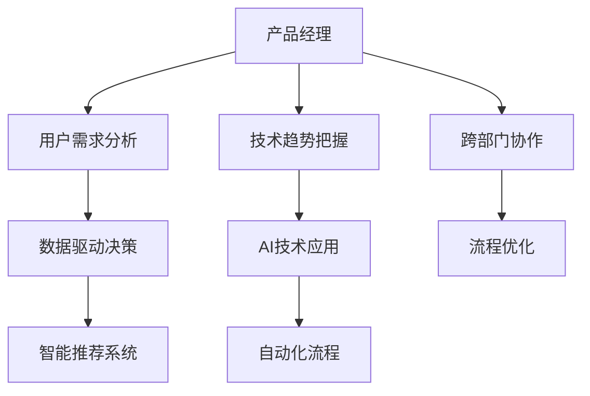

                 

关键词：贾扬清、产品经理、人工智能、产品形态创新、AI应用

摘要：在当今技术飞速发展的时代，人工智能（AI）的崛起正在深刻改变着各行各业。本文旨在探讨人工智能与产品经理结合的重要性，以及如何通过AI技术推动产品形态的创新应用。我们将深入分析贾扬清的观点，并探讨AI在产品管理中的实际应用，为未来产品创新提供思路和方向。

## 1. 背景介绍

随着大数据、云计算和深度学习等技术的不断发展，人工智能（AI）正在逐渐渗透到我们生活的方方面面。从智能手机的语音助手到自动驾驶汽车，从医疗诊断到金融风险管理，AI技术的应用范围不断扩大，其影响力也在日益增强。

在这样的背景下，产品经理的角色变得尤为重要。产品经理不仅要具备市场洞察力，理解用户需求，还需要具备技术敏感性，能够把握技术趋势，将新技术应用于产品开发中。贾扬清，作为人工智能领域的专家和知名产品经理，对AI与产品管理的结合有着深刻的见解。

## 2. 核心概念与联系

### 2.1 AI与产品经理的角色定位

人工智能（AI）与产品经理的结合，本质上是一种跨界合作。产品经理在AI时代扮演着连接用户与技术、市场与技术的桥梁角色。他们需要：

- **用户需求理解**：通过数据分析、用户访谈等方式，深入了解用户需求，并将这些需求转化为具体的产品功能。
- **技术趋势把握**：紧跟技术发展动态，识别出能够提升产品竞争力的AI技术，并推动产品创新。
- **跨部门协作**：协调研发、设计、市场等部门，确保产品从概念到市场化的全流程顺利推进。

AI在产品经理的日常工作中，可以从以下几个方面发挥关键作用：

- **数据分析与预测**：利用AI算法，对大量用户数据进行深入分析，预测用户行为，优化产品功能和用户体验。
- **智能推荐系统**：结合用户数据和机器学习算法，实现个性化的产品推荐，提高用户满意度和留存率。
- **自动化流程**：通过AI技术自动化处理重复性、繁琐的工作，提高产品经理的工作效率。

### 2.2 Mermaid 流程图



## 3. 核心算法原理 & 具体操作步骤

### 3.1 算法原理概述

在AI与产品经理的结合中，核心算法原理主要涉及以下方面：

- **机器学习**：通过训练模型，使计算机能够从数据中学习规律，进而预测或分类新数据。
- **深度学习**：一种特殊的机器学习技术，通过多层神经网络模型模拟人脑的思考方式，处理复杂的数据模式。
- **自然语言处理（NLP）**：使计算机能够理解、生成和处理人类语言的技术。

### 3.2 算法步骤详解

#### 3.2.1 数据收集与预处理

1. **数据收集**：收集用户行为数据、市场趋势数据等。
2. **数据预处理**：清洗数据，处理缺失值、异常值，进行数据标准化等。

#### 3.2.2 模型选择与训练

1. **模型选择**：根据具体任务选择合适的机器学习模型，如线性回归、决策树、神经网络等。
2. **模型训练**：使用预处理后的数据训练模型，调整参数，优化模型性能。

#### 3.2.3 模型评估与优化

1. **模型评估**：使用验证集或测试集评估模型性能，如准确率、召回率等。
2. **模型优化**：根据评估结果，调整模型参数，进行迭代优化。

#### 3.2.4 模型部署与应用

1. **模型部署**：将训练好的模型部署到生产环境中，如使用API接口提供服务。
2. **模型应用**：将模型应用于产品功能，如实现智能推荐、自动化流程等。

### 3.3 算法优缺点

#### 优点：

- **高效性**：通过算法自动化处理大量数据，提高工作效率。
- **准确性**：通过模型预测，提高决策的准确性和可靠性。
- **个性化**：根据用户数据，实现个性化推荐，提升用户体验。

#### 缺点：

- **数据依赖性**：算法的性能高度依赖于数据质量，数据不足或质量差会影响算法效果。
- **模型复杂性**：深度学习模型复杂，训练时间较长，资源消耗大。
- **解释性差**：机器学习模型往往是黑箱操作，难以解释其决策过程。

### 3.4 算法应用领域

- **推荐系统**：电商、社交媒体等平台广泛应用AI算法进行个性化推荐。
- **自动化流程**：工业制造、金融服务等领域通过AI自动化处理重复性任务。
- **智能诊断**：医疗领域利用AI进行疾病诊断，提高诊断准确率。
- **风险控制**：金融领域通过AI分析用户行为，预测风险，进行风险控制。

## 4. 数学模型和公式 & 详细讲解 & 举例说明

### 4.1 数学模型构建

在AI与产品经理的结合中，常见的数学模型包括：

- **线性回归模型**：用于预测连续值，如用户留存时间。
- **决策树模型**：用于分类任务，如用户流失预测。
- **神经网络模型**：用于处理复杂数据模式，如图像识别。

### 4.2 公式推导过程

以线性回归模型为例，其公式推导过程如下：

$$
y = \beta_0 + \beta_1 \cdot x + \epsilon
$$

其中，$y$ 是预测值，$x$ 是输入特征，$\beta_0$ 和 $\beta_1$ 是模型参数，$\epsilon$ 是误差项。

### 4.3 案例分析与讲解

以电商平台的商品推荐系统为例，分析如何利用线性回归模型预测用户购买概率。

1. **数据收集**：收集用户历史购买数据，包括用户ID、商品ID、购买时间等。
2. **数据预处理**：对数据进行清洗和标准化处理。
3. **模型训练**：使用线性回归模型进行训练，得到模型参数 $\beta_0$ 和 $\beta_1$。
4. **模型评估**：使用验证集评估模型性能，调整模型参数。
5. **模型应用**：将训练好的模型部署到生产环境中，实现商品推荐功能。

## 5. 项目实践：代码实例和详细解释说明

### 5.1 开发环境搭建

1. **安装Python环境**：下载并安装Python 3.x版本。
2. **安装依赖库**：使用pip命令安装必要的依赖库，如scikit-learn、numpy等。

### 5.2 源代码详细实现

以下是一个简单的线性回归模型实现的代码示例：

```python
import numpy as np
from sklearn.linear_model import LinearRegression

# 数据预处理
X = np.array([[1], [2], [3], [4], [5]])
y = np.array([1, 2, 2.5, 4, 5])

# 模型训练
model = LinearRegression()
model.fit(X, y)

# 模型评估
print("模型参数：", model.coef_, model.intercept_)

# 模型应用
new_data = np.array([[6]])
predicted_value = model.predict(new_data)
print("预测值：", predicted_value)
```

### 5.3 代码解读与分析

1. **数据预处理**：将输入数据X和目标值y转换为numpy数组格式。
2. **模型训练**：使用LinearRegression类创建线性回归模型，并调用fit方法进行训练。
3. **模型评估**：输出模型参数，包括系数和截距。
4. **模型应用**：使用predict方法对新的输入数据进行预测，并输出预测结果。

## 6. 实际应用场景

### 6.1 在电商平台的实际应用

电商平台可以利用AI技术，通过分析用户行为数据，实现个性化推荐，提高用户满意度和留存率。具体应用场景包括：

- **商品推荐**：根据用户浏览、购买历史，推荐相关商品。
- **购物车推荐**：分析购物车中的商品，推荐互补商品。
- **广告投放**：根据用户兴趣和行为，精准投放广告。

### 6.2 在金融领域的实际应用

金融领域可以利用AI技术，实现风险控制和智能投顾。具体应用场景包括：

- **风险控制**：分析用户交易数据，预测潜在风险，采取相应的风险控制措施。
- **智能投顾**：根据用户风险承受能力和投资偏好，提供个性化的投资建议。

### 6.3 在医疗领域的实际应用

医疗领域可以利用AI技术，实现疾病诊断和医疗资源优化。具体应用场景包括：

- **疾病诊断**：通过分析患者病史、实验室检查结果等数据，辅助医生进行疾病诊断。
- **医疗资源优化**：分析患者流量数据，优化医疗资源配置，提高医疗效率。

## 7. 工具和资源推荐

### 7.1 学习资源推荐

- **书籍**：《人工智能：一种现代的方法》、《深度学习》
- **在线课程**：Coursera上的《机器学习》、《深度学习》
- **教程**：scikit-learn官方文档、Keras官方文档

### 7.2 开发工具推荐

- **开发环境**：Jupyter Notebook、PyCharm
- **机器学习框架**：TensorFlow、PyTorch

### 7.3 相关论文推荐

- **推荐系统**：《基于协同过滤的推荐系统研究》
- **深度学习**：《深度学习在图像识别中的应用》
- **自然语言处理**：《基于BERT的自然语言处理技术》

## 8. 总结：未来发展趋势与挑战

### 8.1 研究成果总结

AI与产品经理的结合，已经取得了显著的成果。通过AI技术，产品经理能够更准确地理解用户需求，优化产品功能和用户体验。同时，AI在自动化流程、智能推荐等方面的应用，也大大提高了产品经理的工作效率。

### 8.2 未来发展趋势

随着AI技术的不断进步，未来产品经理与AI的结合将更加紧密。具体趋势包括：

- **更深入的用户需求分析**：通过更先进的算法，深入挖掘用户需求，实现个性化产品。
- **更多领域的AI应用**：AI将渗透到更多行业和领域，推动产品形态的多样化创新。
- **跨领域的AI融合**：AI技术与其他领域的结合，如生物信息学、物联网等，将带来更多的创新应用。

### 8.3 面临的挑战

尽管AI与产品经理的结合前景广阔，但仍面临一些挑战：

- **数据隐私与安全**：如何保护用户数据隐私，确保数据安全，是一个重要问题。
- **算法解释性**：如何提高算法的解释性，使其决策过程更加透明，是一个亟待解决的问题。
- **技术壁垒**：对于非技术人员来说，如何理解和应用AI技术，仍是一个挑战。

### 8.4 研究展望

未来的研究应重点关注以下几个方面：

- **数据隐私保护技术**：开发更有效的数据隐私保护技术，确保用户数据的安全。
- **算法透明性研究**：研究如何提高算法的解释性，使其决策过程更加透明。
- **跨领域AI融合**：探索AI与其他领域的结合，推动产品创新的多元化。

## 9. 附录：常见问题与解答

### 9.1 问题1：AI与产品经理的结合具体有哪些优势？

**解答**：AI与产品经理的结合主要优势包括：

- **更准确的用户需求分析**：通过AI算法，能够更准确地分析用户行为，预测用户需求。
- **个性化的产品推荐**：基于用户数据，实现个性化的产品推荐，提高用户满意度。
- **自动化流程优化**：利用AI自动化处理重复性任务，提高工作效率。

### 9.2 问题2：如何确保AI算法的解释性？

**解答**：确保AI算法的解释性可以从以下几个方面入手：

- **算法选择**：选择具有较高解释性的算法，如线性回归、决策树等。
- **算法优化**：在算法训练过程中，优化参数，提高模型的透明性。
- **可视化工具**：使用可视化工具，将算法的决策过程以图表形式呈现，帮助用户理解。

### 9.3 问题3：产品经理需要掌握哪些AI技术？

**解答**：产品经理需要掌握以下AI技术：

- **机器学习**：了解基本算法，如线性回归、决策树等。
- **深度学习**：了解神经网络模型，如卷积神经网络（CNN）、循环神经网络（RNN）等。
- **自然语言处理（NLP）**：了解文本分析、语义理解等基本概念。

作者：禅与计算机程序设计艺术 / Zen and the Art of Computer Programming

通过本文的探讨，我们深入分析了AI与产品经理结合的重要性，以及如何通过AI技术推动产品形态的创新应用。我们相信，随着AI技术的不断发展，产品经理的角色将在未来发挥更加重要的作用，为产品的创新和用户体验的提升提供源源不断的动力。

----------------------------------------------------------------

文章撰写完毕，感谢您的耐心阅读。如果您对文章有任何建议或意见，欢迎随时提出。期待与您共同探讨人工智能与产品管理领域的未来发展。再次感谢您的支持！作者：禅与计算机程序设计艺术 / Zen and the Art of Computer Programming。

