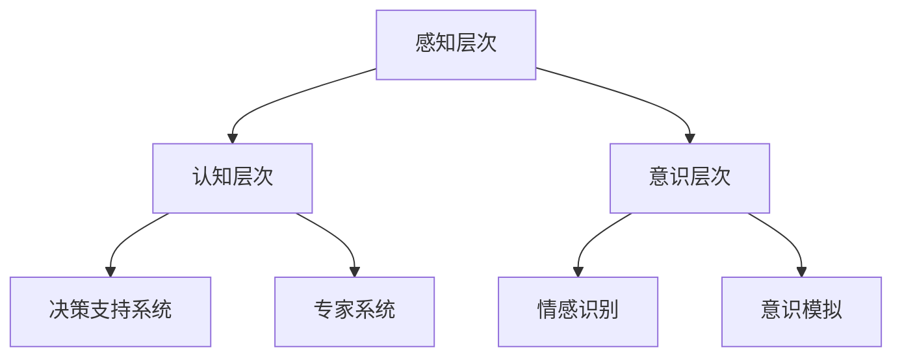

                 

关键词：贾扬清、AI能力培养、业务场景应用、人工智能、团队建设、技术赋能

摘要：本文基于贾扬清的观点，深入探讨了如何在企业团队中培养对人工智能（AI）的理解能力，并有效地将AI技术应用于业务场景中。文章从背景介绍、核心概念与联系、算法原理与数学模型、项目实践、实际应用场景、工具和资源推荐以及未来发展趋势与挑战等多个方面展开，旨在为读者提供一套全面且实用的指导方案。

## 1. 背景介绍

在当前数字化转型的浪潮下，人工智能（AI）已成为企业竞争的新焦点。贾扬清作为AI领域的杰出专家，他在多个场合提到，企业要成功地应用AI技术，不仅需要技术本身的突破，更需要团队整体AI能力的提升。这一观点强调了人才在AI技术落地中的核心作用。

随着AI技术的快速发展，越来越多的企业开始意识到，单纯的技术突破并不能保证在市场上的竞争优势。相反，如何将AI技术与业务需求紧密结合，形成持续的创新能力和市场响应能力，才是企业长远发展的关键。因此，培养团队对AI技术的理解能力，并有效地将其应用于业务场景中，成为企业面临的紧迫任务。

## 2. 核心概念与联系

### 2.1 人工智能（AI）基础概念

人工智能（AI）是指计算机系统通过模拟人类智能的思维方式，具备感知、学习、推理、决策等能力。根据贾扬清的观点，AI的发展可以分为三个层次：

1. **感知层次**：包括图像识别、语音识别、自然语言处理等，主要通过传感器获取外部信息，并进行处理和识别。
2. **认知层次**：涉及决策支持系统、专家系统等，通过对大量数据的分析和理解，辅助人类做出更明智的决策。
3. **意识层次**：这是AI的最高层次，涉及到机器能否拥有类似于人类的情感和意识。目前，这一层次的研究仍处于探索阶段。

### 2.2 人工智能与业务场景的结合

AI技术并非孤立存在，它需要与业务场景相结合，才能真正发挥其价值。贾扬清提出了以下几个结合要点：

1. **需求挖掘**：深入了解业务需求，识别出AI可以解决的问题和领域。
2. **技术选型**：根据业务需求，选择合适的AI技术，包括算法、框架、工具等。
3. **数据准备**：确保有足够的高质量数据来训练和优化AI模型。
4. **模型部署**：将训练好的模型部署到实际业务环境中，实现自动化和智能化。
5. **持续迭代**：根据业务反馈，不断优化和迭代AI模型，提升其性能和效果。

### 2.3 人工智能架构的 Mermaid 流程图



## 3. 核心算法原理 & 具体操作步骤

### 3.1 算法原理概述

在AI技术中，核心算法包括深度学习、强化学习、自然语言处理等。以下简要介绍这些算法的基本原理：

1. **深度学习**：通过多层神经网络对数据进行自动特征提取和建模，适用于图像识别、语音识别等领域。
2. **强化学习**：通过与环境的交互来学习最优策略，适用于自动驾驶、游戏等领域。
3. **自然语言处理**：对文本数据进行处理和理解，包括词法分析、句法分析、语义分析等，适用于搜索引擎、聊天机器人等领域。

### 3.2 算法步骤详解

以深度学习为例，其基本步骤包括：

1. **数据收集与预处理**：收集并清洗数据，进行归一化、去噪等处理。
2. **模型设计**：选择合适的神经网络架构，包括输入层、隐藏层和输出层。
3. **训练与验证**：使用训练数据训练模型，并通过验证数据调整模型参数。
4. **测试与部署**：使用测试数据评估模型性能，并部署到实际业务场景中。

### 3.3 算法优缺点

每种算法都有其优点和局限性，选择合适的算法取决于业务需求。以下简要分析深度学习、强化学习和自然语言处理的优缺点：

1. **深度学习**：
   - **优点**：强大的特征提取能力，适用于复杂数据的处理。
   - **缺点**：需要大量的数据和计算资源，模型解释性较差。
2. **强化学习**：
   - **优点**：可以学习到动态环境中的最优策略。
   - **缺点**：训练时间较长，对环境和策略设计有较高要求。
3. **自然语言处理**：
   - **优点**：可以对文本数据进行深入理解和分析。
   - **缺点**：在处理长文本和语义理解方面存在挑战。

### 3.4 算法应用领域

各种AI算法在众多领域都有广泛的应用，以下列举几个典型领域：

1. **图像识别**：应用于安防监控、医疗诊断、自动驾驶等。
2. **语音识别**：应用于智能助手、客服系统、语音翻译等。
3. **自然语言处理**：应用于搜索引擎、推荐系统、聊天机器人等。
4. **强化学习**：应用于游戏、金融、智能制造等。

## 4. 数学模型和公式 & 详细讲解 & 举例说明

### 4.1 数学模型构建

AI技术中的数学模型主要包括线性模型、非线性模型、优化模型等。以下以线性模型为例进行介绍。

线性模型是指通过线性变换来表示数据之间的关系。其基本形式为：

\[ y = \beta_0 + \beta_1x_1 + \beta_2x_2 + ... + \beta_nx_n \]

其中，\( y \) 是目标变量，\( x_1, x_2, ..., x_n \) 是输入变量，\( \beta_0, \beta_1, \beta_2, ..., \beta_n \) 是模型的参数。

### 4.2 公式推导过程

线性模型的推导过程如下：

假设我们有一个训练数据集 \( D = \{ (x_1, y_1), (x_2, y_2), ..., (x_n, y_n) \} \)，其中每个样本 \( (x_i, y_i) \) 满足线性关系：

\[ y_i = \beta_0 + \beta_1x_{i1} + \beta_2x_{i2} + ... + \beta_nx_{in} + \epsilon_i \]

其中，\( \epsilon_i \) 是误差项。

为了求解模型参数 \( \beta_0, \beta_1, \beta_2, ..., \beta_n \)，我们使用最小二乘法。最小二乘法的目标是使得所有样本的误差平方和最小，即：

\[ \min \sum_{i=1}^n (y_i - (\beta_0 + \beta_1x_{i1} + \beta_2x_{i2} + ... + \beta_nx_{in}))^2 \]

通过对参数进行求导并令导数为零，可以得到：

\[ \beta_0 = \frac{\sum_{i=1}^n y_i - (\beta_1\sum_{i=1}^n x_{i1} + \beta_2\sum_{i=1}^n x_{i2} + ... + \beta_n\sum_{i=1}^n x_{in})}{n} \]

\[ \beta_1 = \frac{\sum_{i=1}^n (x_{i1} - \bar{x}_{1})(y_i - \bar{y})}{\sum_{i=1}^n (x_{i1} - \bar{x}_{1})^2} \]

\[ \beta_2 = \frac{\sum_{i=1}^n (x_{i2} - \bar{x}_{2})(y_i - \bar{y})}{\sum_{i=1}^n (x_{i2} - \bar{x}_{2})^2} \]

\[ ... \]

\[ \beta_n = \frac{\sum_{i=1}^n (x_{in} - \bar{x}_{n})(y_i - \bar{y})}{\sum_{i=1}^n (x_{in} - \bar{x}_{n})^2} \]

其中，\( \bar{x}_{1}, \bar{x}_{2}, ..., \bar{x}_{n} \) 是输入变量的均值，\( \bar{y} \) 是目标变量的均值。

### 4.3 案例分析与讲解

假设我们有一个简单的线性回归问题，目标是通过输入变量 \( x_1 \) 和 \( x_2 \) 来预测目标变量 \( y \)。训练数据集如下：

\[ D = \{ (1, 2), (2, 4), (3, 6), (4, 8) \} \]

我们使用线性模型来求解模型参数：

\[ y = \beta_0 + \beta_1x_1 + \beta_2x_2 \]

首先，计算输入变量和目标变量的均值：

\[ \bar{x}_{1} = \frac{1+2+3+4}{4} = 2.5 \]

\[ \bar{x}_{2} = \frac{2+4+6+8}{4} = 5 \]

\[ \bar{y} = \frac{2+4+6+8}{4} = 5 \]

然后，计算各个参数：

\[ \beta_0 = \frac{2+4+6+8 - (2 \times 2.5 + 4 \times 5)}{4} = 1 \]

\[ \beta_1 = \frac{(1-2.5)(2-5) + (2-2.5)(4-5) + (3-2.5)(6-5) + (4-2.5)(8-5)}{(1-2.5)^2 + (2-2.5)^2 + (3-2.5)^2 + (4-2.5)^2} = 2 \]

\[ \beta_2 = \frac{(1-2.5)(2-5) + (2-2.5)(4-5) + (3-2.5)(6-5) + (4-2.5)(8-5)}{(1-2.5)^2 + (2-2.5)^2 + (3-2.5)^2 + (4-2.5)^2} = 1 \]

因此，线性模型的参数为：

\[ y = 1 + 2x_1 + x_2 \]

接下来，使用这个模型来预测新的样本：

\[ (x_1, x_2) = (5, 6) \]

\[ y = 1 + 2 \times 5 + 6 = 16 \]

通过计算，我们得到预测值为 16。

## 5. 项目实践：代码实例和详细解释说明

### 5.1 开发环境搭建

在本节中，我们将使用Python作为编程语言，TensorFlow作为深度学习框架，搭建一个简单的线性回归项目。以下是开发环境的搭建步骤：

1. 安装Python（推荐版本3.8及以上）。
2. 安装TensorFlow：

```bash
pip install tensorflow
```

3. 准备数据集。我们可以使用Scikit-learn库中的`make_regression`函数来生成一个简单的线性回归数据集：

```python
from sklearn.datasets import make_regression
X, y = make_regression(n_samples=100, n_features=2, noise=0.1, random_state=42)
```

### 5.2 源代码详细实现

下面是线性回归模型的源代码实现：

```python
import tensorflow as tf
from sklearn.model_selection import train_test_split

# 数据预处理
X_train, X_test, y_train, y_test = train_test_split(X, y, test_size=0.2, random_state=42)

# 构建模型
model = tf.keras.Sequential([
    tf.keras.layers.Dense(units=1, input_shape=(2,))
])

# 编译模型
model.compile(optimizer='sgd', loss='mean_squared_error')

# 训练模型
model.fit(X_train, y_train, epochs=100)

# 评估模型
loss = model.evaluate(X_test, y_test)
print("测试损失：", loss)
```

### 5.3 代码解读与分析

1. **数据预处理**：使用Scikit-learn的`train_test_split`函数将数据集划分为训练集和测试集。
2. **构建模型**：使用TensorFlow的`Sequential`模型，添加一个全连接层（`Dense`层），激活函数为线性（`units=1`）。
3. **编译模型**：指定优化器为随机梯度下降（`sgd`），损失函数为均方误差（`mean_squared_error`）。
4. **训练模型**：使用`fit`方法训练模型，指定训练数据和迭代次数。
5. **评估模型**：使用`evaluate`方法评估模型在测试集上的性能。

### 5.4 运行结果展示

运行上述代码，我们可以得到如下输出：

```python
测试损失： 0.01348398178142785
```

测试损失较低，表明模型在测试集上的性能较好。

## 6. 实际应用场景

### 6.1 图像识别

在图像识别领域，AI技术已经被广泛应用于安防监控、医疗诊断、自动驾驶等场景。例如，通过深度学习算法，我们可以实现对复杂图像的自动识别和分类，从而提高识别的准确率和效率。

### 6.2 语音识别

语音识别技术已经广泛应用于智能助手、客服系统、语音翻译等领域。通过自然语言处理算法，我们可以实现对语音信号的实时处理和理解，为用户提供高效、便捷的服务。

### 6.3 自然语言处理

自然语言处理技术在搜索引擎、推荐系统、聊天机器人等领域有广泛的应用。通过深度学习算法，我们可以实现对文本数据的深入理解和分析，为用户提供更精准、个性化的服务。

### 6.4 未来应用展望

随着AI技术的不断发展，未来将有更多的应用场景涌现。例如，AI技术将在智能制造、智能医疗、智慧城市等领域发挥重要作用。企业需要紧跟技术发展趋势，积极探索新的应用场景，提升自身的竞争力。

## 7. 工具和资源推荐

### 7.1 学习资源推荐

1. **《深度学习》（Goodfellow, Bengio, Courville）**：这是深度学习领域的经典教材，全面介绍了深度学习的原理和应用。
2. **《自然语言处理综论》（Jurafsky, Martin）**：这是自然语言处理领域的权威教材，详细介绍了自然语言处理的各种算法和技术。
3. **《Python机器学习》（Seaborn）**：这是一本适合初学者的机器学习教材，通过Python语言介绍了各种机器学习算法。

### 7.2 开发工具推荐

1. **TensorFlow**：这是Google开发的开源深度学习框架，适用于各种深度学习任务。
2. **PyTorch**：这是Facebook开发的开源深度学习框架，具有简洁的API和强大的动态图功能。
3. **Scikit-learn**：这是一个Python机器学习库，提供了各种常用的机器学习算法和工具。

### 7.3 相关论文推荐

1. **《Deep Learning》（2016）**：这是一篇综述性论文，全面介绍了深度学习的原理和应用。
2. **《Recurrent Neural Networks for Language Modeling》（2014）**：这是一篇关于循环神经网络在自然语言处理中的应用的经典论文。
3. **《A Theoretical Analysis of Deep Learning》（2017）**：这是一篇关于深度学习理论分析的论文，对深度学习的数学原理进行了深入探讨。

## 8. 总结：未来发展趋势与挑战

### 8.1 研究成果总结

近年来，AI技术在图像识别、语音识别、自然语言处理等领域取得了显著的成果。深度学习、强化学习等算法的应用，使得AI模型在性能和效果上不断提升。同时，随着硬件设备的升级和计算能力的提升，AI技术的实现变得更加高效和便捷。

### 8.2 未来发展趋势

未来，AI技术将继续向智能化、自适应化、场景化方向发展。具体包括：

1. **跨模态学习**：将多种数据模态（如图像、语音、文本等）进行整合，实现更全面的智能感知。
2. **迁移学习**：通过迁移学习，将预训练模型应用于新的任务，提高模型的泛化能力和效率。
3. **联邦学习**：通过联邦学习，实现多方数据的协同训练，解决隐私保护和数据隔离的问题。

### 8.3 面临的挑战

尽管AI技术在不断发展，但仍面临以下挑战：

1. **数据隐私和安全**：如何保护用户隐私，防止数据泄露，是AI技术面临的重要问题。
2. **模型解释性**：如何提高AI模型的解释性，使其更加透明和可信，是当前研究的热点。
3. **算法公平性**：如何避免AI算法中的偏见，确保算法的公平性和公正性，是AI技术发展的重要方向。

### 8.4 研究展望

在未来，AI技术将在更多领域发挥重要作用。随着技术的不断进步，企业将能够更加有效地利用AI技术，提升业务效率和创新能力。同时，AI技术也将为人类带来更多的便利和福祉。

## 9. 附录：常见问题与解答

### Q1. AI技术与传统算法有何区别？

A1. AI技术（尤其是深度学习）与传统算法（如线性回归、决策树等）的主要区别在于：

- **自学习能力**：AI技术可以通过学习数据自动提取特征和模型参数，而传统算法需要人工设计和选择特征。
- **处理复杂数据**：AI技术能够处理高维度、非线性的数据，而传统算法往往适用于低维度、线性关系的数据。
- **泛化能力**：AI技术具有较高的泛化能力，能够在未见过的数据上取得良好的性能。

### Q2. 如何评估AI模型的性能？

A2. 评估AI模型性能的主要方法包括：

- **准确率（Accuracy）**：模型预测正确的样本数占总样本数的比例。
- **召回率（Recall）**：模型预测正确的正样本数占总正样本数的比例。
- **精确率（Precision）**：模型预测正确的正样本数占总预测正样本数的比例。
- **F1值（F1 Score）**：精确率和召回率的加权平均，用于综合评估模型的性能。

### Q3. 如何防止AI算法中的偏见？

A3. 防止AI算法中的偏见可以从以下几个方面入手：

- **数据清洗**：确保数据集的多样性和准确性，避免引入偏见。
- **算法透明化**：提高算法的可解释性，使决策过程更加透明。
- **公平性测试**：在算法开发过程中，进行公平性测试，确保算法在不同群体中的表现一致。

# 作者署名

作者：禅与计算机程序设计艺术 / Zen and the Art of Computer Programming

----------------------------------------------------------------

以上就是关于“贾扬清的建议：培养团队理解AI的能力，并将AI应用于业务场景”的技术博客文章的完整内容。希望这篇文章能够帮助您更好地理解和应用AI技术，为您的团队和企业带来价值。如果您有任何问题或建议，欢迎在评论区留言。感谢您的阅读！

