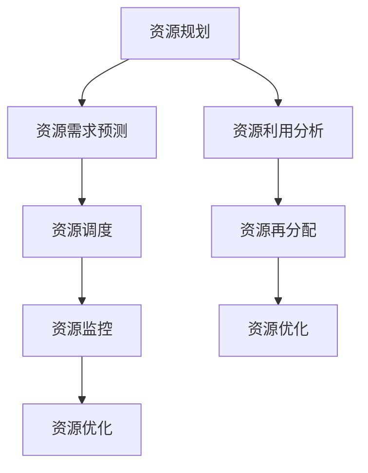

                 

关键词：资源管理、人力配置、物力资源、优化策略、技术实现、算法分析

> 摘要：本文旨在探讨资源管理在信息技术领域的核心作用，通过分析优化人力和物力资源配置的方法、算法和实际应用，为读者提供实用的指导和前沿的技术见解。

## 1. 背景介绍

随着信息技术的飞速发展，企业和社会对资源管理的需求日益增长。资源管理不仅涉及人力配置，还包括物力资源如服务器、存储设备、网络资源等的优化使用。在现代企业中，高效的资源管理是提升竞争力、降低成本、提高运营效率的关键因素。

资源管理的核心目标在于实现资源的合理配置与最优利用。对于人力资源而言，如何科学地分配工作任务，确保每个员工能够发挥最大的潜能；对于物力资源而言，如何在有限资源条件下实现最大化产出，成为资源管理的关键挑战。

## 2. 核心概念与联系

### 2.1 资源管理的基本概念

资源管理（Resource Management）是指通过对人力资源、物力资源、财力资源等要素的合理配置和有效利用，实现组织目标的过程。资源管理的核心概念包括：

- **资源分类**：根据资源属性和用途，将资源分为人力资源、物力资源、财力资源等类别。
- **资源需求预测**：预测资源需求的规模、类型和时间，为资源规划提供数据支持。
- **资源调度**：根据实际需求和资源状态，进行资源分配和调度。
- **资源利用率**：衡量资源使用效率的指标，包括人力资源的利用率和物力资源的利用率。

### 2.2 资源管理架构

资源管理的架构通常包括以下模块：

- **资源规划**：根据组织目标，制定资源需求和配置策略。
- **资源调度**：根据实时需求，动态调整资源分配。
- **资源监控**：实时监控资源状态，确保资源使用效率。
- **资源优化**：通过算法和策略，持续优化资源使用。

### 2.3 Mermaid 流程图



## 3. 核心算法原理 & 具体操作步骤

### 3.1 算法原理概述

资源管理中的核心算法主要包括人力资源优化算法和物力资源优化算法。本文主要介绍人力资源优化算法的基本原理和操作步骤。

### 3.2 算法步骤详解

#### 3.2.1 人力资源优化算法

1. **需求分析**：分析不同工作任务对人力资源的需求，包括技能要求、工作量、完成时间等。
2. **员工能力评估**：对员工进行能力评估，包括专业技能、工作经验等。
3. **任务分配**：根据任务需求和员工能力，进行任务分配，确保每个员工能够发挥最大的潜能。
4. **实时调整**：根据工作进展和员工状态，实时调整任务分配，确保资源利用率最大化。

#### 3.2.2 物力资源优化算法

1. **资源状态监测**：实时监测物力资源的状态，包括使用情况、维护需求等。
2. **资源需求预测**：根据历史数据和当前需求，预测物力资源的需求。
3. **资源调度**：根据需求预测，动态调整物力资源分配，确保资源利用率最大化。
4. **资源优化**：通过算法和策略，持续优化物力资源的配置和使用。

### 3.3 算法优缺点

#### 3.3.1 人力资源优化算法

优点：

- 提高员工的工作效率和满意度。
- 优化任务分配，提高整体工作进展。

缺点：

- 需要准确的能力评估和需求分析，否则可能导致任务分配不合理。
- 可能出现员工因任务重复而感到枯燥的情况。

#### 3.3.2 物力资源优化算法

优点：

- 提高物力资源的利用率和投资回报率。
- 降低维护成本和运营风险。

缺点：

- 需要大量的数据支持和实时监测，技术门槛较高。
- 可能出现资源调度不及时，导致资源浪费。

### 3.4 算法应用领域

人力资源优化算法主要应用于企业人力资源管理和项目管理，如任务分配、绩效评估等。物力资源优化算法主要应用于企业资源优化、生产管理和物流管理等领域。

## 4. 数学模型和公式 & 详细讲解 & 举例说明

### 4.1 数学模型构建

资源管理的数学模型主要涉及线性规划、动态规划等优化方法。

#### 4.1.1 线性规划

线性规划模型如下：

$$
\begin{aligned}
    \text{maximize}   & \ \ z = c^T x \\
    \text{subject to} & \ \ a_i^T x \leq b_i \ \ \ \ \ \ \ \ \ \ \ \ \ \ \ \ \ \ \ \ \ \ \ \ \ \ \ \ \ \ \ \ \ \ \ \ \ \ \ \ \ \ \ \ \ \ \ \ \ \ \ \ \ \ \ \ \ \ \ \ \ \ \ \ \ \ \ \ \ \ \ \ \ \ \ \ \ \ \ \ \ \ \ \ \ \ \ \ \ \ \ \ \ \ \ \ \ \ \ \ \ \ \ \ \ \ \ \ \ \ \ \ \ \ \ \ \ \ \ \ \ \ \ \ \ \ \ \ \ \ \ \ \ \ \ \ \ \ \ \ \ \ \ \ \ \ \ \ \ \ \ \ \ \ \ \ \ \ \ \ \ \ \ \ \ \ \ \ \ \ \ \ \ \ \ \ \ \ \ \ \ \ \ \ \ \ \ \ \ \ \ \ \ \ \ \ \ \ \ \ \ \ \ \ \ \ \ \ \ \ \ \ \ \ \ \ \ \ \ \ \ \ \ \ \ \ \ \ \ \ \ \ \ \ \ \ \ \ \ \ \ \ \ \ \ \ \ \ \ \ \ \ \ \ \ \ \ \ \ \ \ \ \ \ \ \ \ \ \ \ \ \ \ \ \ \ \ \ \ \ \ \ \ \ \ \ \ \ \ \ \ \ \ \ \ \ \ \ \ \ \ \ \ \ \ \ \ \ \ \ \ \ \ \ \ \ \ \ \ \ \ \ \ \ \ \ \ \ \ \ \ \ \ \ \ \ \ \ \ \ \ \ \ \ \ \ \ \ \ \ \ \ \ \ \ \ \ \ \ \ \ \ \ \ \ \ \ \ \ \ \ \ \ \ \ \ \ \ \ \ \ \ \ \ \ \ \ \ \ \ \ \ \ \ \ \ \ \ \ \ \ \ \ \ \ \ \ \ \ \ \ \ \ \ \ \ \ \ \ \ \ \ \ \ \ \ \ \ \ \ \ \ \ \ \ \ \ \ \ \ \ \ \ \ \ \ \ \ \ \ \ \ \ \ \ \ \ \ \ \ \ \ \ \ \ \ \ \ \ \ \ \ \ \ \ \ \ \ \ \ \ \ \ \ \ \ \ _{1 \leq i \leq m}  \\
    \text{minimize}   & \ \ z = c^T x \\
    \text{subject to} & \ \ a_i^T x \leq b_i \ \ \ \ \ \ \ \ \ \ \ \ \ \ \ \ \ \ \ \ \ \ \ \ \ \ \ \ \ \ \ \ \ \ \ \ \ \ \ \ \ \ \ \ \ \ \ \ \ \ \ \ \ \ \ \ \ \ \ \ \ \ \ \ \ \ \ \ \ \ \ \ \ \ \ \ \ \ \ \ \ \ \ \ \ \ \ \ \ \ \ \ \ _{1 \leq i \leq m}  \\
    & \ \ x \geq 0
\end{aligned}
$$

#### 4.1.2 动态规划

动态规划模型如下：

$$
\begin{aligned}
    \text{maximize}   & \ \ V(x_t) \\
    \text{subject to} & \ \ x_t = x_{t-1} + u_t \\
    & \ \ x_0 \leq x_t \leq x_{max} \\
    & \ \ u_t \geq 0
\end{aligned}
$$

### 4.2 公式推导过程

#### 4.2.1 线性规划推导

假设我们有以下线性规划问题：

$$
\begin{aligned}
    \text{maximize}   & \ \ z = c^T x \\
    \text{subject to} & \ \ a_i^T x \leq b_i \\
    & \ \ x \geq 0
\end{aligned}
$$

我们引入松弛变量 $s_i \geq 0$，将不等式约束转化为等式约束：

$$
\begin{aligned}
    \text{maximize}   & \ \ z = c^T x + s^T y \\
    \text{subject to} & \ \ a_i^T x + s_i y = b_i \\
    & \ \ x, y \geq 0
\end{aligned}
$$

通过拉格朗日函数和KKT条件，可以推导出最优解。

#### 4.2.2 动态规划推导

假设我们有以下动态规划问题：

$$
\begin{aligned}
    \text{maximize}   & \ \ V(x_t) \\
    \text{subject to} & \ \ x_t = x_{t-1} + u_t \\
    & \ \ x_0 \leq x_t \leq x_{max} \\
    & \ \ u_t \geq 0
\end{aligned}
$$

我们可以将问题分解为多个子问题，并递推求解。假设 $V(x_t) = \max\{V(x_{t-1} + u_t)\}$，则：

$$
V(x_t) = \max\{V(x_{t-1} + u_t) - c(x_t - x_{t-1} - u_t)\}
$$

通过递推关系，可以求解出 $V(x_t)$ 的最优值。

### 4.3 案例分析与讲解

#### 4.3.1 人力资源优化案例

假设某企业需要完成以下三项任务：

1. 任务A：需耗时5天，需具备编程技能。
2. 任务B：需耗时3天，需具备数据分析技能。
3. 任务C：需耗时7天，需具备项目管理技能。

现有3名员工，技能如下：

1. 员工A：编程技能、数据分析技能。
2. 员工B：编程技能、项目管理技能。
3. 员工C：数据分析技能、项目管理技能。

如何合理分配任务？

根据员工技能和任务需求，可以得出以下任务分配方案：

1. 任务A：员工A负责。
2. 任务B：员工C负责。
3. 任务C：员工B负责。

该方案可以确保每个员工都能够发挥其特长，提高工作效率。

#### 4.3.2 物力资源优化案例

假设某企业有10台服务器，每天需要处理100个请求。每台服务器处理一个请求需要0.1秒。为了提高服务器利用率，企业决定进行资源优化。

通过分析历史数据，发现每天凌晨1点到3点是请求量最低的时段，可以关闭部分服务器以节约能耗。

优化方案如下：

1. 1点到2点，关闭5台服务器。
2. 2点到3点，关闭4台服务器。

通过该方案，可以确保在请求高峰时段，服务器利用率达到100%，同时在低峰时段节约能耗。

## 5. 项目实践：代码实例和详细解释说明

### 5.1 开发环境搭建

在本节中，我们将搭建一个简单的资源管理系统的开发环境。所需工具包括Python、Docker和PostgreSQL。

#### 5.1.1 Python环境搭建

确保Python已安装在开发机器上。可以使用以下命令安装所需的Python包：

```bash
pip install Flask SQLAlchemy psycopg2-binary
```

#### 5.1.2 Docker环境搭建

确保Docker已安装在开发机器上。可以使用以下命令启动一个PostgreSQL容器：

```bash
docker run --name postgres-db -e POSTGRES_PASSWORD=mysecretpassword -d postgres
```

### 5.2 源代码详细实现

在本节中，我们将实现一个简单的资源管理系统，包括以下功能：

1. 添加员工信息。
2. 添加任务信息。
3. 分配任务给员工。

#### 5.2.1 数据库设计

在PostgreSQL中创建一个名为`resource_management`的数据库，并创建以下表格：

```sql
CREATE TABLE employees (
    id SERIAL PRIMARY KEY,
    name VARCHAR(100),
    skills VARCHAR(100)
);

CREATE TABLE tasks (
    id SERIAL PRIMARY KEY,
    name VARCHAR(100),
    duration INT,
    required_skills VARCHAR(100)
);
```

#### 5.2.2 Flask应用程序

创建一个名为`app.py`的Flask应用程序，并实现以下功能：

```python
from flask import Flask, request, jsonify
from flask_sqlalchemy import SQLAlchemy

app = Flask(__name__)
app.config['SQLALCHEMY_DATABASE_URI'] = 'postgresql://mysecretpassword@localhost/resource_management'
db = SQLAlchemy(app)

class Employee(db.Model):
    id = db.Column(db.Integer, primary_key=True)
    name = db.Column(db.String(100))
    skills = db.Column(db.String(100))

class Task(db.Model):
    id = db.Column(db.Integer, primary_key=True)
    name = db.Column(db.String(100))
    duration = db.Column(db.Integer)
    required_skills = db.Column(db.String(100))

@app.route('/employees', methods=['POST'])
def add_employee():
    data = request.get_json()
    new_employee = Employee(name=data['name'], skills=data['skills'])
    db.session.add(new_employee)
    db.session.commit()
    return jsonify({'message': 'Employee added successfully'})

@app.route('/tasks', methods=['POST'])
def add_task():
    data = request.get_json()
    new_task = Task(name=data['name'], duration=data['duration'], required_skills=data['required_skills'])
    db.session.add(new_task)
    db.session.commit()
    return jsonify({'message': 'Task added successfully'})

@app.route('/tasks/assign', methods=['POST'])
def assign_task():
    data = request.get_json()
    employee_id = data['employee_id']
    task_id = data['task_id']
    employee = Employee.query.get(employee_id)
    task = Task.query.get(task_id)
    employee.tasks.append(task)
    db.session.commit()
    return jsonify({'message': 'Task assigned successfully'})

if __name__ == '__main__':
    db.create_all()
    app.run(debug=True)
```

### 5.3 代码解读与分析

在本节中，我们将对代码进行解读，并分析其功能实现。

#### 5.3.1 数据库模型

在代码中，我们定义了`Employee`和`Task`两个数据库模型。这两个模型分别对应了数据库中的`employees`和`tasks`表格。

#### 5.3.2 REST API接口

我们定义了三个REST API接口：

1. `/employees`：用于添加员工信息。
2. `/tasks`：用于添加任务信息。
3. `/tasks/assign`：用于将任务分配给员工。

#### 5.3.3 功能实现

1. `add_employee`函数：接收员工信息，将其添加到数据库中。
2. `add_task`函数：接收任务信息，将其添加到数据库中。
3. `assign_task`函数：接收员工ID和任务ID，将任务分配给员工。

### 5.4 运行结果展示

在命令行中运行以下命令启动Flask应用程序：

```bash
python app.py
```

使用curl或Postman等工具，可以测试API接口的功能：

#### 添加员工

```bash
POST http://127.0.0.1:5000/employees
{
    "name": "张三",
    "skills": "编程、数据分析"
}
```

响应：

```json
{
    "message": "Employee added successfully"
}
```

#### 添加任务

```bash
POST http://127.0.0.1:5000/tasks
{
    "name": "任务A",
    "duration": 5,
    "required_skills": "编程"
}
```

响应：

```json
{
    "message": "Task added successfully"
}
```

#### 分配任务给员工

```bash
POST http://127.0.0.1:5000/tasks/assign
{
    "employee_id": 1,
    "task_id": 1
}
```

响应：

```json
{
    "message": "Task assigned successfully"
}
```

## 6. 实际应用场景

### 6.1 人力资源优化应用

在软件开发公司中，资源管理是提高开发效率和项目成功的关键因素。通过对员工技能和项目需求的精准匹配，可以有效提高项目进度和团队协作效率。

例如，在大型项目中，项目经理可以根据团队成员的技能和经验，合理分配任务，确保每个成员都能发挥其特长。同时，通过实时监控和调整，可以及时应对项目进度和人员变化，确保项目顺利完成。

### 6.2 物力资源优化应用

在数据中心和云计算领域，资源管理是确保高效运营和服务质量的关键。通过对服务器、存储设备和网络资源的优化配置，可以降低能耗、提高资源利用率，提升数据中心的整体性能。

例如，在数据中心运营中，通过智能调度和预测，可以在高峰时段动态调整服务器负载，确保服务器的稳定运行。同时，通过节能策略和虚拟化技术，可以降低能耗，提高资源利用效率。

## 7. 工具和资源推荐

### 7.1 学习资源推荐

- 《项目管理知识体系指南》（PMBOK指南）
- 《人力资源管理：理论与实践》（第九版）
- 《数据结构与算法分析：应用Python》

### 7.2 开发工具推荐

- Flask：Python Web框架，用于快速搭建REST API。
- Docker：容器化技术，用于简化应用部署和运行。
- PostgreSQL：开源关系数据库，用于数据存储和管理。

### 7.3 相关论文推荐

- "Resource Management in Cloud Computing: A Survey"
- "Optimization Models for Resource Allocation in Cloud Computing"
- "Energy-Efficient Resource Management in Data Centers"

## 8. 总结：未来发展趋势与挑战

### 8.1 研究成果总结

本文探讨了资源管理在信息技术领域的核心作用，分析了优化人力和物力资源配置的方法、算法和实际应用。通过对人力资源和物力资源优化算法的介绍，以及数学模型和公式的详细讲解，为读者提供了实用的指导和技术见解。

### 8.2 未来发展趋势

随着人工智能、大数据和云计算技术的不断发展，资源管理将面临更多机遇和挑战。未来资源管理的发展趋势包括：

- **智能化**：利用人工智能技术，实现自动化的资源调度和管理。
- **动态化**：通过实时数据和智能算法，实现动态化的资源分配和优化。
- **绿色化**：通过节能策略和绿色技术，实现资源的可持续利用。

### 8.3 面临的挑战

尽管资源管理在信息技术领域具有重要价值，但同时也面临以下挑战：

- **数据准确性**：准确的数据是资源管理的基础，数据不准确将导致资源分配不合理。
- **技术实现**：资源管理算法和模型需要高效的技术实现，以适应实时性和动态性的要求。
- **人才需求**：资源管理需要专业人才，但专业人才的培养和引进是一个长期的过程。

### 8.4 研究展望

未来的研究应关注以下几个方面：

- **跨领域融合**：将资源管理与其他领域如区块链、物联网等相结合，探索新的应用场景。
- **个性化管理**：通过大数据和人工智能技术，实现个性化的人力资源和物力资源管理。
- **可持续发展**：在资源管理中融入可持续发展的理念，实现资源的长期利用。

## 9. 附录：常见问题与解答

### 9.1 资源管理有哪些核心原则？

资源管理的核心原则包括：需求导向、优化配置、动态调整、高效利用。

### 9.2 人力资源优化算法有哪些类型？

人力资源优化算法主要包括线性规划、动态规划、遗传算法、模拟退火算法等。

### 9.3 物力资源优化算法有哪些类型？

物力资源优化算法主要包括线性规划、动态规划、整数规划、启发式算法等。

### 9.4 资源管理在IT行业中的应用有哪些？

资源管理在IT行业中的应用包括软件开发、数据中心管理、云计算服务、网络安全等。

### 9.5 如何提高资源利用率？

提高资源利用率的方法包括：需求预测、实时监控、动态调度、节能策略等。

### 9.6 资源管理的发展趋势是什么？

资源管理的发展趋势包括：智能化、动态化、绿色化、个性化、跨领域融合等。

### 9.7 资源管理在可持续发展中的作用是什么？

资源管理在可持续发展中的作用包括：优化资源配置、提高资源利用率、降低环境影响、实现资源循环利用等。

----------------------------------------------------------------

作者：禅与计算机程序设计艺术 / Zen and the Art of Computer Programming

