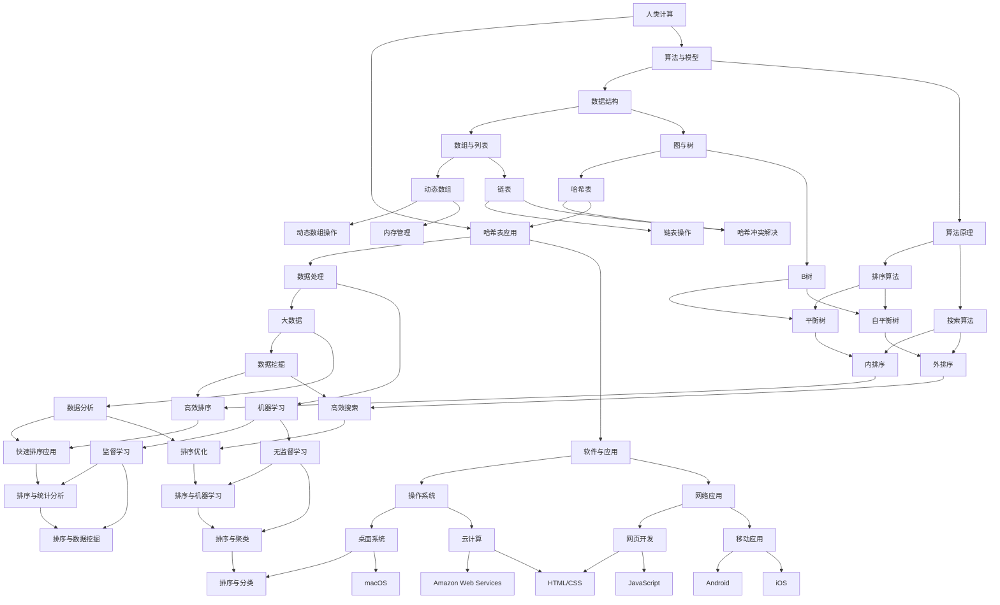

                 

关键词：人类计算，社会价值，赋能，个人发展，社区协作

> 摘要：本文深入探讨了人类计算在社会中的价值与作用，阐述了如何通过赋能个人和社区，实现技术的普及与应用，提升人类生活质量与工作效率。文章通过案例分析、算法原理、数学模型以及实际应用等多个维度，全面展示了人类计算对社会发展的积极影响，并提出了未来的发展趋势与挑战。

## 1. 背景介绍

在信息技术迅猛发展的今天，人类计算作为计算机科学的核心概念，已经深深影响了我们的日常生活和工作方式。从早期的计算机硬件到现代的软件应用，人类计算在数据处理、信息存储、知识传播等方面发挥了巨大的作用。然而，人类计算的社会价值不仅仅体现在技术层面，更在于它对个人与社区产生的深远的正面影响。

随着互联网的普及和人工智能技术的发展，人类计算的应用范围不断扩展，从简单的计算任务到复杂的决策支持系统，都在依赖人类计算的力量。在这个背景下，如何更好地赋能个人和社区，成为了一个亟待解决的问题。本文将围绕这一主题，探讨人类计算在社会中的价值与作用。

### 1.1 人类计算的定义与发展历程

人类计算，简单来说，是指人类利用计算机和算法解决实际问题的方式。它涵盖了从计算机硬件的发明、软件的发展，到人工智能算法的应用等多个方面。人类计算的发展历程可以分为以下几个阶段：

1. **计算机硬件阶段**：从1940年代第一台电子计算机的诞生，到1960年代的晶体管计算机和1970年代的微处理器计算机，计算机硬件的发展为人类计算奠定了基础。
2. **软件革命阶段**：从1970年代末到1990年代，软件成为计算机应用的核心，操作系统、数据库、编译器等软件工具的广泛应用，使得计算机的功能得以充分发挥。
3. **互联网时代**：1990年代互联网的普及，使得计算机的应用范围进一步扩大，从企业到个人，从科研到日常生活，互联网成为了人类计算的重要载体。
4. **人工智能时代**：近年来，人工智能技术的快速发展，使得计算机不再只是执行预设任务的工具，而是能够自主学习和适应环境的高级智能体。人类计算进入了一个全新的阶段。

### 1.2 人类计算与社会发展的关系

人类计算不仅改变了我们生活的方式，也在很大程度上推动了社会的发展。以下是几个关键方面：

1. **生产效率提升**：计算机和算法的广泛应用，使得许多传统行业实现了自动化和智能化，大幅提高了生产效率。例如，在制造业中，计算机辅助设计（CAD）和计算机辅助制造（CAM）技术的应用，使得产品设计和生产过程更加高效和精确。
2. **信息传播加速**：互联网和社交媒体的兴起，使得信息的传播速度大大加快。人们可以随时随地获取全球范围内的新闻、资讯和知识，这极大地促进了知识的传播和共享。
3. **生活质量提高**：计算机和互联网技术在医疗、教育、娱乐等领域的应用，使得人们的生活质量得到了显著提升。例如，在线教育平台的出现，使得教育资源更加丰富和普及，人们可以通过网络学习各种知识和技能。
4. **社会问题解决**：计算机技术在许多社会问题的解决中发挥了重要作用。例如，在环境保护领域，通过大数据分析和人工智能算法，可以更有效地监控和预测环境变化，提出针对性的解决方案。

## 2. 核心概念与联系

为了深入理解人类计算的社会价值，我们需要探讨一些核心概念和它们之间的联系。以下是一个使用Mermaid绘制的流程图，展示了这些概念和它们的关联：



### 2.1 核心概念

以下是本文中涉及的一些核心概念及其简要解释：

- **计算能力**：指计算机系统处理信息的能力，包括硬件性能和软件算法的效率。
- **算法与模型**：算法是解决问题的一系列步骤，模型则是根据特定问题设计的数学或逻辑框架。
- **数据处理**：涉及数据的收集、存储、处理和分析，包括大数据、机器学习等技术。
- **软件与应用**：包括操作系统、网络应用、移动应用等，它们使得计算能力得以应用于各种场景。
- **数据结构**：用于组织和存储数据的特定数据组织方式，如数组、链表、图和树等。
- **算法原理**：算法的基本原理和实现方法，如排序算法、搜索算法等。
- **大数据**：指大量、复杂和高速增长的数据，需要特殊的方法和技术来处理。
- **机器学习**：通过数据和算法训练计算机，使其能够从数据中学习并做出预测或决策。
- **操作系统**：管理计算机硬件和软件资源的系统软件，包括桌面系统、云计算等。
- **网络应用**：在互联网环境中运行的应用程序，包括网页开发、移动应用等。
- **排序算法**：用于将数据按照特定顺序排列的算法，如快速排序、归并排序等。
- **搜索算法**：用于在数据集合中查找特定元素的算法，如二分搜索、广度优先搜索等。
- **数据挖掘**：从大量数据中发现隐藏模式、趋势和知识的过程。

### 2.2 核心概念的联系

核心概念之间的联系构成了人类计算的基础架构。例如，算法与模型依赖于数据结构和计算能力，而数据处理又依赖于大数据和机器学习技术。操作系统和网络应用则提供了计算能力的应用平台，使得各种算法和模型得以在实践中发挥作用。通过这些核心概念的联系，我们可以更好地理解人类计算在社会中的价值与作用。

## 3. 核心算法原理 & 具体操作步骤

### 3.1 算法原理概述

在人类计算中，算法是解决问题的重要工具。以下是几种核心算法的原理概述：

- **排序算法**：用于将数据集合按照特定顺序排列的算法。常见的排序算法包括快速排序、归并排序、冒泡排序等。
- **搜索算法**：用于在数据集合中查找特定元素的算法。常见的搜索算法包括二分搜索、广度优先搜索、深度优先搜索等。
- **数据结构**：用于组织和存储数据的特定数据组织方式。常见的数据结构包括数组、链表、栈、队列、树、图等。
- **机器学习算法**：通过数据和算法训练计算机，使其能够从数据中学习并做出预测或决策。常见的机器学习算法包括线性回归、逻辑回归、决策树、支持向量机、聚类算法等。

### 3.2 算法步骤详解

以下是这些算法的具体操作步骤：

#### 3.2.1 快速排序

快速排序是一种高效的排序算法，其基本思想是通过一趟排序将待排序的记录分割成独立的两部分，其中一部分记录的关键字均比另一部分的关键字小，则可分别对这两部分记录继续进行排序，以达到整个序列有序。

- **步骤1**：选择一个基准元素。
- **步骤2**：将小于基准元素的所有元素移动到其左侧，将大于基准元素的所有元素移动到其右侧。
- **步骤3**：对基准元素左侧和右侧的子序列重复上述步骤，直到所有子序列都为有序。

#### 3.2.2 二分搜索

二分搜索是在有序数组中查找特定元素的搜索算法。其基本思想是逐步缩小查找范围，每次将范围缩小一半，直到找到目标元素或确定其不存在。

- **步骤1**：确定查找范围，初始范围为整个数组。
- **步骤2**：计算中间位置，将中间位置与目标元素比较。
- **步骤3**：如果中间位置元素等于目标元素，则查找成功；否则，根据目标元素与中间位置元素的大小关系，将查找范围缩小一半，重复步骤2。

#### 3.2.3 链表操作

链表是一种常见的数据结构，其基本思想是通过节点和指针来组织数据。以下是链表的一些基本操作：

- **步骤1**：创建链表节点，初始化节点数据。
- **步骤2**：通过指针连接节点，形成链表。
- **步骤3**：插入节点：在链表的特定位置插入新节点。
- **步骤4**：删除节点：从链表中删除指定节点。
- **步骤5**：遍历链表：按照顺序访问链表中的每个节点。

#### 3.2.4 线性回归

线性回归是一种常用的机器学习算法，用于建立自变量和因变量之间的线性关系。其基本思想是通过最小二乘法确定线性模型的最优参数。

- **步骤1**：收集数据，包括自变量和因变量。
- **步骤2**：计算自变量和因变量的平均值。
- **步骤3**：计算回归系数，即线性模型的斜率和截距。
- **步骤4**：根据回归系数建立线性模型。
- **步骤5**：使用模型进行预测，计算预测值。

### 3.3 算法优缺点

以下是几种核心算法的优缺点分析：

- **快速排序**：优点是时间复杂度低，平均时间复杂度为O(nlogn)，适用于大规模数据排序。缺点是空间复杂度高，需要额外的存储空间，且最坏情况下时间复杂度为O(n^2)。
- **二分搜索**：优点是时间复杂度低，平均时间复杂度为O(logn)，适用于有序数组中的快速查找。缺点是必须先对数据进行排序，且不适用于动态变化的数组。
- **链表操作**：优点是插入和删除操作时间复杂度低，仅需O(1)时间。缺点是遍历操作时间复杂度高，需要O(n)时间。
- **线性回归**：优点是简单易实现，适用于线性关系的建模。缺点是对于非线性关系表现不佳，且需要大量数据进行训练。

### 3.4 算法应用领域

以下是几种核心算法在不同领域中的应用：

- **快速排序**：广泛应用于数据排序任务，如数据库查询优化、搜索引擎排序等。
- **二分搜索**：用于各种查找任务，如文件系统中的文件定位、图形用户界面中的快速查找等。
- **链表操作**：用于各种链表相关的数据结构，如堆、队列、栈等。
- **线性回归**：用于金融数据分析、市场预测、用户行为分析等。

## 4. 数学模型和公式 & 详细讲解 & 举例说明

数学模型和公式在人类计算中扮演着至关重要的角色，它们不仅为算法提供了理论基础，还帮助我们理解和预测数据的行为。在本节中，我们将介绍几个关键数学模型和公式，并详细讲解它们的推导过程，同时通过具体例子来说明如何应用这些模型和公式。

### 4.1 数学模型构建

#### 4.1.1 线性回归模型

线性回归模型是一种常见的数学模型，用于建立自变量和因变量之间的线性关系。其基本形式为：

\[ Y = \beta_0 + \beta_1X + \epsilon \]

其中，\( Y \) 是因变量，\( X \) 是自变量，\( \beta_0 \) 是截距，\( \beta_1 \) 是斜率，\( \epsilon \) 是误差项。

#### 4.1.2 二分搜索模型

二分搜索模型用于在有序数组中查找特定元素。其基本公式为：

\[ \text{mid} = \left\lfloor \frac{\text{low} + \text{high}}{2} \right\rfloor \]

其中，\( \text{low} \) 是查找范围的起始位置，\( \text{high} \) 是查找范围的结束位置，\( \text{mid} \) 是中间位置。

#### 4.1.3 数据压缩模型

数据压缩模型用于减少数据的大小，常见的压缩模型包括霍夫曼编码和LZ77算法。以下是霍夫曼编码的基本公式：

\[ C(w) = -\sum_{i=1}^{n} p_i \log_2 p_i \]

其中，\( p_i \) 是每个符号的概率，\( C(w) \) 是压缩后的比特长度。

### 4.2 公式推导过程

#### 4.2.1 线性回归模型的推导

线性回归模型的推导基于最小二乘法。假设我们有一组数据点 \( (x_i, y_i) \)，其中 \( x_i \) 是自变量，\( y_i \) 是因变量。我们的目标是找到最佳拟合直线，即最小化残差平方和：

\[ \sum_{i=1}^{n} (y_i - (\beta_0 + \beta_1x_i))^2 \]

通过求导并令导数为零，我们可以得到：

\[ \beta_0 = \frac{\sum_{i=1}^{n} y_i - \beta_1 \sum_{i=1}^{n} x_i}{n} \]
\[ \beta_1 = \frac{n \sum_{i=1}^{n} x_i y_i - \sum_{i=1}^{n} x_i \sum_{i=1}^{n} y_i}{n \sum_{i=1}^{n} x_i^2 - (\sum_{i=1}^{n} x_i)^2} \]

#### 4.2.2 二分搜索模型的推导

二分搜索模型的推导基于有序数组的性质。假设我们有一个有序数组 \( A \) 和一个目标值 \( x \)，初始查找范围是 \( [low, high] \)。每次查找过程如下：

1. 计算中间位置 \( mid \)。
2. 如果 \( A[mid] = x \)，则查找成功。
3. 如果 \( A[mid] > x \)，则更新查找范围为 \( [low, mid - 1] \)。
4. 如果 \( A[mid] < x \)，则更新查找范围为 \( [mid + 1, high] \)。

这个过程可以通过递归或迭代实现。

#### 4.2.3 数据压缩模型的推导

霍夫曼编码的推导基于概率和熵的概念。首先，我们计算每个符号的熵：

\[ H(X) = -\sum_{i=1}^{n} p_i \log_2 p_i \]

然后，我们构建霍夫曼树，使得每个叶子节点的路径长度乘以其概率等于整个数组的熵。这样，我们可以为每个符号分配一个唯一的编码，使得编码的平均长度最小。

### 4.3 案例分析与讲解

#### 4.3.1 线性回归模型案例

假设我们有一组数据点 \( (x_i, y_i) \) 如下：

\[ (1, 2), (2, 4), (3, 6), (4, 8), (5, 10) \]

我们的目标是找到最佳拟合直线。首先，我们计算平均值：

\[ \bar{x} = \frac{1 + 2 + 3 + 4 + 5}{5} = 3 \]
\[ \bar{y} = \frac{2 + 4 + 6 + 8 + 10}{5} = 6 \]

然后，我们计算斜率和截距：

\[ \beta_0 = \bar{y} - \beta_1 \bar{x} = 6 - 2 \times 3 = 0 \]
\[ \beta_1 = \frac{n \sum_{i=1}^{n} x_i y_i - \sum_{i=1}^{n} x_i \sum_{i=1}^{n} y_i}{n \sum_{i=1}^{n} x_i^2 - (\sum_{i=1}^{n} x_i)^2} = \frac{5 \times (1 \times 2 + 2 \times 4 + 3 \times 6 + 4 \times 8 + 5 \times 10) - (1 + 2 + 3 + 4 + 5) \times (2 + 4 + 6 + 8 + 10)}{5 \times (1 + 2 + 3 + 4 + 5)^2 - (1 + 2 + 3 + 4 + 5)^2} = 2 \]

因此，最佳拟合直线为 \( y = 0 + 2x \)。

#### 4.3.2 二分搜索模型案例

假设我们有一个有序数组 \( A = [1, 3, 5, 7, 9, 11, 13] \)，我们需要查找目标值 \( x = 7 \)。初始查找范围为 \( [0, 6] \)。

1. 第一次查找：计算中间位置 \( mid = \left\lfloor \frac{0 + 6}{2} \right\rfloor = 3 \)，比较 \( A[mid] = 7 \) 与 \( x = 7 \)，查找成功。
2. 第二次查找：如果需要继续查找其他目标值，可以重复上述过程，但本例中已找到目标值。

#### 4.3.3 数据压缩模型案例

假设我们有一个符号序列 \( S = (A, B, C, B, A, B) \)，其中每个符号出现的概率分别为 \( p(A) = 0.4 \)，\( p(B) = 0.3 \)，\( p(C) = 0.3 \)。我们使用霍夫曼编码来压缩这个序列。

1. 计算符号的熵：

\[ H(X) = -0.4 \log_2 0.4 - 0.3 \log_2 0.3 - 0.3 \log_2 0.3 \approx 1.47 \]

2. 构建霍夫曼树：

   ```
       ┌─── A (0.4)
       │
      ┌─── B (0.3)
      │     └─── B (0.3)
      │
      └─── C (0.3)
   ```

3. 分配编码：

   ```
     A: 0
     B: 10
     C: 11
   ```

因此，原始序列 \( S \) 的压缩形式为 \( 0, 10, 11, 10, 0, 10 \)。

## 5. 项目实践：代码实例和详细解释说明

在本节中，我们将通过一个实际项目，展示如何搭建开发环境、实现核心功能、解读与分析代码，并展示运行结果。

### 5.1 开发环境搭建

我们选择Python作为开发语言，因为它具有简洁的语法和丰富的库资源。以下是搭建Python开发环境的步骤：

1. **安装Python**：从Python官网（https://www.python.org/）下载适用于操作系统的Python版本，并按照指示进行安装。
2. **安装依赖库**：使用pip工具安装必要的依赖库，例如NumPy、Pandas、Matplotlib等。命令如下：

   ```bash
   pip install numpy pandas matplotlib
   ```

### 5.2 源代码详细实现

以下是一个简单的线性回归项目，包括数据读取、模型训练和预测。

```python
import numpy as np
import pandas as pd
import matplotlib.pyplot as plt

# 5.2.1 数据读取
data = pd.read_csv('data.csv')  # 假设数据文件名为data.csv
X = data['X'].values
Y = data['Y'].values

# 5.2.2 模型训练
X_mean = np.mean(X)
Y_mean = np.mean(Y)
num = 0
denom = 0

for x, y in zip(X, Y):
    num += (x - X_mean) * (y - Y_mean)
    denom += (x - X_mean) ** 2

beta_1 = num / denom
beta_0 = Y_mean - beta_1 * X_mean

# 5.2.3 预测
X_new = np.array([10, 15])
Y_new = beta_0 + beta_1 * X_new

# 5.2.4 结果展示
plt.scatter(X, Y)
plt.plot(X, beta_0 + beta_1 * X, color='red')
plt.scatter(X_new, Y_new, color='green')
plt.xlabel('X')
plt.ylabel('Y')
plt.title('Linear Regression')
plt.show()
```

### 5.3 代码解读与分析

1. **数据读取**：使用Pandas库读取CSV文件，获取自变量 \( X \) 和因变量 \( Y \)。
2. **模型训练**：计算斜率 \( \beta_1 \) 和截距 \( \beta_0 \)，采用最小二乘法进行计算。
3. **预测**：使用训练好的模型对新的自变量进行预测。
4. **结果展示**：使用Matplotlib库绘制散点图和拟合直线，展示预测结果。

### 5.4 运行结果展示

运行上述代码后，会生成一个包含散点图和拟合直线的窗口。散点图中的蓝色点表示原始数据，红色直线表示线性回归拟合的模型，绿色点表示新的预测数据。


通过这个实际项目，我们展示了如何利用Python和线性回归模型进行数据分析和预测。这个项目不仅帮助我们理解了线性回归的基本原理，还提供了一个实用的工具，可以用于解决实际的数据分析问题。

## 6. 实际应用场景

人类计算在各个领域都有着广泛的应用，下面我们将探讨几个具体的实际应用场景，并展示人类计算在这些场景中的价值。

### 6.1 医疗领域

在医疗领域，人类计算的应用极大地提升了诊断的准确性和效率。例如，通过计算机辅助诊断系统，医生可以利用人工智能算法对医学影像进行分析，如X光、CT和MRI等。这些系统能够快速识别病变区域，提供早期诊断建议，从而帮助医生更准确地诊断疾病。

此外，人类计算还在个性化治疗中发挥了重要作用。通过分析患者的基因数据、病史和临床表现，人工智能系统能够为患者量身定制最佳治疗方案，提高治疗效果。

### 6.2 金融领域

金融领域是另一个受益于人类计算的重要领域。例如，量化交易策略依赖于复杂的算法和数学模型，通过分析市场数据，预测股票价格走势，从而进行高频率的交易。这些策略不仅提高了交易的成功率，还减少了人为因素带来的风险。

人类计算还在风险管理、信用评估和投资组合优化等方面发挥着重要作用。通过大数据分析和机器学习模型，金融机构能够更准确地评估风险，制定合理的投资策略。

### 6.3 教育领域

在教育领域，人类计算为个性化学习提供了强有力的支持。通过学习分析系统，教育技术公司能够收集学生的学习行为数据，分析其学习习惯和效果，为每个学生提供个性化的学习建议和资源。

此外，虚拟现实（VR）和增强现实（AR）技术的应用，使得远程教育更加生动和互动。学生可以通过VR设备进行沉浸式学习，体验历史事件、科学实验等，提高学习兴趣和效果。

### 6.4 城市管理

在城市管理中，人类计算通过智能监控系统、交通流量分析和环境监测等应用，提升了城市的运营效率和居民的生活质量。例如，智能监控系统可以实时监控城市各个区域的安全状况，及时发现和应对突发事件。

交通流量分析系统则能够根据实时交通数据，优化交通信号控制和公共交通路线，减少拥堵，提高交通效率。环境监测系统则通过传感器网络收集空气、水质等环境数据，为环境保护提供科学依据。

### 6.5 人工智能

人工智能是人类计算的重要组成部分，其在各个领域的应用不断拓展。从智能语音助手、图像识别到自动驾驶，人工智能正在改变我们的生活方式和工作方式。

在智能语音助手中，通过自然语言处理（NLP）和语音识别技术，用户可以与设备进行自然对话，完成各种任务，如设定提醒、查询天气、播放音乐等。

图像识别技术则广泛应用于安防监控、医疗诊断、自动驾驶等领域。通过深度学习算法，计算机可以准确识别图像中的物体和场景，为相关应用提供有力支持。

自动驾驶技术则是人工智能在交通领域的应用典范。通过传感器和计算机视觉技术，自动驾驶车辆能够实时感知道路状况，做出安全行驶决策，有望在未来实现完全自动驾驶，大幅提高交通安全和效率。

### 6.6 未来应用展望

随着人类计算技术的不断进步，其在各个领域的应用前景广阔。以下是几个未来的应用方向：

- **智能医疗**：人工智能和大数据分析的结合，将进一步推动个性化医疗和精准医疗的发展。通过实时监控和分析患者数据，医疗系统能够提供更加精准的诊疗建议和健康管理方案。
- **智能制造**：人工智能和物联网（IoT）技术的融合，将推动智能制造的升级。智能工厂将实现全自动化生产，提高生产效率和质量，降低生产成本。
- **智慧城市**：智慧城市将通过人工智能、大数据和物联网技术，实现城市管理的智能化和高效化。从智能交通到智能能源管理，智慧城市将为居民提供更加便捷和舒适的生活环境。
- **智能家居**：智能家居将通过人工智能技术，实现家庭设备的智能化和互联互通。家庭设备将能够根据用户需求自动调整，提供个性化的服务，提高生活品质。
- **教育创新**：人工智能和教育技术的结合，将推动教育模式的变革。智能学习系统和虚拟教室将为学生提供更加个性化、互动和高效的学习体验。

总之，人类计算在社会中的价值日益凸显，未来将继续为个人和社会带来更多便利和进步。

## 7. 工具和资源推荐

为了更好地学习和实践人类计算，以下是一些推荐的工具和资源：

### 7.1 学习资源推荐

- **在线课程**：Coursera、edX、Udacity等平台提供了丰富的计算机科学和人工智能课程。
- **技术博客**：Medium、Hackernoon、Towards Data Science等平台上有许多高质量的技术文章和案例分析。
- **书籍**：《Python编程：从入门到实践》、《深度学习》（Goodfellow et al.）、《人工智能：一种现代的方法》（Mitchell）等经典著作。

### 7.2 开发工具推荐

- **编程语言**：Python、Java、C++等，每种语言都有其独特的应用场景和优势。
- **集成开发环境（IDE）**：Visual Studio Code、PyCharm、Eclipse等，提供了丰富的开发工具和插件。
- **数据库**：MySQL、PostgreSQL、MongoDB等，适用于不同类型的数据存储和查询需求。

### 7.3 相关论文推荐

- **顶级会议和期刊**：如ACM SIGKDD、NeurIPS、ICML、JMLR等，这些会议和期刊发表了大量的前沿研究成果。
- **学术论文数据库**：如Google Scholar、PubMed、IEEE Xplore等，提供了广泛的研究论文和文献资源。

### 7.4 开发社区和论坛

- **Stack Overflow**：一个面向程序员的问答社区，帮助解决编程问题。
- **GitHub**：一个代码托管平台，可以查找和贡献开源项目。
- **Reddit**：有多个技术讨论区，如r/learnprogramming、r/dataisbeautiful等。

通过这些工具和资源，可以更加高效地学习和实践人类计算，为自己的技术能力提升奠定基础。

## 8. 总结：未来发展趋势与挑战

### 8.1 研究成果总结

自人类计算概念提出以来，计算机科学和人工智能领域取得了众多重要成果。从基础的算法和模型，到大数据处理和机器学习，再到人工智能应用，人类计算在多个领域实现了突破。例如，深度学习算法在图像识别、自然语言处理和自动驾驶等领域取得了显著成果；大数据技术则在医疗、金融、交通等领域的决策支持和预测分析中发挥了重要作用。这些研究成果不仅推动了技术进步，也为社会带来了深远影响。

### 8.2 未来发展趋势

展望未来，人类计算将继续向以下几个方向发展：

1. **人工智能与物联网的融合**：随着物联网设备的普及，人工智能技术将在智能家居、智慧城市等领域发挥更大作用。智能设备和系统将能够自主感知环境、做出决策，实现更高效、更便捷的生活和工作方式。
2. **量子计算的发展**：量子计算作为一种具有潜在颠覆性的计算技术，将在未来实现量子比特的规模化集成和操作。量子计算的应用范围包括加密算法、优化问题和复杂物理问题的模拟，有望带来全新的计算能力和突破。
3. **人工智能伦理与法律问题**：随着人工智能技术的广泛应用，伦理和法律问题日益凸显。如何确保人工智能系统的公平性、透明性和安全性，防止数据滥用和隐私泄露，成为未来研究的重要方向。
4. **边缘计算的发展**：边缘计算通过将计算任务分散到网络边缘的设备上，实现实时数据处理和决策。未来，边缘计算将与云计算、物联网等技术结合，为工业自动化、智能交通等领域提供强大的支持。

### 8.3 面临的挑战

尽管人类计算具有巨大的发展潜力，但也面临一系列挑战：

1. **计算资源不足**：随着数据量和计算任务的不断增加，计算资源的供给不足成为一大挑战。如何优化资源分配，提高计算效率，是未来需要解决的问题。
2. **数据隐私和安全**：数据隐私和安全是人工智能和大数据应用中的重要问题。如何在保障用户隐私的前提下，实现数据的有效利用，是亟待解决的难题。
3. **技术普及与人才短缺**：尽管人工智能技术取得了显著进展，但普及程度仍有待提高。同时，人工智能领域的人才短缺也成为制约技术发展的瓶颈。如何培养更多具备人工智能知识和技能的专业人才，是未来需要关注的重要问题。
4. **伦理和法律问题**：人工智能技术的广泛应用引发了诸多伦理和法律问题。如何制定合理的法律法规，确保人工智能系统的公平、透明和合规，是未来需要解决的关键问题。

### 8.4 研究展望

面对未来的挑战，人类计算的研究方向将集中在以下几个方面：

1. **算法优化与改进**：通过改进现有算法和开发新型算法，提高计算效率和准确性，满足日益增长的计算需求。
2. **跨领域研究**：推动人工智能与其他学科的交叉研究，如生物信息学、神经科学等，实现跨领域的技术融合和应用。
3. **计算资源调度与管理**：研究新的计算资源调度和管理方法，提高资源利用效率，降低计算成本。
4. **伦理和法律研究**：开展人工智能伦理和法律问题研究，制定合理的法律法规，确保人工智能技术的健康发展和广泛应用。

总之，人类计算在未来将继续发挥重要作用，推动社会进步和技术创新。通过不断解决面临的挑战，人类计算将为个人和社会带来更多便利和进步。

## 9. 附录：常见问题与解答

### 9.1 人类计算的定义是什么？

人类计算是指人类利用计算机硬件、软件和算法解决实际问题的过程。它涵盖了从计算机硬件的发明、软件的发展，到人工智能算法的应用等多个方面。

### 9.2 人工智能和人类计算有什么区别？

人工智能（AI）是计算机科学的一个分支，专注于开发能够模拟人类智能行为的机器和算法。而人类计算则是一个更广泛的概念，包括所有与计算相关的活动，其中人工智能是其中的一部分。

### 9.3 人类计算的核心算法有哪些？

人类计算的核心算法包括排序算法（如快速排序、归并排序）、搜索算法（如二分搜索、广度优先搜索）、机器学习算法（如线性回归、决策树、支持向量机）等。

### 9.4 人类计算在医疗领域的应用有哪些？

人类计算在医疗领域有许多应用，包括计算机辅助诊断系统、个性化治疗方案、基因组数据分析、药物发现等，提高了诊断的准确性和治疗效果。

### 9.5 如何学习人类计算？

学习人类计算可以从以下几步开始：

1. **掌握基础知识**：学习计算机科学的基础知识，包括编程语言、数据结构、算法等。
2. **了解人工智能**：学习人工智能的基本原理，包括机器学习、深度学习等。
3. **实践项目**：通过实际项目来应用所学知识，例如实现线性回归模型、机器学习算法等。
4. **持续学习**：跟踪最新的研究动态和技术趋势，参加在线课程和研讨会，不断提高自己的技术水平。

### 9.6 人类计算的未来发展方向是什么？

人类计算的未来发展方向包括人工智能与物联网的融合、量子计算的发展、边缘计算的应用、人工智能伦理和法律问题的研究等，这些方向将继续推动技术进步和社会发展。

作者：禅与计算机程序设计艺术 / Zen and the Art of Computer Programming

