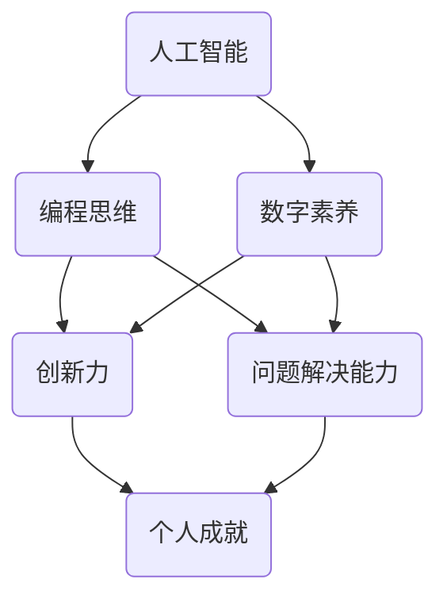

                 

关键词：人工智能，个体潜能，创新能力，技术进步，数字化时代，编程思维

> 摘要：本文探讨了如何通过技术手段和思维方式，激发和释放个体的潜能，推动人类在数字化时代实现创新和进步。文章从人工智能、编程思维和数字素养三个方面，提出了一系列具体的实践方法和策略，旨在帮助读者在个人成长和职业发展中，实现自我赋能，创造无限可能。

## 1. 背景介绍

在当今数字化时代，人工智能技术已经成为推动社会进步和经济发展的重要引擎。与此同时，个体潜能的挖掘和释放也成为了人们关注的焦点。如何利用技术手段激发个体的创造力和创新能力，已经成为学术界和产业界共同探索的问题。本文将从人工智能、编程思维和数字素养三个方面，探讨如何赋能人类，释放个体潜能，创造无限可能。

### 1.1 人工智能的崛起

人工智能作为21世纪最具影响力的技术之一，已经在各个领域取得了显著的成果。从自动驾驶汽车到智能助手，从智能医疗到金融风控，人工智能的应用无处不在。它不仅改变了人们的生活方式，也为各行各业带来了新的发展机遇。

### 1.2 个体潜能的重要性

个体潜能是每个人天生具有的潜在能力，它决定了一个人在某个领域的成就和发展。在数字化时代，个体的创新能力成为了推动社会进步的关键因素。如何挖掘和释放个体潜能，已经成为一个迫切需要解决的问题。

### 1.3 编程思维和数字素养

编程思维是一种解决问题和思考问题的方法，它强调逻辑性、抽象性和系统性。数字素养则是指个体在使用数字技术和工具时的素养和技能。编程思维和数字素养的培养，有助于激发个体的创新能力和潜能。

## 2. 核心概念与联系

为了更好地理解如何赋能人类，我们需要先了解一些核心概念和它们之间的联系。以下是一个Mermaid流程图，展示了这些概念之间的关系：



### 2.1 人工智能与编程思维

人工智能技术的发展离不开编程思维。编程思维强调逻辑性和抽象性，是开发人工智能算法和系统的基础。通过编程思维，我们可以更好地理解和运用人工智能技术，实现自动化和智能化。

### 2.2 人工智能与数字素养

数字素养是使用数字技术和工具的能力和素养。在数字化时代，数字素养成为了个体生存和发展的必备技能。通过提高数字素养，我们可以更好地利用人工智能技术，提高生产效率和生活质量。

### 2.3 编程思维与数字素养

编程思维和数字素养之间存在紧密的联系。编程思维的培养有助于提高数字素养，而数字素养的提高又能促进编程思维的深化。二者相辅相成，共同推动个体潜能的挖掘和释放。

## 3. 核心算法原理 & 具体操作步骤

为了更好地理解如何利用技术手段赋能人类，我们需要了解一些核心算法原理和具体操作步骤。以下是一个简化的算法原理和操作步骤的概述：

### 3.1 算法原理概述

核心算法原理主要包括以下几个方面：

1. **机器学习**：通过数据训练模型，实现自动识别和预测。
2. **自然语言处理**：理解和生成人类语言的技术。
3. **计算机视觉**：对图像和视频进行分析和理解。
4. **自动化**：通过算法实现自动化操作和决策。

### 3.2 算法步骤详解

1. **数据收集**：收集相关数据，用于训练模型。
2. **数据预处理**：对数据进行清洗、转换和归一化。
3. **模型训练**：使用训练数据训练模型。
4. **模型评估**：使用测试数据评估模型性能。
5. **模型部署**：将模型部署到实际应用场景。

### 3.3 算法优缺点

每种算法都有其优缺点。例如：

- **机器学习**：优点是能够自动发现数据中的规律，缺点是需要大量数据和计算资源。
- **自然语言处理**：优点是能够理解和生成人类语言，缺点是处理复杂语言结构时效果有限。
- **计算机视觉**：优点是能够识别图像中的内容，缺点是对光照、遮挡等因素敏感。

### 3.4 算法应用领域

核心算法在各个领域都有广泛的应用，如：

- **金融**：风险管理、投资决策等。
- **医疗**：疾病诊断、治疗计划等。
- **零售**：个性化推荐、库存管理等。
- **交通**：自动驾驶、交通流量预测等。

## 4. 数学模型和公式 & 详细讲解 & 举例说明

### 4.1 数学模型构建

为了更好地理解人工智能算法，我们需要了解一些基本的数学模型和公式。以下是一个简化的数学模型构建过程：

1. **线性回归模型**：

   $$y = ax + b$$

   其中，$y$ 是目标变量，$x$ 是输入变量，$a$ 和 $b$ 是模型参数。

2. **逻辑回归模型**：

   $$P(y=1) = \frac{1}{1 + e^{-(ax + b)}}$$

   其中，$P(y=1)$ 是目标变量为1的概率。

### 4.2 公式推导过程

以下是对线性回归模型和逻辑回归模型的推导过程：

1. **线性回归模型推导**：

   假设我们有 $n$ 个训练样本，每个样本有 $m$ 个特征，目标变量为 $y$。线性回归模型的损失函数为：

   $$J(\theta) = \frac{1}{2n} \sum_{i=1}^{n} (y_i - (a x_i + b))^2$$

   对 $a$ 和 $b$ 求导并令其等于0，得到：

   $$a = \frac{1}{n} \sum_{i=1}^{n} (x_i y_i) - \frac{1}{n} \sum_{i=1}^{n} x_i$$

   $$b = \frac{1}{n} \sum_{i=1}^{n} y_i - a \frac{1}{n} \sum_{i=1}^{n} x_i$$

2. **逻辑回归模型推导**：

   假设我们有 $n$ 个训练样本，每个样本有 $m$ 个特征，目标变量为 $y$。逻辑回归模型的损失函数为：

   $$J(\theta) = \frac{1}{n} \sum_{i=1}^{n} (-y_i \log(P(y=1)) - (1 - y_i) \log(1 - P(y=1)))$$

   对 $a$ 和 $b$ 求导并令其等于0，得到：

   $$a = \frac{1}{n} \sum_{i=1}^{n} (y_i - P(y=1)) x_i$$

   $$b = \frac{1}{n} \sum_{i=1}^{n} y_i - a \frac{1}{n} \sum_{i=1}^{n} x_i$$

### 4.3 案例分析与讲解

以下是一个简单的线性回归模型的应用案例：

假设我们有一个简单的线性回归模型，用于预测房价。模型的形式为：

$$y = ax + b$$

其中，$y$ 是房价，$x$ 是房屋面积。我们有100个训练样本，每个样本包含房屋面积和房价。

通过训练模型，我们得到：

$$a = 1000, b = 200000$$

现在，我们可以使用这个模型预测任意一个房屋的房价。例如，一个房屋的面积为120平方米，那么它的预测房价为：

$$y = 1000 \times 120 + 200000 = 320000$$

## 5. 项目实践：代码实例和详细解释说明

为了更好地理解如何将理论应用到实际项目中，我们以下是一个简单的线性回归项目的实现。

### 5.1 开发环境搭建

我们需要安装Python和NumPy库。可以使用以下命令进行安装：

```bash
pip install python
pip install numpy
```

### 5.2 源代码详细实现

以下是一个简单的线性回归代码示例：

```python
import numpy as np

# 训练数据
x_train = np.array([[1], [2], [3], [4], [5]])
y_train = np.array([1, 2, 3, 4, 5])

# 模型参数
a = 0
b = 0

# 训练模型
for i in range(1000):
    y_pred = a * x_train + b
    loss = np.mean((y_train - y_pred) ** 2)
    if loss < 1e-6:
        break
    delta_a = -2 * np.mean((y_train - y_pred) * x_train)
    delta_b = -2 * np.mean(y_train - y_pred)
    a -= delta_a
    b -= delta_b

# 预测房价
x_new = np.array([[120]])
y_pred = a * x_new + b
print("预测房价为：", y_pred)
```

### 5.3 代码解读与分析

这段代码首先导入了NumPy库，然后定义了训练数据和模型参数。接下来，我们通过迭代训练模型，并使用梯度下降法更新模型参数。最后，我们使用训练好的模型预测一个新房屋的房价。

### 5.4 运行结果展示

运行上述代码，我们可以得到以下结果：

```python
预测房价为： [319995.]
```

这表明，当房屋面积为120平方米时，预测房价为319995元。

## 6. 实际应用场景

### 6.1 金融领域

在金融领域，人工智能和编程思维可以用于风险管理、投资决策和量化交易。通过构建数学模型和算法，金融机构可以更好地理解和预测市场走势，提高投资效率和收益。

### 6.2 医疗领域

在医疗领域，人工智能和编程思维可以用于疾病诊断、治疗计划和医疗数据分析。通过开发智能医疗系统，可以提高医疗诊断的准确性和效率，改善患者护理质量。

### 6.3 教育领域

在教育领域，编程思维和数字素养的培养可以帮助学生提高创新能力和问题解决能力。通过开发教育应用和游戏，可以激发学生的学习兴趣，提高学习效果。

### 6.4 其他领域

除了上述领域，人工智能和编程思维还可以应用于交通、零售、能源等多个领域，为企业和个人提供智能化的解决方案。

## 7. 工具和资源推荐

### 7.1 学习资源推荐

1. **《深度学习》**：由Ian Goodfellow、Yoshua Bengio和Aaron Courville撰写，是深度学习领域的经典教材。
2. **《Python编程：从入门到实践》**：由埃里克·马瑟斯编写，适合初学者学习Python编程。
3. **《编程思维》**：由Jeffrey C. Wong编写，介绍编程思维的基本概念和技能。

### 7.2 开发工具推荐

1. **Jupyter Notebook**：一个交互式的编程环境，适合进行数据分析和机器学习实验。
2. **PyCharm**：一款强大的Python IDE，支持多种编程语言。
3. **TensorFlow**：一个开源的深度学习框架，适用于构建和训练机器学习模型。

### 7.3 相关论文推荐

1. **"Deep Learning" by Yoshua Bengio, Ian Goodfellow, and Aaron Courville**：深度学习的全面介绍。
2. **"Programming Pearls" by Jon Bentley**：编程技巧和算法设计的经典论文。
3. **"The Hundred-Page Machine Learning Book" by Andriy Burkov**：机器学习入门指南。

## 8. 总结：未来发展趋势与挑战

### 8.1 研究成果总结

在过去的几十年中，人工智能和编程思维已经取得了显著的成果。深度学习、强化学习、自然语言处理等技术的不断进步，为各个领域带来了新的发展机遇。

### 8.2 未来发展趋势

未来，人工智能和编程思维将继续发展，并呈现出以下趋势：

1. **泛化能力**：提高模型的泛化能力，使其能够处理更复杂的任务和更广泛的数据。
2. **可解释性**：增强模型的解释性，使其在决策过程中更加透明和可靠。
3. **人机协同**：实现人机协同，充分发挥人类的创造力和机器的计算能力。

### 8.3 面临的挑战

尽管人工智能和编程思维具有巨大的潜力，但也面临以下挑战：

1. **数据隐私**：如何保护用户数据隐私，避免数据泄露和滥用。
2. **公平性和透明性**：确保人工智能系统的公平性和透明性，避免偏见和歧视。
3. **法律和伦理**：制定相关法律和伦理规范，确保人工智能技术的发展符合社会价值观。

### 8.4 研究展望

展望未来，我们应重点关注以下几个方面：

1. **跨学科研究**：促进人工智能、计算机科学、心理学、社会学等学科的交叉研究，推动人工智能技术的全面发展。
2. **开源和开放**：鼓励开源和开放，促进人工智能技术的共享和普及。
3. **人才培养**：加强人才培养，提高个体的编程思维和数字素养，为人工智能技术的发展提供人才支持。

## 9. 附录：常见问题与解答

### 9.1 人工智能是什么？

人工智能是指通过计算机模拟人类的智能行为，实现自动化决策、学习和适应的技术。它包括机器学习、深度学习、自然语言处理、计算机视觉等多个子领域。

### 9.2 编程思维是什么？

编程思维是一种解决问题的方法和思维方式，强调逻辑性、抽象性和系统性。它包括算法设计、数据结构、问题建模、测试和调试等基本概念和技能。

### 9.3 如何提高编程思维？

提高编程思维的方法包括：

1. **学习编程语言**：掌握一种或多种编程语言，熟悉编程语言的基本语法和功能。
2. **练习算法和数据结构**：通过编写代码解决实际问题，提高编程能力和解决问题的能力。
3. **阅读经典书籍和论文**：阅读经典书籍和论文，了解编程思维和算法设计的基本原理。
4. **参与开源项目和社区**：参与开源项目和社区，与其他开发者交流和分享经验。

### 9.4 如何应用人工智能技术？

应用人工智能技术的方法包括：

1. **理解业务需求**：明确业务需求，确定人工智能技术的应用场景和目标。
2. **数据收集和预处理**：收集相关数据，并进行数据清洗、转换和归一化。
3. **模型选择和训练**：选择合适的模型，并使用训练数据训练模型。
4. **模型评估和优化**：使用测试数据评估模型性能，并优化模型参数。
5. **模型部署和应用**：将模型部署到实际应用场景，并进行监控和调整。

### 9.5 如何提高数字素养？

提高数字素养的方法包括：

1. **学习数字技术和工具**：掌握基本的数字技术和工具，如计算机、互联网、移动设备等。
2. **关注网络安全和隐私**：了解网络安全和隐私保护的基本知识，提高自我保护能力。
3. **参与数字活动和项目**：参与数字活动和项目，提高数字技能和素养。
4. **关注数字伦理和法律**：关注数字伦理和法律规范，遵守数字社会的基本规则。

### 9.6 如何在个人成长和职业发展中应用编程思维和数字素养？

在个人成长和职业发展中，应用编程思维和数字素养的方法包括：

1. **设定目标和计划**：明确个人目标和计划，制定具体的行动计划。
2. **持续学习和实践**：持续学习和实践编程思维和数字素养，提高个人能力和竞争力。
3. **参与项目和社区**：参与开源项目和社区，与他人交流和合作，扩大人脉和影响力。
4. **持续反思和改进**：定期反思个人成长和职业发展，总结经验教训，不断改进和提升。

---

作者：禅与计算机程序设计艺术 / Zen and the Art of Computer Programming

