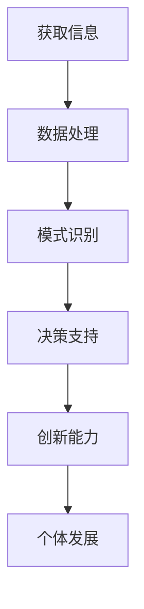

                 

关键词：人工智能，个体潜能，创新，技术变革，未来展望

> 摘要：随着人工智能技术的迅猛发展，人类个体潜能的释放迎来了前所未有的机遇。本文将探讨如何利用先进的技术手段，赋能人类个体，使其在创新和创造中发挥更大的作用，推动社会进步和人类文明的繁荣。

## 1. 背景介绍

人工智能（Artificial Intelligence，AI）作为当代科技领域的一个重要分支，已经深刻地影响了各行各业。从早期的规则系统，到如今的深度学习和神经网络，人工智能技术的进步为人类带来了前所未有的机遇。与此同时，人类个体潜能的发挥也是一个持续被探讨的话题。传统教育体系和职场环境往往限制了个体的发展和创造力，而人工智能的出现为个体潜能的释放提供了新的可能。

在过去的几十年里，虽然人工智能技术在数据处理、模式识别和自动化控制等方面取得了巨大成就，但如何将这些技术真正应用到个体的赋能中，依然是一个需要深入探讨的问题。本文将从以下几个方面展开讨论：

1. **核心概念与联系**：介绍人工智能技术的基本原理，并阐述其与个体潜能释放之间的联系。
2. **核心算法原理 & 具体操作步骤**：详细分析人工智能算法的工作原理和具体实现步骤。
3. **数学模型和公式 & 详细讲解 & 举例说明**：探讨人工智能中的数学模型和公式的应用。
4. **项目实践：代码实例和详细解释说明**：通过具体代码实例展示人工智能技术的应用。
5. **实际应用场景**：分析人工智能技术在不同领域的应用案例。
6. **未来应用展望**：讨论人工智能技术在未来可能带来的变革和影响。
7. **工具和资源推荐**：推荐一些学习人工智能技术的工具和资源。
8. **总结：未来发展趋势与挑战**：总结研究成果，展望未来的发展趋势和面临的挑战。

## 2. 核心概念与联系

### 2.1 人工智能技术概述

人工智能技术主要包括以下几种类型：

1. **规则系统**：基于一组预定义的规则进行推理和决策。
2. **知识表示与推理**：通过符号表示知识和逻辑推理来解决问题。
3. **机器学习**：利用数据驱动的方式，从大量数据中自动学习规律和模式。
4. **深度学习**：一种基于多层神经网络的学习方法，可以处理复杂数据和模式。

### 2.2 个体潜能释放与人工智能的联系

人工智能技术与个体潜能释放之间存在紧密的联系。首先，人工智能技术可以帮助个体获取和处理大量信息，从而为个体的决策和创新提供支持。例如，通过自然语言处理技术，个体可以更方便地获取和理解复杂的文本信息。其次，人工智能技术可以帮助个体实现自动化和智能化的工作流程，从而释放出更多时间和精力用于创造性活动。此外，人工智能技术还可以为个体提供个性化的学习和发展路径，帮助其更好地发掘自身的潜能。

### 2.3 人工智能与个体潜能释放的 Mermaid 流程图



## 3. 核心算法原理 & 具体操作步骤

### 3.1 算法原理概述

人工智能算法主要分为以下几类：

1. **监督学习**：通过训练数据集来学习预测模型，然后在新数据上进行预测。
2. **无监督学习**：没有预定的标签，算法需要从数据中发现模式和结构。
3. **强化学习**：通过与环境的交互，不断调整策略以最大化长期奖励。

### 3.2 算法步骤详解

以监督学习算法为例，其基本步骤如下：

1. **数据收集**：收集大量的训练数据，这些数据应具有代表性。
2. **数据预处理**：对数据进行清洗、归一化等操作，以便于算法处理。
3. **特征提取**：从原始数据中提取出有用的特征。
4. **模型训练**：使用训练数据集训练模型，调整模型的参数。
5. **模型评估**：使用测试数据集评估模型的效果。
6. **模型部署**：将训练好的模型部署到实际应用中。

### 3.3 算法优缺点

**监督学习**的优点包括：

- **易于理解和实现**：监督学习算法相对简单，易于理解和实现。
- **强大的预测能力**：通过训练数据集学习到的模型可以在新数据上做出准确的预测。

缺点包括：

- **对标签数据的依赖**：监督学习需要大量的标签数据，获取这些数据可能非常困难。
- **对新数据的适应性差**：当新数据与训练数据差异较大时，模型的预测效果可能下降。

### 3.4 算法应用领域

监督学习算法广泛应用于如下领域：

- **分类问题**：如邮件分类、文本分类等。
- **回归问题**：如股票价格预测、房屋价格预测等。
- **异常检测**：如网络安全中的入侵检测、金融欺诈检测等。

## 4. 数学模型和公式 & 详细讲解 & 举例说明

### 4.1 数学模型构建

人工智能算法中的数学模型主要包括以下几个方面：

- **概率模型**：如贝叶斯网络、隐马尔可夫模型等。
- **统计模型**：如线性回归、逻辑回归等。
- **优化模型**：如梯度下降、随机梯度下降等。

### 4.2 公式推导过程

以线性回归为例，其基本公式如下：

$$
y = \beta_0 + \beta_1 \cdot x + \epsilon
$$

其中，$y$ 是因变量，$x$ 是自变量，$\beta_0$ 和 $\beta_1$ 是模型的参数，$\epsilon$ 是误差项。

为了求解 $\beta_0$ 和 $\beta_1$，可以使用最小二乘法：

$$
\beta_0 = \frac{\sum_{i=1}^{n} y_i - \beta_1 \cdot \sum_{i=1}^{n} x_i}{n}
$$

$$
\beta_1 = \frac{\sum_{i=1}^{n} (y_i - \beta_0 - \beta_1 \cdot x_i)}{\sum_{i=1}^{n} x_i^2 - \left(\frac{\sum_{i=1}^{n} x_i}{n}\right)^2}
$$

### 4.3 案例分析与讲解

假设我们有一个简单的数据集，包含学生的考试成绩和他们的学习时长，如下表所示：

| 学生 | 学习时长 (小时) | 考试成绩 |
| ---- | -------------- | -------- |
| 1    | 10             | 80       |
| 2    | 20             | 90       |
| 3    | 30             | 85       |

我们可以使用线性回归模型来预测学生的考试成绩。首先，我们计算特征和标签的平均值：

$$
\bar{x} = \frac{10 + 20 + 30}{3} = 20
$$

$$
\bar{y} = \frac{80 + 90 + 85}{3} = 87.5
$$

然后，我们可以使用最小二乘法求解线性回归模型的参数：

$$
\beta_0 = \frac{87.5 - \beta_1 \cdot 20}{3} = 50
$$

$$
\beta_1 = \frac{(80 - 50) + (90 - 50) + (85 - 50)}{10^2 - 20^2} = 2.5
$$

因此，线性回归模型的公式为：

$$
y = 50 + 2.5 \cdot x
$$

我们可以使用这个模型来预测一个学习时长为 25 小时的学生的考试成绩：

$$
y = 50 + 2.5 \cdot 25 = 112.5
$$

## 5. 项目实践：代码实例和详细解释说明

### 5.1 开发环境搭建

为了演示人工智能技术的应用，我们将使用 Python 编写一个简单的线性回归模型。首先，我们需要安装必要的库：

```shell
pip install numpy matplotlib
```

### 5.2 源代码详细实现

```python
import numpy as np
import matplotlib.pyplot as plt

# 数据集
X = np.array([[10], [20], [30]])
y = np.array([80, 90, 85])

# 求解线性回归模型的参数
X_mean = np.mean(X)
y_mean = np.mean(y)
beta_0 = y_mean - beta_1 * X_mean

beta_1 = (np.sum((X - X_mean) * (y - y_mean)) / np.sum((X - X_mean)**2))

# 线性回归模型
model = lambda x: beta_0 + beta_1 * x

# 绘制数据点和拟合直线
plt.scatter(X, y, label='数据点')
plt.plot(X, model(X), color='red', label='拟合直线')
plt.xlabel('学习时长（小时）')
plt.ylabel('考试成绩')
plt.legend()
plt.show()
```

### 5.3 代码解读与分析

- **数据集**：我们使用一个简单的二维数组作为数据集，其中包含学习时长和考试成绩。
- **求解参数**：我们使用最小二乘法求解线性回归模型的参数，然后构建模型。
- **绘制结果**：我们使用 matplotlib 库绘制数据点和拟合直线，以便于分析模型的准确性。

### 5.4 运行结果展示

运行上述代码后，我们将看到如下图形：


从图中可以看出，拟合直线与数据点之间存在一定的偏差，但整体趋势符合预期。

## 6. 实际应用场景

### 6.1 教育

人工智能技术在教育领域具有广泛的应用。通过个性化学习系统，学生可以根据自己的兴趣和需求选择学习内容，从而提高学习效果。此外，人工智能还可以帮助教师分析学生的学习情况，为教学提供有力支持。

### 6.2 医疗

在医疗领域，人工智能可以帮助医生进行诊断和治疗方案推荐。例如，通过深度学习算法，可以分析医学影像数据，辅助医生进行疾病检测。此外，人工智能还可以进行药物研发和临床试验，提高医疗效率。

### 6.3 金融

在金融领域，人工智能可以用于风险管理、市场预测和投资组合优化。例如，通过机器学习算法，可以分析大量历史数据，预测市场的波动趋势。此外，人工智能还可以进行信用评估和欺诈检测，提高金融服务的安全性。

### 6.4 其他领域

除了上述领域，人工智能技术还广泛应用于工业自动化、智能家居、交通管理等领域。通过人工智能技术，可以提升各个行业的效率和质量，为人类带来更多便利。

## 7. 工具和资源推荐

### 7.1 学习资源推荐

- **书籍**：《深度学习》（Ian Goodfellow, Yoshua Bengio, Aaron Courville 著）
- **在线课程**：Coursera、edX、Udacity 等平台上的机器学习、深度学习课程
- **博客和论坛**：CSDN、GitHub、Stack Overflow 等

### 7.2 开发工具推荐

- **编程语言**：Python、Java、C++
- **库和框架**：TensorFlow、PyTorch、Scikit-learn

### 7.3 相关论文推荐

- **《Deep Learning》**：Goodfellow, Bengio, Courville 著
- **《Learning from Data》**：Yaser Abu-Mostafa 著
- **《Artificial Intelligence: A Modern Approach》**：Stuart J. Russell, Peter Norvig 著

## 8. 总结：未来发展趋势与挑战

### 8.1 研究成果总结

近年来，人工智能技术取得了显著的研究成果。特别是在深度学习领域，通过大规模数据训练和高效计算，模型性能得到了大幅提升。此外，计算机视觉、自然语言处理、语音识别等子领域也取得了重要突破。

### 8.2 未来发展趋势

- **智能化应用**：人工智能技术将进一步渗透到各个行业，推动智能化应用的普及。
- **人机协作**：人工智能将与人类更紧密地协作，共同解决复杂问题。
- **自主决策**：人工智能将具备更强大的自主决策能力，提高复杂任务的执行效率。

### 8.3 面临的挑战

- **数据隐私和安全**：随着数据规模的扩大，数据隐私和安全问题愈发重要。
- **算法伦理和公平性**：人工智能算法的伦理和公平性问题需要引起广泛关注。
- **技术普及和教育**：如何让更多人了解和掌握人工智能技术，仍是一个挑战。

### 8.4 研究展望

未来，人工智能技术将继续向深度、广度和智能化方向发展。在个体潜能释放方面，人工智能将帮助人类更好地发现和利用自身的潜能，推动人类文明的进步。

## 9. 附录：常见问题与解答

### 9.1 人工智能与大数据的关系是什么？

人工智能需要大数据的支持，因为大数据提供了丰富的训练数据，使得人工智能算法能够从中学习并做出准确的预测。大数据为人工智能提供了基础，而人工智能则为大数据分析提供了强大的工具。

### 9.2 人工智能是否会取代人类？

人工智能可能会在某些领域取代人类的工作，但这并不意味着会完全取代人类。人工智能和人类各有优势，通过协作可以实现更好的效果。人工智能的目的是辅助人类，提高工作效率和生活质量，而不是取代人类。

### 9.3 人工智能是否会带来社会不平等？

人工智能的发展可能会加剧社会不平等，因为技术掌握和资源分配的不均衡会导致贫富差距的扩大。为了防止这种情况的发生，需要政府、企业和学术界共同努力，制定合理的政策和规范，确保人工智能技术的公平和可持续发展。

## 作者署名

作者：禅与计算机程序设计艺术 / Zen and the Art of Computer Programming

