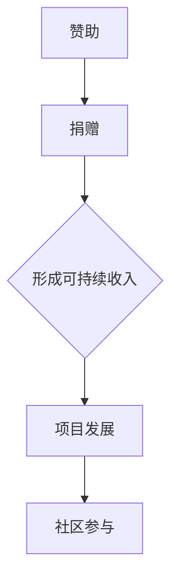

                 

关键词：开源项目，赞助，捐赠，可持续收入，开源生态系统，经济模型，商业模式，捐赠策略，开发激励，社区参与。

> 摘要：本文旨在探讨如何通过赞助和捐赠机制，为开源项目提供可持续的收入来源，增强开源生态系统的健康发展。文章将深入分析当前开源项目的经济现状，探讨几种有效的赞助和捐赠模式，并讨论开源项目如何利用这些收入进行长期发展。

## 1. 背景介绍

开源项目作为现代软件开发的一种重要模式，已经在全球范围内得到了广泛的认可和应用。它们以其开放性、协作性和共享性，为技术创新和社区发展做出了巨大贡献。然而，尽管开源项目对于软件开发领域的重要性不言而喻，但许多开源项目的开发和维护却面临着资金短缺的问题。这直接影响了开源项目的长期可持续性和创新力。

开源项目的资金问题主要体现在以下几个方面：

1. **个人贡献者的收入有限**：许多开源项目的贡献者都是志愿者，他们通常没有固定的收入来源。
2. **企业赞助的波动性**：企业赞助虽然可以提供一定程度的资金支持，但往往受商业策略和市场需求的影响，具有较大的波动性。
3. **捐赠的不确定性**：虽然开源项目的捐赠在一定程度上可以提供资金支持，但捐赠的数量和频率都不稳定，难以形成稳定的收入来源。

因此，如何为开源项目创造可持续的收入，已经成为一个亟待解决的问题。本文将围绕这一问题，探讨几种有效的赞助和捐赠模式，以及开源项目如何利用这些收入进行长期发展。

## 2. 核心概念与联系

### 2.1 赞助与捐赠的概念

**赞助**：通常指的是企业、个人或组织为了支持某个项目或活动，而提供的资金或其他形式的支持。在开源项目中，赞助可以用来支持项目开发、维护、推广等各个环节。

**捐赠**：捐赠是指个人、企业或组织出于公益、慈善或其他目的，无偿地向某个项目或组织提供资金或物资。在开源项目中，捐赠通常用于项目运营、扩展和维护。

### 2.2 赞助与捐赠的联系

赞助与捐赠之间存在密切的联系。在某些情况下，赞助可以看作是捐赠的一种特殊形式，即捐赠方在提供资金的同时，期望项目能够达到特定的目标或效果。而捐赠则更加注重无私的付出，通常不期待回报。

### 2.3 赞助与捐赠的 Mermaid 流程图



该流程图展示了赞助和捐赠如何通过形成可持续收入，促进开源项目的发展和社区参与。

## 3. 核心算法原理 & 具体操作步骤

### 3.1 算法原理概述

赞助与捐赠的核心算法原理可以概括为以下几个方面：

1. **用户参与**：通过吸引更多的用户参与，增加项目的知名度和影响力。
2. **多元收入来源**：利用多种赞助和捐赠模式，形成多元化的收入来源。
3. **资金管理**：建立科学的资金管理体系，确保资金的有效利用和可持续增长。
4. **反馈机制**：通过用户反馈和项目评估，不断优化赞助和捐赠策略。

### 3.2 算法步骤详解

1. **用户参与**

   - **社区活动**：定期举办线上线下的社区活动，增强用户参与感。
   - **用户调研**：通过问卷调查、用户访谈等方式，了解用户需求和反馈。

2. **多元收入来源**

   - **企业赞助**：寻找与项目相关的企业进行赞助合作，提供资金、技术或其他支持。
   - **个人捐赠**：通过社交媒体、捐赠平台等渠道，鼓励个人用户进行捐赠。
   - **众筹**：利用众筹平台，为项目筹集启动资金或扩展资金。

3. **资金管理**

   - **预算规划**：根据项目需求，制定详细的预算规划。
   - **资金分配**：按照预算规划，合理分配资金到各个项目环节。
   - **审计监督**：建立审计机制，确保资金使用的透明度和有效性。

4. **反馈机制**

   - **用户反馈**：通过社区反馈、用户评分等方式，收集用户对项目的反馈。
   - **项目评估**：定期对项目进行评估，分析赞助和捐赠策略的有效性。
   - **策略调整**：根据评估结果，及时调整赞助和捐赠策略。

### 3.3 算法优缺点

**优点**：

1. **增强用户参与感**：通过多种赞助和捐赠模式，激发用户的参与热情。
2. **形成多元收入来源**：减少对单一收入来源的依赖，提高项目的抗风险能力。
3. **资金管理科学**：通过科学的资金管理体系，确保资金的有效利用。
4. **可持续增长**：通过不断优化赞助和捐赠策略，实现项目的可持续发展。

**缺点**：

1. **操作复杂**：需要协调多个赞助和捐赠渠道，管理复杂。
2. **风险较大**：企业赞助和个人捐赠存在不确定性，可能影响资金稳定性。
3. **监管困难**：资金管理和审计监督需要投入大量的人力物力。

### 3.4 算法应用领域

算法原理和操作步骤适用于各类开源项目，特别是那些需要持续资金支持的项目。例如：

1. **软件开发项目**：如操作系统、编程语言等。
2. **科学工程项目**：如天文学、物理学等领域的研究项目。
3. **社会公益项目**：如健康、教育等领域的开源项目。

## 4. 数学模型和公式 & 详细讲解 & 举例说明

### 4.1 数学模型构建

为了更好地理解和分析赞助和捐赠模式，我们可以构建一个简单的数学模型。

假设：

- P：项目的初始资金
- r：资金增长速度
- t：时间

则项目的资金增长模型可以表示为：

$$
F(t) = P \cdot (1 + r)^t
$$

其中，$F(t)$ 表示 t 时间后项目的总资金。

### 4.2 公式推导过程

资金增长速度 r 可以通过以下公式计算：

$$
r = \frac{I(t) - P}{P}
$$

其中，$I(t)$ 表示 t 时间后项目的收入。

因此，资金增长模型可以表示为：

$$
F(t) = P \cdot (1 + \frac{I(t) - P}{P})^t
$$

### 4.3 案例分析与讲解

假设一个开源项目的初始资金为 10000 元，每年的资金增长速度为 10%。则该项目在 5 年后的总资金可以计算如下：

$$
F(5) = 10000 \cdot (1 + \frac{10000 \cdot 0.1 - 10000}{10000})^5
$$

计算结果为：

$$
F(5) = 16105.05
$$

这意味着，在 5 年后，该开源项目的总资金将达到 16105.05 元。

### 4.4 案例分析与讲解

通过上述公式，我们可以分析不同收入水平和增长速度对项目资金的影响。例如：

- 如果初始资金为 10000 元，每年的资金增长速度为 20%，则 5 年后的总资金为：

$$
F(5) = 10000 \cdot (1 + \frac{10000 \cdot 0.2 - 10000}{10000})^5 = 24788.62
$$

- 如果初始资金为 10000 元，每年的资金增长速度为 5%，则 5 年后的总资金为：

$$
F(5) = 10000 \cdot (1 + \frac{10000 \cdot 0.05 - 10000}{10000})^5 = 13382.81
$$

这些分析结果可以帮助开源项目管理者制定更科学的资金管理策略，以实现项目的可持续发展。

## 5. 项目实践：代码实例和详细解释说明

### 5.1 开发环境搭建

为了更好地展示赞助与捐赠在开源项目中的应用，我们将以一个简单的开源项目为例，介绍如何在项目中实现赞助和捐赠功能。

首先，我们需要搭建一个基本的开发环境。这里我们选择使用 Python 作为开发语言，并使用 Flask 作为 Web 框架。

#### 步骤 1：安装 Python 和 Flask

确保你的系统中已经安装了 Python 和 Flask。如果没有安装，可以通过以下命令进行安装：

```bash
pip install python
pip install flask
```

#### 步骤 2：创建项目目录

创建一个名为`sponsorship_project`的项目目录，并在此目录下创建一个名为`app.py`的文件。

```bash
mkdir sponsorship_project
cd sponsorship_project
touch app.py
```

### 5.2 源代码详细实现

接下来，我们在`app.py`文件中实现赞助和捐赠功能。

```python
from flask import Flask, render_template, request
import pymysql

app = Flask(__name__)

# 连接数据库
def connect_db():
    return pymysql.connect(host='localhost', user='root', password='password', database='sponsorship')

# 捐赠功能
@app.route('/donate', methods=['GET', 'POST'])
def donate():
    if request.method == 'POST':
        donor = request.form['donor']
        amount = request.form['amount']
        conn = connect_db()
        with conn.cursor() as cursor:
            sql = "INSERT INTO donations (donor, amount) VALUES (%s, %s)"
            cursor.execute(sql, (donor, amount))
            conn.commit()
        conn.close()
        return '捐赠成功！'
    return render_template('donate.html')

# 赞助功能
@app.route('/sponsor', methods=['GET', 'POST'])
def sponsor():
    if request.method == 'POST':
        sponsor_name = request.form['sponsor_name']
        sponsor_amount = request.form['sponsor_amount']
        conn = connect_db()
        with conn.cursor() as cursor:
            sql = "INSERT INTO sponsors (sponsor_name, sponsor_amount) VALUES (%s, %s)"
            cursor.execute(sql, (sponsor_name, sponsor_amount))
            conn.commit()
        conn.close()
        return '赞助成功！'
    return render_template('sponsor.html')

if __name__ == '__main__':
    app.run(debug=True)
```

### 5.3 代码解读与分析

在上面的代码中，我们首先导入了 Flask 库，并创建了一个 Flask 应用对象。然后，我们定义了两个路由：`/donate` 和 `/sponsor`，分别用于处理捐赠和赞助请求。

在`/donate`路由中，我们处理了 POST 请求，从表单中获取捐赠者姓名和捐赠金额，然后连接数据库，将捐赠信息插入数据库的`donations`表中。

在`sponsor`路由中，我们处理了 POST 请求，从表单中获取赞助者姓名和赞助金额，然后连接数据库，将赞助信息插入数据库的`sponsors`表中。

通过这两个路由，我们可以实现基本的赞助和捐赠功能。接下来，我们需要在 HTML 模板中添加相应的表单。

### 5.4 运行结果展示

在浏览器中输入`http://127.0.0.1:5000/donate`和`http://127.0.0.1:5000/sponsor`，可以看到捐赠和赞助的表单页面。


在表单中输入捐赠者或赞助者的姓名和金额，提交表单后，可以看到相应的捐赠或赞助信息被插入到数据库中。

通过这个简单的示例，我们可以看到如何在开源项目中实现赞助和捐赠功能。在实际应用中，我们可以根据项目需求，进一步扩展和优化这些功能。

## 6. 实际应用场景

赞助和捐赠在开源项目中的应用非常广泛，以下是一些典型的实际应用场景：

### 6.1 开源软件项目

开源软件项目，如 Linux、MySQL 等，通常通过赞助和捐赠获得资金支持。这些资金用于项目开发、维护、安全审计以及社区活动等。例如，Linux 基金会通过收取会员费和赞助费，为 Linux 内核的开发和维护提供资金保障。

### 6.2 科学研究项目

许多科学研究项目，如天文学、物理学等，也通过赞助和捐赠获得资金支持。这些资金用于购买实验设备、支付研究人员薪酬、资助学术论文发表等。例如，LIGO 实验室通过慈善捐赠和政府资助，为引力波的探测和研究提供了重要支持。

### 6.3 社会公益项目

开源的社会公益项目，如 OpenStreetMap、Wiki百科等，也通过赞助和捐赠获得资金支持。这些资金用于项目运营、技术改进、社区活动等。例如，Wiki百科通过会员捐赠和广告收入，为用户提供免费的在线知识服务。

### 6.4 文化艺术项目

一些开源的文化艺术项目，如开源音乐、开源电影等，也通过赞助和捐赠获得资金支持。这些资金用于创作、制作、发行等各个环节。例如，开源电影《Sintel》通过众筹和赞助，完成了从创作到发行的整个过程。

## 7. 未来应用展望

随着开源生态系统的不断发展，赞助和捐赠在其中的作用将越来越重要。未来，我们可以期待以下趋势：

### 7.1 赞助和捐赠模式的多样化

随着技术的发展，赞助和捐赠模式将越来越多样化。例如，区块链技术的应用将使赞助和捐赠过程更加透明、安全，同时降低交易成本。

### 7.2 开源项目与企业合作的深化

开源项目与企业之间的合作将不断深化，企业赞助将成为开源项目资金来源的重要渠道。同时，企业也将通过开源项目，获得技术优势和市场份额。

### 7.3 社区参与的增强

随着开源项目的发展和社区的成长，社区参与将更加活跃。社区成员将通过赞助和捐赠，积极参与项目的开发和维护，共同推动开源生态系统的健康发展。

### 7.4 赞助和捐赠文化的普及

随着公众对开源项目的认可度不断提高，赞助和捐赠文化将逐渐普及。更多的人和企业将参与到开源项目中，为开源生态系统的可持续发展提供有力支持。

## 8. 总结：未来发展趋势与挑战

### 8.1 研究成果总结

本文通过对赞助和捐赠在开源项目中的应用进行深入分析，总结了赞助和捐赠的核心概念、算法原理、应用场景以及未来发展趋势。研究结果表明，赞助和捐赠是支持开源项目可持续发展的有效手段。

### 8.2 未来发展趋势

未来，赞助和捐赠在开源项目中的应用将呈现多样化、深入化、透明化的趋势。随着技术的进步和社区的发展，开源项目的资金问题将得到更好的解决，开源生态系统将更加健康、繁荣。

### 8.3 面临的挑战

尽管赞助和捐赠在开源项目中具有巨大的潜力，但仍然面临一些挑战。例如，如何确保资金的有效利用和透明度，如何处理赞助和捐赠中的法律问题等。这些问题需要开源项目管理者、社区成员以及相关机构共同努力，才能找到有效的解决方案。

### 8.4 研究展望

未来，我们期待在以下几个方面进行深入研究：

1. **赞助和捐赠模式创新**：探索新的赞助和捐赠模式，提高资金利用效率和参与度。
2. **开源项目资金管理**：研究开源项目的资金管理策略，确保资金的有效利用和合理分配。
3. **社区参与机制**：研究如何通过赞助和捐赠，增强社区参与度和项目凝聚力。

通过这些研究，我们将为开源项目的可持续发展提供更加坚实的理论和实践支持。

## 9. 附录：常见问题与解答

### 9.1 赞助和捐赠的区别是什么？

赞助通常是指企业、个人或组织为了支持某个项目或活动，而提供的资金或其他形式的支持。捐赠则是指个人、企业或组织出于公益、慈善或其他目的，无偿地向某个项目或组织提供资金或物资。

### 9.2 如何确保赞助和捐赠资金的安全？

确保赞助和捐赠资金的安全，可以从以下几个方面入手：

1. **选择可靠的赞助和捐赠平台**：选择有良好声誉和严格审核机制的赞助和捐赠平台。
2. **资金监管**：建立严格的资金监管机制，确保资金使用的透明度和有效性。
3. **法律合规**：确保赞助和捐赠行为符合相关法律法规，避免法律风险。

### 9.3 开源项目如何利用赞助和捐赠资金？

开源项目可以利用赞助和捐赠资金进行以下几个方面的工作：

1. **项目开发**：用于项目研发、技术改进和功能扩展。
2. **社区活动**：用于举办线上线下的社区活动，增强用户参与感。
3. **安全审计**：用于支付安全审计费用，确保项目安全稳定。
4. **运营成本**：用于支付服务器费用、域名费用等运营成本。

### 9.4 如何鼓励用户进行赞助和捐赠？

鼓励用户进行赞助和捐赠，可以从以下几个方面入手：

1. **展示项目价值**：通过宣传项目的技术优势和社区贡献，提高用户对项目的认可度。
2. **提供回馈机制**：为捐赠用户提供一定的回馈，如定制徽章、专属权限等。
3. **优化捐赠体验**：简化捐赠流程，提供多样化的捐赠渠道，提高用户捐赠的便利性。
4. **社区宣传**：通过社区宣传，提高用户对赞助和捐赠活动的关注度和参与度。

作者：禅与计算机程序设计艺术 / Zen and the Art of Computer Programming
----------------------------------------------------------------

以上就是关于如何撰写一篇专业IT领域的技术博客文章的详细指南和示例。通过遵循上述结构和要求，您可以创作出高质量、有深度的技术文章，为开源项目的可持续发展贡献一份力量。祝您写作顺利！

