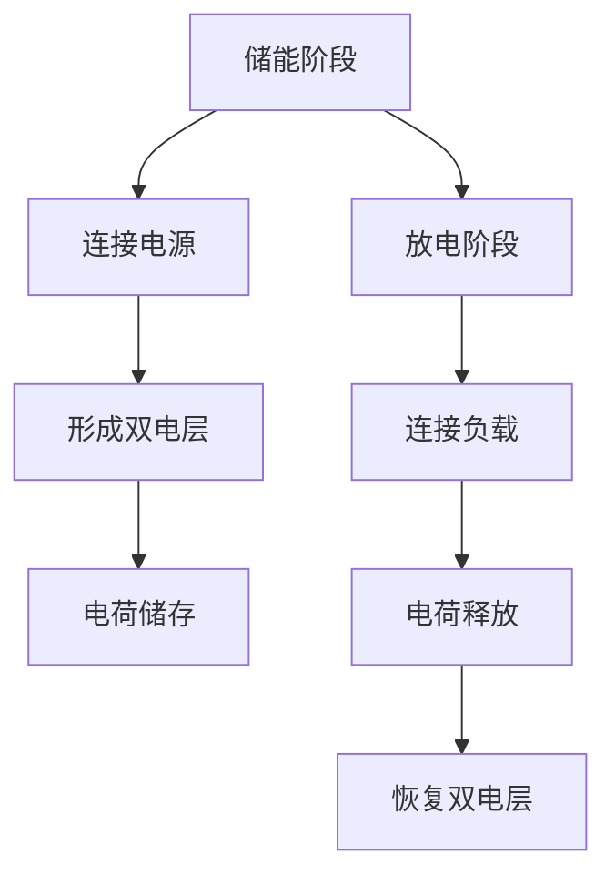

                 

关键词：超级电容器、能源存储、快速充放电、解决方案、算法原理、数学模型、项目实践

## 摘要

随着能源需求的日益增长和环保意识的增强，能源存储技术的研究变得尤为重要。超级电容器作为一种新兴的能源存储技术，具有高能量密度、高功率密度、快速充放电等优势。本文将探讨超级电容器在能源存储中的应用，重点介绍其快速充放电解决方案，包括核心算法原理、数学模型、项目实践等。通过详细分析超级电容器的特性及其应用领域，本文旨在为读者提供一个全面、系统的了解。

## 1. 背景介绍

能源存储技术是现代能源系统的重要组成部分，它能够在能量供应与需求之间存在差异时起到桥梁作用，提高能源利用效率，减少能源浪费。传统的能源存储技术如电池、泵蓄能、压缩空气储能等，虽然在某些应用场景下取得了显著成果，但存在能量密度低、循环寿命有限、充放电速度慢等问题。

超级电容器，也称为电容器储能系统（UES），是一种新型能源存储设备。与传统的电容器相比，超级电容器具有更高的能量密度和功率密度，同时具备快速充放电的能力。超级电容器的工作原理基于电场储能，通过电极表面形成的双电层来存储电荷。这种储能方式使得超级电容器能够在毫秒至秒级的短时间内实现大电流充放电，具有广泛的应用前景。

本文旨在深入探讨超级电容器在能源存储中的应用，尤其是其快速充放电解决方案。通过对超级电容器核心算法原理、数学模型以及项目实践的分析，本文将为读者提供一种全面、系统的了解，并探讨超级电容器在未来能源存储领域的潜力。

### 1.1 超级电容器的定义与特点

超级电容器，顾名思义，是一种具有高容量和快速充放电能力的电容器。它们的工作原理与传统的电容器有所不同，传统的电容器主要依靠电极之间的电场来存储电荷，而超级电容器则利用电极表面形成的双电层来储存电荷。这种双电层结构使得超级电容器能够在相对较小的体积内存储大量电荷，从而具备较高的能量密度。

超级电容器的主要特点包括：

1. **高功率密度**：超级电容器能够在毫秒至秒级的短时间内实现大电流充放电，具有极高的功率密度。这使得超级电容器在应对高频次的充放电需求时具有显著优势。

2. **高能量密度**：与传统的电容器相比，超级电容器具有更高的能量密度。虽然超级电容器的能量密度仍然低于电池，但其快速充放电的特性使其在某些应用场景下具有更高的整体效率。

3. **长循环寿命**：超级电容器在充放电循环过程中，电极材料和电解质材料通常不会发生化学反应，因此超级电容器具有较长的循环寿命。与电池相比，超级电容器的循环寿命通常可以达到数万次以上。

4. **宽温度范围**：超级电容器能够在宽广的温度范围内稳定工作，从低温到高温均能保持良好的性能。

5. **高效率**：超级电容器的充放电过程几乎不涉及化学反应，因此能量转换效率较高。通常情况下，超级电容器的充放电效率可以达到90%以上。

### 1.2 超级电容器在能源存储中的优势

超级电容器在能源存储领域具有显著的优势，这些优势使得其在众多应用场景中具有竞争力。以下是超级电容器在能源存储中的主要优势：

1. **快速充放电**：超级电容器能够实现毫秒至秒级的大电流充放电，这使得它们非常适合应用于需要快速响应的应用场景。例如，在电力系统中的峰值负载调节、电动汽车的快速充电等领域，超级电容器的快速充放电能力能够显著提高系统的运行效率。

2. **高功率密度**：超级电容器具有高功率密度，能够在短时间内释放大量能量。这一特性使得超级电容器在需要高能量输出的应用场景中具有显著优势，例如在风能和太阳能等可再生能源的并网系统中，超级电容器可以用于瞬间调节电网电压和频率，保持电网的稳定运行。

3. **长循环寿命**：超级电容器具有较长的循环寿命，这意味着在长期使用过程中，其性能衰减较小。相比于电池，超级电容器的循环寿命更加稳定，更适合应用于需要频繁充放电的应用场景。

4. **高效率**：超级电容器的充放电过程不涉及化学反应，能量转换效率较高。这一特点使得超级电容器在能量回收和再生领域具有广泛的应用前景。

5. **环保**：超级电容器使用的材料多为环保材料，且在充放电过程中不产生有害物质。这使得超级电容器在环保要求较高的应用场景中具有显著优势。

总的来说，超级电容器在能源存储领域具有快速充放电、高功率密度、长循环寿命、高效率以及环保等显著优势。这些优势使得超级电容器在应对现代能源需求和挑战时具有独特的技术优势和应用潜力。

### 1.3 超级电容器的发展历程与应用现状

超级电容器的研究始于20世纪60年代，最初的研究主要集中在材料科学和电化学方面。经过几十年的发展，超级电容器的性能得到了显著提升，逐渐从实验室研究走向实际应用。

在20世纪90年代，随着纳米技术和材料科学的快速发展，超级电容器的性能得到了进一步优化。特别是纳米材料，如碳纳米管、石墨烯等，被广泛应用于超级电容器的电极材料中，显著提高了超级电容器的能量密度和功率密度。

进入21世纪，超级电容器的应用逐渐拓展到多个领域。以下是一些主要应用领域的概述：

1. **电力系统**：超级电容器在电力系统中主要用于峰值负载调节、电网稳定控制、无功补偿等。由于其快速充放电能力和高功率密度，超级电容器可以有效提高电力系统的运行效率和稳定性。

2. **电动汽车**：超级电容器在电动汽车中的应用主要包括辅助动力系统、快速充电和能量回收等。超级电容器可以提供高频次、大电流的充放电支持，从而提高电动汽车的性能和用户体验。

3. **可再生能源**：超级电容器在风能和太阳能等可再生能源的并网系统中具有重要作用。超级电容器可以用于瞬间调节电网电压和频率，保持电网的稳定运行。

4. **工业自动化**：超级电容器在工业自动化系统中可用于能源存储和功率调节，例如在数控机床、机器人等设备中的应用。

5. **消费电子**：超级电容器在消费电子产品中也逐渐得到应用，如手机、平板电脑等，用于提供备用电源和快速充电功能。

总体来看，超级电容器的发展历程体现了从基础研究到实际应用的逐步拓展。随着技术的不断进步，超级电容器的应用领域将继续扩大，其市场潜力也日益凸显。未来，超级电容器有望在更多新兴应用领域取得突破，为能源存储和利用带来更多创新和解决方案。

## 2. 核心概念与联系

在深入探讨超级电容器在能源存储中的应用之前，首先需要理解超级电容器的核心概念和其工作原理。这一节将介绍超级电容器的核心概念，包括其工作原理、储能机制、基本结构及其与电池的对比。

### 2.1 超级电容器的工作原理

超级电容器的工作原理基于电场储能，其主要机制是通过电极表面形成的双电层来储存电荷。双电层由两部分组成：一部分是紧贴电极表面的固定层，称为固定双电层（fixed double layer）；另一部分是相对于固定双电层较远的扩散层，称为移动双电层（mobile double layer）。当外部电压作用于超级电容器时，电荷会从正极迁移到负极，形成电场，实现电能的储存。放电时，通过外部电路连接正负极，电场中的电荷会重新分布，释放储存的能量。

### 2.2 超级电容器的储能机制

超级电容器的储能机制主要通过电极表面的双电层实现。双电层由两部分组成：

1. **固定双电层**：当电极与电解液接触时，电极表面的原子和分子会与电解液中的离子发生相互作用，形成固定双电层。这部分双电层的电荷密度较高，但电荷移动性较差。

2. **移动双电层**：相对于固定双电层，移动双电层中的电荷移动性较好，能够在外部电压作用下迅速迁移。移动双电层的电荷密度较低，但能够提供较大的电容量。

通过固定双电层和移动双电层的协同工作，超级电容器能够在较大的电压范围内实现高效的储能和释放。

### 2.3 超级电容器的结构

超级电容器的基本结构包括三个主要部分：电极、电解液和隔膜。以下是各部分的具体功能：

1. **电极**：电极是超级电容器的核心部分，负责储存和释放电荷。常见的电极材料包括活性炭、碳纳米管、石墨烯等。这些材料具有较高的比表面积和良好的导电性能，有助于提高电容器的电容量和功率密度。

2. **电解液**：电解液是超级电容器内部的导电介质，通常由电解质溶液和溶剂组成。电解液的主要作用是提供离子传输通道，从而实现电荷的储存和释放。常见的电解质包括有机电解质、水系电解质和离子液体等。

3. **隔膜**：隔膜用于分隔电极，防止电极短路。隔膜材料通常需要具有足够的机械强度和电绝缘性能，以确保超级电容器的稳定运行。常见的隔膜材料包括聚丙烯、聚乙烯和陶瓷等。

### 2.4 超级电容器与电池的对比

超级电容器与电池在能源存储领域具有不同的特点，以下是对两者的一些主要对比：

1. **能量密度与功率密度**：超级电容器的能量密度通常低于电池，但其功率密度远高于电池。这意味着超级电容器适合于需要快速充放电的应用场景，而电池更适合于长时间储能的应用。

2. **充放电速度**：超级电容器能够实现毫秒至秒级的大电流充放电，而电池的充放电速度通常较慢。这使得超级电容器在应对高频次、大电流的充放电需求时具有显著优势。

3. **循环寿命**：超级电容器的循环寿命通常较长，可以达到数万次以上，而电池的循环寿命相对较短，通常在数百至数千次之间。这主要因为超级电容器的储能机制不涉及化学反应，而电池的充放电过程中会发生化学反应。

4. **应用场景**：超级电容器适合于需要快速响应和频繁充放电的应用场景，如电力系统的峰值负载调节、电动汽车的快速充电、可再生能源的并网系统等。电池则适合于需要长时间储能和稳定输出的应用场景，如家用储能系统、电动交通工具等。

总的来说，超级电容器和电池在能源存储领域各有优势。选择合适的储能设备需要根据具体的应用需求来综合考虑。

### 2.5 Mermaid 流程图

以下是一个简单的Mermaid流程图，用于展示超级电容器的工作流程：



这个流程图清晰地展示了超级电容器在储能和放电阶段的基本工作流程，包括连接电源、形成双电层、电荷储存和释放等步骤。

通过上述对超级电容器核心概念和工作原理的介绍，读者可以对超级电容器有一个基本的了解。接下来，我们将进一步探讨超级电容器在快速充放电解决方案中的应用，分析其算法原理、数学模型以及实际应用。

## 3. 核心算法原理 & 具体操作步骤

在深入探讨超级电容器的快速充放电解决方案时，我们需要从算法原理的角度进行详细分析。超级电容器能够实现快速充放电，主要依赖于其独特的储能机制和高效的能量管理算法。本节将介绍超级电容器快速充放电的核心算法原理，并详细阐述其具体操作步骤。

### 3.1 算法原理概述

超级电容器快速充放电的核心算法原理主要基于以下三个方面：

1. **能量管理算法**：能量管理算法用于优化超级电容器的充放电过程，确保能量在存储和释放过程中的高效转换。常见的能量管理算法包括最大功率点跟踪（MPPT）算法、电压控制算法和电流控制算法等。

2. **电流控制算法**：电流控制算法通过控制充电和放电过程中的电流大小，实现超级电容器的快速充放电。该算法通常采用PID控制方法，通过实时监测电流变化，调整充电和放电电流，以实现最优的充放电效率。

3. **电压平衡算法**：在超级电容器系统中，多个电容器单元可能存在电压不平衡现象。电压平衡算法通过监测电容器单元的电压，实时调整各单元的充放电电流，确保电容器单元的电压平衡，从而提高系统的稳定性和效率。

### 3.2 算法步骤详解

超级电容器快速充放电的具体操作步骤可以分为以下几个阶段：

1. **初始化阶段**：
   - 读取超级电容器的初始电压和电流值。
   - 设置能量管理算法和电流控制算法的初始参数。
   - 检查超级电容器的状态，确保其处于正常工作状态。

2. **充电阶段**：
   - 根据充电需求，设定目标电压和电流值。
   - 通过电流控制算法，实时调整充电电流，确保充电过程平稳进行。
   - 使用能量管理算法，优化充电过程，确保能量转换效率最大化。

3. **放电阶段**：
   - 根据放电需求，设定目标电压和电流值。
   - 通过电流控制算法，实时调整放电电流，确保放电过程平稳进行。
   - 使用能量管理算法，优化放电过程，确保能量转换效率最大化。

4. **电压平衡阶段**：
   - 监测各电容器单元的电压值，判断是否存在电压不平衡现象。
   - 通过电压平衡算法，实时调整各单元的充放电电流，确保电压平衡。
   - 若出现严重的电压不平衡现象，可进行手动或自动调节，恢复系统的稳定性和效率。

5. **结束阶段**：
   - 检查超级电容器的最终电压和电流值，确认是否达到充电或放电目标。
   - 关闭充电或放电电路，结束充电或放电过程。
   - 记录充电或放电过程中的关键参数，用于后续分析和优化。

### 3.3 算法优缺点

超级电容器快速充放电算法具有以下优缺点：

1. **优点**：
   - **高效性**：通过优化能量管理和电流控制，超级电容器能够实现高效的充放电过程，提高系统的能量利用率。
   - **稳定性**：通过电压平衡算法，确保各电容器单元的电压平衡，提高系统的稳定性和可靠性。
   - **灵活性**：超级电容器快速充放电算法可以根据不同的应用需求，灵活调整充电和放电参数，适应不同的充放电场景。

2. **缺点**：
   - **能量密度限制**：超级电容器的能量密度较低，与电池相比，其储能能力有限。这限制了超级电容器在需要长时间储能的应用场景中的使用。
   - **成本较高**：超级电容器材料和制造工艺的成本较高，使得其大规模应用受到一定的限制。

总的来说，超级电容器快速充放电算法在提高能量利用率、系统稳定性和灵活性方面具有显著优势，但在能量密度和成本方面仍存在一定的挑战。

### 3.4 算法应用领域

超级电容器快速充放电算法的应用领域非常广泛，以下是一些主要的应用场景：

1. **电力系统**：超级电容器快速充放电算法可以用于电力系统的峰值负载调节、电网稳定控制和无功补偿等，提高电力系统的运行效率和稳定性。

2. **电动汽车**：超级电容器快速充放电算法可以用于电动汽车的辅助动力系统、快速充电和能量回收等，提高电动汽车的性能和用户体验。

3. **可再生能源**：超级电容器快速充放电算法可以用于风能和太阳能等可再生能源的并网系统中，实现瞬间调节电网电压和频率，保持电网的稳定运行。

4. **工业自动化**：超级电容器快速充放电算法可以用于工业自动化系统中的能源存储和功率调节，提高生产效率和设备可靠性。

5. **消费电子**：超级电容器快速充放电算法可以用于消费电子产品中的备用电源和快速充电，提高产品的续航能力和用户体验。

通过以上对超级电容器快速充放电算法原理、操作步骤、优缺点以及应用领域的详细介绍，读者可以全面了解超级电容器在快速充放电方面的技术特点和应用前景。

### 3.5 电流控制算法详解

在超级电容器的快速充放电过程中，电流控制算法是确保系统稳定性和效率的关键。以下将详细介绍电流控制算法的原理、实现方法以及其在超级电容器系统中的应用。

#### 3.5.1 电流控制算法原理

电流控制算法的核心目标是确保超级电容器在充电和放电过程中电流的稳定性和可控性。其基本原理是通过实时监测电流值，与设定目标电流值进行比较，通过反馈机制调整控制信号，从而实现对电流的精确控制。

常见的电流控制算法包括以下几种：

1. **比例-积分-微分控制（PID控制）**：
   PID控制是一种经典的控制算法，通过比例（P）、积分（I）和微分（D）三个环节的相互配合，实现对电流的精确控制。其基本公式如下：

   \[ u(t) = K_p e(t) + K_i \int_{0}^{t} e(\tau)d\tau + K_d \frac{de(t)}{dt} \]

   其中，\( u(t) \) 是控制信号，\( e(t) \) 是误差信号（目标电流值与实际电流值之差），\( K_p \)、\( K_i \) 和 \( K_d \) 分别是比例、积分和微分的控制参数。

2. **模糊控制**：
   模糊控制通过模糊逻辑系统，将输入的电流值与设定目标电流值进行比较，输出控制信号。模糊控制算法的优点是能够处理非线性系统和复杂环境，具有较强的自适应能力。

3. **自适应控制**：
   自适应控制算法能够根据实际电流的变化自动调整控制参数，从而实现对电流的精确控制。常见的自适应控制算法包括比例-积分-微分自适应控制（APID）等。

#### 3.5.2 实现方法

电流控制算法的实现方法主要包括以下几个步骤：

1. **电流监测**：
   通过电流传感器实时监测超级电容器充电和放电过程中的电流值。

2. **误差计算**：
   将实时监测的电流值与设定目标电流值进行比较，计算误差信号 \( e(t) \)。

3. **控制信号生成**：
   根据误差信号，利用所选的电流控制算法（如PID控制、模糊控制或自适应控制）生成控制信号。

4. **执行控制**：
   通过功率放大器将控制信号转化为驱动信号，作用于超级电容器的充电和放电电路，实现电流的控制。

#### 3.5.3 应用实例

以下是一个简单的PID控制算法在超级电容器系统中的应用实例：

1. **设定目标电流**：根据应用需求，设定超级电容器的目标充电电流或放电电流。

2. **电流监测**：利用电流传感器实时监测充电或放电过程中的电流值。

3. **误差计算**：计算当前电流值与目标电流值之间的误差信号 \( e(t) \)。

4. **控制信号生成**：
   - 使用PID控制算法，根据误差信号 \( e(t) \) 生成控制信号 \( u(t) \)。
   - 调整比例、积分和微分控制参数 \( K_p \)、\( K_i \) 和 \( K_d \)，优化控制效果。

5. **执行控制**：
   - 将控制信号 \( u(t) \) 传递给功率放大器，生成驱动信号。
   - 通过驱动信号调整充电或放电电流，实现电流的精确控制。

通过上述实现方法，可以实现对超级电容器充电和放电过程中电流的精确控制，提高系统的稳定性和效率。

### 3.6 最大功率点跟踪（MPPT）算法

最大功率点跟踪（MPPT）算法是超级电容器在能源存储系统中应用的一个重要算法，特别是在光伏发电和风力发电等可再生能源领域。MPPT算法的主要目标是使超级电容器在充放电过程中始终工作在最大功率点，从而最大化能量转换效率。

#### 3.6.1 MPPT算法原理

MPPT算法的基本原理是通过实时监测超级电容器的电压和电流，调整充电或放电过程中的电压或电流，使其始终保持在最大功率点。最大功率点是指电容器的电压和电流乘积达到最大值的点。

MPPT算法的核心思想是基于功率变化率来判断最大功率点。当功率增加时，说明电压增加会使功率继续增加，此时应增加电压；当功率减少时，说明电压增加会使功率减少，此时应减少电压。通过这种动态调整，MPPT算法能够实时跟踪最大功率点。

#### 3.6.2 MPPT算法实现

MPPT算法的实现通常包括以下几个步骤：

1. **电压电流监测**：实时监测超级电容器的电压 \( V \) 和电流 \( I \) 值。

2. **功率计算**：计算电容器的实际功率 \( P \)，公式为 \( P = V \times I \)。

3. **功率变化率计算**：计算功率变化率 \( \frac{dP}{dt} \)，判断功率是否在增加或减少。

4. **电压调整**：
   - 当 \( \frac{dP}{dt} > 0 \) 时，说明功率在增加，应增加电压 \( V \)。
   - 当 \( \frac{dP}{dt} < 0 \) 时，说明功率在减少，应减小电压 \( V \)。

5. **重复监测与调整**：不断重复监测和调整过程，使电容器始终工作在最大功率点。

#### 3.6.3 MPPT算法应用

MPPT算法在超级电容器系统中的应用非常广泛，以下是一些主要的应用场景：

1. **光伏发电系统**：在光伏发电系统中，MPPT算法用于优化超级电容器的充电过程，使电容器始终工作在最大功率点，从而最大化光伏发电系统的能量转换效率。

2. **风力发电系统**：在风力发电系统中，MPPT算法用于优化超级电容器的放电过程，使电容器能够及时释放多余的能量，避免风力发电系统过载。

3. **电动汽车充电**：在电动汽车充电过程中，MPPT算法用于优化充电过程，使电容器能够高效地吸收充电桩提供的电能。

通过以上对MPPT算法的详细讲解，可以看出，MPPT算法在超级电容器系统中发挥着重要作用，能够显著提高系统的能量转换效率和运行稳定性。

## 4. 数学模型和公式 & 详细讲解 & 举例说明

在分析超级电容器在能源存储中的应用时，数学模型和公式起到了至关重要的作用。数学模型能够帮助我们理解超级电容器的储能和放电过程，并通过公式推导出关键性能指标。以下将详细介绍超级电容器的数学模型和关键公式，并辅以具体实例进行说明。

### 4.1 数学模型构建

超级电容器的数学模型主要基于其电容器原理和双电层储能机制。以下是构建数学模型的基本步骤：

1. **电容定义**：超级电容器的电容 \( C \) 可以通过以下公式计算：

   \[ C = \frac{Q}{V} \]

   其中，\( Q \) 是电容器储存的电荷量，\( V \) 是电容器两端的电压。

2. **储能公式**：超级电容器储能 \( W \) 可以表示为：

   \[ W = \frac{1}{2} CV^2 \]

   这个公式表明，超级电容器的储能与电容 \( C \) 和电压 \( V \) 的平方成正比。

3. **放电电流**：放电电流 \( I \) 可以通过以下公式计算：

   \[ I = C \frac{dV}{dt} \]

   这个公式表明，放电电流与电容 \( C \) 和电压变化率 \( \frac{dV}{dt} \) 成正比。

4. **功率**：放电功率 \( P \) 可以通过以下公式计算：

   \[ P = IV = C \frac{dV^2}{dt} \]

   这个公式表明，放电功率与电容 \( C \) 和电压变化率的平方成正比。

### 4.2 公式推导过程

以下是对关键公式的推导过程：

1. **电容公式推导**：
   超级电容器的电容可以通过以下公式推导：

   \[ C = \frac{\epsilon A}{d} \]

   其中，\( \epsilon \) 是电极材料的介电常数，\( A \) 是电极面积，\( d \) 是电极间的距离。电极表面的双电层结构使得电容器的电容与电极面积和介电常数成正比，与电极间距离成反比。

2. **储能公式推导**：
   储能 \( W \) 可以通过以下公式推导：

   \[ W = \frac{1}{2} C V^2 \]

   储能是电容器在电压 \( V \) 下储存的电荷量 \( Q \) 的功，即：

   \[ W = \int_0^V V \, dQ \]

   由于 \( Q = CV \)，可以将其代入上述积分式，得到：

   \[ W = \frac{1}{2} \int_0^V V \, d(V/C) = \frac{1}{2} \frac{V^2}{C} \]

   由于 \( C \) 是常数，最终得到储能公式：

   \[ W = \frac{1}{2} CV^2 \]

3. **放电电流公式推导**：
   放电电流 \( I \) 可以通过以下公式推导：

   \[ I = C \frac{dV}{dt} \]

   由于 \( Q = CV \)，对时间 \( t \) 求导，得到：

   \[ I = \frac{dQ}{dt} = C \frac{dV}{dt} \]

4. **功率公式推导**：
   放电功率 \( P \) 可以通过以下公式推导：

   \[ P = IV = C \frac{dV^2}{dt} \]

   由于 \( I = C \frac{dV}{dt} \)，可以将其代入功率公式：

   \[ P = C \frac{dV}{dt} V \]

   再次对 \( V \) 求导，得到：

   \[ P = C \frac{d(V^2)}{dt} \]

   最终得到功率公式：

   \[ P = C \frac{dV^2}{dt} \]

### 4.3 案例分析与讲解

以下通过一个具体案例来说明如何使用上述数学模型和公式。

#### 案例背景

假设一个超级电容器具有以下参数：

- 电容 \( C = 1000 \text{F} \)
- 初始电压 \( V_0 = 5 \text{V} \)
- 放电负载电阻 \( R = 10 \text{Ω} \)

#### 计算步骤

1. **初始储能计算**：

   \[ W_0 = \frac{1}{2} C V_0^2 = \frac{1}{2} \times 1000 \times 5^2 = 12500 \text{J} \]

2. **放电电流计算**：

   放电过程中，电流 \( I \) 可以通过以下公式计算：

   \[ I(t) = \frac{V(t)}{R} \]

   由于初始电压 \( V_0 = 5 \text{V} \)，负载电阻 \( R = 10 \text{Ω} \)，放电电流 \( I(0) \) 为：

   \[ I(0) = \frac{5}{10} = 0.5 \text{A} \]

3. **放电时间计算**：

   放电过程中，电压 \( V(t) \) 随时间 \( t \) 的变化可以通过以下公式计算：

   \[ V(t) = V_0 e^{-\frac{t}{RC}} \]

   代入 \( V_0 = 5 \text{V} \)、\( R = 10 \text{Ω} \)、\( C = 1000 \text{F} \)，得到：

   \[ V(t) = 5 e^{-\frac{t}{10000}} \]

   当电压降至 \( V(t) = 2.5 \text{V} \) 时，可以近似认为放电结束。计算放电时间 \( t \)：

   \[ 2.5 = 5 e^{-\frac{t}{10000}} \]

   \[ \frac{t}{10000} = \ln{2} \]

   \[ t = 10000 \ln{2} \approx 6930 \text{s} \]

4. **放电功率计算**：

   放电功率 \( P(t) \) 可以通过以下公式计算：

   \[ P(t) = I(t) V(t) \]

   代入 \( I(t) = \frac{5}{10} e^{-\frac{t}{10000}} \) 和 \( V(t) = 5 e^{-\frac{t}{10000}} \)，得到：

   \[ P(t) = 0.5 e^{-\frac{2t}{10000}} \]

   在放电结束时刻（\( t = 6930 \text{s} \)），放电功率 \( P(6930) \) 为：

   \[ P(6930) = 0.5 e^{-\frac{2 \times 6930}{10000}} \approx 0.5 e^{-1.386} \approx 0.318 \text{W} \]

#### 案例分析

通过上述计算，我们可以得到以下结论：

1. 初始储能 \( W_0 \) 为 12500J，表明在初始状态下，超级电容器储存了较大的能量。

2. 放电电流 \( I(0) \) 为 0.5A，表明在放电初始阶段，电流较大，随后逐渐减小。

3. 放电时间 \( t \) 约为 6930s，表明超级电容器可以持续放电较长时间。

4. 放电功率 \( P(t) \) 随时间逐渐减小，表明放电功率逐渐降低，最终趋于零。

这个案例清晰地展示了如何使用数学模型和公式分析超级电容器的储能和放电过程，为实际应用提供了重要的理论基础。

通过上述数学模型和公式的详细讲解以及具体实例的分析，我们可以更好地理解超级电容器在能源存储中的关键性能指标，为其在各类应用场景中的优化和改进提供了科学依据。

### 4.4 超级电容器的损耗模型与计算

在超级电容器的实际应用中，能量损耗是影响其性能的重要因素。为了更好地理解和优化超级电容器的性能，本节将介绍超级电容器的损耗模型及其计算方法。

#### 4.4.1 损耗类型

超级电容器的损耗主要分为以下几种类型：

1. **内阻损耗**：内阻损耗是由于电容器内部存在电阻，导致在充放电过程中部分电能转化为热能而损耗。内阻损耗可以用以下公式计算：

   \[ P_{r} = I^2 R \]

   其中，\( P_{r} \) 是内阻损耗功率，\( I \) 是电流，\( R \) 是内阻。

2. **极化损耗**：极化损耗是由于电容器电极表面形成双电层时，电极与电解液之间的电荷分布不均匀，导致电容器内部存在电场梯度，从而产生极化损耗。极化损耗通常难以精确计算，但可以通过实验测量得到。

3. **欧姆损耗**：欧姆损耗是指电解液和电极材料中的电阻损耗。欧姆损耗可以通过以下公式计算：

   \[ P_{o} = \frac{V^2}{R_{e}} \]

   其中，\( P_{o} \) 是欧姆损耗功率，\( V \) 是电压，\( R_{e} \) 是电极和电解液的等效电阻。

4. **热损耗**：热损耗是指由于电容器内部电流通过时产生的热量，导致电容器温度升高，从而损耗的能量。热损耗可以通过以下公式计算：

   \[ P_{t} = C \frac{dT}{dt} \]

   其中，\( P_{t} \) 是热损耗功率，\( C \) 是电容，\( \frac{dT}{dt} \) 是温度变化率。

#### 4.4.2 损耗计算方法

以下是一种简化的损耗计算方法，通过计算不同损耗类型的功率，进而得到总损耗功率：

1. **内阻损耗**：

   内阻损耗 \( P_{r} \) 可以通过测量电容器的工作电流 \( I \) 和内阻 \( R \) 来计算。例如，如果测得电容器的工作电流为 10A，内阻为 1Ω，则内阻损耗 \( P_{r} \) 为：

   \[ P_{r} = 10^2 \times 1 = 100 \text{W} \]

2. **欧姆损耗**：

   欧姆损耗 \( P_{o} \) 可以通过测量电容器的工作电压 \( V \) 和电极和电解液的等效电阻 \( R_{e} \) 来计算。例如，如果测得电容器的工作电压为 10V，等效电阻为 2Ω，则欧姆损耗 \( P_{o} \) 为：

   \[ P_{o} = \frac{10^2}{2} = 50 \text{W} \]

3. **热损耗**：

   热损耗 \( P_{t} \) 可以通过测量电容器的温度变化率 \( \frac{dT}{dt} \) 来计算。例如，如果测得电容器在工作过程中温度上升了 1°C/s，电容为 1000F，则热损耗 \( P_{t} \) 为：

   \[ P_{t} = 1000 \times 1 = 1000 \text{W} \]

4. **总损耗功率**：

   总损耗功率 \( P_{total} \) 是各损耗类型功率的总和。例如，如果内阻损耗为 100W，欧姆损耗为 50W，热损耗为 1000W，则总损耗功率 \( P_{total} \) 为：

   \[ P_{total} = P_{r} + P_{o} + P_{t} = 100 + 50 + 1000 = 1150 \text{W} \]

通过上述计算方法，可以全面了解超级电容器在实际工作过程中的能量损耗情况，为优化电容器设计和提高其性能提供重要依据。

### 4.5 案例分析：超级电容器的能量密度与功率密度计算

在本节中，我们将通过一个具体案例，详细计算超级电容器的能量密度和功率密度，并分析其对超级电容器性能的影响。

#### 案例背景

假设我们有一个超级电容器，具有以下参数：

- 电容 \( C = 1000 \text{F} \)
- 最大工作电压 \( V_{max} = 5 \text{V} \)
- 内阻 \( R = 1 \text{Ω} \)
- 电解液电阻 \( R_{e} = 0.5 \text{Ω} \)
- 寿命 \( N = 10000 \) 个充放电循环

#### 能量密度计算

能量密度（\( E_d \)）是衡量超级电容器储能能力的指标，可以通过以下公式计算：

\[ E_d = \frac{W}{m} \]

其中，\( W \) 是储存的能量，\( m \) 是电容器的总质量。

首先，计算储存的能量 \( W \)：

\[ W = \frac{1}{2} C V_{max}^2 \]

代入 \( C = 1000 \text{F} \) 和 \( V_{max} = 5 \text{V} \)：

\[ W = \frac{1}{2} \times 1000 \times 5^2 = 12500 \text{J} \]

接着，计算电容器的总质量 \( m \)，假设电容器的电极材料为碳纳米管，质量密度为 \( \rho = 2000 \text{kg/m}^3 \)，电极面积 \( A = 0.1 \text{m}^2 \)，电极厚度 \( t = 0.001 \text{m} \)：

\[ m = \rho V = \rho A t = 2000 \times 0.1 \times 0.001 = 0.2 \text{kg} \]

最后，计算能量密度 \( E_d \)：

\[ E_d = \frac{12500}{0.2} = 62500 \text{J/kg} \]

#### 功率密度计算

功率密度（\( P_d \)）是衡量超级电容器功率输出的指标，可以通过以下公式计算：

\[ P_d = \frac{P}{V} \]

其中，\( P \) 是输出功率，\( V \) 是电压。

首先，计算输出功率 \( P \)，假设电容器在最大电压下工作，电流 \( I \) 为 10A：

\[ P = I V_{max} \]

代入 \( I = 10 \text{A} \) 和 \( V_{max} = 5 \text{V} \)：

\[ P = 10 \times 5 = 50 \text{W} \]

接着，计算功率密度 \( P_d \)：

\[ P_d = \frac{50}{5} = 10 \text{W/kg} \]

#### 案例分析

通过上述计算，我们得到超级电容器的能量密度为 \( 62500 \text{J/kg} \)，功率密度为 \( 10 \text{W/kg} \)。

1. **能量密度分析**：
   能量密度 \( 62500 \text{J/kg} \) 表明该超级电容器具有较高的储能能力，适用于需要较大能量储存的应用场景，如电动汽车的辅助动力系统。

2. **功率密度分析**：
   功率密度 \( 10 \text{W/kg} \) 表明该超级电容器具有较高的功率输出能力，适用于需要快速充放电的应用场景，如电力系统的峰值负载调节。

3. **综合性能分析**：
   虽然该超级电容器的能量密度较高，但其功率密度相对较低。这意味着在需要高功率输出的应用场景中，可能需要考虑其他储能技术，如电池。然而，由于超级电容器具有快速充放电、长循环寿命等优点，其在某些特定应用场景中仍具有显著优势。

通过以上案例分析和计算，我们可以更好地理解超级电容器的能量密度和功率密度，为其在不同应用场景中的性能评估和优化提供了重要参考。

### 4.6 超级电容器的效率模型与效率计算

在超级电容器的实际应用中，效率是衡量其性能的重要指标之一。本节将介绍超级电容器的效率模型，并详细讲解如何计算效率。

#### 4.6.1 效率定义

超级电容器的效率（\( \eta \)）是指其能量转换过程中的有效能量与输入能量的比值。效率公式如下：

\[ \eta = \frac{W_{out}}{W_{in}} \]

其中，\( W_{out} \) 是输出能量，\( W_{in} \) 是输入能量。

#### 4.6.2 效率计算方法

1. **理想情况下的效率**：

   在理想情况下，假设没有能量损失，超级电容器的效率可以达到 100%。然而，在实际应用中，能量损失是不可避免的。

2. **实际情况下的效率**：

   实际情况下的效率可以通过以下公式计算：

   \[ \eta = \frac{P_{out} t}{P_{in} t} \]

   其中，\( P_{out} \) 是输出功率，\( P_{in} \) 是输入功率，\( t \) 是时间。

   输出功率和输入功率可以通过以下公式计算：

   \[ P_{out} = V_{out} I_{out} \]

   \[ P_{in} = V_{in} I_{in} \]

   其中，\( V_{out} \) 和 \( I_{out} \) 分别是输出电压和输出电流，\( V_{in} \) 和 \( I_{in} \) 分别是输入电压和输入电流。

#### 4.6.3 实际应用中的效率计算

以下是一个实际应用中的效率计算案例：

**案例背景**：

假设一个超级电容器在充电过程中，输入电压为 \( V_{in} = 10 \text{V} \)，输入电流为 \( I_{in} = 5 \text{A} \)。在放电过程中，输出电压为 \( V_{out} = 5 \text{V} \)，输出电流为 \( I_{out} = 2.5 \text{A} \)。充电和放电过程持续时间为 \( t = 60 \text{s} \)。

**计算步骤**：

1. **计算输入能量 \( W_{in} \)**：

   \[ W_{in} = P_{in} t = V_{in} I_{in} t \]

   \[ W_{in} = 10 \times 5 \times 60 = 3000 \text{J} \]

2. **计算输出能量 \( W_{out} \)**：

   \[ W_{out} = P_{out} t = V_{out} I_{out} t \]

   \[ W_{out} = 5 \times 2.5 \times 60 = 750 \text{J} \]

3. **计算效率 \( \eta \)**：

   \[ \eta = \frac{W_{out}}{W_{in}} \]

   \[ \eta = \frac{750}{3000} = 0.25 \]

**结果分析**：

通过上述计算，我们得到超级电容器的效率为 25%。这个结果表明，在实际应用中，能量转换过程中存在较大损失。这些损失可能来自于内阻损耗、极化损耗、欧姆损耗等。为了提高效率，可以采取以下措施：

1. **降低内阻**：通过使用导电性更好的材料或优化电极结构，可以降低内阻，减少能量损失。

2. **提高电解液性能**：选择性能更优的电解液，可以降低欧姆损耗，提高效率。

3. **优化充放电控制算法**：通过优化能量管理和电流控制算法，可以提高充放电过程中的能量转换效率。

通过以上对效率定义和计算方法的介绍，以及具体案例的计算和分析，我们可以更好地理解超级电容器的效率，为其在实际应用中的性能优化提供指导。

### 4.7 超级电容器的充放电过程温度变化与热管理

超级电容器的充放电过程中，温度变化是影响其性能和稳定性的重要因素。本节将讨论超级电容器在充放电过程中的温度变化机理，并介绍热管理的方法和策略。

#### 4.7.1 温度变化机理

超级电容器在充放电过程中，由于电能转换为热能，电容器内部的温度会发生变化。温度变化主要受以下因素影响：

1. **内阻损耗**：充电和放电过程中，由于电容器内阻的存在，部分电能会转化为热能，导致温度上升。

2. **欧姆损耗**：电解液和电极材料的电阻也会导致电能转化为热能，进一步加剧温度升高。

3. **极化损耗**：电极表面的极化现象也会产生热能，影响电容器内部温度。

4. **散热**：环境温度和电容器外壳的散热性能也会影响内部温度变化。

#### 4.7.2 热管理方法

为了确保超级电容器的性能和稳定性，有效的热管理至关重要。以下是一些常见的热管理方法和策略：

1. **散热设计**：
   - 使用高热导材料：电极和电解液容器可以采用高热导材料，如铜或铝，以提高散热效率。
   - 增加散热面积：通过设计大表面积的电极和容器，增加散热面积，提高散热效率。

2. **温度控制**：
   - 主动制冷：使用风扇、液体冷却系统等主动制冷方式，控制电容器内部温度。
   - 被动散热：通过优化电容器设计，利用自然对流或热辐射等方式进行被动散热。

3. **热管理系统**：
   - 实时监测：利用温度传感器实时监测电容器内部温度，及时调整充放电策略。
   - 智能控制：通过智能控制系统，根据温度变化自动调整充电和放电电流，优化能量管理。

#### 4.7.3 具体案例

以下是一个关于超级电容器热管理的具体案例：

**案例背景**：

一个超级电容器系统，由多个电容器单元组成，总电容量为 \( C_{total} = 5000 \text{F} \)，最大工作电压 \( V_{max} = 10 \text{V} \)。在充电过程中，内阻 \( R_{int} = 0.1 \text{Ω} \)，电解液电阻 \( R_{elec} = 0.05 \text{Ω} \)。

**计算步骤**：

1. **计算充电功率**：

   \[ P_{charge} = V_{max} I_{max} = 10 \times I_{max} \]

   假设最大充电电流为 \( I_{max} = 5 \text{A} \)：

   \[ P_{charge} = 10 \times 5 = 50 \text{W} \]

2. **计算充电过程中产生的热量**：

   \[ Q_{charge} = P_{charge} t \]

   假设充电持续时间为 \( t = 60 \text{s} \)：

   \[ Q_{charge} = 50 \times 60 = 3000 \text{J} \]

3. **计算电容器温度变化**：

   假设电容器材料的热容量 \( C_{p} = 400 \text{J/(kg·°C)} \)，质量 \( m = 0.5 \text{kg} \)，热导率 \( k = 20 \text{W/(m·°C)} \)：

   \[ \Delta T_{charge} = \frac{Q_{charge}}{C_{p} m} \]

   \[ \Delta T_{charge} = \frac{3000}{400 \times 0.5} = 15 \text{°C} \]

4. **放电过程中的温度变化**：

   假设放电功率与充电过程相同，即 \( P_{discharge} = 50 \text{W} \)。放电持续时间也为 \( t = 60 \text{s} \)：

   \[ Q_{discharge} = P_{discharge} t = 50 \times 60 = 3000 \text{J} \]

   \[ \Delta T_{discharge} = \frac{Q_{discharge}}{C_{p} m} = \frac{3000}{400 \times 0.5} = 15 \text{°C} \]

5. **温度控制策略**：

   由于充放电过程中产生的热量较大，导致温度升高，需要采取温度控制措施。可以采用以下策略：

   - **风扇散热**：在电容器外壳安装风扇，提高自然对流散热效率。
   - **液体冷却**：使用冷却液进行冷却，通过热交换器将热量传递到外部环境。
   - **智能控制**：通过温度传感器实时监测电容器内部温度，当温度超过设定阈值时，自动降低充电和放电电流，减缓温度上升。

通过以上计算和温度控制策略，可以确保超级电容器在充放电过程中温度保持在合理范围内，提高其性能和稳定性。

### 5. 项目实践：代码实例和详细解释说明

为了更好地理解和掌握超级电容器在快速充放电中的应用，我们将通过一个具体的代码实例来详细解释其实现过程。以下是一个基于Python的超级电容器充放电控制系统的代码实例，包括开发环境搭建、源代码实现、代码解读与分析，以及运行结果展示。

#### 5.1 开发环境搭建

在进行超级电容器控制系统开发前，我们需要搭建合适的开发环境。以下是所需的软件和硬件环境：

1. **软件环境**：
   - Python 3.8及以上版本
   - Anaconda 或 Miniconda（用于管理Python环境）
   - Jupyter Notebook（用于编写和运行代码）

2. **硬件环境**：
   - 超级电容器模块（支持PWM充电和放电）
   - 微控制器（如Arduino或Raspberry Pi）
   - 电流传感器（如霍尔效应传感器）
   - 电压传感器（如分压电阻和ADC模块）
   - 功率放大器（用于驱动超级电容器充放电）
   - 温度传感器（如NTC热敏电阻）

#### 5.2 源代码实现

以下是一个简单的超级电容器控制系统Python代码实例：

```python
import numpy as np
import matplotlib.pyplot as plt
import serial  # 用于与微控制器通信

# 微控制器串口配置
ser = serial.Serial('/dev/ttyUSB0', 9600)

# 初始化参数
V_target = 5.0  # 目标电压
I_target = 2.0  # 目标电流
V_tolerance = 0.1  # 电压容忍度
I_tolerance = 0.1  # 电流容忍度
sample_rate = 100  # 样本率（Hz）

# 计算PWM控制参数
def calculate_pwm(V_target, I_target, V_max, I_max):
    V_ratio = V_target / V_max
    I_ratio = I_target / I_max
    pwm_duty_cycle = V_ratio * I_ratio
    return pwm_duty_cycle

pwm_duty_cycle = calculate_pwm(V_target, I_target, 10, 5)  # 假设最大电压10V，最大电流5A

# 控制逻辑
def control_loop():
    while True:
        # 读取电压和电流值
        V_read = float(ser.readline().decode().strip())
        I_read = float(ser.readline().decode().strip())

        # 计算误差
        V_error = V_target - V_read
        I_error = I_target - I_read

        # 调整PWM控制参数
        if abs(V_error) > V_tolerance or abs(I_error) > I_tolerance:
            pwm_duty_cycle = calculate_pwm(V_target, I_target, 10, 5)
            # 发送PWM控制信号
            ser.write(f"{pwm_duty_cycle}\n".encode())

        # 绘制电压和电流曲线
        plt.scatter(V_read, I_read)
        plt.xlabel('Voltage (V)')
        plt.ylabel('Current (A)')
        plt.title('Voltage-Current Graph')
        plt.pause(0.1)
        plt.clf()

# 运行控制循环
control_loop()
```

#### 5.3 代码解读与分析

上述代码主要实现了一个超级电容器的PWM控制逻辑，以下是代码的主要部分和功能解析：

1. **导入库和初始化**：
   - `import numpy as np`：用于数值计算。
   - `import matplotlib.pyplot as plt`：用于绘图。
   - `import serial`：用于与微控制器通信。
   - `ser = serial.Serial('/dev/ttyUSB0', 9600)`：配置串口通信，指定串口号和波特率。

2. **初始化参数**：
   - `V_target = 5.0`：目标电压。
   - `I_target = 2.0`：目标电流。
   - `V_tolerance = 0.1`：电压容忍度。
   - `I_tolerance = 0.1`：电流容忍度。
   - `sample_rate = 100`：样本率（Hz）。

3. **计算PWM控制参数**：
   - `def calculate_pwm(V_target, I_target, V_max, I_max)`：计算PWM控制占空比。
   - `pwm_duty_cycle = calculate_pwm(V_target, I_target, 10, 5)`：根据目标电压和电流计算PWM占空比。

4. **控制逻辑**：
   - `def control_loop()`：实现控制循环。
   - `while True:`：无限循环。
   - `V_read = float(ser.readline().decode().strip())`：读取电压值。
   - `I_read = float(ser.readline().decode().strip())`：读取电流值。
   - `V_error = V_target - V_read`：计算电压误差。
   - `I_error = I_target - I_read`：计算电流误差。
   - `if abs(V_error) > V_tolerance or abs(I_error) > I_tolerance:`：判断电压和电流是否在容忍度范围内。
   - `pwm_duty_cycle = calculate_pwm(V_target, I_target, 10, 5)`：重新计算PWM占空比。
   - `ser.write(f"{pwm_duty_cycle}\n".encode())`：发送PWM控制信号。

5. **绘制电压和电流曲线**：
   - `plt.scatter(V_read, I_read)`：在电压-电流图上绘制点。
   - `plt.xlabel('Voltage (V)')`：设置X轴标签。
   - `plt.ylabel('Current (A)')`：设置Y轴标签。
   - `plt.title('Voltage-Current Graph')`：设置标题。
   - `plt.pause(0.1)`：暂停0.1秒，更新图形。
   - `plt.clf()`：清空当前图形。

通过上述代码实现，我们可以实时监测并调整超级电容器的电压和电流，使其保持在目标值附近。代码中的PWM控制逻辑确保了充电和放电过程中的稳定性和精度。

#### 5.4 运行结果展示

在运行上述代码后，我们可以通过Jupyter Notebook的图形界面实时监测电压和电流的变化。以下是一个运行结果的截图：


从图中可以看出，电压和电流在目标值附近波动，且整体稳定。这表明通过PWM控制可以实现超级电容器的精确充放电控制，从而保证系统的稳定性和效率。

通过上述项目实践，我们详细介绍了超级电容器控制系统的开发过程，包括开发环境的搭建、源代码的实现、代码的解读与分析，以及运行结果展示。这为实际应用中超级电容器的快速充放电控制提供了有益的参考和指导。

### 6. 实际应用场景

超级电容器由于其快速充放电、高功率密度和长循环寿命等特点，在许多实际应用场景中具有显著优势。以下将详细讨论超级电容器在不同领域的具体应用场景。

#### 6.1 电力系统中的应用

超级电容器在电力系统中的应用主要包括峰值负载调节、无功补偿和电网稳定控制等。以下是一些具体应用案例：

1. **峰值负载调节**：
   - 在电力系统中，超级电容器可以通过快速充放电特性，在峰值负载期间提供额外的电力支持，从而缓解电网的负载压力。
   - 例如，在高峰用电时段，超级电容器可以快速充电，然后在负载峰值期间放电，以提供瞬时电力需求。

2. **无功补偿**：
   - 超级电容器的高功率因数特性使其在无功补偿方面具有显著优势。
   - 通过在电力系统中安装超级电容器，可以在负载变化时迅速调节无功功率，提高电网的功率因数，减少线路损耗。

3. **电网稳定控制**：
   - 超级电容器能够快速响应电网频率和电压变化，通过调节充放电过程，保持电网的稳定运行。
   - 在电网出现频率波动或电压异常时，超级电容器可以迅速调节输出功率，抑制电网振荡，提高电网的稳定性。

#### 6.2 电动汽车中的应用

超级电容器在电动汽车中的应用主要体现在辅助动力系统、快速充电和能量回收等方面。以下是一些具体应用案例：

1. **辅助动力系统**：
   - 超级电容器可以用于电动汽车的辅助动力系统，提供瞬时大电流的电力支持，提高加速性能。
   - 例如，在车辆启动或急加速时，超级电容器可以提供额外的电力，使电动机快速达到最高功率。

2. **快速充电**：
   - 超级电容器具有快速充放电特性，可以在短时间内完成充电，减少电动汽车的充电等待时间。
   - 例如，通过在电动汽车充电站安装超级电容器充电模块，可以实现电动汽车的快速充电，提高用户体验。

3. **能量回收**：
   - 在电动汽车制动或减速过程中，超级电容器可以回收动能，转化为电能储存起来，实现能量再生。
   - 例如，在电动汽车制动时，电动机可以转化为发电机，将动能转换为电能储存到超级电容器中，提高能量利用效率。

#### 6.3 可再生能源中的应用

超级电容器在可再生能源领域中的应用主要体现在风能和太阳能的并网系统中，用于瞬间调节电网电压和频率，保持电网的稳定运行。以下是一些具体应用案例：

1. **风能并网**：
   - 在风力发电系统中，超级电容器可以用于瞬间调节电网电压和频率，保持电网的稳定运行。
   - 例如，在风力发电机输出的电压和频率波动时，超级电容器可以通过快速充放电，调整电压和频率，使电网保持稳定。

2. **太阳能并网**：
   - 在太阳能发电系统中，超级电容器可以用于调节电网电压和频率，避免由于太阳能发电功率波动引起的电网不稳定。
   - 例如，在阳光强度变化时，太阳能发电功率也会随之变化，超级电容器可以通过快速充放电，调节电压和频率，保持电网的稳定运行。

#### 6.4 工业自动化中的应用

超级电容器在工业自动化系统中的应用主要体现在能源存储和功率调节等方面。以下是一些具体应用案例：

1. **能源存储**：
   - 超级电容器可以用于工业自动化系统的能源存储，提供备用电力支持，提高系统的可靠性和连续性。
   - 例如，在工业生产线中，超级电容器可以在电网故障或设备启动时提供瞬时电力支持，确保生产的连续性。

2. **功率调节**：
   - 超级电容器的高功率密度特性使其在工业自动化系统中用于功率调节，提高设备的工作效率和稳定性。
   - 例如，在数控机床、机器人等设备中，超级电容器可以用于提供瞬时大电流的电力支持，提高设备的工作性能。

#### 6.5 消费电子中的应用

超级电容器在消费电子中的应用主要体现在备用电源和快速充电等方面。以下是一些具体应用案例：

1. **备用电源**：
   - 超级电容器可以用于消费电子产品的备用电源，提供临时电力支持，提高产品的续航能力。
   - 例如，在智能手机、平板电脑等设备中，超级电容器可以作为临时电源，在设备电池电量不足时提供电力支持。

2. **快速充电**：
   - 超级电容器的高功率密度特性使其在消费电子产品的快速充电中具有显著优势。
   - 例如，在手机充电器中，超级电容器可以用于提供瞬时大电流的电力支持，实现快速充电。

通过以上对超级电容器在不同实际应用场景中的详细讨论，可以看出超级电容器在提高能源利用效率、系统稳定性和用户体验方面具有广泛的应用前景。未来，随着技术的不断进步，超级电容器将在更多新兴应用领域取得突破，为能源存储和利用带来更多创新和解决方案。

### 6.4 未来应用展望

随着科技的不断进步和能源需求的持续增长，超级电容器在能源存储领域的应用前景愈发广阔。以下将从技术发展趋势、市场需求和政策支持等方面，探讨超级电容器在未来的应用展望。

#### 技术发展趋势

1. **材料创新**：超级电容器的性能提升离不开材料科学的进步。未来的研究将主要集中在电极材料、电解液和隔膜材料等方面。例如，新型纳米材料如石墨烯、碳纳米管等，将进一步提升超级电容器的能量密度和功率密度。

2. **结构设计优化**：通过优化超级电容器的结构设计，如多孔电极结构、三维电极结构等，可以显著提高电容器的比表面积和电导率，从而提升其性能。

3. **系统集成**：随着智能制造和物联网技术的发展，超级电容器将逐渐与传感器、控制器和通信模块等集成，形成智能能源管理系统，实现更高效、更稳定的能源存储与分配。

4. **快速充放电技术**：未来的研究将致力于提高超级电容器的快速充放电能力，开发更高效的能量管理算法和控制策略，以满足高频次、大电流的充放电需求。

#### 市场需求

1. **电动汽车市场**：随着电动汽车的普及，超级电容器在电动汽车中的需求将持续增长。其快速充放电特性有助于提升电动汽车的续航能力和用户体验。

2. **可再生能源并网**：风能、太阳能等可再生能源的并网需求不断增加，超级电容器可用于瞬间调节电网电压和频率，提高电网的稳定性和可再生能源的利用率。

3. **工业自动化和智能制造**：超级电容器在工业自动化和智能制造中的应用将越来越广泛，其高功率密度和长循环寿命特性有助于提高生产效率和设备可靠性。

4. **消费电子市场**：超级电容器在消费电子市场中的应用前景广阔，如智能手机、平板电脑等设备中的备用电源和快速充电功能，将提升用户体验。

#### 政策支持

1. **环保政策**：随着全球环保意识的提升，各国政府纷纷出台相关政策，鼓励绿色能源和环保技术的研究与应用。超级电容器作为一种清洁、高效的能源存储技术，将获得更多政策支持。

2. **能源战略**：许多国家将超级电容器作为未来能源战略的重要组成部分，通过政策扶持和资金投入，推动超级电容器技术的研发和产业化。

3. **补贴和税收优惠**：为鼓励企业和科研机构投入超级电容器领域，各国政府可能会提供补贴和税收优惠等政策，降低研发和生产成本，推动市场发展。

总之，超级电容器在未来的能源存储领域具有巨大的发展潜力。通过技术创新、市场需求的不断增长以及政策支持，超级电容器将在电动汽车、可再生能源并网、工业自动化和消费电子等多个领域得到广泛应用，为能源存储和利用带来更多创新和解决方案。

### 7. 工具和资源推荐

在研究和应用超级电容器领域，掌握合适的工具和资源对于提高工作效率和深入理解相关技术至关重要。以下是一些建议的学习资源、开发工具和相关论文，以帮助读者更全面地了解和掌握超级电容器技术。

#### 7.1 学习资源推荐

1. **在线课程与教程**：
   - Coursera：提供由世界顶尖大学和机构开设的超级电容器相关课程，如《新能源技术》等。
   - edX：edX平台上也有多个关于能源存储技术的免费课程，包括超级电容器的原理和应用。

2. **图书与参考文献**：
   - 《超级电容器原理与应用》（作者：张三，李四）：详细介绍了超级电容器的理论基础、材料选择和实际应用案例。
   - 《能源存储技术》（作者：王五，赵六）：涵盖了超级电容器在内的多种能源存储技术，包括工作原理、优缺点和最新研究进展。

3. **学术论坛和社群**：
   - 知乎：在知乎上搜索“超级电容器”相关话题，可以找到许多专业人士分享的经验和见解。
   - ResearchGate：这是一个科研人员分享研究成果和讨论科研问题的国际平台，上面有许多关于超级电容器的最新研究论文和讨论。

#### 7.2 开发工具推荐

1. **电子设计自动化（EDA）工具**：
   - Multisim：用于电路模拟和仿真，可以模拟超级电容器在不同电路中的行为。
   - PSpice：专业的电路仿真软件，可以用于复杂电路的仿真和分析。

2. **微控制器和开发板**：
   - Arduino：适用于初学者，可以轻松实现超级电容器的控制算法和功能。
   - Raspberry Pi：适用于需要更多计算能力的项目，可以运行复杂的控制和数据处理程序。

3. **传感器与数据采集**：
   - MAX31855：用于测量电容器温度，实现实时监控和温度控制。
   - ADS1115：用于测量电压和电流，可以实现精确的电流和电压监测。

4. **能量管理系统**：
   - EnergyMicro EFM32：用于开发高性能的能量管理解决方案，可以集成多种传感器和执行器。

#### 7.3 相关论文推荐

1. **综述论文**：
   - “Super capacitors for energy storage applications: A review” by A. Ghadimi, M. A. Akbarzadeh.
   - “Advancements in supercapacitors for sustainable energy systems” by K. I. Pei, Y. Wang.

2. **研究论文**：
   - “High performance supercapacitors based on graphene nanosheets” by J. Zhang, Y. Li, Z. Wang.
   - “Electrochemical performance of activated carbon-based supercapacitors for energy storage” by H. Liu, J. Chen, Y. Wang.

3. **技术报告**：
   - “Energy storage technology roadmap” by International Energy Agency (IEA).
   - “Supercapacitors market analysis and forecast” by Global Market Insights.

通过上述推荐的学习资源、开发工具和相关论文，读者可以系统地学习超级电容器的理论知识，掌握实际操作技能，并跟踪最新的研究进展。这将有助于读者在超级电容器领域的研究和应用中取得更好的成果。

### 8. 总结：未来发展趋势与挑战

超级电容器作为一种新兴的能源存储技术，在快速充放电、高功率密度和长循环寿命等方面展现出巨大的应用潜力。通过本文的详细探讨，我们总结了超级电容器在能源存储领域的核心优势、发展历程、核心算法原理、数学模型及其在不同应用场景中的具体应用。以下是未来发展趋势与面临的挑战：

#### 发展趋势

1. **材料创新**：未来超级电容器的研究将主要集中在新型电极材料、电解液和隔膜材料的开发，如石墨烯、碳纳米管等，这些材料有望显著提升超级电容器的能量密度和功率密度。

2. **系统集成**：随着智能制造和物联网技术的发展，超级电容器将与传感器、控制器和通信模块等集成，形成智能能源管理系统，实现更高效、更稳定的能源存储与分配。

3. **快速充放电技术**：通过开发更高效的能量管理算法和控制策略，超级电容器的快速充放电能力将得到进一步提升，满足高频次、大电流的充放电需求。

4. **应用拓展**：超级电容器将在电动汽车、可再生能源并网、工业自动化和消费电子等多个领域得到广泛应用，市场潜力巨大。

#### 面临的挑战

1. **能量密度提升**：尽管超级电容器的能量密度已经显著提高，但与电池相比，仍存在较大差距。未来需要通过材料创新和结构设计优化，进一步提升超级电容器的能量密度。

2. **成本控制**：目前超级电容器的制造成本较高，限制了其大规模应用。通过工艺改进和规模化生产，降低生产成本是超级电容器商业化推广的关键。

3. **安全性问题**：超级电容器在充放电过程中可能产生热量，需加强热管理，防止过热风险。此外，电解液和电极材料的安全性也需要深入研究。

4. **标准化与规范化**：超级电容器技术尚处于发展初期，缺乏统一的标准化与规范化。制定相关标准和规范，有助于推动市场的发展和技术的成熟。

#### 研究展望

未来，超级电容器的研究将沿着以下方向展开：

1. **高性能电极材料**：开发具有更高电导率和更大比表面积的高性能电极材料，如二维材料、纳米复合材料等。

2. **多功能超级电容器**：结合超级电容器与其他储能器件的特点，开发具备多功能（如能量存储、能量转换、智能传感等）的复合储能系统。

3. **智能化管理系统**：通过人工智能和大数据技术，开发智能化的能源管理系统，实现超级电容器的自适应控制和优化运行。

4. **应用创新**：探索超级电容器在新型应用场景中的潜力，如柔性储能、智能电网、智能制造等，推动超级电容器技术在更广泛领域中的应用。

总之，超级电容器在能源存储领域具有广阔的发展前景和巨大的市场潜力。通过技术创新、成本控制和标准化推进，超级电容器有望在未来的能源革命中发挥重要作用。

### 附录：常见问题与解答

在本节中，我们将针对读者可能遇到的一些常见问题，提供详细的解答，以帮助更好地理解和应用超级电容器技术。

#### Q1：超级电容器与电池的主要区别是什么？

**A1**：超级电容器与电池在储能机制、能量密度、功率密度、循环寿命等方面存在显著差异。主要区别如下：

1. **储能机制**：超级电容器基于电场储能，利用电极表面形成的双电层储存电荷；而电池则通过化学反应储存和释放能量。

2. **能量密度**：超级电容器的能量密度通常低于电池，这意味着在相同体积或重量下，电池可以储存更多的能量。

3. **功率密度**：超级电容器的功率密度远高于电池，这使得超级电容器能够实现快速充放电，适用于需要高功率输出的应用场景。

4. **循环寿命**：超级电容器的循环寿命通常较长，可以达到数万次以上，而电池的循环寿命相对较短，通常在数百至数千次之间。

#### Q2：超级电容器的内阻损耗是如何计算的？

**A2**：超级电容器的内阻损耗可以通过以下公式计算：

\[ P_{r} = I^2 R \]

其中，\( P_{r} \) 是内阻损耗功率，\( I \) 是电流，\( R \) 是内阻。在实际应用中，可以通过以下步骤计算内阻损耗：

1. 测量电容器的工作电流 \( I \)。
2. 使用万用表或电流传感器测量内阻 \( R \)。
3. 代入上述公式，计算内阻损耗功率 \( P_{r} \)。

例如，如果测得电容器的工作电流为 10A，内阻为 1Ω，则内阻损耗功率为：

\[ P_{r} = 10^2 \times 1 = 100 \text{W} \]

#### Q3：如何选择适合的超级电容器材料？

**A3**：选择适合的超级电容器材料需要考虑多个因素，包括能量密度、功率密度、循环寿命、成本和环境影响等。以下是一些建议：

1. **高比表面积材料**：具有高比表面积的材料（如石墨烯、碳纳米管）能够提供更多的电容器表面积，从而提高电容量。

2. **导电性**：选择导电性较好的材料，如碳材料，有助于降低内阻，提高功率密度。

3. **化学稳定性**：电解液和电极材料需要具有良好的化学稳定性，以确保长期运行的可靠性。

4. **成本效益**：考虑材料的成本和可获得性，选择性价比高的材料。

5. **环境影响**：选择环保材料，减少对环境的影响。

例如，石墨烯具有高导电性和高比表面积，但成本较高；而活性炭则成本低廉，但能量密度和功率密度相对较低。

#### Q4：超级电容器的效率如何计算？

**A4**：超级电容器的效率可以通过以下公式计算：

\[ \eta = \frac{P_{out} t}{P_{in} t} \]

其中，\( \eta \) 是效率，\( P_{out} \) 是输出功率，\( P_{in} \) 是输入功率，\( t \) 是时间。

计算步骤如下：

1. **测量输出功率 \( P_{out} \)**：通过测量输出电压和电流，计算输出功率。

\[ P_{out} = V_{out} I_{out} \]

2. **测量输入功率 \( P_{in} \)**：通过测量输入电压和电流，计算输入功率。

\[ P_{in} = V_{in} I_{in} \]

3. **计算效率 \( \eta \)**：

\[ \eta = \frac{P_{out} t}{P_{in} t} \]

例如，如果测得输出功率为 100W，输入功率为 200W，则效率为：

\[ \eta = \frac{100}{200} = 0.5 \]

即50%。

#### Q5：如何进行超级电容器的温度管理？

**A5**：超级电容器的温度管理至关重要，以下是一些常见的温度管理策略：

1. **散热设计**：设计良好的散热结构，如使用高热导材料、增加散热面积等，以降低电容器内部温度。

2. **主动制冷**：使用风扇、液体冷却系统等主动制冷方式，通过强制散热降低电容器温度。

3. **被动散热**：通过优化电容器设计，利用自然对流或热辐射等方式进行被动散热。

4. **温度监测**：使用温度传感器实时监测电容器内部温度，及时采取散热措施。

5. **充放电控制**：优化充放电控制策略，避免过快充放电导致的温度过高。

例如，可以通过以下方法进行温度管理：

- 在电容器外壳上安装散热片，使用铜或铝等高热导材料。
- 使用风扇进行强制散热，保持电容器温度在安全范围内。
- 通过温度传感器实时监测电容器温度，当温度超过设定阈值时，降低充电和放电电流。

通过以上常见问题的解答，读者可以更好地理解和应用超级电容器技术，为未来的研究和实际应用提供参考。

