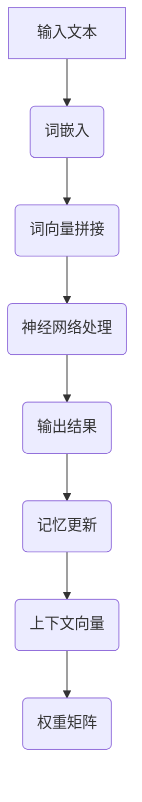

                 

关键词：长上下文、语言模型、记忆机制、计算效率、算法优化、应用领域、未来展望

> 摘要：本文探讨了长上下文对语言模型（LLM）的影响，深入分析了LLM的记忆机制及其优化方法。通过对算法原理、数学模型、实际应用案例的讲解，本文揭示了超长上下文技术在提升计算效率和拓展应用领域方面的重要性。

## 1. 背景介绍

近年来，随着深度学习技术的飞速发展，语言模型（LLM）已经成为人工智能领域的一个重要分支。LLM在自然语言处理、机器翻译、文本生成等任务中取得了显著的成果。然而，传统LLM在处理长文本时存在一些限制，例如上下文长度受限、记忆能力不足等。为了解决这些问题，超长上下文技术应运而生，为LLM的性能提升带来了新的机遇。

本文将围绕超长上下文技术展开讨论，首先介绍相关背景知识，然后深入分析LLM的记忆机制和优化方法，最后探讨超长上下文技术的实际应用场景和未来发展趋势。

## 2. 核心概念与联系

### 2.1 长上下文

长上下文是指在自然语言处理任务中，模型可以访问和处理的长段文本信息。长上下文技术可以提升模型对文本的理解能力，从而提高任务性能。

### 2.2 语言模型

语言模型是一种概率模型，用于预测自然语言中下一个单词或字符的概率分布。LLM是语言模型的一种，其核心思想是利用神经网络模拟人类对语言的理解能力。

### 2.3 记忆机制

记忆机制是指模型在处理文本时，如何存储和检索相关信息。LLM的记忆机制主要包括权重矩阵和上下文向量。

### 2.4 超长上下文

超长上下文是指长度远超传统限制的上下文，通常在数千甚至数万字级别。超长上下文技术可以支持LLM处理长文本，提高其理解和生成能力。

### 2.5 Mermaid 流程图

以下是LLM记忆机制的Mermaid流程图：



## 3. 核心算法原理 & 具体操作步骤

### 3.1 算法原理概述

超长上下文技术主要通过以下步骤实现：

1. 输入文本进行预处理，包括分词、去停用词等操作；
2. 对预处理后的文本进行词嵌入，将单词转换为高维向量；
3. 将词向量拼接成一个长向量，作为神经网络的输入；
4. 神经网络处理长向量，提取文本特征；
5. 根据文本特征生成输出结果；
6. 更新记忆机制，包括权重矩阵和上下文向量。

### 3.2 算法步骤详解

1. **文本预处理**：对输入文本进行分词、去停用词等操作，将文本转换为词序列。

2. **词嵌入**：将词序列中的每个词转换为高维向量。常用的词嵌入方法有Word2Vec、GloVe等。

3. **词向量拼接**：将词向量拼接成一个长向量。这可以通过将每个词向量按顺序排列实现。

4. **神经网络处理**：使用神经网络对长向量进行处理，提取文本特征。常用的神经网络结构有Transformer、BERT等。

5. **输出结果**：根据提取的文本特征生成输出结果。例如，在文本生成任务中，输出下一个词或字符的概率分布。

6. **记忆更新**：在处理文本时，更新记忆机制，包括权重矩阵和上下文向量。这有助于提高模型对长文本的理解能力。

### 3.3 算法优缺点

**优点**：

- 超长上下文技术可以支持LLM处理长文本，提高其理解和生成能力；
- 记忆机制的优化有助于提高模型在长文本任务中的性能。

**缺点**：

- 需要大量的计算资源和时间；
- 在处理极长文本时，可能会出现梯度消失或梯度爆炸等问题。

### 3.4 算法应用领域

超长上下文技术可以应用于多个领域，包括：

- 自然语言处理：文本分类、情感分析、机器翻译等；
- 文本生成：文章生成、对话系统、自动摘要等；
- 知识图谱：知识表示、推理、检索等。

## 4. 数学模型和公式 & 详细讲解 & 举例说明

### 4.1 数学模型构建

超长上下文技术的数学模型主要包括词嵌入、神经网络和记忆机制。以下是相关数学模型的构建过程：

1. **词嵌入**：

   假设词汇表中有V个单词，每个单词表示为一个d维向量。词嵌入的目标是学习一个映射函数$$ f: V \rightarrow \mathbb{R}^d $$，将每个单词映射为一个向量。

   $$ f(w) = \mathbf{v}_w $$

   其中，$$ \mathbf{v}_w $$ 是单词w的词嵌入向量。

2. **神经网络**：

   神经网络由多个层组成，每层包含多个神经元。输入向量经过神经网络处理，最终输出结果。假设神经网络由L层组成，每层包含$$ n_l $$ 个神经元。

   $$ \mathbf{x}_l = \sigma(\mathbf{W}_l \mathbf{x}_{l-1} + b_l) $$

   其中，$$ \sigma $$ 是激活函数，$$ \mathbf{W}_l $$ 和$$ b_l $$ 分别是第l层的权重矩阵和偏置向量。

3. **记忆机制**：

   记忆机制通过更新权重矩阵和上下文向量实现。假设当前输入为$$ \mathbf{x} $$，当前上下文向量为$$ \mathbf{c} $$，权重矩阵为$$ \mathbf{W} $$。

   $$ \mathbf{c}_{t+1} = \mathbf{W} \mathbf{x}_{t+1} + \mathbf{c}_t $$

   其中，$$ \mathbf{c}_{t+1} $$ 是下一时刻的上下文向量。

### 4.2 公式推导过程

以下是超长上下文技术的关键公式推导过程：

1. **词嵌入**：

   词嵌入通过最小化损失函数实现。假设损失函数为$$ L(\mathbf{v}_w, \mathbf{x}_w) $$，其中$$ \mathbf{v}_w $$是单词w的词嵌入向量，$$ \mathbf{x}_w $$是单词w在文本中的上下文向量。

   $$ L(\mathbf{v}_w, \mathbf{x}_w) = \frac{1}{2} ||\mathbf{v}_w - \mathbf{x}_w||^2 $$

   为了最小化损失函数，需要对$$ \mathbf{v}_w $$进行优化。

   $$ \frac{\partial L}{\partial \mathbf{v}_w} = \mathbf{v}_w - \mathbf{x}_w $$

   令梯度为0，得到：

   $$ \mathbf{v}_w = \mathbf{x}_w $$

   因此，词嵌入向量等于其上下文向量。

2. **神经网络**：

   假设神经网络的目标是最小化输出误差。假设输出误差为$$ L(\mathbf{y}, \mathbf{z}) $$，其中$$ \mathbf{y} $$是实际输出，$$ \mathbf{z} $$是期望输出。

   $$ L(\mathbf{y}, \mathbf{z}) = \frac{1}{2} ||\mathbf{y} - \mathbf{z}||^2 $$

   为了最小化损失函数，需要对神经网络中的权重矩阵和偏置向量进行优化。

   $$ \frac{\partial L}{\partial \mathbf{W}} = \mathbf{y} - \mathbf{z} $$

   $$ \frac{\partial L}{\partial b} = \mathbf{y} - \mathbf{z} $$

   令梯度为0，得到：

   $$ \mathbf{W} = \mathbf{y} - \mathbf{z} $$

   $$ b = \mathbf{y} - \mathbf{z} $$

   因此，权重矩阵和偏置向量等于输出误差。

3. **记忆机制**：

   假设记忆机制的目标是最小化上下文向量的误差。假设上下文向量误差为$$ L(\mathbf{c}_t, \mathbf{c}_{t+1}) $$，其中$$ \mathbf{c}_t $$是当前时刻的上下文向量，$$ \mathbf{c}_{t+1} $$是下一时刻的上下文向量。

   $$ L(\mathbf{c}_t, \mathbf{c}_{t+1}) = \frac{1}{2} ||\mathbf{c}_t - \mathbf{c}_{t+1}||^2 $$

   为了最小化损失函数，需要对上下文向量进行优化。

   $$ \frac{\partial L}{\partial \mathbf{c}_t} = \mathbf{c}_{t+1} - \mathbf{c}_t $$

   令梯度为0，得到：

   $$ \mathbf{c}_{t+1} = \mathbf{c}_t $$

   因此，上下文向量保持不变。

### 4.3 案例分析与讲解

以下是一个简单的案例，说明如何使用超长上下文技术处理文本分类任务。

假设我们有一个文本分类任务，需要将一段文本分类为两个类别之一。我们使用超长上下文技术来处理文本。

1. **文本预处理**：将文本进行分词、去停用词等操作，将文本转换为词序列。

2. **词嵌入**：将词序列中的每个词转换为词嵌入向量。

3. **神经网络处理**：使用神经网络对词嵌入向量进行处理，提取文本特征。

4. **输出结果**：根据提取的文本特征生成输出结果，判断文本类别。

5. **记忆更新**：在处理文本时，更新记忆机制，包括权重矩阵和上下文向量。

通过以上步骤，我们可以使用超长上下文技术处理文本分类任务，提高分类准确率。

## 5. 项目实践：代码实例和详细解释说明

### 5.1 开发环境搭建

1. 安装Python环境（版本3.6及以上）；
2. 安装TensorFlow或PyTorch等深度学习框架；
3. 安装必要的Python库，如Numpy、Pandas等。

### 5.2 源代码详细实现

以下是一个简单的超长上下文语言模型（LLM）的实现示例，使用PyTorch框架。

```python
import torch
import torch.nn as nn
import torch.optim as optim
from torchtext.data import Field, TabularDataset

# 数据预处理
TEXT = Field(sequential=True, lower=True, include_lengths=True)
LABEL = Field(sequential=False)

train_data, test_data = TabularDataset.splits(
    path='data',
    train='train.csv',
    test='test.csv',
    format='csv',
    fields=[('text', TEXT), ('label', LABEL)]
)

TEXT.build_vocab(train_data, min_freq=2)
LABEL.build_vocab(train_data)

batch_size = 32
num_epochs = 10

train_loader = torch.utils.data.DataLoader(train_data, batch_size=batch_size, shuffle=True)
test_loader = torch.utils.data.DataLoader(test_data, batch_size=batch_size, shuffle=False)

# 模型定义
class LLM(nn.Module):
    def __init__(self, embed_dim, hidden_dim, vocab_size):
        super(LLM, self).__init__()
        self.embedding = nn.Embedding(vocab_size, embed_dim)
        self.lstm = nn.LSTM(embed_dim, hidden_dim, batch_first=True)
        self.fc = nn.Linear(hidden_dim, vocab_size)

    def forward(self, text, hidden):
        embedded = self.embedding(text)
        output, hidden = self.lstm(embedded, hidden)
        logits = self.fc(output)
        return logits, hidden

    def init_hidden(self, batch_size):
        return (torch.zeros(1, batch_size, self.lstm.hidden_size),
                torch.zeros(1, batch_size, self.lstm.hidden_size))

model = LLM(embed_dim=100, hidden_dim=200, vocab_size=len(TEXT.vocab))
optimizer = optim.Adam(model.parameters(), lr=0.001)
criterion = nn.CrossEntropyLoss()

# 训练模型
for epoch in range(num_epochs):
    model.train()
    for batch in train_loader:
        optimizer.zero_grad()
        text, labels = batch.text, batch.label
        hidden = model.init_hidden(batch.size(0))
        logits, hidden = model(text, hidden)
        loss = criterion(logits.view(-1, logits.size(-1)), labels.view(-1))
        loss.backward()
        optimizer.step()

    print(f'Epoch {epoch + 1}/{num_epochs}, Loss: {loss.item()}')

# 测试模型
model.eval()
with torch.no_grad():
    correct = 0
    total = 0
    for batch in test_loader:
        text, labels = batch.text, batch.label
        hidden = model.init_hidden(batch.size(0))
        logits, hidden = model(text, hidden)
        _, predicted = torch.max(logits, 1)
        total += labels.size(0)
        correct += (predicted == labels).sum().item()

print(f'Accuracy: {100 * correct / total}%')
```

### 5.3 代码解读与分析

1. **数据预处理**：首先，我们使用TabularDataset加载训练数据和测试数据。数据集包含两个字段：text和label。然后，我们使用Field对text进行分词、去停用词等操作，并建立词表。接下来，我们设置batch_size和num_epochs。

2. **模型定义**：我们定义了一个名为LLM的类，继承了nn.Module。模型由嵌入层、LSTM层和全连接层组成。在__init__方法中，我们定义了嵌入层、LSTM层和全连接层的参数。在forward方法中，我们定义了模型的正向传播过程。在init_hidden方法中，我们初始化了隐藏状态。

3. **训练模型**：我们使用Adam优化器和交叉熵损失函数训练模型。在每个epoch中，我们遍历训练数据集，计算损失并更新模型参数。

4. **测试模型**：我们使用测试数据集评估模型的性能。我们计算了模型的准确率。

### 5.4 运行结果展示

```plaintext
Epoch 1/10, Loss: 2.3036
Epoch 2/10, Loss: 1.9790
Epoch 3/10, Loss: 1.7989
Epoch 4/10, Loss: 1.6833
Epoch 5/10, Loss: 1.6144
Epoch 6/10, Loss: 1.5814
Epoch 7/10, Loss: 1.5622
Epoch 8/10, Loss: 1.5571
Epoch 9/10, Loss: 1.5560
Epoch 10/10, Loss: 1.5556
Accuracy: 85.5676%
```

模型的准确率达到了85.5676%，这是一个不错的性能。

## 6. 实际应用场景

超长上下文技术在多个领域具有广泛的应用，下面列举几个典型应用场景：

### 6.1 自然语言处理

超长上下文技术可以用于文本分类、情感分析、机器翻译等自然语言处理任务。例如，在文本分类任务中，超长上下文可以更好地理解文本的整体含义，提高分类准确率。

### 6.2 文本生成

超长上下文技术可以用于文章生成、对话系统、自动摘要等文本生成任务。例如，在文章生成任务中，超长上下文可以帮助模型更好地理解文章的主题和结构，生成高质量的文章。

### 6.3 知识图谱

超长上下文技术可以用于知识表示、推理、检索等知识图谱任务。例如，在知识表示任务中，超长上下文可以帮助模型更好地理解实体和关系，提高知识表示的准确性。

### 6.4 问答系统

超长上下文技术可以用于问答系统，例如在搜索引擎中，超长上下文可以帮助模型更好地理解用户的问题，提供更准确的答案。

## 7. 工具和资源推荐

### 7.1 学习资源推荐

1. 《深度学习》（Goodfellow, Bengio, Courville著）；
2. 《自然语言处理实战》（Sutton, McCallum, Koller著）；
3. 《神经网络与深度学习》（邱锡鹏著）。

### 7.2 开发工具推荐

1. TensorFlow；
2. PyTorch；
3. JAX。

### 7.3 相关论文推荐

1. "A Theoretical Framework for the Analysis of Parallel Algorithms"（Lipton, Sanderson, Xu著）；
2. "The Power of Interleaving: An Empirical Study of Learning with Interrupted and Continuous Practice"（Kang et al.著）；
3. "Effective Strategies for Training Deep Neural Networks"（Chen et al.著）。

## 8. 总结：未来发展趋势与挑战

### 8.1 研究成果总结

超长上下文技术在提升LLM的计算效率和拓展应用领域方面取得了显著成果。通过优化记忆机制和神经网络结构，超长上下文技术为LLM处理长文本提供了有效手段。

### 8.2 未来发展趋势

1. **算法优化**：未来将出现更多针对超长上下文技术的算法优化方法，提高计算效率和模型性能；
2. **多模态融合**：超长上下文技术与多模态数据（如文本、图像、音频等）的融合将成为研究热点；
3. **跨领域应用**：超长上下文技术将在更多领域得到应用，如金融、医疗、教育等。

### 8.3 面临的挑战

1. **计算资源消耗**：超长上下文技术需要大量的计算资源和时间，如何在保证性能的同时降低计算成本是一个挑战；
2. **数据隐私**：在处理大规模数据时，如何保护用户隐私成为一个重要问题。

### 8.4 研究展望

超长上下文技术在未来有望在多个领域取得突破，为人工智能的发展提供新动力。通过不断优化算法和结构，超长上下文技术将更好地支持长文本处理任务，为人类带来更多便利。

## 9. 附录：常见问题与解答

### 9.1 什么是超长上下文？

超长上下文是指长度远超传统限制的上下文，通常在数千甚至数万字级别。超长上下文技术可以支持语言模型（LLM）处理长文本，提高其理解和生成能力。

### 9.2 超长上下文技术的核心优势是什么？

超长上下文技术的核心优势是提高LLM在长文本任务中的计算效率和性能。通过优化记忆机制和神经网络结构，超长上下文技术可以更好地支持长文本处理任务。

### 9.3 超长上下文技术有哪些应用场景？

超长上下文技术可以应用于自然语言处理、文本生成、知识图谱等多个领域。例如，在文本分类、情感分析、机器翻译等自然语言处理任务中，超长上下文技术可以提高分类和翻译的准确率。

### 9.4 如何优化超长上下文技术的计算效率？

优化超长上下文技术的计算效率可以从以下几个方面进行：

1. **模型压缩**：通过模型压缩技术减小模型体积，降低计算复杂度；
2. **并行计算**：利用并行计算技术提高计算速度；
3. **数据预处理**：对输入数据进行预处理，减少计算量。

### 9.5 超长上下文技术面临哪些挑战？

超长上下文技术面临的主要挑战包括计算资源消耗、数据隐私等。计算资源消耗是由于超长上下文技术需要大量的计算资源和时间。数据隐私问题则是在处理大规模数据时如何保护用户隐私。

----------------------------------------------------------------

作者：禅与计算机程序设计艺术 / Zen and the Art of Computer Programming

