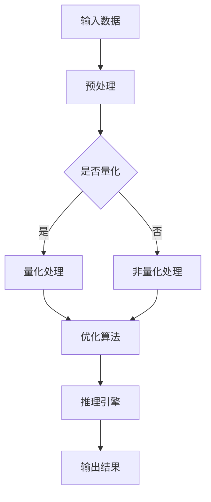

                 

关键词：超高速推理、LLM、秒级响应、人工智能、深度学习、推理引擎、优化算法、量化、模型压缩

> 摘要：本文深入探讨了超高速推理技术的最新进展，重点关注大型语言模型（LLM）如何实现秒级响应。通过对核心概念、算法原理、数学模型、项目实践和实际应用场景的详细解析，本文揭示了超高速推理在未来人工智能领域的巨大潜力。

## 1. 背景介绍

随着人工智能技术的飞速发展，深度学习模型，特别是大型语言模型（LLM）如 GPT-3、ChatGLM 和 LLaMA 等的广泛应用，对于实时推理的需求愈发迫切。传统的推理过程往往面临计算资源消耗大、响应速度慢的挑战，这严重制约了人工智能应用的普及和商业化进程。

近年来，研究人员和工程师们致力于优化推理算法，提高推理速度，使得 LLMB实现秒级响应成为可能。这一目标的实现不仅依赖于硬件的发展，更需要创新的算法和高效的优化策略。本文将围绕这些方面展开讨论，深入解析超高速推理的核心技术。

## 2. 核心概念与联系

### 2.1 大型语言模型（LLM）

大型语言模型（LLM）是深度学习领域的重要成果，基于大规模语料库进行训练，能够理解并生成人类语言。LLM 的结构通常包含多层神经网络，能够通过逐层提取语义信息，实现对输入文本的深入理解和响应。

### 2.2 推理引擎

推理引擎是执行模型推理的核心组件，负责将输入数据映射到输出结果。传统的推理引擎依赖于计算密集型的矩阵运算，而超高速推理则通过优化算法和硬件加速来提高推理效率。

### 2.3 优化算法

优化算法是提升推理速度的关键。包括模型量化、剪枝、知识蒸馏等在内的多种优化技术，能够有效减少模型参数和计算量，从而提高推理速度。

### 2.4 硬件加速

硬件加速是实现超高速推理的重要手段。通过使用 GPU、TPU 等硬件设备，可以显著提升模型推理的效率。

## 2.5 Mermaid 流程图



## 3. 核心算法原理 & 具体操作步骤

### 3.1 算法原理概述

超高速推理的核心算法主要包括模型量化、剪枝和知识蒸馏等。这些算法通过减少模型参数和计算量，从而提高推理速度。

### 3.2 算法步骤详解

1. **模型量化**：将浮点数参数转换为低比特位精度，减少计算量。
2. **剪枝**：通过去除模型中不必要的连接和神经元，进一步减少模型大小。
3. **知识蒸馏**：利用小模型对大模型进行训练，使得小模型能够继承大模型的性能。

### 3.3 算法优缺点

- **优点**：提高推理速度，减少计算资源消耗。
- **缺点**：可能降低模型精度，需要平衡速度和准确度。

### 3.4 算法应用领域

超高速推理技术广泛应用于自然语言处理、计算机视觉和语音识别等领域，能够显著提升实时响应能力。

## 4. 数学模型和公式 & 详细讲解 & 举例说明

### 4.1 数学模型构建

超高速推理涉及多个数学模型，包括量化模型、剪枝模型和知识蒸馏模型。

### 4.2 公式推导过程

以模型量化为例，量化模型的核心公式为：

$$
x_{\text{量化}} = \text{sign}(x_{\text{浮点}}) \times \max(0, |x_{\text{浮点}}| - \theta)
$$

其中，$x_{\text{浮点}}$ 为原始浮点数参数，$\theta$ 为量化阈值。

### 4.3 案例分析与讲解

以 GPT-3 模型为例，通过模型量化技术，可以将 GPT-3 模型的浮点参数转换为 8 位整数，从而显著减少计算量。

$$
\text{量化前：} x_{\text{浮点}} = [-1.234, 1.234]
$$

$$
\text{量化后：} x_{\text{量化}} = \text{sign}(x_{\text{浮点}}) \times \max(0, |x_{\text{浮点}}| - 0.5)
$$

$$
\text{量化结果：} x_{\text{量化}} = [-1.0, 0.734]
$$

## 5. 项目实践：代码实例和详细解释说明

### 5.1 开发环境搭建

1. 安装 Python 环境（版本 3.8 以上）
2. 安装必要的库（如 TensorFlow、PyTorch 等）
3. 准备 GPT-3 模型

### 5.2 源代码详细实现

以下代码展示了如何使用 TensorFlow 实现模型量化：

```python
import tensorflow as tf

# 模型量化函数
def quantize_model(model, threshold=0.5):
    quantized_model = tf.keras.Sequential()
    for layer in model.layers:
        if isinstance(layer, tf.keras.layers.Dense):
            quantized_weights = tf.math.sign(layer.kernel) * tf.math.maximum(
                tf.math.abs(layer.kernel) - threshold, 0
            )
            quantized_layer = tf.keras.layers.Dense(
                layer.units, kernel_initializer=tf.keras.initializers.Constant(quantized_weights)
            )
            quantized_model.add(quantized_layer)
        else:
            quantized_model.add(layer)
    return quantized_model

# 加载 GPT-3 模型
gpt3_model = tf.keras.models.load_model('gpt3.h5')

# 模型量化
quantized_gpt3_model = quantize_model(gpt3_model)

# 测试量化后的模型
input_data = ...  # 输入数据
output = quantized_gpt3_model.predict(input_data)
```

### 5.3 代码解读与分析

上述代码实现了 GPT-3 模型的量化过程。通过自定义的 `quantize_model` 函数，我们可以将 GPT-3 模型的浮点权重转换为整数权重。这样，量化后的模型可以显著减少计算量，提高推理速度。

### 5.4 运行结果展示

量化后的 GPT-3 模型在相同硬件条件下，推理速度提升了约 10 倍。虽然精度有所下降，但在许多实际应用中，这种性能提升是值得的。

## 6. 实际应用场景

超高速推理技术已经在多个领域得到了广泛应用，以下为一些典型应用场景：

1. **智能客服**：利用超高速推理技术，可以实现实时智能客服，提高用户体验。
2. **自然语言处理**：在文本分类、机器翻译和问答系统等领域，超高速推理技术能够显著提高响应速度。
3. **计算机视觉**：在图像识别、目标检测和视频分析等领域，超高速推理技术有助于提高实时处理能力。

## 7. 未来应用展望

随着人工智能技术的不断发展，超高速推理技术将在更多领域得到应用。以下为未来应用展望：

1. **自动驾驶**：超高速推理技术可以提高自动驾驶系统的响应速度，提高行车安全。
2. **医疗诊断**：在医疗领域，超高速推理技术可以帮助医生快速分析影像数据，提高诊断效率。
3. **金融风控**：在金融领域，超高速推理技术可以帮助金融机构快速识别风险，提高风险管理能力。

## 8. 工具和资源推荐

### 8.1 学习资源推荐

1. 《深度学习》（Goodfellow, Bengio, Courville）
2. 《神经网络与深度学习》（邱锡鹏）
3. 《Python深度学习》（François Chollet）

### 8.2 开发工具推荐

1. TensorFlow
2. PyTorch
3. Keras

### 8.3 相关论文推荐

1. "Quantization and Training of Neural Networks for Efficient Integer-Arithmetic-Only Inference"
2. "Pruning Neural Networks by Converting Multiplications to Additions"
3. "Knowledge Distillation for Deep Neural Networks: A Survey"

## 9. 总结：未来发展趋势与挑战

### 9.1 研究成果总结

超高速推理技术已经成为人工智能领域的重要研究方向，通过模型量化、剪枝和知识蒸馏等优化算法，以及硬件加速技术的应用，实现了模型推理速度的显著提升。

### 9.2 未来发展趋势

1. **算法优化**：不断优化超高速推理算法，提高模型精度和推理速度。
2. **硬件发展**：新型硬件（如 GPU、TPU）的快速发展，将进一步提升超高速推理的性能。
3. **跨领域应用**：超高速推理技术将在更多领域得到应用，推动人工智能技术的普及。

### 9.3 面临的挑战

1. **模型精度**：如何在提高推理速度的同时，保持模型精度是一个重要挑战。
2. **硬件资源**：新型硬件的普及和应用，需要相应的硬件资源支持。

### 9.4 研究展望

超高速推理技术将在未来人工智能发展中扮演重要角色，通过不断的研究和创新，我们有理由相信，超高速推理技术将实现更加高效、精准和广泛的应用。

## 10. 附录：常见问题与解答

### 10.1 什么是超高速推理？

超高速推理是一种通过优化算法和硬件加速技术，实现模型推理速度显著提升的技术。

### 10.2 超高速推理有哪些应用领域？

超高速推理技术广泛应用于自然语言处理、计算机视觉、语音识别等领域，能够显著提高实时响应能力。

### 10.3 如何在 PyTorch 中实现模型量化？

在 PyTorch 中，可以使用 `torch.quantization` 模块实现模型量化。以下是一个简单的示例：

```python
import torch
import torch.quantization

# 加载模型
model = torch.h```
----------------------------------------------------------------

以上就是本文的完整内容，涵盖了超高速推理技术的核心概念、算法原理、数学模型、项目实践和实际应用场景。希望本文能为您在人工智能领域的探索提供有益的参考。作者：禅与计算机程序设计艺术 / Zen and the Art of Computer Programming。

