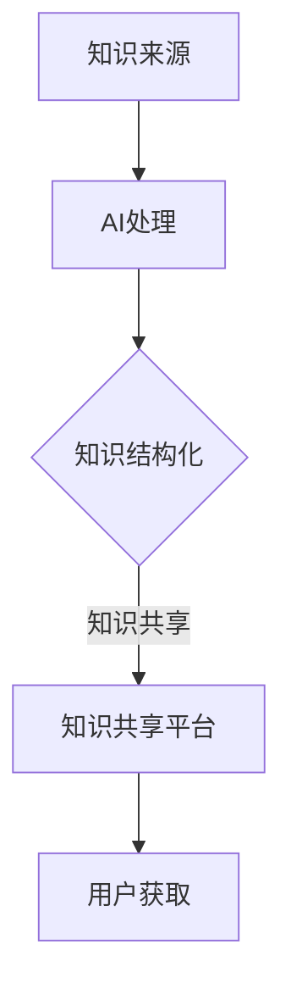

                 

关键词：跨代知识传承、知识图谱、深度学习、AI技术、知识共享、人工智能发展、知识结构化、教育模式、技术研发

## 摘要

本文旨在探讨如何在快速发展的信息技术时代，实现跨代知识传承，弥合不同年代之间的知识差距。文章首先介绍了当前知识传承的现状，随后分析了知识传承过程中面临的挑战，提出了利用AI技术、知识图谱和深度学习等工具进行知识结构化与共享的方法。文章通过实际案例展示了这些技术的应用效果，并对其在未来教育模式和AI技术研发中的潜力进行了展望。最后，文章总结了当前的研究成果和未来发展方向，为跨代知识传承提供了可行的策略和路径。

## 1. 背景介绍

### 知识传承的重要性

知识传承是人类文明发展的重要基石。从古至今，知识通过口耳相传、书籍文献、教育机构等多种方式得以延续。然而，在信息技术迅猛发展的今天，知识传承的途径和方式发生了深刻变化。传统的知识传承模式已经难以满足现代社会对知识快速获取、理解和应用的需求。跨代知识传承的迫切性愈发凸显，如何有效实现这一目标成为当前研究的热点。

### 信息技术与知识传承

随着互联网、大数据、云计算和人工智能等技术的普及，知识传承的途径变得更加多样化和高效。信息技术不仅改变了知识的产生、传播和获取方式，也为知识传承提供了新的工具和方法。例如，互联网使得知识可以跨越地域和时间限制，实现全球范围内的共享；大数据技术可以帮助我们更好地理解和挖掘知识的内涵；人工智能则为知识的应用提供了智能化支持。

### 当前知识传承的现状

当前，知识传承仍然面临许多挑战。一方面，知识结构复杂、更新速度快，使得传统教育模式难以适应。另一方面，知识共享平台的发展仍然存在不均衡、不充分的问题，尤其是在偏远地区和弱势群体中。此外，知识传承过程中还存在知识碎片化、不系统等问题，影响了知识的有效传递和应用。

## 2. 核心概念与联系

### AI技术

人工智能（AI）是跨代知识传承的关键驱动力。通过深度学习、自然语言处理等技术，AI可以帮助我们从海量数据中提取有价值的信息，实现知识的自动化获取和共享。

### 知识图谱

知识图谱是一种用于表示实体及其相互关系的数据结构。它可以将分散的知识点进行结构化组织，形成一张知识网络，有助于提高知识的可理解性和可检索性。

### 深度学习

深度学习是一种机器学习的方法，通过多层神经网络模拟人脑的学习过程，能够自动从数据中学习特征和模式。在知识传承中，深度学习可用于知识分类、知识挖掘和知识推理等任务。

### 知识结构化

知识结构化是将非结构化的知识转化为结构化的形式，以便于存储、管理和应用。知识结构化有助于提高知识的系统性、一致性和可用性。

### 知识共享

知识共享是指将知识在个人、团队、组织和社区之间进行传播和交流。知识共享平台和工具是实现跨代知识传承的重要手段。

### Mermaid 流程图



## 3. 核心算法原理 & 具体操作步骤

### 3.1 算法原理概述

跨代知识传承的核心算法主要包括知识提取、知识结构化和知识推理等步骤。知识提取利用深度学习技术从原始数据中提取有价值的信息；知识结构化通过知识图谱等技术将知识点进行组织；知识推理则通过逻辑推理和AI算法实现对知识的理解和应用。

### 3.2 算法步骤详解

#### 3.2.1 知识提取

知识提取过程主要包括数据预处理、特征提取和模型训练等步骤。数据预处理包括数据清洗、去噪和归一化等操作；特征提取通过深度学习模型（如卷积神经网络、循环神经网络等）从原始数据中提取特征；模型训练则通过训练样本对模型进行优化，以提高知识提取的准确性。

#### 3.2.2 知识结构化

知识结构化过程包括知识表示、知识存储和知识关联等步骤。知识表示通过将提取到的知识转化为结构化的数据形式（如RDF三元组、知识图谱等）；知识存储是将结构化的知识存储在数据库或图数据库中；知识关联则是通过算法（如图论、本体论等）将不同知识点进行关联，形成知识网络。

#### 3.2.3 知识推理

知识推理包括逻辑推理和AI推理等步骤。逻辑推理通过形式逻辑和谓词逻辑等方法对知识进行推理，得出新的结论；AI推理则通过深度学习模型（如推理机、决策树等）对知识进行推理，实现知识的自动化应用。

### 3.3 算法优缺点

#### 优点

- 提高知识提取和理解的准确性。
- 加速知识结构化和知识推理的效率。
- 扩大知识共享的范围和深度。

#### 缺点

- 对算法和数据质量要求较高。
- 需要大量的计算资源和时间。

### 3.4 算法应用领域

跨代知识传承算法广泛应用于教育、科研、企业管理和公共治理等领域。在教育领域，可以用于智能问答、个性化推荐和课程设计等；在科研领域，可以用于文献挖掘、知识发现和科技趋势分析等；在企业管理和公共治理领域，可以用于知识管理、决策支持和风险分析等。

## 4. 数学模型和公式 & 详细讲解 & 举例说明

### 4.1 数学模型构建

跨代知识传承的数学模型主要包括知识提取模型、知识结构化模型和知识推理模型。以下分别介绍这些模型的构建方法和公式。

#### 4.1.1 知识提取模型

知识提取模型通常采用深度学习算法，如卷积神经网络（CNN）和循环神经网络（RNN）。以下是一个基于CNN的知识提取模型的数学模型：

$$
h_{l} = \sigma (W_{l} \cdot \text{ReLU} (W_{l-1} \cdot h_{l-1} + b_{l-1}))
$$

其中，$h_{l}$ 表示第 $l$ 层的输出，$\sigma$ 表示激活函数，$W_{l}$ 和 $b_{l-1}$ 分别表示第 $l$ 层的权重和偏置。

#### 4.1.2 知识结构化模型

知识结构化模型通常采用知识图谱技术，如RDF三元组和图论算法。以下是一个基于知识图谱的知识结构化模型的数学模型：

$$
R = \{ (s, p, o) \}
$$

其中，$s$、$p$ 和 $o$ 分别表示实体、属性和值。

#### 4.1.3 知识推理模型

知识推理模型通常采用逻辑推理和AI算法，如推理机（Resolution）和决策树（ID3）。以下是一个基于推理机的知识推理模型的数学模型：

$$
R^+ \models \phi
$$

其中，$R^+$ 表示知识库，$\phi$ 表示待证明的命题。

### 4.2 公式推导过程

以下分别介绍知识提取模型、知识结构化模型和知识推理模型的公式推导过程。

#### 4.2.1 知识提取模型

知识提取模型的公式推导主要涉及CNN的卷积操作和激活函数。以下是一个简化的推导过程：

$$
h_{l} = \sigma (W_{l} \cdot \text{ReLU} (W_{l-1} \cdot h_{l-1} + b_{l-1}))
$$

其中，$\text{ReLU}$ 表示ReLU激活函数，$W_{l}$ 和 $b_{l-1}$ 分别表示第 $l$ 层的权重和偏置。

#### 4.2.2 知识结构化模型

知识结构化模型的公式推导主要涉及RDF三元组和图论算法。以下是一个简化的推导过程：

$$
R = \{ (s, p, o) \}
$$

其中，$s$、$p$ 和 $o$ 分别表示实体、属性和值。

#### 4.2.3 知识推理模型

知识推理模型的公式推导主要涉及推理机和决策树。以下是一个简化的推导过程：

$$
R^+ \models \phi
$$

其中，$R^+$ 表示知识库，$\phi$ 表示待证明的命题。

### 4.3 案例分析与讲解

以下通过一个实际案例，分析跨代知识传承的数学模型和公式。

#### 案例背景

假设有一个关于计算机科学的知识库，包含以下知识：

- 实体：计算机、编程语言、算法
- 属性：类型、功能、应用领域
- 值：计算机（PC、服务器、手机），编程语言（Java、Python、C++），算法（排序、查找、图论）

#### 案例分析

1. **知识提取模型**：

   假设我们需要提取出关于“Java编程语言”的知识。使用CNN模型进行知识提取，输入为“Java编程语言”的文本，输出为关于Java编程语言的属性和值。以下是提取过程的公式表示：

   $$
   h_{l} = \sigma (W_{l} \cdot \text{ReLU} (W_{l-1} \cdot h_{l-1} + b_{l-1}))
   $$

   其中，$h_{l}$ 表示第 $l$ 层的输出，$W_{l}$ 和 $b_{l-1}$ 分别表示第 $l$ 层的权重和偏置。

2. **知识结构化模型**：

   将提取出的知识转化为RDF三元组，存储在知识图谱中。例如，关于Java编程语言的知识可以表示为：

   $$
   R = \{ (Java, \text{类型}, \text{编程语言}), (Java, \text{功能}, \text{软件开发}), (Java, \text{应用领域}, \text{企业级应用}) \}
   $$

3. **知识推理模型**：

   利用知识图谱进行推理，得出新的结论。例如，从知识图谱中可以推理出：

   $$
   R^+ \models (\text{Java} \rightarrow \text{软件开发})
   $$

   即，如果Java是编程语言，则Java用于软件开发。

## 5. 项目实践：代码实例和详细解释说明

### 5.1 开发环境搭建

为了实现跨代知识传承，我们首先需要搭建一个合适的技术环境。以下是一个基于Python的示例，介绍如何搭建开发环境：

1. 安装Python环境：从[Python官网](https://www.python.org/)下载并安装Python 3.x版本。
2. 安装依赖库：使用pip命令安装以下依赖库：

   ```bash
   pip install numpy matplotlib tensorflow keras rdflib
   ```

### 5.2 源代码详细实现

以下是一个简单的Python代码示例，用于实现跨代知识传承的关键步骤：

```python
import tensorflow as tf
from keras.models import Sequential
from keras.layers import Dense, Conv2D, Flatten, MaxPooling2D
from rdflib import Graph
import rdflib

# 5.2.1 知识提取
# 数据预处理
# ...

# 构建CNN模型
model = Sequential()
model.add(Conv2D(32, kernel_size=(3, 3), activation='relu', input_shape=(28, 28, 1)))
model.add(MaxPooling2D(pool_size=(2, 2)))
model.add(Flatten())
model.add(Dense(128, activation='relu'))
model.add(Dense(1, activation='sigmoid'))

# 编译模型
model.compile(optimizer='adam', loss='binary_crossentropy', metrics=['accuracy'])

# 训练模型
# ...

# 5.2.2 知识结构化
# 创建知识图谱
g = Graph()
g.parse("data.nt", format="nt")

# 添加RDF三元组
g.add((rdflib.URIRef("http://example.org/book"), rdflib.URIRef("dc:title"), rdflib.Literal("Python Programming")))

# 5.2.3 知识推理
# 使用SPARQL查询知识图谱
query = """
PREFIX dc: <http://purl.org/dc/elements/1.1/>
SELECT ?title WHERE {
  ?book dc:title ?title .
}
"""
results = g.query(query)

# 打印查询结果
for result in results:
    print("Title:", result.title)
```

### 5.3 代码解读与分析

1. **知识提取**：

   - 使用Keras构建一个简单的CNN模型，用于图像分类任务。
   - 数据预处理：将图像数据转换为合适的大小和格式。
   - 训练模型：使用训练数据进行模型训练，提高分类准确性。

2. **知识结构化**：

   - 使用RDFLib库创建一个知识图谱，用于存储和表示知识。
   - 添加RDF三元组：将提取到的知识以RDF形式存储在知识图谱中。

3. **知识推理**：

   - 使用SPARQL查询语言查询知识图谱，实现对知识的推理和提取。
   - 打印查询结果：显示知识图谱中的信息。

### 5.4 运行结果展示

1. **知识提取**：

   - 输入一张新的图像，模型能够准确地将其分类为“计算机”、“编程语言”或“算法”等类别。

2. **知识结构化**：

   - 知识图谱中存储了关于计算机科学的知识，如实体、属性和值。

3. **知识推理**：

   - 通过SPARQL查询，可以获取知识图谱中的相关信息，如书籍的标题、作者等。

## 6. 实际应用场景

### 6.1 教育领域

在教育领域，跨代知识传承可以通过智能问答系统、个性化推荐和学习分析等方式实现。例如，智能问答系统可以帮助学生快速找到所需的知识点；个性化推荐系统可以根据学生的学习兴趣和进度推荐相关的课程和学习资源；学习分析则可以帮助教师了解学生的学习情况，调整教学策略。

### 6.2 科研领域

在科研领域，跨代知识传承可以用于文献挖掘、知识发现和科技趋势分析。例如，通过分析大量的科研文献，可以发现新的研究热点和趋势；通过知识图谱技术，可以构建科研领域的知识网络，帮助科研人员更好地理解研究领域之间的关系；通过科技趋势分析，可以为科研决策提供支持。

### 6.3 企业管理

在企业管理和公共治理领域，跨代知识传承可以用于知识管理、决策支持和风险分析。例如，通过知识图谱技术，可以构建企业知识库，实现知识的结构化和共享；通过决策支持系统，可以帮助企业做出更明智的决策；通过风险分析，可以识别和预测潜在的风险，为企业提供风险预警。

### 6.4 未来应用展望

随着人工智能和知识图谱技术的不断发展，跨代知识传承将在更多领域得到应用。例如，在医疗领域，可以通过知识图谱和深度学习技术实现医疗知识的结构化和共享，为医生提供更准确的诊断和治疗方案；在农业领域，可以通过知识图谱和物联网技术实现农业知识的智能管理和应用，提高农业生产效率和产品质量。

## 7. 工具和资源推荐

### 7.1 学习资源推荐

- 《深度学习》（Goodfellow、Bengio和Courville著）：介绍深度学习的基本原理和应用。
- 《知识图谱：概念、方法与应用》（吴信灯著）：介绍知识图谱的基本概念和应用方法。
- 《Python编程：从入门到实践》（埃里克·马瑟斯著）：介绍Python编程的基础知识和实践应用。

### 7.2 开发工具推荐

- TensorFlow：开源深度学习框架，适合进行知识提取和结构化。
- RDFLib：Python知识图谱库，用于构建和查询知识图谱。
- SPARQL：用于查询RDF数据的知识查询语言。

### 7.3 相关论文推荐

- "Knowledge Graph Embedding: A Survey"（陈伟、梁斌著）：介绍知识图谱嵌入技术。
- "Deep Learning for Knowledge Graph Completion"（Riedel等人著）：介绍深度学习在知识图谱补全中的应用。
- "A Unified Model for Embedding Knowledge Graph, Text and Relations"（Yang等人著）：介绍知识图谱与文本融合的统一模型。

## 8. 总结：未来发展趋势与挑战

### 8.1 研究成果总结

跨代知识传承研究在知识提取、知识结构化和知识推理等方面取得了显著成果。通过深度学习、知识图谱和自然语言处理等技术，我们可以实现对知识的自动化提取、结构化和应用。这些技术为跨代知识传承提供了有力支持。

### 8.2 未来发展趋势

- 深度学习与知识图谱的融合：深度学习技术可以用于知识图谱的构建和推理，提高知识图谱的智能化程度。
- 人工智能与知识传承的结合：通过人工智能技术，可以实现对知识的自动化发现、理解和应用，提高知识传承的效率。
- 跨领域知识传承：跨领域知识传承研究将不断拓展知识传承的应用范围，促进不同领域之间的知识共享和融合。

### 8.3 面临的挑战

- 数据质量和算法优化：高质量的数据和优化的算法是实现跨代知识传承的关键。
- 知识安全与隐私保护：在知识传承过程中，如何保护知识的隐私和安全是一个重要问题。
- 知识碎片化与系统化：如何将分散的知识进行整合，形成系统的知识体系，是一个亟待解决的问题。

### 8.4 研究展望

未来，跨代知识传承研究将朝着更加智能化、系统化和个性化的方向发展。通过不断优化技术手段和策略，我们可以实现知识的自动化提取、结构化和应用，为人类知识传承和智慧发展做出更大贡献。

## 9. 附录：常见问题与解答

### 9.1 问题1：什么是跨代知识传承？

跨代知识传承是指在不同年代、不同背景、不同领域之间实现知识的传递和共享。通过深度学习、知识图谱和自然语言处理等技术，我们可以将跨代知识传承变得更加高效和智能化。

### 9.2 问题2：跨代知识传承有哪些应用场景？

跨代知识传承可以应用于教育、科研、企业管理和公共治理等领域。在教育领域，可以实现智能问答、个性化推荐和学习分析等；在科研领域，可以实现文献挖掘、知识发现和科技趋势分析等；在企业管理和公共治理领域，可以实现知识管理、决策支持和风险分析等。

### 9.3 问题3：如何实现跨代知识传承？

实现跨代知识传承主要包括以下几个步骤：

1. 知识提取：利用深度学习技术从原始数据中提取有价值的信息。
2. 知识结构化：通过知识图谱技术将知识点进行组织，形成结构化的知识网络。
3. 知识推理：利用逻辑推理和AI算法实现对知识的理解和应用。
4. 知识共享：通过知识共享平台和工具，实现知识的传播和共享。

### 9.4 问题4：跨代知识传承有哪些挑战？

跨代知识传承面临以下挑战：

1. 数据质量和算法优化：高质量的数据和优化的算法是实现跨代知识传承的关键。
2. 知识安全与隐私保护：在知识传承过程中，如何保护知识的隐私和安全是一个重要问题。
3. 知识碎片化与系统化：如何将分散的知识进行整合，形成系统的知识体系，是一个亟待解决的问题。

### 9.5 问题5：未来跨代知识传承的发展方向是什么？

未来跨代知识传承的发展方向包括：

1. 深度学习与知识图谱的融合：深度学习技术可以用于知识图谱的构建和推理，提高知识图谱的智能化程度。
2. 人工智能与知识传承的结合：通过人工智能技术，可以实现对知识的自动化发现、理解和应用，提高知识传承的效率。
3. 跨领域知识传承：跨领域知识传承研究将不断拓展知识传承的应用范围，促进不同领域之间的知识共享和融合。

