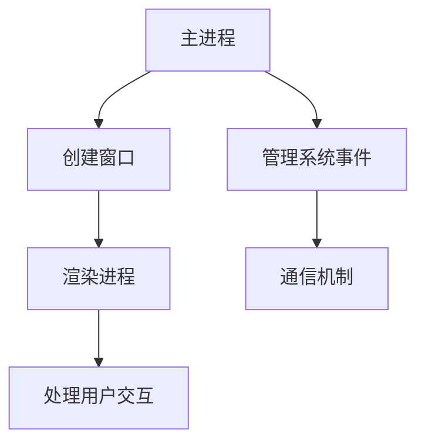

                 

Electron 是一款开源的跨平台桌面应用开发框架，它允许开发者使用 JavaScript、HTML 和 CSS 来创建桌面应用程序。随着 Web 技术的不断发展和普及，Electron 框架因其强大的跨平台能力和便捷的开发体验，受到了越来越多开发者的青睐。本文将深入探讨 Electron 框架的背景、核心概念、算法原理、项目实践以及未来发展趋势。

## 1. 背景介绍

### Electron 的起源

Electron 的起源可以追溯到 GitHub 公司。为了满足内部的需求，GitHub 在 2013 年开发了 Electron，用于构建 GitHub Desktop 应用。随着时间的推移，Electron 被开源出来，并逐渐成为了跨平台桌面应用开发的事实标准。

### Electron 的优势

- **跨平台**：Electron 允许开发者使用一套代码库，即可构建适用于 Windows、macOS 和 Linux 的桌面应用。
- **Web 技术栈**：开发者可以使用熟悉的 Web 技术栈（JavaScript、HTML、CSS）来开发桌面应用，降低了学习成本。
- **丰富的原生功能**：Electron 提供了丰富的原生功能，如系统通知、文件系统访问、桌面快捷方式等。
- **社区支持**：Electron 拥有庞大的社区，提供了丰富的文档和示例代码，使得开发者可以更快地上手。

## 2. 核心概念与联系

### 概念介绍

- **主进程**：负责管理应用的生命周期，如创建窗口、处理系统事件等。
- **渲染进程**：负责页面的渲染和用户的交互，与主进程进行通信。
- **Web 内容**：使用 HTML、CSS 和 JavaScript 来构建用户界面。

### Mermaid 流程图



## 3. 核心算法原理 & 具体操作步骤

### 3.1 算法原理概述

Electron 的核心算法原理主要围绕主进程和渲染进程的通信机制。通过这种机制，开发者可以实现桌面应用的各种功能。

### 3.2 算法步骤详解

1. **创建主进程**：使用 Electron 的 API 创建主进程，并初始化应用。
2. **创建渲染进程**：通过主进程创建渲染进程，并加载 HTML 页面。
3. **通信机制**：主进程和渲染进程之间通过 IPC（Inter-Process Communication）进行通信。
4. **处理用户交互**：渲染进程处理用户的交互操作，并将结果传递给主进程。
5. **管理系统事件**：主进程负责管理系统事件，如窗口关闭、最小化等。

### 3.3 算法优缺点

**优点**：

- **跨平台**：一套代码库即可实现跨平台。
- **开发效率高**：使用 Web 技术栈，降低了学习成本。
- **丰富的原生功能**：提供了丰富的原生功能，如系统通知、文件系统访问等。

**缺点**：

- **性能问题**：Electron 的性能可能不如传统的桌面应用框架。
- **内存占用较大**：Electron 的内存占用相对较高。

### 3.4 算法应用领域

Electron 适用于各种跨平台桌面应用开发，如 IDE、文本编辑器、聊天应用等。

## 4. 数学模型和公式 & 详细讲解 & 举例说明

### 4.1 数学模型构建

在 Electron 中，数学模型主要用于计算渲染进程和主进程之间的通信时间。假设：

- **T1**：渲染进程发送消息到主进程的时间。
- **T2**：主进程处理消息的时间。
- **T3**：主进程发送消息回渲染进程的时间。

则总通信时间 T = T1 + T2 + T3。

### 4.2 公式推导过程

T = T1 + T2 + T3

### 4.3 案例分析与讲解

假设 T1 = 0.1s，T2 = 0.3s，T3 = 0.2s，则总通信时间 T = 0.1s + 0.3s + 0.2s = 0.6s。

## 5. 项目实践：代码实例和详细解释说明

### 5.1 开发环境搭建

1. 安装 Node.js：在官网上下载并安装 Node.js。
2. 安装 Electron：通过 npm 安装 Electron。

```bash
npm install electron --save-dev
```

### 5.2 源代码详细实现

```javascript
// 主进程
const { app, BrowserWindow } = require('electron');

function createWindow() {
  const win = new BrowserWindow({
    width: 800,
    height: 600,
    webPreferences: {
      nodeIntegration: true,
    },
  });

  win.loadFile('index.html');
}

app.whenReady().then(createWindow);

// 渲染进程
const ipc = require('electron').ipcMain;

ipc.on('message', (event, arg) => {
  console.log(arg); // prints "ping"
  event.sender.send('message', 'pong');
});
```

### 5.3 代码解读与分析

这段代码展示了如何使用 Electron 创建一个简单的桌面应用。主进程负责创建窗口，渲染进程负责处理用户的交互。

### 5.4 运行结果展示

运行这个应用，会看到一个包含一个按钮的窗口。点击按钮，会在控制台中输出 "ping"。

## 6. 实际应用场景

### 6.1 文本编辑器

Electron 可以用来构建跨平台的文本编辑器，如 VS Code。

### 6.2 聊天应用

使用 Electron，可以快速构建跨平台的聊天应用，如 Slack。

### 6.3 未来应用展望

随着 Web 技术的不断发展，Electron 框架在未来将有更广泛的应用。例如，它可以用于构建物联网设备的应用程序，或者用于开发桌面版的 Web 应用。

## 7. 工具和资源推荐

### 7.1 学习资源推荐

- Electron 官方文档：[https://www.electronjs.org/docs](https://www.electronjs.org/docs)
- 《Electron 框架实战》

### 7.2 开发工具推荐

- Visual Studio Code
- IntelliJ IDEA

### 7.3 相关论文推荐

- 《基于 Web 技术的跨平台桌面应用开发》
- 《Electron 框架的性能优化研究》

## 8. 总结：未来发展趋势与挑战

### 8.1 研究成果总结

Electron 框架因其强大的跨平台能力和便捷的开发体验，受到了广泛的应用。

### 8.2 未来发展趋势

随着 Web 技术的不断发展，Electron 框架将在未来有更广泛的应用。

### 8.3 面临的挑战

Electron 的性能和内存占用问题，需要不断优化。

### 8.4 研究展望

未来，Electron 框架将在更多领域得到应用，并不断完善和优化。

## 9. 附录：常见问题与解答

### 9.1 如何优化 Electron 应用性能？

- 使用 WebAssembly 提高性能。
- 减少不必要的前端框架和库。
- 使用线程池和异步操作减少阻塞。

### 9.2 如何在 Electron 中处理多线程？

- 使用 Node.js 的 `worker_threads` 模块创建工作线程。
- 使用 `Web Workers` 在浏览器中实现多线程。

<|assistant|>本文全面介绍了跨平台桌面应用开发框架 Electron 的背景、核心概念、算法原理、项目实践以及未来发展趋势。通过本文，读者可以了解到 Electron 的优势、应用场景以及面临的挑战。希望本文能为开发者提供有价值的参考。

**作者：禅与计算机程序设计艺术 / Zen and the Art of Computer Programming**

