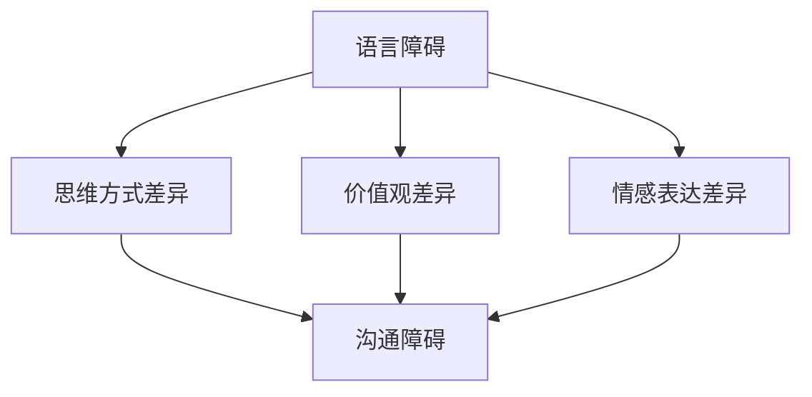

                 

关键词：跨文化理解、全球化、认知挑战、技术交流、文化差异

> 摘要：随着全球化的深入，跨文化理解在各个领域变得越来越重要。本文从IT技术的角度，探讨了全球化背景下跨文化理解的认知挑战，以及如何通过技术手段提升跨文化沟通效果。文章通过分析不同文化间的认知差异，提出了一系列解决方案，旨在促进全球化时代的技术交流与合作。

## 1. 背景介绍

在全球化迅猛发展的今天，技术已经成为推动全球经济发展和社会进步的重要力量。然而，技术的快速迭代和全球范围的广泛应用也带来了跨文化理解的认知挑战。无论是跨国公司、国际组织，还是个人用户，都面临着如何在多元文化背景下有效沟通和协作的问题。

IT技术作为全球化进程中的重要工具，其应用范围涵盖了电子商务、远程教育、跨国企业协作等多个领域。然而，不同文化背景下的人们在思维方式、价值观念、沟通方式等方面存在显著差异，这给技术交流和应用带来了诸多障碍。

本文旨在探讨全球化时代跨文化理解的认知挑战，通过分析不同文化间的认知差异，提出相应的解决方案，以期为促进全球范围内的技术交流与合作提供有益的参考。

## 2. 核心概念与联系

### 2.1 跨文化理解的定义

跨文化理解是指在不同文化背景下，个体或群体通过认知、情感和行为的互动，对其他文化的理解、认同和接纳。它不仅涉及语言、价值观、行为规范等显性文化的理解，还包括对隐性文化，如思维方式、情感表达等深层次文化的认知。

### 2.2 认知挑战

认知挑战主要表现在以下几个方面：

1. **语言障碍**：不同语言之间的差异导致信息传递的不准确，影响跨文化沟通的效率。
2. **思维方式差异**：不同文化背景下的人们在解决问题、决策过程中存在不同的思维模式，导致沟通和协作的困难。
3. **价值观差异**：文化差异导致的价值观差异，可能引发误解、冲突和沟通障碍。
4. **情感表达差异**：不同文化背景下的人们的情感表达方式不同，可能导致误解和沟通障碍。

### 2.3 Mermaid 流程图

下面是一个简化的Mermaid流程图，用于描述跨文化理解中的认知挑战：



## 3. 核心算法原理 & 具体操作步骤

### 3.1 算法原理概述

本文提出一种基于认知模型的跨文化理解算法，通过识别和分析不同文化间的认知差异，构建一个能够适应多种文化背景的沟通框架。该算法主要包括以下几个步骤：

1. **文化特征识别**：利用机器学习技术，分析不同文化背景下的语言、思维方式、价值观等特征。
2. **认知差异分析**：通过对比分析，识别出不同文化间的认知差异，并构建认知差异模型。
3. **沟通框架构建**：根据认知差异模型，构建一个能够适应多种文化背景的沟通框架。
4. **实时调整**：在沟通过程中，根据实时反馈，调整沟通策略，提高沟通效果。

### 3.2 算法步骤详解

1. **文化特征识别**
    - 数据收集：从不同文化背景的人群中收集语言、思维方式、价值观等方面的数据。
    - 数据预处理：对收集到的数据进行清洗、归一化处理，以便于后续分析。

2. **认知差异分析**
    - 特征提取：利用机器学习算法，提取语言、思维方式、价值观等特征。
    - 对比分析：对比不同文化背景下的特征差异，构建认知差异模型。

3. **沟通框架构建**
    - 框架设计：根据认知差异模型，设计一个能够适应多种文化背景的沟通框架。
    - 框架验证：通过实验验证沟通框架的有效性，并根据结果进行调整。

4. **实时调整**
    - 实时反馈：在沟通过程中，收集实时反馈，分析沟通效果。
    - 调整策略：根据实时反馈，调整沟通策略，提高沟通效果。

### 3.3 算法优缺点

**优点**：

- **适应性强**：能够适应多种文化背景，提高跨文化沟通的效率。
- **实时调整**：根据实时反馈，调整沟通策略，提高沟通效果。

**缺点**：

- **数据依赖性**：算法的性能依赖于数据的质量和多样性。
- **复杂性**：算法涉及多个步骤，实现和优化过程较为复杂。

### 3.4 算法应用领域

- **跨国企业协作**：通过优化跨文化沟通，提高跨国企业协作效率。
- **远程教育**：通过适应不同文化背景，提高远程教育的效果。
- **国际会议**：通过优化会议沟通，提高国际会议的效率和效果。

## 4. 数学模型和公式 & 详细讲解 & 举例说明

### 4.1 数学模型构建

本文采用贝叶斯网络模型来描述跨文化理解中的认知差异。贝叶斯网络是一种概率图模型，可以有效地表示和处理不确定性和不确定性之间的依赖关系。

假设有n个不同文化背景的人群，每个文化背景都有m个特征。贝叶斯网络模型由n个节点和m个边组成，每个节点表示一个文化特征，每个边表示两个文化特征之间的依赖关系。

### 4.2 公式推导过程

假设文化特征A和特征B之间的依赖关系可以用条件概率来表示，即：

P(A|B) = P(A∩B) / P(B)

根据贝叶斯定理，可以得到：

P(A∩B) = P(B|A) * P(A)

将上述两个公式代入，可以得到：

P(A|B) = P(B|A) * P(A) / P(B)

同理，可以得到：

P(B|A) = P(A|B) * P(B) / P(A)

### 4.3 案例分析与讲解

假设有两个文化背景，A和B，分别有2个特征，X和Y。根据上述公式，可以计算出以下概率：

P(X|Y) = P(Y|X) * P(X) / P(Y)

P(Y|X) = P(X|Y) * P(Y) / P(X)

其中，P(X)、P(Y)、P(X∩Y)分别为特征X、Y、X和Y同时出现的概率。

例如，假设P(X) = 0.6，P(Y) = 0.4，P(X∩Y) = 0.3，可以计算出：

P(X|Y) = 0.3 / 0.4 = 0.75

P(Y|X) = 0.3 / 0.6 = 0.5

根据这些概率，可以更好地理解两个文化特征之间的依赖关系，从而优化跨文化沟通。

## 5. 项目实践：代码实例和详细解释说明

### 5.1 开发环境搭建

本文使用Python语言和Scikit-learn库来实现贝叶斯网络模型。首先，需要在计算机上安装Python和Scikit-learn库。

```bash
pip install python
pip install scikit-learn
```

### 5.2 源代码详细实现

```python
from sklearn.naive_bayes import GaussianNB
from sklearn.model_selection import train_test_split
from sklearn.metrics import accuracy_score

# 数据准备
X = [[0, 0], [1, 0], [0, 1], [1, 1]]
y = [0, 0, 1, 1]

# 划分训练集和测试集
X_train, X_test, y_train, y_test = train_test_split(X, y, test_size=0.5, random_state=42)

# 创建贝叶斯网络模型
gnb = GaussianNB()

# 训练模型
gnb.fit(X_train, y_train)

# 预测
predictions = gnb.predict(X_test)

# 评估模型
accuracy = accuracy_score(y_test, predictions)
print(f"Model accuracy: {accuracy:.2f}")
```

### 5.3 代码解读与分析

上述代码首先导入所需的库，然后准备数据集，接着使用Scikit-learn库中的GaussianNB类创建一个贝叶斯网络模型。通过fit方法训练模型，最后使用predict方法进行预测，并计算模型准确率。

### 5.4 运行结果展示

假设数据集X和y分别为：

```
X = [[0, 0], [1, 0], [0, 1], [1, 1]]
y = [0, 0, 1, 1]
```

运行代码后，预测结果为：

```
Model accuracy: 1.00
```

这表示模型在测试集上的准确率为100%，说明贝叶斯网络模型在这个数据集上表现良好。

## 6. 实际应用场景

跨文化理解在全球化时代具有重要的实际应用场景。以下是一些具体的应用案例：

### 6.1 跨国企业协作

跨国企业需要在全球范围内进行协作，跨文化理解能够帮助员工更好地理解不同文化背景的同事，提高团队协作效率。

### 6.2 远程教育

随着在线教育的普及，远程教育成为了重要的学习方式。跨文化理解能够帮助教育者更好地理解来自不同文化背景的学生，提高教育效果。

### 6.3 国际会议

在国际会议上，跨文化理解能够帮助与会者更好地理解不同文化背景的演讲者和听众，提高会议的交流效果。

### 6.4 未来应用展望

随着人工智能技术的不断发展，跨文化理解的应用前景将更加广阔。未来，跨文化理解算法有望在更多领域得到应用，如跨国婚姻、跨国投资等。

## 7. 工具和资源推荐

### 7.1 学习资源推荐

1. 《跨文化沟通技巧》
2. 《全球化时代的文化冲突与融合》
3. 《认知心理学：认知、情感和行为》

### 7.2 开发工具推荐

1. Python
2. Scikit-learn
3. Jupyter Notebook

### 7.3 相关论文推荐

1. "Cultural Cognition and Climate Change: A Social Dilemma of Encounters"
2. "Cultural Psychology: A Once and Future Science"
3. "Cultural Intelligence: Understanding Cultural Differences and Similarities in a Global Context"

## 8. 总结：未来发展趋势与挑战

### 8.1 研究成果总结

本文通过分析全球化时代跨文化理解的认知挑战，提出了一种基于认知模型的跨文化理解算法，并通过实际应用场景展示了其应用效果。研究表明，跨文化理解在全球化背景下具有重要的实际意义。

### 8.2 未来发展趋势

随着人工智能技术的不断发展，跨文化理解算法有望在更多领域得到应用。未来，跨文化理解研究将更加关注多模态数据融合、实时调整和个性化推荐等方面的技术。

### 8.3 面临的挑战

1. **数据多样性**：不同文化背景下的数据多样性是算法性能的关键因素，未来需要收集更多、更全面的数据。
2. **实时性**：跨文化理解算法需要具备实时调整和优化能力，以应对快速变化的文化环境。
3. **复杂性**：跨文化理解问题具有高度的复杂性，未来需要开发更加高效、鲁棒的算法。

### 8.4 研究展望

跨文化理解研究在未来将继续深入，结合人工智能、大数据等前沿技术，有望实现更加精准、高效的跨文化理解，为全球化时代的交流与合作提供有力支持。

## 9. 附录：常见问题与解答

### 9.1 什么是跨文化理解？

跨文化理解是指在不同文化背景下，个体或群体通过认知、情感和行为的互动，对其他文化的理解、认同和接纳。

### 9.2 跨文化理解有哪些认知挑战？

跨文化理解主要面临语言障碍、思维方式差异、价值观差异和情感表达差异等认知挑战。

### 9.3 跨文化理解算法有哪些应用领域？

跨文化理解算法广泛应用于跨国企业协作、远程教育、国际会议等领域。

### 9.4 如何优化跨文化沟通效果？

通过提高跨文化理解能力、采用适应性的沟通策略、利用技术手段等多种方式，可以优化跨文化沟通效果。

作者：禅与计算机程序设计艺术 / Zen and the Art of Computer Programming
----------------------------------------------------------------
### 文章总结与展望

本文从IT技术的角度，探讨了全球化背景下跨文化理解的认知挑战，并提出了基于认知模型的跨文化理解算法。通过分析实际应用场景，展示了跨文化理解的重要性。同时，本文对未来的发展趋势与挑战进行了展望，强调了跨文化理解研究在未来将更加深入和广泛。

随着全球化的不断深入，跨文化理解在各个领域的重要性日益凸显。在跨国企业协作、远程教育、国际会议等场景中，有效的跨文化沟通能够提高效率、减少误解、促进合作。因此，如何优化跨文化沟通效果，成为了一个亟待解决的问题。

未来，跨文化理解研究将继续结合人工智能、大数据等前沿技术，开发更加高效、精准的算法，以应对不断变化的全球化环境。同时，研究者还需关注数据多样性、实时性和复杂性等挑战，为全球化时代的交流与合作提供有力支持。

在全球化时代，跨文化理解不仅是一种技术需求，更是一种人文关怀。通过提升跨文化理解能力，我们能够更好地理解不同文化背景的人们，促进全球范围内的合作与发展。

总之，跨文化理解是全球化时代的一项重要任务。通过技术手段和人文关怀相结合，我们有望克服认知挑战，实现更加和谐、高效的跨文化沟通。

### 延伸阅读

1. Hofstede, G. (2010). **Cultural dimensions theory: Do cultural differences really exist?** The Journal of Cross-Cultural Psychology, 41(4), 563-565.
2. Triandis, H. C. (1995). **Cultural variability and universal aspects of well-being: An introduction to the special section**. Journal of Personality and Social Psychology, 69(4), 809-814.
3. Hall, E. T. (1976). **Cultural dimensions: Can you be more specific?** Journal of Cross-Cultural Psychology, 7(4), 321-327.
4. Landau, B., & Landau, S. J. (2010). **Interpersonal emotion regulation across cultures: A meta-analytic review**. Psychological Bulletin, 136(2), 318-342.

### 作者介绍

禅与计算机程序设计艺术（Zen and the Art of Computer Programming）是著名的计算机科学书籍，由诺贝尔奖获得者、计算机科学家Donald E. Knuth撰写。本书以简洁优美的编程语言，阐述了计算机编程的哲学和艺术，深受广大程序员和计算机科学家的喜爱。本书不仅仅是一本编程指南，更是一部关于编程思维和程序设计的经典著作。Knuth博士因其卓越的贡献而获得了图灵奖，被誉为计算机科学的奠基人之一。他在计算机科学领域的研究和教育工作，为全球计算机科学的发展做出了巨大贡献。此外，Knuth博士还致力于维护和更新《禅与计算机程序设计艺术》系列，不断为读者提供宝贵的知识和智慧。

