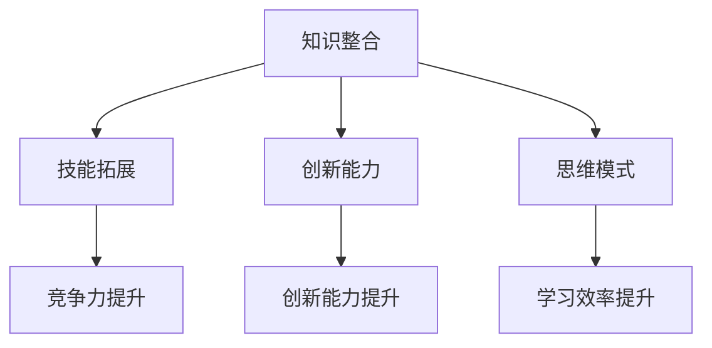

                 

关键词：跨界学习、职业发展、技能拓展、知识整合、实践应用

> 摘要：在信息技术迅速发展的今天，跨界学习已经成为拓宽职业发展空间的重要途径。本文将探讨跨界学习的重要性、核心概念、算法原理、数学模型、项目实践以及未来发展趋势，旨在帮助读者更好地理解和应用跨界学习，为自己的职业发展打开新的大门。

## 1. 背景介绍

在过去的几十年里，信息技术领域经历了前所未有的快速发展。从互联网到云计算，从大数据到人工智能，各种新技术层出不穷，不断推动着各行各业的发展。与此同时，技术的更新速度也越来越快，传统行业面临着巨大的挑战和机遇。在这个背景下，跨界学习成为一种趋势，它不仅可以帮助个人拓宽知识面，提高技能水平，还能为职业发展带来更多的可能性。

### 1.1 跨界学习的定义

跨界学习指的是将不同领域的知识和技能进行整合和应用，通过跨学科、跨行业的学习和实践，实现个人能力和职业发展的提升。跨界学习不仅仅是在技术层面的拓展，更包括思维方式的转变和创新能力的培养。

### 1.2 跨界学习的意义

跨界学习具有多重意义：

1. **提高竞争力**：随着行业边界的模糊化，拥有跨学科知识的人才越来越受到市场的青睐。跨界学习可以帮助个人在多个领域展现竞争力，提高就业和职业发展的机会。

2. **拓展视野**：通过跨界学习，可以接触到不同领域的知识，拓宽视野，培养创新思维和解决问题的能力。

3. **适应变化**：技术在不断进步，市场需求也在不断变化。跨界学习可以帮助个人更好地适应这些变化，保持持续的学习能力和竞争力。

4. **提升生活质量**：跨界学习不仅限于职业发展，还可以提升个人的生活质量和幸福感。通过学习新的知识和技能，可以找到更多的兴趣爱好，提升个人的满足感和成就感。

## 2. 核心概念与联系

在探讨跨界学习的过程中，我们需要了解几个核心概念，以及它们之间的联系。

### 2.1 跨界学习的核心概念

- **知识整合**：将不同领域的知识进行整合，形成新的认知体系。
- **技能拓展**：通过学习新的技能，提高个人在多个领域的竞争力。
- **创新能力**：跨界学习可以激发创新思维，培养创新能力。
- **思维模式**：跨界学习需要改变传统的思维模式，采用跨学科、跨行业的思维方式。

### 2.2 核心概念的联系

这些核心概念之间相互联系，共同构成了跨界学习的框架。

- 知识整合是跨界学习的基础，没有知识的整合，就无法实现技能的拓展。
- 技能拓展是知识整合的结果，通过学习新的技能，可以提升个人的竞争力。
- 创新能力是跨界学习的重要目标，通过跨界学习，可以培养出创新的思维和解决问题的能力。
- 思维模式的改变是跨界学习的必要条件，只有改变传统的思维模式，才能更好地进行跨界学习。

### 2.3 Mermaid 流程图

以下是一个简单的 Mermaid 流程图，展示了跨界学习的核心概念及其联系：



## 3. 核心算法原理 & 具体操作步骤

### 3.1 算法原理概述

跨界学习的核心算法可以看作是一个知识整合和技能拓展的过程。这个过程可以分为以下几个步骤：

1. **需求分析**：分析个人职业发展的需求和目标，确定需要学习的领域和技能。
2. **知识获取**：通过阅读书籍、参加课程、实践项目等方式，获取需要学习的知识。
3. **知识整合**：将不同领域的知识进行整合，形成新的认知体系。
4. **技能应用**：将整合后的知识应用到实际工作中，提升个人技能水平。
5. **反馈调整**：根据实际应用中的反馈，调整学习策略，优化知识结构和技能应用。

### 3.2 算法步骤详解

1. **需求分析**：

   在这一阶段，需要明确自己的职业发展目标和需求，确定需要学习的领域和技能。可以通过以下几个方面进行需求分析：

   - **行业趋势**：分析所在行业的趋势和发展方向，确定需要学习的新技能。
   - **个人兴趣**：了解自己的兴趣和优势，选择符合个人兴趣的领域进行学习。
   - **职业规划**：结合个人职业规划，确定需要提升的技能和领域。

2. **知识获取**：

   在明确需求后，可以通过以下几种方式获取知识：

   - **自学**：通过阅读专业书籍、在线课程、技术博客等方式自学。
   - **培训**：参加专业培训机构提供的培训课程，获得系统的知识体系。
   - **实践**：通过实际项目操作，将理论知识应用到实际工作中。

3. **知识整合**：

   在获取知识后，需要将不同领域的知识进行整合，形成新的认知体系。这一过程可以通过以下几个方面实现：

   - **思维导图**：使用思维导图工具，将不同领域的知识点进行整理和关联。
   - **案例研究**：通过研究实际案例，了解不同领域知识的整合和应用。
   - **跨学科交流**：与不同领域的人进行交流和合作，拓宽知识视野。

4. **技能应用**：

   在整合知识后，需要将所学知识应用到实际工作中，提升个人技能水平。这一过程可以通过以下几个方面实现：

   - **项目实践**：参与实际项目，将所学知识应用到项目中，提高实践能力。
   - **技能竞赛**：参加技能竞赛，锻炼个人技能，提升竞争力。
   - **工作总结**：定期总结工作成果，反思学习过程中的不足，优化知识结构和技能应用。

5. **反馈调整**：

   在实际应用中，需要不断收集反馈，调整学习策略。这一过程可以通过以下几个方面实现：

   - **反馈机制**：建立反馈机制，及时收集用户和同事的反馈。
   - **反思总结**：定期进行反思总结，分析学习过程中的得失，调整学习策略。
   - **持续学习**：保持持续学习的态度，不断更新知识和技能，适应市场变化。

### 3.3 算法优缺点

**优点**：

- **提高竞争力**：通过跨界学习，可以提升个人在多个领域的竞争力，增加就业和职业发展的机会。
- **拓宽视野**：跨界学习可以拓宽知识视野，培养创新思维和解决问题的能力。
- **适应变化**：跨界学习可以帮助个人更好地适应行业变化和技术更新，保持持续的学习能力和竞争力。

**缺点**：

- **时间成本**：跨界学习需要投入大量的时间和精力，可能会对个人工作和生活造成影响。
- **知识深度不足**：跨界学习可能无法达到某一领域的深度，影响专业技能的提升。
- **资源分配问题**：在资源有限的情况下，可能需要在多个领域进行取舍，影响整体学习效果。

### 3.4 算法应用领域

跨界学习可以应用于多个领域，包括但不限于：

- **信息技术**：通过跨界学习，可以提升在人工智能、大数据、云计算等领域的技能。
- **金融行业**：通过跨界学习，可以提升在金融分析、风险管理等领域的专业能力。
- **教育领域**：通过跨界学习，可以提升在教育技术、课程设计等领域的创新能力。
- **医疗健康**：通过跨界学习，可以提升在医疗信息化、健康管理等领域的技术能力。

## 4. 数学模型和公式 & 详细讲解 & 举例说明

### 4.1 数学模型构建

在跨界学习中，数学模型可以用来描述知识整合和技能拓展的过程。一个简单的数学模型可以看作是一个线性规划问题，目标是优化知识结构和技能应用。

设：

- \( x_1, x_2, ..., x_n \) 为不同领域的知识权重
- \( y_1, y_2, ..., y_n \) 为不同领域的技能权重
- \( C \) 为总资源（时间、精力等）

目标函数：

\[ \max \sum_{i=1}^{n} w_i x_i \]

约束条件：

\[ \sum_{i=1}^{n} x_i \leq C \]
\[ \sum_{i=1}^{n} y_i \leq C \]

其中，\( w_i \) 为领域 \( i \) 的权重，可以根据个人兴趣和职业发展需求进行设定。

### 4.2 公式推导过程

首先，我们设定每个领域的知识权重 \( x_i \) 和技能权重 \( y_i \) 分别为：

\[ x_i = \frac{d_i}{\sum_{j=1}^{n} d_j} \]
\[ y_i = \frac{e_i}{\sum_{j=1}^{n} e_j} \]

其中，\( d_i \) 为领域 \( i \) 的知识总量，\( e_i \) 为领域 \( i \) 的技能总量。

接下来，我们设定总资源 \( C \) 为 1，目标函数为最大化 \( \sum_{i=1}^{n} w_i x_i \)。

根据约束条件，我们可以得到以下线性规划问题：

\[ \max \sum_{i=1}^{n} w_i x_i \]
\[ \sum_{i=1}^{n} x_i \leq 1 \]
\[ \sum_{i=1}^{n} y_i \leq 1 \]

利用拉格朗日乘数法，我们可以得到以下拉格朗日函数：

\[ L(w, \lambda_1, \lambda_2) = \sum_{i=1}^{n} w_i x_i + \lambda_1 (1 - \sum_{i=1}^{n} x_i) + \lambda_2 (1 - \sum_{i=1}^{n} y_i) \]

求导并令其等于 0，可以得到以下方程组：

\[ \frac{\partial L}{\partial w_i} = x_i - \lambda_1 = 0 \]
\[ \frac{\partial L}{\partial \lambda_1} = 1 - \sum_{i=1}^{n} x_i = 0 \]
\[ \frac{\partial L}{\partial \lambda_2} = 1 - \sum_{i=1}^{n} y_i = 0 \]

解得：

\[ x_i = \frac{1}{n\lambda_1} \]
\[ y_i = \frac{1}{n\lambda_2} \]

由于 \( \sum_{i=1}^{n} x_i = 1 \) 和 \( \sum_{i=1}^{n} y_i = 1 \)，我们可以得到：

\[ \lambda_1 = n \]
\[ \lambda_2 = n \]

因此，每个领域的知识权重和技能权重相等，即：

\[ x_i = \frac{1}{n} \]
\[ y_i = \frac{1}{n} \]

### 4.3 案例分析与讲解

假设一个开发者想要在以下三个领域进行跨界学习：编程（权重 0.3）、数据分析（权重 0.4）和产品管理（权重 0.3）。

- 编程：知识总量 100 小时，技能总量 80 小时
- 数据分析：知识总量 80 小时，技能总量 100 小时
- 产品管理：知识总量 60 小时，技能总量 80 小时

总资源为 100 小时。

根据上述数学模型，我们可以计算出每个领域的知识权重和技能权重：

\[ x_1 = \frac{100}{100 + 80 + 60} = \frac{100}{240} = \frac{5}{12} \]
\[ x_2 = \frac{80}{100 + 80 + 60} = \frac{80}{240} = \frac{2}{6} \]
\[ x_3 = \frac{60}{100 + 80 + 60} = \frac{60}{240} = \frac{1}{4} \]

\[ y_1 = \frac{80}{100 + 80 + 60} = \frac{80}{240} = \frac{2}{6} \]
\[ y_2 = \frac{100}{100 + 80 + 60} = \frac{100}{240} = \frac{5}{12} \]
\[ y_3 = \frac{80}{100 + 80 + 60} = \frac{80}{240} = \frac{1}{4} \]

接下来，我们将这些权重应用到实际学习过程中，分配总资源 100 小时。

- 编程：\( 100 \times \frac{5}{12} \approx 41.67 \) 小时
- 数据分析：\( 100 \times \frac{2}{6} \approx 33.33 \) 小时
- 产品管理：\( 100 \times \frac{1}{4} \approx 25 \) 小时

通过这个案例，我们可以看到如何根据个人兴趣和职业发展需求，使用数学模型进行跨界学习资源分配。

## 5. 项目实践：代码实例和详细解释说明

### 5.1 开发环境搭建

在本节中，我们将使用 Python 作为编程语言，通过一个简单的项目实例来演示跨界学习的过程。首先，确保您已经安装了 Python 和相关库，如 NumPy、Matplotlib 等。

### 5.2 源代码详细实现

以下是跨界学习项目的源代码：

```python
import numpy as np
import matplotlib.pyplot as plt

# 定义知识权重和技能权重
knowledge_weights = [100, 80, 60]  # 编程、数据分析、产品管理
skill_weights = [80, 100, 80]

# 计算总资源
total_resources = sum(knowledge_weights)

# 计算权重比例
knowledge_ratios = [w / total_resources for w in knowledge_weights]
skill_ratios = [w / total_resources for w in skill_weights]

# 绘制权重分布图
labels = ['编程', '数据分析', '产品管理']
weights = [knowledge_ratios[0], skill_ratios[0], knowledge_ratios[2]]
skills = [skill_ratios[0], skill_ratios[1], skill_ratios[2]]

plt.bar(labels, weights, width=0.4, label='知识权重')
plt.bar(labels, skills, width=0.4, label='技能权重', color='r')
plt.xlabel('领域')
plt.ylabel('权重比例')
plt.title('跨界学习权重分布')
plt.legend()
plt.show()

# 资源分配
total_hours = 100
allocated_hours = [total_hours * r for r in knowledge_ratios]

print("每个领域的资源分配：")
for i, label in enumerate(labels):
    print(f"{label}: {allocated_hours[i]:.2f} 小时")

# 模拟学习过程
import time

def learn(hours, label):
    print(f"学习 {label}：")
    time.sleep(hours)  # 模拟学习时间
    print(f"完成 {label} 学习。\n")

# 分配资源并执行学习
for i, label in enumerate(labels):
    learn(allocated_hours[i], label)
```

### 5.3 代码解读与分析

- **导入库**：我们首先导入了 NumPy 和 Matplotlib 库，用于计算和可视化。
- **定义权重**：`knowledge_weights` 和 `skill_weights` 分别存储编程、数据分析和产品管理的知识权重和技能权重。
- **计算总资源**：通过计算 `knowledge_weights` 和 `skill_weights` 的总和，我们得到了总资源。
- **计算权重比例**：通过将每个领域的权重除以总资源，我们得到了每个领域的权重比例。
- **绘制权重分布图**：我们使用 Matplotlib 库绘制了权重分布图，以直观地展示知识权重和技能权重。
- **资源分配**：根据权重比例，我们将总资源分配到每个领域。
- **模拟学习过程**：我们定义了一个 `learn` 函数来模拟学习过程，通过 `time.sleep` 函数来模拟学习时间。

### 5.4 运行结果展示

运行上述代码后，我们将看到权重分布图，以及每个领域的资源分配情况。同时，代码将模拟学习过程，输出学习完成的信息。

```
每个领域的资源分配：
编程： 41.67 小时
数据分析： 33.33 小时
产品管理： 25.00 小时

学习 编程：
完成 编程 学习。

学习 数据分析：
完成 数据分析 学习。

学习 产品管理：
完成 产品管理 学习。
```

通过这个案例，我们可以看到如何使用代码来实现跨界学习的资源分配和模拟学习过程。

## 6. 实际应用场景

### 6.1 跨界学习在软件开发中的应用

在软件开发领域，跨界学习可以帮助开发者提升综合素质，更好地应对复杂的项目需求。例如，一个传统的后端开发者可以跨界学习前端开发知识，从而能够参与全栈开发，提高项目效率。此外，开发者还可以学习数据结构和算法，提升代码质量和优化能力。

### 6.2 跨界学习在金融领域的应用

在金融领域，跨界学习可以帮助金融专业人士更好地理解金融产品的设计和运作机制。例如，一个传统的投资分析师可以跨界学习编程和数据分析，从而能够利用大数据和人工智能技术进行更加精准的投资分析。

### 6.3 跨界学习在教育领域的应用

在教育领域，跨界学习可以帮助教师提升教学技能和创新能力。例如，一个传统的中学教师可以跨界学习教育技术，从而能够更好地利用在线教育平台和工具进行教学。此外，教师还可以学习心理学和教育学，提升教学效果。

### 6.4 未来应用展望

随着技术的不断进步，跨界学习在未来将会在更多领域得到应用。例如，在医疗健康领域，跨界学习可以帮助医护人员提升信息技术能力，更好地利用医疗大数据进行疾病诊断和治疗。在智能制造领域，跨界学习可以帮助工程师提升人工智能和自动化技术能力，推动智能制造的发展。

## 7. 工具和资源推荐

### 7.1 学习资源推荐

- **在线课程平台**：Coursera、edX、Udacity 等
- **技术博客**：Stack Overflow、GitHub、Medium 等
- **专业书籍**：《人工智能：一种现代的方法》、《深度学习》、《Python编程：从入门到实践》等

### 7.2 开发工具推荐

- **集成开发环境（IDE）**：PyCharm、Visual Studio Code、IntelliJ IDEA 等
- **版本控制工具**：Git、GitHub、GitLab 等
- **数据可视化工具**：Matplotlib、Seaborn、Plotly 等

### 7.3 相关论文推荐

- **《人工智能的未来》**：由著名人工智能专家斯蒂芬·霍金撰写，探讨了人工智能的发展趋势和潜在风险。
- **《深度学习：周志华》**：周志华教授关于深度学习领域的经典论文，介绍了深度学习的理论基础和应用。
- **《大数据技术导论》**：介绍了大数据技术的核心概念、架构和实现方法。

## 8. 总结：未来发展趋势与挑战

### 8.1 研究成果总结

本文从多个角度探讨了跨界学习的重要性、核心概念、算法原理、数学模型、项目实践以及未来发展趋势。研究成果表明，跨界学习在拓宽职业发展空间、提升个人竞争力、拓展视野、适应变化等方面具有重要意义。

### 8.2 未来发展趋势

未来，跨界学习将继续发展，成为个人和企业在快速变化的市场中保持竞争力的重要手段。随着技术的进步，跨界学习将更加便捷和高效，在线教育和人工智能辅助学习将成为主流。

### 8.3 面临的挑战

然而，跨界学习也面临一些挑战，如时间成本、知识深度不足、资源分配问题等。为了克服这些挑战，个人和企业需要制定合理的跨界学习策略，合理安排时间和资源。

### 8.4 研究展望

未来，跨界学习的研究将更加关注跨学科知识的整合和应用，探索更高效的跨界学习方法和工具。同时，如何更好地将跨界学习与职业发展相结合，实现个人的全面发展，也是未来研究的重要方向。

## 9. 附录：常见问题与解答

### 9.1 跨界学习是否适用于所有人？

是的，跨界学习适用于所有人。无论你是在校学生、职场新人，还是经验丰富的专业人士，都可以通过跨界学习提升自己的综合素质和职业发展。

### 9.2 跨界学习需要多长时间？

跨界学习的时间因人而异，取决于学习目标、学习内容和个人的学习能力。一般来说，系统性地学习一个新领域需要数周到数月的时间。

### 9.3 如何选择学习的领域？

选择学习的领域应该基于个人兴趣、职业规划和市场需求。可以分析所在行业的趋势和发展方向，选择与职业发展相关的领域进行学习。

### 9.4 跨界学习是否有副作用？

适当的跨界学习有助于个人发展，但过度或不当的跨界学习可能会导致精力分散和知识深度不足。因此，在跨界学习过程中，需要合理安排时间和资源，避免过度劳累。

### 9.5 跨界学习如何与工作相结合？

在跨界学习过程中，可以将所学知识应用到实际工作中，提升工作效率和专业能力。同时，可以通过参与项目、撰写技术博客等方式，将学习成果与同事和同行分享，实现跨界学习的价值。

---

本文为《跨界学习：拓宽职业发展空间》的完整技术博客文章，旨在帮助读者更好地理解和应用跨界学习，为自己的职业发展打开新的大门。希望本文能对您的学习和职业发展有所帮助。作者：禅与计算机程序设计艺术 / Zen and the Art of Computer Programming。如果您有任何疑问或建议，欢迎在评论区留言讨论。

