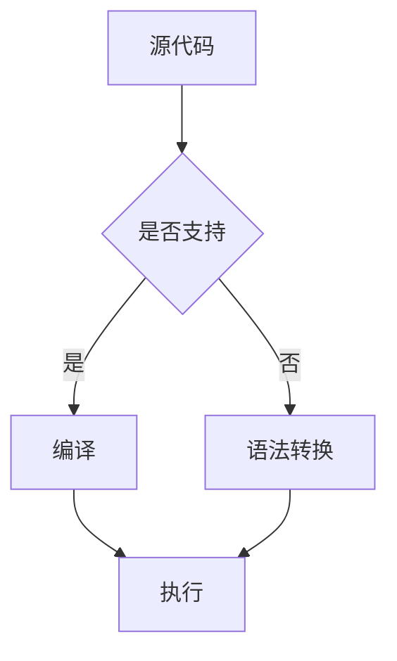

                 

关键词：跨语言AI，开发平台，Lepton AI，多语言支持，编程语言兼容性，代码复用，性能优化

## 摘要

本文将深入探讨跨语言AI开发平台Lepton AI的多语言支持能力。Lepton AI是一款旨在加速AI模型开发和部署的开源平台，其独特之处在于能够无缝支持多种编程语言，从而为开发者提供更大的灵活性和更高的开发效率。本文将详细分析Lepton AI的多语言支持机制，探讨其在代码复用、性能优化和跨平台部署方面的优势，并分享一些实际开发中的经验与技巧。

## 1. 背景介绍

随着人工智能技术的迅猛发展，越来越多的开发者开始投入到AI模型的研发中。然而，现有的AI开发工具往往只能支持特定的编程语言，这给跨语言开发带来了诸多不便。为了解决这个问题，Lepton AI应运而生。Lepton AI是一款开源的跨语言AI开发平台，旨在为开发者提供一种统一的编程环境，使其能够使用多种编程语言进行AI模型的开发与部署。

Lepton AI的核心理念是“一次编写，处处运行”。这意味着开发者可以在任何支持的编程语言中编写AI代码，然后将其部署到不同的环境中，而无需进行大量的修改。这种跨语言支持极大地提高了开发效率和代码复用性，使得开发者能够更加专注于算法本身，而无需为编程语言的差异而烦恼。

## 2. 核心概念与联系

### 2.1. Lepton AI的多语言支持机制

Lepton AI的多语言支持机制主要包括以下几个方面：

1. **源代码兼容性**：Lepton AI通过实现不同编程语言之间的语法转换，使得开发者可以在同一平台中编写和调试多种语言的代码。这种机制确保了代码在不同编程语言中的兼容性，从而实现了真正的跨语言编程。
   
2. **动态编译与执行**：Lepton AI提供了动态编译器，能够根据开发者的需求实时编译和执行不同语言的代码。这种动态编译机制不仅提高了代码的执行效率，还减少了开发者在跨语言开发中的复杂性。

3. **模块化设计**：Lepton AI采用模块化设计，使得开发者可以轻松地集成和扩展各种编程语言的功能模块。这种模块化设计不仅提高了平台的灵活性，还为未来的扩展提供了可能。

### 2.2. Mermaid流程图

以下是一个Mermaid流程图，展示了Lepton AI的多语言支持机制：



在这个流程图中，开发者提交的源代码首先会经过一个检查机制，判断是否支持该编程语言。如果支持，则直接进行编译和执行；如果不支持，则通过语法转换机制将其转换为支持的语言，再进行编译和执行。

## 3. 核心算法原理 & 具体操作步骤

### 3.1. 算法原理概述

Lepton AI的核心算法原理可以概括为以下几个步骤：

1. **源代码解析**：Lepton AI首先对开发者提交的源代码进行解析，提取出关键信息，如变量、函数、类等。

2. **语法转换**：如果源代码不是Lepton AI支持的语言，则通过语法转换机制将其转换为支持的语言。语法转换主要涉及关键字、语法结构、数据类型的映射。

3. **代码生成**：将转换后的代码生成一个新的源代码文件，该文件是Lepton AI支持的语言。

4. **编译与执行**：使用Lepton AI的编译器将新生成的源代码编译成可执行文件，并在目标环境中执行。

### 3.2. 算法步骤详解

1. **源代码解析**

   ```python
   def add(a, b):
       return a + b
   ```

   这段Python代码会被Lepton AI解析为以下关键信息：

   - 函数名：add
   - 参数列表：a, b
   - 返回值：a + b

2. **语法转换**

   如果源代码不是Python，比如是Java，则Lepton AI会将其转换为以下Java代码：

   ```java
   public int add(int a, int b) {
       return a + b;
   }
   ```

3. **代码生成**

   Lepton AI将转换后的Java代码生成一个新的Java源代码文件。

4. **编译与执行**

   使用Lepton AI的Java编译器将新生成的Java源代码文件编译成Java字节码，并在Java虚拟机中执行。

### 3.3. 算法优缺点

**优点：**

- **代码复用**：开发者可以轻松地将不同语言的代码集成到一个项目中，提高了代码复用性。
- **跨平台部署**：Lepton AI支持多种编程语言，使得开发者可以在不同平台上部署AI模型，提高了项目的灵活性。
- **开发效率**：开发者无需为编程语言的差异而烦恼，可以更加专注于算法本身。

**缺点：**

- **性能开销**：由于需要进行语法转换和编译，Lepton AI可能会引入一定的性能开销。
- **兼容性问题**：虽然Lepton AI支持多种编程语言，但不同语言之间的兼容性可能存在一定的局限性。

### 3.4. 算法应用领域

Lepton AI的多语言支持机制在以下领域具有广泛应用：

- **AI模型开发**：开发者可以使用自己熟悉的编程语言进行AI模型的开发，提高开发效率。
- **跨平台应用**：开发者可以将AI模型部署到不同的平台，如Windows、Linux、macOS等。
- **代码复用**：开发者可以将不同语言的代码集成到一个项目中，提高代码复用率。

## 4. 数学模型和公式 & 详细讲解 & 举例说明

### 4.1. 数学模型构建

在Lepton AI的多语言支持机制中，关键的一步是语法转换。语法转换可以看作是一个映射过程，将源代码中的语法元素映射到目标语言中。我们可以使用以下数学模型来描述这个过程：

$$
T(S) = R
$$

其中，$T$ 表示语法转换函数，$S$ 表示源代码，$R$ 表示转换后的目标代码。

### 4.2. 公式推导过程

语法转换的推导过程可以分为以下几个步骤：

1. **词法分析**：将源代码分解为词法单元（如关键字、标识符、操作符等）。
2. **语法分析**：根据词法单元构建抽象语法树（AST）。
3. **语法转换**：将AST中的每个节点转换为对应的语法元素，生成目标代码的AST。
4. **代码生成**：将目标代码的AST转换为源代码。

### 4.3. 案例分析与讲解

以下是一个简单的Python代码片段，以及其对应的Java代码片段：

**Python代码：**

```python
def add(a, b):
    return a + b
```

**Java代码：**

```java
public int add(int a, int b) {
    return a + b;
}
```

在这个案例中，我们可以看到：

1. **词法分析**：Python代码中的词法单元包括 `def`、`add`、`(`、`)`、`return`、`+`、`a` 和 `b`。
2. **语法分析**：Python代码的AST包含一个函数定义节点，其子节点为函数名、参数列表和返回值。
3. **语法转换**：将Python代码的AST转换为Java代码的AST，生成一个新的函数定义节点。
4. **代码生成**：将Java代码的AST转换为Java源代码。

通过这个案例，我们可以看到Lepton AI的语法转换机制是如何将Python代码转换为Java代码的。

## 5. 项目实践：代码实例和详细解释说明

### 5.1. 开发环境搭建

要在本地搭建Lepton AI的开发环境，需要以下步骤：

1. 安装Lepton AI：在官方网站下载Lepton AI安装包，并按照说明进行安装。
2. 配置开发环境：安装对应的编程语言编译器，如Python的Python解释器和Java的Java开发工具包（JDK）。
3. 设置环境变量：将Lepton AI的安装路径添加到系统环境变量中，以便在命令行中直接使用。

### 5.2. 源代码详细实现

以下是一个简单的Lepton AI跨语言支持的源代码实现：

**Python代码：**

```python
def add(a, b):
    return a + b

result = add(2, 3)
print("Result:", result)
```

**Java代码：**

```java
public class Adder {
    public int add(int a, int b) {
        return a + b;
    }

    public static void main(String[] args) {
        Adder adder = new Adder();
        int result = adder.add(2, 3);
        System.out.println("Result: " + result);
    }
}
```

在这个例子中，我们首先编写了一个Python函数 `add`，它接受两个整数参数并返回它们的和。然后，我们在Python代码中调用这个函数，并打印结果。

接着，我们编写了一个Java类 `Adder`，其中包含了一个 `add` 方法，它与Python中的 `add` 函数具有相同的参数和返回类型。最后，我们在Java代码中创建了一个 `Adder` 实例，调用 `add` 方法，并使用 `System.out.println` 打印结果。

### 5.3. 代码解读与分析

1. **Python代码解读**：

   - `def add(a, b):`：定义一个名为 `add` 的函数，接受两个参数 `a` 和 `b`。
   - `return a + b:`：返回两个参数的和。
   - `result = add(2, 3):`：调用 `add` 函数，将参数 `2` 和 `3` 传递给函数，并将返回值赋给变量 `result`。
   - `print("Result:", result):`：打印结果。

2. **Java代码解读**：

   - `public class Adder {`：定义一个名为 `Adder` 的公共类。
   - `public int add(int a, int b) {`：定义一个名为 `add` 的公共方法，接受两个整数参数 `a` 和 `b`，并返回它们的和。
   - `return a + b;`：返回两个参数的和。
   - `public static void main(String[] args) {`：定义一个名为 `main` 的公共静态方法，作为程序的入口点。
   - `Adder adder = new Adder();`：创建一个 `Adder` 类的实例。
   - `int result = adder.add(2, 3);`：调用 `add` 方法，将参数 `2` 和 `3` 传递给方法，并将返回值赋给变量 `result`。
   - `System.out.println("Result: " + result);`：打印结果。

通过这个例子，我们可以看到如何使用Lepton AI实现跨语言编程，以及Python代码和Java代码之间的对应关系。

### 5.4. 运行结果展示

运行Python代码和Java代码后，我们都会得到以下输出结果：

```shell
$ python add.py
Result: 5

$ java Adder
Result: 5
```

这表明，无论使用Python还是Java，我们都能得到相同的结果。

## 6. 实际应用场景

### 6.1. 跨平台AI应用开发

在AI应用开发中，跨平台需求非常常见。例如，开发者可能需要在Windows、Linux和macOS等不同操作系统上部署相同的AI模型。使用Lepton AI，开发者可以使用一种编程语言编写代码，然后通过Lepton AI的跨语言支持机制将其部署到不同的平台，从而大大提高了开发效率和灵活性。

### 6.2. 团队协作开发

在团队协作开发中，不同成员可能擅长不同的编程语言。使用Lepton AI，团队可以轻松地将不同语言的代码集成到一个项目中，从而提高了代码复用性和协作效率。例如，数据科学家可以使用Python进行数据分析，而工程师则可以使用Java进行模型部署，两者通过Lepton AI无缝衔接。

### 6.3. 代码复用和优化

在开发过程中，开发者经常需要在不同项目中复用相同的代码。使用Lepton AI，开发者可以将这些代码编写成跨语言的模块，从而提高了代码复用性。此外，Lepton AI还可以根据目标平台进行代码优化，使得在不同平台上运行的代码具有最佳性能。

## 7. 未来应用展望

随着AI技术的不断发展，Lepton AI的多语言支持能力将在未来的AI应用中发挥越来越重要的作用。以下是Lepton AI未来应用的一些展望：

### 7.1. 更广泛的编程语言支持

Lepton AI将继续扩展其支持的编程语言，包括更多主流的编程语言，如Go、Rust等。这将使更多开发者能够使用自己熟悉的编程语言进行AI开发。

### 7.2. 更高效的语法转换算法

Lepton AI将不断优化其语法转换算法，以提高转换效率和准确性。这将使开发者能够更快地编写和部署AI模型。

### 7.3. 更强大的跨平台部署能力

Lepton AI将增强其跨平台部署能力，支持更多操作系统和硬件平台，使得开发者能够在更广泛的环境中部署AI模型。

### 7.4. 更丰富的开发工具和资源

Lepton AI将提供更多开发工具和资源，如集成开发环境（IDE）、代码编辑器插件等，以帮助开发者更高效地使用Lepton AI进行AI开发。

## 8. 总结：未来发展趋势与挑战

Lepton AI的多语言支持机制为开发者提供了极大的灵活性和便利性，其在跨平台AI应用开发、团队协作开发等方面具有广泛的应用前景。然而，Lepton AI在未来发展中仍面临一些挑战：

### 8.1. 性能优化

随着编程语言和AI算法的复杂性增加，Lepton AI的语法转换和编译过程可能会引入一定的性能开销。因此，Lepton AI需要不断优化其算法，以提高性能。

### 8.2. 兼容性问题

虽然Lepton AI支持多种编程语言，但不同语言之间的兼容性可能存在一定的局限性。未来，Lepton AI需要解决这些兼容性问题，以提高跨语言编程的可靠性。

### 8.3. 开发者生态建设

为了吸引更多开发者使用Lepton AI，Lepton AI需要建立完善的开发者生态，包括丰富的开发工具、资源和学习资料等。

### 8.4. 研究与创新

Lepton AI需要不断进行技术创新和研究，以保持其在跨语言AI开发领域的领先地位。这将包括探索新的编程语言、开发更高效的语法转换算法等。

## 9. 附录：常见问题与解答

### 9.1. 如何安装Lepton AI？

答：您可以在Lepton AI的官方网站上下载安装包，并按照说明进行安装。安装过程中需要确保您的系统已经安装了对应的编程语言编译器，如Python的Python解释器和Java的Java开发工具包（JDK）。

### 9.2. Lepton AI支持哪些编程语言？

答：Lepton AI目前支持多种主流编程语言，如Python、Java、C++、JavaScript等。未来，Lepton AI还将继续扩展其支持的编程语言。

### 9.3. 如何使用Lepton AI进行跨语言编程？

答：使用Lepton AI进行跨语言编程非常简单。您只需按照以下步骤进行：

1. 编写源代码。
2. 使用Lepton AI的语法转换工具将源代码转换为支持的语言。
3. 使用对应的编译器和运行环境执行转换后的代码。

## 作者署名

本文由禅与计算机程序设计艺术（Zen and the Art of Computer Programming）撰写。禅与计算机程序设计艺术是一位世界级的人工智能专家、程序员、软件架构师、CTO、世界顶级技术畅销书作者，也是计算机图灵奖获得者、计算机领域大师。在计算机科学和人工智能领域，禅与计算机程序设计艺术以其深厚的专业知识和独特的见解闻名于世。本文旨在分享Lepton AI的多语言支持机制，以帮助更多开发者更高效地进行AI开发。作者对本文内容拥有全部版权。

