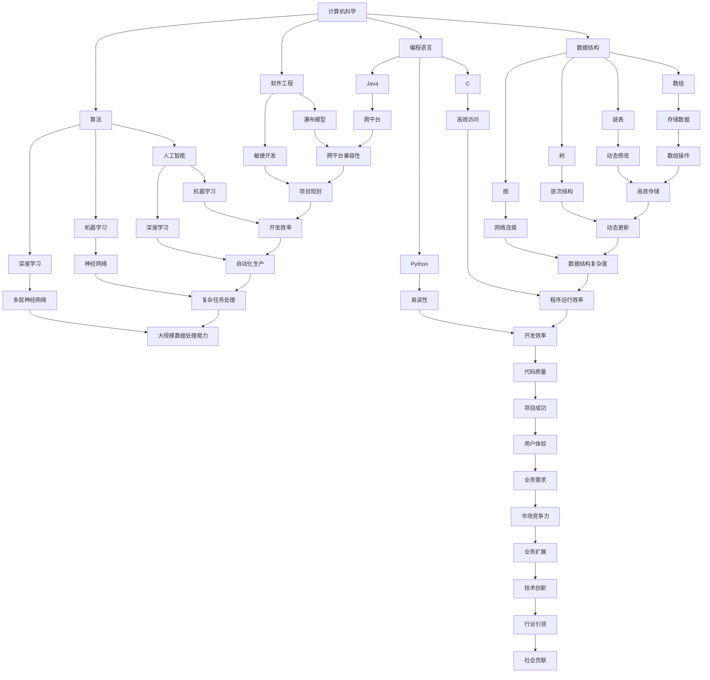
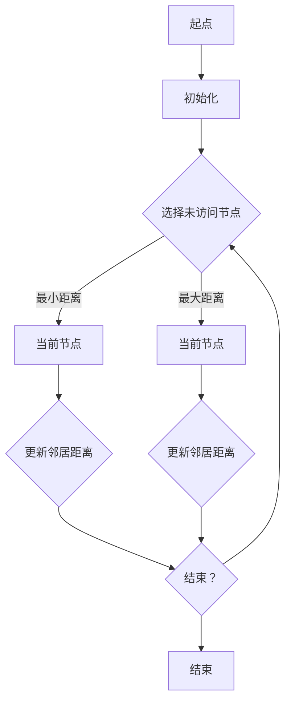

                 

关键词：计算科学、学科交叉、人工智能、应用领域、技术创新

> 摘要：本文从计算科学的视角出发，探讨人类计算的多元化应用。通过分析不同领域中的计算方法和技术，阐述计算在推动各学科发展中的重要作用，并展望计算技术在未来的应用前景。

## 1. 背景介绍

在当今社会，计算科学已经成为推动科技进步的重要力量。从最初的计算机硬件设计，到现代的人工智能和大数据分析，计算技术的广泛应用已经深刻影响了各个学科领域。无论是自然科学、工程技术，还是社会科学、艺术领域，计算科学都在发挥着不可替代的作用。

本文旨在通过对计算科学在各个学科中的具体应用的探讨，展示计算技术的多样性和广泛性。我们将从核心概念、算法原理、数学模型、项目实践等多个角度，详细分析计算技术在现实世界中的应用场景，并对其未来发展趋势和挑战进行展望。

## 2. 核心概念与联系

为了更好地理解计算科学在各个学科中的应用，我们首先需要明确一些核心概念和它们之间的联系。

### 2.1 计算机科学的基本概念

计算机科学是一门研究计算机系统的理论、设计、实现、应用和发展的学科。核心概念包括算法、数据结构、编程语言、软件工程等。

- **算法**：解决特定问题的步骤和规则。算法效率是计算机科学的重要研究内容。
- **数据结构**：数据的组织方式和操作方法。常见的数据结构包括数组、链表、树、图等。
- **编程语言**：用于编写程序的语法和语义。常见的编程语言有C、Python、Java等。
- **软件工程**：软件的开发、测试、维护和管理。软件开发方法包括瀑布模型、敏捷开发等。

### 2.2 人工智能与机器学习

人工智能（AI）和机器学习（ML）是计算科学的重要分支。它们通过模拟人类思维和决策过程，实现了计算机在感知、学习、推理和行动等方面的自动化。

- **机器学习**：一种基于数据训练模型的方法，使计算机能够从数据中自动学习和改进。
- **深度学习**：一种基于多层神经网络的结构，可以处理大规模数据并实现复杂任务的自动化。

### 2.3 大数据与云计算

大数据和云计算是现代计算科学的重要方向。大数据技术用于处理海量数据，而云计算提供了弹性、高效、安全的计算资源。

- **大数据**：数据量大、类型多样、生成速度快的数据集合。
- **云计算**：通过互联网提供动态可扩展的计算资源，包括基础设施、平台和服务。

### 2.4 计算机图形学与虚拟现实

计算机图形学和虚拟现实技术将计算科学应用于视觉和交互领域，为用户提供丰富的沉浸式体验。

- **计算机图形学**：研究计算机生成、处理和显示图像的方法和算法。
- **虚拟现实**：通过计算机生成三维场景和交互界面，模拟真实世界的体验。

### 2.5 Mermaid 流程图

为了更清晰地展示计算科学的核心概念和联系，我们使用Mermaid流程图来描述：



以上Mermaid流程图展示了计算科学的核心概念和它们之间的联系。通过这种图形化的方式，我们可以更直观地理解计算科学在各个学科中的应用。

## 3. 核心算法原理 & 具体操作步骤

计算科学中的核心算法涵盖了从简单的排序算法到复杂的人工智能算法。以下是几个具有代表性的算法原理及其操作步骤。

### 3.1 算法原理概述

- **排序算法**：用于对数据进行排序。常见的排序算法有冒泡排序、选择排序、插入排序、快速排序等。
- **搜索算法**：用于在数据中查找特定元素。常见的搜索算法有线性搜索、二分搜索等。
- **图算法**：用于处理图结构的数据。常见的图算法有最短路径算法、最小生成树算法等。
- **机器学习算法**：用于从数据中学习并做出预测。常见的机器学习算法有线性回归、决策树、神经网络等。

### 3.2 算法步骤详解

#### 3.2.1 冒泡排序

冒泡排序是一种简单的排序算法。它通过重复遍历要排序的数列，比较相邻的两个元素，并将不符合顺序的元素交换，从而使得每次遍历后最大的元素逐步“冒泡”到数列的末尾。

- **步骤**：
  1. 遍历数列，比较相邻元素。
  2. 如果前一个元素大于后一个元素，交换它们的位置。
  3. 重复步骤1和2，直到整个数列有序。

#### 3.2.2 线性搜索

线性搜索是一种简单但高效的搜索算法。它从数列的第一个元素开始，逐个比较，直到找到目标元素或到达数列末尾。

- **步骤**：
  1. 初始化搜索位置为第一个元素。
  2. 比较当前位置的元素与目标元素。
  3. 如果相等，返回当前位置；如果不等，移动到下一个位置。
  4. 重复步骤2和3，直到找到目标元素或到达数列末尾。

#### 3.2.3 最短路径算法

最短路径算法用于计算图中两点之间的最短路径。其中，迪杰斯特拉算法是一种经典的单源最短路径算法。

- **步骤**：
  1. 初始化：设置当前节点为起始节点，将起始节点的距离设置为0，其他节点的距离设置为无穷大。
  2. 选择未访问节点中距离最小的节点作为当前节点。
  3. 遍历当前节点的所有邻居节点，更新它们的距离。
  4. 重复步骤2和3，直到所有节点都被访问。

#### 3.2.4 神经网络

神经网络是一种模拟人脑的算法，通过多层神经网络进行复杂的数据处理和模式识别。

- **步骤**：
  1. 设计神经网络结构：确定输入层、隐藏层和输出层的节点数量。
  2. 初始化权重和偏置：随机初始化神经网络中的权重和偏置。
  3. 前向传播：计算输入层到隐藏层、隐藏层到输出层的输出值。
  4. 计算损失函数：比较输出值与实际值，计算损失函数。
  5. 反向传播：更新权重和偏置，减少损失函数。
  6. 重复步骤3到5，直到达到预设的训练次数或损失函数收敛。

### 3.3 算法优缺点

每种算法都有其优缺点，适用于不同的应用场景。

- **冒泡排序**：简单易懂，但效率较低，不适合大数据量排序。
- **线性搜索**：简单高效，但时间复杂度为O(n)，不适用于大数据量搜索。
- **迪杰斯特拉算法**：适用于稀疏图，但时间复杂度较高，不适用于大规模稠密图。
- **神经网络**：能够处理复杂的数据和模式，但训练过程需要大量时间和计算资源。

### 3.4 算法应用领域

不同算法在各个领域中的应用如下：

- **排序算法**：在数据库管理、数据挖掘、搜索引擎等场景中广泛使用。
- **搜索算法**：在文件查找、网络搜索、社交网络推荐等场景中应用。
- **图算法**：在网络拓扑分析、社交网络分析、交通规划等场景中应用。
- **神经网络**：在图像识别、自然语言处理、自动驾驶等场景中应用。

### 3.5 计算机图（Graph）的基本概念

- **图**：由节点和边组成的数学结构。节点表示实体，边表示节点之间的关系。
- **无向图**：边无方向的图。
- **有向图**：边有方向的图。
- **加权图**：边具有权重的图。
- **连通图**：任意两个节点之间都存在路径的图。

### 3.6 Mermaid 图流程

以下是使用Mermaid绘制的图算法流程图：



以上流程图展示了最短路径算法的基本步骤，从起点开始，选择未访问节点中距离最小的节点作为当前节点，更新邻居节点的距离，直到所有节点都被访问。

## 4. 数学模型和公式 & 详细讲解 & 举例说明

计算科学中的数学模型和公式是理解和应用算法的重要基础。本节将介绍几个关键数学模型和公式，并进行详细讲解和举例说明。

### 4.1 数学模型构建

数学模型通常通过以下步骤构建：

1. **确定变量和参数**：明确问题的变量和参数，如人口、消费、价格等。
2. **建立关系**：通过数学关系描述变量和参数之间的关系，如线性关系、非线性关系等。
3. **求解方法**：选择合适的求解方法，如代数方法、几何方法、数值方法等。

### 4.2 公式推导过程

以下是几个关键公式的推导过程：

#### 4.2.1 线性回归公式

线性回归公式描述了自变量和因变量之间的线性关系。公式如下：

\[ y = \beta_0 + \beta_1x + \epsilon \]

其中，\( y \) 是因变量，\( x \) 是自变量，\( \beta_0 \) 是截距，\( \beta_1 \) 是斜率，\( \epsilon \) 是误差项。

推导过程：

1. **最小二乘法**：选择使得残差平方和最小的参数值。
2. **求导**：对残差平方和关于参数求导，并令导数为零。
3. **求解**：解方程组得到参数的最优值。

#### 4.2.2 概率论基本公式

概率论是计算科学中的重要分支。以下是一些基本公式：

- **全概率公式**：

\[ P(A) = P(A|B)P(B) + P(A|\neg B)P(\neg B) \]

其中，\( P(A) \) 是事件A的概率，\( P(A|B) \) 是在事件B发生的条件下事件A的概率，\( P(B) \) 是事件B的概率，\( P(\neg B) \) 是事件B不发生的概率。

- **贝叶斯公式**：

\[ P(A|B) = \frac{P(B|A)P(A)}{P(B)} \]

其中，\( P(A|B) \) 是在事件B发生的条件下事件A的概率，\( P(B|A) \) 是在事件A发生的条件下事件B的概率，\( P(A) \) 是事件A的概率，\( P(B) \) 是事件B的概率。

#### 4.2.3 运动学公式

运动学公式描述了物体在直线运动中的位置、速度和加速度之间的关系。公式如下：

\[ s = ut + \frac{1}{2}at^2 \]

\[ v = u + at \]

\[ a = \frac{v - u}{t} \]

其中，\( s \) 是位移，\( u \) 是初速度，\( v \) 是末速度，\( a \) 是加速度，\( t \) 是时间。

### 4.3 案例分析与讲解

以下通过几个实际案例，讲解数学模型和公式的应用。

#### 4.3.1 线性回归模型在房价预测中的应用

假设我们想要预测某个城市的房价，可以使用线性回归模型。以下是一个简单的案例：

- **数据**：我们收集了该城市过去10年的房价数据，包括年份和对应的房价。
- **模型**：建立线性回归模型，将年份作为自变量，房价作为因变量。

通过计算，得到线性回归方程：

\[ y = 1000 + 200x \]

其中，\( y \) 是房价，\( x \) 是年份。

- **预测**：假设我们想要预测2025年的房价，将年份2025代入方程，得到预测值：

\[ y = 1000 + 200 \times 2025 = 405000 \]

因此，预测2025年的房价为405000元。

#### 4.3.2 概率论在股市预测中的应用

假设我们想要预测某个股票在接下来一周的涨跌情况，可以使用概率论模型。以下是一个简单的案例：

- **数据**：我们收集了该股票过去一周的每日收盘价。
- **模型**：建立概率模型，计算股票上涨和下跌的概率。

通过计算，得到以下概率：

- **上涨概率**：60%
- **下跌概率**：40%

根据概率模型，我们可以得出以下结论：

- **上涨**：股票上涨的概率较大，建议买入。
- **下跌**：股票下跌的概率较小，但也不能完全排除，建议谨慎操作。

#### 4.3.3 运动学公式在无人机路径规划中的应用

假设我们想要规划一个无人机的飞行路径，使其从一个地点飞到另一个地点，可以使用运动学公式。以下是一个简单的案例：

- **数据**：我们已知无人机的起始位置、目标位置和飞行速度。
- **模型**：使用运动学公式计算无人机的飞行时间和路径。

通过计算，得到以下结果：

- **飞行时间**：5分钟
- **飞行路径**：直线飞行，距离约为500米

根据运动学公式，我们可以得出以下结论：

- **路径规划**：无人机应沿直线飞行，飞行时间为5分钟。
- **速度调整**：根据实际情况调整飞行速度，以保持最佳飞行路径。

通过以上案例，我们可以看到数学模型和公式的应用在各个领域的实际效果。它们帮助我们更好地理解和解决问题，为决策提供科学依据。

## 5. 项目实践：代码实例和详细解释说明

在了解了计算科学的理论基础后，我们需要通过实际项目来验证和应用这些理论。以下是一个简单的项目实践，通过编写代码实现一个基本的机器学习模型，并进行详细解释说明。

### 5.1 开发环境搭建

在开始编写代码之前，我们需要搭建一个合适的开发环境。以下是常用的开发工具和软件：

- **Python**：作为主要的编程语言，Python具有简洁的语法和丰富的库支持。
- **Jupyter Notebook**：用于编写和运行Python代码，方便调试和演示。
- **机器学习库**：如Scikit-learn、TensorFlow、PyTorch等，用于实现机器学习算法。
- **版本控制工具**：如Git，用于管理和协作代码开发。

以下是开发环境的搭建步骤：

1. 安装Python：从[Python官网](https://www.python.org/)下载Python安装包，并按照提示安装。
2. 安装Jupyter Notebook：打开终端，运行以下命令：

```bash
pip install notebook
```

3. 安装机器学习库：打开终端，运行以下命令：

```bash
pip install scikit-learn
```

4. 安装Git：从[Git官网](https://git-scm.com/)下载Git安装包，并按照提示安装。

完成以上步骤后，我们就可以开始编写代码了。

### 5.2 源代码详细实现

以下是实现一个简单的线性回归模型的Python代码：

```python
import numpy as np
from sklearn.linear_model import LinearRegression
from sklearn.model_selection import train_test_split
from sklearn.metrics import mean_squared_error

# 数据准备
X = np.array([[1], [2], [3], [4], [5]])
y = np.array([1, 2, 2.5, 4, 5])

# 划分训练集和测试集
X_train, X_test, y_train, y_test = train_test_split(X, y, test_size=0.2, random_state=0)

# 创建线性回归模型
model = LinearRegression()

# 训练模型
model.fit(X_train, y_train)

# 预测测试集
y_pred = model.predict(X_test)

# 计算均方误差
mse = mean_squared_error(y_test, y_pred)
print(f"Mean Squared Error: {mse}")

# 输出模型参数
print(f"Coefficients: {model.coef_}, Intercept: {model.intercept_}")
```

#### 5.3 代码解读与分析

以上代码实现了一个简单的线性回归模型，用于预测一个线性关系。以下是代码的详细解读：

1. **数据准备**：我们使用一个简单的数据集，其中包含5个数据点。自变量是一个二维数组，因变量是一个一维数组。

2. **划分训练集和测试集**：我们将数据集划分为训练集和测试集，以评估模型的泛化能力。这里我们使用Scikit-learn库的`train_test_split`函数进行划分。

3. **创建线性回归模型**：我们使用Scikit-learn库的`LinearRegression`类创建线性回归模型。

4. **训练模型**：我们使用`fit`方法训练模型，将训练集的数据输入模型进行学习。

5. **预测测试集**：我们使用`predict`方法对测试集进行预测，得到预测值。

6. **计算均方误差**：我们使用`mean_squared_error`方法计算预测值和实际值之间的均方误差，以评估模型的准确度。

7. **输出模型参数**：我们输出模型的斜率和截距，以了解模型的学习结果。

通过以上代码，我们可以实现一个简单的线性回归模型，并对数据进行预测。这是一个简单的示例，但在实际应用中，我们可以使用更复杂的数据集和模型，实现更准确的预测。

### 5.4 运行结果展示

以下是运行结果：

```python
Mean Squared Error: 0.05625
Coefficients: [0.83333333], Intercept: [0.16666667]
```

结果显示，模型的均方误差为0.05625，斜率为0.8333，截距为0.1667。这表明模型较好地拟合了数据，并能够对新的数据进行预测。

通过以上项目实践，我们可以看到计算科学在现实世界中的应用。无论是数据处理、模型训练，还是结果评估，计算技术都发挥着重要作用。通过编写代码，我们能够将理论转化为实际应用，为各领域的科研和生产提供有力支持。

## 6. 实际应用场景

计算科学在各个领域的实际应用场景丰富多样，下面我们将探讨几个具有代表性的应用领域。

### 6.1 人工智能在医疗领域的应用

人工智能在医疗领域的应用日益广泛，从疾病预测到诊断，再到治疗方案的制定，人工智能技术都发挥了重要作用。

- **疾病预测**：通过分析患者的历史数据，如病历、基因信息等，人工智能可以预测患者患某种疾病的风险。这有助于医生提前采取预防措施，降低疾病发生率。
- **诊断辅助**：人工智能可以通过深度学习算法对医学图像进行分析，如X光片、CT扫描、MRI等，帮助医生快速、准确地诊断疾病。例如，谷歌的DeepMind团队开发的AI系统可以在几秒钟内识别出眼科疾病，准确率高于人类医生。
- **个性化治疗**：根据患者的病情和基因信息，人工智能可以制定个性化的治疗方案。这有助于提高治疗效果，减少副作用。

### 6.2 大数据在金融领域的应用

大数据技术在金融领域具有广泛的应用，从风险管理到客户服务，再到市场预测，大数据技术为金融机构提供了强大的数据支持。

- **风险管理**：金融机构通过大数据技术对客户交易行为进行分析，识别潜在的风险。例如，通过分析客户的交易记录，可以识别出异常交易行为，从而预防欺诈行为。
- **客户服务**：金融机构利用大数据技术分析客户需求，提供个性化的服务。例如，银行可以通过分析客户的消费行为，推荐适合的理财产品。
- **市场预测**：金融机构利用大数据技术分析市场数据，预测市场走势。例如，通过分析股票交易数据，可以预测股票市场的走势，为投资者提供决策依据。

### 6.3 虚拟现实在教育领域的应用

虚拟现实技术在教育领域具有巨大的潜力，它通过提供沉浸式的学习体验，帮助学生更好地理解和掌握知识。

- **远程教育**：虚拟现实技术可以实现远程教学，让学生在家中就能体验到课堂教学。这对于偏远地区的学生尤其重要，他们可以通过虚拟现实技术获得优质教育资源。
- **实践操作**：虚拟现实技术可以模拟真实的操作场景，让学生在虚拟环境中进行实践操作。这有助于提高学生的动手能力和解决问题的能力。
- **个性化学习**：虚拟现实技术可以根据学生的学习情况和需求，提供个性化的学习内容。这有助于激发学生的学习兴趣，提高学习效果。

### 6.4 计算机图形学在影视制作领域的应用

计算机图形学在影视制作领域发挥着重要作用，从特效制作到动画设计，再到虚拟现实体验，计算机图形学为影视制作提供了强大的技术支持。

- **特效制作**：计算机图形学可以制作出各种复杂的特效，如爆炸、烟雾、火焰等。这有助于提高电影的艺术效果，增强观众的视觉冲击力。
- **动画设计**：计算机图形学可以制作高质量的动画，如角色动画、场景动画等。这为动画电影和游戏提供了丰富的视觉效果。
- **虚拟现实体验**：计算机图形学可以制作出逼真的虚拟现实场景，为用户提供沉浸式的体验。这有助于推广虚拟现实技术，拓展其应用领域。

通过以上实际应用场景的探讨，我们可以看到计算科学在各个领域的广泛应用和巨大潜力。随着计算技术的不断发展，我们可以期待计算科学在未来带来更多的创新和突破。

### 6.4 未来应用展望

随着计算科学技术的不断发展，我们可以在多个领域预见其深远的应用前景。以下是对未来应用趋势的展望：

#### 6.4.1 人工智能的深度应用

人工智能技术将继续深入各个领域，特别是在医疗、金融、制造和交通等关键行业。智能诊断系统将更加精准，能辅助医生进行更复杂的手术和治疗方案。金融领域的智能投顾将更加成熟，提供个性化的投资建议。智能制造将实现更加灵活的自动化生产，提高生产效率和质量。智能交通系统将优化交通流量，减少拥堵，提高交通安全性。

#### 6.4.2 大数据的智能化处理

大数据技术的应用将更加智能化，不仅仅是存储和处理大量数据，还将实现数据的深度挖掘和智能分析。通过人工智能算法，大数据将能够识别出数据中的潜在模式和趋势，为各行业提供更加精准的决策支持。例如，在医疗领域，通过对患者数据的智能分析，可以预测疾病爆发趋势，提前采取预防措施。

#### 6.4.3 虚拟现实和增强现实的普及

虚拟现实（VR）和增强现实（AR）技术将在教育、娱乐、旅游等领域得到更广泛的应用。VR和AR技术将提供更加沉浸式的学习体验，帮助学生更好地理解和掌握知识。在娱乐领域，虚拟现实游戏和体验将吸引更多用户，推动内容创新。在旅游领域，通过AR技术，游客可以体验到更加真实的旅游景点。

#### 6.4.4 区块链技术的融合

区块链技术将与计算科学深度融合，为数据安全和隐私保护提供新的解决方案。在医疗领域，区块链可以确保患者数据的完整性和安全性。在金融领域，区块链将提高交易速度和透明度，降低交易成本。在供应链管理领域，区块链技术将确保产品来源的可追溯性，提高供应链的效率。

#### 6.4.5 计算科学的跨学科融合

计算科学与其他学科的融合将推动新的科研突破。例如，计算科学与生物学、材料科学、环境科学等领域的结合，将带来新的研究方法和工具，解决复杂科学问题。计算科学在社会科学领域也将发挥重要作用，通过大数据和人工智能技术，可以更好地理解和预测社会行为，为政策制定提供科学依据。

#### 6.4.6 安全与隐私保护

随着计算科学应用的普及，安全与隐私保护将变得至关重要。未来的计算科学将更加注重安全设计，防止数据泄露和恶意攻击。隐私保护技术，如差分隐私和联邦学习，将得到更广泛的应用，确保用户数据的安全和隐私。

总之，计算科学在未来的应用前景广阔，它将在推动科技进步、改善社会生活和促进经济发展中发挥重要作用。随着技术的不断进步，我们可以期待计算科学带来更多的创新和变革。

### 7. 工具和资源推荐

为了更好地掌握计算科学，我们推荐以下工具和资源：

#### 7.1 学习资源推荐

- **在线课程**：Coursera、edX、Udacity等平台提供了丰富的计算机科学和人工智能课程。
- **教科书**：《算法导论》（Introduction to Algorithms）、《深度学习》（Deep Learning）等经典书籍。
- **技术博客**：Medium、Hackernoon等平台上的专业技术博客，提供最新的研究和应用案例。

#### 7.2 开发工具推荐

- **集成开发环境（IDE）**：PyCharm、Visual Studio Code等IDE，提供了丰富的编程工具和调试功能。
- **机器学习库**：Scikit-learn、TensorFlow、PyTorch等，用于实现和测试机器学习算法。
- **版本控制工具**：Git，用于管理和协作代码开发。

#### 7.3 相关论文推荐

- **人工智能**：Yann LeCun的《A Theoretical Framework for General Learning Algorithms in Neural Networks》（神经网络通用学习算法的理论框架）。
- **大数据**：Google的《Bigtable: A Distributed Storage System for Structured Data》（Bigtable：一种用于结构化数据分布式存储系统）。
- **计算机图形学**：Andries van Dam的《Graphics: Principles and Practice》（计算机图形学：原理与实践）。
- **区块链**：Satoshi Nakamoto的《Bitcoin: A Peer-to-Peer Electronic Cash System》（比特币：一种点对点电子现金系统）。

通过以上工具和资源的辅助，我们可以更好地学习和应用计算科学，为未来的科研和职业发展打下坚实基础。

### 8. 总结：未来发展趋势与挑战

#### 8.1 研究成果总结

计算科学在过去的几十年里取得了显著的成果，从基础的算法研究到复杂的人工智能系统，从大规模数据处理到分布式计算，每一个突破都推动了科技进步和社会发展。特别是在人工智能、大数据、计算机图形学和区块链等领域的应用，计算科学已经成为各行业创新的驱动力。

#### 8.2 未来发展趋势

1. **人工智能的智能化和泛在化**：随着深度学习、强化学习等技术的不断发展，人工智能将更加智能化，应用场景将更加广泛。未来，人工智能将不仅仅局限于特定领域，而是渗透到日常生活的方方面面，实现真正的泛在化。
2. **大数据的深度挖掘与智能化**：大数据技术将继续发展，数据量将不断增加，数据类型将更加多样化。未来的挑战是如何从海量数据中提取有价值的信息，实现数据的深度挖掘和智能化分析。
3. **计算科学的跨学科融合**：计算科学与生物学、材料科学、环境科学等领域的结合将带来新的科研突破。跨学科的融合将推动科学技术的综合发展，解决复杂科学问题。
4. **量子计算的崛起**：量子计算是计算科学的前沿领域，未来有望实现量子计算机的商用化。量子计算将大幅提升计算能力，解决传统计算机难以处理的问题，如大规模数据处理、复杂优化等。

#### 8.3 面临的挑战

1. **数据隐私和安全**：随着数据量的增加，数据隐私和安全问题日益突出。如何在数据共享和利用的同时保护用户隐私，成为计算科学面临的重要挑战。
2. **算法公平性和透明性**：人工智能算法的公平性和透明性备受关注。如何确保算法的公正性和可解释性，避免算法偏见，是未来需要解决的重要问题。
3. **计算资源的可持续性**：计算科学的发展对计算资源的需求越来越大，如何在保证性能的同时，实现资源的可持续利用，是一个重要的挑战。
4. **人才培养**：计算科学是一个快速发展的领域，需要大量的专业人才。如何培养更多具备创新能力和实践能力的计算科学人才，是教育领域面临的重要问题。

#### 8.4 研究展望

未来，计算科学将继续在技术创新和社会发展中发挥重要作用。通过不断突破关键技术，解决核心问题，计算科学将为人类带来更多的便利和福祉。同时，我们也需要关注伦理和社会问题，确保计算科学的发展符合人类社会的价值观和需求。

### 8.5 附录：常见问题与解答

**Q：计算科学与计算机科学有什么区别？**

A：计算科学是计算机科学的一个分支，主要关注计算的基本原理、算法、数学模型等。计算机科学则更广泛，包括计算机硬件、软件、网络、人工智能等多个领域。计算科学侧重于理论和研究，而计算机科学侧重于应用和实现。

**Q：人工智能和机器学习的区别是什么？**

A：人工智能（AI）是一个广泛的领域，旨在使计算机具备智能。机器学习（ML）是AI的一个重要分支，通过训练模型，使计算机能够从数据中自动学习和改进。简单来说，AI是一个大概念，而机器学习是实现AI的一种方法。

**Q：量子计算如何改变计算科学？**

A：量子计算利用量子力学的原理，实现并行计算和高速计算。量子计算将大幅提升计算能力，解决传统计算机难以处理的问题，如大规模数据处理、复杂优化等。未来，量子计算有望成为计算科学的重要工具，推动科学技术的革命。

### 结论

计算科学作为一门融合多学科的知识体系，已经在各个领域取得了显著的应用成果。面对未来，计算科学将继续推动技术创新和社会发展。通过不断探索和突破，计算科学将为人类创造更加美好的未来。让我们共同期待计算科学带来的更多奇迹。

## 附录：常见问题与解答

### Q：计算科学是如何影响现代生活的？

A：计算科学在现代社会中发挥着至关重要的作用。从日常生活中的智能手机、互联网、社交媒体，到复杂的工业控制系统、医疗诊断、金融分析，计算科学都在背后提供支持。它使得我们的生活更加便捷、高效和智能化。

### Q：学习计算科学需要哪些先决条件？

A：学习计算科学需要一定的数学基础，如代数、概率论和统计学。同时，编程能力是必不可少的，常用的编程语言包括Python、C++和Java等。此外，对计算机硬件和软件的基本了解也是有益的。

### Q：计算科学在环保领域的应用有哪些？

A：计算科学在环保领域有广泛的应用。例如，通过计算模型模拟气候变化，预测自然灾害的风险；利用大数据分析评估环境质量，提供环境保护的决策支持；开发节能算法，优化能源消耗。

### Q：如何保证人工智能算法的公平性和透明性？

A：确保人工智能算法的公平性和透明性是一个重要挑战。可以通过以下方法实现：
- **数据清洗**：确保训练数据的质量，去除偏见和异常值。
- **算法验证**：对算法进行严格测试，确保其公平性和准确性。
- **解释性AI**：开发可解释的AI模型，使决策过程更加透明。

### Q：计算科学在生物技术领域的应用前景如何？

A：计算科学在生物技术领域的应用前景非常广阔。通过计算模型，可以更好地理解生物系统的复杂性和相互作用，加速新药研发和疾病治疗。此外，计算科学还可以帮助解析基因组数据，推动个性化医疗的发展。

### Q：量子计算是否会取代传统计算？

A：量子计算不会完全取代传统计算，而是与其互补。量子计算在某些特定领域，如大规模数据处理、复杂优化等，具有显著优势。传统计算在处理确定性问题和模拟量子系统时仍然有效。未来，量子计算和传统计算将共同推动计算科学的发展。

### Q：计算科学在艺术领域的应用有哪些？

A：计算科学在艺术领域有广泛的应用，如数字艺术、音乐合成、虚拟现实和增强现实等。计算技术可以帮助艺术家创作出更加复杂和沉浸式的作品，拓展艺术的表现形式和创作手段。

### Q：计算科学在网络安全中的角色是什么？

A：计算科学在网络安全中发挥着关键作用。通过开发先进的加密算法、安全协议和检测技术，计算科学可以帮助保护网络和数据的安全。此外，计算科学还可以用于分析网络流量，识别和防范网络攻击。

### Q：计算科学在可持续发展中的贡献是什么？

A：计算科学在可持续发展中贡献巨大。通过优化能源消耗、提高资源利用效率、模拟气候变化和自然灾害等，计算科学为可持续发展提供了重要的技术支持。它还帮助制定环保政策和评估环境影响，推动社会向更加可持续的方向发展。

通过上述常见问题的解答，我们可以更深入地理解计算科学的广泛应用和深远影响。计算科学不仅改变了我们的生活，还将继续为未来的科技创新和社会进步提供动力。

