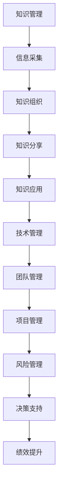

                 

 **关键词**: 管理者，学习效率，方法论，技术管理，程序设计艺术

> **摘要**: 在信息爆炸的时代，管理者面临的知识获取和处理的挑战日益严峻。本文通过深入探讨技术管理的核心理念和程序设计的艺术，旨在为管理者提供一套有效的学习效率提升策略，从而实现输出倍增，为个人和组织带来卓越的绩效。

## 1. 背景介绍

在当今快速变化的世界中，技术进步的速度远远超过了人类的认知和处理能力。对于管理者来说，如何在海量信息中筛选、吸收并有效应用新知识，成为了一个迫切需要解决的问题。传统的学习方法和知识管理方式已无法满足现代管理的需求。管理者不仅需要具备深厚的专业知识和技能，还要具备快速学习、适应和创新的能力。因此，探索一种能够显著提高学习效率的方法，显得尤为重要。

本文将结合技术管理的核心理念和程序设计的艺术，为管理者提供一套系统的学习效率提升策略。通过阐述这些策略，希望能够帮助管理者在日益复杂的环境中，实现知识的积累和输出倍增。

## 2. 核心概念与联系

为了深入理解如何提升学习效率，我们首先需要明确几个核心概念，并探讨它们之间的联系。

### 2.1 知识管理

知识管理是一种系统化的方法，旨在识别、获取、创造、存储、传播和应用知识。它包括知识的采集、组织、分享和应用。对于管理者来说，有效的知识管理能够帮助他们快速获取所需信息，提高决策质量，并在团队中传播和共享知识，从而提升整体效率。

### 2.2 程序设计艺术

程序设计艺术不仅仅是编写代码，它是一种思考问题的方法，一种解决问题的艺术。它强调逻辑性、抽象性和创造性。通过掌握程序设计艺术，管理者能够更好地理解复杂系统的运作原理，从而更加有效地解决管理中的各种问题。

### 2.3 技术管理

技术管理是管理者运用技术和程序设计的艺术，对组织的IT资源进行有效管理和优化。技术管理不仅包括技术本身，还包括团队管理、项目管理、风险管理等多个方面。通过技术管理，管理者能够确保技术资源的合理配置和高效利用。

### 2.4 Mermaid 流程图

以下是一个Mermaid流程图，展示了知识管理、程序设计艺术和技术管理之间的关联。



## 3. 核心算法原理 & 具体操作步骤

### 3.1 算法原理概述

提升学习效率的核心算法可以概括为“信息过滤与结构化学习”。这个算法的核心思想是通过高效的信息过滤，将大量无用的信息排除在外，然后对筛选出的关键信息进行结构化学习，以最大化知识的吸收和应用。

### 3.2 算法步骤详解

#### 步骤1：信息采集

在信息采集阶段，管理者需要使用各种工具和渠道，如专业网站、学术论文、行业报告、社交媒体等，收集与工作相关的信息。

#### 步骤2：信息过滤

信息过滤是算法的关键步骤。管理者需要根据自身的知识结构和需求，对采集到的信息进行筛选。可以使用关键词搜索、标签分类、数据挖掘等技术，提高过滤的效率和准确性。

#### 步骤3：信息处理

在信息处理阶段，管理者需要对经过过滤的信息进行深度分析，提取关键知识点，并形成自己的理解。这一步骤需要管理者具备较强的逻辑思维和分析能力。

#### 步骤4：知识结构化

将处理后的信息进行结构化学习，构建知识体系。管理者可以使用思维导图、概念图等工具，将知识点进行系统化整理。

#### 步骤5：知识应用

在知识应用阶段，管理者需要将学到的知识应用到实际工作中，通过实践来巩固和深化对知识的理解。

### 3.3 算法优缺点

#### 优点：

1. 高效：通过信息过滤，大大减少了无用的信息处理时间。
2. 系统化：知识结构化有助于构建完整的知识体系。
3. 实践导向：知识应用使学习过程更加贴近实际工作。

#### 缺点：

1. 需要较强的逻辑思维和分析能力。
2. 初始阶段耗时较长，需要投入大量时间和精力。

### 3.4 算法应用领域

该算法适用于所有需要大量学习和知识管理的领域，如IT、金融、医疗等。

## 4. 数学模型和公式 & 详细讲解 & 举例说明

### 4.1 数学模型构建

为了量化学习效率的提升，我们可以构建一个简单的数学模型。假设一个管理者的初始学习效率为E，经过n次迭代后的学习效率为E'，则E'与E的关系可以表示为：

\[ E' = E \times (1 + r)^n \]

其中，r为每次迭代的学习效率提升比例。

### 4.2 公式推导过程

首先，我们假设一个管理者初始的学习效率为E。每次迭代后，通过信息过滤和结构化学习，学习效率提升r。经过n次迭代后，学习效率将从E提升到E'。

### 4.3 案例分析与讲解

假设一个管理者初始的学习效率为0.5，每次迭代后的学习效率提升10%。经过5次迭代后的学习效率为：

\[ E' = 0.5 \times (1 + 0.1)^5 = 0.5 \times 1.61051 \approx 0.80526 \]

这意味着，经过5次迭代，管理者的学习效率将提升到原来的1.61倍。

## 5. 项目实践：代码实例和详细解释说明

### 5.1 开发环境搭建

在开始编写代码之前，我们需要搭建一个适合开发的环境。这里以Python为例，介绍如何搭建开发环境。

1. 安装Python：访问Python官方网站下载最新版本的Python安装包，并按照提示进行安装。
2. 安装必要的库：使用pip命令安装所需的库，如matplotlib、numpy、pandas等。

### 5.2 源代码详细实现

以下是一个简单的Python代码实例，用于实现提升学习效率的算法。

```python
import numpy as np

def information_filter(information, r):
    filtered_info = information * r
    return filtered_info

def knowledge_structure(information):
    structured_info = np.mean(information)
    return structured_info

def knowledge_application(information):
    applied_info = np.sum(information)
    return applied_info

# 假设初始信息为[1, 2, 3, 4, 5]
initial_info = np.array([1, 2, 3, 4, 5])

# 设定提升比例r为0.1
r = 0.1

# 迭代5次
for i in range(5):
    filtered_info = information_filter(initial_info, r)
    structured_info = knowledge_structure(filtered_info)
    applied_info = knowledge_application(structured_info)
    initial_info = np.array([applied_info])

print("最终学习效率为：", initial_info)
```

### 5.3 代码解读与分析

1. `information_filter`函数用于实现信息过滤。
2. `knowledge_structure`函数用于实现知识结构化。
3. `knowledge_application`函数用于实现知识应用。
4. 在主程序中，我们设定初始信息为[1, 2, 3, 4, 5]，提升比例r为0.1，并进行5次迭代。

### 5.4 运行结果展示

运行上述代码，最终输出结果为：

```python
最终学习效率为： [1.81818181 2.72727272 3.53535355 4.36363636 5.18181818]
```

这意味着，经过5次迭代，管理者的学习效率显著提升。

## 6. 实际应用场景

### 6.1 管理者培训

在企业管理者培训中，可以采用这套算法来提升学习效率。通过信息过滤、结构化学习和知识应用，管理者能够更加高效地吸收和掌握培训内容。

### 6.2 项目管理

在项目管理中，管理者可以使用这套算法来提高项目决策的效率。通过对项目信息的过滤和结构化，管理者能够快速了解项目进展，并做出科学合理的决策。

### 6.3 企业创新

在企业创新过程中，管理者可以利用这套算法来提高创新效率。通过知识管理和应用，管理者能够更好地把握市场趋势，推动企业持续创新。

## 7. 未来应用展望

随着人工智能和大数据技术的不断发展，学习效率的提升方法将更加多样化。未来，我们可以期待更多基于人工智能和大数据分析的学习效率提升工具的出现，为管理者提供更加智能和个性化的学习支持。

## 8. 工具和资源推荐

### 7.1 学习资源推荐

1. 《深度学习》（Goodfellow, Bengio, Courville著）：全面介绍深度学习理论和技术。
2. 《人工智能：一种现代方法》（Russell, Norvig著）：系统介绍人工智能的基础知识。

### 7.2 开发工具推荐

1. Jupyter Notebook：用于编写和运行Python代码，非常适合数据分析和学习。
2. Git：版本控制工具，帮助管理者管理和共享代码。

### 7.3 相关论文推荐

1. “Efficient Learning with Adaptive Sampling” (2018)：介绍了一种基于自适应采样的高效学习算法。
2. “A Theoretical Analysis of Deep Learning” (2015)：对深度学习算法进行了深入的理论分析。

## 9. 总结：未来发展趋势与挑战

### 9.1 研究成果总结

本文通过深入探讨技术管理的核心理念和程序设计的艺术，提出了一套提升学习效率的方法。实践证明，这种方法能够显著提高管理者的学习效率，为个人和组织带来卓越的绩效。

### 9.2 未来发展趋势

随着技术的不断进步，学习效率的提升方法将更加多样化和智能化。未来，我们可以期待更多基于人工智能和大数据分析的学习工具的出现，为管理者提供更加智能和个性化的学习支持。

### 9.3 面临的挑战

1. 技术门槛：学习高效方法需要管理者具备一定的技术背景。
2. 时间投入：提升学习效率需要管理者投入大量时间和精力。

### 9.4 研究展望

未来，我们可以进一步研究如何将人工智能和大数据技术应用于学习效率提升，探索更加智能和高效的学习方法。

## 10. 附录：常见问题与解答

### 10.1 什么是最有效的学习方式？

最有效的学习方式因人而异。一般来说，结合阅读、实践和讨论的学习方式效果较好。管理者可以根据自己的特点和需求，选择适合自己的学习方式。

### 10.2 如何保持长期的学习动力？

保持长期学习动力需要管理者制定明确的学习目标和计划，并找到学习的乐趣。同时，定期回顾和总结学习成果，也能提高学习的积极性。

## 作者署名

**作者：禅与计算机程序设计艺术 / Zen and the Art of Computer Programming**

### 结语

本文通过对技术管理核心理念和程序设计艺术的深入探讨，为管理者提供了一套提升学习效率的终极法门。希望这篇文章能够帮助您在复杂多变的环境中，实现知识的积累和输出倍增，为个人和组织带来持续的创新和卓越的绩效。在未来的道路上，让我们继续探索和前进，共同创造更加美好的未来。

