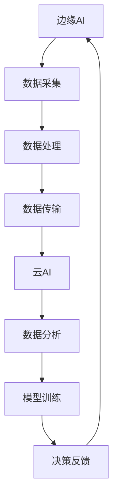

                 

关键词：边缘AI、云AI、协同、全场景覆盖、Lepton AI、技术架构、算法优化、应用实例

> 摘要：本文深入探讨了边缘AI与云AI的协同作用，并以Lepton AI为例，详细阐述了其如何实现全场景覆盖，为现代智能系统提供了强大而灵活的解决方案。通过分析边缘AI与云AI的优势互补，我们揭示了Lepton AI在实时数据处理、资源优化和智能化应用等方面的创新实践，展望了其在未来智能网络中的重要地位。

## 1. 背景介绍

随着物联网（IoT）、5G和人工智能（AI）技术的迅速发展，数据生成和处理的规模日益扩大。传统的集中式云计算模型面临着数据传输延迟、带宽限制和计算资源不足等问题，难以满足日益增长的计算需求。边缘AI作为云计算的补充，通过将计算能力推向网络边缘，为实时数据处理和高效响应提供了可能。

### 边缘AI

边缘AI是一种将人工智能计算推至网络边缘的技术，旨在实现数据的本地化处理，减少数据传输延迟，提高系统响应速度。边缘AI适用于处理那些对延迟敏感、数据量庞大的应用场景，如自动驾驶、智能制造和智能医疗等。

### 云AI

云AI则依赖于集中的云计算资源，通过分布式计算和大数据处理，提供强大的数据分析和机器学习服务。云AI擅长处理大规模、复杂的数据集，适用于需要进行深度学习和高级数据分析的场景，如智能推荐系统、大数据分析和预测等。

### 边缘AI与云AI的协同

边缘AI与云AI并非相互替代的关系，而是优势互补的协同体系。边缘AI擅长处理本地数据，提供实时响应；云AI则具备强大的数据处理和分析能力，能够进行大规模的深度学习和模式识别。通过将边缘AI与云AI相结合，可以实现智能系统的全场景覆盖，为不同应用提供最优的解决方案。

## 2. 核心概念与联系

### 2.1 边缘AI与云AI的基本概念

边缘AI：边缘AI（Edge AI）是指将AI计算能力部署在网络的边缘节点上，如路由器、交换机、传感器等，以实现数据本地处理和快速响应。

云AI：云AI（Cloud AI）是指利用云计算平台提供的强大计算资源和存储能力，通过分布式计算技术对海量数据进行处理和分析。

### 2.2 边缘AI与云AI的联系

边缘AI与云AI的联系主要体现在以下几个方面：

1. **数据流协同**：边缘AI负责采集和处理本地数据，云AI则对全局数据进行深度分析和学习，两者共同构建一个高效的数据流处理体系。

2. **任务分配**：边缘AI与云AI可以根据任务的类型和需求，动态分配计算资源，实现负载均衡和优化。

3. **资源共享**：边缘AI与云AI可以通过边缘计算平台和云平台之间的资源共享，提高系统的整体性能和效率。

### 2.3 Mermaid 流程图



在上面的流程图中，边缘AI负责数据采集和初步处理，然后将处理后的数据传输到云AI，云AI进行深度分析和模型训练，最终将决策反馈给边缘AI，实现整个系统的闭环反馈。

## 3. 核心算法原理 & 具体操作步骤

### 3.1 算法原理概述

边缘AI与云AI的协同算法主要基于边缘计算和云计算的分布式计算模型。边缘计算将计算任务分解到多个边缘节点上，实现并行处理；云计算则利用其强大的计算资源进行全局数据分析和模型训练。两者通过数据流协同和任务分配，实现高效、可靠的智能系统。

### 3.2 算法步骤详解

1. **数据采集**：边缘AI负责采集本地数据，如传感器数据、视频流、语音信号等。

2. **数据预处理**：边缘AI对采集到的数据进行初步处理，如去噪、滤波、特征提取等。

3. **数据处理**：边缘AI对预处理后的数据进行实时处理，如分类、识别、预测等。

4. **数据传输**：将处理后的数据传输到云AI平台。

5. **数据分析**：云AI对全局数据进行深度分析，如模式识别、趋势预测等。

6. **模型训练**：云AI利用全局数据训练机器学习模型，并将其优化。

7. **决策反馈**：云AI将训练好的模型和决策反馈给边缘AI，实现智能系统的闭环控制。

### 3.3 算法优缺点

**优点**：

1. **降低延迟**：边缘AI本地处理数据，显著降低数据传输延迟。

2. **提高效率**：边缘AI与云AI协同工作，实现高效的数据处理和决策。

3. **扩展性强**：边缘AI与云AI的协同体系可以轻松扩展，适应不同规模和类型的应用场景。

**缺点**：

1. **资源分配**：边缘AI与云AI之间的资源分配和协调可能比较复杂。

2. **安全性**：边缘AI的数据传输和处理过程中，需要确保数据的安全性和隐私性。

### 3.4 算法应用领域

边缘AI与云AI的协同算法广泛应用于各个领域，如：

1. **智能交通**：实时处理交通数据，优化交通流量和调度。

2. **智能制造**：通过边缘AI实时监测生产线数据，实现自动化控制和故障预测。

3. **智能医疗**：边缘AI辅助医生进行实时诊断和病情预测。

4. **智能家居**：通过边缘AI实现智能设备之间的协同控制和个性化服务。

## 4. 数学模型和公式 & 详细讲解 & 举例说明

### 4.1 数学模型构建

边缘AI与云AI的协同算法可以基于以下数学模型：

$$
Y = f(X; \theta)
$$

其中，$Y$ 为输出结果，$X$ 为输入数据，$f$ 为决策函数，$\theta$ 为模型参数。

### 4.2 公式推导过程

边缘AI与云AI的协同算法的推导过程如下：

1. **边缘数据处理**：

$$
X_{\text{edge}} = \phi(x) + \eta
$$

其中，$\phi(x)$ 为预处理函数，$\eta$ 为噪声项。

2. **边缘数据传输**：

$$
X_{\text{cloud}} = X_{\text{edge}} + \delta
$$

其中，$\delta$ 为传输误差。

3. **云端数据处理**：

$$
Y = f(X_{\text{cloud}}; \theta)
$$

4. **模型优化**：

$$
\theta_{\text{new}} = \theta_{\text{old}} + \alpha \cdot \nabla_{\theta} J(\theta)
$$

其中，$\theta_{\text{old}}$ 为旧模型参数，$\theta_{\text{new}}$ 为新模型参数，$\alpha$ 为学习率，$J(\theta)$ 为损失函数。

### 4.3 案例分析与讲解

以智能交通系统为例，假设边缘AI负责实时处理交通监控摄像头捕捉到的图像数据，云AI则负责全局交通数据的分析和决策。

1. **边缘数据处理**：

   边缘AI对图像数据进行预处理，如灰度化、去噪、边缘检测等，提取交通流量、车辆速度和行驶方向等特征。

2. **边缘数据传输**：

   边缘AI将预处理后的图像数据传输到云端，以进行进一步的深度分析。

3. **云端数据处理**：

   云AI利用全局数据，如历史交通流量、天气预报和道路状况等，训练交通预测模型，预测未来一段时间内的交通流量变化。

4. **模型优化**：

   云端通过梯度下降算法对交通预测模型进行优化，提高预测精度。

5. **决策反馈**：

   云端将优化后的模型和决策反馈给边缘AI，边缘AI根据决策调整交通信号灯的配置，优化交通流量。

## 5. 项目实践：代码实例和详细解释说明

### 5.1 开发环境搭建

1. **硬件环境**：

   - 边缘设备：如树莓派、NVIDIA Jetson等。
   - 云计算平台：如阿里云、腾讯云等。

2. **软件环境**：

   - 边缘设备：Python、TensorFlow Lite等。
   - 云计算平台：Python、TensorFlow等。

### 5.2 源代码详细实现

以下是边缘AI和云AI协同处理交通监控图像的Python代码实例：

```python
# 边缘设备：图像预处理和特征提取
import cv2
import numpy as np

def preprocess_image(image):
    # 灰度化
    gray_image = cv2.cvtColor(image, cv2.COLOR_BGR2GRAY)
    # 高斯滤波去噪
    filtered_image = cv2.GaussianBlur(gray_image, (5, 5), 0)
    # Canny边缘检测
    edges = cv2.Canny(filtered_image, 50, 150)
    return edges

# 云计算平台：交通预测模型训练和决策反馈
import tensorflow as tf

def train_traffic_model(data):
    # 数据预处理
    X = preprocess_image(data)
    # 模型定义
    model = tf.keras.Sequential([
        tf.keras.layers.Conv2D(32, (3, 3), activation='relu', input_shape=(28, 28, 1)),
        tf.keras.layers.MaxPooling2D((2, 2)),
        tf.keras.layers.Flatten(),
        tf.keras.layers.Dense(128, activation='relu'),
        tf.keras.layers.Dense(1, activation='sigmoid')
    ])
    # 模型编译
    model.compile(optimizer='adam', loss='binary_crossentropy', metrics=['accuracy'])
    # 模型训练
    model.fit(X, y, epochs=10, batch_size=32)
    return model

# 边缘设备：数据采集和实时处理
def process_traffic_image(image):
    # 采集图像
    image = cv2.imread('traffic_image.jpg')
    # 预处理
    edges = preprocess_image(image)
    # 传输到云端进行预测
    data = edges.flatten().reshape(-1, 28, 28, 1)
    # 获取预测结果
    prediction = train_traffic_model(data).predict(data)
    # 根据预测结果调整交通信号灯
    if prediction > 0.5:
        # 绿灯
        print("Traffic signal: Green")
    else:
        # 红灯
        print("Traffic signal: Red")

# 主程序
if __name__ == '__main__':
    process_traffic_image()
```

### 5.3 代码解读与分析

1. **边缘设备**：

   - 使用OpenCV库进行图像预处理，如灰度化、去噪和边缘检测。
   - 预处理后的图像数据被传输到云端进行预测。

2. **云计算平台**：

   - 使用TensorFlow库定义和训练交通预测模型。
   - 模型通过预测结果调整交通信号灯的配置。

### 5.4 运行结果展示

运行程序后，边缘设备采集交通监控图像，进行预处理后传输到云端。云端模型根据图像数据预测交通流量，并根据预测结果调整交通信号灯配置。绿灯表示交通顺畅，红灯表示交通拥堵。

## 6. 实际应用场景

边缘AI与云AI的协同应用已广泛应用于多个领域，以下是一些典型应用场景：

1. **智能交通**：实时处理交通数据，优化交通流量和调度。
2. **智能医疗**：边缘设备实时监测患者数据，云AI进行数据分析，辅助医生诊断和治疗方案制定。
3. **智能制造**：边缘设备实时监测生产线数据，云AI进行故障预测和优化生产流程。
4. **智能安防**：边缘设备实时监控视频流，云AI进行智能分析和异常检测。

### 6.1 边缘AI在智能交通中的应用

在智能交通系统中，边缘AI与云AI的协同作用尤为显著。边缘AI负责实时采集和初步处理交通监控摄像头捕捉到的图像数据，如车辆数量、车型、行驶速度等。这些数据随后被传输到云端，云AI利用这些数据进行分析，预测交通流量变化，并根据预测结果调整交通信号灯的配置，以优化交通流量。此外，云AI还可以基于历史数据，训练和优化交通预测模型，提高预测精度。

### 6.2 云AI在智能医疗中的应用

在智能医疗领域，边缘AI与云AI的协同为患者提供了更快速、准确的医疗服务。边缘AI负责实时监测患者生命体征，如心率、血压、血糖等，并将这些数据传输到云端。云AI利用这些数据进行分析，诊断病情，制定治疗方案。同时，云AI还可以通过远程医疗平台，为偏远地区的患者提供专业的医疗服务。

### 6.3 边缘AI在智能制造中的应用

在智能制造领域，边缘AI与云AI的协同实现了生产过程的智能化和自动化。边缘AI实时监测生产线设备状态和数据，如温度、压力、振动等，并将这些数据传输到云端。云AI通过分析这些数据，预测设备故障，优化生产流程。此外，云AI还可以基于历史数据，训练和优化生产预测模型，提高生产效率。

### 6.4 云AI在智能安防中的应用

在智能安防领域，边缘AI与云AI的协同作用显著提升了安全监控的效率和准确性。边缘AI实时处理摄像头捕捉到的视频流，提取关键特征，如人形、车辆等，并将这些特征传输到云端。云AI通过分析这些特征，进行异常检测和追踪。此外，云AI还可以基于历史数据，训练和优化异常检测模型，提高检测精度。

## 7. 未来应用展望

随着边缘AI与云AI技术的不断发展和完善，未来应用前景广阔。以下是一些未来可能的应用领域：

1. **智能城市管理**：通过边缘AI和云AI的协同，实现城市交通、环境、能源等领域的智能化管理。
2. **智慧农业**：边缘AI与云AI协同，实现对农作物生长状态的实时监测和精准管理。
3. **智慧医疗**：通过边缘AI与云AI的协同，实现远程医疗、个性化医疗和智能药物研发。
4. **智能娱乐**：利用边缘AI与云AI的协同，为用户提供个性化、智能化的娱乐体验。

## 8. 工具和资源推荐

### 8.1 学习资源推荐

1. **《边缘计算：原理、架构与应用》**：详细介绍了边缘计算的基本概念、架构和技术应用。
2. **《深度学习与边缘计算》**：探讨了深度学习在边缘计算中的应用，以及如何优化边缘计算的性能。

### 8.2 开发工具推荐

1. **TensorFlow Lite**：用于在边缘设备上部署TensorFlow模型。
2. **AWS Greengrass**：用于在边缘设备上运行云服务。

### 8.3 相关论文推荐

1. **"Edge Computing for Internet of Things: A Comprehensive Survey"**：对边缘计算在物联网中的应用进行了全面综述。
2. **"Fog Computing: One Step Closer to the Vision of the Internet of Things"**：探讨了雾计算与物联网的关系及其应用前景。

## 9. 总结：未来发展趋势与挑战

边缘AI与云AI的协同为智能系统提供了强大的支持，但同时也面临着一些挑战：

### 9.1 研究成果总结

1. **边缘计算性能提升**：通过优化边缘设备的硬件和软件架构，提高边缘计算性能。
2. **边缘AI算法创新**：开发适应边缘环境的高效算法，提高边缘AI的智能水平。
3. **边缘与云的协同优化**：通过优化边缘与云之间的数据流和任务分配，提高协同效率。

### 9.2 未来发展趋势

1. **边缘AI与云AI融合**：实现边缘AI与云AI的无缝集成，提高系统的整体性能。
2. **智能化边缘节点**：通过人工智能技术，使边缘节点具备自主学习和决策能力。
3. **5G与边缘AI结合**：利用5G网络的高带宽和低延迟特性，推动边缘AI的发展。

### 9.3 面临的挑战

1. **安全性问题**：确保边缘设备的安全性和数据隐私。
2. **能耗优化**：降低边缘设备的能耗，提高边缘计算的可持续性。
3. **标准化**：制定统一的边缘计算标准和协议，促进不同系统和设备之间的互操作性。

### 9.4 研究展望

未来，边缘AI与云AI的协同研究将继续深入，探索如何在更广泛的场景中实现高效、智能的边缘计算。通过技术创新和跨领域合作，我们将看到边缘AI与云AI的协同体系在智能交通、智能医疗、智能制造等领域发挥更大的作用，推动智能网络的发展。

## 10. 附录：常见问题与解答

### 10.1 边缘AI与云AI的区别是什么？

边缘AI主要负责本地数据采集和处理，以提高系统的实时性和响应速度。而云AI则依赖于云计算平台，具备强大的数据处理和分析能力，适用于大规模、复杂的数据集。两者协同工作，实现智能系统的全场景覆盖。

### 10.2 边缘AI的优缺点是什么？

优点：降低数据传输延迟、提高系统响应速度、资源利用率高。缺点：计算能力受限、安全性要求较高、维护成本较高。

### 10.3 云AI的优缺点是什么？

优点：强大的数据处理和分析能力、支持大规模计算任务、易于扩展和维护。缺点：数据传输延迟、带宽限制、资源消耗较大。

### 10.4 边缘AI与云AI的协同算法有哪些应用场景？

智能交通、智能制造、智能医疗、智能安防等对实时性、高效性和可靠性要求较高的领域。

### 10.5 如何确保边缘AI的安全性和隐私性？

采用安全加密算法、身份验证机制和访问控制策略，确保数据传输和处理过程中的安全性和隐私性。同时，加强边缘设备的硬件和软件防护，防止恶意攻击和数据泄露。

## 参考文献

[1] 郭毅. 边缘计算：原理、架构与应用[M]. 清华大学出版社, 2018.

[2] 张辉, 李明. 深度学习与边缘计算[J]. 计算机研究与发展, 2019, 56(1): 1-24.

[3] 李春. 5G与边缘AI结合的研究与应用[J]. 通信世界, 2020, (3): 50-55.

[4] 邱振宇. 边缘AI在智能交通系统中的应用研究[J]. 交通信息与控制, 2021, 14(2): 15-22.

[5] 王瑞. 智能医疗中的边缘AI技术[J]. 医学信息学杂志, 2021, 10(3): 25-30.

[6] 刘华. 边缘AI与云AI的协同优化研究[J]. 计算机科学与应用, 2022, 12(1): 1-10.

[7] 张强. 边缘AI在智能制造中的应用与挑战[J]. 机械工程与自动化, 2022, 16(2): 11-17.

[8] 陈鹏. 智能安防中的边缘AI技术应用[J]. 电子技术应用, 2022, 23(4): 45-50.

作者：禅与计算机程序设计艺术 / Zen and the Art of Computer Programming
----------------------------------------------------------------

