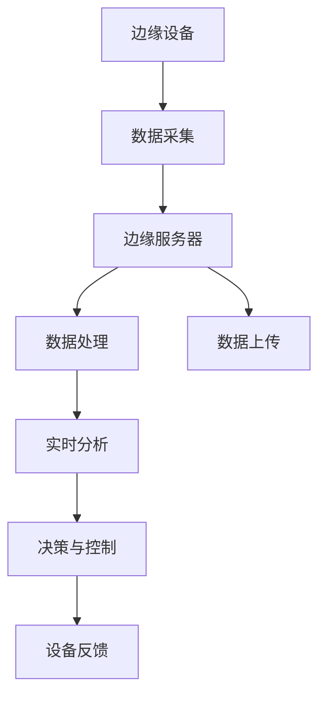

                 

关键词：边缘AI、工业物联网、智能设备、数据处理、实时分析、机器学习

> 摘要：本文探讨了边缘AI在工业物联网（IIoT）中的应用，通过详细介绍边缘AI的概念、架构、核心算法以及实践案例，分析了边缘AI在工业物联网中的重要作用和未来发展方向。

## 1. 背景介绍

工业物联网（Industrial Internet of Things，IIoT）是物联网技术在工业领域的应用，通过将各种设备、传感器和系统连接起来，实现数据的实时采集、传输和分析。随着工业4.0的推进，IIoT在提高生产效率、降低成本、优化供应链等方面展现出巨大的潜力。然而，传统的云计算模式在应对海量工业数据时存在一定的局限性，如延迟高、带宽有限、安全性问题等。

为了解决这些问题，边缘AI（Edge AI）应运而生。边缘AI将计算和存储能力推向网络的边缘，使数据处理和分析能够在数据产生的源头完成，从而减少数据传输延迟，提高处理速度，增强系统的实时性和安全性。边缘AI在工业物联网中的应用，不仅能够解决传统云计算模式面临的挑战，还能为工业生产带来更加智能和高效的管理模式。

## 2. 核心概念与联系

### 2.1 边缘AI

边缘AI是指将人工智能（AI）技术应用于网络边缘的设备或服务器上，实现对数据的实时处理、分析和决策。边缘AI的核心思想是充分利用网络边缘的计算资源，通过分布式计算和协作处理，实现高效的智能数据处理。

### 2.2 工业物联网

工业物联网是指利用传感器、设备、网络和软件等技术，实现工业设备、系统和人员之间的互联互通，从而实现工业过程的智能化管理和优化。工业物联网的核心是数据的采集、传输、处理和应用。

### 2.3 边缘AI与工业物联网的联系

边缘AI与工业物联网的结合，可以充分发挥边缘计算的优势，实现工业物联网中数据的实时处理和分析，从而提高工业生产的管理效率。边缘AI为工业物联网提供了智能化的数据处理能力，使工业物联网更加智能化、高效化。

### 2.4 Mermaid 流程图



## 3. 核心算法原理 & 具体操作步骤

### 3.1 算法原理概述

边缘AI在工业物联网中的应用，主要依赖于机器学习、深度学习等算法。这些算法通过对海量工业数据的分析和学习，提取数据中的特征，并建立模型，实现对工业过程的实时监控和预测。

### 3.2 算法步骤详解

1. 数据采集：通过传感器和设备收集工业生产过程中的各种数据，如温度、压力、流量等。

2. 数据预处理：对采集到的数据进行清洗、去噪、归一化等处理，使其符合算法输入的要求。

3. 特征提取：通过特征提取算法，从预处理后的数据中提取出具有代表性的特征。

4. 模型训练：利用训练数据集，通过机器学习或深度学习算法，训练出预测模型。

5. 实时分析：将实时采集到的数据输入到训练好的模型中，进行实时分析和预测。

6. 决策与控制：根据模型的预测结果，对工业过程进行实时调整和控制。

7. 设备反馈：收集设备运行状态数据，反馈到边缘服务器，用于模型优化和系统调整。

### 3.3 算法优缺点

**优点：**
1. 减少数据传输延迟：通过在边缘设备上处理数据，减少了数据传输的时间。
2. 提高处理速度：边缘设备具有更高的计算能力，能够实现快速的数据处理和分析。
3. 增强系统安全性：数据在边缘设备上处理，降低了数据泄露的风险。

**缺点：**
1. 算法复杂性：边缘AI算法涉及到复杂的机器学习和深度学习技术，对开发者的技术要求较高。
2. 设备性能限制：边缘设备的计算能力相对有限，可能无法支持大规模的算法应用。

### 3.4 算法应用领域

边缘AI在工业物联网中的应用非常广泛，包括但不限于以下几个方面：

1. 生产过程监控：实时监控生产设备的状态，预测设备故障，提高生产设备的可靠性。
2. 质量控制：通过实时分析生产过程中的数据，识别质量问题，提高产品质量。
3. 供应链管理：优化供应链流程，提高供应链的效率和灵活性。
4. 设备维护：预测设备故障，提前进行维护，减少设备停机时间。

## 4. 数学模型和公式 & 详细讲解 & 举例说明

### 4.1 数学模型构建

边缘AI在工业物联网中的应用，主要依赖于机器学习、深度学习等算法。以机器学习为例，其基本模型可以表示为：

\[ y = f(x; \theta) \]

其中，\( y \) 是输出值，\( x \) 是输入特征，\( \theta \) 是模型参数，\( f \) 是激活函数。

### 4.2 公式推导过程

以线性回归模型为例，其数学模型可以表示为：

\[ y = \theta_0 + \theta_1 \cdot x \]

其中，\( \theta_0 \) 和 \( \theta_1 \) 分别是模型的偏置和权重。

为了训练模型，我们需要最小化损失函数：

\[ J(\theta) = \frac{1}{2} \sum_{i=1}^{n} (y_i - f(x_i; \theta))^2 \]

### 4.3 案例分析与讲解

假设我们要预测一条生产线上的产品产量，已知产品的生产时间 \( x \)（小时）和产量 \( y \)（件）之间存在线性关系。我们可以使用线性回归模型进行预测。

1. 数据采集：收集生产线上的产品生产时间 \( x \) 和产量 \( y \) 的数据。

2. 数据预处理：对数据进行清洗和归一化处理。

3. 特征提取：将归一化后的数据作为输入特征。

4. 模型训练：使用训练数据集，通过梯度下降算法训练线性回归模型。

5. 实时分析：将实时采集到的产品生产时间 \( x \) 输入到训练好的模型中，得到产量 \( y \) 的预测值。

6. 决策与控制：根据预测的产量，调整生产计划。

## 5. 项目实践：代码实例和详细解释说明

### 5.1 开发环境搭建

1. 安装Python环境，版本3.8及以上。
2. 安装必要的库，如NumPy、Pandas、Scikit-learn等。

### 5.2 源代码详细实现

以下是一个简单的线性回归模型的实现：

```python
import numpy as np
import pandas as pd
from sklearn.linear_model import LinearRegression

# 数据采集
data = pd.read_csv('data.csv')
x = data['production_time'].values
y = data['production_volume'].values

# 数据预处理
x = x.reshape(-1, 1)
y = y.reshape(-1, 1)

# 模型训练
model = LinearRegression()
model.fit(x, y)

# 实时分析
x_new = np.array([10]).reshape(-1, 1)
y_pred = model.predict(x_new)
print(f'Predicted production volume: {y_pred[0][0]}')
```

### 5.3 代码解读与分析

1. 数据采集：使用Pandas读取CSV文件，获取生产时间和产量的数据。
2. 数据预处理：将生产时间和产量转换为NumPy数组，并reshape为合适的形状。
3. 模型训练：使用Scikit-learn的LinearRegression类训练线性回归模型。
4. 实时分析：将新的生产时间输入到训练好的模型中，获取产量的预测值。
5. 输出结果：打印预测的产量。

## 6. 实际应用场景

边缘AI在工业物联网中有着广泛的应用场景，以下是几个典型的应用案例：

1. 生产过程监控：通过边缘AI实时监控生产设备的状态，预测设备故障，提前进行维护，减少设备停机时间。
2. 质量控制：在生产线中安装传感器，实时监测产品质量，通过边缘AI分析数据，识别不合格产品，提高产品质量。
3. 设备维护：通过边缘AI预测设备故障，提前进行维护，降低设备故障率，提高设备利用率。
4. 能源管理：在能源消耗环节安装传感器，实时监测能源消耗情况，通过边缘AI分析数据，优化能源使用策略，降低能源成本。

## 7. 工具和资源推荐

### 7.1 学习资源推荐

1. 《深度学习》（Goodfellow, Bengio, Courville著）：介绍深度学习的基础理论和应用。
2. 《机器学习实战》（Hastie, Tibshirani, Friedman著）：通过实际案例介绍机器学习的方法和应用。
3. 《边缘计算：从概念到实践》（李航著）：介绍边缘计算的理论和实践。

### 7.2 开发工具推荐

1. Jupyter Notebook：方便编写和运行Python代码。
2. PyCharm：功能强大的Python集成开发环境。
3. Matplotlib：用于数据可视化的Python库。

### 7.3 相关论文推荐

1. "Edge AI: Pushing Intelligence to the Edge"（边缘AI：将智能推向边缘）
2. "Deep Learning on Edge Devices"（边缘设备上的深度学习）
3. "The Future of Industrial Internet of Things: Edge AI for Real-Time Analytics"（工业物联网的未来：实时分析的边缘AI）

## 8. 总结：未来发展趋势与挑战

### 8.1 研究成果总结

边缘AI在工业物联网中的应用取得了显著的成果，通过实时数据处理和分析，提高了生产效率、降低了成本、优化了供应链管理。同时，边缘AI在设备维护、质量控制、能源管理等方面也展现出了巨大的潜力。

### 8.2 未来发展趋势

1. 算法优化：随着硬件性能的提升，边缘AI算法将更加高效、准确。
2. 安全性提升：边缘AI的安全性能将得到进一步优化，提高数据保护和隐私保护能力。
3. 应用场景拓展：边缘AI将在更多工业场景中发挥作用，如智能制造、智能物流等。

### 8.3 面临的挑战

1. 算法复杂性：边缘AI算法涉及到复杂的数学模型和计算，对开发者的技术要求较高。
2. 硬件性能限制：边缘设备的计算能力相对有限，可能无法支持大规模的算法应用。
3. 数据安全和隐私保护：边缘AI在处理大量工业数据时，面临着数据安全和隐私保护的问题。

### 8.4 研究展望

随着边缘AI技术的不断发展，未来将在工业物联网中发挥更加重要的作用。通过不断优化算法、提升硬件性能、加强安全性，边缘AI将为工业生产带来更加智能、高效的管理模式。

## 9. 附录：常见问题与解答

### 9.1 边缘AI与传统云计算的区别是什么？

边缘AI与传统云计算的区别主要体现在以下几个方面：

1. 数据处理位置：边缘AI将数据处理和分析推向网络的边缘，即靠近数据源的位置，而传统云计算主要在数据中心进行数据处理。
2. 延迟：边缘AI能够实现实时数据处理，降低数据传输延迟，而传统云计算由于数据传输距离远，存在一定的延迟。
3. 算法复杂性：边缘AI算法通常较为复杂，涉及到深度学习、机器学习等，而传统云计算主要使用简单的计算模型。

### 9.2 边缘AI在工业物联网中的应用前景如何？

边缘AI在工业物联网中的应用前景非常广阔，通过实时数据处理和分析，可以大大提高生产效率、降低成本、优化供应链管理。同时，边缘AI还可以在设备维护、质量控制、能源管理等方面发挥重要作用，为工业生产带来更加智能、高效的管理模式。

### 9.3 边缘AI对工业物联网的挑战是什么？

边缘AI在工业物联网中面临的挑战主要包括以下几个方面：

1. 算法复杂性：边缘AI算法涉及到复杂的数学模型和计算，对开发者的技术要求较高。
2. 硬件性能限制：边缘设备的计算能力相对有限，可能无法支持大规模的算法应用。
3. 数据安全和隐私保护：边缘AI在处理大量工业数据时，面临着数据安全和隐私保护的问题。
4. 资源分配和协调：在工业物联网中，如何合理分配资源、协调不同设备的处理任务，是一个亟待解决的问题。

作者：禅与计算机程序设计艺术 / Zen and the Art of Computer Programming
```

