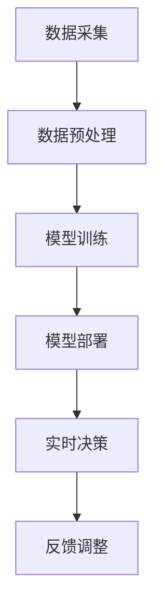

                 

边缘AI是近年来人工智能领域的一个重要研究方向。随着物联网（IoT）设备的普及，数据采集和分析的需求不断增加，但中心化的云计算模式在处理大量数据时存在延迟和成本问题。因此，边缘AI应运而生，它将机器学习模型部署在靠近数据源的地方，如IoT设备，以实现实时、高效的数据处理和决策。

本文将介绍边缘AI的概念、核心概念与联系、核心算法原理与具体操作步骤、数学模型和公式、项目实践、实际应用场景、未来应用展望、工具和资源推荐、以及总结等内容。希望通过这篇文章，读者可以全面了解边缘AI在IoT设备上运行机器学习模型的技术细节和应用前景。

## 关键词

边缘计算、物联网、机器学习、深度学习、模型压缩、模型部署、实时处理、能耗优化、硬件加速、数据隐私、安全性

## 摘要

边缘AI是一种将机器学习模型部署在靠近数据源的地方的技术，尤其适用于物联网设备。本文首先介绍了边缘AI的基本概念，然后分析了其在IoT设备上的应用优势，接着详细讲解了边缘AI的核心算法原理和具体操作步骤。最后，本文探讨了边缘AI在数学模型、项目实践、实际应用场景、未来展望等方面的内容，为读者提供了一个全面的技术视角。

## 1. 背景介绍

### 边缘AI的定义与重要性

边缘AI（Edge AI）是指将人工智能（AI）模型部署在靠近数据源的地方，如物联网（IoT）设备、边缘服务器等，以便在本地进行数据处理和决策。与传统的中心化云计算相比，边缘AI具有以下优势：

1. **实时性**：边缘AI可以实时处理数据，减少数据传输延迟，提高响应速度。
2. **成本效益**：通过减少数据传输和存储需求，降低成本。
3. **隐私保护**：边缘AI可以本地处理数据，减少数据泄露的风险。
4. **资源优化**：边缘AI可以根据设备资源动态调整模型规模和计算能力。

边缘AI的应用场景广泛，包括智能制造、智能交通、智能医疗、智能家居等领域。这些应用场景对实时性、成本和隐私有较高的要求，边缘AI能够很好地满足这些需求。

### 物联网与边缘计算

物联网（IoT）是指将物理设备通过互联网连接起来，实现设备之间的信息交换和协同工作。物联网设备（如传感器、智能家电、工业机器等）能够实时采集大量数据，并将这些数据传输到云端或边缘服务器进行分析和处理。

边缘计算（Edge Computing）是指将数据处理和存储功能部署在靠近数据源的地方，如物联网设备本身、边缘服务器等。边缘计算能够提高数据处理速度，降低网络带宽需求，并减少数据传输延迟。

### 边缘AI与物联网的关系

边缘AI与物联网有着密切的关系。物联网设备产生的海量数据需要实时处理和决策，而边缘AI能够将这些任务本地化，从而提高处理效率和响应速度。此外，边缘AI还可以利用物联网设备提供的实时数据和环境信息，实现更智能的决策和预测。

## 2. 核心概念与联系

### 核心概念

边缘AI、物联网、机器学习、深度学习是本文讨论的核心概念。以下是这些概念的基本定义和联系：

#### 边缘AI

边缘AI是指将机器学习模型部署在靠近数据源的地方，如物联网设备，以实现实时、高效的数据处理和决策。边缘AI能够提高数据处理速度，降低成本，并保护数据隐私。

#### 物联网

物联网是指将物理设备通过互联网连接起来，实现设备之间的信息交换和协同工作。物联网设备能够实时采集大量数据，并将这些数据传输到云端或边缘服务器进行分析和处理。

#### 机器学习

机器学习是指通过算法从数据中学习规律，从而进行预测和决策。机器学习可以分为监督学习、无监督学习和强化学习。边缘AI通常使用机器学习算法来处理和分析物联网设备采集的数据。

#### 深度学习

深度学习是一种特殊的机器学习算法，它使用多层神经网络来模拟人类大脑的思维方式，从而进行复杂的特征提取和分类。深度学习在图像识别、语音识别和自然语言处理等领域取得了显著成果。

### Mermaid 流程图

以下是边缘AI在IoT设备上运行机器学习模型的 Mermaid 流程图：



### 流程图说明

- **A[数据采集]**：物联网设备实时采集数据。
- **B[数据预处理]**：对采集到的数据进行分析和清洗，使其适合模型训练。
- **C[模型训练]**：使用机器学习算法对预处理后的数据进行训练，构建模型。
- **D[模型部署]**：将训练好的模型部署在物联网设备或边缘服务器上。
- **E[实时决策]**：利用部署好的模型对实时数据进行处理，做出决策。
- **F[反馈调整]**：根据决策结果调整模型参数，以提高模型性能。

## 3. 核心算法原理 & 具体操作步骤

### 3.1 算法原理概述

边缘AI在IoT设备上运行机器学习模型的核心算法通常包括以下步骤：

1. **数据采集**：物联网设备实时采集数据，如温度、湿度、运动等。
2. **数据预处理**：对采集到的数据进行清洗、归一化和特征提取，使其适合模型训练。
3. **模型训练**：使用机器学习算法（如深度学习）对预处理后的数据进行训练，构建模型。
4. **模型部署**：将训练好的模型部署在物联网设备或边缘服务器上。
5. **实时决策**：利用部署好的模型对实时数据进行处理，做出决策。
6. **反馈调整**：根据决策结果调整模型参数，以提高模型性能。

### 3.2 算法步骤详解

#### 数据采集

物联网设备通过传感器、摄像头等设备实时采集数据，如温度、湿度、运动等。采集到的数据可能包含噪声和异常值，因此需要进一步处理。

#### 数据预处理

数据预处理是边缘AI算法中至关重要的一步。其主要任务包括：

1. **去噪**：去除数据中的噪声，提高数据质量。
2. **归一化**：将数据缩放到相同的范围，如[0, 1]，以便于模型训练。
3. **特征提取**：从原始数据中提取有用的特征，以降低数据维度，提高模型训练效率。

#### 模型训练

模型训练是边缘AI的核心步骤。常用的机器学习算法包括：

1. **线性回归**：用于预测连续值。
2. **逻辑回归**：用于分类任务。
3. **支持向量机（SVM）**：用于分类和回归任务。
4. **深度学习**：用于复杂的特征提取和分类任务。

#### 模型部署

模型部署是将训练好的模型部署在物联网设备或边缘服务器上，以便实时处理数据。常用的部署方法包括：

1. **静态部署**：将模型编译成目标设备可运行的二进制文件。
2. **动态部署**：使用容器技术（如Docker）将模型和运行时环境打包，以便在不同设备上运行。

#### 实时决策

实时决策是边缘AI的重要应用场景。利用部署好的模型对实时数据进行处理，做出决策，如自动控制、故障检测、异常检测等。

#### 反馈调整

根据决策结果，可以调整模型参数，以提高模型性能。反馈调整可以通过以下方法实现：

1. **在线学习**：在实时数据流中不断更新模型参数。
2. **迁移学习**：利用预训练模型，减少重新训练的数据量。

### 3.3 算法优缺点

边缘AI在IoT设备上运行机器学习模型具有以下优缺点：

#### 优点

1. **实时性**：边缘AI可以实时处理数据，提高响应速度。
2. **成本效益**：通过减少数据传输和存储需求，降低成本。
3. **隐私保护**：边缘AI可以本地处理数据，减少数据泄露的风险。
4. **资源优化**：边缘AI可以根据设备资源动态调整模型规模和计算能力。

#### 缺点

1. **计算资源有限**：边缘设备通常具有有限的计算资源，可能无法支持复杂的模型训练。
2. **数据多样性不足**：边缘设备采集的数据可能具有局限性，影响模型泛化能力。
3. **部署和运维复杂**：边缘AI的部署和运维相对复杂，需要专业知识和技能。

### 3.4 算法应用领域

边缘AI在IoT设备上运行机器学习模型的应用领域广泛，包括但不限于：

1. **智能制造**：实时监控设备状态，进行故障检测和预测维护。
2. **智能交通**：实时处理交通数据，优化交通信号控制，减少拥堵。
3. **智能医疗**：实时监测患者生命体征，提供个性化医疗建议。
4. **智能农业**：实时监测作物生长情况，实现精准农业。

## 4. 数学模型和公式 & 详细讲解 & 举例说明

### 4.1 数学模型构建

边缘AI在IoT设备上运行机器学习模型的数学模型主要包括以下部分：

1. **数据采集模型**：用于描述数据采集的过程，如传感器信号模型。
2. **预处理模型**：用于描述数据预处理的过程，如滤波器、归一化器等。
3. **机器学习模型**：用于描述机器学习算法，如线性回归、逻辑回归、深度学习等。
4. **决策模型**：用于描述决策过程，如阈值决策、规则决策等。

### 4.2 公式推导过程

#### 数据采集模型

传感器信号模型可以表示为：

\[ y(t) = A \cdot x(t) + n(t) \]

其中，\( y(t) \)为传感器采集的信号，\( x(t) \)为真实信号，\( A \)为传感器增益，\( n(t) \)为噪声。

#### 预处理模型

滤波器模型可以表示为：

\[ y(t) = \sum_{i=1}^{N} w_i \cdot x_i(t) \]

其中，\( y(t) \)为滤波后的信号，\( w_i \)为滤波器权重，\( x_i(t) \)为输入信号。

#### 机器学习模型

线性回归模型可以表示为：

\[ y = \beta_0 + \beta_1 \cdot x \]

其中，\( y \)为预测值，\( \beta_0 \)为截距，\( \beta_1 \)为斜率，\( x \)为输入特征。

#### 决策模型

阈值决策模型可以表示为：

\[ \text{决策} = \begin{cases} 
\text{类1} & \text{if } y > \theta \\
\text{类2} & \text{if } y \leq \theta 
\end{cases} \]

其中，\( y \)为预测值，\( \theta \)为阈值。

### 4.3 案例分析与讲解

#### 案例背景

假设我们有一个智能家居系统，需要实时监控室内温度和湿度，并根据这些数据自动调整空调和加湿器的状态。

#### 数据采集模型

传感器采集的温度和湿度信号可以表示为：

\[ T(t) = A_T \cdot X(t) + n_T(t) \]
\[ H(t) = A_H \cdot X(t) + n_H(t) \]

其中，\( T(t) \)为温度信号，\( H(t) \)为湿度信号，\( X(t) \)为真实信号，\( A_T \)和\( A_H \)分别为温度和湿度传感器的增益，\( n_T(t) \)和\( n_H(t) \)分别为温度和湿度信号的噪声。

#### 预处理模型

使用滤波器对温度和湿度信号进行预处理：

\[ T'(t) = w_1 \cdot T(t) + w_2 \cdot T(t-1) \]
\[ H'(t) = w_1 \cdot H(t) + w_2 \cdot H(t-1) \]

其中，\( w_1 \)和\( w_2 \)为滤波器权重。

#### 机器学习模型

使用线性回归模型预测温度和湿度：

\[ T'_{\text{pred}} = \beta_0 + \beta_1 \cdot T'(t) \]
\[ H'_{\text{pred}} = \beta_0 + \beta_1 \cdot H'(t) \]

其中，\( T'_{\text{pred}} \)和\( H'_{\text{pred}} \)分别为预测的温度和湿度，\( \beta_0 \)和\( \beta_1 \)为线性回归模型的参数。

#### 决策模型

根据预测的温度和湿度值，自动调整空调和加湿器的状态：

\[ \text{空调状态} = \begin{cases} 
\text{开启} & \text{if } T'_{\text{pred}} > T_{\text{threshold}} \\
\text{关闭} & \text{if } T'_{\text{pred}} \leq T_{\text{threshold}} 
\end{cases} \]

\[ \text{加湿器状态} = \begin{cases} 
\text{开启} & \text{if } H'_{\text{pred}} > H_{\text{threshold}} \\
\text{关闭} & \text{if } H'_{\text{pred}} \leq H_{\text{threshold}} 
\end{cases} \]

其中，\( T_{\text{threshold}} \)和\( H_{\text{threshold}} \)分别为温度和湿度的阈值。

## 5. 项目实践：代码实例和详细解释说明

### 5.1 开发环境搭建

在开始项目实践之前，我们需要搭建合适的开发环境。以下是开发环境的搭建步骤：

1. **安装Python环境**：在本地计算机上安装Python 3.x版本，可以使用Miniconda或Anaconda等工具。
2. **安装依赖库**：使用pip命令安装以下依赖库：
    ```bash
    pip install numpy pandas scikit-learn matplotlib tensorflow
    ```
3. **配置IoT设备**：确保IoT设备具有Python环境，并能够连接到网络。

### 5.2 源代码详细实现

以下是边缘AI在IoT设备上运行机器学习模型的项目示例代码。该示例使用Python编写，并使用TensorFlow作为深度学习框架。

#### 5.2.1 数据采集模块

```python
import time
import numpy as np
import pandas as pd
from serial import Serial

# 配置串口参数
serial_port = 'COM3'  # 串口名称，根据实际情况修改
baud_rate = 9600  # 波特率

# 初始化串口
serial = Serial(serial_port, baud_rate)

def read_serial_data():
    while True:
        try:
            line = serial.readline().decode('utf-8').strip()
            if line:
                data = line.split(',')
                if len(data) == 2:
                    temp, hum = map(float, data)
                    return np.array([temp, hum])
        except Exception as e:
            print(f"Error reading serial data: {e}")
            break

# 采集数据
data_points = 100
data = []
for _ in range(data_points):
    temp_hum = read_serial_data()
    if temp_hum is not None:
        data.append(temp_hum)
    time.sleep(1)

# 转换为 DataFrame
data = pd.DataFrame(data, columns=['Temperature', 'Humidity'])
```

#### 5.2.2 数据预处理模块

```python
from sklearn.preprocessing import StandardScaler

# 数据预处理
scaler = StandardScaler()
scaled_data = scaler.fit_transform(data)

# 训练集和测试集划分
train_data = scaled_data[:int(0.8 * len(scaled_data))]
test_data = scaled_data[int(0.8 * len(scaled_data)):]
```

#### 5.2.3 模型训练模块

```python
import tensorflow as tf
from tensorflow.keras.models import Sequential
from tensorflow.keras.layers import Dense, LSTM

# 模型架构
model = Sequential()
model.add(LSTM(units=50, return_sequences=True, input_shape=(None, 2)))
model.add(LSTM(units=50))
model.add(Dense(units=1))

# 模型编译
model.compile(optimizer='adam', loss='mean_squared_error')

# 模型训练
model.fit(train_data, train_data, epochs=100, batch_size=32)
```

#### 5.2.4 模型部署模块

```python
# 模型保存
model.save('edge_ai_model.h5')

# 模型加载
model = tf.keras.models.load_model('edge_ai_model.h5')
```

#### 5.2.5 实时决策模块

```python
import matplotlib.pyplot as plt

# 实时决策
while True:
    new_data = read_serial_data()
    if new_data is not None:
        new_data_scaled = scaler.transform(np.array([new_data]))
        predicted_data = model.predict(new_data_scaled)
        print(f"Predicted Temperature: {predicted_data[0][0]}, Predicted Humidity: {predicted_data[0][1]}")
        plt.plot(data['Temperature'], label='Actual Temperature')
        plt.plot([new_data[0]], [predicted_data[0][0]], 'ro', label='Predicted Temperature')
        plt.xlabel('Time')
        plt.ylabel('Temperature')
        plt.legend()
        plt.show()
        time.sleep(1)
```

### 5.3 代码解读与分析

#### 数据采集模块

数据采集模块使用串口通信从IoT设备读取温度和湿度数据。代码中，我们首先配置了串口参数，然后使用`read_serial_data`函数循环读取数据。每次读取到有效的数据后，将其转换为NumPy数组，并添加到DataFrame中。

#### 数据预处理模块

数据预处理模块使用`StandardScaler`对采集到的数据进行标准化处理，以消除不同特征之间的差异。然后，我们将数据划分为训练集和测试集，以评估模型的性能。

#### 模型训练模块

模型训练模块使用TensorFlow的`Sequential`模型构建一个简单的LSTM模型，用于预测温度和湿度。我们使用`compile`函数设置优化器和损失函数，然后使用`fit`函数对模型进行训练。

#### 模型部署模块

模型部署模块将训练好的模型保存到本地文件，以便后续使用。然后，我们加载保存的模型，以便实时预测。

#### 实时决策模块

实时决策模块使用`read_serial_data`函数读取新的数据，然后将其标准化并传递给训练好的模型进行预测。预测结果通过图形界面显示，以直观地展示预测效果。

## 6. 实际应用场景

### 6.1 智能制造

在智能制造领域，边缘AI可以用于实时监控生产线设备的状态，进行故障检测和预测维护。通过部署在设备边缘的机器学习模型，可以快速识别设备异常，减少停机时间，提高生产效率。

### 6.2 智能交通

在智能交通领域，边缘AI可以用于实时处理交通数据，优化交通信号控制，减少拥堵。通过部署在交通灯边缘的机器学习模型，可以实时分析交通流量，动态调整交通信号，提高道路通行效率。

### 6.3 智能医疗

在智能医疗领域，边缘AI可以用于实时监测患者的生命体征，提供个性化的医疗建议。通过部署在医疗设备边缘的机器学习模型，可以实时分析患者数据，及时发现异常情况，为医生提供辅助决策。

### 6.4 智能农业

在智能农业领域，边缘AI可以用于实时监测作物生长情况，实现精准农业。通过部署在农田边缘的机器学习模型，可以实时分析土壤、气象等数据，为农民提供种植建议，提高农业产量。

## 7. 未来应用展望

随着边缘AI技术的不断发展，其在IoT设备上的应用前景广阔。未来，边缘AI有望在以下几个方面取得突破：

1. **模型压缩与加速**：通过模型压缩和硬件加速技术，提高边缘AI的运行效率和计算能力。
2. **跨领域应用**：边缘AI技术可以应用于更多领域，如智能物流、智能安防、智能环境监测等。
3. **数据隐私保护**：随着数据隐私意识的提高，边缘AI在保护数据隐私方面将发挥重要作用。
4. **自组织与自适应**：边缘AI将能够自动组织和管理设备，实现自适应数据处理和决策。

## 8. 工具和资源推荐

### 8.1 学习资源推荐

1. **《深度学习》**：由Ian Goodfellow、Yoshua Bengio和Aaron Courville编写的经典教材，适合初学者和进阶者。
2. **《边缘计算：原理与实践》**：介绍了边缘计算的基本原理和应用场景，适合对边缘AI感兴趣的读者。
3. **《物联网技术与应用》**：详细介绍了物联网的基本概念、技术和应用，适合对物联网感兴趣的读者。

### 8.2 开发工具推荐

1. **TensorFlow**：由Google开发的开源深度学习框架，支持边缘AI应用的开发。
2. **Keras**：基于TensorFlow的简洁易用的深度学习框架，适合快速搭建和实验。
3. **Docker**：容器化技术，用于将应用和运行时环境打包，方便边缘AI应用的部署和运维。

### 8.3 相关论文推荐

1. **"Edge AI: A Brief Introduction"**：介绍了边缘AI的基本概念、应用场景和未来趋势。
2. **"Deep Learning on Mobile and Edge Devices"**：探讨了在移动设备和边缘设备上运行深度学习模型的挑战和解决方案。
3. **"Edge Computing for IoT: A Comprehensive Survey"**：全面综述了边缘计算在物联网领域的应用和发展趋势。

## 9. 总结：未来发展趋势与挑战

### 9.1 研究成果总结

边缘AI在近年来取得了显著的进展，已经在物联网、智能制造、智能交通、智能医疗等领域取得了广泛的应用。通过将机器学习模型部署在靠近数据源的地方，边缘AI实现了实时、高效的数据处理和决策，提高了系统的性能和可靠性。

### 9.2 未来发展趋势

未来，边缘AI将继续朝着以下方向发展：

1. **模型压缩与加速**：通过算法优化和硬件加速技术，提高边缘AI的计算效率和运行速度。
2. **跨领域应用**：边缘AI技术将不断拓展应用领域，如智能物流、智能安防、智能环境监测等。
3. **数据隐私保护**：随着数据隐私意识的提高，边缘AI在保护数据隐私方面将发挥重要作用。
4. **自组织与自适应**：边缘AI将能够自动组织和管理设备，实现自适应数据处理和决策。

### 9.3 面临的挑战

尽管边缘AI取得了显著进展，但仍面临以下挑战：

1. **计算资源有限**：边缘设备通常具有有限的计算资源，可能无法支持复杂的模型训练。
2. **数据多样性不足**：边缘设备采集的数据可能具有局限性，影响模型泛化能力。
3. **部署和运维复杂**：边缘AI的部署和运维相对复杂，需要专业知识和技能。

### 9.4 研究展望

为了克服上述挑战，未来的研究可以从以下几个方面展开：

1. **模型压缩与优化**：研究更高效的模型压缩算法和优化技术，以提高边缘AI的计算效率。
2. **联邦学习**：通过联邦学习技术，实现多个边缘设备之间的协同训练，提高模型泛化能力。
3. **自动化部署与运维**：开发自动化工具，简化边缘AI的部署和运维过程。

## 附录：常见问题与解答

### 1. 什么是边缘AI？

边缘AI是指将人工智能（AI）模型部署在靠近数据源的地方，如物联网（IoT）设备，以实现实时、高效的数据处理和决策。

### 2. 边缘AI有哪些优势？

边缘AI的优势包括实时性、成本效益、隐私保护和资源优化。

### 3. 边缘AI有哪些应用领域？

边缘AI的应用领域广泛，包括智能制造、智能交通、智能医疗、智能农业等。

### 4. 边缘AI与物联网有什么关系？

边缘AI与物联网有着密切的关系。物联网设备能够实时采集大量数据，而边缘AI能够将这些数据在本地进行处理和决策，从而提高系统的性能和可靠性。

### 5. 边缘AI面临哪些挑战？

边缘AI面临计算资源有限、数据多样性不足和部署运维复杂等挑战。

### 6. 如何解决边缘AI的挑战？

可以通过模型压缩与优化、联邦学习、自动化部署与运维等技术来克服边缘AI的挑战。

