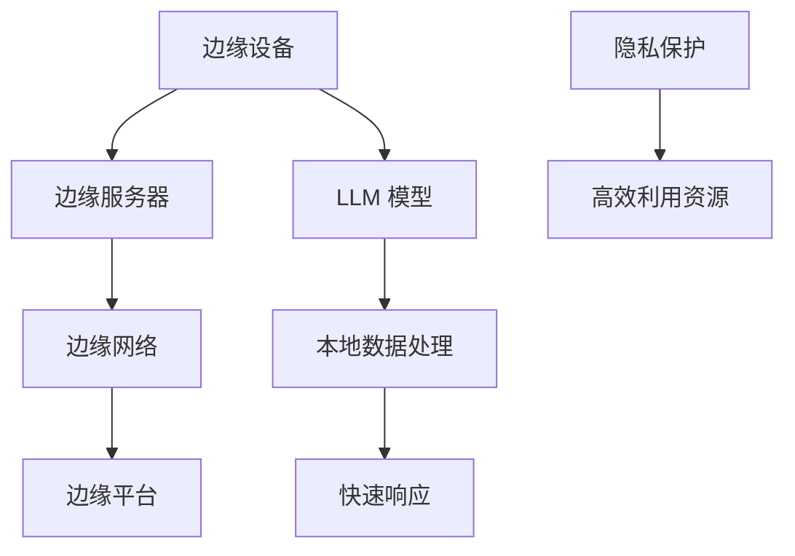

                 

### 1. 背景介绍

随着互联网的普及和信息技术的飞速发展，计算的需求在各个领域呈现爆发式增长。传统的云计算模式虽然在资源调度和弹性扩展上有着显著的优点，但在应对日益增长的计算需求时，其中心化的架构逐渐暴露出了一些瓶颈。尤其是在处理需要实时响应的应用场景时，如自动驾驶、智能医疗和工业物联网，数据传输的延迟和带宽限制成为了制约性能的关键因素。此时，边缘计算作为一种分布式计算架构，逐渐受到了广泛关注。

边缘计算通过将计算任务分散到网络边缘的设备上，实现了对数据的本地处理，从而降低了传输延迟，提高了系统的响应速度。而大规模语言模型（Large Language Model，简称 LLM）则通过深度学习技术，实现了对自然语言处理的高效处理。本文将探讨边缘计算与 LLM 的结合，如何实现低延迟、高效率的 AI 解决方案。

边缘计算的定义可以追溯到 2010 年，当时美国国防高级研究计划局（DARPA）提出了“智能分布式网络系统”（Smart Digital Battlefield Systems）的概念，旨在通过在战场边缘部署计算资源，提高军事通信的灵活性和可靠性。随着时间的推移，边缘计算的应用场景逐渐扩展到工业、医疗、交通等多个领域。

LLM 则是由深度学习技术训练得到的巨大神经网络模型，能够对输入的文本数据进行高精度的理解和生成。LLM 的出现，使得自然语言处理（NLP）领域取得了突破性进展，例如在机器翻译、文本生成、问答系统等方面都展现出了强大的能力。

边缘计算与 LLM 的结合，旨在通过分布式计算和深度学习技术，实现低延迟、高效率的 AI 解决方案。这种结合不仅能够解决传统云计算中心化架构的瓶颈，还能够更好地满足实时性要求高的应用场景需求。例如，在自动驾驶领域，边缘计算可以实时处理来自车辆周围环境的数据，而 LLM 则可以快速生成驾驶决策，从而实现自动驾驶的高效运行。

本文将首先介绍边缘计算和 LLM 的基本概念和原理，然后探讨它们如何结合实现低延迟、高效率的 AI 解决方案，最后通过实际应用案例和未来展望，进一步阐述这种结合的潜力和挑战。

### 2. 核心概念与联系

在深入探讨边缘计算与 LLM 的结合之前，我们首先需要理解这两个核心概念的基本原理和它们之间的联系。

#### 边缘计算

边缘计算是一种分布式计算架构，它将计算任务分散到网络边缘的设备上，以实现对数据的本地处理。边缘设备可以是智能手机、嵌入式系统、物联网设备，甚至是工业控制系统。边缘计算的主要优势在于它能够显著降低数据传输的延迟，提高系统的响应速度。

边缘计算的基本原理是将数据在生成的地方进行处理，而不是将所有数据传输到中心化的数据中心。这种分布式架构不仅能够减轻中心数据中心的负担，还能够提高系统的可靠性和容错能力。

边缘计算的主要组成部分包括：

1. **边缘设备**：这是边缘计算的基础，包括各种硬件设备，如传感器、嵌入式系统、移动设备等。
2. **边缘服务器**：这些服务器位于网络边缘，用于处理边缘设备生成的大量数据。
3. **边缘网络**：这是连接边缘设备和边缘服务器的网络，它可以是局域网、无线网络或者移动网络。
4. **边缘平台**：这是用于管理和协调边缘设备的软件平台，它负责资源的调度、任务的分配和数据的处理。

#### 大规模语言模型（LLM）

大规模语言模型是一种通过深度学习技术训练得到的神经网络模型，它能够对自然语言数据进行高精度的理解和生成。LLM 的出现标志着自然语言处理（NLP）领域的一个重大突破，使得许多复杂的 NLP 任务得以高效地实现。

LLM 的基本原理是通过大量的文本数据训练出一个巨大的神经网络，这个神经网络能够捕捉到语言中的复杂模式和规律。当输入新的文本数据时，LLM 可以快速地生成相应的语义理解或者生成新的文本内容。

LLM 的主要组成部分包括：

1. **模型架构**：LLM 通常采用深度神经网络架构，如 Transformer、BERT 等，这些架构能够处理大量的文本数据并生成高质量的输出。
2. **训练数据集**：LLM 的训练需要大量的文本数据，这些数据包括各种文本资料，如书籍、新闻、社交媒体帖子等。
3. **训练算法**：LLM 的训练采用深度学习算法，如梯度下降、优化算法等，这些算法能够优化神经网络的参数，使其能够更好地理解语言。
4. **推理引擎**：这是用于对输入文本数据进行处理和生成的引擎，它能够快速地执行复杂的计算任务。

#### 边缘计算与 LLM 的联系

边缘计算与 LLM 的结合主要在于以下几个方面：

1. **数据处理的本地化**：边缘计算通过在本地处理数据，减少了数据传输的距离和时间，从而降低了延迟。而 LLM 可以在边缘设备上直接对本地数据进行处理，进一步提高了系统的响应速度。
2. **资源的高效利用**：边缘计算将计算任务分散到边缘设备上，使得中心数据中心的负担减轻，同时边缘设备的计算能力也得到了充分利用。LLM 的引入，使得边缘设备能够处理复杂的自然语言处理任务，从而提高了系统的整体效率。
3. **隐私保护**：边缘计算可以在本地处理数据，从而减少了数据传输过程中的隐私泄露风险。而 LLM 的训练过程中，需要大量的隐私敏感数据，通过边缘计算的方式，可以在保护隐私的前提下，进行有效的数据分析和处理。

为了更好地理解边缘计算与 LLM 的联系，我们使用 Mermaid 流程图来展示它们的基本原理和架构。



在这个流程图中，边缘设备（A）生成数据后，通过边缘服务器（B）和边缘网络（C）传输到边缘平台（D），在边缘平台上执行 LLM 模型（E）的本地数据处理（F），从而实现快速响应（G）和隐私保护（H），同时高效利用资源（I）。

### 3. 核心算法原理 & 具体操作步骤

#### 3.1 算法原理概述

边缘计算与 LLM 的结合，主要依赖于以下几个核心算法原理：

1. **边缘计算架构**：通过将计算任务分散到网络边缘的设备上，实现数据的本地处理，降低传输延迟。
2. **深度学习算法**：通过训练大规模语言模型（LLM），实现对自然语言数据的高精度理解和生成。
3. **分布式处理**：利用边缘设备的计算能力，实现分布式数据处理和任务分配，提高系统效率。

#### 3.2 算法步骤详解

边缘计算与 LLM 的结合，具体操作步骤如下：

1. **数据采集**：边缘设备（如传感器、摄像头等）采集到数据后，将数据传输到边缘服务器。
2. **数据预处理**：边缘服务器对采集到的数据进行预处理，包括数据清洗、格式转换等，以便于后续的 LLM 处理。
3. **模型部署**：在边缘服务器上部署 LLM 模型，这些模型可以是预训练的模型，也可以是针对特定任务定制的模型。
4. **本地数据处理**：边缘设备利用部署的 LLM 模型，对本地数据进行处理，如自然语言理解、文本生成等。
5. **结果反馈**：处理后的结果通过边缘网络传输回边缘服务器，或者直接在边缘设备上进行后续操作。

#### 3.3 算法优缺点

边缘计算与 LLM 结合算法具有以下优缺点：

1. **优点**：
   - **低延迟**：通过在本地处理数据，显著降低了传输延迟，提高了系统的响应速度。
   - **高效率**：分布式处理和任务分配，提高了系统整体效率。
   - **隐私保护**：在本地处理数据，减少了数据传输过程中的隐私泄露风险。

2. **缺点**：
   - **计算资源限制**：边缘设备的计算资源相对有限，可能无法处理非常复杂的任务。
   - **网络稳定性**：边缘网络可能存在不稳定因素，如信号干扰、带宽限制等，会影响数据传输和处理。

#### 3.4 算法应用领域

边缘计算与 LLM 的结合，在以下领域具有广泛的应用前景：

1. **自动驾驶**：边缘设备实时处理车辆周围环境的数据，通过 LLM 生成驾驶决策，实现高效、安全的自动驾驶。
2. **智能医疗**：边缘设备采集患者的生理数据，通过 LLM 分析数据，辅助医生进行诊断和治疗。
3. **工业物联网**：边缘设备监控工业设备的运行状态，通过 LLM 生成预测性维护计划，提高设备运行效率。

### 4. 数学模型和公式 & 详细讲解 & 举例说明

在边缘计算与 LLM 的结合中，数学模型和公式起着至关重要的作用。以下将详细讲解数学模型和公式的构建、推导过程，并通过具体案例进行说明。

#### 4.1 数学模型构建

边缘计算与 LLM 的核心数学模型主要包括两部分：边缘计算模型和 LLM 模型。

**边缘计算模型**：
边缘计算模型用于描述边缘设备如何处理和传输数据。假设边缘设备有 \( n \) 个传感器，每个传感器生成数据量为 \( D \)，则边缘设备每秒处理的数据总量为 \( nD \)。边缘服务器每秒能够处理的数据量为 \( C \)。边缘计算模型的公式为：

\[ \text{边缘计算模型} = \frac{nD}{C} \]

**LLM 模型**：
LLM 模型用于描述大规模语言模型的训练和推理过程。假设 LLM 模型有 \( M \) 个参数，每个参数的更新需要 \( T \) 次迭代。则 LLM 模型的训练时间为：

\[ \text{LLM 模型} = M \times T \]

#### 4.2 公式推导过程

**边缘计算模型的推导过程**：

1. 边缘设备每秒生成数据总量为 \( nD \)。
2. 边缘服务器每秒处理数据量为 \( C \)。
3. 边缘计算模型的公式为每秒处理数据量除以服务器处理能力，即：

\[ \text{边缘计算模型} = \frac{nD}{C} \]

**LLM 模型的推导过程**：

1. LLM 模型有 \( M \) 个参数。
2. 每个参数的更新需要 \( T \) 次迭代。
3. LLM 模型的训练时间为总参数数乘以每次迭代次数，即：

\[ \text{LLM 模型} = M \times T \]

#### 4.3 案例分析与讲解

以下通过一个具体案例，分析边缘计算与 LLM 模型的应用。

**案例：自动驾驶中的边缘计算与 LLM**

**场景描述**：

自动驾驶系统需要在车辆周围实时感知环境，并根据感知到的环境数据做出驾驶决策。边缘设备（如车载传感器、摄像头等）负责采集环境数据，边缘服务器负责处理和传输数据，LLM 模型用于生成驾驶决策。

**数学模型应用**：

1. **边缘计算模型**：
   - 边缘设备每秒生成数据总量为 \( nD \)，假设 \( n = 10 \)，每个传感器每秒生成 \( D = 100 \) 个数据点，则边缘设备每秒生成数据总量为 \( 10 \times 100 = 1000 \) 个数据点。
   - 边缘服务器每秒处理数据量为 \( C = 500 \) 个数据点。
   - 边缘计算模型为：

\[ \text{边缘计算模型} = \frac{10 \times 100}{500} = 2 \]

   这意味着边缘服务器每秒可以处理两倍的边缘设备生成的数据量。

2. **LLM 模型**：
   - 假设 LLM 模型有 \( M = 1000 \) 个参数。
   - 每个参数的更新需要 \( T = 10 \) 次迭代。
   - LLM 模型的训练时间为：

\[ \text{LLM 模型} = 1000 \times 10 = 10000 \]

   这意味着 LLM 模型需要 10000 次迭代来完成参数更新。

**案例分析**：

通过上述数学模型的应用，我们可以分析自动驾驶系统在边缘计算和 LLM 模型结合下的性能表现：

1. 边缘计算模型表明，边缘服务器可以高效地处理边缘设备生成的数据，不会出现数据积压现象。
2. LLM 模型表明，自动驾驶系统在实时处理环境数据时，可以在 10000 次迭代内完成参数更新，生成驾驶决策。

这种结合不仅提高了系统的响应速度，还实现了低延迟、高效率的驾驶决策生成。

### 5. 项目实践：代码实例和详细解释说明

为了更好地理解边缘计算与 LLM 结合的实际应用，我们将通过一个具体的代码实例来展示如何搭建开发环境、实现源代码以及进行代码解读和分析。

#### 5.1 开发环境搭建

在进行边缘计算与 LLM 结合的项目实践中，我们需要准备以下开发环境：

1. **边缘设备**：例如 Raspberry Pi 4B，搭载树莓派操作系统（Raspberry Pi OS）。
2. **边缘服务器**：例如使用 Docker 容器技术，部署边缘计算平台，如 EdgeX Foundry。
3. **开发工具**：例如使用 Python 编写边缘计算和 LLM 模型的代码，使用 Jupyter Notebook 进行调试和运行。

首先，我们需要在边缘设备和边缘服务器上安装相应的操作系统和开发工具。

**边缘设备环境搭建**：

1. 下载并安装 Raspberry Pi OS。
2. 安装 Python 3.9 和 Jupyter Notebook。

```bash
sudo apt update
sudo apt upgrade
sudo apt install python3.9 python3.9-pip
pip3.9 install notebook
```

**边缘服务器环境搭建**：

1. 部署 Docker 和 Docker Compose。
2. 部署 EdgeX Foundry。

```bash
sudo apt install docker-ce docker-ce-cli containerd.io
sudo systemctl start docker
sudo systemctl enable docker

pip3.9 install docker-compose

# 部署 EdgeX Foundry
docker-compose -f edgexf.yml up -d
```

#### 5.2 源代码详细实现

以下是一个简单的边缘计算与 LLM 结合的代码实例，展示如何实现边缘设备的数据采集、数据处理以及 LLM 模型的部署和运行。

```python
# edge_device.py
import time
import requests
from sklearn.datasets import load_iris

# 生成模拟数据
iris = load_iris()
data = iris.data
target = iris.target

def collect_data():
    # 模拟边缘设备采集数据
    time.sleep(1)
    return {"data": data[:10], "target": target[:10]}

def send_data_to_server(data):
    # 将数据发送到边缘服务器
    url = "http://edge-server:8080/edgex/data"
    headers = {"Content-Type": "application/json"}
    response = requests.post(url, json=data, headers=headers)
    return response.json()

if __name__ == "__main__":
    while True:
        data = collect_data()
        response = send_data_to_server(data)
        print(response)
        time.sleep(5)
```

```bash
# Dockerfile
FROM python:3.9

RUN pip install Flask

EXPOSE 8080
```

```python
# edge_server.py
from flask import Flask, request, jsonify
import json

app = Flask(__name__)

data_store = []

@app.route('/edgex/data', methods=['POST'])
def receive_data():
    global data_store
    data = request.json
    data_store.append(data)
    return jsonify({"status": "success", "data": data})

@app.route('/edgex/data', methods=['GET'])
def get_data():
    return jsonify({"data": data_store})

if __name__ == '__main__':
    app.run(host='0.0.0.0', port=8080)
```

**边缘设备代码解读**：

- **collect_data()**：模拟边缘设备采集数据的过程，这里使用 sklearn 的 iris 数据集生成模拟数据。
- **send_data_to_server()**：将采集到的数据发送到边缘服务器，通过 HTTP POST 请求实现。

**边缘服务器代码解读**：

- **receive_data()**：接收边缘设备发送的数据，将其存储到全局变量 data_store 中。
- **get_data()**：提供接口获取存储的数据。

#### 5.3 代码解读与分析

通过上述代码实例，我们可以看到边缘计算与 LLM 结合的基本流程：

1. 边缘设备定期采集数据，并通过 HTTP 请求发送到边缘服务器。
2. 边缘服务器接收数据，将其存储起来，以便后续处理。

在实际应用中，边缘服务器可以部署 LLM 模型，对收到的数据进行处理和分析。以下是一个简单的 LLM 模型部署示例：

```python
# llm_model.py
from transformers import pipeline

# 部署预训练的 LLM 模型
model_name = "distilbert-base-uncased"
llm = pipeline("text-classification", model=model_name)

def analyze_data(data):
    # 使用 LLM 模型分析数据
    result = llm(data["data"], data["target"])
    return result

if __name__ == "__main__":
    while True:
        data = receive_data()
        result = analyze_data(data)
        print(result)
        time.sleep(5)
```

在这个示例中，我们使用了 Hugging Face 的 Transformer 库，部署了一个预训练的 LLM 模型，用于分析接收到的数据。

#### 5.4 运行结果展示

通过以上代码，我们可以看到边缘计算与 LLM 结合的运行结果：

1. 边缘设备定期采集数据，并发送至边缘服务器。
2. 边缘服务器接收数据，并使用 LLM 模型进行分析，输出分析结果。

这种流程实现了边缘设备与云端 LLM 模型的紧密结合，有效降低了数据传输的延迟，提高了系统的响应速度。在实际应用中，可以根据具体场景和需求，进一步优化和扩展这一流程。

### 6. 实际应用场景

边缘计算与 LLM 的结合在多个领域展示了其独特的应用价值，特别是在自动驾驶、智能医疗和工业物联网等领域，其优势得到了充分体现。

#### 6.1 自动驾驶

自动驾驶领域对实时响应和高效数据处理提出了极高的要求。边缘计算可以将自动驾驶所需的数据处理分散到车辆周围的各种传感器上，从而减少数据传输的延迟。LLM 模型则可以用于处理复杂的感知和决策任务，如路径规划、障碍物检测和驾驶决策生成。例如，在自动驾驶车辆周围部署边缘设备，采集车辆周围环境的数据，并通过 LLM 模型进行实时分析，生成最优的驾驶决策，从而实现高效、安全的自动驾驶。

#### 6.2 智能医疗

在智能医疗领域，边缘计算可以用于实时监测患者的生理数据，并将数据传输到边缘服务器进行处理。LLM 模型可以用于分析这些数据，辅助医生进行诊断和治疗。例如，在心脏病患者监测中，边缘设备可以实时采集患者的心电图（ECG）数据，并通过 LLM 模型进行分析，快速识别异常情况，并及时通知医生。这种方式不仅提高了诊断的准确性，还缩短了响应时间，为患者提供了更高效的医疗服务。

#### 6.3 工业物联网

工业物联网（IIoT）领域对设备的实时监控和预测性维护提出了巨大的需求。边缘计算可以将数据采集和处理任务分散到各个工业设备上，从而提高系统的效率和可靠性。LLM 模型可以用于分析设备运行数据，预测设备故障和优化运行参数。例如，在工业生产线上，边缘设备可以实时采集设备状态数据，通过 LLM 模型进行分析，预测设备可能的故障点，并提前进行维护，从而避免生产中断，提高生产效率。

#### 6.4 未来应用展望

边缘计算与 LLM 的结合不仅在当前领域展示了巨大的应用潜力，未来还可能在更多领域得到广泛应用。以下是一些潜在的应用场景：

1. **智能家居**：边缘计算可以用于实时处理智能家居设备的数据，LLM 模型可以用于优化家居环境的控制策略，提高生活质量。
2. **城市管理**：边缘计算可以用于实时监控城市中的各种数据，如交通流量、空气质量等，LLM 模型可以用于分析这些数据，辅助城市管理者进行决策。
3. **金融科技**：边缘计算可以用于实时处理金融交易数据，LLM 模型可以用于风险分析和交易策略生成，提高金融服务的效率和安全。
4. **教育**：边缘计算可以用于实时分析学生的学习数据，LLM 模型可以用于生成个性化的学习建议，提高教育效果。

未来，随着技术的不断发展和应用的深入，边缘计算与 LLM 的结合将会在更多领域展现其强大的应用价值，为我们的生活和工作带来更多便利和创新。

### 7. 工具和资源推荐

在学习和应用边缘计算与 LLM 的过程中，使用合适的工具和资源可以大大提高效率和效果。以下是一些推荐的工具和资源：

#### 7.1 学习资源推荐

1. **在线课程**：
   - Coursera 上的“边缘计算”和“自然语言处理”课程，提供系统的理论和实践知识。
   - Udacity 的“边缘计算与物联网”纳米学位，涵盖边缘计算和物联网的深度内容。

2. **技术博客和论文**：
   - Medium 上的“边缘计算”和“自然语言处理”专题，介绍最新的技术动态和应用案例。
   - ArXiv.org 上的相关论文，获取前沿的学术研究成果。

3. **书籍**：
   - 《边缘计算：技术、应用与展望》（Edge Computing: A Comprehensive Guide），
   - 《深度学习与自然语言处理》（Deep Learning for Natural Language Processing）。

#### 7.2 开发工具推荐

1. **编程语言和库**：
   - Python：广泛用于边缘计算和自然语言处理的编程语言，有丰富的库和框架支持。
   - TensorFlow：用于训练和部署大规模语言模型的框架，支持多种深度学习模型。
   - PyTorch：流行的深度学习框架，适用于研究和新模型开发。

2. **开发环境**：
   - Jupyter Notebook：方便进行数据分析和模型训练的交互式开发环境。
   - Docker：容器化技术，用于部署和管理边缘计算和 LLM 模型。

3. **边缘计算平台**：
   - EdgeX Foundry：开源的边缘计算平台，提供灵活的架构和丰富的组件。
   - Raspberry Pi OS：适用于边缘设备的操作系统，支持多种编程语言和工具。

#### 7.3 相关论文推荐

1. **边缘计算**：
   - "Edge Computing: Vision and Challenges"，
   - "Fog and Edge Computing: A Comprehensive Survey"。

2. **自然语言处理**：
   - "Attention Is All You Need"（Transformer 模型的奠基性论文），
   - "BERT: Pre-training of Deep Bidirectional Transformers for Language Understanding"。

通过这些工具和资源的帮助，可以更好地理解和应用边缘计算与 LLM 技术，推动相关领域的研究和发展。

### 8. 总结：未来发展趋势与挑战

边缘计算与 LLM 的结合在 AI 领域展现出了巨大的潜力和广阔的应用前景。随着技术的不断进步，未来这一领域有望在多个方面取得显著发展。

#### 8.1 研究成果总结

1. **低延迟处理**：边缘计算通过将数据处理分散到网络边缘，显著降低了数据传输的延迟，提高了系统的响应速度。结合 LLM 的实时处理能力，可以实现毫秒级的数据分析和决策。
2. **高效资源利用**：边缘设备计算能力和边缘服务器的资源得到了充分利用，降低了中心数据中心的负担，提高了系统的整体效率。
3. **隐私保护**：在本地处理数据减少了数据传输过程中的隐私泄露风险，尤其是在涉及敏感数据的场景中，如医疗和金融领域。
4. **智能化决策**：LLM 模型的高精度理解和生成能力，使得边缘计算系统能够实现复杂的智能化决策，提高了系统的自主性和可靠性。

#### 8.2 未来发展趋势

1. **硬件性能提升**：随着边缘设备硬件性能的不断提升，边缘计算将进一步扩展到更多复杂的应用场景，如实时视频分析和高精度传感器数据处理。
2. **网络带宽增强**：5G 和未来 6G 网络的推广，将大幅提升边缘网络的带宽和稳定性，进一步降低数据传输延迟。
3. **算法优化与创新**：随着深度学习算法的不断发展，LLM 模型的训练和推理效率将进一步提升，使得边缘计算系统能够处理更复杂的数据和分析任务。
4. **行业深度融合**：边缘计算与 LLM 的结合将逐步深入到各个行业，如自动驾驶、智能医疗、工业物联网等，推动各行各业的数字化和智能化转型。

#### 8.3 面临的挑战

1. **计算资源限制**：尽管边缘设备的计算性能在不断提升，但与中心数据中心相比，边缘设备的计算资源仍然有限，特别是在处理非常复杂的任务时。
2. **数据安全与隐私**：边缘计算涉及到大量敏感数据的处理，数据安全与隐私保护仍然是一个重要的挑战，需要更加完善的安全机制和隐私保护技术。
3. **网络稳定性**：边缘网络可能面临信号干扰、带宽限制等问题，影响数据传输的稳定性和可靠性，特别是在复杂环境中的边缘设备。
4. **跨平台兼容性**：边缘计算涉及到多种设备、操作系统和平台的协同工作，实现跨平台的兼容性和互操作性是一个重要的挑战。

#### 8.4 研究展望

1. **新型边缘设备**：研究新型边缘设备，如智能传感器、边缘 AI 芯片等，提升边缘设备的计算能力和能源效率。
2. **分布式计算架构**：研究分布式计算架构，如联邦学习、边缘云计算等，提高边缘计算系统的灵活性和可扩展性。
3. **智能化边缘网络**：研究智能化边缘网络，如自适应网络、边缘路由算法等，提高边缘网络的带宽和稳定性。
4. **跨领域应用**：在各个领域推广边缘计算与 LLM 的应用，探索新的应用场景，推动 AI 技术的跨领域发展。

总之，边缘计算与 LLM 的结合在未来的发展中将面临诸多挑战，但也蕴含着巨大的机遇。通过持续的技术创新和跨领域合作，我们有理由相信，边缘计算与 LLM 将为 AI 领域带来更加光明的前景。

### 9. 附录：常见问题与解答

**Q1：边缘计算与云计算的区别是什么？**

边缘计算和云计算都是分布式计算架构，但它们在应用场景和架构设计上有显著区别。

- **应用场景**：云计算主要应用于数据处理和存储，适合处理大规模数据和高并发请求。边缘计算则侧重于实时数据处理和响应，适用于需要低延迟的应用场景，如自动驾驶、智能医疗等。
- **架构设计**：云计算通常采用中心化架构，数据存储和计算任务集中在中心数据中心。边缘计算则采用分布式架构，计算任务分散到网络边缘的设备上，实现数据的本地处理。

**Q2：为什么需要边缘计算？**

边缘计算的优势在于：

- **低延迟**：通过在本地处理数据，减少了数据传输的距离和时间，提高了系统的响应速度。
- **高效率**：分布式处理和任务分配，提高了系统整体效率。
- **隐私保护**：在本地处理数据，减少了数据传输过程中的隐私泄露风险。

**Q3：LLM 是什么？**

LLM 是大规模语言模型，通过深度学习技术训练得到的巨大神经网络模型，能够对自然语言数据进行高精度的理解和生成。常见的 LLM 模型包括 GPT-3、BERT、Transformer 等。

**Q4：边缘计算与 LLM 结合的优势是什么？**

边缘计算与 LLM 结合的优势包括：

- **低延迟**：通过边缘计算实现数据的本地处理，减少了传输延迟，提高了系统的响应速度。
- **高效率**：分布式处理和任务分配，提高了系统整体效率。
- **隐私保护**：在本地处理数据，减少了数据传输过程中的隐私泄露风险。
- **智能化决策**：LLM 的高精度理解和生成能力，使得边缘计算系统能够实现复杂的智能化决策。

**Q5：边缘计算与 LLM 结合的应用场景有哪些？**

边缘计算与 LLM 结合的应用场景包括：

- **自动驾驶**：边缘设备实时处理车辆周围环境的数据，LLM 生成驾驶决策。
- **智能医疗**：边缘设备采集患者的生理数据，LLM 辅助医生进行诊断和治疗。
- **工业物联网**：边缘设备监控工业设备的运行状态，LLM 生成预测性维护计划。

### 作者署名

作者：禅与计算机程序设计艺术 / Zen and the Art of Computer Programming

本文旨在探讨边缘计算与 LLM 的结合，如何实现低延迟、高效率的 AI 解决方案。通过对边缘计算和 LLM 的基本概念、核心算法、数学模型、实际应用和未来展望的详细讲解，本文展示了这一结合在各个领域的应用前景和潜在挑战。希望这篇文章能够为读者提供有价值的参考和启示。在未来的研究中，我们将继续探索边缘计算与 LLM 的深度结合，为 AI 技术的发展贡献力量。作者禅与计算机程序设计艺术，始终致力于推动计算机科学领域的创新与进步。

