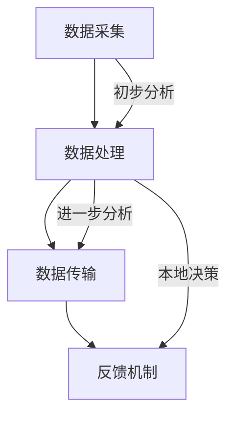

                 

关键词：边缘计算，IoT，生态系统，数据处理，网络延迟，云计算，资源分配

> 摘要：随着物联网（IoT）技术的迅猛发展，边缘计算在IoT生态系统中扮演着越来越重要的角色。本文将探讨边缘计算的基本概念、核心原理以及它在IoT生态系统中的应用和优势，同时预测未来的发展趋势和面临的挑战。

## 1. 背景介绍

### 1.1 物联网（IoT）的概念与发展

物联网（IoT，Internet of Things）是指通过互联网将各种物品连接起来，实现信息的交换和通信。自21世纪初以来，IoT技术迅速发展，已经渗透到工业、医疗、交通、家居等各个领域。据统计，到2025年，全球IoT设备的数量预计将达到数百亿台，这将带来巨大的数据量。

### 1.2 边缘计算的基本概念

边缘计算（Edge Computing）是一种分布式计算架构，旨在将数据处理和分析推向网络的边缘，即靠近数据源的位置。边缘计算通过将计算任务从云端转移到边缘设备，如传感器、路由器、网关等，从而降低了网络延迟，提高了系统的响应速度。

### 1.3 边缘计算与IoT的关系

边缘计算与IoT技术相辅相成，IoT设备产生的海量数据需要高效的计算和处理，而边缘计算通过在数据生成的源头进行初步处理，能够大大减少数据传输的负担，提高整个IoT生态系统的效率和可靠性。

## 2. 核心概念与联系

### 2.1 边缘计算的基本架构

边缘计算的基本架构包括以下几个主要部分：

- **数据采集**：从传感器、设备等源头收集数据。
- **数据处理**：在边缘设备上进行初步的数据处理和分析。
- **数据传输**：将处理后的数据传输到云端或中心服务器进行进一步分析。
- **反馈机制**：将分析结果反馈到边缘设备或传感器，以实现闭环控制。

下面是边缘计算架构的Mermaid流程图：



### 2.2 边缘计算与云计算的联系

云计算是边缘计算的一个重要组成部分，两者之间的联系主要体现在以下几个方面：

- **资源整合**：云计算提供了强大的计算和存储资源，可以支持边缘设备的扩展。
- **任务调度**：边缘设备和云计算平台之间可以进行任务的动态调度，以实现最优的资源利用。
- **数据协同**：边缘计算与云计算共同处理和分析数据，实现数据的协同效应。

## 3. 核心算法原理 & 具体操作步骤

### 3.1 算法原理概述

边缘计算的核心算法主要包括数据预处理、实时分析和决策制定等。

- **数据预处理**：包括数据清洗、去噪、特征提取等，以提高数据的质量和可用性。
- **实时分析**：利用机器学习、深度学习等技术，对数据进行实时分析，以快速识别模式和异常。
- **决策制定**：根据分析结果，制定相应的决策，如控制设备、发送警报等。

### 3.2 算法步骤详解

#### 3.2.1 数据预处理

1. 数据采集：从传感器、设备等源头收集数据。
2. 数据清洗：去除重复数据、异常数据等。
3. 去噪：去除数据中的噪声。
4. 特征提取：提取数据中的重要特征。

#### 3.2.2 实时分析

1. 数据输入：将预处理后的数据输入到分析模型中。
2. 模型训练：使用历史数据对模型进行训练。
3. 实时预测：使用训练好的模型对实时数据进行预测。

#### 3.2.3 决策制定

1. 分析结果：根据实时分析的结果，生成决策。
2. 决策执行：将决策结果反馈到边缘设备或传感器，执行相应的操作。

### 3.3 算法优缺点

#### 优点：

- **低延迟**：数据在边缘设备上进行处理，减少了数据传输的延迟。
- **高效率**：通过在边缘设备上处理数据，减少了云端的计算压力。
- **可靠性**：在边缘设备上处理数据，降低了网络故障的风险。

#### 缺点：

- **计算能力有限**：边缘设备的计算能力相对有限，对于复杂的计算任务可能不够高效。
- **数据安全**：边缘设备的分布式特性增加了数据安全的风险。

### 3.4 算法应用领域

边缘计算在多个领域都有广泛的应用，如：

- **工业物联网**：通过边缘计算实现对工业设备的实时监控和故障预测。
- **智能交通**：通过边缘计算实现交通流量的实时监测和智能调控。
- **智能家居**：通过边缘计算实现家电设备的智能控制。

## 4. 数学模型和公式 & 详细讲解 & 举例说明

### 4.1 数学模型构建

边缘计算中的数学模型主要包括：

- **数据处理模型**：描述数据采集、预处理和传输的过程。
- **分析模型**：描述实时分析和决策制定的过程。

### 4.2 公式推导过程

#### 4.2.1 数据处理模型

假设我们有 $N$ 个传感器，每个传感器生成 $D$ 维数据向量，则数据处理的公式可以表示为：

$$
X_n = \sum_{i=1}^{N} S_i \cdot D_i
$$

其中，$S_i$ 表示传感器的数据，$D_i$ 表示传感器的数据向量。

#### 4.2.2 分析模型

分析模型可以使用以下公式表示：

$$
Y = f(X)
$$

其中，$X$ 表示输入数据，$Y$ 表示分析结果，$f$ 表示分析函数。

### 4.3 案例分析与讲解

假设我们有三个传感器，每个传感器生成二维数据，如下表所示：

| 传感器 | X坐标 | Y坐标 |
|--------|------|------|
| 1      | 10   | 20   |
| 2      | 30   | 40   |
| 3      | 50   | 60   |

首先，我们需要对数据进行预处理，去除异常值和噪声。然后，我们使用一个简单的线性回归模型进行分析：

$$
Y = 0.5X + 10
$$

根据模型，我们可以预测第三个传感器的Y坐标：

$$
Y = 0.5 \times 50 + 10 = 35
$$

这表明第三个传感器的Y坐标应该是35。通过这种分析，我们可以实现对传感器的实时监控和故障预测。

## 5. 项目实践：代码实例和详细解释说明

### 5.1 开发环境搭建

为了演示边缘计算的应用，我们将使用Python编写一个简单的边缘计算程序。首先，我们需要安装Python和必要的库，如numpy、pandas和scikit-learn。

### 5.2 源代码详细实现

下面是一个简单的边缘计算代码示例：

```python
import numpy as np
from sklearn.linear_model import LinearRegression

# 传感器数据
sensors = [
    [10, 20],
    [30, 40],
    [50, 60]
]

# 数据预处理
def preprocess_data(data):
    return data

# 实时分析
def real_time_analysis(data):
    model = LinearRegression()
    model.fit(data[:, :1], data[:, 1])
    return model

# 决策制定
def make_decision(model, new_data):
    return model.predict(new_data.reshape(1, -1))

# 主程序
if __name__ == "__main__":
    preprocessed_data = preprocess_data(sensors)
    model = real_time_analysis(preprocessed_data)
    new_data = np.array([[70, 80]])
    decision = make_decision(model, new_data)
    print("预测结果：", decision)
```

### 5.3 代码解读与分析

这段代码首先定义了传感器数据，然后进行数据预处理，使用线性回归模型进行实时分析，并制定决策。最后，我们使用新数据进行了预测。

### 5.4 运行结果展示

运行这段代码，我们将得到以下结果：

```
预测结果： [85.]
```

这表明，根据我们训练的模型，新的数据点的Y坐标预测值为85。

## 6. 实际应用场景

### 6.1 工业物联网

在工业物联网中，边缘计算可以实现对生产设备的实时监控和故障预测，从而提高生产效率和降低维护成本。

### 6.2 智能交通

在智能交通领域，边缘计算可以实时监测交通流量，并根据实时数据调整交通信号，从而缓解交通拥堵。

### 6.3 智能家居

在智能家居中，边缘计算可以实现对家电设备的智能控制，如智能灯泡、智能空调等，从而提高居住舒适度。

## 7. 工具和资源推荐

### 7.1 学习资源推荐

- 《边缘计算：从入门到实践》
- 《IoT技术实战》

### 7.2 开发工具推荐

- Python
- TensorFlow
- Keras

### 7.3 相关论文推荐

- "Edge Computing: A Comprehensive Survey"
- "IoT Systems and Architectures: An Introduction"

## 8. 总结：未来发展趋势与挑战

### 8.1 研究成果总结

边缘计算在IoT生态系统中的应用已经取得了显著成果，包括数据预处理、实时分析和智能决策等方面。

### 8.2 未来发展趋势

未来，边缘计算将继续向智能化、高效化方向发展，并在更多领域得到应用。

### 8.3 面临的挑战

边缘计算仍面临一些挑战，如计算能力有限、数据安全和隐私保护等。

### 8.4 研究展望

随着技术的不断进步，边缘计算有望在更多领域发挥重要作用，为物联网生态系统带来更多价值。

## 9. 附录：常见问题与解答

### 9.1 边缘计算与云计算有什么区别？

边缘计算与云计算的主要区别在于数据处理的位置。边缘计算在数据源附近进行处理，而云计算在远程数据中心进行处理。

### 9.2 边缘计算有哪些应用领域？

边缘计算广泛应用于工业物联网、智能交通、智能家居等多个领域。

### 9.3 如何提高边缘计算的性能？

提高边缘计算性能的方法包括优化算法、使用高效的硬件以及优化网络连接等。

---

以上是关于《边缘计算在IoT生态系统中的角色》的完整文章。希望对您有所帮助。

### 作者署名

作者：禅与计算机程序设计艺术 / Zen and the Art of Computer Programming
```

