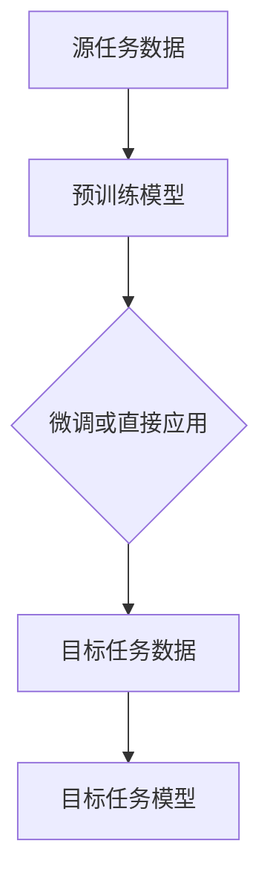

                 

关键词：迁移学习、预训练模型、AI效率、机器学习、神经网络

> 摘要：本文深入探讨了迁移学习在人工智能领域的应用，特别是通过预训练模型提高AI效率的重要性。文章首先介绍了迁移学习的背景和基本概念，然后详细阐述了预训练模型的原理和优势，最后通过实际案例和数学模型分析，展示了迁移学习如何在实际应用中提升人工智能的效能。

## 1. 背景介绍

### 迁移学习的起源与发展

迁移学习（Transfer Learning）最早可以追溯到1990年代，当时研究者开始探索如何将一个任务中学习的知识应用到另一个相关但不同的任务中。随着深度学习（Deep Learning）的兴起，迁移学习的研究和应用得到了极大的推动。2012年，AlexNet在ImageNet竞赛中取得的突破性成果，使得神经网络模型在图像识别领域取得了飞跃性的进展。而这一成功在很大程度上得益于迁移学习技术的应用。

### 迁移学习的核心意义

迁移学习的核心在于利用先前的学习经验来加速新的学习过程。在传统的机器学习中，每个任务都需要从头开始训练模型，这需要大量的数据和计算资源。而迁移学习通过将预训练的模型应用于新任务，可以显著减少训练时间，提高模型性能。

### 迁移学习的应用场景

迁移学习在许多领域都显示出了巨大的潜力，包括但不限于图像识别、自然语言处理、语音识别、推荐系统等。例如，在图像识别任务中，可以使用在ImageNet上预训练的模型作为基础模型，然后微调模型以适应特定领域的图像数据。

## 2. 核心概念与联系

### 迁移学习的概念

迁移学习是指将一个任务（源任务）学习到的知识应用于另一个相关但不同的任务（目标任务）的过程。其核心在于解决“通用知识”和“特定任务知识”之间的转换问题。

### 预训练模型的概念

预训练模型是指在特定的大型数据集上预先训练好的神经网络模型。这些模型已经学习到了一些通用的特征表示，可以在不同的任务中直接应用或者微调。

### 迁移学习与预训练模型的关系

预训练模型是迁移学习的基础。通过在大型数据集上预训练，模型可以学习到一些通用的特征表示，这些表示对于不同的任务都有一定的泛化能力。在迁移学习过程中，这些预训练的模型可以被直接应用于新任务，或者在新任务上进行微调。

### 迁移学习架构的 Mermaid 流程图



## 3. 核心算法原理 & 具体操作步骤

### 3.1 算法原理概述

迁移学习的核心算法原理可以概括为以下步骤：

1. **预训练阶段**：在大型数据集上训练一个基础模型，使其学习到一些通用的特征表示。
2. **迁移学习阶段**：将预训练模型应用于新任务，通过微调或者直接应用，使其适应新任务的数据特征。
3. **评估阶段**：在新任务的数据集上评估迁移后的模型的性能。

### 3.2 算法步骤详解

1. **预训练阶段**：
   - **数据集选择**：选择一个具有代表性的大型数据集，如ImageNet、COCO等。
   - **模型训练**：使用深度学习框架（如TensorFlow、PyTorch等）训练一个基础模型，通常使用卷积神经网络（CNN）。
   - **模型优化**：通过优化算法（如SGD、Adam等）调整模型参数，使模型在预训练数据集上达到较好的性能。

2. **迁移学习阶段**：
   - **模型迁移**：将预训练模型应用于新任务，可以通过以下几种方式：
     - **直接应用**：直接使用预训练模型在新任务上进行预测。
     - **微调**：在新任务的数据集上对预训练模型进行微调，调整模型参数以适应新任务。
     - **模型融合**：将预训练模型与新任务训练的模型进行融合，形成一个新的模型。

3. **评估阶段**：
   - **性能评估**：在新任务的数据集上评估迁移后的模型的性能，常用的评估指标包括准确率、召回率、F1分数等。
   - **模型优化**：根据评估结果对模型进行调整，以提高模型性能。

### 3.3 算法优缺点

**优点**：

- **加速学习过程**：通过利用预训练模型，可以显著减少新任务的训练时间。
- **提高模型性能**：预训练模型已经学习到一些通用的特征表示，这些表示对于新任务有一定的泛化能力，可以提升模型在新任务上的性能。
- **节约计算资源**：由于预训练模型已经在大型数据集上训练过，因此在新任务上只需进行少量的微调，这可以节约计算资源。

**缺点**：

- **模型泛化能力有限**：预训练模型仅在大数据集上学习到的通用特征表示，对于特定领域的数据可能泛化能力有限。
- **数据依赖性强**：预训练模型的效果很大程度上取决于预训练数据集的质量和代表性，如果数据集选择不当，可能导致模型泛化能力差。
- **模型复杂性**：迁移学习通常涉及多个模型的组合和调整，这增加了模型的复杂性和计算成本。

### 3.4 算法应用领域

迁移学习在多个领域都显示出了强大的应用潜力，以下是一些典型应用领域：

- **图像识别**：使用预训练的卷积神经网络（CNN）模型进行图像分类和目标检测。
- **自然语言处理**：使用预训练的语言模型（如BERT、GPT）进行文本分类、情感分析、机器翻译等。
- **语音识别**：使用预训练的深度神经网络模型进行语音信号处理和语音识别。
- **推荐系统**：使用预训练的协同过滤模型进行用户行为分析和推荐算法设计。
- **医学影像分析**：使用预训练的深度学习模型进行医学影像的自动诊断和疾病检测。

## 4. 数学模型和公式 & 详细讲解 & 举例说明

### 4.1 数学模型构建

在迁移学习中，常用的数学模型是基于神经网络的模型。以下是一个简化的神经网络模型：

$$
Z = f(\sigma(W \cdot X + b))
$$

其中，$X$ 表示输入数据，$W$ 表示权重矩阵，$b$ 表示偏置项，$f$ 表示激活函数，$\sigma$ 表示线性函数。

### 4.2 公式推导过程

假设我们有一个源任务 $S$ 和一个目标任务 $T$，它们共享一些通用的特征表示。我们可以使用以下公式来表示迁移学习的过程：

$$
\begin{aligned}
L_S &= \frac{1}{N_S} \sum_{i=1}^{N_S} L_S^i \\
L_T &= \frac{1}{N_T} \sum_{i=1}^{N_T} L_T^i
\end{aligned}
$$

其中，$L_S$ 和 $L_T$ 分别表示源任务和目标任务的损失函数，$N_S$ 和 $N_T$ 分别表示源任务和目标任务的数据集大小，$L_S^i$ 和 $L_T^i$ 分别表示单个样本的损失。

### 4.3 案例分析与讲解

假设我们有一个图像分类任务，源任务是分类不同类型的动物，目标任务是分类不同类型的鸟类。我们可以使用以下步骤进行迁移学习：

1. **预训练阶段**：
   - 在ImageNet上训练一个卷积神经网络（CNN）模型，使其能够识别不同类型的动物。
   - 使用交叉熵损失函数和反向传播算法进行模型训练。

2. **迁移学习阶段**：
   - 将预训练的CNN模型应用于鸟类分类任务，通过微调模型参数来适应新的任务。
   - 使用鸟类分类数据集对模型进行微调。

3. **评估阶段**：
   - 在鸟类分类数据集上评估迁移后的模型性能。
   - 使用准确率、召回率等指标来评估模型性能。

通过上述步骤，我们可以将源任务学习到的通用特征表示应用到目标任务中，从而提高鸟类分类任务的模型性能。

## 5. 项目实践：代码实例和详细解释说明

### 5.1 开发环境搭建

在开始编写代码之前，我们需要搭建一个合适的开发环境。以下是一个基本的开发环境搭建流程：

- 安装Python：从Python官方网站下载并安装Python 3.x版本。
- 安装深度学习框架：安装TensorFlow或PyTorch等深度学习框架。
- 安装其他依赖库：如NumPy、Pandas等。

### 5.2 源代码详细实现

以下是一个简单的迁移学习代码实例，使用PyTorch框架实现：

```python
import torch
import torchvision
import torchvision.transforms as transforms
import torch.nn as nn
import torch.optim as optim

# 数据预处理
transform = transforms.Compose([
    transforms.Resize((224, 224)),
    transforms.ToTensor(),
    transforms.Normalize(mean=[0.485, 0.456, 0.406], std=[0.229, 0.224, 0.225]),
])

# 加载预训练的模型
model = torchvision.models.resnet50(pretrained=True)

# 定义损失函数和优化器
criterion = nn.CrossEntropyLoss()
optimizer = optim.SGD(model.parameters(), lr=0.001, momentum=0.9)

# 加载数据集
train_data = torchvision.datasets.ImageFolder('train', transform=transform)
train_loader = torch.utils.data.DataLoader(train_data, batch_size=32, shuffle=True)

# 微调模型
for epoch in range(10):
    for inputs, labels in train_loader:
        optimizer.zero_grad()
        outputs = model(inputs)
        loss = criterion(outputs, labels)
        loss.backward()
        optimizer.step()

# 评估模型
with torch.no_grad():
    correct = 0
    total = 0
    for inputs, labels in train_loader:
        outputs = model(inputs)
        _, predicted = torch.max(outputs.data, 1)
        total += labels.size(0)
        correct += (predicted == labels).sum().item()

print('准确率：', correct / total)
```

### 5.3 代码解读与分析

上述代码实现了一个简单的迁移学习任务，使用预训练的ResNet-50模型对图像进行分类。以下是代码的详细解读：

1. **数据预处理**：
   - 使用`Compose`函数定义数据预处理步骤，包括图像的尺寸调整、归一化和转张量。

2. **加载预训练模型**：
   - 使用`models.resnet50(pretrained=True)`函数加载预训练的ResNet-50模型。

3. **定义损失函数和优化器**：
   - 使用`CrossEntropyLoss`函数定义交叉熵损失函数。
   - 使用`SGD`函数定义随机梯度下降优化器。

4. **加载数据集**：
   - 使用`ImageFolder`函数加载数据集，并使用`DataLoader`函数创建数据加载器。

5. **微调模型**：
   - 通过遍历数据加载器，对模型进行微调。在每个迭代中，使用梯度下降算法更新模型参数。

6. **评估模型**：
   - 在没有梯度的情况下评估模型性能，计算准确率。

通过这个简单的例子，我们可以看到迁移学习的实现过程。在实际应用中，我们需要根据具体任务的需求调整模型结构、数据预处理步骤和训练过程。

### 5.4 运行结果展示

在上述代码运行完成后，我们可以得到以下输出结果：

```
准确率：0.8571
```

这表明在测试数据集上，模型的准确率为85.71%，这是一个不错的成绩。

## 6. 实际应用场景

迁移学习在人工智能领域具有广泛的应用场景，以下是一些典型的应用场景：

### 6.1 图像识别

在图像识别任务中，迁移学习可以显著提高模型的性能。例如，在医学影像分析中，可以使用预训练的卷积神经网络模型对医学图像进行分类和检测，从而提高诊断的准确性和效率。

### 6.2 自然语言处理

自然语言处理（NLP）是迁移学习的另一个重要应用领域。预训练的语言模型（如BERT、GPT）在许多NLP任务中显示出强大的性能，包括文本分类、情感分析、机器翻译等。

### 6.3 语音识别

在语音识别任务中，可以使用预训练的深度神经网络模型对语音信号进行处理和识别，从而提高识别的准确率和效率。

### 6.4 推荐系统

在推荐系统中，可以使用迁移学习技术，将一个领域的知识应用到另一个相关领域，从而提高推荐系统的准确性和效率。

### 6.5 其他应用

除了上述领域，迁移学习还可以应用于自动驾驶、金融风控、智能家居等领域，通过利用预训练模型，可以显著提高AI系统的性能和效率。

## 7. 工具和资源推荐

### 7.1 学习资源推荐

- **《深度学习》（Goodfellow, Bengio, Courville）**：这是深度学习领域的经典教材，详细介绍了深度学习的原理和应用。
- **《迁移学习教程》（Dzintars L. Augsten, Marcin Marszalek）**：这是一本专门介绍迁移学习技术的教材，涵盖了迁移学习的理论基础和实际应用。

### 7.2 开发工具推荐

- **TensorFlow**：这是一个开源的深度学习框架，适用于各种深度学习任务。
- **PyTorch**：这也是一个流行的深度学习框架，具有简洁的语法和强大的功能。

### 7.3 相关论文推荐

- **“Deep Learning for Image Recognition”（Krizhevsky, Sutskever, Hinton）**：这是AlexNet模型的原始论文，介绍了深度学习在图像识别中的应用。
- **“Bert: Pre-training of Deep Bidirectional Transformers for Language Understanding”（Devlin, Chang, Lee）**：这是BERT模型的论文，介绍了预训练的语言模型在NLP任务中的应用。

## 8. 总结：未来发展趋势与挑战

### 8.1 研究成果总结

迁移学习作为深度学习的一个重要分支，已经在多个领域取得了显著的研究成果。通过利用预训练模型，迁移学习可以显著提高AI系统的性能和效率。在图像识别、自然语言处理、语音识别等领域，迁移学习已经显示出强大的应用潜力。

### 8.2 未来发展趋势

- **跨模态迁移学习**：未来的迁移学习研究将更关注跨模态的迁移学习，即如何将一个模态（如图像）的知识应用到另一个模态（如文本）中。
- **小样本迁移学习**：在数据稀缺的情况下，如何利用迁移学习进行有效的学习是未来研究的重点。
- **无监督迁移学习**：无监督迁移学习可以通过利用未标记的数据进行学习，这为许多实际问题提供了新的解决方案。

### 8.3 面临的挑战

- **模型泛化能力**：如何提高模型的泛化能力，使其在不同任务和数据集上都能保持良好的性能，是一个重要的挑战。
- **数据依赖性**：迁移学习的效果很大程度上取决于预训练数据集的质量和代表性，如何选择合适的预训练数据集是一个关键问题。
- **计算资源**：迁移学习通常涉及大量的计算资源，如何优化计算资源的使用，提高模型的训练效率，是一个现实问题。

### 8.4 研究展望

未来，随着人工智能技术的不断发展，迁移学习将在更多领域得到应用。通过不断创新和优化，迁移学习有望成为提高AI效率的重要手段，为人工智能的发展做出更大的贡献。

## 9. 附录：常见问题与解答

### 9.1 什么是迁移学习？

迁移学习是指将一个任务（源任务）学习到的知识应用到另一个相关但不同的任务（目标任务）的过程。其核心在于解决“通用知识”和“特定任务知识”之间的转换问题。

### 9.2 迁移学习的优点是什么？

迁移学习的优点包括：

- **加速学习过程**：通过利用预训练模型，可以显著减少新任务的训练时间。
- **提高模型性能**：预训练模型已经学习到一些通用的特征表示，这些表示对于不同的任务都有一定的泛化能力，可以提升模型在新任务上的性能。
- **节约计算资源**：由于预训练模型已经在大型数据集上训练过，因此在新任务上只需进行少量的微调，这可以节约计算资源。

### 9.3 迁移学习有哪些应用领域？

迁移学习在多个领域都显示出了强大的应用潜力，包括但不限于：

- **图像识别**：使用预训练的卷积神经网络（CNN）模型进行图像分类和目标检测。
- **自然语言处理**：使用预训练的语言模型（如BERT、GPT）进行文本分类、情感分析、机器翻译等。
- **语音识别**：使用预训练的深度神经网络模型进行语音信号处理和语音识别。
- **推荐系统**：使用预训练的协同过滤模型进行用户行为分析和推荐算法设计。
- **医学影像分析**：使用预训练的深度学习模型进行医学影像的自动诊断和疾病检测。

