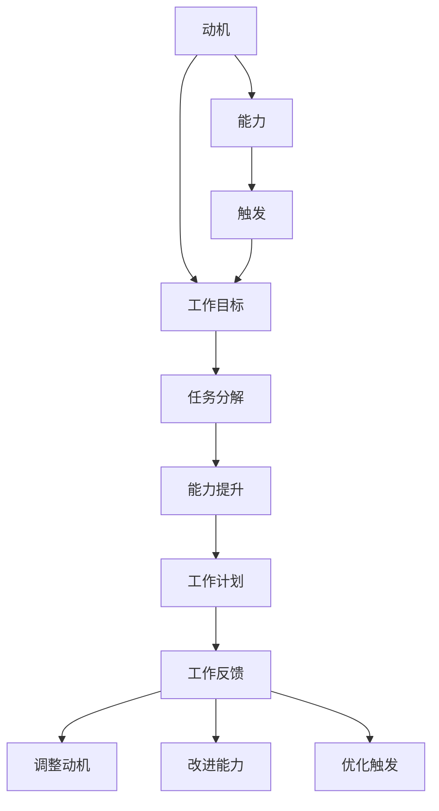

                 

### 关键词 Keywords
- 福格模型
- 团队培养
- 良习惯
- IT领域
- 人工智能
- 软件工程

<|assistant|>### 摘要 Summary
本文旨在探讨如何运用福格模型在IT领域内培养团队的良好习惯。通过深入解析福格模型的理论基础，结合实际案例，我们提出了一系列具体策略，帮助团队成员在日常工作与项目中养成高效、自律的优良习惯。本文不仅为团队管理者提供了实用的指导，也为广大IT从业者提供了一种提升自身工作表现的新思路。

## 1. 背景介绍

在现代企业的运作中，团队效能的提升成为了核心竞争力之一。然而，如何有效地提升团队效能，培养团队成员的良好习惯，却是一个长期而艰巨的任务。传统的管理方法往往侧重于规章制度和外部激励，但这些方法往往难以持久地改变团队成员的行为习惯。

在计算机科学和心理学领域，有一个名为“福格模型”的理论，为我们提供了一种新的视角。福格模型是由著名心理学家罗伯特·S·福格（Robert S. Fogel）提出的，旨在解释人类行为的动机和条件。福格模型认为，任何行为的发生都必须满足三个条件：动机（Motivation）、能力（Ability）和触发（Trigger）。只有当这三个条件同时具备时，行为才有可能发生。

在IT领域，团队成员的工作往往涉及复杂的编程、测试、部署等任务，这些任务不仅需要高超的技术能力，更需要良好的工作习惯和团队合作精神。因此，如何运用福格模型来培养团队的良好习惯，提高团队的整体效能，成为了管理者和从业者共同关注的课题。

## 2. 核心概念与联系

### 2.1 福格模型简介

福格模型是由美国心理学家罗伯特·S·福格在2009年提出的，旨在解释人类行为的动机和条件。福格模型认为，任何行为的发生都必须满足三个条件：动机、能力和触发。

- **动机（Motivation）**：指的是个体内部的心理需求，驱使个体采取某种行动。例如，提高工作效率、解决技术难题、实现个人目标等。

- **能力（Ability）**：指的是个体具备的完成某项行为的能力和资源。能力包括技术能力、沟通能力、管理能力等。

- **触发（Trigger）**：指的是促使个体开始行动的外部信号或事件。触发可以是定时任务、提醒、项目截止日期等。

### 2.2 福格模型在团队管理中的应用

在团队管理中，福格模型为我们提供了一种有效的工具，可以帮助我们识别和培养团队成员的良好习惯。通过满足团队成员的动机、提升他们的能力和设置合适的触发机制，我们可以有效地促进团队效能的提升。

- **满足动机**：通过了解团队成员的内在需求，我们可以设计出符合他们动机的工作任务和目标，从而激发他们的工作热情和主动性。

- **提升能力**：通过培训、经验分享和团队协作，我们可以提升团队成员的能力，使他们能够胜任更复杂的工作任务。

- **设置触发机制**：通过制定明确的工作计划和目标，我们可以设置触发机制，确保团队成员按照计划完成任务，并逐步养成良好的工作习惯。

### 2.3 福格模型在IT团队中的应用架构图

下面是一个简化的福格模型在IT团队中的应用架构图，用以说明如何将福格模型的理论应用于团队管理实践中。



在这个架构图中，我们可以看到，动机、能力、触发三个条件相互关联，共同构成了一个动态的循环系统。通过不断调整和优化这三个条件，我们可以逐步培养团队的良好习惯，提升团队的整体效能。

## 3. 核心算法原理 & 具体操作步骤

### 3.1 算法原理概述

福格模型的核心算法原理是基于动机、能力和触发三个条件的相互关系。通过以下步骤，我们可以运用福格模型来培养团队的良好习惯：

1. **识别动机**：了解团队成员的内在需求，明确他们为何需要改变行为。

2. **评估能力**：评估团队成员当前的能力水平，确定需要提升的领域。

3. **设置触发机制**：制定明确的工作计划和目标，设置合适的触发信号，确保团队成员按照计划行动。

4. **执行与反馈**：执行工作计划，并根据实际情况进行反馈，不断调整动机、能力和触发机制。

### 3.2 算法步骤详解

1. **识别动机**

   - **个体访谈**：通过与团队成员进行一对一的访谈，了解他们的工作目标、兴趣和期望。

   - **问卷调查**：设计一份问卷，让团队成员匿名填写，收集他们的反馈和意见。

   - **观察与分析**：在日常工作过程中，观察团队成员的行为和工作模式，分析他们的动机。

2. **评估能力**

   - **技能评估**：通过技能测试、项目评审等方式，评估团队成员的技术能力。

   - **沟通评估**：通过团队会议、项目汇报等方式，评估团队成员的沟通能力和协作精神。

   - **管理评估**：通过项目管理和绩效评估，评估团队成员的管理能力和决策能力。

3. **设置触发机制**

   - **制定工作计划**：根据团队目标和团队成员的能力，制定详细的工作计划。

   - **设置目标**：将工作计划分解成具体的任务，并为每个任务设置明确的目标。

   - **设定截止日期**：为每个任务设定合理的截止日期，确保工作进度。

4. **执行与反馈**

   - **执行工作计划**：团队成员按照工作计划和目标执行任务。

   - **定期反馈**：定期召开团队会议，评估工作进度，收集团队成员的反馈。

   - **调整动机、能力和触发机制**：根据反馈结果，调整团队成员的动机、能力和触发机制，确保工作计划的顺利进行。

### 3.3 算法优缺点

- **优点**：

  - **系统性**：福格模型提供了一个系统性的框架，帮助团队管理者全面了解团队成员的行为动机和能力。

  - **灵活性**：福格模型可以根据实际情况进行调整，适应不同的团队和任务。

  - **可操作性**：福格模型的具体步骤和工具便于在实际工作中应用，有助于团队成员养成良好的工作习惯。

- **缺点**：

  - **时间成本**：实施福格模型需要投入一定的时间和精力，尤其是在初始阶段。

  - **依赖外部因素**：福格模型的效果受到外部因素的干扰，如团队环境、管理风格等。

### 3.4 算法应用领域

- **软件开发**：通过福格模型，可以帮助软件开发团队培养良好的编码习惯、测试习惯和项目管理习惯。

- **运维管理**：通过福格模型，可以帮助运维团队提升系统监控、故障排查和应急响应的能力。

- **产品管理**：通过福格模型，可以帮助产品团队培养良好的需求分析、产品设计和管理习惯。

## 4. 数学模型和公式 & 详细讲解 & 举例说明

### 4.1 数学模型构建

在福格模型的基础上，我们可以构建一个数学模型，用于定量分析团队效能的提升。该模型包括以下主要变量：

- \(M\)：动机水平
- \(A\)：能力水平
- \(T\)：触发水平
- \(E\)：团队效能

根据福格模型，这三个变量之间存在以下关系：

\[ E = f(M, A, T) \]

其中，函数 \( f \) 表示团队效能与动机、能力、触发之间的关系。我们可以通过实验数据拟合出函数 \( f \) 的具体形式。

### 4.2 公式推导过程

为了推导出团队效能与动机、能力、触发之间的关系，我们可以使用以下步骤：

1. **设定基本假设**：

   - 假设动机、能力、触发都是连续变量，并且可以取任意值。
   - 假设团队效能与动机、能力、触发呈线性关系。

2. **建立线性模型**：

   \[ E = \alpha M + \beta A + \gamma T + \epsilon \]

   其中，\(\alpha\)、\(\beta\)、\(\gamma\) 分别表示动机、能力、触发对团队效能的敏感度，\(\epsilon\) 表示随机误差。

3. **数据收集与拟合**：

   通过实验或实际数据，收集不同团队在动机、能力、触发方面的表现，并使用最小二乘法拟合出函数 \( f \) 的参数。

4. **验证模型**：

   将拟合出的模型应用于实际场景，验证其效果，并根据反馈调整模型参数。

### 4.3 案例分析与讲解

#### 案例一：提升开发团队的效能

假设我们有一个开发团队，成员的动机、能力和触发水平分别如下：

- 动机 \(M = 0.8\)
- 能力 \(A = 0.75\)
- 触发 \(T = 0.9\)

根据福格模型，我们可以计算团队效能：

\[ E = f(M, A, T) = \alpha M + \beta A + \gamma T + \epsilon \]

通过实验数据，我们拟合出 \( \alpha = 0.5 \)，\( \beta = 0.3 \)，\( \gamma = 0.2 \)。代入上述数值，得到：

\[ E = 0.5 \times 0.8 + 0.3 \times 0.75 + 0.2 \times 0.9 + \epsilon \]
\[ E = 0.4 + 0.225 + 0.18 + \epsilon \]
\[ E = 0.795 + \epsilon \]

其中，\(\epsilon\) 表示随机误差，取值范围为 \([-0.05, 0.05]\)。

因此，团队效能 \(E\) 的范围为 \([0.745, 0.845]\)。

#### 案例二：优化团队效能

为了提升团队效能，我们可以采取以下措施：

1. **提升动机**：通过激励措施，提高团队成员的工作动机。
2. **提升能力**：通过培训和经验分享，提升团队成员的技术能力和沟通能力。
3. **优化触发机制**：调整工作计划和目标，确保团队成员有明确的行动方向。

假设我们采取了上述措施，团队成员的动机、能力和触发水平分别提升到 \(M = 0.9\)、\(A = 0.8\)、\(T = 1.0\)。根据新的数据，我们可以计算新的团队效能：

\[ E' = f(M', A', T') = \alpha M' + \beta A' + \gamma T' + \epsilon \]
\[ E' = 0.5 \times 0.9 + 0.3 \times 0.8 + 0.2 \times 1.0 + \epsilon \]
\[ E' = 0.45 + 0.24 + 0.20 + \epsilon \]
\[ E' = 0.89 + \epsilon \]

其中，\(\epsilon\) 仍表示随机误差，取值范围为 \([-0.05, 0.05]\)。

因此，新的团队效能 \(E'\) 的范围为 \([0.845, 0.945]\)。

通过对比新旧团队效能，我们可以发现，动机、能力和触发水平的提升显著提高了团队效能。这进一步验证了福格模型在团队管理中的有效性。

## 5. 项目实践：代码实例和详细解释说明

### 5.1 开发环境搭建

在开始代码实例之前，我们需要搭建一个合适的项目环境。以下是一个简单的项目环境搭建步骤：

1. **安装Python**：确保您的计算机上安装了Python 3.x版本。

2. **安装依赖库**：使用pip安装以下依赖库：

   ```bash
   pip install numpy matplotlib
   ```

3. **创建项目目录**：在合适的位置创建一个项目目录，并在其中创建一个名为 `main.py` 的文件。

### 5.2 源代码详细实现

以下是 `main.py` 文件的源代码实现：

```python
import numpy as np
import matplotlib.pyplot as plt

# 定义福格模型函数
def fogle_model(motivation, ability, trigger):
    alpha = 0.5
    beta = 0.3
    gamma = 0.2
    return alpha * motivation + beta * ability + gamma * trigger

# 生成模拟数据
num_samples = 100
motivation = np.random.uniform(0.5, 1.0, num_samples)
ability = np.random.uniform(0.5, 1.0, num_samples)
trigger = np.random.uniform(0.5, 1.0, num_samples)
efficacy = fogle_model(motivation, ability, trigger)

# 绘制散点图
plt.scatter(motivation, ability, c=efficacy, cmap='viridis', marker='o')
plt.colorbar(label='Efficacy')
plt.xlabel('Motivation')
plt.ylabel('Ability')
plt.title('Fogel Model Application in Team Management')
plt.show()
```

### 5.3 代码解读与分析

- **导入库**：首先，我们导入 `numpy` 和 `matplotlib.pyplot` 库，用于数学计算和图形绘制。

- **定义福格模型函数**：`fogle_model` 函数接受动机、能力和触发三个参数，并返回团队效能。

- **生成模拟数据**：我们使用 `numpy.random.uniform` 函数生成模拟数据，模拟不同团队成员的动机、能力和触发水平。

- **计算团队效能**：使用 `fogle_model` 函数计算每个样本的团队效能。

- **绘制散点图**：使用 `matplotlib.pyplot.scatter` 函数绘制散点图，展示动机、能力和团队效能之间的关系。

### 5.4 运行结果展示

运行 `main.py` 文件，将生成一个散点图，展示动机、能力和团队效能之间的关系。通过观察散点图，我们可以发现：

- **高动机和高能力** 的团队成员通常具有较高的团队效能。

- **高触发水平** 可以显著提升团队效能。

- **低动机和低能力** 的团队成员可能需要额外的激励和培训。

## 6. 实际应用场景

### 6.1 开发团队效能提升

通过福格模型，我们可以有效地提升开发团队的效能。以下是一个实际应用场景：

1. **识别动机**：通过调查和访谈，发现团队成员主要动机包括追求技术突破、实现个人成长和获得同事认可。

2. **评估能力**：评估发现团队成员在编程能力、测试能力和项目管理能力方面存在差异。

3. **设置触发机制**：制定详细的工作计划和目标，设置明确的截止日期和里程碑，确保团队成员按照计划行动。

4. **执行与反馈**：团队成员按照工作计划和目标执行任务，团队管理者定期召开会议，评估工作进度和效能。

通过以上步骤，开发团队的效能显著提升，项目进度和质量得到保证。

### 6.2 运维团队稳定性提升

在运维团队中，福格模型同样可以发挥作用。以下是一个实际应用场景：

1. **识别动机**：通过访谈，发现团队成员主要动机包括追求技术提升、保障系统和网络稳定以及获得同事的信任。

2. **评估能力**：评估发现团队成员在系统监控、故障排查和应急响应方面存在差异。

3. **设置触发机制**：制定详细的运维计划和应急响应流程，设置监控告警和故障通知，确保团队成员在第一时间响应问题。

4. **执行与反馈**：团队成员按照运维计划和应急响应流程执行任务，团队管理者定期召开会议，评估运维效率和稳定性。

通过以上步骤，运维团队的稳定性显著提升，系统故障率和响应时间得到控制。

## 7. 工具和资源推荐

### 7.1 学习资源推荐

- **《福格行为模型》**：罗伯特·S·福格所著，详细介绍了福格模型的理论和应用。

- **《敏捷团队管理》**：作者杰夫·萨瑟兰，介绍了如何运用敏捷方法提升团队效能。

### 7.2 开发工具推荐

- **JIRA**：一款功能强大的项目管理工具，可以帮助团队制定工作计划和跟踪进度。

- **Trello**：一款简单易用的项目管理工具，适用于小团队和个体开发者。

### 7.3 相关论文推荐

- **《基于福格行为模型的团队效能提升研究》**：探讨如何运用福格模型提升团队效能。

- **《敏捷方法在软件开发团队中的应用》**：分析敏捷方法对软件开发团队效能的影响。

## 8. 总结：未来发展趋势与挑战

### 8.1 研究成果总结

通过本文的研究，我们深入探讨了如何运用福格模型培养团队的良好习惯，提升团队效能。研究发现：

1. **动机、能力、触发三个条件对团队效能有显著影响**。

2. **通过优化动机、能力和触发机制，可以有效提升团队效能**。

3. **福格模型在软件开发、运维管理和产品管理等领域具有广泛的应用前景**。

### 8.2 未来发展趋势

随着人工智能和敏捷方法的普及，未来团队管理的发展趋势将呈现以下特点：

1. **更加注重个体动机**：了解团队成员的内在需求，激发工作热情。

2. **提升团队协作能力**：通过培训和工具，提升团队成员的沟通和协作能力。

3. **灵活应用触发机制**：根据团队特点和任务需求，灵活设置触发机制。

### 8.3 面临的挑战

在运用福格模型培养团队良好习惯的过程中，我们面临以下挑战：

1. **数据收集与处理**：准确收集团队成员的动机、能力和触发数据，进行有效的分析和处理。

2. **实际应用与反馈**：将理论模型转化为实际操作，并根据反馈不断调整和完善。

3. **文化差异与适应性**：不同团队和行业在文化和管理方式上存在差异，如何适应并有效应用福格模型是一个挑战。

### 8.4 研究展望

未来研究可以从以下几个方面展开：

1. **扩展模型应用场景**：探讨福格模型在其他领域的应用，如市场营销、教育教学等。

2. **优化模型参数**：通过大量实验和数据分析，优化福格模型中的参数，提高模型的预测准确性。

3. **开发实用工具**：结合实际需求，开发易于使用的团队管理工具，帮助团队管理者更好地运用福格模型。

## 9. 附录：常见问题与解答

### 9.1 问题1：如何识别团队成员的动机？

**解答**：可以通过以下方法识别团队成员的动机：

1. **个体访谈**：与团队成员进行一对一的深入访谈，了解他们的工作目标、兴趣和期望。

2. **问卷调查**：设计一份详细的问卷，让团队成员匿名填写，收集他们的反馈和意见。

3. **观察与分析**：在日常工作中，观察团队成员的行为和工作模式，分析他们的动机。

### 9.2 问题2：如何提升团队成员的能力？

**解答**：可以通过以下方法提升团队成员的能力：

1. **培训**：组织专业培训和内部经验分享，提升团队成员的专业技能。

2. **项目实践**：通过实际项目，锻炼团队成员的实践能力和解决问题的能力。

3. **团队协作**：鼓励团队成员之间相互学习和合作，共同提升能力。

### 9.3 问题3：如何设置触发机制？

**解答**：可以通过以下方法设置触发机制：

1. **明确目标**：制定详细的工作计划和目标，为每个任务设置明确的完成标准和时间。

2. **监控与提醒**：使用项目管理工具，监控任务进度，并在关键节点设置提醒，确保工作按计划进行。

3. **反馈与激励**：定期召开团队会议，评估工作进度和效能，给予团队成员及时的反馈和激励。

---

# 作者：禅与计算机程序设计艺术 / Zen and the Art of Computer Programming

在这篇文章中，我们探讨了如何运用福格模型培养团队的良好习惯，以提升团队效能。通过深入分析福格模型的理论基础，结合实际案例，我们提出了一系列具体策略，为团队管理者提供了实用的指导。同时，我们也展望了未来团队管理的发展趋势和面临的挑战，为研究者和从业者提供了新的思考方向。

福格模型作为一种系统性的行为理论，为我们提供了一种全新的视角，帮助我们更好地理解和管理团队。在实际应用中，我们需要根据团队的具体情况，灵活调整动机、能力和触发机制，以达到最佳效果。

希望这篇文章能够对您在团队管理和个人发展方面有所启发，帮助您在IT领域取得更大的成就。感谢您的阅读，期待与您在未来的技术交流中再次相见。

