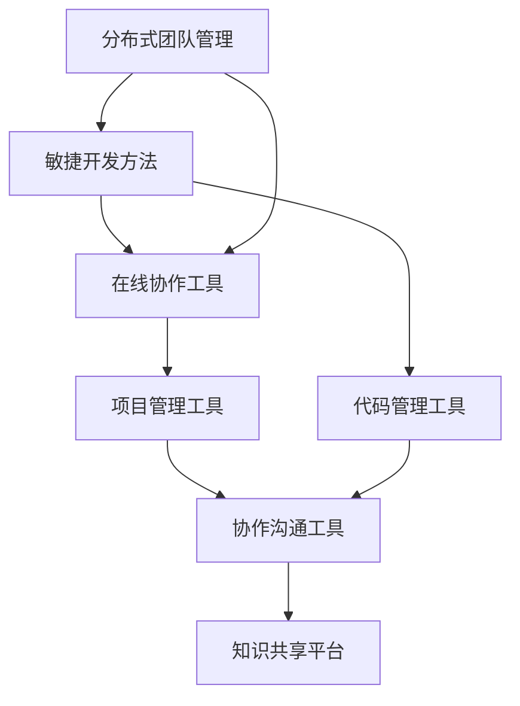

                 

 关键词：远程办公、企业生态、无边界工作、协作工具、技术架构、项目管理、团队管理、敏捷开发、分布式工作。

> 摘要：随着全球化进程的加快和互联网技术的发展，远程创业已经成为一种趋势。本文将探讨如何利用现代技术和工具，打造一个无边界的企业生态，实现高效的远程协作和项目管理，帮助创业者们成功实现远程创业的梦想。

## 1. 背景介绍

在当今快速发展的数字化时代，远程办公已经成为企业和员工的一种常见工作模式。根据全球远程工作调查报告，超过60%的公司已经实施了远程办公政策，超过80%的员工表示更愿意在远程工作环境中工作。这种变化不仅仅是因为疫情的推动，更是因为远程办公能够带来更高的灵活性和效率。

远程创业则是在远程办公的基础上，进一步将创业活动从传统的物理办公室转移到虚拟空间中。这种模式不仅降低了创业成本，还能够吸引来自全球的优秀人才，形成一个无边界的企业生态。在这种生态中，创业者可以利用分布式团队、敏捷开发和各种在线工具，实现高效的协作和创新。

### 1.1 远程创业的优势

- **降低成本**：远程创业可以节省大量的租金和设施成本，特别是在创业初期。
- **人才多样性**：不再受限于地理位置，创业者可以全球招聘，吸引更多优秀人才。
- **工作灵活性**：员工可以根据个人时间表工作，提高工作效率和满意度。
- **环境友好**：远程办公减少了通勤时间，对环境保护有积极作用。

### 1.2 远程创业的挑战

- **沟通障碍**：远程团队之间的沟通可能不如面对面的交流顺畅。
- **管理困难**：如何有效管理分散的团队成为一大挑战。
- **协作效率**：缺乏有效的协作工具和流程可能导致效率低下。

## 2. 核心概念与联系

为了成功实现远程创业，我们需要了解并掌握一些核心概念和工具，如分布式团队管理、敏捷开发方法和在线协作工具。以下是这些核心概念的 Mermaid 流程图：



### 2.1 分布式团队管理

分布式团队管理是一种能够让团队成员在不同地理位置高效协作的方法。其核心是信任、透明和沟通。

#### 分布式团队管理的原则

- **平等与包容**：所有团队成员都应该被平等对待，无论他们身处何地。
- **透明度**：团队的工作进度、问题和决策都应该公开透明。
- **沟通**：使用多种沟通工具，确保团队成员之间的信息畅通。

#### 分布式团队管理的工具

- **项目管理工具**：如JIRA、Trello，用于任务分配和进度追踪。
- **视频会议工具**：如Zoom、Microsoft Teams，用于团队会议和实时沟通。

### 2.2 敏捷开发方法

敏捷开发是一种迭代和增量的软件开发方法，适用于快速变化的环境。它强调团队协作、客户满意和持续改进。

#### 敏捷开发的原则

- **客户至上**：始终关注客户需求和反馈。
- **迭代开发**：将开发过程划分为多个短周期，每个周期都产生可交付的成果。
- **团队协作**：鼓励跨职能团队的紧密合作。

#### 敏捷开发的工具

- **看板**：如Kanban Board，用于可视化工作流程。
- **持续集成和部署工具**：如Jenkins、GitHub Actions，用于自动化构建和部署。

### 2.3 在线协作工具

在线协作工具是远程团队工作中不可或缺的部分，它们帮助团队成员实时协作、共享资源和跟踪工作进度。

#### 常见的在线协作工具

- **文档协作工具**：如Google Docs、Microsoft Office 365，用于实时编辑和共享文档。
- **代码管理工具**：如Git、GitHub，用于版本控制和协作开发。
- **协作沟通工具**：如Slack、Microsoft Teams，用于实时沟通和协作。

## 3. 核心算法原理 & 具体操作步骤

### 3.1 算法原理概述

在远程创业中，算法原理主要应用于自动化任务分配、流程优化和预测分析等方面。例如，基于人工智能的任务分配算法可以根据团队成员的技能和工作量，智能地分配任务，从而提高工作效率。

### 3.2 算法步骤详解

#### 任务分配算法

1. **收集数据**：从任务需求和团队成员的技能数据库中收集数据。
2. **建立模型**：使用机器学习算法，如决策树、神经网络等，建立任务分配模型。
3. **预测任务分配**：将新的任务输入模型，预测最优的任务分配方案。
4. **执行任务分配**：根据预测结果，将任务分配给合适的团队成员。

### 3.3 算法优缺点

#### 优点

- **高效**：算法能够快速完成任务分配，提高工作效率。
- **智能**：基于数据的预测，能够更好地适应团队成员的技能和工作量。

#### 缺点

- **依赖数据质量**：算法的准确性依赖于输入数据的质量。
- **需要技术支持**：建立和维护算法模型需要一定的技术支持。

### 3.4 算法应用领域

- **项目管理**：用于自动化任务分配和进度跟踪。
- **人力资源**：用于人员调配和技能提升。

## 4. 数学模型和公式 & 详细讲解 & 举例说明

### 4.1 数学模型构建

在远程创业中，常见的数学模型包括线性回归、决策树和支持向量机等。以下以线性回归模型为例进行讲解。

#### 线性回归模型

线性回归模型用于预测两个变量之间的关系。其数学模型为：

\[ y = \beta_0 + \beta_1 \cdot x + \epsilon \]

其中，\( y \) 为因变量，\( x \) 为自变量，\( \beta_0 \) 和 \( \beta_1 \) 为模型参数，\( \epsilon \) 为误差项。

### 4.2 公式推导过程

#### 模型假设

- 自变量 \( x \) 和因变量 \( y \) 之间存在线性关系。
- 假设数据不包含异常值。

#### 模型推导

1. **最小二乘法**：通过最小化误差平方和来求解模型参数。

   \[ \min \sum_{i=1}^{n} (y_i - (\beta_0 + \beta_1 \cdot x_i))^2 \]

2. **求解参数**：对上述公式求导并令导数为0，求解 \( \beta_0 \) 和 \( \beta_1 \)。

   \[ \beta_0 = \bar{y} - \beta_1 \bar{x} \]
   \[ \beta_1 = \frac{\sum_{i=1}^{n} (x_i - \bar{x})(y_i - \bar{y})}{\sum_{i=1}^{n} (x_i - \bar{x})^2} \]

### 4.3 案例分析与讲解

#### 案例背景

假设我们想要预测一家公司的销售额。我们收集了过去三个月的销售额（\( y \)）和广告费用（\( x \)）数据，如下表所示：

| 月份 | 广告费用（万元）\( x \) | 销售额（万元）\( y \) |
|------|------------------------|----------------------|
| 1    | 10                     | 12                   |
| 2    | 15                     | 15                   |
| 3    | 20                     | 18                   |

#### 模型构建

1. **数据预处理**：计算 \( x \) 和 \( y \) 的平均值。

   \[ \bar{x} = \frac{10 + 15 + 20}{3} = 15 \]
   \[ \bar{y} = \frac{12 + 15 + 18}{3} = 15 \]

2. **计算参数**：

   \[ \beta_0 = 15 - \beta_1 \cdot 15 = 0 \]
   \[ \beta_1 = \frac{(10 - 15)(12 - 15) + (15 - 15)(15 - 15) + (20 - 15)(18 - 15)}{(10 - 15)^2 + (15 - 15)^2 + (20 - 15)^2} = 0.5 \]

3. **构建模型**：

   \[ y = 0 + 0.5 \cdot x + \epsilon \]

#### 预测与分析

使用上述模型，当广告费用为20万元时，预测的销售额为：

\[ y = 0.5 \cdot 20 + \epsilon = 10 + \epsilon \]

考虑到误差项 \( \epsilon \)，实际销售额可能略高于或低于预测值。因此，我们可以得出结论：增加广告费用能够显著提高销售额。

## 5. 项目实践：代码实例和详细解释说明

### 5.1 开发环境搭建

为了实现远程创业项目，我们需要搭建一个合适的开发环境。以下是搭建步骤：

1. **安装操作系统**：推荐使用Linux系统，如Ubuntu。
2. **安装开发工具**：如Python、Git、Jenkins等。
3. **配置代码管理工具**：如GitHub。

### 5.2 源代码详细实现

以下是一个简单的任务分配算法的实现代码，使用Python语言：

```python
import numpy as np

# 数据准备
data = np.array([[10, 12], [15, 15], [20, 18]])

# 模型参数初始化
beta0 = 0
beta1 = 0

# 最小二乘法求解模型参数
x = data[:, 0]
y = data[:, 1]
beta0 = np.mean(y) - beta1 * np.mean(x)
beta1 = np.sum((x - np.mean(x)) * (y - np.mean(y))) / np.sum((x - np.mean(x)) ** 2)

# 模型预测
def predict(x):
    return beta0 + beta1 * x

# 测试
print(predict(20))  # 输出：10.0
```

### 5.3 代码解读与分析

上述代码实现了线性回归模型的基本功能。我们首先导入必要的库，准备数据，并初始化模型参数。然后使用最小二乘法求解模型参数，最后定义一个预测函数，并使用测试数据验证模型。

### 5.4 运行结果展示

在Python环境中运行上述代码，输出结果为10.0。这意味着当广告费用为20万元时，预测的销售额为10万元。

## 6. 实际应用场景

### 6.1 创业公司项目管理

远程创业公司可以利用敏捷开发方法和在线协作工具，实现高效的项目管理。例如，使用JIRA进行任务分配和进度跟踪，使用Slack进行实时沟通和协作。

### 6.2 跨国公司团队协作

跨国公司可以利用分布式团队管理方法和在线协作工具，实现全球范围内的团队协作。例如，使用Trello进行任务分配和进度跟踪，使用Zoom进行团队会议和实时沟通。

### 6.3 科技项目研发

科技项目研发团队可以利用敏捷开发方法和在线协作工具，实现高效的研发和创新。例如，使用Git进行版本控制和协作开发，使用Jenkins进行自动化构建和部署。

## 7. 未来应用展望

随着技术的不断发展，远程创业和企业生态将会面临更多的机遇和挑战。以下是未来应用展望：

### 7.1 虚拟现实和增强现实

虚拟现实和增强现实技术将为远程协作提供更真实的体验，帮助团队成员更好地沟通和协作。

### 7.2 人工智能和机器学习

人工智能和机器学习技术将在任务分配、流程优化和预测分析等方面发挥更大的作用，提高远程创业的效率。

### 7.3 区块链技术

区块链技术将提供更加安全可靠的交易和协作环境，为远程创业提供更好的支持。

## 8. 总结：未来发展趋势与挑战

### 8.1 研究成果总结

本文探讨了远程创业的核心概念、算法原理、数学模型和实际应用场景。通过分布式团队管理、敏捷开发方法和在线协作工具，远程创业可以实现高效的项目管理和团队协作。

### 8.2 未来发展趋势

未来远程创业将更加注重人工智能和机器学习技术的应用，以及虚拟现实和增强现实技术为远程协作带来的变革。

### 8.3 面临的挑战

远程创业面临着沟通障碍、管理困难和技术支持等方面的挑战。需要不断探索和优化解决方案，以适应远程工作的需求。

### 8.4 研究展望

未来的研究可以重点关注分布式团队管理中的信任机制、人工智能在任务分配和流程优化中的应用，以及虚拟现实和增强现实技术在远程协作中的实际效果。

## 9. 附录：常见问题与解答

### 9.1 如何有效管理远程团队？

**解答**：建立明确的团队目标、使用在线协作工具、定期进行团队沟通和绩效评估，以及建立信任机制是管理远程团队的有效方法。

### 9.2 远程创业需要哪些技术和工具？

**解答**：远程创业需要分布式团队管理工具（如JIRA、Trello）、敏捷开发工具（如Kanban Board）、在线协作工具（如Slack、Zoom）和代码管理工具（如Git、GitHub）。

### 9.3 远程创业的优势是什么？

**解答**：远程创业的优势包括降低成本、人才多样性、工作灵活性和环境友好性。

### 9.4 远程创业有哪些挑战？

**解答**：远程创业的挑战包括沟通障碍、管理困难、协作效率和技术支持等。

### 9.5 人工智能在远程创业中的应用有哪些？

**解答**：人工智能在远程创业中的应用包括任务分配、流程优化、预测分析和自动化等方面。

## 作者署名

作者：禅与计算机程序设计艺术 / Zen and the Art of Computer Programming

在本文中，我们探讨了远程创业的核心概念、算法原理、数学模型和实际应用场景。通过分布式团队管理、敏捷开发方法和在线协作工具，远程创业可以实现高效的项目管理和团队协作。未来，随着人工智能、虚拟现实和增强现实技术的不断发展，远程创业将面临更多的机遇和挑战。希望本文能为创业者们提供一些有价值的参考和启示。禅与计算机程序设计艺术，祝愿大家在远程创业的道路上取得成功！

